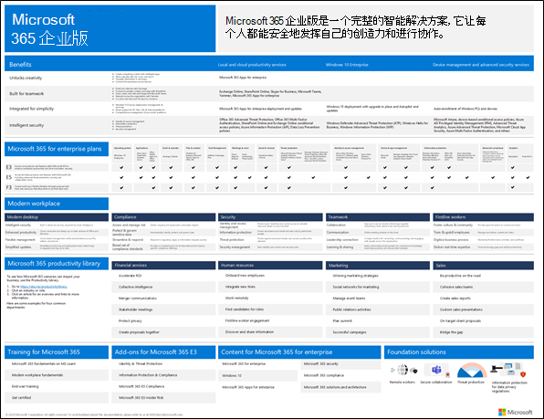
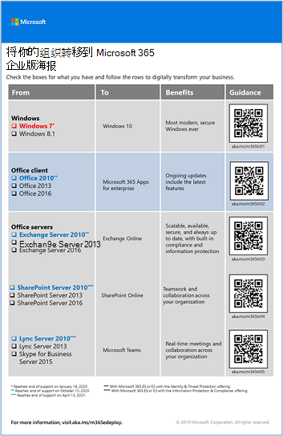
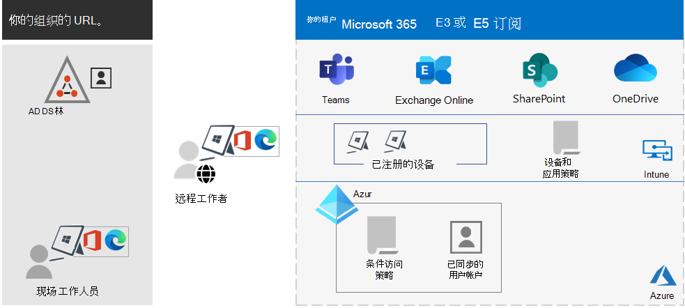
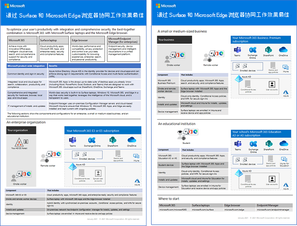

# Microsoft 365 企业版概述

Microsoft 365 企业版是一个完整的智能解决方案，它让每个人都能安全地发挥自己的创造力和进行协作。

尽管 Microsoft 365 企业版专为大型组织设计，但也可用于需要最先进的安全性和生产力功能的中小型企业。

## 组件

Microsoft 365 企业版包括：

|服务|Description|
|---|---|
|本地和基于云的应用和生产力服务|包括 Microsoft 365 企业应用版、适用于 PC 和 Mac 的最新 Office 应用（例如 Word、Excel、PowerPoint、Outlook 和其他应用），以及用于电子邮件、文件存储和协作、会议等的一整套在线服务。|
|Windows 10 企业版|满足了大型和中型组织的需求。对用户来说，它是最具生产力和安全性的 Windows 版本。对于 IT 专业人士来说，它还提供全面的部署、设备和应用管理。|
|设备管理和高级安全服务|包括 Microsoft Intune，这是一种基于云的企业移动管理服务，可帮助员工提高工作效率，同时保护组织数据。|
|||

## 计划

Microsoft 365 企业版可通过三种计划获取。

|计划名称|功能|
|---|---|
|E3|访问 Microsoft 365 核心产品和功能，安全地提高工作场所工作效率并促进创新。|
|E5|访问 Microsoft 365 最新产品和功能。 其中包括适用于 Office 365 的 Defender、安全工具和协作工具。 此计划包括 E3 的所有功能以及高级安全、语音和数据分析工具。|
|F3|通过专门构建的工具和资源与一线员工联系，帮助他们发挥出最大潜能。|
|||

如果你有 Microsoft 365 E3，还可以获取以下加载项：

- 标识和威胁防护
- 信息保护和合规性
- [Microsoft 365 E5 合规](https://www.microsoft.com/microsoft-365/business/e5-compliance)
- Microsoft 365 E5 内部风险

Microsoft 365 E3 用户可以使用这些加载项来利用 Microsoft 365 E5 包含的某些其他功能。

有关详细信息，请参阅[每个计划的特性和功能](https://www.microsoft.com/microsoft-365/compare-all-microsoft-365-plans)。

## 了解整体情况

[Microsoft 365 企业版海报](../downloads/Microsoft365Enterprise.pdf)是一个可查看以下内容的中心位置：

- Microsoft 365 企业版的优势以及应用和服务如何与其价值支柱相匹配。
- Microsoft 365 企业版计划及其包含的组件。
- Microsoft 新式工作场所的关键组件（Microsoft 365 企业版支持这些组件）。
- [Microsoft 365 生产力库](https://www.microsoft.com/microsoft-365/success/)和适用于某些常见组织部门的代表方案。

也可[下载海报的副本](https://github.com/MicrosoftDocs/microsoft-365-docs/raw/public/microsoft-365/downloads/Microsoft365Enterprise.pdf)。

## 转换整个组织

若要更好地了解如何将整个组织转移到 Microsoft 365 企业版中的产品和服务，请参阅[转换海报](https://download.microsoft.com/download/2/c/7/2c7bcc04-aae3-4604-9707-1ffff66b9851/transition-org-to-m365.pdf)。

通过这份两页的海报可以快速清点现有基础结构。 它可以帮助你查找指南，并转到 Microsoft 365 企业版中的相应产品或服务。 它包含 Windows 和 Office 产品，还涵盖了设备管理、标识及信息和威胁防护等其他基础结构和安全元素。

## Office 2010 客户端和服务器及 Windows 7 的支持终止

对 [Windows 7](https://aka.ms/win7upgrade) 的支持已于 **2020 年 1 月 14 日** 终止。

我们于 **2020 年 10 月 13 日** 终止对以下产品的支持：

- [Office 2010](/DeployOffice/office-2010-end-support-roadmap)
- [Exchange Server 2010](exchange-2010-end-of-support.md)

对 [SharePoint Server 2010](upgrade-from-sharepoint-2010.md) 的支持将于 **2021 年 4 月 13 日** 终止。

有关这些产品的升级、迁移和移动到云选项的直观摘要，请参阅[停止提供支持海报](../downloads/Office2010Windows7EndOfSupport.pdf)。

此海报包含一页内容，可帮助快速了解用于避免 Office 2010 客户端和服务器产品及 Windows 7 的支持终止的各种方式，突出显示了 Microsoft 365 企业版中的首选方式和支持。

还可以[下载此海报](https://github.com/MicrosoftDocs/microsoft-365-docs/raw/public/microsoft-365/downloads/Office2010Windows7EndOfSupport.pdf)并按 letter、legal 或 tabloid (11 x 17) 格式打印。

## 规划和部署

规划和部署 Microsoft 365 企业版的产品、功能和组件有三种方法：

- 与 FastTrack 合作

   借助 FastTrack，Microsoft 工程师可帮助你按照自己的节奏迁移到云。请参阅 [FastTrack for Microsoft 365](https://fasttrack.microsoft.com/microsoft365)。

- 在 Microsoft 咨询服务或 [Microsoft 合作伙伴](https://partner.microsoft.com/)的协助下进行

   顾问可以分析当前的基础结构，帮助你制定集成 Microsoft 365 企业版的所有软件和服务的计划。

- 自行完成

   从[网络路线图](networking-roadmap-microsoft-365.md)开始，构建或验证现有基础结构和生产力工作负载。

有关虚构但具有代表性的跨国组织如何部署 Microsoft 365 企业版的示例，请参阅 [Contoso Corporation 案例研究](contoso-overview.md)。

## 其他 Microsoft 365 产品

- [Microsoft 365 商业高级版](../admin/index.yml)

  将一流的生产力和协作功能与设备管理和安全解决方案汇集在了一起，可为中小型企业保护业务数据的安全。

- [Microsoft 365 教育版](/education)

  通过为教育版构建单一、价格合理的解决方案，使教育工作者可以充分发挥创造力、提升团队合作，并提供安全易用的用户体验。

- [Microsoft 365 政府版](https://www.microsoft.com/microsoft-365/government)

  使美国公共事业员工能够安全地协同工作。

## 通过 Surface 和 Microsoft Edge 浏览器协同工作效果最佳

利用 Microsoft 365 企业版、Microsoft Surface 设备和 Microsoft Edge 浏览器的最佳组合，优化用户的集成和安全生产力。这种跨产品的整合提供了:

- 通用身份和登录安全基础结构。
- 集成本地和云应用，实现搜索、协作、高效和合规性。
- 针对硬件、浏览器、本地应用和云应用全面集成的安全性。
- 适用于安装和更新 IT 管理的通用基础结构。

下面是企业组织的示例。

有关中小型企业和教育机构的详细信息和配置示例，请下载[最佳组合海报](https://download.microsoft.com/download/2/8/d/28db0cf9-2f5a-4f63-91e2-46ff5c4d3baf/microsoft-best-together-poster.pdf)。

## Microsoft 365 培训

若要了解有关 Microsoft 365 的更多信息并努力获得 Microsoft 365 认证，可以从 [Microsoft 365认证：基础知识](/learn/paths/m365-fundamentals/)开始。

## 另请参阅

[Microsoft 365 企业版产品页](https://www.microsoft.com/microsoft-365/enterprise)