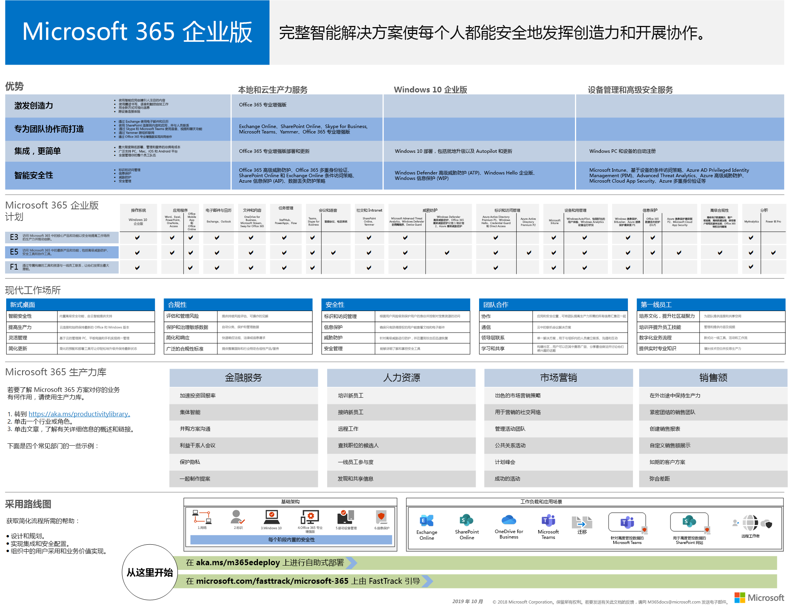

# Microsoft 365 企业版概述

Microsoft 365 企业版是完整、 智能解决方案，使所有人都是创作和安全地协同工作。 

尽管对于大型组织设计，可以还使用需要最高级的安全和提高工作效率功能的中型和小型企业的 Microsoft 365 企业版。 

## 组件

Microsoft 365 企业版组成：

|||
|:-------|:-----|
| Office 365 Enterprise | 包含两个 Office 365 ProPlus，您的 PC 和 Mac （如 Word、 Excel、 PowerPoint、 Outlook 和其他人），以及一套完整的电子邮件、 文件存储和协作、 会议和更多的联机服务的最新 Office 应用程序。 |
| Windows 10 企业版 | 解决大型和中型组织中，为用户提供最高效且安全的 Windows 版本的需求和 IT 专业人员提供全面部署、 设备和应用程序管理。 |
| 企业移动 + 安全 (EMS) | 包含 Microsoft Intune，这是一种基于云的企业移动管理 (EMM) 服务，帮助使您能够同时保持企业数据保护高效工作的员工。 |
|||

## 计划

Microsoft 365 Enterprise 是三个计划中可用。

|||
|:-------|:-----|
| E3 | 包含 Office 365 企业版，Windows 10 Enterprise 和企业移动 + 安全 (EMS)。 |
| E5 | 包含所有 E3 的功能以及高级的安全、 语音和数据分析工具。 |
| F1 | 连接到的工具和资源需要工作做到最好的 firstline 工作者，专门而构建。Firstline 工作者的行中的第一个与您的客户和表示您的公司品牌和值 |
|||

有关详细信息，请参阅[特性和功能的每个计划](https://www.microsoft.com/microsoft-365/compare-all-microsoft-365-plans)。

## 一个一览

[Microsoft 365 Enterprise 海报](http://aka.ms/m365eposter)，可以查看的中心位置：

- 产品和 Microsoft 365 Enterprise 和如何将它们映射到其值功能的功能
- Microsoft 365 Enterprise 计划和它们包含的组件 
- 现代工作场所，使 Microsoft 365 Enterprise 的主要组件
- Microsoft 365 enterprise 的关键业务值方案的服务和产品，使其发生
- 采用路线图突出显示 Microsoft 365 企业版[部署指南](deploy-microsoft-365-enterprise.md)

若要下载海报的副本，请单击[此处](https://github.com/MicrosoftDocs/microsoft-365-docs/raw/public/microsoft-365/enterprise/media/Microsoft365Enterprise.pdf)。

## 部署

有两种方法可以部署产品、 功能和 Microsoft 365 enterprise 的组件：

1. 在与 FastTrack 合作关系
  
   使用 FastTrack，Microsoft 工程师帮助您将移动到您自己的步调云。请参阅[microsoft 365 FastTrack](https://fasttrack.microsoft.com/microsoft365)。
  
2. 自己做

   [Microsoft 365 企业版部署指南](deploy-microsoft-365-enterprise.md)采用逐步构建的基础结构和提高工作效率的工作负荷。 

有关部署的详细信息，请参阅如何：

- [客户](deploy-microsoft-365-enterprise.md#how-customers-use-microsoft-365-enterprise)使用 Microsoft 365 企业版。
- [Microsoft](deploy-microsoft-365-enterprise.md#how-microsoft-uses-microsoft-365-enterprise)使用 Microsoft 365 企业版。
- [Contoso 公司](contoso-overview.md)已经部署了 Microsoft 365 企业版。

## 身份识别与设备访问配置

虽然所有客户环境没有单个最佳建议，但[标识和设备访问配置](microsoft-365-policies-configurations.md)文档介绍了如何应用策略和配置中，以确保您的员工 Microsoft 云安全和提高生产效率。

## 后续步骤

启动[Microsoft 365 企业版部署旅程](deploy-microsoft-365-enterprise.md)您。

## 另请参阅

[Microsoft 365 Enterprise 产品页](https://www.microsoft.com/microsoft-365/enterprise)
