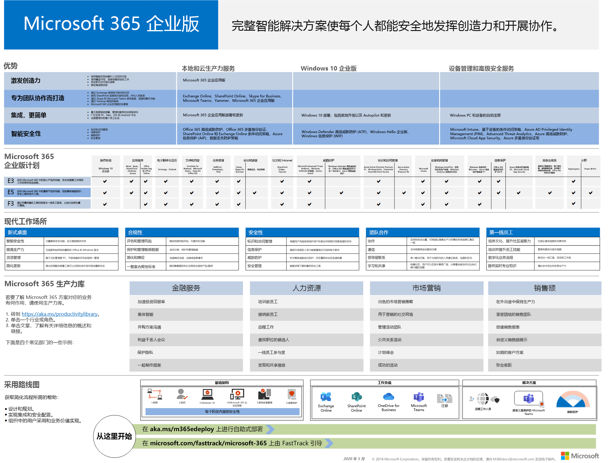
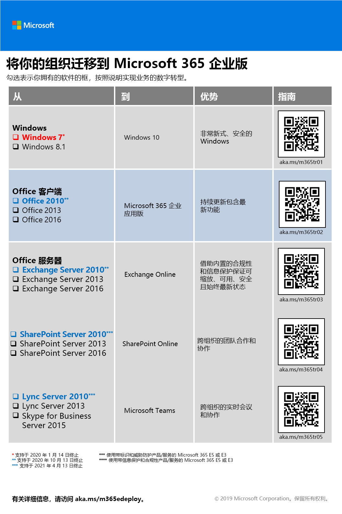

# Microsoft 365 企业版概述Microsoft 365 for enterprise overview

适用于企业的 Microsoft 365 是一个完整的智能解决方案，使每个人都能进行创作和安全协作。Microsoft 365 for enterprise is a complete, intelligent solution that empowers everyone to be creative and work together securely. 

虽然专为大型组织设计，但 Microsoft 365 for 企业也可用于需要最高级安全性和生产力功能的中型企业和小型企业。Although designed for large organizations, Microsoft 365 for enterprise can also be used for medium-sized and small businesses that need the most advanced security and productivity capabilities. 

## 组件Components

适用于企业的 Microsoft 365 包括：Microsoft 365 for enterprise consists of:

|||
|:-------|:-----|
| 本地和基于云的应用和生产率服务Local and cloud-based apps and productivity services | 包括 Office 365 专业增强版、适用于 PC 和 Mac 的最新 Office 应用（例如 Word、Excel、PowerPoint、Outlook 和其他应用），以及用于电子邮件、文件存储和协作、会议等的一整套在线服务。Includes both Office 365 ProPlus, the latest Office apps for your PC and Mac (such as Word, Excel, PowerPoint, Outlook, and others), and a full suite of online services for email, file storage and collaboration, meetings, and more. |
| Windows 10 企业版Windows 10 Enterprise | 满足了大型和中型组织的需求，为用户提供了具有全面部署、设备和应用程序管理的最高效、安全的 Windows 和 IT 专业人员版本。Addresses the needs of both large and midsize organizations, providing users with the most productive and secure version of Windows and IT professionals with comprehensive deployment, device, and app management. |
| 设备管理和高级安全服务Device management and advanced security services | 包括 Microsoft Intune，这是一种基于云的企业移动管理（EMM）服务，可帮助您的员工在保持公司数据受保护的情况下提高工作效率。Includes Microsoft Intune, which is a cloud-based enterprise mobility management (EMM) service that helps enable your workforce to be productive while keeping your corporate data protected. |
|||

## 计划Plans

适用于企业的 Microsoft 365 在三个计划中提供。Microsoft 365 for enterprise is available in three plans.

|||
|:-------|:-----|
| E3E3 | 访问 Microsoft 365 中的核心产品和功能，以提高工作效率和促进创新和安全。Access core products and features within Microsoft 365 to enhance workplace productivity and drive innovation, securely. |
| E5E5 | 访问 Microsoft 365 中的最新产品和功能，包括高级威胁防护、安全和协作工具。。Access the latest products and features within Microsoft 365, including advanced threat protection, security and collaboration tools.. 包括所有 E3's 功能，以及高级安全性、语音和数据分析工具。Includes all of E3's capabilities plus advanced security, voice, and data analysis tools. |
| F1F1 | 通过专门构建的工具和资源与您的 Firstline 工作人员联系，让他们能够完成其最佳工作。Connect with your Firstline Workers through purpose-built tools and resources that allow them to do their best work. |
|||

如果你拥有 Microsoft 365 E3，还可以获取以下[产品](https://www.microsoft.com/microsoft-365/blog/2019/01/02/introducing-new-advanced-security-and-compliance-offerings-for-microsoft-365/)：If you have Microsoft 365 E3, you can also get these [offerings](https://www.microsoft.com/microsoft-365/blog/2019/01/02/introducing-new-advanced-security-and-compliance-offerings-for-microsoft-365/):

- 身份 & 威胁防护Identity & Threat Protection
- 信息保护 & 合规性Information Protection & Compliance

这些产品包含 Microsoft 365 E5 附带的其他功能。These offerings contain additional features that are included with Microsoft 365 E5.

有关详细信息，请参阅[每个计划的特性和功能](https://www.microsoft.com/microsoft-365/compare-all-microsoft-365-plans)。For more information, see [Features and capabilities for each plan](https://www.microsoft.com/microsoft-365/compare-all-microsoft-365-plans).

## 获取大图Get the big picture

[Microsoft 365 for enterprise 海报](../media/m365-poster/Microsoft365Enterprise.pdf)是查看的中心位置：The [Microsoft 365 for enterprise poster](../media/m365-poster/Microsoft365Enterprise.pdf) is a central location for you to view:

- Microsoft 365 for 企业以及应用和服务如何映射到其价值的优势The benefits of Microsoft 365 for enterprise and how apps and services map to its value pillars
- 适用于企业计划的 Microsoft 365 以及它们包含的组件Microsoft 365 for enterprise plans and which components they contain 
- Microsoft 365 for enterprise 的新式工作场所的关键组件支持The key components of the Modern Workplace, which Microsoft 365 for enterprise enables
- 适用于一些常见组织部门的[Microsoft 365 生产率库](https://www.microsoft.com/microsoft-365/success/)和代表性方案The [Microsoft 365 Productivity Library](https://www.microsoft.com/microsoft-365/success/) and representative scenarios for some common organization departments
- 采用指南重点介绍了 Microsoft 365 企业版[部署指南](deploy-microsoft-365-enterprise.md)The adoption roadmap that highlights the Microsoft 365 for enterprise [Deployment Guide](deploy-microsoft-365-enterprise.md)

要下载海报副本，请单击[此处](https://github.com/MicrosoftDocs/microsoft-365-docs/raw/public/microsoft-365/enterprise/media/m365-poster/Microsoft365Enterprise.pdf)。To download a copy of the poster, click [here](https://github.com/MicrosoftDocs/microsoft-365-docs/raw/public/microsoft-365/enterprise/media/m365-poster/Microsoft365Enterprise.pdf).

## 转换整个组织Transition your entire organization

若要更好地了解如何将整个组织移动到 Microsoft 365 for enterprise 中的产品和服务，请下载[转换海报](../media/deploy-microsoft-365-enterprise/transition-org-to-m365.pdf)。To get a better picture of how to move your entire organization to the products and services in Microsoft 365 for enterprise, download the [transition poster](../media/deploy-microsoft-365-enterprise/transition-org-to-m365.pdf).

此海报包含两页内容，可借助它快速盘点现有基础结构并获取有关转移到 Microsoft 365 企业版中相应产品或服务的指南。This two-page poster is a quick way to inventory your existing infrastructure and get to the guidance for moving to the corresponding product or service in Microsoft 365 for enterprise. 它包含 Windows 和 Office 产品，还涵盖了设备管理、标识及信息和威胁防护等其他基础结构和安全元素。It includes Windows and Office products and other infrastructure and security elements such as device management, identity, and information and threat protection.

还可以[下载此海报](https://github.com/MicrosoftDocs/microsoft-365-docs/raw/public/microsoft-365/enterprise/media/deploy-microsoft-365-enterprise/transition-org-to-m365.pdf)并按 letter、legal 或 tabloid (11 x 17) 格式打印。You can also [download this poster](https://github.com/MicrosoftDocs/microsoft-365-docs/raw/public/microsoft-365/enterprise/media/deploy-microsoft-365-enterprise/transition-org-to-m365.pdf) and print it in letter, legal, or tabloid (11 x 17) formats.

## 避免对 Windows 7 和 Office 2010 客户端和服务器的支持终止Avoid end of support for Windows 7 and Office 2010 clients and servers

下面的产品在**2020 年1月 14**日到达支持的末尾：The following products reach end of support on **January 14, 2020**:

- [Windows 7Windows 7](https://aka.ms/win7upgrade)

以下产品在**2020 年10月13日**到达支持的末尾：The following products reach end of support on  **October 13, 2020**:

- [Office 2010Office 2010](https://docs.microsoft.com/DeployOffice/office-2010-end-support-roadmap)
- [Exchange Server 2010Exchange Server 2010](https://docs.microsoft.com/office365/enterprise/exchange-2010-end-of-support)
- [SharePoint Server 2010SharePoint Server 2010](https://docs.microsoft.com/office365/enterprise/upgrade-from-sharepoint-2010)

有关这些产品的升级、迁移和移动到云选项的直观摘要，请参阅[停止提供支持海报](../media/migration-microsoft-365-enterprise-workload/Office2010Windows7EndOfSupport.pdf)。For a visual summary of the upgrade, migrate, and move-to-the-cloud options for these products, see the [end of support poster](../media/migration-microsoft-365-enterprise-workload/Office2010Windows7EndOfSupport.pdf).

这一页的海报是一种快速了解您可以采取的各种途径，以防止 Windows 7 和 Office 2010 客户端和服务器产品到达支持的末尾，并在 Microsoft 365 中突出显示了针对企业的首选路径和支持。This one-page poster is a quick way to understand the various paths you can take to prevent Windows 7 and Office 2010 client and server products from reaching end of support, with preferred paths and support in Microsoft 365 for enterprise highlighted.

还可以[下载此海报](https://github.com/MicrosoftDocs/microsoft-365-docs/raw/public/microsoft-365/enterprise/media/migration-microsoft-365-enterprise-workload/Office2010Windows7EndOfSupport.pdf)并按 letter、legal 或 tabloid (11 x 17) 格式打印。You can also [download this poster](https://github.com/MicrosoftDocs/microsoft-365-docs/raw/public/microsoft-365/enterprise/media/migration-microsoft-365-enterprise-workload/Office2010Windows7EndOfSupport.pdf) and print it in letter, legal, or tabloid (11 x 17) formats.

## 部署Deploy

可通过以下三种方法来部署适用于企业的 Microsoft 365 的产品、功能和组件：There are three ways to deploy the products, features, and components of Microsoft 365 for enterprise:

1. 与 FastTrack 的合作关系In partnership with FastTrack
  
   通过 FastTrack，Microsoft 工程师可按自己的步调帮助你移动到云。With FastTrack, Microsoft engineers help you move to the cloud at your own pace. 请参阅 [FastTrack for Microsoft 365](https://fasttrack.microsoft.com/microsoft365)。See [FastTrack for Microsoft 365](https://fasttrack.microsoft.com/microsoft365).
  
2. 提供 Microsoft 咨询服务或[microsoft 合作伙伴](https://partner.microsoft.com/)的帮助。With the help of Microsoft Consulting Services or a [Microsoft partner](https://partner.microsoft.com/).

   顾问可以分析您的当前基础结构，并帮助您制定一个将 Microsoft 365 for enterprise 的所有软件和服务结合在一起的计划。Consultants can analyze your current infrastructure and help you develop a plan to incorporate all of the software and services of Microsoft 365 for enterprise.

3. 自行执行Do it yourself

   《 [Microsoft 365 for 企业版部署指南》](deploy-microsoft-365-enterprise.md)逐步介绍了如何构建基础结构和工作效率工作负载。The [Microsoft 365 for enterprise deployment guide](deploy-microsoft-365-enterprise.md) takes you step by step through building out the infrastructure and productivity workloads. 

有关更多部署信息，请参阅操作方法：For more deployment information, see how:

- [客户](deploy-microsoft-365-enterprise.md#how-customers-use-microsoft-365-for-enterprise)使用适用于企业的 Microsoft 365。[Customers](deploy-microsoft-365-enterprise.md#how-customers-use-microsoft-365-for-enterprise)  use Microsoft 365 for enterprise.
- [Microsoft](deploy-microsoft-365-enterprise.md#how-microsoft-uses-microsoft-365-for-enterprise)使用适用于企业的 microsoft 365。[Microsoft](deploy-microsoft-365-enterprise.md#how-microsoft-uses-microsoft-365-for-enterprise) uses Microsoft 365 for enterprise.
- [Contoso Corporation](contoso-overview.md)（一个虚构但具有代表性的跨国组织）已为企业部署了 Microsoft 365。[The Contoso Corporation](contoso-overview.md), a fictional but representative multinational organization, has deployed Microsoft 365 for enterprise.

## 其他 Microsoft 365 解决方案Additional Microsoft 365 solutions

- [Microsoft 365 商业版Microsoft 365 Business](https://docs.microsoft.com/microsoft-365/business/)
 
  将 Office 365 一流的工作效率和协作功能与设备管理和安全解决方案汇集在了一起，可保护中小型企业 (SMB) 业务数据的安全。Bring together the best-in-class productivity and collaboration capabilities of Office 365 with device management and security solutions to safeguard business data for small and midsize businesses (SMB).

- [Microsoft 365 教育版Microsoft 365 Education](https://docs.microsoft.com/education)
 
  通过为教育版构建单一、价格合理的解决方案，使教育工作者可以充分发挥创造力、提升团队合作，并提供安全易用的用户体验。Empower educators to unlock creativity, promote teamwork, and provide a simple and safe experience in a single, affordable solution built for education.

- [Microsoft 365 政府版Microsoft 365 Government](https://www.microsoft.com/microsoft-365/government)
 
  使美国公共事业部门员工能够安全地协同工作。Empower United States public sector employees to work together, securely.

## Microsoft 365 培训Microsoft 365 training

|||
|:-------|:-----|
| 向自己培训并努力处理 Microsoft 365 认证。Get yourself trained and work towards a Microsoft 365 certification.   从[Microsoft 365 基础](https://docs.microsoft.com/learn/paths/m365-fundamentals/)开始。Start with [Microsoft 365 Fundamentals](https://docs.microsoft.com/learn/paths/m365-fundamentals/).
|||

## 后续步骤Next step

如果你要自己部署，请启动[Microsoft 365 以进行企业部署旅程](deploy-microsoft-365-enterprise.md)。If you're doing the deployment yourself, start your [Microsoft 365 for enterprise deployment journey](deploy-microsoft-365-enterprise.md).

## 另请参阅See also

[适用于企业版的 Microsoft 365 页面Microsoft 365 for enterprise product page](https://www.microsoft.com/microsoft-365/enterprise)
