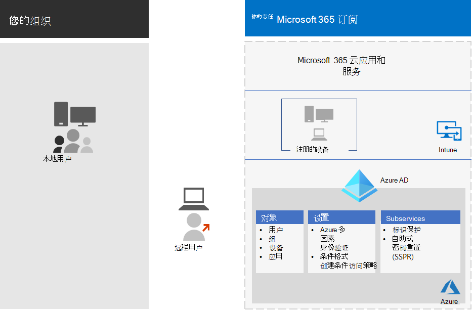

# 标识和设备访问配置Identity and device access configurations

贵组织的新式安全外围设备现已扩展到你的网络之外，以包括从各种设备从任意位置访问基于云的应用的用户。The modern security perimeter of your organization now extends beyond your network to include users accessing cloud-based apps from any location with a variety of devices. 您的安全基础结构需要确定是否应授予给定的访问请求，以及在何种情况下。Your security infrastructure needs to determine whether a given access request should be granted and under what conditions. 

此决定应基于用户帐户登录、正在使用的设备、用户尝试访问的应用程序、发出访问请求的位置，以及对请求风险的评估情况。This determination should be based on the user account sign-in, the device being used, the apps the user is trying to access, the location from which the access request is made, and an assessment of the risk of the request. 此功能有助于确保只有经批准的用户和设备才能访问你的关键资源。This capability helps ensure that only approved users and devices can access your critical resources.

本系列文章介绍了一组标识和设备访问的先决条件配置，以及一组 Azure Active Directory (Azure AD) 条件访问、Microsoft Intune 和其他策略，以安全访问 Microsoft 365 for 企业云应用和服务、其他 SaaS 服务以及使用 Azure AD 应用程序代理发布的本地应用程序。This series of articles describes a set of identity and device access prerequisite configurations and a set of Azure Active Directory (Azure AD) Conditional Access, Microsoft Intune, and other policies to secure access to Microsoft 365 for enterprise cloud apps and services, other SaaS services, and on-premises applications published with Azure AD Application Proxy.

在三层中，建议使用标识和设备访问设置和策略：对具有高度管控或保密数据的环境的基准保护、敏感保护和保护。Identity and device access settings and policies are recommended in three tiers: baseline protection, sensitive protection, and protection for environments with highly regulated or classified data. 这些层及其相应的配置在数据、标识和设备中提供了一致的保护级别。These tiers and their corresponding configurations provide consistent levels of protection across your data, identities, and devices.

这些功能及其建议：These capabilities and their recommendations:

- 在 Microsoft 365 E3 和 Microsoft 365 E5 中受支持。Are supported in Microsoft 365 E3 and Microsoft 365 E5.
- 与 [Microsoft 安全分数](https://docs.microsoft.com/microsoft-365/security/mtp/microsoft-secure-score) 和 [Azure AD 中的标识分数](https://docs.microsoft.com/azure/active-directory/fundamentals/identity-secure-score)一致，并将增加贵组织的这些分数。Are aligned with [Microsoft Secure Score](https://docs.microsoft.com/microsoft-365/security/mtp/microsoft-secure-score) as well as [identity score in Azure AD](https://docs.microsoft.com/azure/active-directory/fundamentals/identity-secure-score), and will increase these scores for your organization.
- 将帮助您实施以下 [五个步骤来保护您的身份基础结构](https://docs.microsoft.com/azure/security/azure-ad-secure-steps)。Will help you implement these [five steps to securing your identity infrastructure](https://docs.microsoft.com/azure/security/azure-ad-secure-steps).

如果您的组织具有独特的环境要求或复杂性，请使用这些建议作为起点。If your organization has unique environment requirements or complexities, use these recommendations as a starting point. 但是，大多数组织都可以按规定实现这些建议。However, most organizations can implement these recommendations as prescribed.

>[!Note]
>Microsoft 还为 Office 365 订阅销售企业移动性 + 安全性 (EMS) 许可证。Microsoft also sells Enterprise Mobility + Security (EMS) licenses for Office 365 subscriptions. EMS E3 和 EMS E5 功能与 Microsoft 365 E3 和 Microsoft 365 E5 中的功能等效。EMS E3 and EMS E5 capabilities are equivalent to those in Microsoft 365 E3 and Microsoft 365 E5. 有关详细信息，请参阅 [EMS 计划](https://www.microsoft.com/en-us/microsoft-365/enterprise-mobility-security/compare-plans-and-pricing) 。See [EMS plans](https://www.microsoft.com/en-us/microsoft-365/enterprise-mobility-security/compare-plans-and-pricing) for the details.
>

## 目标受众Intended audience

这些建议适用于熟悉 Microsoft 365 云生产力和安全服务的企业架构师和 IT 专业人员，其中包括 Azure AD (标识) 、Microsoft Intune (设备管理) 和 Azure 信息保护 (数据保护) 。These recommendations are intended for enterprise architects and IT professionals who are familiar with Microsoft 365 cloud productivity and security services, which includes Azure AD (identity), Microsoft Intune (device management), and Azure Information Protection (data protection).

### 客户环境Customer environment

建议的策略适用于完全在 Microsoft 云中运行的企业组织，并适用于具有混合标识基础结构的客户，后者是本地 Active Directory 域服务 (AD DS) 林，与 Azure AD 租户同步。The recommended policies are applicable to enterprise organizations operating both entirely within the Microsoft cloud and for customers with hybrid identity infrastructure, which is an on-premises Active Directory Domain Services (AD DS) forest that is synchronized with an Azure AD tenant.

提供的许多建议依赖于 Microsoft 365 E5、Microsoft 365 E3 和 Identity & 威胁防护附加、EMS E5 或 Azure Premium P2 许可证中提供的服务。Many of the provided recommendations rely on services available only with Microsoft 365 E5, Microsoft 365 E3 with the Identity & Threat Protection add-on, EMS E5, or Azure Premium P2 licenses.

对于没有这些许可证的那些组织，Microsoft 建议您至少实施 [安全默认设置，这些默认值](https://docs.microsoft.com/azure/active-directory/fundamentals/concept-fundamentals-security-defaults)包括在所有 Microsoft 365 计划中。For those organizations who do not have these licenses, Microsoft recommends you at least implement [security defaults](https://docs.microsoft.com/azure/active-directory/fundamentals/concept-fundamentals-security-defaults), which is included with all Microsoft 365 plans. 

### 几点Caveats

您的组织可能需要遵守管理法规或其他合规性要求，包括可能要求您应用从这些建议配置中分离的策略的特定建议。Your organization may be subject to regulatory or other compliance requirements, including specific recommendations that may require you to apply policies that diverge from these recommended configurations. 这些配置推荐以前没有提供的使用情况控件。These configurations recommend usage controls that have not historically been available. 我们建议使用这些控制措施，因为我们认为它们代表安全性和生产率之间的平衡。We recommend these controls because we believe they represent a balance between security and productivity.  

我们已尽最大努力满足各种组织保护要求，但我们无法满足所有可能的要求，也无法考虑组织的所有独特方面。We've done our best to account for a wide variety of organizational protection requirements, but we're not able to account for all possible requirements or for all the unique aspects of your organization.

## 三层保护Three tiers of protection

大多数组织都具有安全性和数据保护方面的特定要求。Most organizations have specific requirements regarding security and data protection. 这些要求因行业部门和组织内的工作职能而异。These requirements vary by industry segment and by job functions within organizations. 例如，法律部门和管理员可能需要其他业务部门不需要的电子邮件通信周围的其他安全和信息保护控制。For example, your legal department and administrators might require additional security and information protection controls around their email correspondence that are not required for other business units. 

每个行业也有自己独特的一组规定。Each industry also has their own set of specialized regulations. 建议针对三种不同的安全性和保护层提供了建议，这些建议可根据您的需求的粒度来应用，而不是提供所有可能的安全选项列表或建议的每个行业部分或作业功能。Rather than providing a list of all possible security options or a recommendation per industry segment or job function, recommendations have been provided for three different tiers of security and protection that can be applied based on the granularity of your needs.

- **基准保护**：我们建议您建立用于保护数据的最低标准，以及访问您的数据的标识和设备。**Baseline protection**: We recommend you establish a minimum standard for protecting data, as well as the identities and devices that access your data. 您可以遵循这些基准建议，以提供满足许多组织需求的强默认保护。You can follow these baseline recommendations to provide strong default protection that meets the needs of many organizations.
- **敏感保护**：某些客户具有必须在更高级别进行保护的数据子集，或者可能需要在更高级别保护所有数据。**Sensitive protection**: Some customers have a subset of data that must be protected at higher levels, or they may require all data to be protected at a higher level. 您可以对 Microsoft 365 环境中的所有或特定的数据集应用增强的保护。You can apply increased protection to all or specific data sets in your Microsoft 365 environment. 建议以与安全性相当的级别保护访问敏感数据的标识和设备。We recommend protecting identities and devices that access sensitive data with comparable levels of security.  
- **高度管控**：某些组织可能拥有高度分类的少量数据，构成商业机密或受管制数据。**Highly regulated**: Some organizations may have a small amount of data that is highly classified, constitutes trade secrets, or is regulated data. Microsoft 提供多种功能，帮助组织满足相关要求，包括为标识和设备添加保护。Microsoft provides capabilities to help organizations meet these requirements, including added protection for identities and devices.

本指南向您介绍如何针对每种级别的保护对标识和设备实施保护。This guidance shows you how to implement protection for identities and devices for each of these tiers of protection. 使用此指南作为组织的起点，并调整策略以满足组织的特定要求。Use this guidance as a starting point for your organization and adjust the policies to meet your organization's specific requirements.

请务必在数据、标识和设备中使用一致的保护级别。It's important to use consistent levels of protection across your data, identities, and devices. 例如，如果您实施了本指南，请务必保护您的数据处于可比较的级别。For example, if you implement this guidance, be sure to protect your data at comparable levels. 

Microsoft 365 体系结构模型的 **标识和设备保护** 显示可比较的功能。The **Identity and device protection for Microsoft 365** architecture model shows you which capabilities are comparable.

    [以 PDF](../downloads/MSFT_cloud_architecture_identity&device_protection.pdf) \| 形式查看[下载为 PDF 格式](https://github.com/MicrosoftDocs/microsoft-365-docs/raw/public/microsoft-365/downloads/MSFT_cloud_architecture_identity&device_protection.pdf) \|[下载为 Visio](https://github.com/MicrosoftDocs/microsoft-365-docs/raw/public/microsoft-365/downloads/MSFT_cloud_architecture_identity&device_protection.vsdx)  [View as a PDF](../downloads/MSFT_cloud_architecture_identity&device_protection.pdf) \| [Download as a PDF](https://github.com/MicrosoftDocs/microsoft-365-docs/raw/public/microsoft-365/downloads/MSFT_cloud_architecture_identity&device_protection.pdf)  \| [Download as a Visio](https://github.com/MicrosoftDocs/microsoft-365-docs/raw/public/microsoft-365/downloads/MSFT_cloud_architecture_identity&device_protection.vsdx)

此外，请参阅为 [数据隐私法规部署信息保护](../solutions/information-protection-deploy.md) 解决方案，以保护存储在 Microsoft 365 中的信息。Additionally, see the [Deploy information protection for data privacy regulations](../solutions/information-protection-deploy.md) solution to protect information stored in Microsoft 365.

## 安全性和生产力权衡Security and productivity trade-offs

实现任何安全策略都需要权衡安全性和生产率。Implementing any security strategy requires trade-offs between security and productivity. 评估每个决策对安全性、功能和易用性的影响情况进行评估是有帮助的。It's helpful to evaluate how each decision affects the balance of security, functionality, and ease of use.

提供的建议基于以下原则：The recommendations provided are based on the following principles:

- 了解你的用户并灵活地满足其安全性和功能要求。Know your users and be flexible to their security and functional requirements.
- 及时应用安全策略并确保它有意义。Apply a security policy just in time and ensure it is meaningful.

## 标识和设备访问保护的服务和概念Services and concepts for identity and device access protection

适用于企业的 Microsoft 365 专为大型组织设计，使每个人都能具有创造性且安全地协同工作。Microsoft 365 for enterprise is designed for large organizations to empower everyone to be creative and work together securely.

本节概述了对标识和设备访问非常重要的 Microsoft 365 服务和功能。This section provides an overview of the Microsoft 365 services and capabilities that are important for identity and device access.

### Azure ADAzure AD

Azure AD 提供一套完整的标识管理功能。Azure AD provides a full suite of identity management capabilities. 我们建议使用这些功能来保护访问。We recommend using these capabilities to secure access.

| 功能或特性Capability or feature | 说明Description | 许可Licensing |
|:-------|:-----|:-------|
| [多重身份验证 (MFA)Multi-factor authentication (MFA)](/azure/active-directory/authentication/concept-mfa-howitworks) | MFA 要求用户提供两种形式的验证，如用户密码以及来自 Microsoft 验证器应用或电话呼叫的通知。MFA requires users to provide two forms of verification, such as a user password plus a notification from the Microsoft Authenticator app or a phone call. MFA 极大地降低了失窃凭据可用于访问环境的风险。MFA greatly reduces the risk that stolen credentials can be used to access your environment. Microsoft 365 对基于 MFA 的登录使用 Azure 多因素身份验证服务。Microsoft 365 uses the Azure Multi-Factor Authentication service for MFA-based sign-ins. | Microsoft 365 E3 或 E5Microsoft 365 E3 or E5 |
| [条件访问Conditional Access](/azure/active-directory/conditional-access/overview) | Azure AD 评估用户登录的条件，并使用条件访问策略确定允许的访问权限。Azure AD evaluates the conditions of the user sign-in and uses Conditional Access policies to determine the allowed access. 例如，在本指南中，我们将向您介绍如何创建条件访问策略，以要求访问敏感数据的设备合规性。For example, in this guidance we show you how to create a Conditional Access policy to require device compliance for access to sensitive data. 这极大地降低了具有自己的设备和被盗凭据的黑客可以访问您的敏感数据的风险。This greatly reduces the risk that a hacker with their own device and stolen credentials can access your sensitive data. 它还保护了设备上的敏感数据，因为这些设备必须满足运行状况和安全性的特定要求。It also protects sensitive data on the devices, because the devices must meet specific requirements for health and security. | Microsoft 365 E3 或 E5Microsoft 365 E3 or E5 |
| [Azure AD 组Azure AD groups](/azure/active-directory/fundamentals/active-directory-manage-groups) | 条件访问策略、具有 Intune 的设备管理，甚至对组织中的文件和网站的权限依赖于用户帐户或 Azure AD 组的分配。Conditional Access policies, device management with Intune, and even permissions to files and sites in your organization rely on the assignment to user accounts or Azure AD groups. 我们建议您创建与您实施的保护级别相对应的 Azure AD 组。We recommend you create Azure AD groups that correspond to the levels of protection you are implementing. 例如，您的执行人员可能更高的黑客的价值目标。For example, your executive staff are likely higher value targets for hackers. 因此，将这些员工的用户帐户添加到 Azure AD 组并将该组分配给条件访问策略和其他强制实施更高级别的保护的策略是有意义的。Therefore, it makes sense to add the user accounts of these employees to an Azure AD group and assign this group to Conditional Access policies and other policies that enforce a higher level of protection for access. | Microsoft 365 E3 或 E5Microsoft 365 E3 or E5 |
| [设备注册Device enrollment](/azure/active-directory/devices/overview) | 将设备注册到 Azure AD 以创建设备的标识。You enroll a device into Azure AD to create an identity for the device. 当用户登录并应用需要加入域或合规的 Pc 的条件访问策略时，此标识用于对设备进行身份验证。This identity is used to authenticate the device when a user signs in and to apply Conditional Access policies that require domain-joined or compliant PCs. 在本指南中，我们使用设备注册自动注册加入域的 Windows 计算机。For this guidance, we use device enrollment to automatically enroll domain-joined Windows computers. 设备注册是使用 Intune 管理设备的先决条件。Device enrollment is a prerequisite for managing devices with Intune. | Microsoft 365 E3 或 E5Microsoft 365 E3 or E5 |
| [Azure AD Identity ProtectionAzure AD Identity Protection](/azure/active-directory/identity-protection/overview) | 使您能够检测到影响组织标识的潜在漏洞，并将自动修正策略配置为低、中和高的登录风险和用户风险。Enables you to detect potential vulnerabilities affecting your organization's identities and configure automated remediation policy to low, medium, and high sign-in risk and user risk. 本指南依赖此风险评估来应用多因素身份验证的条件访问策略。This guidance relies on this risk evaluation to apply Conditional Access policies for multi-factor authentication. 本指南还包括一个条件访问策略，该策略要求用户在为其帐户检测到高风险活动时更改其密码。This guidance also includes a Conditional Access policy that requires users to change their password if high-risk activity is detected for their account. | Microsoft 365 E5，Microsoft 365 E3 with Identity & 威胁防护加载项、EMS E5 或 Azure 高级 P2 许可证Microsoft 365 E5, Microsoft 365 E3 with the Identity & Threat Protection add-on, EMS E5, or Azure Premium P2 licenses |
| [自助服务密码重置 (SSPR) Self-service password reset (SSPR)](/azure/active-directory/authentication/concept-sspr-howitworks) | 通过提供管理员可以控制的多种身份验证方法的验证，允许用户安全地重置其密码，而无需技术人员干预。Allow your users to reset their passwords securely and without help-desk intervention, by providing verification of multiple authentication methods that the administrator can control. | Microsoft 365 E3 或 E5Microsoft 365 E3 or E5 |
| [AZURE AD 密码保护](https://docs.microsoft.com/azure/active-directory/authentication/concept-password-ban-bad)。[Azure AD password protection](https://docs.microsoft.com/azure/active-directory/authentication/concept-password-ban-bad). 检测并阻止已知的弱密码及其变体以及特定于您的组织的其他弱术语。Detect and block known weak passwords and their variants and additional weak terms that are specific to your organization. 默认全局禁止密码列表将自动应用于 Azure AD 租户中的所有用户。Default global banned password lists are automatically applied to all users in an Azure AD tenant. 您可以在 "自定义禁止密码" 列表中定义其他条目。You can define additional entries in a custom banned password list. 当用户更改或重置其密码时，将检查这些禁止的密码列表，以强制使用强密码。When users change or reset their passwords, these banned password lists are checked to enforce the use of strong passwords. |  Microsoft 365 E3 或 E5Microsoft 365 E3 or E5 |
||||

### Microsoft IntuneMicrosoft Intune

[Intune](https://docs.microsoft.com/intune/introduction-intune) 是 Microsoft 基于云的移动设备管理服务。[Intune](https://docs.microsoft.com/intune/introduction-intune) is Microsoft's cloud-based mobile device management service. 本指南推荐使用 Intune 的 Windows 电脑的设备管理，并建议设备合规性策略配置。This guidance recommends device management of Windows PCs with Intune and recommends device compliance policy configurations. Intune 确定设备是否合规，并将此数据发送到 Azure AD，以便在应用条件访问策略时使用。Intune determines whether devices are compliant and sends this data to Azure AD to use when applying Conditional Access policies.

#### Intune 应用保护Intune app protection

[Intune 应用保护](https://docs.microsoft.com/intune/app-protection-policy) 策略可用于保护你的组织在移动应用中的数据，包括或不将设备注册到管理中。[Intune app protection](https://docs.microsoft.com/intune/app-protection-policy) policies can be used to protect your organization's data in mobile apps, with or without enrolling devices into management. Intune 可帮助保护信息，确保员工仍能高效工作，并防止数据丢失。Intune helps protect information, making sure your employees can still be productive, and preventing data loss. 通过实施应用程序级别的策略，可以限制对公司资源的访问并将数据保留在 IT 部门的控制范围内。By implementing app-level policies, you can restrict access to company resources and keep data within the control of your IT department.

本指南向您介绍如何创建建议的策略来强制使用已批准的应用程序，并确定这些应用程序如何与您的业务数据结合使用。This guidance shows you how to create recommended policies to enforce the use of approved apps and to determine how these apps can be used with your business data.

### Microsoft 365Microsoft 365

本指南介绍如何实现一组用于保护对 Microsoft 365 云服务（包括 Microsoft 团队、Exchange Online、SharePoint Online 和 OneDrive for Business）的访问权限的策略。This guidance shows you how to implement a set of policies to protect access to Microsoft 365 cloud services, including Microsoft Teams, Exchange Online, SharePoint Online, and OneDrive for Business. 除了实施这些策略之外，我们还建议您使用以下资源提高租户的保护级别：In addition to implementing these policies, we recommend you also raise the level of protection for your tenant using these resources:

- [配置租户以提高安全性Configure your tenant for increased security](../security/office-365-security/tenant-wide-setup-for-increased-security.md)

  适用于租户的基准安全性的建议。Recommendations that apply to baseline security for your tenant.

- [安全路线图：前30天、90天及以上的主要优先级Security roadmap: Top priorities for the first 30 days, 90 days, and beyond](../security/office-365-security/security-roadmap.md)

  包括日志记录、数据管理、管理员访问和威胁防护的建议。Recommendations that include logging, data governance, admin access, and threat protection.

### Windows 10 和 Microsoft 365 企业应用版Windows 10 and Microsoft 365 Apps for enterprise

适用于企业的 Microsoft 365 应用程序的 Windows 10 是电脑的推荐客户端环境。Windows 10 with Microsoft 365 Apps for enterprise is the recommended client environment for PCs. 建议 Windows 10，因为 Azure 旨在提供内部部署和 Azure AD 的最平滑体验。We recommend Windows 10 because Azure is designed to provide the smoothest experience possible for both on-premises and Azure AD. Windows 10 还包含可通过 Intune 管理的高级安全功能。Windows 10 also includes advanced security capabilities that can be managed through Intune. 适用于企业的 Microsoft 365 应用程序包括 Office 应用程序的最新版本。Microsoft 365 Apps for enterprise includes the latest versions of Office applications. 这些身份验证使用新式验证，这是更安全和有条件访问的要求。These use modern authentication, which is more secure and a requirement for Conditional Access. 这些应用程序还包括增强的安全性和合规性工具。These apps also include enhanced security and compliance tools.

## 在三层保护中应用这些功能Applying these capabilities across the three tiers of protection

下表总结了在三层保护中使用这些功能的建议。The following table summarizes our recommendations for using these capabilities across the three tiers of protection.

|保护机制Protection mechanism|基线Baseline|敏感Sensitive|高度管控Highly regulated|
|:-------------------|:-------|:--------|:---------------|
|强制执行 MFA**Enforce MFA**|针对中级或以上登录风险On medium or above sign-in risk|针对低级或以上登录风险On low or above sign-in risk|针对所有新会话On all new sessions|
|**强制更改密码****Enforce password change**|对于高风险用户For high-risk users|对于高风险用户For high-risk users|对于高风险用户For high-risk users|
|**强制实施 Intune 应用程序保护****Enforce Intune application protection**|是Yes|是Yes|是Yes|
|**为组织拥有的设备强制执行 Intune 注册****Enforce Intune enrollment for organization-owned device**|需要兼容或加入域的电脑，但允许在 (BYOD) 电话和平板电脑上引入自己的设备Require a compliant or domain-joined PC, but allow bring-your-own devices (BYOD) phones and tablets|需要兼容或加入域的设备Require a compliant or domain-joined device|需要兼容或加入域的设备Require a compliant or domain-joined device|

## 设备所有权Device ownership

上表反映了许多组织支持组织拥有的设备的组合以及个人或 BYODs 的趋势，以实现整个工作的工作效率。The above table reflects the trend for many organizations to support a mix of organization-owned devices, as well as personal or BYODs to enable mobile productivity across the workforce. Intune 应用保护策略可确保电子邮件在组织拥有的设备和 BYODs 上的 exfiltrating 从 Outlook 移动应用和其他 Office 移动应用程序中受到保护。Intune app protection policies ensure that email is protected from exfiltrating out of the Outlook mobile app and other Office mobile apps, on both organization-owned devices and BYODs.  

我们建议由 Intune 或加入域来管理组织拥有的设备，以应用更多的保护和控制。We recommend organization-owned devices be managed by Intune or domain-joined to apply additional protections and control. 根据数据敏感度的不同，您的组织可能会选择不允许对特定用户群体或特定应用的 BYODs。Depending on data sensitivity, your organization may choose to not allow BYODs for specific user populations or specific apps.

## 配置标识和设备访问的过程中的步骤Steps in the process of configuring identity and device access

1. 配置必备组件标识功能及其设置。Configure prerequisite identity features and their settings.
2. 配置通用标识和访问条件访问策略。Configure the common identity and access Conditional Access policies.
3. 为来宾和外部用户配置条件访问策略。Configure Conditional Access policies for guest and external users.
4. 为 microsoft 团队、Exchange Online 和 SharePoint 等 Microsoft 365 云应用配置条件访问策略。Configure Conditional Access policies for Microsoft 365 cloud apps such as Microsoft Teams, Exchange Online, and SharePoint.

## 后续步骤Next step

[实现标识和设备访问策略的先决条件工作Prerequisite work for implementing identity and device access policies](identity-access-prerequisites.md)
