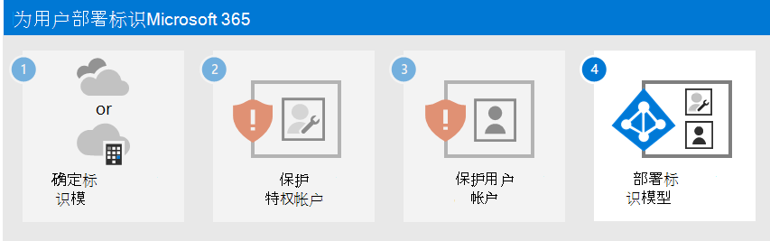

# 步骤 3：保护 Microsoft 365 用户帐户

若要增强用户登录的安全性，请执行以下操作：

- 使用 Windows Hello 企业版
- 使用 Azure Active Directory (Azure AD) 密码保护
- 使用多重身份验证 (MFA)
- 部署标识和设备访问配置
- 通过 Azure AD 标识保护防止凭据泄露

## Windows Hello 企业版

Windows 10 企业版中的 Windows Hello 企业版在 Windows 设备上签名时，会将密码替换为强双因素身份验证。 这两个因素是一种与设备和生物识别或 PIN 相关联的新型用户凭据。

有关详细信息，请参阅 [Windows Hello 企业版概述](/windows/security/identity-protection/hello-for-business/hello-overview)。

## Azure AD 密码保护

Azure AD 密码保护会检测并阻止已知的弱密码及其变体，还会阻止特定于你组织的额外弱项。 默认全局禁止使用的密码列表将自动应用于 Azure AD 租户中的所有用户。 可在自定义禁止密码列表中定义额外条目。 用户更改或重置其密码时，将检查这些禁止的密码列表，强制使用强密码。

有关详细信息，请参阅“[配置 Azure AD 密码保护](/azure/active-directory/authentication/concept-password-ban-bad)”。

## MFA

MFA 要求用户登录受用户帐户密码之外的其他验证约束。 即使恶意用户确定了用户帐户密码，还必须能够响应其他验证（如发送到智能手机的短信）才能获得访问权限。

使用 MFA 的第一步是[对所有管理员帐户要求使用 MFA](protect-your-global-administrator-accounts.md)，这些帐户也被称为特权帐户。 比第一步更好的是，Microsoft 建议对所有用户要求使用 MFA。

根据 Microsoft 365 套餐，可通过三种方式要求你的用户使用 MFA。

| 套餐 | 建议 |
|---------|---------|
|所有 Microsoft 365 套餐（无 Azure AD Premium P1 或 P2 许可证）     |[在 Azure AD 中启用安全性默认值](/azure/active-directory/fundamentals/concept-fundamentals-security-defaults)。 Azure AD 中的安全性默认值于用户和管理员的 MFA。   |
|Microsoft 365 E3 （包括 Azure AD Premium P1 许可证）     | 使用 [常见的条件访问策略](/azure/active-directory/conditional-access/concept-conditional-access-policy-common) 配置以下策略：  - [要求对管理员执行 MFA](/azure/active-directory/conditional-access/howto-conditional-access-policy-admin-mfa)  - [要求对所有用户执行 MFA](/azure/active-directory/conditional-access/howto-conditional-access-policy-all-users-mfa)   - [阻止传统身份验证](/azure/active-directory/conditional-access/howto-conditional-access-policy-block-legacy)       |
|Microsoft 365 E5 （包括 Azure AD Premium P2 许可证）     | 利用 Azure AD 标识保护，通过创建以下两个策略开始实施 Microsoft 推荐的一组条件访问和相关策略：  - [要求在登录风险为“中等”或“高”时执行 MFA](/azure/active-directory/conditional-access/howto-conditional-access-policy-risk)  - [高风险用户必须更改密码](/azure/active-directory/conditional-access/howto-conditional-access-policy-risk-user)       |
| | |

### 安全性默认值

安全性默认值是在 2019 年 10 月 21 日之后创建的 Microsoft 365 和 Office 365 付费或试用版订阅的一项新功能。 这些订阅启用了安全性默认值，这 ***要求所有用户将 MFA 与 Microsoft Authenticator 应用配合使用***。
 
用户有 14 天的时间从其智能手机中通过 Microsoft Authenticator 应用登录 MFA，自启用安全性默认值后首次登录起计。 14 天后，除非 MFA 注册完成，否则用户将无法登录。

安全性默认值可确保所有组织均对默认启用的用户登录具有基本的安全级别。 可使用条件访问策略或针对个别帐户禁用安全性默认值，以支持 MFA。

有关详细信息，请参阅[安全性默认值概述](/azure/active-directory/fundamentals/concept-fundamentals-security-defaults)。

### 条件访问策略

条件访问策略是一组规则，指定评估登录和授予访问的条件。 例如，你可以创建一个条件访问策略，指明：

- 如果用户帐户名是分配了 Exchange、用户、密码、安全性、SharePoint、**Exchange 管理员**、**SharePoint 管理员** 或 **全局管理员** 角色的用户的组成员，则需要先进行 MFA，然后才能允许访问。

通过此策略，当为用户分配或取消分配了上述管理员角色时，你可以根据其组成员身份要求进行 MFA，而不是针对单个用户帐户进行 MFA 配置。

你还可以使用条件访问策略来实现更高级的功能，例如，要求从合规设备（例如运行 Windows 10 的电脑）完成登录。

条件访问需要 Microsoft 365 E3 和 E5 随附的 Azure AD Premium P1 许可证。

有关详细信息，请参阅[条件访问概述](/azure/active-directory/conditional-access/overview)。

### 结合使用这些方法

请注意以下几点：

- 如果启用了任何条件访问策略，则无法启用安全性默认值。
- 如果启用了安全性默认值，则无法启用任何条件访问策略。

如果启用了安全性默认值，系统将提示所有新用户进行 MFA 注册并使用 Microsoft Authenticator 应用。 

下表显示了通过安全性默认值和条件访问策略启用 MFA 的结果。

| 方法 | 已启用 | 禁用 | 其他身份验证方法 |
|:-------|:-----|:-------|:-------|
| **安全性默认值**  | 无法使用条件访问策略 | 可以使用条件访问策略 | Microsoft Authenticator 应用 |
| **条件访问策略** | 如果已启用任何条件访问策略，则无法启用安全性默认值 | 如果已禁用所有条件访问策略，则可以启用安全性默认值  | 由用户在 MFA 注册期间指定  |
||||

## 零信任标识和设备访问配置

零信任标识和设备访问设置和策略是建议的先决条件功能及其设置，它们与条件访问、Intune 和 Azure AD Identity Protection 策略结合使用，可确定是否应授予给定访问请求以及应在哪些条件下授予给定访问请求。 这种决定是基于登录的用户帐户、正在使用的设备、用户为获得访问权限而正在使用的应用程序、创建访问请求的位置，以及对请求风险的评估。 这个功能有助于确保只有经过批准的用户和设备才能访问关键的公司资源。

>[!Note]
>Azure AD 标识保护需要 Microsoft 365 E5 随附的 Azure AD Premium P2 许可证。
>

标识和设备访问策略被定义以用于三种层级： 

- 对于访问应用和数据的身份和设备，基线保护是最低级别的安全性。
- 敏感保护提供针对特定数据的额外安全性。 标识和设备遵循更高级别的安全性和设备运行状况要求。
- 对具有高度管控或分类数据的环境的保护仅用于高度分类、包含商业机密或遵守数据法规的一般少量数据。 标识和设备遵循非常高级别的安全性和设备运行状况要求。 

这些层及其相应的配置会跨数据、标识和设备，提供一致级别的保护。

Microsoft 强烈建议在组织中配置和推出标识和设备访问策略，包括 Microsoft Teams、Exchange Online 和 SharePoint 的特定设置。 有关详细信息，请参阅[零信任标识和设备访问配置](../security/office-365-security/microsoft-365-policies-configurations.md)。

## Azure AD 标识保护

在此部分，将了解如何配置策略，以防止凭据泄露（攻击者可以通过确定用户帐户名称和密码来获取访问组织的云服务和数据的权限）。Azure AD 标识保护可提供多种方式来帮助阻止攻击者泄露用户帐户的凭据。

使用 Azure AD Identity Protection，可以：

|功能|Description|
|:---------|:---------|
| 确定并解决组织身份中的潜在漏洞 | Azure AD 使用机器学习来检测异常和可疑活动（如登录和后登录活动）。使用此数据，Azure AD 标识保护将生成报告和警报，用以帮助你评估问题并采取行动。|
|检测与组织身份相关的可疑操作并自动对其响应|可以配置基于风险的策略，以在达到指定风险级别时自动响应检测到的问题。这些策略，以及由 Azure AD and Microsoft Intune 提供的其他条件访问控制，可自动阻止访问或采取纠正措施，包括密码重置以及要求对后续登录进行 Azure AD 多重身份验证。 |
| 调查可疑事件并使用管理操作加以解决 | 可以使用有关安全事件的信息来调查风险事件。提供的基本工作流可用于跟踪调查和启动修正操作（如密码重置）。 |
|||

请参阅[有关 Azure AD Identity Protection 的详细信息](/azure/active-directory/identity-protection/overview-identity-protection)。

请参阅[启用 Azure AD Identity Protection 的步骤](/azure/active-directory/identity-protection/howto-identity-protection-configure-risk-policies)。

## 用于 MFA 和身份验证的管理员技术资源

- [适用于 Microsoft 365 的 MFA](../admin/security-and-compliance/multi-factor-authentication-microsoft-365.md)
- [部署 Microsoft 365 标识](deploy-identity-solution-overview.md)
- [Azure Academy Azure AD 培训视频](https://www.youtube.com/watch?v=pN8o0owHfI0&list=PL-V4YVm6AmwUFpC3rXr2i2piRQ708q_ia)
- [配置  Azure AD 多重身份验证注册策略](/azure/active-directory/identity-protection/howto-identity-protection-configure-mfa-policy)
- [标识和设备访问配置](../security/office-365-security/microsoft-365-policies-configurations.md)

## 后续步骤

继续执行步骤 4，根据所选的标识模型部署标识基础结构：

- [仅限云标识](cloud-only-identities.md)
- [混合标识](prepare-for-directory-synchronization.md)
