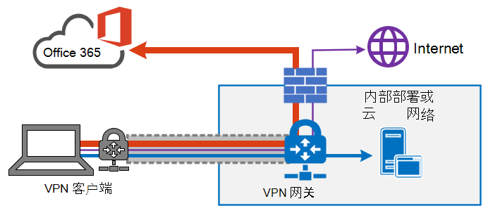
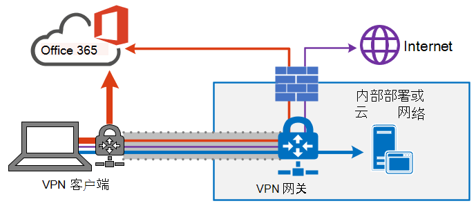
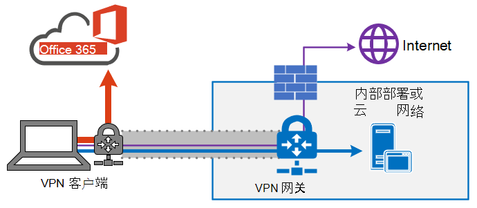
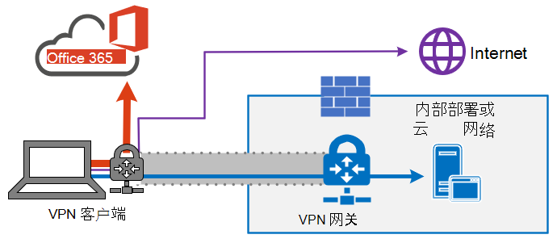
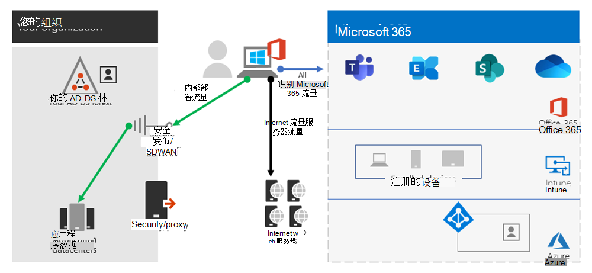

# <a name="implementing-vpn-split-tunneling-for-office-365"></a>实现 Office 365 的 VPN 拆分隧道

>[!NOTE]
>本主题是一组针对远程用户的 Office 365 优化的主题的一部分。
>- 有关使用 VPN 拆分隧道为远程用户优化 Office 365 连接的概述，请参阅[概述： Office 365 的 VPN 拆分隧道](microsoft-365-vpn-split-tunnel.md)。
>- 有关为中国用户优化 Office 365 全球租户性能的详细信息，请参阅[面向中国用户的 Office 365 性能优化](microsoft-365-networking-china.md)。

多年来，企业一直使用 VPN 来支持其用户的远程体验。 虽然核心工作负载保持在本地，但通过公司网络上的数据中心路由的远程客户端的 VPN 是供远程用户访问公司资源的主要方法。 为保证这些连接的安全性，企业将沿 VPN 路径构建网络安全解决方案层。 构建此安全是为了保护内部基础结构，并通过将流量重新路由到 VPN 然后通过本地 Internet 外围来保护外部网站的移动浏览。 VPN、网络外围和相关安全基础结构通常是针对定义的流量进行特意构建和扩展的，通常大多数连接都是从企业网络内部启动的，并且大部分连接都位于内部网络边界内。

在相当长的一段时间内，只要远程用户的并发规模适中且遍历 VPN 的流量较低，那么所有来自远程用户设备的连接都被路由回本地网络的 VPN 模型（这称为 _强制隧道_）基本上是可持续的。  一些客户甚至在他们的应用从企业外围转移到公共 SaaS 云之后，仍继续将 VPN 强制隧道用作现状， Office 365 就是一个很好的例子。

使用强制隧道 VPN 连接到分布式且对性能敏感的云应用程序是非优化的，但一些企业为了从安全角度维持状态而接受其负面影响。 下面是此场景的一个示例图：


此问题多年来一直在增长，许多客户报告网络流量模式发生显著变化。 过去位于本地的流量现在连接到外部云终结点。 许多 Microsoft 客户报告，以前大约 80% 的网络流量都来自内部（上图中用虚线表示）。 到 2020 年，随着他们将主要的工作负载转移到云上，这一数字现在约为 20% 或更低，这些趋势在其他企业中并不罕见。 随着时间的推移和云历程的发展，上述模型变得愈加累赘且不可持续，这使得组织在迁移到以云为中心的世界时的敏捷度受到影响。

全球 COVID-19 危机升级了此问题，需要立即修正。 确保员工安全的需要对企业 IT 部门提出了前所未有的要求，要求他们支持大规模在家办公的工作效率。 Microsoft Office 365可以帮助客户满足该需求，但在家工作的用户的高并发性会产生大量 Office 365 流量，如果通过强制隧道 VPN 和本地网络外围进行路由，则会导致快速饱和并运行容量不足的 VPN 基础结构。 在此新现实中，使用 VPN 访问 Office 365 不再是性能障碍，而是一个不仅影响 Office 365 而且仍必须依赖 VPN 才能运行的关键业务运营的硬墙。

多年来，Microsoft 一直与客户和更广泛的行业紧密协作，从我们自己的服务中为这些问题提供有效的新式解决方案，并与行业最佳做法保持一致。 Office 365 服务的[连接原则](./microsoft-365-network-connectivity-principles.md)旨在高效地为远程用户工作，同时仍允许组织保持安全性并控制其连接。 这些解决方案也可在有限的工作下快速实施，但是对上述问题产生显著正面影响。

Microsoft 建议的优化远程工作者连接策略主要是通过几个简单的步骤快速缓解传统方法的问题，并提供高性能。 这些步骤为绕过瓶颈 VPN 服务器的一些已定义终结点调整旧 VPN 方法。 可在不同的层应用等效的或甚至是更高级的安全模型，而无需在公司网络出口保护所有流量。 在大多数情况下，可以在数小时内有效实现此功能，然后可根据需要以及时间允许的情况下扩展到其他工作负载。

## <a name="common-vpn-scenarios"></a>常见 VPN 方案

在下面的列表中，你将看到企业环境中最常见的 VPN 方案。 大多数客户通常运行模型 1（VPN 强制隧道）。 本节将帮助您快速、安全地过渡到模型 **2，** 这可以通过相对少的工作实现，并且对网络性能和用户体验具有巨大优势。

| 模型 | 说明 |
| --- | --- |
| [1. VPN 强制隧道](#1-vpn-forced-tunnel) | 100% 的流量进入 VPN 隧道，包括本地、Internet 以及所有 O365/M365 |
| [2. VPN 强制隧道（有几个例外）](#2-vpn-forced-tunnel-with-a-small-number-of-trusted-exceptions) | 默认情况下使用 VPN 隧道（默认路由指向 VPN），有几个最重要的豁免场景允许直接访问 |
| [3. VPN 强制隧道（有多个例外）](#3-vpn-forced-tunnel-with-broad-exceptions) | 默认情况下使用 VPN 隧道（默认路由指向 VPN），有多个允许直接访问的例外情况（如所有 Office 365、所有 Salesforce、所有 Zoom） |
| [4. VPN 选择性隧道](#4-vpn-selective-tunnel) | VPN 隧道仅用于基于公司网络的服务。 默认路由 (Internet，所有基于 Internet 的服务) 直接路由。 |
| [5. 无 VPN](#5-no-vpn) | #2 (的一种变体，其中所有公司网络服务都通过现代安全方法（如 Zscaler ZPA、Azure Active Directory (Azure AD) Proxy/MCAS 等）发布)  |

### <a name="1-vpn-forced-tunnel"></a>1. VPN 强制隧道

这是大多数企业客户最常用的入门方案。 使用强制 VPN，这意味着 100% 的流量将定向到企业网络，无论终结点是否驻留在企业网络内。 然后， (Internet) 流量（如 Office 365 或 Internet 浏览）的任何外部流量都回发回本地安全设备（如代理）。 在当前近 100% 的用户远程工作的当前情况中，此模型对 VPN 基础结构造成高负载，并且可能会显著妨碍所有公司流量的性能，进而使企业在危机时高效运行。



### <a name="2-vpn-forced-tunnel-with-a-small-number-of-trusted-exceptions"></a>2. VPN 强制隧道（有几个受信任的异常）

此模型对于企业运行的效率明显更高，因为它允许几个负载和延迟非常高且对延迟非常敏感的受控和定义的终结点绕过 VPN 隧道并直接转到此示例中的 Office 365 服务。 这显著提高了卸载服务的性能，还减少了 VPN 基础结构上的负载，从而允许仍然需要它的元素以较低的资源争用运行。 正是此模型，本文侧重于协助过渡到 ，因为它允许快速执行简单的已定义操作，并产生大量积极结果。



### <a name="3-vpn-forced-tunnel-with-broad-exceptions"></a>3. VPN 强制隧道（有多个例外）

第三个模型扩大模型二的范围，而不是直接发送一小组定义的终结点，而是直接将所有流量发送到受信任的服务（如 Office 365 和 SalesForce）。 这可进一步减少公司 VPN 基础结构的负载，并提高已定义服务的性能。 由于此模型可能需要更多时间来评估和实施是否可行，因此在成功实施模型 2 后，稍后可能会反复执行一个步骤。



### <a name="4-vpn-selective-tunnel"></a>4. VPN 选择性隧道

此模型与第三个模型相反，因为只有标识为具有公司 IP 地址的流量才通过 VPN 隧道发送，因此 Internet 路径是其他所有流量的默认路由。 此模型要求组织能够很好地适应[零信任](https://www.microsoft.com/security/zero-trust?rtc=1)路径，以便能够安全地实现此模型。 应注意的是，此模型或某些变体可能随着时间的推移而成为必要的默认模型，因为越来越多的服务将从公司网络移动到云中。 Microsoft 在内部使用此模型；有关 Microsoft 实现 VPN 拆分隧道的更多信息，请参阅[运行 VPN：Microsoft 如何让远程工作人员互联](https://www.microsoft.com/itshowcase/blog/running-on-vpn-how-microsoft-is-keeping-its-remote-workforce-connected/?elevate-lv)。



### <a name="5-no-vpn"></a>5. 无 VPN

第二个型号的更高级版本，其中任何内部服务都通过现代安全方法或 SDWAN 解决方案（如 Azure AD 代理、MCAS、Zscaler ZPA 等）发布。



## <a name="implement-vpn-split-tunneling"></a>实现 VPN 拆分隧道

在此部分中，你将找到将 VPN 客户端体系结构从 _VPN_ 强制隧道迁移到具有少量受信任异常的 _VPN_ 强制隧道所需的简单步骤，常见 [VPN](#common-vpn-scenarios)方案中的 VPN 拆分隧道模型 [#2。](#2-vpn-forced-tunnel-with-a-small-number-of-trusted-exceptions)

下图显示了建议的 VPN 拆分隧道解决方案的工作原理：


### <a name="1-identify-the-endpoints-to-optimize"></a>1. 标识要优化的终结点

在 [Office 365 URL 和 IP 地址范围](urls-and-ip-address-ranges.md)主题中，Microsoft 明确标识需优化的关键终结点，并将其分类为“优化”。 目前仅需要优化四个 URL 和 20 个 IP 子网。 这一小组的终结点约占 Office 365 服务流量的 70% - 80%，包括延迟敏感终结点（如 Teams 媒体终结点）。 实质上，这是我们需要特别注意的流量，也是对传统网络路径和 VPN 基础结构造成压力的流量。

此类别中的 URL 具有以下特征：

- 为 Microsoft 拥有和托管的终结点，托管在 Microsoft 基础结构上
- 提供了 IP
- 低更改率，预计仍保持较小数量（目前有 20 个 IP 子网）
- 带宽和/或延迟敏感
- 可在服务中提供所需的安全元素，而不是在网络上内联
- 约占 Office 365 服务流量的 70-80%

有关终结点Office 365如何分类和管理它们，请参阅管理Office 365[终结点](managing-office-365-endpoints.md)。

#### <a name="optimize-urls"></a>优化 URL

可在下表找到当前的优化 URL。 在大多数情况下，只需在[浏览器 PAC 文件](managing-office-365-endpoints.md#use-a-pac-file-for-direct-routing-of-vital-office-365-traffic)中使用 URL 终结点，其中终结点被配置为直接发送，而不是发送到代理。

| 优化 URL | 端口/协议 | 用途 |
| --- | --- | --- |
| <https://outlook.office365.com> | TCP 443 | 这是 Outlook 用于连接到其 Exchange Online Server 并具有较高带宽使用率和连接计数的主要 URL 之一。 以下联机功能需要低网络延迟：即时搜索、其他邮箱日历、忙/闲查找、管理规则和通知、Exchange Online 存档和电子邮件传出发件箱。 |
| <https://outlook.office.com> | TCP 443 | 此 URL 供 Outlook Online Web 访问用于连接到 Exchange Online Server，并且对网络延迟非常敏感。 使用 SharePoint Online 上传和下载大型文件尤其需要连接。 |
| https:// \<tenant\> .sharepoint.com | TCP 443 | 这是 SharePoint Online 的主要 URL，并且具有高带宽使用率。 |
| https:// \<tenant\> -my.sharepoint.com | TCP 443 | 这是 OneDrive for business 的主要 URL，具有较高的带宽使用率，并且可能会产生来自 OneDrive for Business 同步工具的高连接计数。 |
| Teams 媒体 IP（无 URL） | UDP 3478、3479、3480 和 3481 | 中继发现分配和实时流量 (3478) 、音频 (3479) 、视频 (3480) 和视频屏幕共享 (3481) 。 这些终结点用于处理Skype for Business Microsoft Teams媒体 (通话、会议等) 。 当 Microsoft Teams 客户端建立呼叫时，将提供大多数终结点（并包含在为该服务列出的所需 IP 内）。 若要获得最佳媒体质量，需要使用 UDP 协议。   |

在上面的示例中，应将 **租户** 替换为 Office 365 租户名称。 例如，**contoso.onmicrosoft.com** 将使用 _contoso.sharepoint.com_ 和 _constoso-my.sharepoint.com_。

#### <a name="optimize-ip-address-ranges"></a>优化 IP 地址范围

在写入这些终结点所对应的 IP 地址范围时，如下所示。 强烈建议你在应用配置时使用脚本（如[](https://github.com/microsoft/Office365NetworkTools/tree/master/Scripts/Display%20URL-IPs-Ports%20per%20Category)此示例[、Office 365 IP](microsoft-365-ip-web-service.md)和 URL Web 服务或[URL/IP](urls-and-ip-address-ranges.md)页面）检查是否有更新，并定期制定策略。

```
104.146.128.0/17
13.107.128.0/22
13.107.136.0/22
13.107.18.10/31
13.107.6.152/31
13.107.64.0/18
131.253.33.215/32
132.245.0.0/16
150.171.32.0/22
150.171.40.0/22
204.79.197.215/32
23.103.160.0/20
40.104.0.0/15
40.108.128.0/17
40.96.0.0/13
52.104.0.0/14
52.112.0.0/14
52.96.0.0/14
52.120.0.0/14
```

### <a name="2-optimize-access-to-these-endpoints-via-the-vpn"></a>2. 通过 VPN 优化对这些终结点的访问

我们已确定这些关键终结点，现在需要将其从 VPN 隧道移出，并允许它们使用用户的本地 Internet 连接直接连接到服务。 完成此操作的方式将因使用的 VPN 产品和计算机平台而异，但大多数 VPN 解决方案将允许简单配置策略来应用此逻辑。 有关 VPN 平台特定的拆分隧道指南，请参阅[常见 VPN 平台的操作指南](#howto-guides-for-common-vpn-platforms)。

如果要手动测试解决方案，可执行以下 PowerShell 示例，以在路由表级别模拟解决方案。 本例将每个 Teams 媒体 IP 子网的路由添加到路由表中。 可以在之前和之后测试 Teams 媒体性能，并观察指定终结点路由的差异。

#### <a name="example-add-teams-media-ip-subnets-into-the-route-table"></a>示例：将 Teams 媒体 IP 子网添加到路由表

```powershell
$intIndex = "" # index of the interface connected to the internet
$gateway = "" # default gateway of that interface
$destPrefix = "52.120.0.0/14", "52.112.0.0/14", "13.107.64.0/18" # Teams Media endpoints
# Add routes to the route table
foreach ($prefix in $destPrefix) {New-NetRoute -DestinationPrefix $prefix -InterfaceIndex $intIndex -NextHop $gateway}
```

在上面的脚本中，_$intIndex_ 是连接到 Internet 的接口索引（可通过在 PowerShell 中运行 **get-netadapter** 找到；查找 _ifIndex_ 的值），_$gateway_ 是该接口的默认网关（可通过在命令提示符中运行 **ipconfig** 或在 PowerShell 中运行 **(Get-NetIPConfiguration | Foreach IPv4DefaultGateway).NextHop** 找到）。

添加路由后，可通过在命令提示符或 PowerShell 中运行 **route print** 来确认路由表是否正确。 输出应包含添加的路由，显示接口索引（本例为 _22_）和该接口的网关（本例为 _192.168.1.1_）：


若要在“优化”类别中添加 _所有_ 当前 IP 地址范围的路由，可使用以下脚本变体查询 [Office 365 IP 和 URL Web 服务](microsoft-365-ip-web-service.md)，以获取当前优化 IP 子网集合并将其添加到路由表。

#### <a name="example-add-all-optimize-subnets-into-the-route-table"></a>示例：将所有优化子网添加到路由表

```powershell
$intIndex = "" # index of the interface connected to the internet
$gateway = "" # default gateway of that interface
# Query the web service for IPs in the Optimize category
$ep = Invoke-RestMethod ("https://endpoints.office.com/endpoints/worldwide?clientrequestid=" + ([GUID]::NewGuid()).Guid)
# Output only IPv4 Optimize IPs to $optimizeIps
$destPrefix = $ep | where {$_.category -eq "Optimize"} | Select-Object -ExpandProperty ips | Where-Object { $_ -like '*.*' }
# Add routes to the route table
foreach ($prefix in $destPrefix) {New-NetRoute -DestinationPrefix $prefix -InterfaceIndex $intIndex -NextHop $gateway}
```

如果无意中添加了错误参数的路由，或者只是希望还原所做的更改，则可以使用以下命令删除刚添加的路由：

```powershell
foreach ($prefix in $destPrefix) {Remove-NetRoute -DestinationPrefix $prefix -InterfaceIndex $intIndex -NextHop $gateway}
```

<!--- remmed until we add more reliable interface selection logic
#### Example script to add Teams Media subnets to the route table

```powershell
$adapter = get-netadapter | ? {$_.Status -eq "Up"}
$adapterIndex = $adapter.ifIndex
$gateway = (Get-NetIPConfiguration | Foreach IPv4DefaultGateway).NextHop

$destPrefix = "52.120.0.0/14", "52.112.0.0/14", "13.107.64.0/18"
foreach ($prefix in $destPrefix) {New-NetRoute -DestinationPrefix $prefix -InterfaceIndex $intIndex -NextHop $gateway}
```
-->

应配置 VPN 客户端，以便 **优化** IP 的流量以此方式路由。 这允许流量利用本地 Microsoft 资源（如 Office 365 Service Front Door，如[Azure Front Door，](https://azure.microsoft.com/blog/azure-front-door-service-is-now-generally-available/)可提供尽可能接近你的用户的 Office 365 服务和连接终结点。 这使我们能够为位于世界任何位置的用户提供高性能级别，并充分利用 [Microsoft](https://azure.microsoft.com/blog/how-microsoft-builds-its-fast-and-reliable-global-network/)的世界一流的全局网络，这很可能在用户的直接出口几毫秒内完成。

## <a name="configuring-and-securing-teams-media-traffic"></a>配置和保护 Teams 媒体流量

一些管理员可能需要更详细的信息，了解如何在使用拆分隧道模型的 Teams 中进行呼叫流操作，以及如何保护连接。

### <a name="configuration"></a>配置

对于呼叫和会议，只要路由表中正确放置了 Teams 媒体所需的"优化 IP 子网"，当 Teams 调用[GetBestRoute](/windows/win32/api/iphlpapi/nf-iphlpapi-getbestroute)函数以确定哪个本地接口对应于它应用于特定目的地的路由时，将为上面列出的 Microsoft IP 块中的 Microsoft 目标返回本地接口。

某些 VPN 客户端软件允许基于 URL 进行路由操作。 但是，Teams 媒体流量没有与之关联的 URL，因此必须使用 IP 子网来控制此流量路由。

在某些情况下（通常与 Teams 客户端配置无关），即使有正确的路由，媒体流量仍会遍历 VPN 隧道。 如果遇到这种情况，则使用防火墙规则阻止 ip Teams或端口使用 VPN 应足够。

>[!IMPORTANT]
>若要Teams所有 VPN 方案中通过所需方法路由媒体流量，请确保用户运行的是 Microsoft Teams 客户端版本 **1.3.00.13565** 或更大版本。 此版本包括客户端检测可用网络路径的改进。

信号流量通过 HTTPS 执行，对延迟没有媒体流量敏感，在 URL/IP 数据中标记为"允许"，因此如果需要，可以安全地通过 VPN 客户端进行路由。

### <a name="security"></a>安全性

避免拆分隧道的一个常见理由是这样做不太安全，也就是说， 任何不通过 VPN 隧道的流量都将无法从应用到 VPN 隧道的任何加密方案中受益，因此安全性较低。

对此的主要反对意见是，媒体流量已经通过 _安全实时传输协议 (SRTP)_ 进行了加密，该协议是实时传输协议 (RTP) 的一个配置文件，它为 RTP 流量提供保密性、身份验证和重播攻击保护。 SRTP 本身依赖于随机生成的会话密钥，该密钥通过 TLS 安全信令通道进行交换。 [本安全指南](/skypeforbusiness/optimizing-your-network/security-guide-for-skype-for-business-online)中详细介绍了这一点，但主要部分是媒体加密。

媒体流量是使用 SRTP 加密的，SRTP 使用安全随机数生成器生成的会话密钥，并使用信令 TLS 通道进行交换。 此外，在中介服务器和其内部下一个跃点之间的双向媒体也使用 SRTP 进行加密。

Skype for Business Online 生成用户名/密码，可用于通过 _围绕 NAT 使用中继遍历 (TURN)_ 来安全访问媒体中继。 媒体中继通过 TLS 安全 SIP 信道交换用户名/密码。 值得注意的是，即使可使用 VPN 隧道将客户端连接到公司网络，但当流量离开公司网络以访问服务时，仍需以其 SRTP 形式流动。

有关解决方案Teams消除常见安全问题的信息，如 _NAT (STUN)_ 的语音或会话遍历实用程序。有关实施者的安全注意事项，请参阅 [5.1](/openspecs/office_protocols/ms-ice2/69525351-8c68-4864-b8a6-04bfbc87785c)安全注意事项。

还可以阅读有关远程工作场景中的新式安全控制：[安全专业人员和 IT 人员在当前独特的远程工作场景中实现新式安全控制的替代方法（Microsoft 安全团队博客）](https://www.microsoft.com/security/blog/2020/03/26/alternative-security-professionals-it-achieve-modern-security-controls-todays-unique-remote-work-scenarios/)

## <a name="testing"></a>测试

策略准备就绪后，应确认其是否按预期工作。 可通过多种方法来测试路径是否已正确设置为使用本地 Internet 连接：

- 运行Microsoft 365[连接](https://aka.ms/netonboard)测试，该测试将针对您运行连接测试，包括如上所述的跟踪路由。 我们还将 VPN 测试添加到此工具中，这还应提供其他见解。

- 指向拆分隧道范围内终结点的简单 **tracert** 应显示使用的路径，例如：

  ```powershell
  tracert worldaz.tr.teams.microsoft.com
  ```

  然后，应看到通过本地 ISP 到此终结点的路径，该路径应解析为我们为拆分隧道Teams配置的范围中的 IP。

- 以使用 Wireshark 之类的工具进行网络捕获为例。 在呼叫期间筛选 UDP，应看到流量流向 Teams **优化** 范围中的 IP。 如果 VPN 隧道正用于此流量，则跟踪中将不会显示媒体流量。

### <a name="additional-support-logs"></a>其他支持日志

如果需要更多数据来排除故障，或正在请求 Microsoft 支持部门的协助，获取以下信息可帮助你加快查找解决方案。 Microsoft 支持的 **基于 CMD Windows TSS** 脚本工具集可帮助您以简单方式收集相关日志。 有关使用的工具和说明，请参阅 <https://aka.ms/TssTools> 。

## <a name="howto-guides-for-common-vpn-platforms"></a>适用于常见 VPN 平台的操作指南

本节提供了一些链接，这些链接提供了实现 Office 365 流量（来自该领域中最常见的合作伙伴）的拆分隧道的详细指南。 我们将在其他指南推出时添加这些指南。

- **Windows 10 VPN 客户端**：[使用本机 Windows 10 VPN 客户端优化面向远程工作者的 Office 365 流量](/windows/security/identity-protection/vpn/vpn-office-365-optimization)
- **Cisco Anyconnect**：[优化 Office365 的 Anyconnect 拆分隧道](https://www.cisco.com/c/en/us/support/docs/security/anyconnect-secure-mobility-client/215343-optimize-anyconnect-split-tunnel-for-off.html)
- **Palo Alto GlobalProtect**：[通过 VPN 拆分隧道排除访问路由优化 Office 365 流量](https://live.paloaltonetworks.com/t5/Prisma-Access-Articles/GlobalProtect-Optimizing-Office-365-Traffic/ta-p/319669)
- **F5 Networks BIG-IP APM**：[使用 BIG-IP APM 通过 VPN 优化远程访问 Office 365 流量](https://devcentral.f5.com/s/articles/SSL-VPN-Split-Tunneling-and-Office-365)
- **Citrix 网关**：[优化 Office365 Citrix 网关 VPN 拆分隧道](https://docs.citrix.com/en-us/citrix-gateway/13/optimizing-citrix-gateway-vpn-split-tunnel-for-office365.html)
- **脉冲安全**[：VPN 隧道：如何配置拆分隧道以排除Office 365应用程序](https://kb.pulsesecure.net/articles/Pulse_Secure_Article/KB44417)
- **检查点** [VPN：如何为 Tunnel 和其他 SaaS Office 365配置拆分服务器](https://supportcenter.checkpoint.com/supportcenter/portal?eventSubmit_doGoviewsolutiondetails=&solutionid=sk167000)

## <a name="faq"></a>常见问题

Microsoft 安全团队发布了供安全专业人员和 [IT](https://www.microsoft.com/security/blog/2020/03/26/alternative-security-professionals-it-achieve-modern-security-controls-todays-unique-remote-work-scenarios/)人员在今天独特的远程工作场景中实现新式安全控制的替代方法（博客文章）概述了安全专业人员和 IT 人员在当今独特的远程工作场景中实现新式安全控制的关键方法。 此外，下面是有关此主题的一些常见客户问题和解答。

### <a name="how-do-i-stop-users-accessing-other-tenants-i-do-not-trust-where-they-could-exfiltrate-data"></a>我如何阻止用户访问我不信任的其他租户（他们可能会泄漏数据）？

答案是[称为租户限制的功能](/azure/active-directory/manage-apps/tenant-restrictions)。 身份验证流量不大，对延迟也不是特别敏感，因此可通过 VPN 解决方案发送到应用此功能的本地代理。 此处维护受信任租户的允许列表，如果客户端尝试获取不受信任的租户的令牌，代理将拒绝请求。 如果租户受信任，则在用户具有正确的凭据和权限的情况下，令牌可供访问。

因此，即使用户可以与上述"优化"标记的终结点建立 TCP/UDP 连接，但没有有效的令牌来访问有关租户，他们也无法登录和访问/移动任何数据。

### <a name="does-this-model-allow-access-to-consumer-services-such-as-personal-onedrive-accounts"></a>此模型是否允许访问诸如个人 OneDrive 帐户之类的使用者服务？

否，Office 365 终结点不同于使用者服务（以 Onedrive.live.com 为例），因此拆分隧道将不允许用户直接访问使用者服务。 流向使用方终结点的流量将继续使用 VPN 隧道，并且现有策略将继续生效。

### <a name="how-do-i-apply-dlp-and-protect-my-sensitive-data-when-the-traffic-no-longer-flows-through-my-on-premises-solution"></a>如果流量不再流经本地解决方案，我该如何应用 DLP 并保护我的敏感数据？

为帮助防止意外泄露敏感信息，Office 365 提供了一组丰富的[内置工具](../compliance/information-protection.md)。 可使用 Teams 和 SharePoint 的内置 [DLP 功能](../compliance/dlp-learn-about-dlp.md)来检测未恰当存储或共享的敏感信息。 如果远程工作策略的一部分涉及自带设备办公 (BYOD) 策略，可以使用基于应用的条件访问来防止敏感数据下载到用户的个人[](/azure/active-directory/conditional-access/app-based-conditional-access)设备

### <a name="how-do-i-evaluate-and-maintain-control-of-the-users-authentication-when-they-are-connecting-directly"></a>如何在用户直接连接时评估和保留用户身份验证的控制权？

除了问题 1 中提到的租户限制功能之外，还可以应用[条件访问策略](/azure/active-directory/conditional-access/overview)来动态评估身份验证请求的风险并做出相应的反应。 Microsoft 建议在一段时间内实现[零信任模型](https://www.microsoft.com/security/zero-trust?rtc=1)，我们可以使用 Azure AD 条件访问策略在移动和以云为中心的世界保持控制。 可使用条件访问策略对身份验证请求是否成功作出实时决策，具体取决于以下诸多因素：

- 设备，设备是否已知/受信任/已加入域？
- IP – 身份验证请求是否来自已知公司 IP 地址？ 或者来自不信任的国家/地区？
- 应用程序 – 用户是否有权使用此应用程序？

然后，我们可以根据这些策略触发批准、触发 MFA 或阻止身份验证等策略。

### <a name="how-do-i-protect-against-viruses-and-malware"></a>如何防范病毒和恶意软件？

同样，Office 365 为服务自身各层中标记为“优化”的终结点提供了保护，[本文档对此进行了概述](/office365/Enterprise/office-365-malware-and-ransomware-protection)。 如前所述，在服务本身中提供这些安全元素，而不是尝试在可能完全了解协议/流量的设备中这样做会更有效。 默认情况下，SharePoint Online[自动扫描文件上传中的](../security/office-365-security/virus-detection-in-spo.md)已知恶意软件

对于上面Exchange的终结点，Exchange Online Protection和 Microsoft [](/office365/servicedescriptions/exchange-online-protection-service-description/exchange-online-protection-service-description) Defender for [Office 365](/office365/servicedescriptions/office-365-advanced-threat-protection-service-description)可以出色地为服务提供流量安全。

### <a name="can-i-send-more-than-just-the-optimize-traffic-direct"></a>除了优化流量外，我是否可以直接发送更多流量？

应优先考虑标记为 **优化** 的终结点，因为这些终结点将为低级别的工作提供最大好处。 但是，如果需要，服务需要"允许标记的终结点"才能工作，并拥有为在必要时可以使用的终结点提供的 IP 地址。

此外，还有各种供应商提供基于云的代理/安全解决方案，称为安全 _Web_ 网关，可提供用于常规 Web 浏览的中心安全、控制和公司策略应用程序。 这些解决方案在云第一世界（如果高度可用、性能高且预配接近用户）中可以良好运行，通过允许从靠近用户的基于云的位置提供安全 Internet 访问。 这将消除通过 VPN/公司网络执行回流以便正常浏览流量的需要，同时仍允许中央安全控制。

然而，即使就地使用这些解决方案，Microsoft 仍强烈建议将标记为“优化”的 Office 365 流量直接发送到服务。

有关允许直接访问 Azure 虚拟网络的指南，请参阅使用 Azure VPN 网关点 [到站点的远程工作](/azure/vpn-gateway/work-remotely-support)。

### <a name="why-is-port-80-required-is-traffic-sent-in-the-clear"></a>为什么需要端口 80？ 流量是否明文发送？

端口 80 仅用于重定向到端口 443 会话之类的操作，不会通过端口 80 发送或访问任何客户数据。 [加密](../compliance/encryption.md)概括了传输中和静态数据对 Office 365 的加密，而流量类型[](/microsoftteams/microsoft-teams-online-call-flows#types-of-traffic)概述了如何使用 SRTP 来保护Teams流量。

### <a name="does-this-advice-apply-to-users-in-china-using-a-worldwide-instance-of-office-365"></a>此建议是否适用于使用 Office 365 全球实例的中国用户？

**否**，不适用。 在上述建议中，要注意连接到 Office 365 全球实例的中国用户。 由于该区域会经常出现跨境网络拥挤现象，因此直接 Internet 出口性能可能会有变化。 该区域中的大多数客户都使用 VPN 将流量引入公司网络，并利用其经授权的 MPLS 专线或类似于通过优化路径的国家/地区之外的出口。 [面向中国用户的 Office 365 性能优化](microsoft-365-networking-china.md)一文对此进行了进一步的概述。

### <a name="does-split-tunnel-configuration-work-for-teams-running-in-a-browser"></a>拆分隧道配置是否适用于在Teams中运行的信息？

是的，它通过支持的浏览器（在获取客户端 for [Microsoft Teams 中列出](/microsoftteams/get-clients#web-client)）。

## <a name="related-topics"></a>相关主题

[概述：Office 365 的 VPN 拆分隧道](microsoft-365-vpn-split-tunnel.md)

[面向中国用户的 Office 365 性能优化](microsoft-365-networking-china.md)

[安全专业人员和 IT 人员在当前独特的远程工作场景中实现新式安全控制的替代方法（Microsoft 安全团队博客）](https://www.microsoft.com/security/blog/2020/03/26/alternative-security-professionals-it-achieve-modern-security-controls-todays-unique-remote-work-scenarios/)

[增强 Microsoft 的 VPN 性能：使用 Windows 10 VPN 配置文件以允许自动打开连接](https://www.microsoft.com/itshowcase/enhancing-remote-access-in-windows-10-with-an-automatic-vpn-profile)

[运行 VPN：Microsoft 如何让远程工作人员互联](https://www.microsoft.com/itshowcase/blog/running-on-vpn-how-microsoft-is-keeping-its-remote-workforce-connected/?elevate-lv)

[Office 365 网络连接原则](microsoft-365-network-connectivity-principles.md)

[评估 Office 365 网络连接](assessing-network-connectivity.md)

[Office 365 网络和性能优化](network-planning-and-performance.md)
