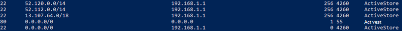

# <a name="implementing-vpn-split-tunneling-for-microsoft-365"></a>为用户实现 VPN 拆分Microsoft 365

>[!NOTE]
>本文是一组文章的一部分，这些文章Microsoft 365远程用户的优化。

>- 有关使用 VPN 拆分隧道优化远程Microsoft 365连接的概述，请参阅[概述：适用于远程用户的 VPN 拆分Microsoft 365](microsoft-365-vpn-split-tunnel.md)。
>- 有关 VPN 拆分隧道方案的详细列表，请参阅公用 VPN 拆分隧道[方案Microsoft 365](microsoft-365-vpn-common-scenarios.md)。
>- 有关在 VPN 拆分隧道Teams保护媒体流量的指南，请参阅 [Securing Teams media traffic for VPN split tunneling](microsoft-365-vpn-securing-teams.md)。
>- 若要了解如何在 VPN 环境中配置 Stream 和实时事件，请参阅 VPN 环境中 Stream 和 [实时事件的特殊注意事项](microsoft-365-vpn-stream-and-live-events.md)。
>- 有关为中国用户Microsoft 365全球租户性能的信息，请参阅Microsoft 365[中国用户的性能优化](microsoft-365-networking-china.md)。

Microsoft 建议用于优化远程工作者连接的策略侧重于快速缓解问题和通过几个简单步骤提供高性能。 这些步骤为绕过瓶颈 VPN 服务器的一些已定义终结点调整旧 VPN 方法。 可在不同的层应用等效的或甚至是更高级的安全模型，而无需在公司网络出口保护所有流量。 在大多数情况下，这可以在数小时内有效实现，然后可扩展为其他工作负载，因为要求要求和时间允许。

## <a name="implement-vpn-split-tunneling"></a>实现 VPN 拆分隧道

本文将介绍在适用于 Microsoft 365 的常见 VPN 拆分隧道方案中，将 VPN 客户端体系结构从 _VPN_ 强制隧道迁移到 _VPN_ 强制隧道所需的简单步骤，这些受信任异常为 VPN 拆分 [隧道模型 #](microsoft-365-vpn-common-scenarios.md)[2](microsoft-365-vpn-common-scenarios.md#2-vpn-forced-tunnel-with-a-small-number-of-trusted-exceptions)。

下图显示了建议的 VPN 拆分隧道解决方案的工作原理：


### <a name="1-identify-the-endpoints-to-optimize"></a>1. 标识要优化的终结点

在Microsoft 365 [URL 和 IP](urls-and-ip-address-ranges.md) 地址范围文章中，Microsoft 清楚地标识了需要优化的关键终结点，并将它们分类为 **"优化"**。 目前仅需要优化四个 URL 和 20 个 IP 子网。 这一小组终结点大约占到 Microsoft 365 服务的流量的 70% - 80%，包括延迟敏感终结点（如用于媒体Teams终结点）。 实质上，这是我们需要特别注意的流量，也是对传统网络路径和 VPN 基础结构造成压力的流量。

此类别中的 URL 具有以下特征：

- 为 Microsoft 拥有和托管的终结点，托管在 Microsoft 基础结构上
- 提供了 IP
- 低更改率，预计仍保持较小数量（目前有 20 个 IP 子网）
- 带宽和/或延迟敏感
- 可在服务中提供所需的安全元素，而不是在网络上内联
- 大约占到服务流量的 70-80% Microsoft 365流量

有关终结点Microsoft 365如何分类和管理它们，请参阅管理Microsoft 365[终结点](managing-office-365-endpoints.md)。

#### <a name="optimize-urls"></a>优化 URL

可在下表找到当前的优化 URL。 在大多数情况下，只需在[浏览器 PAC 文件](managing-office-365-endpoints.md#use-a-pac-file-for-direct-routing-of-vital-office-365-traffic)中使用 URL 终结点，其中终结点被配置为直接发送，而不是发送到代理。

| 优化 URL | 端口/协议 | 用途 |
| --- | --- | --- |
| <https://outlook.office365.com> | TCP 443 | 这是 Outlook 用于连接到其 Exchange Online Server 并具有较高带宽使用率和连接计数的主要 URL 之一。 以下联机功能需要低网络延迟：即时搜索、其他邮箱日历、忙/闲查找、管理规则和通知、Exchange Online 存档和电子邮件传出发件箱。 |
| <https://outlook.office.com> | TCP 443 | 此 URL 供 Outlook Online Web 访问用于连接到 Exchange Online Server，并且对网络延迟非常敏感。 使用 SharePoint Online 上传和下载大型文件尤其需要连接。 |
| \<tenant\>https://.sharepoint.com | TCP 443 | 这是 SharePoint Online 的主要 URL，并且具有高带宽使用率。 |
| \<tenant\>https://-my.sharepoint.com | TCP 443 | 这是 OneDrive for business 的主要 URL，具有较高的带宽使用率，并且可能会产生来自 OneDrive for Business 同步工具的高连接计数。 |
| Teams 媒体 IP（无 URL） | UDP 3478、3479、3480 和 3481 | 中继发现分配和实时流量。 这些终结点用于媒体流量Skype for Business Microsoft Teams通话 (会议等) 。 当 Microsoft Teams 客户端建立呼叫时，将提供大多数终结点（并包含在为该服务列出的所需 IP 内）。 若要获得最佳媒体质量，需要使用 UDP 协议。   |

在以上示例中，**租户** 应替换为Microsoft 365名称。 例如， **contoso.onmicrosoft.com** _使用 contoso.sharepoint.com 和_ _contoso-my.sharepoint.com_。

#### <a name="optimize-ip-address-ranges"></a>优化 IP 地址范围

在写入这些终结点所对应的 IP 地址范围时，如下所示。 强烈建议你在应用配置时使用脚本（如此示例[](https://github.com/microsoft/Office365NetworkTools/tree/master/Scripts/Display%20URL-IPs-Ports%20per%20Category)、[Microsoft 365 IP 和 URL](microsoft-365-ip-web-service.md) Web 服务或 [URL/IP](urls-and-ip-address-ranges.md) 页面）检查是否有更新，并定期制定策略。

```markdown
104.146.128.0/17
13.107.128.0/22
13.107.136.0/22
13.107.18.10/31
13.107.6.152/31
13.107.64.0/18
131.253.33.215/32
132.245.0.0/16
150.171.32.0/22
150.171.40.0/22
204.79.197.215/32
23.103.160.0/20
40.104.0.0/15
40.108.128.0/17
40.96.0.0/13
52.104.0.0/14
52.112.0.0/14
52.96.0.0/14
52.120.0.0/14
```

### <a name="2-optimize-access-to-these-endpoints-via-the-vpn"></a>2. 通过 VPN 优化对这些终结点的访问

我们已确定这些关键终结点，现在需要将其从 VPN 隧道移出，并允许它们使用用户的本地 Internet 连接直接连接到服务。 完成此操作的方式将因使用的 VPN 产品和计算机平台而异，但大多数 VPN 解决方案将允许简单配置策略来应用此逻辑。 有关 VPN 平台特定的拆分隧道指南，请参阅[常见 VPN 平台的操作指南](#howto-guides-for-common-vpn-platforms)。

如果要手动测试解决方案，可执行以下 PowerShell 示例，以在路由表级别模拟解决方案。 本例将每个 Teams 媒体 IP 子网的路由添加到路由表中。 可以在之前和之后测试 Teams 媒体性能，并观察指定终结点路由的差异。

#### <a name="example-add-teams-media-ip-subnets-into-the-route-table"></a>示例：将 Teams 媒体 IP 子网添加到路由表

```powershell
$intIndex = "" # index of the interface connected to the internet
$gateway = "" # default gateway of that interface
$destPrefix = "52.120.0.0/14", "52.112.0.0/14", "13.107.64.0/18" # Teams Media endpoints
# Add routes to the route table
foreach ($prefix in $destPrefix) {New-NetRoute -DestinationPrefix $prefix -InterfaceIndex $intIndex -NextHop $gateway}
```

在上面的脚本中，_$intIndex_ 是连接到 Internet 的接口索引（可通过在 PowerShell 中运行 **get-netadapter** 找到；查找 _ifIndex_ 的值），_$gateway_ 是该接口的默认网关（可通过在命令提示符中运行 **ipconfig** 或在 PowerShell 中运行 **(Get-NetIPConfiguration | Foreach IPv4DefaultGateway).NextHop** 找到）。

添加路由后，可通过在命令提示符或 PowerShell 中运行 **route print** 来确认路由表是否正确。 输出应包含添加的路由，显示接口索引（本例为 _22_）和该接口的网关（本例为 _192.168.1.1_）：



若要为"优化"类别中的所有当前 IP 地址范围添加路由，可以使用以下脚本变体查询 [Microsoft 365 IP 和 URL Web](microsoft-365-ip-web-service.md) 服务中的当前"优化 IP 子网"集，并将其添加到路由表中。

#### <a name="example-add-all-optimize-subnets-into-the-route-table"></a>示例：将所有优化子网添加到路由表

```powershell
$intIndex = "" # index of the interface connected to the internet
$gateway = "" # default gateway of that interface
# Query the web service for IPs in the Optimize category
$ep = Invoke-RestMethod ("https://endpoints.office.com/endpoints/worldwide?clientrequestid=" + ([GUID]::NewGuid()).Guid)
# Output only IPv4 Optimize IPs to $optimizeIps
$destPrefix = $ep | where {$_.category -eq "Optimize"} | Select-Object -ExpandProperty ips | Where-Object { $_ -like '*.*' }
# Add routes to the route table
foreach ($prefix in $destPrefix) {New-NetRoute -DestinationPrefix $prefix -InterfaceIndex $intIndex -NextHop $gateway}
```

如果无意中添加了错误参数的路由，或者只是希望还原所做的更改，则可以使用以下命令删除刚添加的路由：

```powershell
foreach ($prefix in $destPrefix) {Remove-NetRoute -DestinationPrefix $prefix -InterfaceIndex $intIndex -NextHop $gateway}
```

<!--- remmed until we add more reliable interface selection logic
#### Example script to add Teams Media subnets to the route table

```powershell
$adapter = get-netadapter | ? {$_.Status -eq "Up"}
$adapterIndex = $adapter.ifIndex
$gateway = (Get-NetIPConfiguration | Foreach IPv4DefaultGateway).NextHop

$destPrefix = "52.120.0.0/14", "52.112.0.0/14", "13.107.64.0/18"
foreach ($prefix in $destPrefix) {New-NetRoute -DestinationPrefix $prefix -InterfaceIndex $intIndex -NextHop $gateway}
```
-->

应配置 VPN 客户端，以便 **优化** IP 的流量以此方式路由。 这允许流量利用本地 Microsoft 资源，如 Microsoft 365 Service Front Door，例如 [Azure Front Door](https://azure.microsoft.com/blog/azure-front-door-service-is-now-generally-available/)，可提供尽可能靠近用户的 Microsoft 365 服务和连接终结点。 这使我们能够为位于世界任何位置的用户提供高性能级别，并充分利用 [Microsoft](https://azure.microsoft.com/blog/how-microsoft-builds-its-fast-and-reliable-global-network/) 的世界一流的全局网络，这很可能在用户的直接出口几毫秒内完成。

## <a name="howto-guides-for-common-vpn-platforms"></a>适用于常见 VPN 平台的操作指南

本部分提供了一些链接，这些链接指向针对此空间中最常见的合作伙伴Microsoft 365流量实施拆分隧道的详细指南。 我们将在其他指南推出时添加这些指南。

- **Windows 10 VPN 客户端**[：为Microsoft 365本机](/windows/security/identity-protection/vpn/vpn-office-365-optimization) VPN 客户端的远程工作者优化Windows 10流量
- **Cisco Anyconnect**：[优化 Office365 的 Anyconnect 拆分隧道](https://www.cisco.com/c/en/us/support/docs/security/anyconnect-secure-mobility-client/215343-optimize-anyconnect-split-tunnel-for-off.html)
- **Palo Alto GlobalProtect**：通过 [VPN 拆分Microsoft 365排除](https://live.paloaltonetworks.com/t5/Prisma-Access-Articles/GlobalProtect-Optimizing-Office-365-Traffic/ta-p/319669)访问路由Tunnel流量优化
- **F5 网络 BIG-IP APM**[：Microsoft 365 BIG-IP APM](https://devcentral.f5.com/s/articles/SSL-VPN-Split-Tunneling-and-Office-365) 时通过 VPN 优化远程访问流量
- **Citrix 网关**：[优化 Office365 Citrix 网关 VPN 拆分隧道](https://docs.citrix.com/citrix-gateway/13/optimizing-citrix-gateway-vpn-split-tunnel-for-office365.html)
- **脉冲安全**：[VPN 隧道：如何配置拆分隧道以排除Microsoft 365应用程序](https://kb.pulsesecure.net/articles/Pulse_Secure_Article/KB44417)
- **检查点 VPN**[：如何为 Tunnel 和其他 SaaS Microsoft 365配置拆分服务器](https://supportcenter.checkpoint.com/supportcenter/portal?eventSubmit_doGoviewsolutiondetails=&solutionid=sk167000)

## <a name="related-articles"></a>相关文章

[概述：用于服务器的 VPN 拆分Microsoft 365](microsoft-365-vpn-split-tunnel.md)

[用于服务器的常见 VPN 拆分隧道Microsoft 365](microsoft-365-vpn-common-scenarios.md)

[保护Teams VPN 拆分隧道的媒体流量](microsoft-365-vpn-securing-teams.md)

[VPN 环境中 Stream 和实时事件的特殊注意事项](microsoft-365-vpn-stream-and-live-events.md)

[Microsoft 365中国用户优化性能](microsoft-365-networking-china.md)

[Microsoft 365 网络连接原则](microsoft-365-network-connectivity-principles.md)

[评估 Microsoft 365 网络连接](assessing-network-connectivity.md)

[Microsoft 365网络和性能优化](network-planning-and-performance.md)

[安全专业人员和 IT 人员在当前独特的远程工作场景中实现新式安全控制的替代方法（Microsoft 安全团队博客）](https://www.microsoft.com/security/blog/2020/03/26/alternative-security-professionals-it-achieve-modern-security-controls-todays-unique-remote-work-scenarios/)

[增强 Microsoft 的 VPN 性能：使用 Windows 10 VPN 配置文件以允许自动打开连接](https://www.microsoft.com/itshowcase/enhancing-remote-access-in-windows-10-with-an-automatic-vpn-profile)

[运行 VPN：Microsoft 如何让远程工作人员互联](https://www.microsoft.com/itshowcase/blog/running-on-vpn-how-microsoft-is-keeping-its-remote-workforce-connected/?elevate-lv)

[Microsoft 全球网络](/azure/networking/microsoft-global-network)
