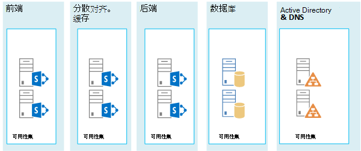
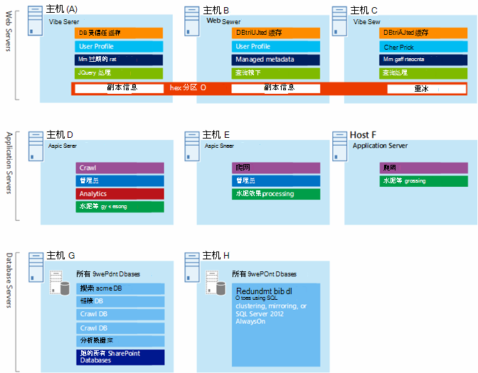

# SharePoint 2013 的 Microsoft Azure 体系结构

Azure 是用于托管 SharePoint Server 2013 解决方案的绝佳环境。 在大多数情况下，我们建议Microsoft 365，SharePoint Azure 中托管的服务器场是特定解决方案的一个不错的选择。 本文介绍如何构建 SharePoint 解决方案，使它们适合 Azure 平台。 我们将以下面两个特定解决方案为例进行说明：
  
- [Microsoft Azure 中的 SharePoint Server 2013 灾难恢复](sharepoint-server-2013-disaster-recovery-in-microsoft-azure.md)
    
- [Microsoft Azure 中使用 SharePoint Server 2013 的 Internet 站点](internet-sites-in-microsoft-azure-using-sharepoint-server-2013.md)
    
## 用于 Azure 基础结构服务的建议 SharePoint 解决方案

Azure 基础结构服务是用于托管 SharePoint 解决方案的极具吸引力的选项。某些解决方案比其他解决方案更适合此平台。下表显示了建议的解决方案。
  
|**解决方案**|**为何建议将此解决方案用于 Azure**|
|:-----|:-----|
|开发和测试环境    |创建和管理这些环境非常容易。    |
|将内部部署 SharePoint 服务器场灾难恢复到 Azure    |**承载的辅助数据中心** 使用 Azure，而不是在其他地区投资建设辅助数据中心。   **低成本灾难恢复环境** 维护和支付比内部部署灾难恢复环境更少的资源。资源数量取决于您选择的灾难恢复环境：冷备用、温备用或热备用。  **更有弹性的平台** 如果发生灾难，轻松扩展恢复 SharePoint 服务器场以满足负载要求。当您不再需要这些资源时，进行缩放。  请参阅[Microsoft Azure 中的 SharePoint Server 2013 灾难恢复](sharepoint-server-2013-disaster-recovery-in-microsoft-azure.md)。    |
|使用功能和缩放功能的面向 Internet 的网站在 Microsoft 365    |**集中精力** 构建一个很棒的网站，而不是构建基础结构。   **利用 Azure 中的弹性** 根据需要通过添加新服务器调整服务器场大小，仅支付您需要的资源。不支持动态计算机分配（自动缩放）。  **使用 Azure Active Directory (AD)** 利用客户帐户的 Azure AD。   **添加SharePoint中不可用的Microsoft 365** 添加深度报告和 Web 分析。   请参阅[Microsoft Azure 中使用 SharePoint Server 2013 的 Internet 站点](internet-sites-in-microsoft-azure-using-sharepoint-server-2013.md)。    |
|支持本地Microsoft 365或本地环境的应用程序场    |在 Azure 中构建、测试和承载应用程序，以支持内部部署和云环境。   在 Azure 中承载此角色，而无需为内部部署环境购买新硬件。   |
   
对于 Intranet 以及协作解决方案和工作负载，请考虑下列选项：
  
- 确定Microsoft 365业务要求，还是作为解决方案的一部分。 Microsoft 365提供始终保持最新的丰富功能集。
    
- 如果Microsoft 365业务要求，请考虑 Microsoft 咨询服务和 MCS) 中的 SharePoint 2013 (标准实现。 相比自定义体系结构而言，标准体系结构的支持更快速、便宜和简单。 
    
- 如果标准实现不满足您的业务需求，请考虑使用自定义的内部部署解决方案。
    
- 如果使用云平台对于满足您的业务需求非常重要，请考虑托管在 Azure 中的 SharePoint 2013 的标准或自定义实现。相比其他非纯 Microsoft 公共云平台而言，在 Azure 中支持 SharePoint 解决方案要容易得多。
    
## 设计 Azure 环境之前

本文以 SharePoint 拓扑为例，您可以将这些设计理念用于任何 SharePoint 服务器场拓扑。在设计 Azure 环境之前，请使用以下拓扑、体系结构、容量和性能指导设计 SharePoint 服务器场：
  
- [面向 SharePoint 2013 IT 专业人员的体系结构设计](/SharePoint/technical-reference/technical-diagrams)
    
- [Plan for performance and capacity management in SharePoint Server 2013](/SharePoint/administration/performance-planning-in-sharepoint-server-2013)
    
## 确定 Active Directory 域类型

每个 SharePoint 服务器场依赖于 Active Directory 来提供用于服务器场设置的管理帐户。目前，Azure 中提供 SharePoint 解决方案的两个选项。将在下表中介绍详细信息。
  
|**选项**|**说明**|
|:-----|:-----|
|专用域    |您可以在 Azure 中部署一个隔离的专用 Active Directory 域以支持您的 SharePoint 服务器场。这是面向公众的 Internet 站点的最佳选择。    |
|通过跨界连接扩展本地域    |当您通过跨界连接扩展本地域时，用户通过您的 Intranet 访问 SharePoint 服务器场，就像它托管在本地一样。您可以利用您的本地 Active Directory 和 DNS 实现。    在 Azure 中构建灾难恢复环境以便从本地服务器场进行故障转移时，将需要跨界连接。    |
   
本文介绍通过跨界连接扩展本地域的设计理念。如果您的解决方案使用专用域，则不需要跨界连接。
  
## 设计虚拟网络

首先，您在 Azure 中需要有一个虚拟网络，其中包括您将用于放置虚拟机的子网。虚拟网络需要专用 IP 地址空间，其中的某些部分将分配给子网。
  
如果要通过（灾难恢复环境所必需的）跨域连接将本地网络扩展到 Azure，则必须选择一个未在组织网络中的任何位置使用的专用地址空间，其中可以包括您的本地环境和其他 Azure 虚拟网络。 
  
**图 1：本地环境和 Azure 中的虚拟网络。**

  
在此图中：
  
- Azure 中的虚拟网络与本地环境并列。两个环境尚未通过跨界连接（可以是站点到站点 VPN 连接，也可以是 ExpressRoute）进行连接。
    
- 在这种情况下，虚拟网络仅包括子网，不包括任何其他体系结构元素。一个子网将托管 Azure 网关，其他的子网将托管 SharePoint 场层，还有另外一个子网将托管 Active Directory 和 DNS。
    
## 添加跨界连接

下一个部署步骤将创建跨界连接（如果适用于您的解决方案）。对于跨界连接，Azure 网关驻留在单独的网关子网中，您必须创建和分配地址空间。 
  
在计划跨界连接时，您将定义并创建 Azure 网关和到本地网关设备的连接。
  
**图 2：使用 Azure 网关和本地网关设备提供本地环境和 Azure 之间的站点到站点连接**

  
在此图中：
  
- 添加到上图中时，本地环境将通过跨界连接（可以是站点到站点 VPN 连接，也可以是 ExpressRoute）来连接到 Azure 虚拟网络。
    
- Azure 网关位于网关子网上。
    
- 本地环境包括网关设备，如路由器或 VPN 服务器。
    
有关规划和创建跨界虚拟网络的其他信息，请参阅[将本地网络连接到 Microsoft Azure 虚拟网络](connect-an-on-premises-network-to-a-microsoft-azure-virtual-network.md)。
  
## 将 Active Directory 域服务 (AD DS) 和 DNS

在 Azure 中进行灾难恢复时，您在混合方案中部署 Windows Server AD 和 DNS，其中 Windows Server AD 部署在本地和 Azure 虚拟机上。
  
**图 3：混合 Active Directory 域配置**

  
此图在上一张图的基础之上构建，它将两个虚拟机添加到 Windows Server AD 和 DNS 子网。这些虚拟机是域控制器和 DNS 服务器的副本。它们是本地 Windows Server AD 环境的扩展。 
  
下表为 Azure 中的这些虚拟机提供了配置建议。使用这些建议作为设计您自己的环境的起点，即使是对 Azure 环境不与本地环境通信的专用域也是如此。
  
|**项**|**配置**|
|:-----|:-----|
|Azure 中的虚拟机大小    |标准层中的 A1 或 A2 大小    |
|操作系统    |Windows Server 2012 R2    |
|Active Directory 角色    |指定为全局目录服务器的 AD DS 域控制器。此配置减少了通过跨界连接的输出流量。    在高更改率（这并不常见）多域环境中，将内部部署域控制器配置为不与 Azure 中的全局目录服务器同步，以减少复制流量。    |
|DNS 角色    |在域控制器上安装和配置 DNS 服务器服务。    |
|数据磁盘    |将 Active Directory 数据库、日志和 SYSVOL 放在其他 Azure 数据磁盘上。不要将它们放在操作系统磁盘或 Azure 提供的临时磁盘上。    |
|IP 地址    |使用静态 IP 地址，并在域控制器配置完毕后，将虚拟机网络配置为将这些地址分配到虚拟网络中的虚拟机。    |
   
> [!IMPORTANT]
> 在 Azure 中部署 Active Directory 之前，阅读[在 Azure 虚拟机上部署 Windows Server Active Directory 的指南](/windows-server/identity/ad-ds/introduction-to-active-directory-domain-services-ad-ds-virtualization-level-100)。这些指南将帮助您确定您的解决方案是否需要不同的体系结构或不同的配置设置。 
  
## 添加 SharePoint 服务器场

将 SharePoint 服务器场虚拟机置于适当的子网的层级中。
  
**图 4：SharePoint 虚拟机的位置**

  
此图构建在上一张图的基础之上，它将 SharePoint 服务器场服务器角色添加到了相应的层级中。
  
- 运行 SQL Server 的两个数据库虚拟机创建数据库层。
    
- 运行以下每个层级的 SharePoint Server 2013 的两个虚拟机：前端服务器、分布式缓存服务器和后端服务器。
    
## 设计和优化可用性集和错误域的服务器角色

错误域是角色实例在其中运行的硬件分组。同一错误域中的虚拟机可同时由 Azure 基础结构更新。否则它们可能同时发生故障，因为它们共享同一个机架。为避免同一错误域上具有两个虚拟机的风险，可以将您的虚拟机配置为可用性集，这可确保每个虚拟机位于不同的错误域中。如果三个虚拟机均配置为可用性集，Azure 保证位于同一错误域中的虚拟机不超过两个。
  
为 SharePoint 服务器场设计 Azure 体系结构时，将相同的服务器角色配置为可用性集的一部分。这样可以确保您的虚拟机的分布在多个错误域。
  
**图 5：使用 Azure 可用性集为 SharePoint 服务器层级提供高可用性**

  
此图调用 Azure 基础结构内可用性集的配置。下面每一个角色使用一个单独的可用性集：
  
- Active Directory 和 DNS
    
- 数据库
    
- 后端
    
- 分布式缓存
    
- 前端
    
SharePoint 服务器场可能需要在 Azure 平台中进行优化。要确保所有组件的高可用性，请确保服务器角色的配置均相同。
  
下面是一个示例，其中显示了满足特定容量和性能目标的标准 Internet 网站体系结构。此示例显示了以下体系结构模型的特点：[SharePoint Server 2013 的 Internet 网站搜索体系结构](https://go.microsoft.com/fwlink/p/?LinkId=261519)。
  
**图 6：三层服务器场的容量和性能目标规划示例**

  
在此图中：
  
- 显示了三层服务器场：Web 服务器、应用程序服务器和数据库服务器。
    
- 三个 Web 服务器配置相同，均具有多个组件。
    
- 两个数据库服务器的配置相同。
    
- 三个应用程序服务器的配置不相同。这些服务器角色需要对 Azure 中的可用性集进行优化。
    
让我们进一步了解一下应用程序服务器层。
  
**图 7：优化之前的应用程序服务器层**

  
在此图中：
  
- 三个服务器都包含在应用程序层中。
    
- 第一个服务器包含四个组件。
    
- 第二个服务器包括三个组件。
    
- 第三个服务器包含两个组件。
    
您可按服务器场的性能和容量目标确定组件数量。要调整 Azure 的此体系结构，我们将在所有三个服务器之间复制这四个组件。这将增加除性能和容量所需组件以外的组件数量。权衡点是当将这三个虚拟机分配至某个可用性集时，此设计确保了 Azure 平台中所有四个组件的高可用性。
  
**图 8：优化之后的应用程序服务器层**

  
此图显示了使用相同的四个组件进行相同配置的所有三个应用程序服务器。
  
将可用性集添加到 SharePoint 场层后，即完成实现过程。
  
**图 9：Azure 基础结构服务中已完成的 SharePoint 服务器场**

  
此图显示在 Azure 基础结构服务中实现的 SharePoint 服务器场，以及为每个层级中的服务器提供故障域的可用性集。
  
## 另请参阅

[Microsoft 365 解决方案和体系结构中心](../solutions/index.yml)
  
[Microsoft Azure 中使用 SharePoint Server 2013 的 Internet 站点](internet-sites-in-microsoft-azure-using-sharepoint-server-2013.md)
  
[Microsoft Azure 中的 SharePoint Server 2013 灾难恢复](sharepoint-server-2013-disaster-recovery-in-microsoft-azure.md)