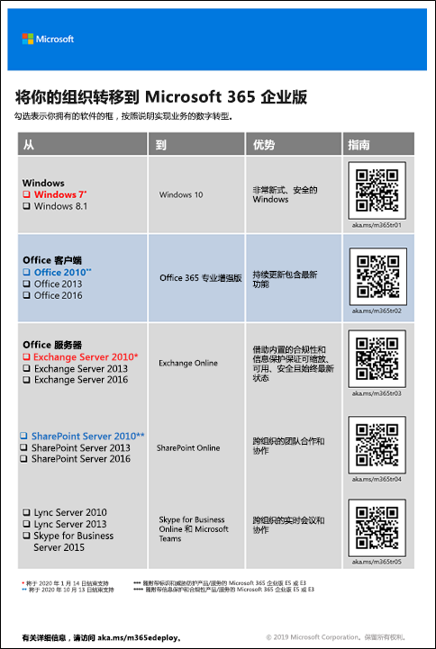

# 迁移到 Microsoft 365 企业版Migration to Microsoft 365 Enterprise

大多数企业组织拥有带有多种版本的操作系统、客户端软件和服务器软件的异类环境。Microsoft 365 企业版包含这些 IT 基础结构的关键组件的最安全版本，其中生产功能利用云技术设计。Most enterprise organizations have a heterogeneous environment with multiple releases of operating systems, client software, and server software. Microsoft 365 Enterprise includes the most secure versions of these key components of your IT infrastructure with productivity features that are designed to take advantage of cloud technologies.

要最大限度提高集成了产品套件的 Microsoft 365 企业版的业务价值，请开始规划并实施迁移以下版本的策略：To maximize the business value of the Microsoft 365 Enterprise integrated suite of products, begin planning and implementing a strategy to migrate releases of:

- 安装在计算机上的 Office 客户端迁移到 Office 365 专业增强版The Office client installed on your computers to Office 365 ProPlus
- 安装在服务器上的 Office 服务器迁移到 Office 365 中的等效服务中Office servers installed on your servers to their equivalent services in Office 365
- 设备上 Windows 7 和 Windows 8.1 迁移到 Windows 10 企业版Windows 7 and Windows 8.1 on your devices to Windows 10 Enterprise

>[!Note]
>将于 2020 年 1 月 14 日结束对 Windows 7 的支持。Windows 7 reaches end of support on January 14, 2020. 有关详细信息，请单击[此处](https://support.microsoft.com/help/4057281/windows-7-support-will-end-on-january-14-2020)。For more information, click [?](https://support.microsoft.com/help/4057281/windows-7-support-will-end-on-january-14-2020).
>

随着时间的推移，完成所有这些迁移使你的组织更接近[新式工作区](https://www.microsoft.com/microsoft-365/blog/2018/04/27/making-it-simpler-with-a-modern-workplace/)，这是一种安全且集成的环境，可释放组织中的团队合作精神和创造力，所有这些都由 Microsoft 365 企业版启用和授权。Accomplishing all of these migrations over time gets your organization closer to the [modern workplace](https://www.microsoft.com/microsoft-365/blog/2018/04/27/making-it-simpler-with-a-modern-workplace/), a secure and integrated environment that unlocks teamwork and creativity in your organization, all of which is enabled and empowered by Microsoft 365 Enterprise. 

有关迁移特定 Office 365 工作负载的用户和数据的信息：For information about migrating users and data for specific Office 365 workloads:

- 从 Exchange Server 到 Exchange Online 的用户邮箱，请参阅 [Exchange Online 工作负载](exchangeonline-workload.md)。User mailboxes from Exchange Server to Exchange Online, see the [Exchange Online workload](exchangeonline-workload.md).
- 从 SharePoint Server 到 SharePoint Online 的 SharePoint 数据，请参阅 [SharePoint Online 工作负载](sharepoint-online-onedrive-workload.md)。SharePoint data from SharePoint Server to SharePoint Online, see the [SharePoint Online workload](sharepoint-online-onedrive-workload.md).
- Microsoft Teams 的 Skype for Business，请参阅 [Microsoft Teams 工作负载](teams-workload.md)。Skype for Business Online to Microsoft Teams, see the [Microsoft Teams workload](teams-workload.md).

## Microsoft Office 客户端产品迁移Migration for Microsoft Office client products

在许多大小组织中，你可能都会使用旧版 Office 客户端产品（如 Word、Excel 和 PowerPoint）的组合。这些旧版本：In many organizations both large and small, you might be using a combination of older versions of the Office client products, such as Word, Excel, and PowerPoint. These older versions:

- 可以使用最新的安全更新和支持修补程序[更新](https://support.office.com/article/install-office-updates-2ab296f3-7f03-43a2-8e50-46de917611c5)，但该过程有时是手动的，可能无法在整个组织内缩放。Can be [updated](https://support.office.com/article/install-office-updates-2ab296f3-7f03-43a2-8e50-46de917611c5) with the latest security updates and support fixes, but the process is sometimes manual and might not scale across your organization.
- 未能最佳利用 Microsoft 云技术并帮助你数字化转换业务。Are not optimally enabled to leverage Microsoft’s cloud technologies and help you digitally transform your business.
 
Microsoft 365 企业版包含 Office 365 专业增强版，这是 Office 365 客户端产品的一个版本，可与 Microsoft 365 企业版许可证一起使用，并从 Microsoft 云安装和更新。有关详细信息，请参阅[关于企业中的 Office 365 专业增强版](https://docs.microsoft.com/deployoffice/about-office-365-proplus-in-the-enterprise)。Microsoft 365 Enterprise includes Office 365 ProPlus, a version of the Office client products that is available with a Microsoft 365 Enterprise license and is installed and updated from the Microsoft cloud. See [About Office 365 ProPlus in the enterprise](https://docs.microsoft.com/deployoffice/about-office-365-proplus-in-the-enterprise) for more information.

### Office 2007Office 2007

对于 Office 2007 版本中的 Office 版本，停止提供支持时间已过。有关详细信息，请参阅 [Office 2007 停止提供支持路线图](https://docs.microsoft.com/deployoffice/office-2007-end-support-roadmap)。For versions of Office in the Office 2007 release, the end of support has already passed. See [Office 2007 End of Support Roadmap](https://docs.microsoft.com/deployoffice/office-2007-end-support-roadmap) for more information.

与其通过 Office 2010、Office 2013 或 Office 2016 升级运行 Office 2007 的计算机，不如考虑：Rather than upgrading your computers running Office 2007 with Office 2010, Office 2013, or Office 2016, consider:

1. 为用户获取并分配 Microsoft 365 许可证。Obtaining and assigning a Microsoft 365 license for your users.
2. 卸载其计算机中的 Office 2007。Uninstalling Office 2007 on their computers.
3. 单独安装 Office 365 专业增强版或在 IT 部署时安装 Office 365 专业增强版。有关详细信息，请参阅[阶段4：Office 365 专业增强版](office365proplus-infrastructure.md)。Installing Office 365 ProPlus, either individually or in conjunction with an IT rollout. For more information, see [Phase 4: Office 365 ProPlus](office365proplus-infrastructure.md).

Office 365 专业增强版会自动安装更新，并可利用 Office 365 中基于云的服务来提高安全性和生产效率。Office 365 ProPlus installs updates automatically and can take advantage of cloud-based services in Office 365 for enhanced security and productivity.

### Office 2010Office 2010

对于 Office 2010 版本中的 Office 版本，停止提供支持时间为 2020 年 10 月 13 日。有关详细信息，请参阅 [Office 2010 停止提供支持路线图](https://docs.microsoft.com/deployoffice/office-2010-end-support-roadmap)。For versions of Office in the Office 2010 release, the end of support is October 13, 2020. For more information, see [Office 2010 end of support roadmap](https://docs.microsoft.com/deployoffice/office-2010-end-support-roadmap).

与其通过 Office 2013 或 Office 2016 升级运行 Office 2010 的计算机（两种方式均必须手动更新），不如考虑：Rather than upgrading your computers running Office 2010 with Office 2013 or Office 2016, both of which must be manually updated, consider: 

1. 为用户获取并分配 Microsoft 365 许可证。Obtaining and assigning a Microsoft 365 license for your users.
2. 卸载其计算机中的 Office 2010。Uninstalling Office 2010 on their computers.
3. 单独安装 Office 365 专业增强版或在 IT 部署时安装 Office 365 专业增强版。有关详细信息，请参阅[阶段4：Office 365 专业增强版](office365proplus-infrastructure.md)。Installing Office 365 ProPlus, either individually or in conjunction with an IT rollout. For more information, see [Phase 4: Office 365 ProPlus](office365proplus-infrastructure.md).

Office 365 专业增强版会自动安装更新，并可利用 Office 365 中基于云的服务来提高安全性和生产效率。Office 365 ProPlus installs updates automatically and can take advantage of cloud-based services in Office 365 for enhanced security and productivity.

### Office 2013 和 Office 2016Office 2013 and Office 2016

尚未确定 Office 的 Office 2013 和 Office 2016 版本的停止提供支持路线图。但是，与 Office 2010 一样，你仍然必须[安装更新](https://support.office.com/article/install-office-updates-2ab296f3-7f03-43a2-8e50-46de917611c5)，根据组织规模，这些更新可能无法很好地缩放。与其不断使用 Office 2013 或 Office 2016 的最新更新来更新计算机或将计算机从 Office 2013 更新到 Office 2016，不如考虑：The end of support roadmap for the Office 2013 and Office 2016 versions of Office has not yet been determined. However, like Office 2010, you must still [install updates](https://support.office.com/article/install-office-updates-2ab296f3-7f03-43a2-8e50-46de917611c5), which might not scale well depending on the size of your organization. Rather than keep updating your computers with the latest updates for Office 2013 or Office 2016 or update your computers from Office 2013 to Office 2016, consider:

1. 为用户获取并分配 Microsoft 365 许可证。Obtaining and assigning a Microsoft 365 license for your users.
2. 卸载其计算机中的 Office 2013 或 Office 2016。Uninstalling Office 2013 or Office 2016 on their computers.
3. 单独安装 Office 365 专业增强版或在 IT 部署时安装 Office 365 专业增强版。有关详细信息，请参阅[阶段4：Office 365 专业增强版](office365proplus-infrastructure.md)。Installing Office 365 ProPlus, either individually or in conjunction with an IT rollout. For more information, see [Phase 4: Office 365 ProPlus](office365proplus-infrastructure.md).

Office 365 专业增强版会自动安装更新，并可利用 Office 365 中基于云的服务来提高安全性和生产效率。Office 365 ProPlus installs updates automatically and can take advantage of cloud-based services in Office 365 for enhanced security and productivity.

## Microsoft Office 服务器产品迁移Migration for Microsoft Office server products

在许多大小组织中，你可能都会使用旧版 Office 服务器产品（如 Exchange Server 和 SharePoint Server）的组合。这些旧版本：In many organizations both large and small, you might be using a combination of older versions of the Office Server products, such as Exchange Server and SharePoint Server. These older versions:

- 应该更新最新的安全更新并支持修补程序。在某些情况下，这些更新每月发布一次。Should be updated with the latest security updates and support fixes. In some cases, these updates are released monthly.
- 未能最佳利用 Microsoft 云技术并帮助你数字化转换业务。Are not optimally enabled to leverage Microsoft’s cloud technologies and help you digitally transform your business.
- 请勿包含新的生产应用程序，例如 Microsoft Teams。Do not include new productivity applications, such as Microsoft Teams.
- 请勿包含最新的安全功能，例如 Exchange 高级威胁防护。Do not include the latest security features, such as Exchange Advanced Threat Protection.

Microsoft 365 企业版包括 Office 365，其中包括基于云的 Office 服务器服务版本，这些版本使用与本地 Office 服务器软件版本（如 Web 浏览器和 Outlook 客 户端）相同的工具。这些服务在不涉及 IT 的情况下不断更新，节省维护和更新本地服务器所需的时间。这些服务还具有 Office 服务器软件中没有的增强功能。Microsoft 365 Enterprise includes Office 365, which includes cloud-based versions of Office server services that use some of the same tools as on-premises versions of Office server software, such as web browsers and the Outlook client. These services are continually updated without involving IT, saving you the time it takes to maintain and update on-premises servers. These services also have enhancements not present in Office server software. 

### Office Server 2007Office Server 2007

对于 Office 2007 版本中的服务器产品，停止提供支持时间已过。有关详细信息，请参阅以下文章：For server products in the Office 2007 release, the end of support has already passed. See these articles for the details:

- [Exchange 2007 停止提供支持路线图Exchange 2007 end of support roadmap](https://docs.microsoft.com/office365/enterprise/exchange-2007-end-of-support)
- [SharePoint Server 2007 停止提供支持路线图SharePoint Server 2007 end of support roadmap](https://docs.microsoft.com/office365/enterprise/sharepoint-2007-end-of-support)
- [Project Server 2007 停止提供支持路线图Project Server 2007 end of support roadmap](https://docs.microsoft.com/office365/enterprise/project-server-2007-end-of-support)
- [Office Communications Server 停止提供支持路线图Office Communications Server end of support roadmap](https://docs.microsoft.com/skypeforbusiness/plan-your-deployment/upgrade)
- [PerformancePoint Server 2007 停止提供支持路线图PerformancePoint Server 2007 end of support roadmap](https://docs.microsoft.com/office365/enterprise/pps-2007-end-of-support)

与其通过 Office 2010、Office 2013 或 Office 2016 版本中的服务器产品升级 Office 2007 版本中的服务器产品，不如考虑：Rather than upgrading your server products in the Office 2007 release with server products in the Office 2010, Office 2013, or Office 2016 releases, consider:

1. 将 Office 2007 服务器上的数据迁移到 Office 365。为顺利完成此操作，请聘用 Microsoft 合作伙伴。Migrating the data on your Office 2007 servers to Office 365. To help with this, hire a Microsoft partner.
2. 向用户推出新功能和工作流程。Rolling out the new functionality and work processes to your users.
3. 如果不再需要运行 Office 2007 服务器产品的本地服务器，请将其停用。When there is no longer a need for the on-premises servers running Office 2007 server products, decommissioning them.

### Office Server 2010Office Server 2010

对于 Office 2010 版本中的服务器产品，已针对以下内容确定了停止提供支持的时间：For server products in the Office 2010 release, the end of support has been determined for the following:

- [Exchange Server 2010Exchange Server 2010](https://docs.microsoft.com/office365/enterprise/exchange-2010-end-of-support)
- [SharePoint Server 2010SharePoint Server 2010](https://docs.microsoft.com/office365/enterprise/upgrade-from-sharepoint-2010)

与其通过 Office 2013 或 Office 2016 版本中的服务器产品升级 Office 2010 版本中的服务器产品，不如考虑：Rather than upgrading these server products in the Office 2010 release with server products in the Office 2013 or Office 2016 release, consider:

1. 将 Office 2010 服务器上的数据迁移到 Office 365。为顺利完成此操作，请参阅[适用于 Microsoft 365 的 FastTrack](https://fasttrack.microsoft.com/microsoft365) 或聘用 Microsoft 合作伙伴。Migrating the data on your Office 2010 servers to Office 365. To help with this, see [FastTrack for Microsoft 365](https://fasttrack.microsoft.com/microsoft365) or hire a Microsoft partner.
2. 向用户推出新功能和工作流程。Rolling out the new functionality and work processes to your users.
3. 如果不再需要运行 Office 2010 服务器产品的本地服务器，请将其停用。When there is no longer a need for the on-premises servers running Office 2010 server products, decommissioning them.

### Office Server 2013Office Server 2013

对于 Office 2013 版本中的服务器产品，停止提供支持的时间尚未确定。与其通过 Office 2016 版本中的服务器产品升级 Office 2013 版本中的服务器产品，不如考虑：For server products in the Office 2013 release, the end of support has not been determined. Rather than upgrading your server products in the Office 2013 release with server products in the Office 2016 release, consider:

1. 将 Office 2013 服务器上的数据迁移到 Office 365。为顺利完成此操作，请参阅[适用于 Microsoft 365 的 FastTrack](https://fasttrack.microsoft.com/microsoft365) 或聘用 Microsoft 合作伙伴。Migrating the data on your Office 2013 servers to Office 365. To help with this, see [FastTrack for Microsoft 365](https://fasttrack.microsoft.com/microsoft365) or hire a Microsoft partner.
2. 向用户推出新功能和工作流程。Rolling out the new functionality and work processes to your users.
3. 如果不再需要运行 Office 2013 服务器产品的本地服务器，请将其停用。When there is no longer a need for the on-premises servers running Office 2013 server products, decommissioning them.

### Office Server 2016Office Server 2016

对于 Office 2016 版本中的服务器产品，停止提供支持的时间尚未确定。要利用基于云的服务和增强功能对业务进行数字化转型，请考虑：For server products in the Office 2016 release, the end of support has not been determined. To take advantage of the cloud-based service and enhancements to digitally transform your business, consider:

1. 将 Office 2016 服务器上的数据迁移到 Office 365。为顺利完成此操作，请参阅[适用于 Microsoft 365 的 FastTrack](https://fasttrack.microsoft.com/microsoft365) 或聘用 Microsoft 合作伙伴。Migrating the data on your Office 2016 servers to Office 365. To help with this, see [FastTrack for Microsoft 365](https://fasttrack.microsoft.com/microsoft365) or hire a Microsoft partner.
2. 向用户推出新功能和工作流程。Rolling out the new functionality and work processes to your users.
3. 如果不再需要运行 Office 2016 服务器产品的本地服务器，请将其停用。When there is no longer a need for the on-premises servers running Office 2016 server products, decommissioning them.

## Microsoft Windows 迁移Migration for Microsoft Windows

要迁移运行 Windows 7 或 Windows 8.1 的设备，可以执行[就地升级](https://docs.microsoft.com/microsoft-365/enterprise/windows10-deploy-inplaceupgrade)。To migrate your devices running Windows 7 or Windows 8.1, you can perform an [in-place upgrade](https://docs.microsoft.com/microsoft-365/enterprise/windows10-deploy-inplaceupgrade). 

有关其他方法，请参阅 [Windows 10 部署方案](https://docs.microsoft.com/windows/deployment/windows-10-deployment-scenarios)。你也可以自行规划 [Windows 10 部署](https://aka.ms/planforwin10deployment)。For additional methods, see [Windows 10 deployment scenarios](https://docs.microsoft.com/windows/deployment/windows-10-deployment-scenarios). You can also [plan for Windows 10 deployment](https://aka.ms/planforwin10deployment) on your own.

## Microsoft 如何对 Microsoft 365 企业版执行操作How Microsoft does Microsoft 365 Enterprise

了解 Microsoft 的 IT 专家如何使用以下这些资源将公司迁移到 Microsoft 365 企业版：See how IT experts at Microsoft migrated the company to Microsoft 365 Enterprise with these resources: 

- [部署和更新 Microsoft Office 365 专业增强版Deploying and updating Microsoft Office 365 ProPlus](https://www.microsoft.com/itshowcase/Article/Content/757/Deploying-and-updating-Microsoft-Office-365-ProPlus)
- [Microsoft 将 150,000 个邮箱迁移到 Exchange OnlineMicrosoft migrates 150,000 mailboxes to Exchange Online](https://www.microsoft.com/itshowcase/Article/Content/577/Microsoft-migrates-150000-mailboxes-to-Exchange-Online)
- [将 SharePoint 迁移到云：了解 Microsoft 如何运行自己的迁移SharePoint to the cloud: Learn how Microsoft ran its own migration](https://www.microsoft.com/itshowcase/Article/Content/691/SharePoint-to-the-cloud-Learn-how-Microsoft-ran-its-own-migration)
- [在 Microsoft 中将 Windows 10 部署为就地升级Deploying Windows 10 at Microsoft as an in-place upgrade](https://www.microsoft.com/itshowcase/Article/Content/668/Deploying-Windows-10-at-Microsoft-as-an-inplace-upgrade)
- [Windows 10 部署：来自 Microsoft IT 部门的提示和技巧](https://www.microsoft.com/itshowcase/Article/Content/951/Windows-10-deployment-tips-and-tricks-from-Microsoft-IT)（视频）[Windows 10 deployment: tips and tricks from Microsoft IT](https://www.microsoft.com/itshowcase/Article/Content/951/Windows-10-deployment-tips-and-tricks-from-Microsoft-IT) (video)

## 转换整个组织Transition your entire organization

要更好地了解如何将真个组织转移到 Microsoft 365 企业版，请下载[转换海报](https://github.com/MicrosoftDocs/microsoft-365-docs/raw/public/microsoft-365/enterprise/media/deploy-microsoft-365-enterprise/transitionorgtom365.pdf)。To get a better picture of how to move your entire organization to Microsoft 365 Enterprise, download the [transition poster](https://github.com/MicrosoftDocs/microsoft-365-docs/raw/public/microsoft-365/enterprise/media/deploy-microsoft-365-enterprise/transitionorgtom365.pdf).

此海报包含两页内容，可借助它快速盘点现有基础结构并获取有关转移到 Microsoft 365 企业版中相应产品或服务的指南。This two-page poster is a quick way to inventory your existing infrastructure and get to the guidance for moving to the corresponding product or service in Microsoft 365 Enterprise. 它包含本文中的产品，还涵盖了设备管理、标识及信息和威胁防护等其他基础结构和安全元素。It includes the products in this article and other infrastructure and security elements such as device management, identity, and information and threat protection.

可按letter、legal 或 tabloid (11 x 17) 格式打印此海报。You can print this poster in letter, legal, or tabloid (11 x 17) formats.

## 结果Result

你的组织已将 Microsoft Office、Office 服务器和 Windows 的早期版本迁移到 Microsoft 365 企业版。Your organization has migrated older versions of Microsoft Office, Office servers, and Windows to Microsoft 365 Enterprise.
