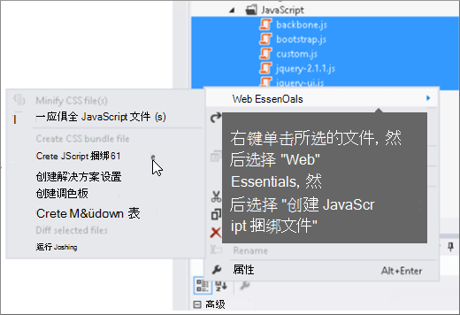
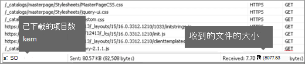

# SharePoint Online 中的缩小和捆绑

本文介绍如何将缩小和捆绑技术与 Web Essentials 一同使用，以减少 HTTP 请求数并减少在 SharePoint Online 中加载页面所花的时间。
  
当您自定义网站时，您最终可以向服务器添加大量额外的文件以支持自定义。 添加额外的 JavaScript、CSS 和图像会增加对服务器的 HTTP 请求数，进而增加显示网页的时间。 如果有多个相同类型的文件，可以捆绑这些文件，以加快下载这些文件的速度。
  
对于 JavaScript 和 CSS 文件，您还可以使用一种称为缩小的方法，通过删除不需要的空格和其他字符来减小文件的总大小。
  
## 使用 Web Essentials 缩小和捆绑 JavaScript 和 CSS 文件

可以使用第三方软件（如 Web Essentials）捆绑 CSS 和 JavaScript 文件。
  
> [!IMPORTANT]
> Web Essentials 是一个基于社区的第三方开放源代码项目。 该软件是 Visual Studio 2012 和 Visual Studio 2013的扩展，不受 Microsoft 支持。 若要下载 Web Essentials，请访问 位于 的网站 [https://vswebessentials.com/download](https://go.microsoft.com/fwlink/p/?LinkId=525629) 。 
  
Web Essentials 提供两种形式的捆绑：
  
- .bundle：用于 CSS 和 JavaScript 文件
    
- .sprite：适用于 (仅在 Visual Studio 2013) 
    
如果您的现有功能具有自定义母版页中引用的一些品牌元素，您可以使用 Web Essentials，例如：
  

  
 **在 Web Essentials 中创建 TE000127218 和 CSS 捆绑包**
  
1. 在Visual Studio"解决方案资源管理器"中，选择要包括在捆绑包中的文件。
    
2. 右键单击所选文件，然后从上下文菜单中选择 **"Web Essentials** \> **创建 JavaScript** 捆绑文件"。 例如： 
    
    
  
## 查看绑定 JavaScript 和 CSS 文件的结果

创建 JavaScript 和 CSS 捆绑包时，Web Essentials 会创建一个 XML 文件，该文件称为食谱文件，用于标识 JavaScript 和 CSS 文件以及其他一些配置信息： 
  

  
此外，如果在捆绑方法中将缩小标志设置为 true，则文件会减小大小并捆绑在一起。 这意味着已创建可在母版页中引用的 JavaScript 文件的新缩小版本。
  

  
从网站加载页面时，可以使用 Web 浏览器（如 Internet Explorer 11）中的开发人员工具查看发送到服务器的请求数以及加载每个文件所需要时间。
  
下图是在缩小之前加载 JavaScript 和 CSS 文件的结果。
  

  
将 CSS 和 JavaScript 文件捆绑在一起后，丢弃至 74 的请求数，每个文件仅比原始文件稍长一些，以单独下载：
  

  
捆绑后，JavaScript 捆绑文件将显著从 815KB 减少为 365KB：
  

  
## 通过创建图像子画面绑定图像

与将 JavaScript 和 CSS 文件捆绑在一起的方式类似，可以将许多小图标和其他常见图像组合到一个较大的子画面工作表中，然后使用 CSS 显示各个图像。 用户的 Web 浏览器会下载子画面工作表一次，然后将它缓存在本地计算机上，而不是下载每个单独的图像。 这将减少下载次数和到 Web 服务器的往返次数，从而提高页面加载性能。
  
 **在 Web Essentials 中创建图像子画面**
  
1. 在Visual Studio"解决方案资源管理器"中，选择要包括在捆绑包中的文件。
    
2. 右键单击所选文件，然后从上下文菜单中选择 **"Web Essentials** \> **创建** 图像子画面"。 例如： 
    
    
  
3. 选择保存子画面文件的位置。 .sprite 文件是描述子画面中的设置和文件的 XML 文件。 下图显示了子画面 PNG 文件及其相应的 .sprite XML 文件的示例。
    
    
  
    
  

