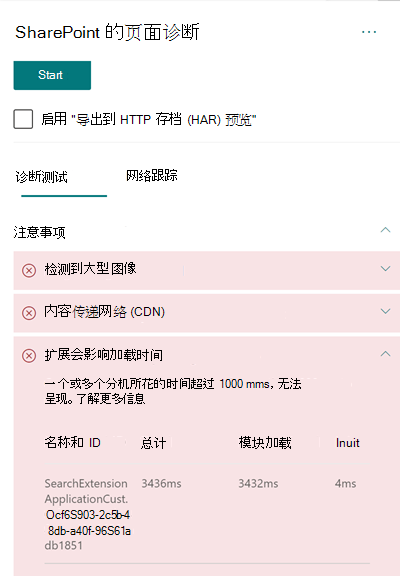

# 在 SharePoint Online 新式网站页面中优化自定义扩展的性能

本文将帮助你了解如何确定自定义扩展在哪些方面影响了用户感知到的延迟，以及如何修正常见问题。

## 使用适用于 SharePoint 的页面诊断工具分析自定义扩展

适用于 SharePoint 的页面诊断工具是一款面向新 Microsoft Edge（https://www.microsoft.com/edge) 和 Chrome 浏览器）的浏览器扩展，可用于分析 SharePoint Online 新式门户和经典发布网站页面。 该工具对已分配的每个页面提供一个报告，其中显示根据一组定义的性能条件得出的页面性能情况。 要安装和了解适用于 SharePoint 的页面诊断工具，请参阅[使用适用于 SharePoint Online 的页面诊断工具](page-diagnostics-for-spo.md)。

>[!NOTE]
>页面诊断工具仅适用于 SharePoint Online，无法用于 SharePoint 系统页面。

采用适用于 SharePoint 的页面诊断工具分析 SharePoint 网站页面时，可在“_诊断测试_”窗格的“**扩展影响加载时间**”和/或“**所用的扩展过多**”结果中，查看有关超出基线指标的自定义扩展的信息。 

可能的结果包括：

- **需要注意**（红色）：加载时间超过 **一** 秒钟的任何 _自定义_ 扩展。 测试结果中显示的总加载时间按模块加载和初始化进行细分。 此外，如果页面上的扩展过多，它们可能会影响页面加载时间，如果页面上使用了 **7** 或更多扩展，则会突出显示这种情况。
- **改进机会**（黄色）如果使用了 **五个** 或多个扩展名，它们将在本节中被突出显示为警告，直到七个或更多扩展名被使用，然后将其突出显示为“需要注意”。
- **无需执行任何操作**（绿色）：加载扩展所需的时间不超过一秒钟。

如果扩展影响页面加载时间或页面上的扩展过多，则结果将显示在结果的" **需要注意** "部分。 单击结果，以查看有关哪个扩展正在缓慢加载的详细信息或已突出显示太多扩展。 适用于 SharePoint 的页面诊断工具的未来更新可能包括更新分析规则，因此请确保始终拥有该工具的最新版本。

结果中的可用信息包括：

- **名称和 ID** 显示可帮助你在页面上查找扩展的标识信息
- **Total** 显示模块加载和初始化扩展的总时间。 它是扩展在页面上从开始到结束执行所花时间的总相对时间。
- **模块** 加载显示下载、评估和加载扩展 JavaScript 和 CSS 文件所花时间。 然后，它将启动 Init 进程。
- **Init** 显示扩展初始化数据所花时间。

  它是异步调用，init 时间是返回的承诺解析时 onInit 函数的时间计算。

提供此信息是为了帮助设计人员和开发人员解决问题。 此信息应提供给你的设计和开发团队。

## 扩展概述

可以使用 SharePoint 框架 (SPFx) 扩展来扩展 SharePoint 用户体验。 使用 SharePoint 框架扩展，可以自定义 SharePoint 体验的更多方面，包括通知区域、工具栏和列表数据视图。

扩展可能会严重影响 SharePoint 页面的性能，因为它还需要 CPU 和网络资源来完成所需的工作。

扩展有四种类型：

- **应用程序定制器** 将脚本添加到页面，访问众所周知的 HTML 元素占位符，并使用自定义呈现来扩展它们。
- **字段定制器** 为列表中的字段数据提供修改的视图。
- **命令集** 扩展 SharePoint 命令平面以添加新操作，并提供可用于实现行为的客户端代码。
- **搜索查询修饰符（仅供预览）** 将在执行搜索查询之前被调用。

## 修正扩展性能问题

按照本节指导来识别和修正“**扩展影响页面加载时间**”结果中列出的扩展的性能问题。

>[!NOTE]
>应用程序定制器可能会在页面生命周期的早期阶段执行，并可能会影响页面上其他扩展的性能。

页面诊断工具中的审核结果将显示执行扩展的两个阶段，以帮助确定潜在的性能影响。

- **模块加载** 是加载扩展所需的时间，它受扩展大小的影响，因此最好只将必需的库捆绑在扩展中，同时选择较轻的库。
- **初始化** 是扩展的初始化时间，扩展开发人员应考虑扩展在初始化阶段是否执行了不必要的工作还是执行太多命令。

页面作者还可以使用审核结果来查看页面是否具有过多的扩展，因为过多的扩展会对页面的性能产生负面影响。

- **扩展大小和依赖项**
  - 最佳静态资源下载需要使用 Office 365 CDN。 公用 CDN 来源更适合 _js/css_ 文件。 有关使用 Office 365 CDN 的详细信息，请参阅[结合使用 Office 365 内容分发网络 (CDN) 和 SharePoint Online](use-microsoft-365-cdn-with-spo.md)。
  - 重复使用作为 SharePoint 框架 (SPFx) 一部分的 _React_ 和 _Fabric 导入_ 等框架。 有关详细信息，请参阅 [SharePoint 框架概述](/sharepoint/dev/spfx/sharepoint-framework-overview)。
  - 确保你使用的是最新版本的 SharePoint 框架，并在新版本推出时进行升级。
- **数据提取/缓存**
  - 如果扩展依赖额外的服务器调用来提取数据以进行显示，请确保这些服务器 API 运行快速且/或实施客户端缓存（例如，对于较大的集使用 _localStorage_ 或 _IndexDB_）。
  - 如果需要多次调用来呈现关键数据，请考虑在服务器上进行批处理或将请求合并到单个调用的其他方法。
  - 或者，如果某些数据元素需要较慢的 API，但对初始呈现并不重要，请将这些元素与在呈现关键数据后执行的单独调用进行分离。
  - 如果多个部件使用相同的数据，请使用公用数据层以避免重复调用。
- **呈现时间**
  - 任何媒体源（如图像和视频）都应根据容器、设备和/或网络的限制进行调整，以避免下载不必要的大型资产。 有关内容依赖项的详细信息，请参阅[结合使用 Office 365 内容分发网络 (CDN) 和 SharePoint Online](use-microsoft-365-cdn-with-spo.md)。
  - 避免会导致重排、复杂 CSS 规则或复杂动画的 API 调用。 有关详细信息，请参阅[最大限度地减少浏览器重排](https://developers.google.com/speed/docs/insights/browser-reflow)。
  - 避免使用链接的长时间运行任务。 相反，将长时间运行的任务分成单独的队列。 有关详细信息，请参阅[优化 JavaScript 执行](https://developers.google.com/web/fundamentals/performance/rendering/optimize-javascript-execution)。
  - 保留相应的空间来异步呈现媒体或视觉元素，以避免跳帧和抖动（也称为 _jank_）。
  - 如果某个浏览器不支持用于呈现的功能，请加载填充代码或排除正在运行的相关代码。 如果该功能不重要，请释放事件处理程序等资源以避免内存泄漏。

在修改页面来修正性能问题之前，请在分析结果中记下页面加载时间。 修改后再次运行工具，查看新结果是否在基线标准范围内，同时检查新的页面加载时间，查看是否有提升。

>[!NOTE]
>页面加载时间可能由于网络加载、具体时间和其他暂时条件等各种因素而有所不同。 应在更改前后多次测试页面加载时间，以帮助求出结果平均值。

## 相关主题

[优化 SharePoint Online 性能](tune-sharepoint-online-performance.md)

[优化 Office 365 性能](tune-microsoft-365-performance.md)

[新式 SharePoint 体验中的性能](/sharepoint/modern-experience-performance)

[内容分发网络](content-delivery-networks.md)

[结合使用 Office 365 内容分发网络和 SharePoint Online](use-microsoft-365-cdn-with-spo.md)