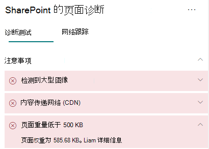

# 在 SharePoint Online 新式网页上优化页面权重

SharePoint Online 新式网页包括呈现导航/命令栏下内容区域中的图像、文本和对象等页面内容所需的序列化代码，还包括形成页面框架的其他 HTML 代码。 页面权重是此 HTML 代码的一种度量，且应限制来确保最佳页面加载时间。

本文将帮助你了解如何减少新式页面中的页面权重。

>[!NOTE]
>要详细了解 SharePoint Online 新式门户中的性能，请参阅[新式 SharePoint 体验中的性能](/sharepoint/modern-experience-performance)。

## 使用适用于 SharePoint 的页面诊断工具分析页面权重

适用于 SharePoint 的页面诊断工具是一款面向新 Microsoft Edge (https://www.microsoft.com/edge)) 和 Chrome 浏览器的浏览器扩展，可用于分析 SharePoint Online 新式门户和经典发布网站页面。 该工具对已分配的每个页面提供一个报告，其中显示根据一组定义的性能条件得出的页面性能情况。 要安装和了解适用于 SharePoint 的页面诊断工具，请参阅[使用适用于 SharePoint Online 的页面诊断工具](page-diagnostics-for-spo.md)。

>[!NOTE]
>页面诊断工具仅适用于 SharePoint Online，无法用于 SharePoint 系统页面。

通过适用于 SharePoint 的页面诊断工具分析 SharePoint 网页时，可在“_诊断测试_”窗格的“**页面权重小于 500KB**”结果中查看页面相关信息。 如果页面权重低于基线值，则结果将显示为绿色；如果页面权重大于基线值，则结果显示为红色。

可能的结果包括：

- **需要注意**（红色）：页面权重大于 500KB
- **无需操作**（绿色）：页面权重小于 500KB

如果“**需要注意**”部分中显示“**页面权重小于 500KB**”结果，则可单击结果了解详细信息。

## 修正页面权重问题

如果页面权重大于 500KB，可通过减少 Web 部件数量并将页面内容限制到适当程度，缩短整体页面加载时间。

有关减少页面权重的一般指南包括：

- 将页面内容限制到适当的量，并使用多个页面显示相关内容。
- 尽可能少地使用具有大量属性包的 Web 部件。
- 尽可能地使用非交互式汇总视图。
- 通过适当设置图像大小、使用压缩后的图像格式并确保其下载自 CDN，优化图像大小。

可在以下文章中找到有关限制权重的其他指南：

- [优化 SharePoint 中的页面性能](/sharepoint/dev/general-development/optimize-page-performance-in-sharepoint)

在修改页面来修正性能问题之前，请在分析结果中记下页面加载时间。 修改后再次运行工具，查看新结果是否在基线标准范围内，同时检查新的页面加载时间，查看是否有提升。

>[!NOTE]
>页面加载时间可能由于网络加载、具体时间和其他暂时条件等各种因素而有所不同。 应在更改前后多次测试页面加载时间，以帮助求出结果平均值。

## 相关主题

[优化 SharePoint Online 性能](tune-sharepoint-online-performance.md)

[优化 Office 365 性能](tune-microsoft-365-performance.md)

[新式 SharePoint 体验中的性能](/sharepoint/modern-experience-performance)

[内容分发网络](content-delivery-networks.md)

[结合使用 Office 365 内容分发网络和 SharePoint Online](use-microsoft-365-cdn-with-spo.md)