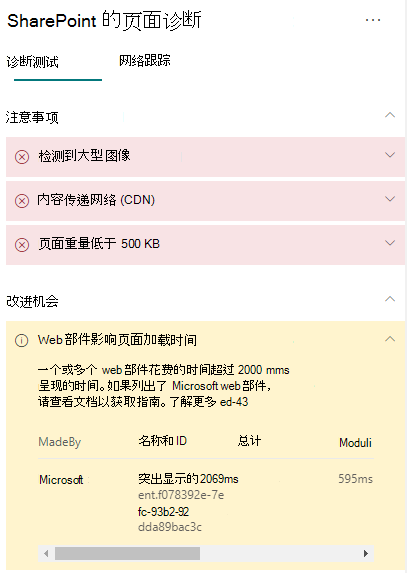

# 在 SharePoint Online 新式网站页面中优化 Web 部件性能Optimize web part performance in SharePoint Online modern site pages

SharePoint Online 新式网站页面包含可能影响整个页面加载时间的 Web 部件。SharePoint Online modern site pages contain web parts that can contribute to overall page load times. 本文将帮助你了解如何确定页面内的 Web 部件在哪些方面影响了用户感知到的延迟，以及如何修正常见问题。This article will help you understand how to determine how web parts in your pages affect user perceived latency, and how to remediate common issues.

>[!NOTE]
>要详细了解 SharePoint Online 新式门户中的性能，请参阅[新式 SharePoint 体验中的性能](https://docs.microsoft.com/sharepoint/modern-experience-performance)。For more information about performance in SharePoint Online modern portals, see [Performance in the modern SharePoint experience](https://docs.microsoft.com/sharepoint/modern-experience-performance).

## 使用适用于 SharePoint 的页面诊断工具分析 Web 部件Use the Page Diagnostics for SharePoint tool to analyze web parts

适用于 SharePoint 的页面诊断工具是一款面向新 Microsoft Edge（https://www.microsoft.com/edge) 和 Chrome 浏览器）的浏览器扩展，可用于分析 SharePoint Online 新式门户和经典发布网站页面。The Page Diagnostics for SharePoint tool is a browser extension for the new Microsoft Edge (https://www.microsoft.com/edge) and Chrome browsers that analyzes both SharePoint Online modern portal and classic publishing site pages. 该工具对已分配的每个页面提供一个报告，其中显示根据一组定义的性能条件得出的页面性能情况。The tool provides a report for each analyzed page showing how the page performs against a defined set of performance criteria. 要安装和了解适用于 SharePoint 的页面诊断工具，请参阅[使用适用于 SharePoint Online 的页面诊断工具](page-diagnostics-for-spo.md)。To install and learn about the Page Diagnostics for SharePoint tool, visit [Use the Page Diagnostics tool for SharePoint Online](page-diagnostics-for-spo.md).

>[!NOTE]
>页面诊断工具仅适用于 SharePoint Online，无法在 SharePoint 系统页面上使用。The Page Diagnostics tool only works for SharePoint Online, and cannot be used on a SharePoint system page.

通过适用于 SharePoint 的页面诊断工具分析 SharePoint 网站页面时，可在“_诊断测试_”窗格的“**Web 部件影响页面加载时间**”结果中，查看有关超出基线指标的 Web 部件的信息。When you analyze a SharePoint site page with the Page Diagnostics for SharePoint tool, you can see information about web parts that exceed the baseline metric in the **Web parts are impacting page load time** result in the _Diagnostic tests_ pane.

可能的结果包括：Possible results include:

- **注意事项**（红色）：任何在视区（页面首先加载的画面可见部分）显示的_自定义_ web 组件，加载会耗时超过**两**秒。**Attention required** (red): Any _custom_ web part that is visible in the viewport (screen visible portion of the page which is loaded first) that takes longer than **two** seconds to load. 加载时间超过**四**秒的视区外任何_自定义_ web 部件。Any _custom_ web parts outside of the viewport that take longer than **four** seconds to load. 总加载时间在测试结果中显示，并按模块加载、延迟加载、初始化和呈现进行细分。Total load time is displayed in test results and is broken down by module load, lazy load, init and render.
- **改进机会**（黄色）：可能影响页面加载时间的项目将在此部分显示，应该对这些项目进行审查和监控。**Improvement opportunities** (yellow): Items that may be impacting page load time are shown in this section and should be reviewed and monitored. 这可能包括“开箱即用”(OOTB) Microsoft Web 部件。This may include "out of the box" (OOTB) Microsoft web parts. 此部分显示的任何 Microsoft Web 部件结果都会自动报告给 Microsoft，因此**不需要执行任何操作**。Results for any Microsoft web parts shown in this section are automatically reported to Microsoft, so **no action is required**. 如果你的页面性能非常缓慢，并且页面上的**所有 Microsoft Web 部件**都显示在“**改进机会**”部分的结果中，则应仅记录支持票证以进行调查。You should only log a support ticket for investigation if you are experiencing very slow performance on the page and **all Microsoft web parts** on the page appear in the results in the **Improvement opportunities** section. 请注意，未来的 SharePoint 页面诊断工具更新将根据 Microsoft Web 部件的特定配置进一步细分结果。Note that a future Page Diagnostics for SharePoint tool update will further break down the results based on the specific configuration of the Microsoft web part.
- **不需要执行任何操作**（绿色）：任何 Web 部件返回数据的时间都不超过**两**秒钟。**No action required** (green): No web part is taking longer than **two** seconds to return data.

如果“**Web 部件影响页面加载时间**”结果显示在结果的“**需要注意**”或“**改进机会**”部分，请单击结果以查看有关哪些 Web 部件加载缓慢的详细信息。If the **Web parts are impacting page load time** result appears in either the **Attention required** or **Improvement opportunities** section of the results, click the result to see details about which web parts are loading slowly. 适用于 SharePoint 的页面诊断工具的未来更新可能包括更新分析规则，因此请确保始终拥有该工具的最新版本。Future updates to the Page Diagnostics for SharePoint tool may include updates to analysis rules, so please ensure you always have the latest version of the tool.

结果中的可用信息包括：Information available in the results includes:

- “**创建者**”显示 Web 部件是自定义还是 Microsoft OOTB 部件**Made by** shows whether the web part is custom or Microsoft OOTB
- “**名称和 ID**”显示可帮助你在页面上查找 Web 部件的标识信息**Name and ID** shows identifying information that can help you find the web part on the page
- “**总计**”显示 Web 部件加载的总时间**Total** shows the total time for the web part to load
- “**模块加载**”显示提取和加载 Web 部件组件所需的时间**Module Load** shows the time taken to fetch and load the web part components
- “**延迟加载**”显示页面主要部分中未显示的 Web 部件的延迟加载时间**Lazy Load** shows the time for deferred loading of web parts not seen in the main section of the page
- “**初始化**”显示 Web 部件初始化所花的时间**Init** shows the time taken for web part initialization
- “**呈现**”显示 Web 部件提取和呈现结果所需的时间**Render** shows the time taken for the web part to fetch and render results

提供此信息是为了帮助设计人员和开发人员解决问题。This information is provided to help designers and developers troubleshoot issues. 此信息应提供给你的设计和开发团队。This information should be provided to your design and development team.

## 修正 Web 部件性能问题Remediate web part performance issues

按照本节指导来识别和修正“**Web 部件影响页面加载时间**”结果中列出的 Web 部件的性能问题。Follow the guidance in this section to identify and remediate performance issues with web parts listed in the **Web parts are impacting page load time** results.

Web 部件性能较差的原因有三类。There are three categories of possible causes for poor web part performance. 使用以下信息确定哪些问题适用于你的方案并进行修正。Use the information below to determine which issues apply to your scenario and remediate them.

- Web 部件脚本大小和依赖项Web part script size and dependencies
  - 优化_仅为视图模式_呈现主线方案的初始脚本。Optimize the initial script that renders the mainline scenario for _view mode only_.
  - 移动使用不频繁的方案并编辑模式代码（如属性窗格）以使用 _import()_ 语句分隔区块。Move the less frequent scenarios and edit mode code (like the property pane) to separate chunks using the _import()_ statement.
  - 审查 _package.json_ 文件的依赖项以完全删除任何死代码。Review dependencies of the _package.json_ file to remove any dead code completely. 将任何仅限测试/内部版本的依赖项移动到 devDependencies。Move any test/build only dependencies to devDependencies.
  - 最佳静态资源下载需要使用 Office 365 CDN。Use of the Office 365 CDN is required for optimal static resource download. 公用 CDN 来源更适合 _js/css_ 文件。Public CDN origins are preferable for _js/css_ files. 有关使用 Office 365 CDN 的详细信息，请参阅[结合使用 Office 365 内容分发网络 (CDN) 和 SharePoint Online](use-microsoft-365-cdn-with-spo.md)。For more information about using the Office 365 CDN, see [Use the Office 365 Content Delivery Network (CDN) with SharePoint Online](use-microsoft-365-cdn-with-spo.md).
  - 重复使用作为 SharePoint 框架 (SPFx) 一部分的 _React_ 和 _Fabric 导入_等框架。Reuse frameworks like _React_ and _Fabric imports_ that come as part of the SharePoint Framework (SPFx). 有关详细信息，请参阅 [SharePoint 框架概述](https://docs.microsoft.com/sharepoint/dev/spfx/sharepoint-framework-overview)。For more information, see [Overview of the SharePoint Framework](https://docs.microsoft.com/sharepoint/dev/spfx/sharepoint-framework-overview).
  - 确保你使用的是最新版本的 SharePoint 框架，并在新版本推出时进行升级。Ensure that you are using the latest version of the SharePoint Framework, and upgrade to new versions as they become available.
- 数据提取/缓存Data fetching/caching
  - 如果 Web 部件依赖额外的服务器调用来提取数据以进行显示，请确保这些服务器 API 运行快速且/或实施客户端缓存（例如，对于较大的集使用 _localStorage_ 或 _IndexDB_）。If the web part relies on extra server calls to fetch data for display, ensure those server APIs are fast and/or implement client side caching (such as using _localStorage_ or _IndexDB_ for larger sets).
  - 如果需要多次调用来呈现关键数据，请考虑在服务器上进行批处理或将请求合并到单个调用的其他方法。If multiple calls are required to render critical data, consider batching on the server or other methods of consolidating requests to a single call.
  - 或者，如果某些数据元素需要较慢的 API，但对初始呈现并不重要，请将这些元素与在呈现关键数据后执行的单独调用进行分离。Alternatively, if some elements of data require a slower API, but are not critical to initial rendering, decouple these to a separate call that is executed after critical data is rendered.
  - 如果多个部件使用相同的数据，请使用公用数据层以避免重复调用。If multiple parts use the same data, utilize a common data layer to avoid duplicate calls.
- 呈现时间Rendering time
  - 任何媒体源（如图像和视频）都应根据容器、设备和/或网络的限制进行调整，以避免下载不必要的大型资产。Any media sources like images and videos should be sized to the limits of the container, device and/or network to avoid downloading unnecessary large assets. 有关内容依赖项的详细信息，请参阅[结合使用 Office 365 内容分发网络 (CDN) 和 SharePoint Online](use-microsoft-365-cdn-with-spo.md)。For more information about content dependencies, see [Use the Office 365 Content Delivery Network (CDN) with SharePoint Online](use-microsoft-365-cdn-with-spo.md).
  - 避免会导致重排、复杂 CSS 规则或复杂动画的 API 调用。Avoid API calls that cause re-flow, complex CSS rules or complicated animations. 有关详细信息，请参阅[最大限度地减少浏览器重排](https://developers.google.com/speed/docs/insights/browser-reflow)。For more information, see [Minimizing browser reflow](https://developers.google.com/speed/docs/insights/browser-reflow).
  - 避免使用链接的长时间运行任务。Avoid use of chained long running tasks. 相反，将长时间运行的任务分成单独的队列。Instead, break long running tasks apart into separate queues. 有关详细信息，请参阅[优化 JavaScript 执行](https://developers.google.com/web/fundamentals/performance/rendering/optimize-javascript-execution)。For more information, see [Optimize JavaScript Execution](https://developers.google.com/web/fundamentals/performance/rendering/optimize-javascript-execution).
  - 保留相应的空间来异步呈现媒体或视觉元素，以避免跳帧和抖动（也称为 _jank_）。Reserve corresponding space for asynchronously rendering media or visual elements to avoid skipped frames and stuttering (also known as _jank_).
  - 如果某个浏览器不支持用于呈现的功能，请加载填充代码或排除正在运行的相关代码。If a certain browser doesn't support a feature used in rendering, either load a polyfill or exclude running dependent code. 如果该功能不重要，请释放事件处理程序等资源以避免内存泄漏。If the feature is not critical, dispose resources such as event handlers to avoid memory leaks.

在修改页面来修正性能问题之前，请在分析结果中记下页面加载时间。Before you make page revisions to remediate performance issues, make a note of the page load time in the analysis results. 修改后再次运行工具，查看新结果是否在基线标准范围内，同时检查新的页面加载时间，查看是否有提升。Run the tool again after your revision to see if the new result is within the baseline standard, and check the new page load time to see if there was an improvement.

>[!NOTE]
>页面加载时间可能由于网络加载、具体时间和其他暂时条件等各种因素而有所不同。Page load time can vary based on a variety of factors such as network load, time of day, and other transient conditions. 应在更改前后多次测试页面加载时间，以帮助求出结果平均值。You should test page load time a few times before and after making changes to help you average the results.

## 相关主题Related topics

[优化 SharePoint Online 性能Tune SharePoint Online performance](tune-sharepoint-online-performance.md)

[优化 Office 365 性能Tune Office 365 performance](tune-microsoft-365-performance.md)

[新式 SharePoint 体验中的性能Performance in the modern SharePoint experience](https://docs.microsoft.com/sharepoint/modern-experience-performance)

[内容分发网络Content delivery networks](content-delivery-networks.md)

[结合使用 Office 365 内容分发网络和 SharePoint OnlineUse the Office 365 Content Delivery Network (CDN) with SharePoint Online](use-microsoft-365-cdn-with-spo.md)
