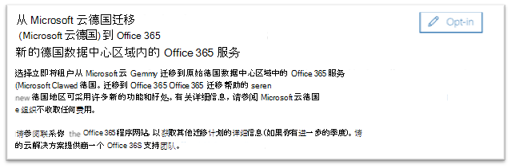

# 如何选择加入从德国 Microsoft 云 (德国 microsoft 云) 到Office 365数据中心区域的新迁移服务

> [!NOTE]
> 迁移选择加入期从 2021 年 6 月 1 日关闭。  所有符合条件的德国 Microsoft 云 (德国 Microsoft 云) 客户现已迁移。  不会通过自动化过程迁移其他客户。  作为服务关闭活动的一部分，任何剩余的德国 Microsoft 云订阅和租户将在 2021 年 9 月停用和取消预配。  
>

## 如何请求迁移

如果你是在德国 Microsoft 云 (Microsoft 云) 中预配服务的合格客户，并且你以租户 (全局) 管理员登录，Microsoft 365 管理中心 中的页面允许选择加入迁移。  Opt-In中的"Microsoft 365 管理中心"页面不再允许注册，但下面概述了此过程，仅供参考。  

若要访问该页面 **，请在设置** 导航窗格中展开"组织配置文件"，然后单击"**组织配置文件"。**

在“**组织档案**”页面上，向下滚动到“**从德国 Microsoft 云迁移到新的德国数据中心区域内的 Office 365 服务**”部分。

如果要将服务从德国 Microsoft 云 (德国) 迁移到新的德国数据中心Office 365服务，请单击 **"选择加入"。**
 

屏幕右侧将显示一个新部分以接受你的确认。 选择 **"是**"，然后单击"保存 **"。**
 

代表租户选择加入后，所有管理员都将看到"从德国 Microsoft 云迁移 **(德国 microsoft** 云) 至 Office 365 服务"部分中确认，包括选择加入日期。 管理员还将在邮件管理员的消息中心收到Microsoft 365 管理中心。 
 

## 选择加入迁移后会发生什么情况？

对于选择采用 Microsoft 驱动方法的组织，迁移将于 2021 年初开始，并将于 2021 年 10 月 29 日德国 Microsoft 云 (德国) 停用日期之前完成。  迁移后，核心客户数据和订阅会迁移到新的德国区域。  Microsoft 将在整个迁移过程中在消息中心发布更新。 有关详细信息 [，请参阅](#more-information) 以下文章。

## 如果不选择在管理中心中迁移，会发生什么情况？

联机服务条款已更改为包含使 Microsoft 能够将 Microsoft 365、Dynamics 365 和 Power BI 数据和订阅从 Microsoft 云德国迁移到新数据中心的术语。 这些条款对自 2020 年 5 月 1 (续订的任何德国 Microsoft 云) 德国 Microsoft 云生效。 

客户租户管理员将收到电子邮件和消息中心通知，提示 Microsoft 协助的迁移将自动选择加入迁移。 此通知将在自动选择加入前至少 30 天发送。 迁移选择加入后，所有通信和状态更新将发送给消息中心中的客户租户管理员。

建议客户和合作伙伴租户管理员选择在迁移过程中<a href="https://go.microsoft.com/fwlink/p/?linkid=848041" target="_blank">Microsoft 365 管理中心以便迁移</a>过程可以尽快开始。

## 后续步骤

[了解迁移期间客户体验](ms-cloud-germany-transition-experience.md)

## 更多信息

入门：

- [从德国 Microsoft 云迁移到Office 365新的德国数据中心区域部署服务](ms-cloud-germany-transition.md)
- [德国 Microsoft 云迁移助手](https://aka.ms/germanymigrateassist)
- [迁移期间客户体验](ms-cloud-germany-transition-experience.md)

在转换过程中移动：

- [迁移阶段操作和影响](ms-cloud-germany-transition-phases.md)
- [其他前期工作](ms-cloud-germany-transition-add-pre-work.md)
- Azure [AD、](ms-cloud-germany-transition-azure-ad.md)[设备、](ms-cloud-germany-transition-add-devices.md)[体验](ms-cloud-germany-transition-add-experience.md)和[AD FS 的其他信息](ms-cloud-germany-transition-add-adfs.md)。

云应用：

- [Dynamics 365 迁移计划信息](/dynamics365/get-started/migrate-data-german-region)
- [Power BI 迁移计划信息](/power-bi/admin/service-admin-migrate-data-germany)
- [开始 Microsoft Teams 升级](/microsoftteams/upgrade-start-here)
