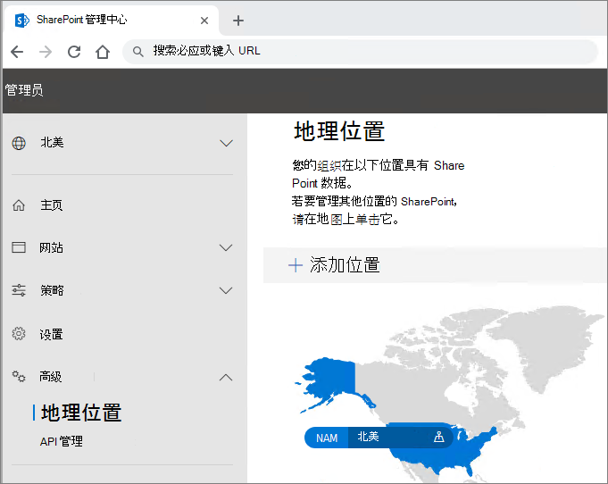
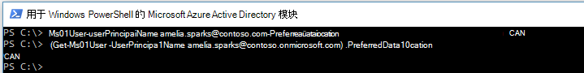

# Microsoft 365 多地理位置租户配置

配置 Microsoft 365 多地理位置租户前，请务必先阅读[计划使用 Microsoft 365 多地理位置](plan-for-multi-geo.md)。 若要执行本文中的步骤，需要列出要作为附属位置启用的地理位置，以及要为这些位置预配的测试用户。

## 将“Microsoft 365 中的多地理位置功能”计划添加到租户

若要使用 Microsoft 365 多地理位置，需要有“_Microsoft 365 中的多地理位置功能_”计划。 与帐户团队合作，以向租户添加此计划。 帐户团队会让你与相应的许可专家联系，并配置你的租户。

请注意，“_Microsoft 365 中的多地理位置功能_”计划是一个用户级别的服务计划。你需要为每个想要托管在卫星位置的用户提供许可证。随着你将用户添加到卫星位置，你可以随时添加更多许可证。

在为租户预配了“_Microsoft 365 中的多地理位置功能_”计划后，便能在 OneDrive 和 SharePoint 管理中心内使用“**地理位置**”选项卡。

## 向租户添加附属位置

必须为要存储数据的每个地理位置添加附属位置。 下表列出了可用的地理位置：

[!INCLUDE [Microsoft 365 Multi-Geo locations](../includes/microsoft-365-multi-geo-locations.md)]

添加附属位置的具体步骤

1. 打开 SharePoint 管理中心。

2. 导航到“地理位置”选项卡。

3. 单击“添加位置”。

4. 选择要添加的位置，然后单击“下一步”。

5. 键入想要与地理位置一同使用的域，然后单击“添加”。

6. 单击“关闭”。

预配可能需要几小时到 72 小时，具体要取决于租户的大小。附属位置设置完成后，你将收到电子邮件确认。当新地理位置在 OneDrive 管理中心的“地理位置”选项卡的地图上以蓝色显示时，你可以继续将用户的首选数据位置设置为该地理位置。 

> [!IMPORTANT]
> 你的新附属位置将使用默认设置进行设置。这可使你根据当地合规性要求来配置该附属位置。

## 设置用户的首选数据位置
 

一旦启用了所需的附属位置，就可以更新你的用户帐户以使用适当的首选数据位置。我们建议你为每个用户设置一个首选数据位置，即使该用户处于中心位置。

> [!IMPORTANT]
> 如果用户的首选数据位置设置为未配置为附属位置或中心位置的位置，系统会在预配 OneDrive 和 SharePoint 网站以及组邮箱时，默认使用中心位置。

> [!TIP]
> 建议先使用测试用户或少量用户进行验证，再在组织内更广泛地推出多地理位置功能。

在 Azure Active Directory (Azure AD) 中，有以下两种类型的用户对象：仅限云用户和同步用户。 请按照用户类型对应的说明操作。

### 使用 Azure AD Connect 同步用户的首选数据位置 

如果公司的用户是从本地 Active Directory 系统同步到 Azure AD 的，则其 PreferredDataLocation 必须填充在 AD 中并同步到 Azure AD。

请按照 [Azure Active Directory Connect 同步：配置 Microsoft 365 资源的首选数据位置](/azure/active-directory/hybrid/how-to-connect-sync-feature-preferreddatalocation)中的流程配置从本地 Active Directory 域服务 (AD DS) 到 Azure AD 的首选数据位置同步。

建议在标准用户创建工作流中设置用户的首选数据位置。

> [!IMPORTANT]
> 对于未预配 OneDrive 的新用户，请在将用户的 PDL 同步到 Azure AD 之后至少等待 24 小时，以便在用户登录 OneDrive for Business 之前传播更改。 （在用户登录预配 OneDrive for Business 前设置首选数据位置，可确保在正确的位置中预配用户的新 OneDrive。）

### 设置仅限云用户的首选数据位置 

如果公司的用户不是从本地 Active Directory 系统同步到 Azure Active Directory 的，这意味着他们是在 Microsoft 365 或 Azure AD 中创建的，必须使用用于 Windows PowerShell 的 Microsoft Azure Active Directory 模块设置 PDL。

完成本部分的程序需要使用[用于 Windows PowerShell 的 Microsoft Azure Active Directory 模块](https://www.powershellgallery.com/packages/MSOnline/1.1.166.0)。 如果已安装此模块，请确保更新到最新版本。

1.  使用针对你的租户的一组全局管理员凭据进行[连接并登录](/powershell/connect-to-microsoft-365-powershell.md#connect-with-the-microsoft-azure-active-directory-module-for-windows-powershell)。

2.  使用 [Set-MsolUser](/powershell/msonline/v1/set-msoluser) cmdlet 来设置每位用户的首选数据位置。例如：

    `Set-MsolUser -userprincipalName Robyn.Buckley@Contoso.com -PreferredDatalocation EUR`

    你可以使用 Get-MsolUser cmdlet 进行检查，以确认首选数据位置已正确更新。例如：

    `(Get-MsolUser -userprincipalName Robyn.Buckley@Contoso.com).PreferredDatalocation`

建议在标准用户创建工作流中设置用户的首选数据位置。

> [!IMPORTANT]
> 对于未预配 OneDrive 的新用户，请在设置用户的 PDL 之后至少等待 24 小时，以便在用户登录 OneDrive 之前传播更改。 （在用户登录预配 OneDrive for Business 前设置首选数据位置，可确保在正确的位置中预配用户的新 OneDrive。）

## OneDrive 设置和 PDL 效果

如果用户已有在租户中创建的 OneDrive 网站，设置用户 PDL 不会自动移动他们的现有 OneDrive。 若要移动用户的地理位置OneDrive，请参阅OneDrive for Business[地理位置移动。](move-onedrive-between-geo-locations.md)

> [!NOTE]
> Exchange Online PLD 更改且 MailboxRegion 不再与邮箱数据库地理位置代码匹配，则自动重定位用户的邮箱。 有关详细信息，请参阅[在多Exchange Online](./administering-exchange-online-multi-geo.md)环境中管理邮箱。

如果用户在租户内没有 OneDrive 网站，将会根据用户的 PDL 值为他们预配 OneDrive，假定用户的 PDL 与公司的附属位置之一匹配。

## 配置多地理位置搜索

你的多地理位置租户将具有聚合搜索功能，允许搜索查询从租户中的任何位置返回结果。

默认情况下，即使每个搜索索引位于其相关地理位置中，这些入口点的搜索也会返回聚合结果：

- OneDrive for Business

- Delve

- SharePoint 主页

- 搜索中心

此外，可为使用 SharePoint 搜索 API 的自定义搜索应用程序配置多地理位置搜索功能。

有关说明（包括任何限制和差异），请查看[为 OneDrive for Business 多地理位置配置搜索](configure-search-for-multi-geo.md)。

## 验证 Microsoft 365 多地理位置配置

下面是建议在公司中更广泛地推出 Microsoft 365 多地理位置前，在验证计划中添加的一些基本用例。 完成这些测试以及与公司相关的其他任何用例后，可以选择继续在初始试点组中添加用户。

**OneDrive for Business**

从 Microsoft 365 应用启动器中选择“OneDrive”，并确认是否自动定向到用户的相应地理位置（以用户 PDL 为依据）。 OneDrive for Business 现在应该开始在相应位置进行预配。 预配后，立即尝试上传并下载一些文档。

**OneDrive 移动应用**

使用测试帐户凭据登录到 OneDrive 移动应用。 确认你可以看到 OneDrive for Business 文件，并可以通过移动设备与它们进行交互。

**OneDrive 同步客户端**

确认 OneDrive 同步客户端在登录后可自动检测你的 OneDrive for Business 地理位置。如果你需要下载同步客户端，则可单击 OneDrive 库中的“同步”。

**Office 应用程序**

通过从 Office 应用程序（如 Word）登录，确认你可以访问 OneDrive for Business。打开 Office 应用程序，然后选择“OneDrive – <TenantName>”。Office 将检测你的 OneDrive 位置，并显示可打开的文件。

**共享**

尝试共享 OneDrive 文件。确认人员选取器向你显示所有 SharePoint 在线用户，而不管他们的地理位置如何。