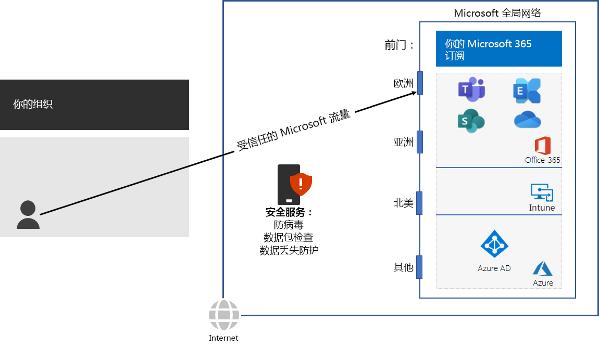

# 第 3 步：避免网络回流Step 3: Avoid network hairpins

*此步骤是必需的，适用于 Microsoft 365 企业版的 E3 和 E5 版本**This step is required and applies to both the E3 and E5 versions of Microsoft 365 Enterprise*

当绑定到目标的流量先定向到另一个中间位置（例如本地安全堆栈、云访问代理或基于云的 Web 网关）时，会出现[网络发夹](https://docs.microsoft.com/office365/enterprise/office-365-network-connectivity-principles#BKMK_P3)。A [network hairpin](https://docs.microsoft.com/office365/enterprise/office-365-network-connectivity-principles#BKMK_P3) happens when traffic bound for a destination is first directed to another intermediate location, such as an on-premises security stack, cloud access broker, or cloud-based web gateway. 下面是一个示例。Here is an example.

网络发夹也可能是由于网络服务提供商在 Internet 上路由不畅所致。A network hairpin could also be caused by poor routing on the Internet due to network service providers. 

发夹会增加延迟，并且可能会将流量重定向到地理位置较远的位置。A hairpin adds latency and can potentially redirect traffic to a geographically distant location.

要优化 Microsoft 365 基于云的服务的流量性能，请检查提供本地 Internet 连接的 ISP 是否与该位置附近的 Microsoft 全球网络具有直接对等关系。这些连接中没有回流。To optimize performance for traffic to Microsoft 365 cloud-based services, check whether the ISP providing the local Internet connection has a direct peering relationship with the Microsoft Global Network in close proximity to that location. These connections do not have hairpins.

如果将基于云的网络或安全服务用于 Microsoft 365 流量，请确保评估回流效果并确保了解其对性能的影响。检查以下内容：If you use cloud-based network or security services for your Microsoft 365 traffic, ensure that the hairpinning effect is evaluated and its impact on performance is understood. Examine the following:

- 服务提供商的数量和位置，通过这些服务提供商将流量转发到分公司和 Microsoft 全球网络对等点The number and locations of your service providers through which the traffic is forwarded in relationship to your branch offices and Microsoft Global Network peering points 
- 服务提供商与 ISP 和 Microsoft 的网络对等关系的质量The quality of the network peering relationship of the service provider with your ISP and Microsoft 
- 服务提供商基础结构中回程的性能影响The performance impact of backhauling in the service provider infrastructure

如有可能，配置边缘路由器以直接发送受信任的 Microsoft 365 流量，而不是通过处理 Internet 流量的第三方云或基于云的网络安全供应商进行代理或隧道传输。Whenever possible, configure your edge routers to send trusted Microsoft 365 traffic directly, instead of proxying or tunneling through a third-party cloud or cloud-based network security vendor that processes your Internet traffic. 

作为临时检查点，可查看这一步的[退出条件](networking-exit-criteria.md#crit-networking-step3)。As an interim checkpoint, you can see the [exit criteria](networking-exit-criteria.md#crit-networking-step3) for this step.

## 后续步骤Next step

|||
|:-------|:-----|
||[配置流量旁路Configure traffic bypass](networking-configure-proxies-firewalls.md)|
