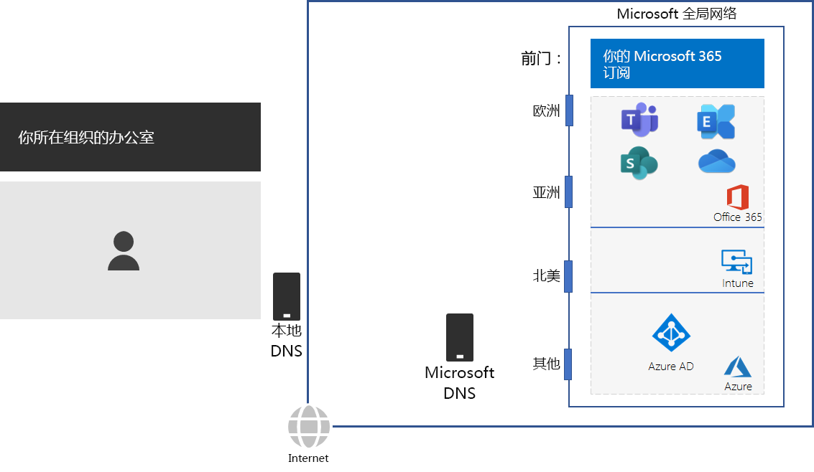
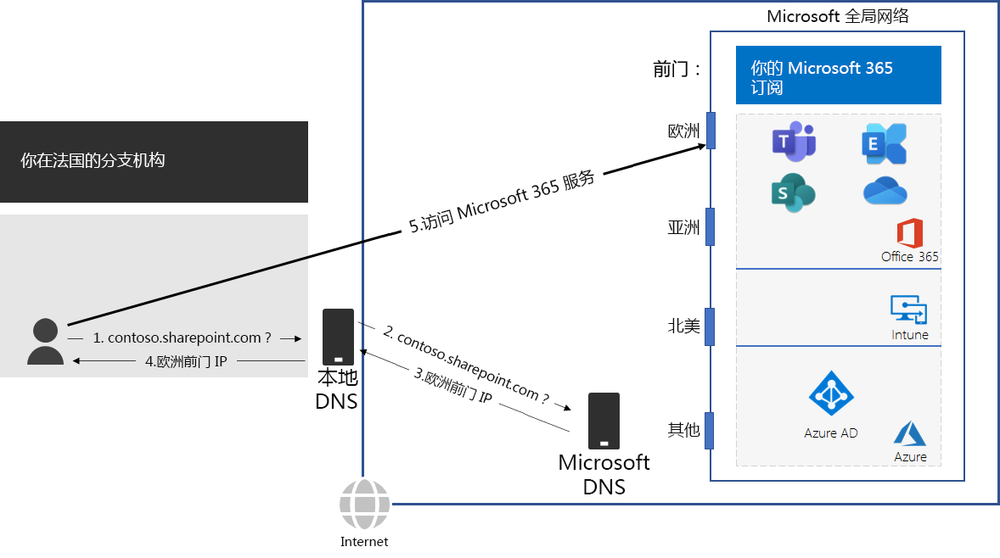

# 第 2 步：配置每个办公室的本地 Internet 连接Step 2: Configure local Internet connections for each office

*此步骤是必需的，适用于 Microsoft 365 企业版的 E3 和 E5 版本**This step is required and applies to both the E3 and E5 versions of Microsoft 365 Enterprise*

在第 2 步中，确保每个办公室都具有本地 Internet 连接并使用本地 DNS 服务器。要求这两个元素均降低连接延迟，并确保本地客户端计算机与 Microsoft 365 基于云的服务的最近入口点建立连接。In Step 2, you ensure that each of your offices have local Internet connections and use local DNS servers. Both of these elements are required to reduce connection latency and ensure that on-premises client computers make connections to the nearest point of entry to Microsoft 365 cloud-based services.

在大型组织的传统网络中，Internet 流量通过网络主干网传输到中央 Internet 连接。In traditional networks for large organizations, Internet traffic travels across the network backbone to a central Internet connection. 这不适用于优化全局分布式软件即服务 (SaaS) 基础结构的性能，该基础结构包含 Microsoft 365 中的 Office 365 和 Intune 产品。This does not work well for optimizing performance to a globally distributed Software-as-a-Service (SaaS) infrastructure, which includes the Office 365 and Intune products in Microsoft 365.

Microsoft 全局网络包括*分布式服务前端*基础结构，后者是具有异地分布位置的高可用性和可扩展网络边缘。The Microsoft Global Network includes a *Distributed Service Front Door* infrastructure, a highly available and scalable network edge with geographically distributed locations. 它将终止前端服务器上的最终用户连接，并高效地在 Microsoft 全局网络中路由最终用户流量。It terminates end user connections at a front door server and efficiently routes end user traffic within the Microsoft Global Network.

为了获得最佳性能，本地客户端应访问地理位置最靠近它们的前端位置，而不是通过网络主干网发送流量并将流量发送到最靠近组织中央 Internet 连接的前端。For the best performance, on-premises clients should access a front door location that is geographically closest to them, rather than sending the traffic over a network backbone and to the front door that is closest to the organization’s central Internet connection.

下面是一个示例。Here’s an example.

当巴黎分支机构中的用户想要访问 SharePoint Online 网站时：When a user in the Paris branch office wants to access a SharePoint Online site:

1. 它将发送 DNS 查询来解析名称，例如 contoso.sharepoint.com。It sends a DNS query to resolve a name, such as contoso.sharepoint.com. 
2. ISP 提供的 DNS 服务器会将此查询转发到 Microsoft DNS 服务器。The DNS server provided by the ISP forwards that query to a Microsoft DNS server.
3. Microsoft DNS 服务器会将转发的 DNS 查询的源 IP 地址与分配该地址的世界区域相匹配。Microsoft’s DNS servers match the source IP address of the forwarded DNS query to the region of the world assigned that address. Microsoft DNS 服务器将使用欧洲最近的 Microsoft 网络前端的 IP 地址进行响应。The Microsoft DNS server responds with the IP address of the nearest Microsoft Network front door in Europe.
4. ISP DNS 服务器将该 IP 地址发送给用户。The ISP DNS server sends that IP address to the user.
5. 用户通过欧洲前端启动与 SharePoint 服务器的连接。The user initiates a connection to the SharePoint server through the Europe front door.

为了将客户端请求定向到地理位置最近的前端，Microsoft DNS 服务器使用与客户端初始连接请求相对应的 DNS 查询。To direct a client request to the geographically nearest front door, Microsoft’s DNS servers use the DNS queries corresponding the client’s initial connection request. 因此，为了实现最低网络延迟：Therefore, for the lowest network latency:

- 组织的所有办公室都应具有本地 Internet 连接，以便[优化](https://docs.microsoft.com/office365/enterprise/office-365-network-connectivity-principles#new-office-365-endpoint-categories)类别网络流量。All offices of your organization should have local Internet connections for [Optimize](https://docs.microsoft.com/office365/enterprise/office-365-network-connectivity-principles#new-office-365-endpoint-categories) category network traffic.
- 每个本地 Internet 连接应使用地区本地 DNS 服务器来处理来自该位置的出站 Internet 流量。Each local Internet connection should be using a regionally local DNS server for outbound Internet traffic from that location.

有关详细信息，请参阅[本地出口网络连接](https://docs.microsoft.com/office365/enterprise/office-365-network-connectivity-principles#egress-network-connections-locally)。For more information, see [Egress network connections locally](https://docs.microsoft.com/office365/enterprise/office-365-network-connectivity-principles#egress-network-connections-locally). 

作为临时检查点，可查看这一步的[退出条件](networking-exit-criteria.md#crit-networking-step2)。As an interim checkpoint, you can see the [exit criteria](networking-exit-criteria.md#crit-networking-step2) for this step.

## 后续步骤Next step

|||
|:-------|:-----|
||[避免网络回流Avoid network hairpins](networking-avoid-network-hairpins.md)|
