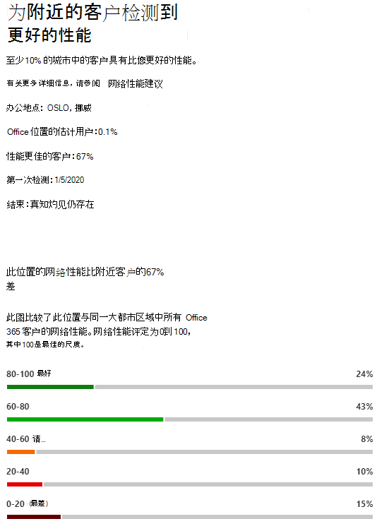

# Microsoft 365网络Insights

**网络见解** 是从 Microsoft 365 租户收集的性能指标，可供租户中的管理用户查看。 Insights显示在 位于 的 Microsoft 365 管理 中心 <https://portal.microsoft.com/adminportal/home#/networkperformance> 。

Insights旨在帮助您设计办公地点的网络外围。 每个见解提供有关用户正在访问租户的每个地理位置的特定常见问题的性能特征的实时详细信息。

可能会针对每个办公室位置显示六个特定的网络见解：

- [回程网络出口](#backhauled-network-egress)
- [网络中介设备](#network-intermediary-device)
- [为附近客户检测到更好的性能](#better-performance-detected-for-customers-near-you)
- [使用非最佳Exchange Online服务前端](#use-of-a-non-optimal-exchange-online-service-front-door)
- [使用非最佳联机SharePoint联机服务前端](#use-of-a-non-optimal-sharepoint-online-service-front-door)
- [从前端SharePoint下载速度](#low-download-speed-from-sharepoint-front-door)
- [中国用户最佳网络出口](#china-user-optimal-network-egress)

可能会为租户显示两个租户级别的网络见解。 这些也显示在工作效率分数页面中：

- [Exchange连接问题影响的已采样连接](#exchange-sampled-connections-impacted-by-connectivity-issues)
- [SharePoint连接问题影响的已采样连接](#sharepoint-sampled-connections-impacted-by-connectivity-issues)

>[!IMPORTANT]
>Microsoft 365 管理 中心中的网络见解、性能建议和评估目前处于预览状态，仅适用于已在功能预览计划中注册的 Microsoft 365 租户。

## 回程网络出口

如果网络见解服务检测到从给定用户位置到网络出口的距离大于 500 英里 (800 千米) ，则将显示此见解，指示 Microsoft 365 流量正返回到常见的 Internet 边缘设备或代理。

在某些摘要视图中，此Egress缩写为"Egress"。

> [!div class="mx-imgBorder"]
> 

### 这意味着什么？

这标识了办公地点和网络出口之间的距离超过 500 英里 (800 千米) 。 办公室位置由模糊处理客户端计算机位置标识，网络出口位置使用反向 IP 地址到位置数据库进行标识。 如果计算机上禁用定位服务Windows办公地点可能不准确。 如果反向 IP 地址数据库信息不准确，则网络出口位置可能不准确。

此见解的详细信息包括办公室位置、位置中租户用户总数估计的百分比、当前网络出口位置、出口位置的相关性、位置与当前出口点之间的距离、首次检测到条件的日期以及解决条件的日期。

### 我该怎么办？

为获得此见解，我们建议网络出口距离办公地点更近，以便连接可以最佳方式路由到 Microsoft 的全局网络和最近的 Microsoft 365 服务前端。 关闭网络出口到用户办公地点还可以在未来提高性能，因为 Microsoft 未来将同时扩展网络接入点Microsoft 365服务前端。

若要详细了解如何解决此问题，请参阅 Egress Network  [Connectivity Principles](microsoft-365-network-connectivity-principles.md)中的本地Office 365网络连接。

## 网络中介设备

如果我们检测到你的用户和 Microsoft 网络之间的设备可能会影响你的用户体验，Office 365此见解。 建议对发往 Microsoft 数据中心Microsoft 365网络通信绕过这些限制。 Network Connectivity Principles 中的Microsoft 365[进一步描述了这一建议](microsoft-365-network-connectivity-principles.md)。 

我们展示的一个网络中介见解是，网络中介设备截获和解密 Exchange、SharePoint 和 Teams 的关键 Office 365 网络终结点时，SSL 中断和检查。

### 这意味着什么？

网络中介设备（如代理服务器、VPN 和数据丢失防护设备）可能会影响流量中间Microsoft 365客户端的性能和稳定性。

### 我该怎么办？

配置检测到绕过对网络通信的处理的网络Microsoft 365设备。

## 为附近客户检测到更好的性能

如果网络见解服务检测到您的开发区中的大量客户的性能优于此办公地点的组织中用户的性能，则将显示此见解。

在某些摘要视图中，此见解缩写为"对等"。

> [!div class="mx-imgBorder"]
> 

### 这意味着什么？

此见解将检查客户在此Microsoft 365同一城市的总绩效。 如果用户的平均延迟比相邻租户的平均延迟高 10%，将显示此见解。

### 我该怎么办？

此情况可能有很多原因，包括公司网络或 ISP 中的延迟、瓶颈或体系结构设计问题。 检查办公室网络与当前服务器前端之间的路由中每个跃点Microsoft 365延迟。 有关详细信息，请参阅Microsoft 365[网络连接原则。](microsoft-365-network-connectivity-principles.md)

## 使用非最佳Exchange Online服务前端

如果网络见解服务检测到特定位置的用户未连接到最佳服务前端，将显示Exchange Online见解。

此见解在一些摘要视图中缩写为"路由"。

> [!div class="mx-imgBorder"]
> 

### 这意味着什么？

我们Exchange Online适合从办公地点城市使用、性能良好的服务前门。 如果当前测试显示Exchange Online服务前端不在此列表上，则我们推荐使用。

### 我该怎么办？

使用非最佳Exchange Online服务前端可能是由于企业网络出口前面的网络回程所致，在这种情况下，我们建议使用本地和直接网络出口。 它还可能是由于使用远程 DNS 递归解析程序服务器所致，在这种情况下，我们建议将 DNS 递归解析器服务器与网络出口对齐。

## 使用非最佳联机SharePoint联机服务前端

如果网络见解服务检测到特定位置的用户未连接到最近的 SharePoint Online 服务前端，将显示此见解。

此见解在一些摘要视图中缩写为"Afd"。

> [!div class="mx-imgBorder"]
> 

### 这意味着什么？

我们SharePoint客户端连接到的联机服务前端。 然后，对于办公地点城市，我们将它SharePoint该城市的预期联机服务前端。 如果不匹配，我们提出此建议。

### 我该怎么办？

使用非最佳 SharePoint Online 服务前端可能是由于企业网络出口前面的网络回程所致，在这种情况下，我们建议使用本地和直接网络出口。 它还可能是由于使用远程 DNS 递归解析程序服务器所致，在这种情况下，我们建议将 DNS 递归解析器服务器与网络出口对齐。

## 从前端SharePoint下载速度

如果网络见解服务检测到特定办公地点与 SharePoint Online 之间的带宽小于 1 MBps，将显示此见解。

在某些摘要视图中，此见解缩写为"吞吐量"。

### 这意味着什么？

用户可以从 SharePoint Online 和 OneDrive for Business 服务前门获取的下载速度以每秒兆字节 (MBps) 。 如果此值小于 1 MBps，我们将提供此见解。

### 我该怎么办？

若要提高下载速度，可能需要增加带宽。 或者，办公地点的用户计算机和 SharePoint Online 服务前端之间可能存在网络拥塞。 这有时称为"连接丢失"，即使有足够的带宽可用，它也会限制可供用户使用的下载速度。

## 中国用户最佳网络出口

如果你的组织在中国有用户连接到位于其他地理位置的 Microsoft 365 租户，将显示此见解。 

### 这意味着什么？

如果您的组织具有专用 WAN 连接，我们建议您从位于中国的办公地点配置网络 WAN 线路，该线路具有网络出口到以下任一位置的 Internet：

- 香港特别行政区
- 日本
- Taiwan（台湾）
- 韩国
- 新加坡
- 马来西亚

与这些位置距离用户更远的 Internet 出口将降低性能，并且由于跨界拥塞，中国出口可能会导致高延迟和连接问题。

### 我该怎么办？

若要详细了解如何缓解与此见解相关的性能问题，请参阅Microsoft 365中国用户的全局租户[性能优化](microsoft-365-networking-china.md)。

## Exchange连接问题影响的已采样连接

此见解将说明 50% 或 50% 以上的采样连接何时受到影响。 该影响由评估Exchange样本低于 60%。

### 这意味着什么？

这表示大多数用户在连接到 Exchange Online 时可能会遇到用户体验Outlook问题。 样本百分比可能表示显示低于 60 分的用户百分比。  

### 我该怎么办？

启用 Office 位置网络连接可见性（如果尚未启用）。 您希望确定哪些办事处受影响 Exchange且网络连接不佳的影响，并找到改进将用户连接到 Microsoft 网络的每个办事处的网络外围的方法。

## SharePoint连接问题影响的已采样连接

此见解将说明 50% 或 50% 以上的采样连接何时受到影响。 该影响由评估SharePoint样本低于 40%。

### 这意味着什么？

这表示你的大多数用户可能遇到与用户或用户SharePoint OneDrive。 样本百分比可能表示显示低于 40 分的用户百分比。  

### 我该怎么办？

启用 Office 位置网络连接可见性（如果尚未启用）。 您希望确定哪些办事处受到影响 SharePoint 且网络连接不佳的影响，并找到改进将用户连接到 Microsoft 网络的每个办事处的网络外围的方法。

## 相关主题

[Microsoft 365 管理 Center 预览 (中的网络连接) ](office-365-network-mac-perf-overview.md)

[Microsoft 365预览 (网络) ](office-365-network-mac-perf-score.md)

[Microsoft 365预览版 (网络连接测试) ](office-365-network-mac-perf-onboarding-tool.md)

[Microsoft 365网络连接位置服务 (预览) ](office-365-network-mac-location-services.md)
