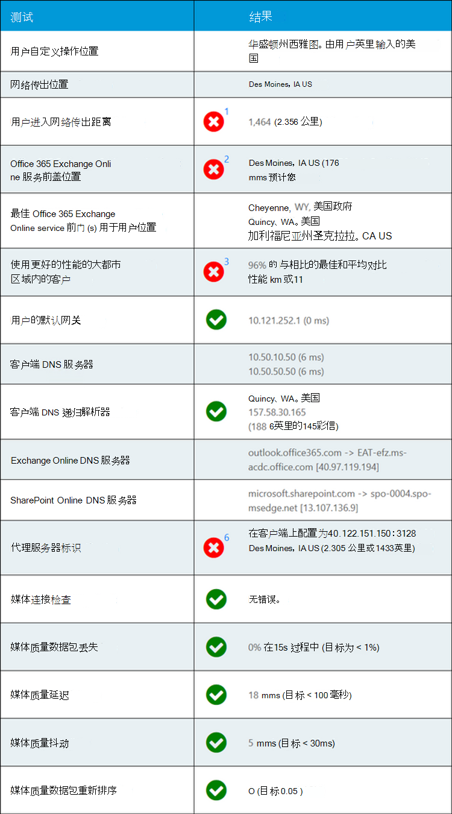

# Microsoft 365 管理中心中的 microsoft 365 连接测试 (预览版) 

Microsoft 365 连接测试位于 <https://connectivity.office.com> 。 它是一个辅助工具，可用于 **运行状况 | 的 Microsoft 365 管理中心内的网络洞察力和网络积分信息。网络性能** 菜单。

>[!NOTE]
>加入工具支持 WW 商业和 GCC 中的租户，但不支持 GCC 高、DoD、德国或中国的租户。

Microsoft 365 管理中心的网络洞察力基于 Microsoft 365 租户的产品度量。 相比之下，Microsoft 365 连接测试中的网络洞察力在该工具中本地运行。 可以在产品中完成的测试是有限的，并且可以通过在用户的本地运行测试来收集更多数据，从而获得更深入的见解。 请考虑，Microsoft 365 管理中心中的网络见解将显示在特定办公地点使用 Microsoft 365 的网络问题。 Microsoft 365 连接测试可帮助确定问题的根本原因，从而导致建议的网络性能改进操作。

我们建议将这些信息结合使用，以便在 Microsoft 365 管理中心中的每个办公室位置评估网络质量状态，并在部署基于 Microsoft 365 连接测试的测试之后找到更多的详细信息。

>[!IMPORTANT]
>网络洞察力、Microsoft 365 管理中心中的性能建议和评估当前处于预览状态，并且仅适用于已在功能预览计划中注册的 Microsoft 365 租户。

## 高级测试客户端应用程序

Microsoft 365 连接测试分为两个部分。 网站有 <https://connectivity.office.com> 一个可下载的 Windows 客户端应用程序。 可下载的客户端运行高级网络连接测试，大多数测试都需要运行此测试。

您可以从网站运行高级客户端测试，它会在运行时将结果重新填充到网页中。

## 用户办公室位置

用户办公室的位置是从用户 web 浏览器中检测到的。 它用于标识与企业网络周边的特定部分之间的网络距离。

用户办公室位置显示在地图视图中。

## 到网络传出位置的距离

我们在服务器端标识网络出口 IP 地址。 位置数据库用于查找网络出口的大概位置，并确定从该位置到办公室位置的距离。 如果距离大于500英里 (800 公里) ，这会显示为网络洞察力。

网络出局位置显示在地图视图中，并连接到用户办公室位置，以指示企业 WAN 中的网络 backhaul。

从网络传出 IP 地址查找的位置可能不准确，这将导致此测试产生错误结果。 若要验证是否为特定 IP 地址出现此错误，可以使用可公开访问的网络 IP 地址位置网站。

建议在 Microsoft 365 网络连接中，将本地和直接的网络出口从用户办公室位置实施到 Internet。 对本地和直接出口的改进是解决此网络洞察力的最佳方法。

## Exchange Online 服务前盖

以 Outlook 执行此功能的相同方式标识了 "使用中的 Exchange Online 服务前向门"，并将网络 TCP 延迟从用户办公室位置测量到它。 将显示这些说明，并将与当前位置的建议最佳服务前盖列表进行比较，以供使用的 Exchange Online 服务前向。 如果使用非最佳 Exchange Online 服务前向门，这会显示为网络洞察力。

使用非最佳 Exchange Online 服务前盖可能是由于网络 backhaul 在公司网络出口前，在这种情况下，我们建议本地和直接网络出口。 也可能是由于使用远程 DNS 递归冲突解决服务器而导致的，在这种情况下，我们建议您将 DNS 递归解析器服务器与网络出口对齐。

我们计算对 Exchange Online 服务前向门的 TCP 延迟的潜在改进。 为此，请查看测试的用户办公室位置网络延迟，并将网络延迟从当前位置减去当前位置，再减去 closets Exchange Online service 前门。 不同之处表示潜在的改进机会。

## 区域中客户的性能比较

与同一地铁区域中的其他 Microsoft 365 客户相比，Exchange Online 服务前向的用户办公室位置的网络 TCP 延迟。 如果在同一地铁区域中10% 或更多的客户具有更好的性能，则显示网络洞察力。

根据城市中的所有用户都可以访问相同的电信基础结构和与 Internet 电路和 Microsoft 网络的邻近性，生成网络洞察力。

## 使用默认网关

"使用中的默认网关" 是测试客户端为路由 TCP/IP 网络连接而配置的路由器。

提供此功能仅用于提供信息，并不会影响网络的洞察力。

## 在 "使用 DNS 服务器 (s) 

此示例显示在运行测试的客户端计算机上配置的 DNS 服务器。 它可能是 DNS 递归解析器服务器，但这并不常见。 它更可能是缓存 DNS 结果并将任何未缓存的 DNS 请求转发到另一个 DNS 服务器的 DNS 转发器服务器。

提供此功能仅用于提供信息，并不会影响网络的洞察力。

## 已标识 DNS 递归冲突解决服务器

通过发出特定的 DNS 请求，然后向 DNS 名称服务器提供来自收到相同请求的 IP 地址，可以标识使用中的 DNS 递归冲突解决程序。 此 IP 地址是 DNS 递归解析程序，将在 IP 地址位置数据库中查找以找到该位置。 然后计算从用户办公室位置到 DNS 递归解析服务器位置之间的距离。 如果距离大于500英里 (800 公里) ，这会显示为网络洞察力。

从网络传出 IP 地址查找的位置可能不准确，这将导致此测试产生错误结果。 若要验证是否为特定 IP 地址出现此错误，可以使用可公开访问的网络 IP 地址位置网站。

此网络洞察力尤其会影响 Exchange Online 服务前盖的选择。 若要解决此深入了解，本地和直接网络出口应为先决条件，然后 DNS 递归解析器应位于该网络出口附近。

## Exchange Online 前端服务器和 SharePoint Online 前端服务器的 DNS 查找

这些将显示这两个 Microsoft 365 工作负载的服务前向门的 DNS 记录。 仅提供了这些信息，并且没有相关的网络洞察力。

## 代理服务器标识

我们) 在本地计算机上配置代理服务器 (s。 我们确定是否在网络路径中配置了这些配置以优化类别 Microsoft 365 网络流量。 我们确定从用户办公室位置到代理服务器的距离。 先通过 ICMP ping 测试距离，如果此操作失败，我们使用 TCP ping 进行测试，如果失败，则在 IP 地址位置数据库中查找代理服务器 IP 地址。 如果代理服务器超过500英里 (800 公里) 远离用户办公室位置，我们将显示网络洞察力。

## 媒体质量检查

此测试将安装并运行 Skype for Business 网络评估工具并解释结果。 可以在中找到该工具 [https://www.microsoft.com/download/details.aspx?id=53885](https://www.microsoft.com/download/details.aspx?id=53885) 。

这些是由 Microsoft 团队音频和视频通话和会议功能使用的 UDP 协议测试。 我们测试 UDP 数据包丢失、UDP 网络延迟、UDP 抖动和 UDP 数据包重新排序。 如果其中有任何超出允许的范围，则显示网络洞察力。

## TCP 连接测试

我们测试从用户办公室位置到所有必需的 Microsoft 365 网络终结点的 HTTP 连接。 这些内容是在中发布的 [https://aka.ms/o365ip](https://aka.ms/o365ip) 。 对于任何不能连接到的必需网络终结点，都会显示网络洞察力。

连接 ay 由企业网络外围上的代理服务器、防火墙或其他网络安全设备阻止，或作为云代理使用。

## SSL 侦听测试

我们会在所需的每个 Microsoft 365 网络终结点（在上定义了）中测试 SSL 证书 [https://aka.ms/o365ip](https://aka.ms/o365ip) 。 如果有任何测试未找到 Microsoft SSL 证书，则已连接的加密网络必须已被中间网络设备截取。 网络洞察力显示在任何截获的加密网络终结点上。

在找不到 Microsoft 提供的 SSL 证书的情况下，我们会显示该测试的 FQDN 以及正在使用的 SSL 证书所有者。 此 SSL 证书所有者可能是代理服务器供应商，也可能是企业自签名证书。

## 网络路径诊断

本节显示了 ICMP traceroute 对 Exchange Online 服务前向门、SharePoint Online service 前门和 Microsoft 团队服务前盖的结果。 仅提供此信息，没有相关的网络洞察力。

## 常见问题

以下是一些常见问题的解答。

### 此工具是否已发布并受 Microsoft 支持？

目前它是概念证明，我们计划定期提供更新，直到我们能够从 Microsoft 获得支持的常规可用性发布状态。 请提供反馈以帮助我们改进。 我们打算将更详细的 Office 365 网络加入指南作为此工具的一部分进行发布，此工具可通过其测试结果自定义为组织。

### 什么是 Microsoft 365 服务的前门？

Microsoft 365 服务的前端是 Microsoft 全球网络的一个入口点，Office 客户端和服务终止其网络连接。 为实现到 Microsoft 365 的最佳网络连接，建议您的网络连接在城市或地铁的最近 Microsoft 365 前向外端终止。

注意： Microsoft 365 服务前向在 Azure marketplace 中提供了与 "Azure 前门服务" 产品的直接关系。

### 什么是最佳 Microsoft 365 服务前门？

最佳 Microsoft 365 服务前盖是最接近你的网络出口（通常在你所在的城市或大都市区域中）的一门。 使用 Microsoft 365 网络性能工具来确定正在使用的 Microsoft 365 服务的前盖和最佳服务前盖的位置。 如果该工具确定你的使用中的前向门是最佳的，则表示你正在以最佳方式连接到 Microsoft 的全球网络。

### Internet 出口的位置是什么？

Internet 出局位置是网络流量退出企业网络并连接到 Internet 的位置。 这也标识为您的网络地址转换 (NAT) 设备的位置，通常与 Internet 服务提供商 (ISP) 进行连接的位置相同。 如果你发现您的位置和 internet 出局位置之间的距离很长，则这可能会发现重要的 WAN backhaul。

## 相关主题

[Microsoft 365 管理中心中的网络性能建议 (preview) ](office-365-network-mac-perf-overview.md)

[Microsoft 365 网络性能见解 (预览版) ](office-365-network-mac-perf-insights.md)

[Microsoft 365 网络评估 (预览版) ](office-365-network-mac-perf-score.md)

[Microsoft 365 网络连接位置服务 (预览) ](office-365-network-mac-location-services.md)
