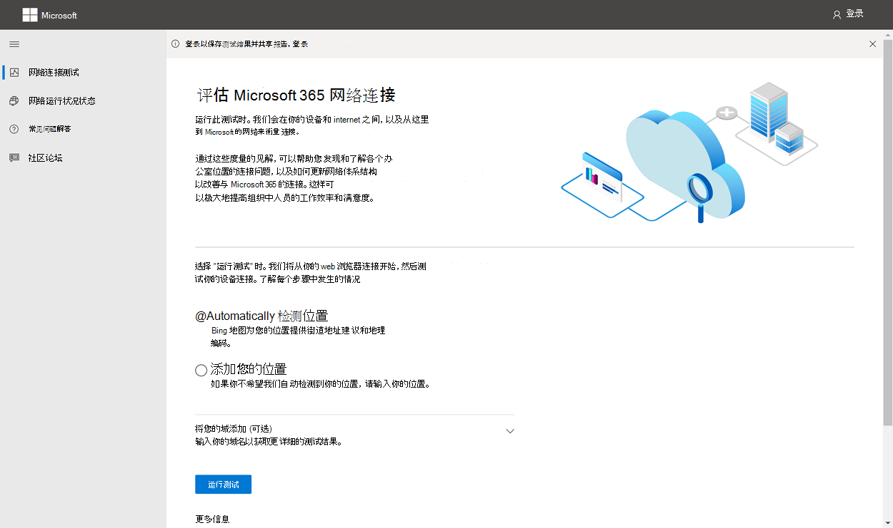
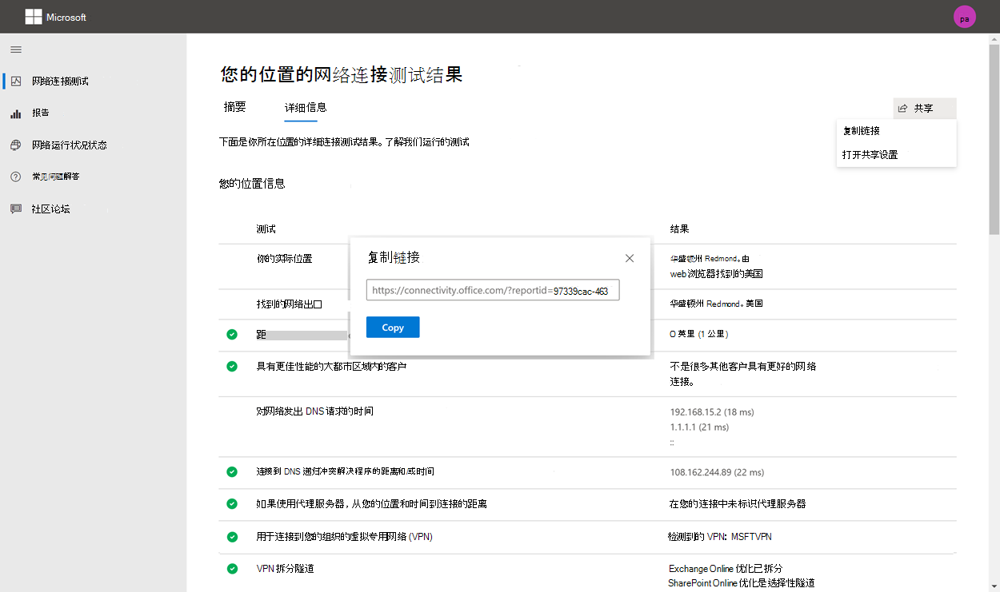
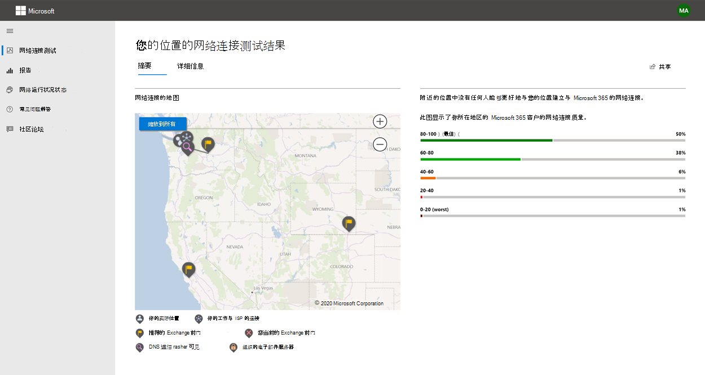
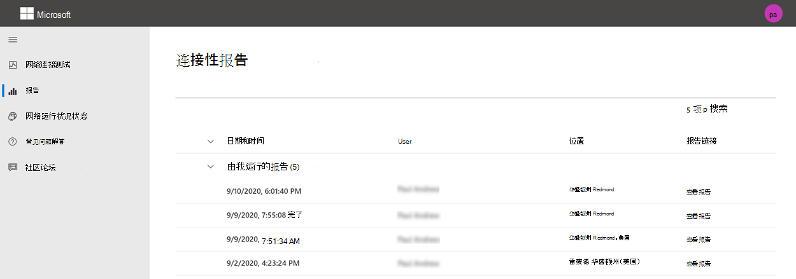
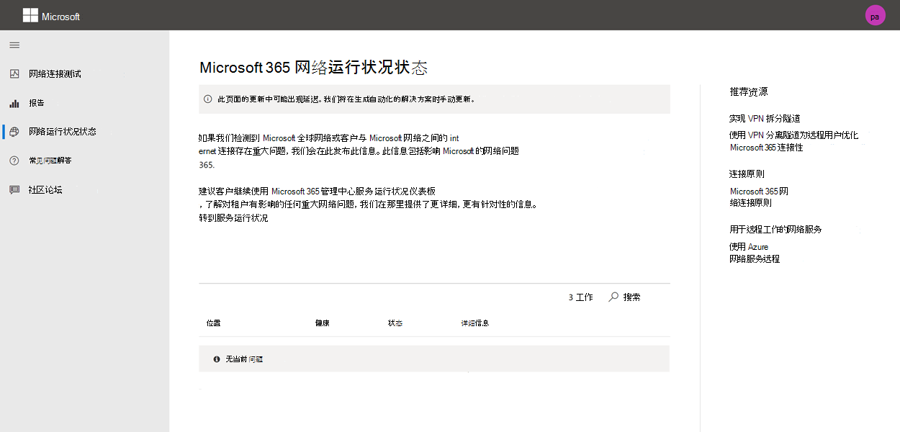

# Microsoft 365网络连接测试工具

Microsoft 365网络连接测试工具位于 <https://connectivity.office.com>。 它是"运行状况"选项下网络评估和网络Microsoft 365 管理中心 **的|"连接"** 菜单。

> [!IMPORTANT]
> 登录你的 Microsoft 365 租户非常重要，因为所有测试报告都与管理员共享，并上传到你登录的租户。

> [!div class="mx-imgBorder"]
> 

>[!NOTE]
>网络连接测试工具支持 WW 商业中的租户，GCC中等、GCC高、DoD 或中国。

Microsoft 365 管理中心中的网络见解基于每天汇总的 Microsoft 365 租户的常规产品内度量。 相比之下，来自 Microsoft 365 网络连接测试的网络见解在工具中本地运行。

产品内测试受到限制，并且在本地运行用户测试会收集更多数据，从而获得更深入的见解。 Microsoft 365 管理中心的网络见解将显示特定办公地点存在网络问题。 Microsoft 365连接性测试可帮助确定该问题的根本原因并提供有针对性的性能改进操作。

我们建议一起使用这些见解，其中可以针对 Microsoft 365 管理 中心的每个办公室位置评估网络质量状态，并且可以在基于 Microsoft 365 连接测试部署测试后找到更具体的信息。

## 每个测试步骤中发生的情况

### Office位置标识

单击"运行 *测试"* 按钮时，将显示正在运行的测试页面并标识办公地点。 你可以按城市、省/市/地区和国家/地区键入你的位置，或者选择让你检测到它。 如果检测到办公地点，该工具会从 Web 浏览器请求经度和纬度，并使用前将精度限制为 300 米 300 米。 不需要比建筑物更准确地标识位置来测量网络性能。

### JavaScript 测试

在办公室位置标识后，我们在 JavaScript 中运行 TCP 延迟测试，并且从服务请求有关使用中和推荐的Microsoft 365前端服务器的数据。 完成这些测试后，我们会在地图上和详细信息选项卡中显示它们，可在下一步之前查看它们。

### 下载高级测试客户端应用程序

接下来，开始下载高级测试客户端应用程序。 我们依赖用户启动客户端应用程序，并且还必须安装 .NET Core。

网络连接测试<https://connectivity.office.com>Microsoft 365两个部分：网站和可下载Windows高级网络连接测试的客户端应用程序。 大多数测试都需要运行应用程序。 运行时，它会将结果填充回网页。

Web 浏览器测试完成后，系统将提示你从网站下载高级客户端测试应用程序。 在系统提示时打开并运行该文件。

> [!div class="mx-imgBorder"]
> 

### 启动高级测试客户端应用程序

客户端应用程序启动后，网页将更新以显示此结果。 测试数据将开始接收到网页。 每次收到新数据时，页面将更新，并且您可以在数据到达时查看数据。

### 已完成高级测试并上传测试报告

测试完成后，网页和高级测试客户端都会显示这一点。 如果用户已登录，测试报告将上载到客户的租户。

## 共享测试报告

测试报告要求对帐户Microsoft 365身份验证。 管理员选择如何共享测试报告。

### 与管理员共享报告

如果在测试报告发生时已登录，则报告会与管理员共享。

### 与 Microsoft 帐户团队、支持或其他人员共享

测试报告 (与 Microsoft 员工) 的任何个人标识。 此共享默认处于启用状态，并且您的管理员可以在"运行状况"|**Microsoft 365 管理** 中心中的"网络连接"页。

### 与登录到同一租户的Microsoft 365共享

可以选择与用户共享报告。 默认情况下启用能够选择，但管理员可以禁用它。

> [!div class="mx-imgBorder"]
> 

### 使用 ReportID 链接与任何人共享

可以通过提供对 ReportID 链接的访问权限来与任何人共享测试报告。 此链接生成一个 URL，您可以将其发送给某人，以便他们可以在不登录的情况下显示测试报告。 默认情况下禁用此共享，必须由管理员启用。

> [!div class="mx-imgBorder"]
> 

## 网络连接测试结果

结果显示在"摘要"和 **"详细信息****"选项卡** 中。 摘要选项卡显示检测到的网络外围的地图，以及网络评估与附近客户Microsoft 365的比较。 它还允许共享测试报告。 摘要结果视图如下所示：

> [!div class="mx-imgBorder"]
> 

下面是详细信息选项卡输出的示例。 在"详细信息"选项卡上，如果结果被比较，则显示绿色圆圈选中标记。 如果结果超出指示网络见解的阈值，则显示红色三角形感叹号。 以下各节介绍每个详细信息选项卡结果行，并解释用于网络见解的阈值。

> [!div class="mx-imgBorder"]
> 

### 位置信息

此部分显示与位置相关的测试结果。

#### 你的位置

用户位置从用户 Web 浏览器检测到。 还可以在用户的选择中键入它。 它用于标识到企业网络外围特定部分的网络距离。 报告中仅保存从此位置检测到的城市以及与其他网络点的距离。

用户办公地点显示在地图视图中。

#### 网络出口 (网络连接到 ISP 服务器的位置) 

我们确定服务器端的网络出口 IP 地址。 位置数据库用于查找网络出口的大致位置。 这些数据库通常具有大约 90% 的 IP 地址的准确性。 如果从网络出口 IP 地址查找的位置不准确，则会导致错误结果。 若要验证特定 IP 地址是否发生此错误，可以使用可公开访问的网络 IP 地址位置网站与实际位置进行比较。

#### 你与网络出口位置之间的距离

我们确定从该位置到办公地点的距离。 如果距离大于 **500** 英里 (800 千米) ，这将显示为网络见解，因为这样做可能会增加 TCP 延迟 25 毫秒以上，并可能会影响用户体验。

该图显示相对于用户办公位置的网络出口位置，该位置指示企业 WAN 内的网络回程。

实现从用户办公室位置到 Internet 的本地和直接网络出口，以Microsoft 365网络连接。 对本地和直接出口的改进是解决此网络见解问题的最佳方法。

#### 代理服务器信息

我们确定代理服务器 () 配置在本地计算机上，以Microsoft 365"优化"类别中的网络流量。 我们确定从用户办公位置到代理服务器的距离。

该距离首先由 ICMP ping 进行测试。 如果失败，我们使用 TCP ping 进行测试，最后在 IP 地址位置数据库中查找代理服务器 IP 地址。 如果代理服务器距离用户办公地点 **800** 千米 (800 千米) ，我们将显示网络见解。

#### 虚拟专用 (VPN) 用于连接到组织的 VPN 网络

此测试将检测你是否使用 VPN 连接到Microsoft 365。 传递结果将显示你是否没有 VPN，或者你的 VPN 是否具有针对 Microsoft 365 的建议拆分隧道配置。

#### VPN 拆分Tunnel

将 **测试** Exchange Online、SharePoint Online 和 Microsoft Teams 的每个"优化"类别路由，以查看它在 VPN 上是否隧道。 拆分的工作负荷将完全避免 VPN。 通过 VPN 发送隧道工作负荷。 选择性隧道工作负荷具有通过 VPN 发送的一些路由，一些路由被拆分。传递结果将显示是否拆分所有工作负荷或选择性隧道。

#### 都市区域的客户具有更好的性能

将用户办公地点与 Exchange Online 服务之间的网络延迟与同一Microsoft 365区域中的其他客户进行比较。 如果同一区 10% 或 10% 以上的客户具有更好的性能，将显示网络见解。 这意味着他们的用户将在用户界面中Microsoft 365性能。

生成此网络见解的基础是，城市中的所有用户都有权访问相同的电信基础结构和相同的 Internet 线路和 Microsoft 网络。

#### 在网络中提出 DNS 请求的时间

这将显示运行测试的客户端计算机上配置的 DNS 服务器。 这可能是 DNS 递归解析程序服务器，但这种情况并不常见。 它更有可能是 DNS 转发器服务器，它缓存 DNS 结果，将任何未缓存的 DNS 请求转发到另一个 DNS 服务器。

仅提供此信息，不参与任何网络见解。

#### 连接到 DNS 递归解析程序的距离和/或时间

通过提出特定的 DNS 请求，然后向 DNS 名称服务器询问接收相同请求的 IP 地址，可标识使用中的 DNS 递归解析程序。 此 IP 地址是 DNS 递归解析程序，它将在 IP 地址位置数据库中查找以查找位置。 然后计算从用户办公室位置到 DNS 递归解析程序服务器位置的距离。 如果距离大于 **500 千米 (800** 千米) 。

从网络出口 IP 地址查找的位置可能不准确，这可能会导致此测试产生错误结果。 若要验证特定 IP 地址是否发生此错误，可以使用可公开访问的网络 IP 地址位置网站。

此网络见解将专门影响选择Exchange Online前端服务。 要解决此见解，本地和直接网络出口应作为先决条件，然后 DNS 递归解析程序应位于该网络出口附近。

### Exchange Online

此部分显示与测试相关的Exchange Online。

#### Exchange服务前端位置

使用Exchange服务前端的标识方式与确定Outlook相同，我们测量从用户位置到它的网络 TCP 延迟。 将显示 TCP 延迟，并使用Exchange服务前端与当前位置的最佳服务前端列表进行比较。 如果未使用其中一个Exchange服务 (，) 网络见解。

未使用最佳 Exchange 服务前端 () 可能是由于企业网络出口之前的网络回程所致，在这种情况下，我们建议使用本地和直接网络出口。 它还可能是由于使用远程 DNS 递归解析程序服务器所致，在这种情况下，我们建议将 DNS 递归解析程序服务器与网络出口对齐。

我们计算 TCP 延迟在 (延迟) Exchange前端。 这是通过查看经过测试的用户办公室位置网络延迟，并从当前位置到服务前端的Exchange延迟实现。 差异表示潜在的改进机会。

#### 最佳Exchange服务前端 () 位置提供

这将按城市列出Exchange位置的最佳服务前端位置。

#### 客户端 DNS 中记录的服务前端

这将显示定向到的 Exchange 前端服务器的 DNS 名称和 IP 地址。 它仅提供信息，没有关联的网络见解。

### SharePoint Online

本部分显示与 SharePoint Online 和 OneDrive 相关的测试结果。

#### 服务前端位置

使用SharePoint服务前端的标识方式与 OneDrive 客户端相同，并且我们测量从用户办公位置到它的网络 TCP 延迟。

#### 下载速度

我们测量 15 MB 文件从 SharePoint 前端的下载速度。 结果以 MB/秒为单位显示，以指示在一秒钟内可从 SharePoint 或 OneDrive 下载的大小文件（以 MB **为单位**）。 该数字应类似于最小电路带宽的十分之一（以兆位/秒表示）。 例如，如果您具有 100mbps 的 Internet 连接，则预期每秒 10 MB (10 MBps) 。

#### 缓冲区过度

在 15Mb 下载过程中，我们测量到 SharePoint 服务前端的 TCP 延迟。 这是负载下的延迟，与未负载下的延迟进行比较。 负载不足时延迟的增加通常可归因于在负载不足或 (负载的) 。 显示任何超过 1，000 个的网络见解。

#### 客户端 DNS 中记录的服务前端

这将显示定向到的 SharePoint 前端服务器的 DNS 名称和 IP 地址。 它仅提供信息，没有关联的网络见解。

### Microsoft Teams

此部分显示与测试相关的Microsoft Teams。

#### 媒体连接 (音频、视频和应用程序共享) 

这将测试 UDP 与 Microsoft Teams 前端的连接。 如果阻止，则Microsoft Teams TCP 仍可以正常工作，但音频和视频将受损。 阅读有关这些 UDP 网络度量（也适用于 Microsoft Teams Online 中的媒体质量和网络连接性能）[Skype for Business内容](/skypeforbusiness/optimizing-your-network/media-quality-and-network-connectivity-performance)。

#### 数据包丢失

显示以 10 秒测试音频呼叫（从客户端到 Microsoft Teams 服务前端）测量的 UDP 数据包丢失。 对于传递，此值应低于 **1.00** %。

#### 延迟

显示测量的 UDP 延迟，应小于 **100 毫秒**。

#### 抖动

显示测量的 UDP 抖动，应该小于 **30 毫秒**。

#### 连接性

我们测试从用户办公位置到所有所需网络终结点的 HTTP Microsoft 365连接。 这些发布于 [https://aka.ms/o365ip](./urls-and-ip-address-ranges.md)。 将显示任何无法连接到的必需网络终结点的网络见解。

企业网络外围上的代理服务器、防火墙或其他网络安全设备可能会阻止连接。 使用 HTTP 请求测试与 TCP 端口 80 的连接，使用 HTTPS 请求测试与 TCP 端口 443 的连接。 如果没有响应，FQDN 将标记为失败。 如果有 HTTP 响应代码 407，FQDN 将标记为失败。 如果有 HTTP 响应代码 403，我们将检查响应的 Server 属性，如果它显示为代理服务器，我们会将其标记为失败。 您可以使用命令行工具工具Windows我们执行的测试curl.exe。

我们在位于"优化"或"允许"类别的Microsoft 365每个必需的网络终结点测试 SSL 证书，如 上所定义[https://aka.ms/o365ip](./urls-and-ip-address-ranges.md)。 如果任何测试找不到 Microsoft SSL 证书，则所连接的加密网络必须已被中间网络设备截获。 任何截获的加密网络终结点上都显示了网络见解。

如果发现 SSL 证书不是由 Microsoft 提供的，我们将显示测试的 FQDN 和使用的 SSL 证书所有者。 此 SSL 证书所有者可能是代理服务器供应商，或者可能是企业自签名证书。

#### 网络路径

本节显示 ICMP 跟踪到 Exchange Online 服务前端、SharePoint Online 服务前端和 Microsoft Teams 服务前端的结果。 它仅提供信息，没有关联的网络见解。 提供了三个 traceroutes。 跟踪路由 outlook.office365.com、客户SharePoint或 microsoft.sharepoint.com（如果未提供）的跟踪，以及 _world.tr.teams.microsoft.com。_

## 连接性报告

登录后，你可以查看之前运行的报告。 还可以共享它们，也可以从列表中删除它们。

> [!div class="mx-imgBorder"]
> 

## 网络运行状况状态

这将显示 Microsoft 全球网络出现的任何重大运行状况问题，这些问题可能会影响Microsoft 365客户。

> [!div class="mx-imgBorder"]
> 

## 常见问题

以下是一些常见问题的解答。

### 运行高级测试客户端需要什么？

高级测试客户端需要 .NET Core 3.1 桌面运行时。 如果在未安装的情况下运行高级测试客户端，将定向到 [.NET Core 3.1 安装程序页面](https://dotnet.microsoft.com/download/dotnet-core/3.1)。 请务必安装桌面运行时（而不是 SDK）或 ASP.NET Core 运行时（位于页面的较高位置）。 安装 .NET Core 需要计算机上管理员权限。

高级测试客户端使用 SignalR 与网页通信。 为此，必须确保 TCP 端口 443 与 **connectivity.service.signalr.net 已打开** 。 此 URL 不会在 中发布<https://aka.ms/o365ip>，因为客户端应用程序用户不需要Microsoft 365连接。

### 什么是Microsoft 365前端？

Microsoft 365服务前端是 Microsoft 全局网络的入口点，其中Office服务终止其网络连接。 为了获得最佳网络连接Microsoft 365，建议将网络连接终止到城市或Microsoft 365最近的Microsoft 365。

> [!NOTE]
> Microsoft 365服务前端与 Azure 市场中提供的 **Azure Front Door Service** 产品没有直接关系。

### 什么是最佳服务Microsoft 365前端？

最佳的Microsoft 365服务前端 (以前称为最佳服务前端) 是离网络出口最近的入口，通常位于城市或都市区。 使用Microsoft 365网络性能工具确定使用中的 Microsoft 365 服务前端的位置，以及使用的最佳服务 () 。 如果该工具确定使用中的前端是最佳门之一，则应该可以与 Microsoft 的全局网络建立出色的连接。

### 什么是 Internet 出口位置？

Internet 出口位置是网络流量退出企业网络并连接到 Internet 的位置。 这还标识为具有网络地址转换 (NAT) 设备的位置，并且通常与 INTERNET 服务提供商 (ISP) 。 如果您看到您的位置和 Internet 出口位置之间的距离很长，则这可能标识重要的 WAN 回程。

## 相关主题

[Microsoft 365 管理 中心中的网络连接](office-365-network-mac-perf-overview.md)

[Microsoft 365网络性能见解](office-365-network-mac-perf-insights.md)

[Microsoft 365网络评估](office-365-network-mac-perf-score.md)

[Microsoft 365网络连接位置服务](office-365-network-mac-location-services.md)
