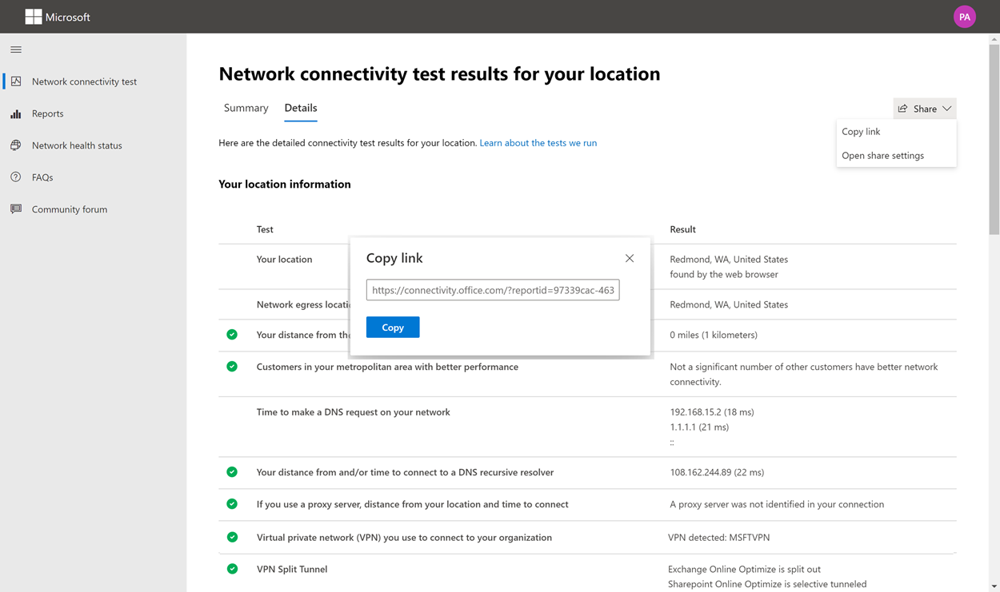

# Microsoft 365网络连接测试工具Microsoft 365 network connectivity test tool

Microsoft 365网络连接测试工具位于 <https://connectivity.office.com> 。The Microsoft 365 network connectivity test tool is located at <https://connectivity.office.com>. 它是网络评估和网络见解信息的一个Microsoft 365运行状况管理中心下的网络 **|"连接"** 菜单。It is an adjunct tool to the network assessment and network insights information available in the Microsoft 365 admin center under the **Health | Connectivity** menu.

> [!IMPORTANT]
> 登录 Microsoft 365 租户非常重要，因为所有测试报告都与管理员共享，并上传到租户（登录时）。It is important to sign in to your Microsoft 365 tenant as all test reports are shared with your administrator and uploaded to the tenant while you are signed in.

> [!div class="mx-imgBorder"]
> 

>[!NOTE]
>网络连接测试工具支持 WW Commercial 和 Germany 中的租户，GCC中等、GCC高、DoD 或中国。The network connectivity test tool supports tenants in WW Commercial and Germany but not GCC Moderate, GCC High, DoD or China.

Microsoft 365 管理中心中的网络见解基于 Microsoft 365 租户的常规产品内度量，每天汇总一次。The network insights in the Microsoft 365 Admin Center are based on regular in-product measurements for your Microsoft 365 tenant, which are aggregated each day. 相比之下，来自 Microsoft 365 网络连接测试的网络见解在本地运行，在工具中运行一次。In comparison, the network insights from the Microsoft 365 network connectivity test are run locally and one time in the tool. 可在产品内完成的测试受到限制，通过在本地运行用户测试，可以收集更多数据，从而获得更深入的见解。Testing that can be done in-product is limited and by running tests local to the user more data can be gathered resulting in deeper insights. 然后，考虑一下，Microsoft 365管理中心中的网络见解将显示特定办公地点Microsoft 365网络存在问题。Consider then that the network insights in the Microsoft 365 Admin Center will show that there is a networking problem for use of Microsoft 365 at a specific office location. Microsoft 365连接测试可帮助确定导致建议的网络性能改进操作的根本原因。The Microsoft 365 connectivity test can help to identify the root cause of that problem leading to a recommended network performance improvement action.

我们建议一起使用这些见解，其中可以评估 Microsoft 365 管理中心中每个办公室位置的网络质量状态，并且可以在基于 Microsoft 365 连接测试部署测试后找到更多具体信息。We recommend that these insights be used together where networking quality status can be assessed for each office location in the Microsoft 365 Admin Center and more specifics can be found after deployment of testing based on the Microsoft 365 connectivity test.

>[!IMPORTANT]
>Microsoft 365 管理中心中的网络见解、性能建议和评估目前处于预览状态，仅适用于已在功能预览计划中注册的 Microsoft 365 租户。Network insights, performance recommendations and assessments in the Microsoft 365 Admin Center is currently in preview status, and is only available for Microsoft 365 tenants that have been enrolled in the feature preview program.

## 每个测试步骤中发生的情况What happens at each test step

### Office位置标识Office location identification

单击"运行测试"按钮时，将显示正在运行的测试页面并标识办公地点。When you click the run test button, we show the running test page and identify the office location. 你可以按城市、省/市/县和国家/地区键入你的位置，也可以从 Web 浏览器检测到它。You can type in your location by city, state, and country or you can have it detected from the web browser. 如果检测到，我们会从 Web 浏览器请求经度和纬度，并使用前将精度限制为 300 米和 300 米。If you detect it, then we request the latitude and longitude from the web browser and limit the accuracy to 300 meters by 300 meters before use. 我们这样做是因为，为了提升网络性能，不需要比构建位置更准确。We do this because it is not necessary to identify the location more accurately than the building for network performance. 

### JavaScript 测试JavaScript tests

在办公室位置标识后，我们在 JavaScript 中运行 TCP 延迟测试，并且从服务请求有关使用中和推荐的Office 365前端服务器的数据。After office location identification, we run a TCP latency test in JavaScript and we request data from the service about in-use and recommended Office 365 service front door servers. 完成这些测试后，我们会在地图上和详细信息选项卡中显示它们，可在下一步之前查看它们。When these tests are completed, we show them on the map and in the details tab where they can be viewed prior to the next step.

### 下载高级测试客户端应用程序Download the advanced tests client application

接下来，开始下载高级测试客户端应用程序。Next, we start the download of the advanced tests client application. 我们依赖用户启动客户端应用程序，并且还必须安装 .NET Core。We rely on the user to launch the client application and they must also have .NET Core installed.

网络连接测试Microsoft 365两个部分：网站和运行高级网络连接Windows可下载的客户端 <https://connectivity.office.com> 应用程序。There are two parts to the Microsoft 365 network connectivity test: the web site <https://connectivity.office.com> and a downloadable Windows client application that runs advanced network connectivity tests. 大多数测试都需要运行应用程序。Most of the tests require the application to be run. 运行时，它会将结果填充回网页。It will populate results back into the web page as it runs.

Web 浏览器测试完成后，系统将提示您从网站下载高级客户端测试应用程序。You will be prompted to download the advanced client test application from the web site after the web browser tests have completed. 在系统提示时打开并运行该文件。Open and run the file when prompted.

> [!div class="mx-imgBorder"]
> 

### 启动高级测试客户端应用程序Start the advanced tests client application

客户端应用程序启动后，网页将更新以显示此结果。Once the client application starts, the web page will update to show this result. 测试数据将开始接收到网页。Test data will start to be received to the web page. 每次收到新数据时，页面将更新，并且您可以在数据到达时查看数据。The page updates each time new data is received and you can review the data as it arrives.

### 已完成高级测试并上传测试报告Advanced tests completed and test report upload

测试完成后，网页和高级测试客户端都会显示这一点。When the tests are completed, the web page and the advanced tests client will both show that. 如果用户已登录，测试报告将上载到客户的租户。If the user is signed in, the test report will be uploaded to the customer's tenant.

## 共享测试报告Sharing your test report

测试报告需要登录到你的Office 365帐户。The test report requires sign-in to your Office 365 account. 管理员选择如何共享测试报告。Your administrator selects how you can share your test report.

### 与管理员共享报告Sharing your report with your administrator

如果在出现测试报告时登录，该报告将与管理员共享。If you are signed in when a test report occurs, that reports is shared with your administrator.

### 与 Microsoft 帐户团队、支持或其他人员共享Sharing with your Microsoft account team, support or other personnel

测试报告 (与 Microsoft 员工) 的任何个人标识。Test reports (excluding any personal identification) are shared with Microsoft employees. 此共享默认处于启用状态，并且您的管理员可以在"运行状况"| **管理中心** 中的"网络连接Microsoft 365页。This sharing is enabled by default and can be disabled by your administrator in the **Health | Network Connectivity** page in the Microsoft 365 Admin Center.

### 与登录到同一租户的Office 365共享Sharing with other users who sign in to the same Office 365 tenant

可以选择与用户共享报告。You can choose users to share your report with. 默认情况下启用能够选择，但管理员可以禁用它。Being able to choose is enabled by default, but it can be disabled by your administrator.

> [!div class="mx-imgBorder"]
> 

### 使用 ReportID 链接与任何人共享Sharing with anyone using a ReportID link

可以通过提供对 ReportID 链接的访问权限来与任何人共享测试报告。You can share your test report with anyone by providing access to a ReportID link. 此链接生成一个 URL，您可以将其发送给某人，以便他们可以在不登录的情况下显示测试报告。This link generates a URL that you can send to someone so that they can bring up the test report without signing in. 默认情况下禁用此共享，并且必须由管理员启用。This sharing is disabled by default and must be enabled by your administrator.

> [!div class="mx-imgBorder"]
> 

## 网络连接测试结果Network Connectivity Test Results

结果显示在"摘要"和 **"详细信息\*\*\*\*"选项卡** 中。The results are shown in the **Summary** and **Details** tabs. 摘要选项卡显示检测到的网络外围的地图，以及网络评估与附近客户Office 365的比较。The summary tab shows a map of the detected network perimeter and a comparison of the network assessment to other Office 365 customers nearby. 它还允许共享测试报告。It also allows for sharing of the test report. 摘要结果视图如下所示：Here's what the summary results view looks like:

> [!div class="mx-imgBorder"]
> 

下面是工具显示的详细信息选项卡输出的示例。Here is an example of the details tab output that the tool shows. 在"详细信息"选项卡上，如果结果与阈值进行比较，则显示绿色圆圈选中标记。On the details tab we show a green circle check mark if the result was compared favorably to a threshold. 如果结果超出指示网络见解的阈值，则显示红色三角形感叹号。We show a red triangle exclamation point if the result exceeded a threshold indicating a network insight. 以下各节介绍每个详细信息选项卡结果行，并解释用于网络见解的阈值。The following sections describe each of the details tab results rows and explain the thresholds used for network insights.

> [!div class="mx-imgBorder"]
> 

### 位置信息Your location information

此部分显示与位置相关的测试结果。This section shows test results related to your location.

#### 你的位置Your location

用户位置从用户 Web 浏览器检测到。The user location is detected from the users web browser. 还可以在用户的选择中键入它。It can also be typed in at the user's choice. 它用于标识到企业网络外围的特定部分的网络距离。It is used to identify network distances to specific parts of the enterprise network perimeter. 报告中仅保存从此位置检测到的城市以及与其他网络点的距离。Only the city from this location detection and the distance to other network points are saved in the report.

用户办公地点显示在地图视图中。The user office location is shown on the map view.

#### 网络出口 (网络连接到 ISP 服务器的位置) Network egress location (the location where your network connects to your ISP)

我们确定服务器端的网络出口 IP 地址。We identify the network egress IP address on the server side. 位置数据库用于查找网络出口的大致位置。Location databases are used to look up the approximate location for the network egress. 这些数据库通常具有大约 90% 的 IP 地址的准确性。These databases typically have an accuracy of about 90% of IP addresses. 如果从网络出口 IP 地址查找的位置不准确，则会导致此测试产生错误结果。If the location looked up from the network egress IP address is not accurate then this would lead to a false result from this test. 若要验证特定 IP 地址是否发生此错误，可以使用可公开访问的网络 IP 地址位置网站来比较实际位置。To validate if this error is occurring for a specific IP address you can use publicly accessible network IP address location web sites to compare to your actual location.

#### 你与网络出口位置之间的距离Your distance from the network egress location

我们确定从该位置到办公地点的距离。We determine the distance from that location to the office location. 如果距离大于 **500** 英里 (800 千米) 这将显示为网络见解，因为这样做可能会增加 TCP 延迟超过 25 毫秒，并可能会影响用户体验。This is shown as a network insight if the distance is greater than **500 miles** (800 kilometers) since that is likely to increase the TCP latency by more than 25 ms and may affect user experience.

网络出口位置显示在地图视图中，并连接到指示企业 WAN 内部网络回程的用户办公室位置。The network egress location is shown on the map view and connected to the user office location indicating the network backhaul inside of the enterprise WAN.

建议实现从用户办公室位置到 Internet 的本地和直接网络出口，Microsoft 365网络连接。Implementing local and direct network egress from user office locations to the Internet is recommended for Microsoft 365 network connectivity. 对本地和直接出口的改进是解决此网络见解问题的最佳方法。Improvements to local and direct egress are the best way to address this network insight.

#### 代理服务器信息Proxy server information

我们确定在本地 () 配置的代理服务器服务器。We identify proxy server(s) configured on the local machine. 我们确定在网络路径中是否配置了其中任何一项，以优化Microsoft 365网络流量。We identify if any of these are configured in the network path for optimize category Microsoft 365 network traffic. 我们确定从用户办公位置到代理服务器的距离。We identify the distance from the user office location to the proxy servers. 该距离首先由 ICMP ping 测试，如果失败，我们使用 TCP ping 进行测试，如果失败，我们最后在 IP 地址位置数据库中查找代理服务器 IP 地址。The distance is tested first by ICMP ping and if that fails we test with TCP ping and finally if that fails we look up the proxy server IP Address in an IP Address location database. 如果代理服务器距离用户办公地点 **800** 千米 (800 千米) ，我们将显示网络见解。We show a network insight if the proxy server is further than **500 miles** (800 kilometers) away from the user office location.

#### 虚拟专用 (VPN) 用于连接到组织的 VPN 网络Virtual private network (VPN) you use to connect to your organization

这将检测你是否使用 VPN 连接到Office 365。This detects if you are using a VPN to connect to Office 365. 传递结果将显示你是否没有 VPN，或者你的 VPN 是否具有针对 Office 365 的建议拆分隧道配置。A passing result will show if you have no VPN, or if you have a VPN with recommended split tunnel configuration for Office 365.

#### VPN 拆分TunnelVPN Split Tunnel

系统针对 Exchange Online、SharePoint Online 和 Microsoft Teams 的每个优化类别路由进行测试，以查看其是否通过 VPN 进行隧道传输。Each optimized category route for Exchange Online, SharePoint Online, and Microsoft Teams is tested to see if it is tunneled on the VPN or not. 拆分的工作负荷将完全避免 VPN。A split out workload avoids the VPN entirely. 隧道工作负荷均通过 VPN 发送。A tunneled workload is all sent over the VPN. 选择性隧道工作负荷具有通过 VPN 发送的一些路由，一些路由被拆分。传递结果将显示是否拆分所有工作负荷或选择性隧道。A selective tunneled workload has some routes sent over the VPN and some split out. A passing result will show if all workloads are split out or selective tunneled.

#### 都市区域的客户具有更好的性能Customers in your metropolitan area with better performance

用户办公地点到 Exchange Online 服务前端的网络 TCP 延迟与同一Microsoft 365区域中的其他客户比较。The network TCP latency of the user office location to the Exchange Online service front door is compared to other Microsoft 365 customers in the same metro area. 如果同一区 10% 或 10% 以上的客户具有更好的性能，将显示网络见解。A network insight is shown if 10% or more of customers in the same metro area have better performance. 这意味着他们的用户将在用户界面中Microsoft 365性能。This means their users will have better performance in the Microsoft 365 user interface.

生成此网络见解的基础是，城市中的所有用户都有权访问相同的电信基础结构和与 Internet 线路和 Microsoft 网络相同的邻近感应。This network insight is generated on the basis that all users in a city have access to the same telecommunications infrastructure and the same proximity to Internet circuits and Microsoft's network.

#### 在网络中提出 DNS 请求的时间Time to make a DNS request on your network

这将显示运行测试的客户端计算机上配置的 DNS 服务器。This shows the DNS server configured on the client machine that ran the tests. 这可能是 DNS 递归解析程序服务器，但这种情况并不常见。It might be a DNS Recursive Resolver server however this is uncommon. 它更有可能是 DNS 转发器服务器，它缓存 DNS 结果，将任何未缓存的 DNS 请求转发到另一个 DNS 服务器。It is more likely to be a DNS forwarder server, which caches DNS results and forwards any uncached DNS requests to another DNS server.

仅提供此信息，不参与任何网络见解。This is provided for information only and does not contribute to any network insight.

#### 连接到 DNS 递归解析程序的距离和/或时间Your distance from and/or time to connect to a DNS recursive resolver

通过提出特定的 DNS 请求，然后向 DNS 名称服务器询问接收相同请求的 IP 地址，可标识使用中的 DNS 递归解析程序。The in-use DNS Recursive Resolver is identified by making a specific DNS request and then asking the DNS Name Server for the IP Address that it received the same request from. 此 IP 地址是 DNS 递归解析程序，它将在 IP 地址位置数据库中查找以查找位置。This IP Address is the DNS Recursive Resolver and it will be looked up in IP Address location databases to find the location. 然后计算从用户办公室位置到 DNS 递归解析程序服务器位置的距离。The distance from the user office location to the DNS Recursive Resolver server location is then calculated. 如果距离大于 **500** 千米 (800 千米) 。This is shown as a network insight if the distance is greater than **500 miles** (800 kilometers).

从网络出口 IP 地址查找的位置可能不准确，这可能会导致此测试产生错误结果。The location looked up from the network egress IP Address may not be accurate and this would lead to a false result from this test. 若要验证特定 IP 地址是否发生此错误，可以使用可公开访问的网络 IP 地址位置网站。To validate if this error is occurring for a specific IP Address you can use publicly accessible network IP Address location web sites.

此网络见解将专门影响服务Exchange Online的选择。This network insight will specifically impact the selection of the Exchange Online service front door. 要解决此见解，本地和直接网络出口应作为先决条件，然后 DNS 递归解析程序应位于该网络出口附近。To address this insight local and direct network egress should be a pre-requisite and then DNS Recursive Resolver should be located close to that network egress.

### Exchange OnlineExchange Online

此部分显示与测试相关的Exchange Online。This section shows test results related to Exchange Online.

#### Exchange服务前端位置Exchange service front door location

使用中的Exchange服务前端的标识方式与确定Outlook相同，并度量从用户位置到它的网络 TCP 延迟。The in-use Exchange service front door is identified in the same way that Outlook does this and we measure the network TCP latency from the user location to it. 将显示 TCP 延迟，并使用Exchange服务前端与当前位置的最佳服务前端列表进行比较。The TCP latency is shown and the in-use Exchange service front door is compared to the list of best service front doors for the current location. 如果未使用最佳服务Exchange之一 (，) 网络见解。This is shown as a network insight if one of the best Exchange service front door(s) is not in use.

未使用最佳 Exchange 服务前端 () 可能是由于企业网络出口之前的网络回程所致，在这种情况下，我们建议使用本地和直接网络出口。Not using one of the best Exchange service front door(s) could be caused by network backhaul before the corporate network egress in which case we recommend local and direct network egress. 它还可能是由于使用远程 DNS 递归解析程序服务器所致，在这种情况下，我们建议将 DNS 递归解析程序服务器与网络出口对齐。It could also be caused by use of a remote DNS recursive resolver server in which case we recommend aligning the DNS recursive resolver server with the network egress.

计算 TCP 延迟在 tcp 延迟 () 到 Exchange 服务前端。We calculate a potential improvement in TCP latency (ms) to the Exchange service front door. 这是通过查看经过测试的用户办公室位置网络延迟，并从当前位置到服务前端的Exchange延迟实现。This is done by looking at the tested user office location network latency and subtracting the network latency from the current location to the closets Exchange service front door. 差异表示潜在的改进机会。The difference represents the potential opportunity for improvement.

#### Exchange位置的最佳 () 服务前端Best Exchange service front door(s) for your location

这将按城市列出Exchange位置的最佳服务前端位置。This lists the best Exchange service front door locations by city for your location.

#### 客户端 DNS 中记录的服务前端Service front door recorded in the client DNS

这将显示定向到的 Exchange 前端服务器的 DNS 名称和 IP 地址。This shows the DNS name and IP Address of the Exchange service front door server that you were directed to. 它仅提供信息，没有关联的网络见解。It is provided for information only and there is no associated network insight.

### SharePoint OnlineSharePoint Online

本部分显示与 SharePoint Online 和 OneDrive 相关的测试结果。This section shows test results related to SharePoint Online and OneDrive.

#### 服务前端位置The service front door location

使用SharePoint服务前端的标识方式与 OneDrive 客户端相同，并且我们测量从用户办公位置到它的网络 TCP 延迟。The in-use SharePoint service front door is identified in the same way that the OneDrive client does and we measure the network TCP latency from the user office location to it.

#### 下载速度Download speed

我们测量 15Mb 文件从 SharePoint 前端的下载速度。We measure the download speed for a 15Mb file from the SharePoint service front door. 结果以 MB/秒为单位显示，以指示在一秒钟内可以从 SharePoint 或 OneDrive 下载的大小文件（以 MB **为单位**）。The result is shown in megabytes per second to indicate what size file in megabytes can be downloaded from SharePoint or OneDrive in **one second**. 该数字应类似于最小电路带宽的十分之一（以兆位/秒表示）。The number should be similar to one tenth of the minimum circuit bandwidth in megabits per second. 例如，如果您具有 100mbps 的 Internet 连接，则预期每秒 10 MB (10MBps) 。For example if you have a 100mbps internet connection, you may expect 10 megabytes per second (10MBps).

#### 缓冲区过度Buffer bloat

在 15Mb 下载期间，我们测量到 SharePoint前端的 TCP 延迟。During the 15Mb download we measure the TCP latency to the SharePoint service front door. 这是负载下的延迟，它将与未在负载下的延迟进行比较。This is the latency under load and it is compared to the latency when not under load. 负载不足时延迟的增加通常可归因于正在加载或 (的网络设备) 。The increase in latency when under load is often attributable to consumer network device buffers being loaded (or bloated). 显示任何超过 1，000 个的网络见解。A network insight is shown for any bloat of 1,000 or more.

#### 客户端 DNS 中记录的服务前端Service front door recorded in the client DNS

这将显示定向到的 SharePoint 前端服务器的 DNS 名称和 IP 地址。This shows the DNS name and IP Address of the SharePoint service front door server that you were directed to. 它仅提供信息，没有关联的网络见解。It is provided for information only and there is no associated network insight.

### Microsoft TeamsMicrosoft Teams

此部分显示与测试相关的Microsoft Teams。This section shows test results related to Microsoft Teams.

#### 媒体连接 (音频、视频和应用程序共享) Media connectivity (audio, video, and application sharing)

这将测试 UDP 与 Microsoft Teams 前端的连接。This tests for UDP connectivity to the Microsoft Teams service front door. 如果阻止此操作，Microsoft Teams TCP 仍可以正常工作，但音频和视频将受损。If this is blocked then Microsoft Teams may still work using TCP, but audio and video will be impaired. 有关这些 UDP 网络度量（同样适用于 Microsoft Teams Media Quality and [Network Connectivity Performance in Skype for Business Online）](/skypeforbusiness/optimizing-your-network/media-quality-and-network-connectivity-performance)的更多内容。Read more about these UDP network measurements, which also apply to Microsoft Teams at [Media Quality and Network Connectivity Performance in Skype for Business Online](/skypeforbusiness/optimizing-your-network/media-quality-and-network-connectivity-performance).

#### 数据包丢失Packet loss

显示以 10 秒测试音频呼叫从客户端到 Microsoft Teams 服务前端的 UDP 数据包丢失。Shows the UDP packet loss measured in a 10 second test audio call from the client to the Microsoft Teams service front door. 对于传递，此值应低于 **1.00%。**This should be lower than **1.00%** for a pass.

#### 延迟Latency

显示测量的 UDP 延迟，应小于 **100 毫秒**。Shows the measured UDP latency, which should be lower than **100ms**.

#### 抖动Jitter

显示测量的 UDP 抖动，应该小于 **30 毫秒**。Shows the measured UDP jitter, which should be lower than **30ms**.

#### 连接Connectivity

我们测试从用户办公位置到所有所需网络终结点的 HTTP Microsoft 365连接。We test for HTTP connectivity from the user office location to all of the required Microsoft 365 network endpoints. 这些在 上发布 [https://aka.ms/o365ip](./urls-and-ip-address-ranges.md) 。These are published at [https://aka.ms/o365ip](./urls-and-ip-address-ranges.md). 将显示任何无法连接到的必需网络终结点的网络见解。A network insight is shown for any required network endpoints, which cannot be connected to.

企业网络外围上的代理服务器、防火墙或其他网络安全设备可能会阻止连接。Connectivity may be blocked by a proxy server, a firewall, or another network security device on the enterprise network perimeter. 使用 HTTP 请求测试与 TCP 端口 80 的连接，使用 HTTPS 请求测试与 TCP 端口 443 的连接。Connectivity to TCP port 80 is tested with an HTTP request and connectivity to TCP port 443 is tested with an HTTPS request. 如果没有响应，FQDN 将标记为失败。If there is no response the FQDN is marked as a failure. 如果有 HTTP 响应代码 407，则 FQDN 将标记为失败。If there is an HTTP response code 407 the FQDN is marked as a failure. 如果存在 HTTP 响应代码 403，则检查响应的 Server 属性，如果似乎为代理服务器，我们会将其标记为失败。If there is an HTTP response code 403 then we check the Server attribute of the response and if it appears to be a proxy server we mark this as a failure. 您可以使用命令行工具工具Windows我们执行的测试curl.exe。You can simulate the tests we perform with the Windows command-line tool curl.exe.

我们在位于"优化"或"允许"类别的Microsoft 365所需的网络终结点上测试 SSL 证书，如 上所定义 [https://aka.ms/o365ip](./urls-and-ip-address-ranges.md) 。We test the SSL certificate at each required Microsoft 365 network endpoint that is in the optimize or allow category as defined at [https://aka.ms/o365ip](./urls-and-ip-address-ranges.md). 如果任何测试找不到 Microsoft SSL 证书，则所连接的加密网络必须已被中间网络设备截获。If any tests do not find a Microsoft SSL certificate, then the encrypted network connected must have been intercepted by an intermediary network device. 任何截获的加密网络终结点上都显示了网络见解。A network insight is shown on any intercepted encrypted network endpoints.

如果发现 SSL 证书不是由 Microsoft 提供的，我们将显示测试的 FQDN 和使用的 SSL 证书所有者。Where an SSL certificate is found that isn't provided by Microsoft, we show the FQDN for the test and the in-use SSL certificate owner. 此 SSL 证书所有者可能是代理服务器供应商，或者可能是企业自签名证书。This SSL certificate owner may be a proxy server vendor, or it may be an enterprise self-signed certificate.

#### 网络路径Network path

本节显示 ICMP 跟踪到 Exchange Online 服务前端、SharePoint Online 服务前端和 Microsoft Teams 服务前端的结果。This section shows the results of an ICMP traceroute to the Exchange Online service front door, the SharePoint Online service front door, and the Microsoft Teams service front door. 它仅提供信息，没有关联的网络见解。It is provided for information only and there is no associated network insight. 提供了三个 traceroutes。There are three traceroutes provided. 跟踪路由 outlook.office365.com、客户SharePoint或 microsoft.sharepoint.com（如果未提供）的跟踪，以及 _world.tr.teams.microsoft.com。_ A traceroute to _outlook.office365.com_, a traceroute to the customers SharePoint front end or to _microsoft.sharepoint.com_ if one was not provided, and a traceroute to _world.tr.teams.microsoft.com_.

## 连接性报告Connectivity reports

登录后，你可以查看之前运行的报告。When you are signed in you can review previous reports that you have run. 还可以共享它们，也可以从列表中删除它们。You can also share them or delete them from the list.

> [!div class="mx-imgBorder"]
> 

## 网络运行状况状态Network health status

这将显示 Microsoft 全球网络出现的任何重大运行状况问题，这些问题Microsoft 365客户。This shows any significant health issues with Microsoft's global network, which might impact Microsoft 365 customers.

> [!div class="mx-imgBorder"]
> 

## 常见问题FAQ

以下是一些常见问题的解答。Here are answers to some of our frequently asked questions.

### 此工具是否由 Microsoft 发布和支持？Is this tool released and supported by Microsoft?

它目前为预览版，我们计划定期提供更新，直到我们在 Microsoft 支持下达到正式发布状态。It is currently a preview and we plan to provide updates regularly until we reach general availability release status with support from Microsoft. 请提供反馈以帮助我们改进。Please provide feedback to help us improve. 我们计划发布更详细的网络Office 365入门指南作为此工具的一部分，该工具根据组织的测试结果进行自定义。We are planning to publish a more detailed Office 365 Network Onboarding guide as part of this tool, which is customized for the organization by its test results.

### 运行高级测试客户端需要什么？What is required to run the advanced test client?

高级测试客户端需要 .NET Core 3.1 桌面运行时。The advanced test client requires .NET Core 3.1 Desktop Runtime. 如果在未安装的情况下运行高级测试客户端，将定向到 [.NET Core 3.1 安装程序页面](https://dotnet.microsoft.com/download/dotnet-core/3.1)。If you run the advanced test client without that installed you will be directed to [the .NET Core 3.1 installer page](https://dotnet.microsoft.com/download/dotnet-core/3.1). 请务必安装桌面运行时（而不是 SDK）或 ASP.NET Core 运行时（位于页面的较高位置）。Be sure to install the Desktop Runtime and not the SDK, or the ASP.NET Core Runtime, which are higher up on the page. 安装 .NET Core 需要计算机上管理员权限。Administrator permissions on the machine are required to install .NET Core.

### 什么是Microsoft 365前端？What is Microsoft 365 service front door?

Microsoft 365服务前端是 Microsoft 全局网络的入口点，其中Office服务终止其网络连接。The Microsoft 365 service front door is an entry point on Microsoft's global network where Office clients and services terminate their network connection. 为了获得最佳网络连接Microsoft 365，建议将网络连接终止到城市或Microsoft 365最近的Microsoft 365。For an optimal network connection to Microsoft 365, it is recommended that your network connection is terminated into the closest Microsoft 365 front door in your city or metro.

> [!NOTE]
> Microsoft 365服务前端与 Azure 市场中提供的 **Azure Front Door Service** 产品没有直接关系。Microsoft 365 service front door has no direct relationship to the **Azure Front Door Service** product available in the Azure marketplace.

### 服务前端Microsoft 365是什么？What is the best Microsoft 365 service front door?

最佳的Microsoft 365服务 (以前称为最佳服务前端) 是离网络出口最近的入口，通常位于城市或都市区。A best Microsoft 365 service front door (formerly known as an optimal service front door) is one that is closest to your network egress, generally in your city or metro area. 使用Microsoft 365网络性能工具确定使用中的 Microsoft 365 服务前端的位置，以及使用的最佳服务 () 。Use the Microsoft 365 network performance tool to determine location of your in-use Microsoft 365 service front door and the best service front door(s). 如果该工具确定使用中的前端是最佳门之一，则应该可以与 Microsoft 的全局网络建立出色的连接。If the tool determines your in-use front door is one of the best ones, then you should expect great connectivity into Microsoft's global network.

### 什么是 Internet 出口位置？What is an internet egress location?

Internet 出口位置是网络流量退出企业网络并连接到 Internet 的位置。The internet egress Location is the location where your network traffic exits your enterprise network and connects to the Internet. 这还标识为具有网络地址转换 (NAT) 设备的位置，并且通常是与 Internet 服务提供商 (ISP) 连接的位置。This is also identified as the location where you have a Network Address Translation (NAT) device and usually where you connect with an Internet Service Provider (ISP). 如果您看到您的位置和 Internet 出口位置之间的距离很长，则这可能会标识一个明显的 WAN 回程。If you see a long distance between your location and your internet egress location, then this may identify a significant WAN backhaul.

## 相关主题Related topics

[Microsoft 365 管理中心 (预览) Network connectivity in the Microsoft 365 Admin Center (preview)](office-365-network-mac-perf-overview.md)

[Microsoft 365预览版 (网络性能) Microsoft 365 network performance insights (preview)](office-365-network-mac-perf-insights.md)

[Microsoft 365网络评估 (预览) Microsoft 365 network assessment (preview)](office-365-network-mac-perf-score.md)

[Microsoft 365网络连接位置服务 (预览) Microsoft 365 Network Connectivity Location Services (preview)](office-365-network-mac-location-services.md)