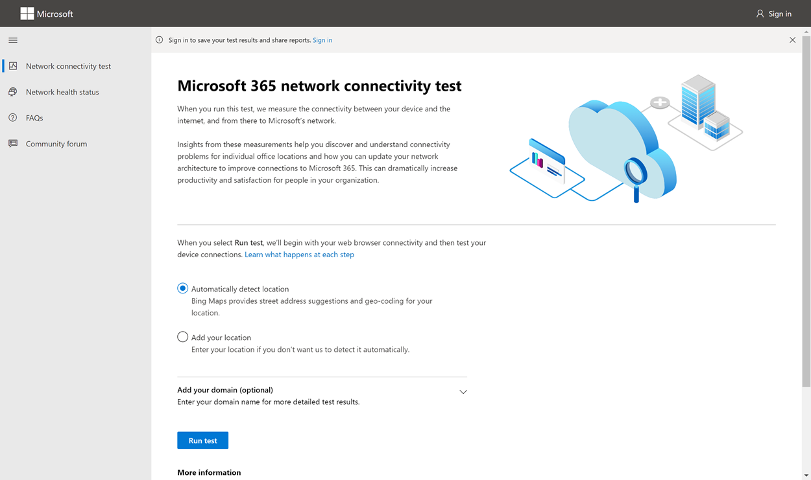

# Microsoft 365 网络连接测试工具 (预览) 

Microsoft 365 网络连接测试工具位于 <https://connectivity.office.com> 。 它是 Microsoft 365 管理中心中运行状况管理中心下的网络评估和网络见解信息的| **"连接"** 菜单。

> [!IMPORTANT]
> 登录 Microsoft 365 租户非常重要，因为所有测试报告都与管理员共享，在登录时上传到租户。

>[!NOTE]
>网络连接测试工具支持 WW 商业德国的租户，但不支持 GCC 中等、GCC High、DoD 或中国租户。

Microsoft 365 管理中心中的网络见解基于 Microsoft 365 租户的常规产品内度量（每天汇总一次）。 相比之下，来自 Microsoft 365 网络连接测试的网络见解在本地运行，在工具中运行一次。 可在产品内完成的测试受到限制，通过在本地运行用户测试，可以收集更多数据，从而获得更深入的见解。 然后，考虑 Microsoft 365 管理中心的网络见解将显示特定办公地点存在 Microsoft 365 使用网络问题。 Microsoft 365 连接测试可帮助确定导致建议的网络性能改进操作的根本原因。

我们建议一起使用这些功能，其中可以在 Microsoft 365 管理中心中评估每个办公室位置的网络质量状态，并且可以在基于 Microsoft 365 连接测试的测试部署后找到更多具体信息。

>[!IMPORTANT]
>Microsoft 365 管理中心中的网络见解、性能建议和评估目前处于预览状态，仅适用于已在功能预览计划中注册的 Microsoft 365 租户。

## 每个测试步骤中发生的情况

### Office 位置标识

单击运行测试按钮时，将显示正在运行的测试页面并标识办公地点。 你可以按城市、省/市/县和国家/地区键入你的位置，也可以从 Web 浏览器检测到它。 如果检测到它，我们会从 Web 浏览器请求经度和纬度，并使用前将精确度限制为 300m 至 300m。 我们这样做是因为，为了提升网络性能，不需要比构建位置更准确。 

### JavaScript 测试

在 Office 位置标识后，我们在 JavaScript 中运行 TCP 延迟测试，并且从服务请求有关使用中和推荐的 Office 365 服务前端服务器的数据。 完成这些操作后，我们会在地图上和详细信息选项卡中显示它们，可在下一步之前查看它们。

### 下载高级测试客户端应用程序

接下来，开始下载高级测试客户端应用程序。 我们依赖用户启动客户端应用程序，并且还必须安装 .NET Core。

Microsoft 365 网络连接测试有两个部分;网站和 <https://connectivity.office.com> 可下载的运行高级网络连接测试的 Windows 客户端应用程序。 大多数测试都需要运行应用程序。 运行时，它会将结果填充回网页。

Web 浏览器测试完成后，系统将提示您从网站下载高级客户端测试应用程序。 在系统提示时打开并运行该文件。

### 启动高级测试客户端应用程序

客户端应用程序启动后，网页将更新以显示这一点，测试数据将开始接收到网页。 它每次收到新数据时更新，并且你可以查看数据到达时。

### 已完成高级测试并上传测试报告

测试完成后，网页和高级测试客户端都将指示这一点，并且用户是否登录测试报告将上载到客户租户。

## 共享测试报告

测试报告需要登录到 Office 365 帐户。 管理员选择如何共享测试报告。

### 与管理员共享报告

登录时的所有测试报告都与管理员共享。

### 与 Microsoft 帐户团队、支持或其他人员共享

不包括任何个人标识的测试报告将与 Microsoft 员工共享。 默认情况下，此选项处于启用状态，并且您的管理员可以在"运行状况"| Microsoft 365 管理中心中的"网络连接"页。

### 与登录到同一 Office 365 租户的其他用户共享

你可以选择与用户共享报告，默认情况下会启用此功能。 管理员也可以禁用它。

### 使用 ReportID 链接与任何人共享

可以通过提供对 ReportID 链接的访问权限来与任何人共享测试报告。 这将生成一个 URL，你可以将其发送给某人，以便他们可以在不登录的情况下显示测试报告。 默认情况下，此选项处于禁用状态，必须由管理员启用。

## 网络连接测试结果

结果显示在"摘要"和 **"详细信息****"选项卡** 中。 摘要选项卡显示检测到的网络外围的地图，以及网络评估与附近其他 Office 365 客户的比较。 它还允许共享测试报告。 下面是摘要结果视图的外观。

下面是工具显示的详细信息选项卡输出的示例。 在"详细信息"选项卡上，如果结果与阈值进行比较，则显示绿色圆圈选中标记。 如果结果超出指示网络见解的阈值，则显示红色三角形感叹号。 以下各节介绍每个详细信息选项卡结果行，并说明用于网络见解的阈值。

### 位置信息

此部分显示与位置相关的测试结果。

#### 你的位置

用户位置从用户 Web 浏览器检测到，或者可以在用户选择中键入。 它用于标识到企业网络外围的特定部分的网络距离。 报告中仅保存从此位置检测到的城市以及与其他网络点的距离。

用户办公地点显示在地图视图中。

#### 网络出口 (网络连接到 ISP 服务器的位置) 

我们确定服务器端的网络出口 IP 地址。 位置数据库用于查找网络出口的大致位置。 这些数据库通常具有大约 90% 的 IP 地址的准确性。 如果从网络出口 IP 地址查找的位置不准确，则会导致此测试产生错误结果。 若要验证特定 IP 地址是否发生此错误，可以使用可公开访问的网络 IP 地址位置网站来比较实际位置。

#### 你与网络出口位置的距离

我们确定从该位置到办公地点的距离。 如果距离大于 **500** 千米 (800 千米) 这将显示为网络见解，因为这可能会导致 TCP 延迟增加 25 毫秒以上，并可能会影响用户体验。

网络出口位置显示在地图视图中，并连接到指示企业 WAN 内部网络回程的用户办公室位置。

建议为 Microsoft 365 网络连接实现从用户办公室位置到 Internet 的本地和直接网络出口。 对本地和直接出口的改进是解决此网络见解问题的最佳方法。

#### 代理服务器信息

我们确定在本地 () 配置的代理服务器服务器。 我们确定在网络路径中是否配置了其中任何一项以优化 Microsoft 365 网络流量类别。 我们确定从用户办公位置到代理服务器的距离。 该距离首先由 ICMP ping 测试，如果失败，我们使用 TCP ping 进行测试，如果失败，我们最后在 IP 地址位置数据库中查找代理服务器 IP 地址。 如果代理服务器距离用户办公地点 **800** 千米 (800 千米) ，我们将显示网络见解。

#### 虚拟专用 (VPN) 用于连接到组织的 VPN 网络

这将检测你是否使用 VPN 连接到 Office 365。 传递结果将显示您是否没有 VPN，或者是否具有具有建议的 Office 365 拆分隧道配置的 VPN。

#### VPN 拆分隧道

将测试 Exchange Online、SharePoint Online 和 Microsoft Teams 的每个优化类别路由，以查看该路由是否通过 VPN 进行隧道传输。 拆分的工作负荷将完全避免 VPN。 隧道工作负荷均通过 VPN 发送。 选择性隧道工作负荷具有通过 VPN 发送的一些路由，一些路由被拆分。传递结果将显示是否拆分所有工作负荷或选择性隧道。

#### 都市区域的客户具有更好的性能

将用户办公地点到 Exchange Online 服务前端的网络 TCP 延迟与位于同一子区域的其他 Microsoft 365 客户进行比较。 如果同一区 10% 或 10% 以上的客户具有更好的性能，将显示网络见解。 这意味着他们的用户将在 Microsoft 365 用户界面中拥有更好的性能。

生成此网络见解的基础是，城市中的所有用户都有权访问相同的电信基础结构和与 Internet 线路和 Microsoft 网络相同的邻近感应。

#### 在网络中提出 DNS 请求的时间

这将显示运行测试的客户端计算机上配置的 DNS 服务器。 这可能是 DNS 递归解析程序服务器，但这种情况并不常见。 更有可能是缓存 DNS 结果的 DNS 转发器服务器，并且将任何未缓存的 DNS 请求转发到另一个 DNS 服务器。

仅提供此信息，不参与任何网络见解。

#### 连接到 DNS 递归解析程序的距离和/或时间

通过提出特定的 DNS 请求，然后向 DNS 名称服务器询问接收相同请求的 IP 地址，可标识使用中的 DNS 递归解析程序。 此 IP 地址是 DNS 递归解析程序，它将在 IP 地址位置数据库中查找以查找位置。 然后计算从用户办公室位置到 DNS 递归解析程序服务器位置的距离。 如果距离大于 **500** 千米 (800 千米) 。

从网络出口 IP 地址查找的位置可能不准确，这可能会导致此测试产生错误结果。 若要验证特定 IP 地址是否发生此错误，可以使用可公开访问的网络 IP 地址位置网站。

此网络见解将专门影响 Exchange Online 服务前端的选择。 要解决此见解，本地和直接网络出口应作为先决条件，然后 DNS 递归解析程序应位于该网络出口附近。

### Exchange Online

此部分显示与 Exchange Online 相关的测试结果。

#### Exchange 服务前端位置

使用中的 Exchange 服务前端的标识方式与 Outlook 相同，我们测量从用户位置到它的网络 TCP 延迟。 将显示 TCP 延迟，并使用中的 Exchange 服务前端与当前位置的最佳服务前端列表进行比较。 如果未使用其中一个最佳 Exchange 服务 (，) 网络见解。

在企业网络出口之前 (Exchange 服务前端) 可能是由于网络回程所致，在这种情况下，我们建议使用本地和直接网络出口。 它还可能是由于使用远程 DNS 递归解析程序服务器所致，在这种情况下，我们建议将 DNS 递归解析程序服务器与网络出口对齐。

我们计算 TCP 延迟在 () Exchange 服务前端时的潜在改进。 这是通过查看经过测试的用户办公室位置网络延迟并减去当前位置到 Exchange 服务前端的网络延迟来完成此操作的。 差异表示潜在的改进机会。

#### 适用于你位置的最佳 Exchange () 服务前端

这将按你的位置按城市列出最佳的 Exchange 服务前端位置。

#### 客户端 DNS 中记录的服务前端

这将显示定向到的 Exchange 服务前端服务器的 DNS 名称和 IP 地址。 它仅提供信息，没有关联的网络见解。

### SharePoint Online

本部分显示与 SharePoint Online 和 OneDrive 相关的测试结果。

#### 服务前端位置

使用中的 SharePoint 服务前端的标识方式与 OneDrive 客户端相同，我们测量从用户办公位置到它的网络 TCP 延迟。

#### 下载速度

我们测量 SharePoint 服务前端 15Mb 文件的下载速度。 结果以 MB/秒为单位显示，以指示在一秒钟内可从 SharePoint 或 OneDrive 下载的大小文件（以 MB **为单位**）。 该数字应类似于最小电路带宽的十分之一（以兆位/秒表示）。 例如，如果您具有 100mbps 的 Internet 连接，则预期每秒 10 MB (10MBps) 。

#### 缓冲区过度

在 15Mb 下载过程中，我们测量 SharePoint 服务前端的 TCP 延迟。 这是负载下的延迟，它将与未在负载下的延迟进行比较。 负载不足时延迟的增加通常可归因于正在加载或 (的网络设备) 。 显示任何超过 1，000 个的网络见解。

#### 客户端 DNS 中记录的服务前端

这将显示定向到的 SharePoint 服务前端服务器的 DNS 名称和 IP 地址。 它仅提供信息，没有关联的网络见解。

### Microsoft Teams

本部分显示与 Microsoft Teams 相关的测试结果。

#### 媒体连接 (音频、视频和应用程序共享) 

这将测试 UDP 与 Microsoft Teams 服务前端的连接。 如果阻止此操作，则 Microsoft Teams 可能仍使用 TCP 工作，但音频和视频将受损。 有关这些 UDP 网络度量（同样适用于 Microsoft Teams）的更多内容，请参阅 [Media Quality and Network Connectivity Performance in Skype for Business Online](/skypeforbusiness/optimizing-your-network/media-quality-and-network-connectivity-performance)

#### 数据包丢失

显示从客户端到 Microsoft Teams 服务前端的 10 秒测试音频呼叫中测量的 UDP 数据包丢失。 对于传递，此值应低于 **1.00%。**

#### 延迟

显示测量的 UDP 延迟，应小于 **100 毫秒**。

#### 抖动

显示测量的 UDP 抖动，应该小于 **30 毫秒**。

#### 连接

我们测试从用户办公位置到所有所需 Microsoft 365 网络终结点的 HTTP 连接。 这些在 上发布 [https://aka.ms/o365ip](./urls-and-ip-address-ranges.md) 。 显示无法连接到的任何所需网络终结点的网络见解。

企业网络外围上的代理服务器、防火墙或其他网络安全设备可能会阻止连接。 使用 HTTP 请求测试与 TCP 端口 80 的连接，使用 HTTPS 请求测试与 TCP 端口 443 的连接。 如果没有响应，FQDN 将标记为失败。 如果有 HTTP 响应代码 407，则 FQDN 将标记为失败。 如果存在 HTTP 响应代码 403，则检查响应的 Server 属性，如果似乎为代理服务器，我们会将其标记为失败。 你可以模拟我们使用 Windows 命令行工具工具执行的测试curl.exe。

我们在每个需要的 Microsoft 365 网络终结点（位于 "优化"或"允许"类别中）测试 SSL 证书，如 上所定义 [https://aka.ms/o365ip](./urls-and-ip-address-ranges.md) 。 如果任何测试找不到 Microsoft SSL 证书，则所连接的加密网络必须已被中间网络设备截获。 任何截获的加密网络终结点上都显示了网络见解。

如果发现 SSL 证书不是由 Microsoft 提供的，我们将显示测试的 FQDN 和使用的 SSL 证书所有者。 此 SSL 证书所有者可能是代理服务器供应商，或者可能是企业自签名证书。

#### 网络路径

本节显示 ICMP 跟踪路由到 Exchange Online 服务前端、SharePoint Online 服务前端和 Microsoft Teams 服务前端的结果。 它仅提供信息，没有关联的网络见解。 提供了三个 traceroutes。 跟踪路由 outlook.office365.com、客户 SharePoint 前端或 _microsoft.sharepoint.com（_ 如果未提供）的跟踪，以及 _world.tr.teams.microsoft.com。_

## 连接性报告

登录后，你可以查看之前运行的报告。 还可以共享它们，也可以从列表中删除它们。

## 网络运行状况状态

这显示了 Microsoft 全球网络的任何重要运行状况问题，这些问题可能会影响 Microsoft 365 客户。

## 常见问题

以下是一些常见问题的解答。

### 此工具是否由 Microsoft 发布和支持？

它目前为预览版，我们计划定期提供更新，直到我们在 Microsoft 支持下达到正式发布状态。 请提供反馈以帮助我们改进。 我们计划发布更详细的 Office 365 网络载入指南，作为此工具的一部分，此工具根据组织的测试结果进行自定义。

### 运行高级测试客户端需要什么？

高级测试客户端需要 .NET Core 3.1 桌面运行时。 如果在未安装的情况下运行高级测试客户端，将定向到 [.NET Core 3.1 安装程序页面](https://dotnet.microsoft.com/download/dotnet-core/3.1)。 请务必安装桌面运行时（而不是 SDK）或 ASP.NET 位于页面较高位置的 Core Runtime。 安装 .NET Core 需要计算机上管理员权限。

### 什么是 Microsoft 365 服务前端？

Microsoft 365 服务前端是 Microsoft 全局网络的入口点，Office 客户端和服务在这里终止其网络连接。 为了获得最佳到 Microsoft 365 的网络连接，建议将网络连接终止到城市或城市最近的 Microsoft 365 前端。

注意：Microsoft 365 服务前端与 Azure 市场中提供的 **Azure Front Door Service** 产品没有直接关系。

### 什么是最佳的 Microsoft 365 服务前端？

最佳的 Microsoft 365 服务 (以前称为最佳服务前端) 是离网络出口最近的入口，通常位于城市或都市区。 使用 Microsoft 365 网络性能工具确定你使用的 Microsoft 365 服务前端的位置，以及使用的最佳服务 () 。 如果该工具确定使用中的前端是最佳门之一，则应该可以与 Microsoft 的全局网络建立出色的连接。

### 什么是 Internet 出口位置？

Internet 出口位置是网络流量退出企业网络并连接到 Internet 的位置。 这还标识为具有网络地址转换 (NAT) 设备的位置，并且通常是与 Internet 服务提供商 (ISP) 连接的位置。 如果您看到您的位置和 Internet 出口位置之间的距离很长，则这可能会标识一个明显的 WAN 回程。

## 相关主题

[Microsoft 365 管理中心中的网络连接 (预览) ](office-365-network-mac-perf-overview.md)

[Microsoft 365 网络性能见解 (预览) ](office-365-network-mac-perf-insights.md)

[Microsoft 365 网络评估 (预览) ](office-365-network-mac-perf-score.md)

[Microsoft 365 网络连接位置服务 (预览) ](office-365-network-mac-location-services.md)