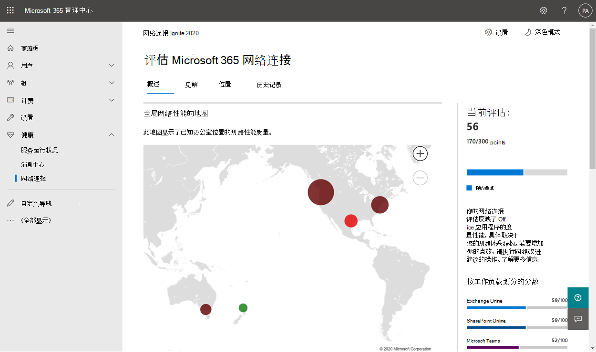
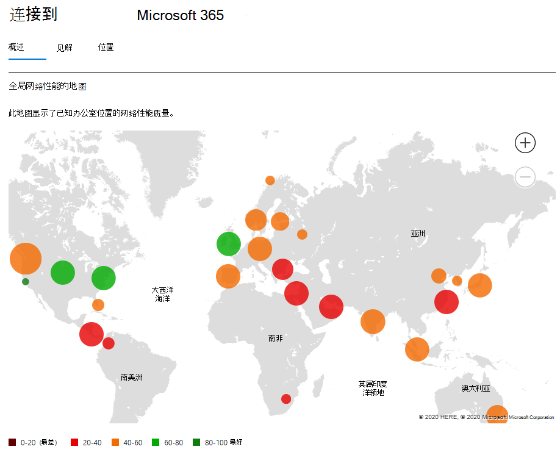
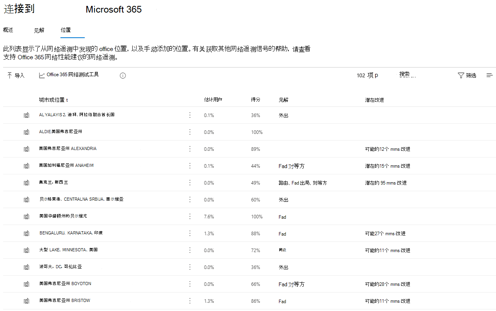
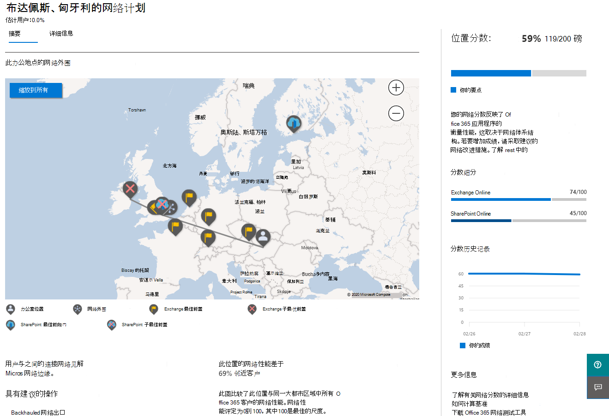
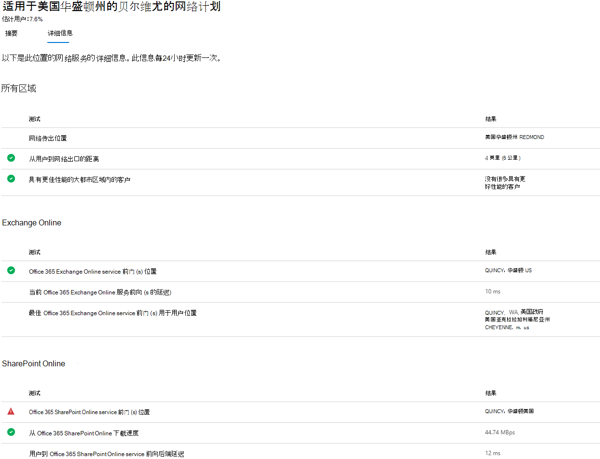

# Microsoft 365 管理 中心中的网络连接

现在Microsoft 365 管理中心包含从 Microsoft 365 租户收集的聚合网络连接指标，并且仅可供租户中的管理用户查看。

> [!div class="mx-imgBorder"]
> 

**网络评估和****网络见解** 显示在Microsoft 365 管理中心中的运行状况|**网络连接。**

> [!div class="mx-imgBorder"]
> 

>[!NOTE]
>管理中心中的网络连接支持 WW 商业德国的租户，GCC中等、GCC高、DoD 或中国。

首次导航到网络性能页面时，必须配置位置，才能查看全局网络性能地图、范围为整个租户的网络评估、远程工作与现场工作的用户百分比，以及要针对和/或进一步调查的当前问题列表。 从概述窗格中，可以向下钻取以查看特定网络性能指标和按位置的问题。 有关详细信息，请参阅网络[中心中的网络Microsoft 365 管理概述](#network-connectivity-overview-in-the-microsoft-365-admin-center)。

若要访问"网络连接"页，您必须是组织内部Microsoft 365。 报告读取管理角色将具有此信息的读取权限。 若要配置网络连接的位置和其他元素，管理员必须具有服务支持管理员角色。

## 显示网络连接评估的先决条件

To get started， turn on your location opt-in setting to automatically collect data from devices using Windows Location Services， go to your Locations list to add or upload location data， or run the Microsoft 365 network connectivity test from your office locations. 下面详细介绍了这三种办公地点信息选项。 尽管可以跨组织评估网络连接，但需要针对特定办公地点进行网络设计改进。 确定每个办公室位置后，会提供这些位置的网络连接信息。 有三个选项用于从办公地点获取网络评估：

### 1. 启用Windows定位服务

对于此选项，在每个支持先决条件的办公地点必须至少有两台计算机运行。 OneDrive版本Windows更新并安装在每台计算机中。 有关新版本OneDrive，请参阅OneDrive[发行说明](https://support.office.com/article/onedrive-release-notes-845dcf18-f921-435e-bf28-4e24b95e5fc0)。 计划将网络度量添加到其他 Office 365客户端应用程序。

Windows必须征得计算机同意才能使用位置服务。 可以通过运行应用并找到自己 **地图** 测试这一点。 可以在具有安全选项的单个 **计算机上设置 |隐私|必须** 启用"_允许应用访问你_ 的位置"设置的位置。 Windows使用 MDM 或组策略（设置为 _LetAppsAccessLocation_）将位置服务许可部署到电脑。

无需使用此方法在管理中心添加位置，因为它们会在城市解析中自动标识。 使用位置服务时，不会显示同一Windows位置。 位置信息四舍五入到最近的 300 米宽 300 米，以便无法访问更精确的位置信息。

计算机应具有Wi-Fi网络，而不是以太网电缆。 具有以太网电缆的计算机没有准确的位置信息。

测量示例和办公地点应在满足这些先决条件 24 小时后开始显示。

### 2. 添加位置并提供 LAN 子网信息

对于此选项，既不Windows定位服务，也不Wi-Fi位置服务。 适用于OneDrive Windows的版本必须处于最新状态，并且必须至少安装在该位置的一台计算机中。

请确保还在位置页中添加位置 **或** 从 CSV 文件导入位置。 添加的位置必须包含 Office LAN 子网信息。 在添加或编辑位置的对话框中，可以指定多个 LAN 子网和多个公共出口 IP 子网。 LAN 子网是必需的，其中一个子网必须与收到的网络评估中的 LAN 子网属性匹配才能显示结果。 不支持超级网络，因此 LAN 子网必须完全匹配。

请注意，LAN 子网通常是 RFC1918 中定义的专用 IP 地址范围，因此将公用 IP 地址用作 LAN 子网可能不正确。 该对话框将显示在组织的最近网络评估测试中看到的 LAN 子网建议，以便你可以选择。

如果添加公共出口 IP 地址，这些地址将用作辅助区分符，并且适用于使用多个站点使用相同的 LAN 子网 IP 地址范围时。 若要确保显示测试结果，应首先将公共出口 IP 地址范围留空。 如果包含它们，则测试结果必须匹配 LAN 子网 IP 地址范围之一和公用出口 IP 地址范围之一。

此选项允许你在一个城市内定义多个办公室。

客户端计算机的所有测试测量都包括 LAN 子网信息，该信息与已输入的办公地点详细信息相关。 测量示例和办公地点应在满足这些先决条件 24 小时后开始显示。

### 3. 使用 Microsoft 365网络连接测试工具手动收集测试报告

对于此选项，你需要在每个位置标识一个人。 要求他们浏览Microsoft 365[拥有](https://connectivity.office.com)管理权限Windows计算机上执行网络连接测试。 在网站中，他们需要登录到Office 365查看结果的同一组织的帐户。 然后，他们应单击" **运行测试"**。 在测试期间，有下载的连接测试 EXE。 他们需要打开并执行它。 测试完成后，测试结果将上载到管理中心。

如果已使用 LAN 子网信息添加测试报告，则测试报告将链接到该位置，否则它们只显示在城市位置。

完成测试报告后，测量示例和办公地点应开始显示 2-3 分钟。 有关详细信息，请参阅Microsoft 365[网络连接测试](office-365-network-mac-perf-onboarding-tool.md)。

> [!NOTE]
> 目前，将办公地点添加到 Microsoft 365 网络连接Microsoft 365 管理中心，只能为 LAN 子网提供 IPv4 地址。 Egress IP 地址必须使用 IPv4。

## 如何使用此信息？

**网络见解**、其相关的性能建议和网络评估旨在帮助您设计办公地点的网络外围。 每个见解提供有关用户访问租户的每个地理位置的特定常见网络问题的性能特征的详细信息。 **每个网络** 见解的性能建议都提供特定的网络体系结构设计更改，可改进与网络连接相关的Microsoft 365用户体验。 网络评估显示了网络连接如何影响用户体验，从而可以比较不同的用户位置网络连接。

**网络评估** 将许多网络性能指标聚合到企业网络运行状况的快照中，以 0 到 100 的点值表示。 网络评估的范围既包括整个租户，也适用于用户连接到租户的每个地理位置，为 Microsoft 365 管理员提供了一种简单方法，以便立即掌握企业网络运行状况的全局信息，并快速深入到任何全局办事处位置的详细报告。

具有多个办公地点和普通网络外围体系结构的复杂企业可以在初次载入 Microsoft 365 或修正使用增长时发现的网络性能问题时，从此信息中获益。 对于使用 Microsoft 365 的小型企业或已具有简单直接网络连接的企业，通常不需要这样做。 拥有 500 多个用户和多个办公地点的企业预期受益最大。

## Enterprise网络连接挑战

> [!div class="mx-imgBorder"]
> 

许多企业具有网络外围配置，这些配置已随着时间的推移而增长，主要设计用于容纳员工 Internet 网站访问，其中大多数网站都未事先知道且不受信任。 当前和必要的焦点是避免来自这些未知网站的恶意软件和网络钓鱼攻击。 此网络配置策略虽然有助于安全，但可能会导致用户Microsoft 365和用户体验下降。

## 如何解决这些问题

企业可以通过遵循连接原则，以及使用 Office 365 [中心](./microsoft-365-network-connectivity-principles.md)网络连接功能来改进一般用户体验Microsoft 365 管理环境安全。 在大多数情况下，遵循这些一般原则将对最终用户延迟、服务可靠性和服务整体性能产生显著Microsoft 365。

有时要求 Microsoft 调查大型企业客户Microsoft 365网络性能问题，这些问题通常具有与客户的网络外围基础结构相关的根本原因。 当找到客户网络外围问题的常见根本原因时，我们将寻找识别该问题的简单测试指标。 具有标识特定问题的测量阈值的测试非常有价值，因为我们可以在任何位置测试相同的度量，判断该根本原因是否存在并与管理员共享作为网络见解。

某些网络见解只会指示需要进一步调查的问题。 我们有足够的测试来显示用于纠正根本原因的特定修正操作的网络见解被列为 **推荐操作**。 这些建议基于显示超出预先确定阈值的值实时指标，比常规最佳做法建议更有价值，因为它们特定于你的环境，并且将在做出建议更改后显示实际改进。

## Microsoft 365 管理 中心中的网络连接概述

Microsoft 具有来自多个支持 Office 和 Web 客户端的现有网络Microsoft 365。 这些测量现在用于提供网络体系结构设计见解和网络评估，这些见解显示在 Microsoft 365 管理 中心的网络连接页面中。

默认情况下，与网络测量相关的近似位置信息标识客户端设备所在的城市。 每个位置的网络评估都显示颜色，每个位置的用户相对数量由圆形的大小表示。

> [!div class="mx-imgBorder"]
> 

"概述"页还按所有办公地点的加权平均值显示客户的网络评估。

> [!div class="mx-imgBorder"]
> 

您可以在"位置"选项卡中查看可以筛选、排序和编辑位置的 **表** 视图。具有特定建议的位置可能还包括估计的潜在延迟改进。 这是通过计算位置组织用户的中值延迟并减去同一城市中所有组织的中值延迟得出的。

> [!div class="mx-imgBorder"]
> 

## 远程工作者评估和用户连接指标

我们将网络流量日志分类为远程或现场用户，在概述窗格的用户连接指标部分显示其百分比。 对于拥有远程用户的城市，在打开该位置的页面时，你将找到特定于位置的远程网络评估分数。 位置列表将具有办公室位置和远程工作者城市，可以筛选和排序。 我们提供远程工作者评估分数，并细分Exchange、SharePoint Teams。

家庭用户网络见解聚合在一个城市级别并报告，仅限于至少拥有 5 名远程员工的城市。 我们不会识别在家工作的个人员工。

位置自动分类为现场或远程，但是，您可以选择手动输入所有现场出口 IP 地址，以确保 100% 分类。 如果决定选择此路由，在添加所有出口 IP 地址后，必须选中"位置"设置"飞出"中"手动输入所有现场出口 **IP** 地址"复选框。 完成此操作后，已标记为现场出口 IP 地址的所有网络流量日志将始终分类为办公室，其他每个出口 IP 地址将归类为远程地址。

## 特定办公地点网络性能摘要和见解

选择一个办公室位置将打开特定于位置的摘要页，其中显示根据该办公位置的度量标识的网络出口的详细信息。

> [!div class="mx-imgBorder"]
> 

显示位置组织用户的外围网络地图，其中包含以下部分或全部元素：

- **Office** 位置 - 你正在查看的页面的办公地点
- **网络外围** - 用于从办公室位置进行连接的源 IP 地址的位置。 这取决于地理位置 IP 位置数据库的准确性
- **Exchange最佳服务** 前端 - Exchange位置的用户应连接到的推荐服务前端门之一
- **Exchange最佳** 前端 - Exchange连接到但不推荐使用的服务前端
- **SharePoint最佳服务** 前端 - 此SharePoint位置的用户应连接到的推荐服务前端门之一
- **SharePoint次最优** 服务前端 - SharePoint用户已连接到但不推荐使用的服务前端
- **DNS 递归** 解析程序服务器 - 来自检测到的 DNS 递归解析程序（如果可用）的地理位置 IP Exchange Online (的位置) 
- **代理服务器** - 检测到的代理服务器的地理位置 IP 数据库中的 (（如果) 

The office location summary page additionally shows the location's network assessment， network assessment history， a comparison of this location's assessment to other customers in the same city， and a list of specific insights and recommendations that you can undertake to improve network performance and reliability.

同一城市的客户之间的比较基于所有客户都具有相同的网络服务提供商、电信基础结构和附近 Microsoft 网络接入点的访问权限的预期。

在位置飞出控件中添加新位置或编辑现有位置时，可以自定义位置名称。 这让你能够随时灵活自定义位置名称。 此外，当在位置飞出区中直接添加 LAN 子网时，我们还会显示一个可以从中选择的软匹配 LAN 子网的下拉列表。 也可以添加和编辑特定办公室出口 IP 地址的电路名称。

The details tab on the office location page shows the specific measurement results that were used to come up with any insights， recommendations， and the network assessment. 提供此功能，以便网络工程师可以验证建议和环境中的任何约束或特定因素。 您还将找到该办事处地点收集的样本的估计用户数，以及该城市中的远程工作者。

> [!div class="mx-imgBorder"]
> 

## 与 Microsoft 共享网络评估数据

默认情况下，组织的网络评估和网络见解与 Microsoft 员工共享。 这不包括员工的任何个人数据，但仅包括你的办公地点管理中心中显示的特定网络评估指标和网络见解。 它还不包括你的办公室位置名称或街道地址，因此你需要告知他们你想要讨论的办公室的城市和支持 ID。 如果关闭此功能，则你讨论你的网络连接的 Microsoft 工程师无法查看任何此信息。 启用此设置仅共享从启用后的第二天开始的未来数据。

## LAN 子网办事处位置的 CSV 导入

对于 LAN 子网办公室标识，需要提前添加每个位置。 你可以从 CSV 文件导入它们，而不是在"位置"选项卡中添加单独的办公室位置。 你可以从存储该数据的其他位置（如呼叫质量仪表板或 Active Directory 站点和服务）获取此数据

在 CSV 文件中，发现的城市位置在 userEntered 列中显示为空白，手动添加的办公地点将显示为 1。

1. 在"连接 _位置_ Microsoft 365窗口中，单击 **"位置"** 选项卡。

1. 单击位置 **列表** 正上方的"导入"按钮。 将出现 **"导入办公室位置** "飞出图。

   > [!div class="mx-imgBorder"]
   > 

1. 单击 **"下载当前办公地点 (.csv)** "链接将当前位置列表导出到 CSV 文件，并将其保存到本地硬盘。 这将为您提供格式正确的 CSV 以及列标题，您可以将位置添加到其中。 您可以将现有导出位置保留为现有导出位置;导入更新后的 CSV 时不会复制它们。 如果你希望更改现有位置的地址，它将在导入 CSV 时更新。 无法更改已发现城市的地址。

1. 在要添加的每个位置的新行中填写以下字段，打开 CSV 并添加位置。 将所有其他字段留空;在其他字段中输入的值将被忽略。

   1. **userEntered** (要求) ：对于要添加的新 LAN 子网办公室位置，必须为 1
   1. **姓名** (必) ：办公室位置的名称
   1. **地址** (要求) ：办公室的物理地址
   1. **Latitude** (可选) ：从必应地图查找的地址填充（如果为空）
   1. **经度** (可选) ：从必应映射查找中填充的地址（如果为空）
   1. **Egress IP 地址范围 1-5** (可选) ：对于每个范围，输入电路名称后跟有效 IPv4 CIDR 地址的空格分隔列表。 这些值用于区分使用同一 LAN 子网 IP 地址的多个办公室位置。 Egress IP 地址范围都必须是 /24 网络大小，并且 /24 不包含在输入中。
   1. **LanIps** (以下) ：列出此办公室位置使用的 LAN 子网范围。 LAN 子网 ID 需要包含 CIDR 网络大小，其中网络大小可以介于 /8 和 /29 之间。 可以使用逗号或分号分隔多个 LAN 子网范围。

1. 添加办公地点并保存文件后，单击"浏览"按钮Upload **字段** 旁边的"浏览"按钮，然后选择保存的 CSV 文件。

1. 将自动验证该文件。 如果存在验证错误，则会看到错误消息： _导入文件中存在一些错误。查看错误，更正导入文件，然后重试。_ 单击链接 **打开特定** 字段验证错误列表的错误详细信息。

   > [!div class="mx-imgBorder"]
   > 

1. 如果文件中没有任何错误，则会看到以下消息： _报告已准备就绪。找到要添加的 x 位置和要更新的 x 位置。_ 单击" **导入"** 按钮以上载 CSV。

   > [!div class="mx-imgBorder"]
   > 

## 常见问题

### 什么是Microsoft 365前端？

Microsoft 365服务前端是 Microsoft 全球网络的入口点，其中Office服务终止其网络连接。 为了获得最佳网络连接Microsoft 365，建议将网络连接终止到最近的Microsoft 365门。

>[!NOTE]
>Microsoft 365服务前端与 Azure 市场中提供的 Azure Front Door Service 产品没有直接关系。

### 什么是最佳服务Microsoft 365前端？

最佳的Microsoft 365入口是离网络出口最近的入口，通常位于城市或都市区域。 使用 [Microsoft 365连接](office-365-network-mac-perf-onboarding-tool.md)测试工具确定使用中的服务Microsoft 365和最佳服务前端的位置。 如果该工具确定使用中的前端是最佳的，则最好连接到 Microsoft 的全局网络。

### 什么是 Internet 出口位置？

Internet 出口位置是网络流量退出企业网络并连接到 Internet 的位置。 这还标识为具有网络地址转换 (NAT) 设备的位置，并且通常与 Internet 服务提供商 (ISP) 。 如果您看到您的位置和 Internet 出口位置之间的距离很长，这可能表示 WAN 回程很大。

### 此功能需要哪些许可证？

您需要提供对应用程序的访问权限的Microsoft 365 管理中心。

## 相关主题

[Microsoft 365网络见解](office-365-network-mac-perf-insights.md)

[Microsoft 365网络评估](office-365-network-mac-perf-score.md)

[Microsoft 365连接测试工具](office-365-network-mac-perf-onboarding-tool.md)

[Microsoft 365网络连接位置服务](office-365-network-mac-location-services.md)
