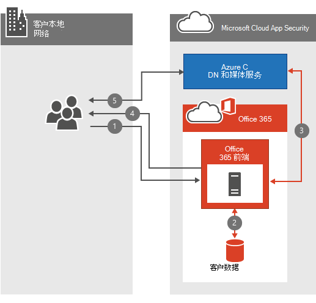

# Office 365 视频网络常见问题

Office 365 视频存储库和流服务使您的组织内的存储和流式处理视频更加简单。 [有关 Office 365 视频](https://support.office.com/article/Find-help-about-Office-365-Video-b435f99a-f47e-4ebd-a946-f5c965844f50)的很多重要信息，请参阅。此网络常见问题解答旨在回答有关带宽规划、加密和服务如何利用[内容传递网络](content-delivery-networks.md) (cdn) 的常见问题。
  
如果你还没有透彻地了解在上载或播放视频时所发生的情况，请查看我们将此视频放在一起的内容，将 [视频文件上载到 Office 365 视频时，会发生什么情况](https://www.youtube.com/watch?v=HXSZ0jYBKlM)。
  
## Office 365 的视频带宽要求是什么？

有很多可上载到 Office 365 的 [受支持的视频格式](https://support.office.com/article/dd1af01c-fd8e-4640-b17b-93ee02b9b817) 。 然后，将每个视频文件编码为具有几种不同的播放视频质量的标准格式。 Office 365 视频使用自适应比特率流式传输，以根据视频播放器的可用网络带宽和大小选择最佳视频播放质量。 为此，播放机会最初请求最低的播放质量。 然后，该服务开始向视频播放器发送2秒的视频分段。 然后，播放机可以根据每个段的交付速度请求更高或更低的播放质量。
  
自适应比特率数据流在后台执行所有这些工作，同时播放视频的中断或缓冲量最少。 在视频播放过程中，视频播放器允许查看器手动覆盖自动播放质量，以选择特定的视频播放质量。
  
下面是一个概述了每个视频播放质量的网络要求的快速表格。 播放视频所需的每个用户的最小带宽为802Kbps。
  
| 播放质量 | 网络速度 |
|:-----|:-----|
|288p    |802Kbps    |
|360p    |1.2 Mbps    |
|576p    |2.5 Mbps    |
|720p    |3.8 Mbps    |

 ([返回页首](office-365-video-networking-faq.md)) 
  
## 内容传递网络如何 (Cdn) 帮助视频播放？

如果同一地理位置中同一组织中的多个人员流 (s) 的同一视频，则 Cdn 将把这些视频的副本存储在距离该地理区域更近的位置。 将视频存储在最近的位置，或将其缓存在最近的位置，而不是将视频从距离最远的位置流式传输到其他位置。 Office 365 视频使用 Azure 媒体服务管理在 Azure Cdn 中缓存的内容，以及使用多长时间。 Azure 媒体服务可以使用任何 [AZURE CDN 位置](https://azure.microsoft.com/documentation/articles/cdn-pop-locations/) 将视频片段和清单缓存几天。 如果你组织中的人员继续观看缓存中将保留的缓存视频。 如果没有人在几天内访问视频，则视频最终将从缓存中删除。 下次有人尝试观看视频时，它会再次缓存在最近的 CDN 位置。
  
在内容被缓存在邻近的 CDN 中时，尝试观看视频的每个人都将从较近的热门 CDN 获益，在大多数情况下，远离跃点。 这将提高视频播放速度;但是，不会更改网络要求以播放视频。
  
> [!NOTE]
> 在某些情况下，例如我们达到容量限制，在三天内可能会删除视频。
  
 ([返回页首](office-365-video-networking-faq.md)) 
  
## 是否可以在本地缓存视频以加快播放速度？

是。 Office 365 不会阻止你使用本地 CDN 或缓存代理将视频或其他 Office 365 内容导入到本地网络，以加快访问速度。 在网络上实施本地缓存解决方案的方法有多种，最常见的方法是使用代理解决方案在本地缓存内容。 代理或专用 CDN 缓存了视频片段和清单后，通过代理或专用 CDN 路由的那些文件的未来请求将从本地缓存中提取，而不是从 internet 位置提取。 在规划解决方案的过程中，请考虑网络带宽、容量和视频播放并发性。
  
 ([返回页首](office-365-video-networking-faq.md)) 
  
## 如何加密和保护视频？

Office 365 视频了解保护数据安全和保密的重要程度。 [Microsoft 信任中心](https://products.office.com/business/office-365-trust-center-welcome) 介绍了我们对你的内容的隐私和安全承诺。 通过视频播放，速度对你的体验非常重要;但是，我们不会在 exchange 中降低您的安全或隐私速度。 下面介绍了我们如何实现速度、安全性和隐私。
  
当您或您的组织中的某个人上载新视频时，该视频将 transcoded，使用 AES-128 加密进行加密，并将其存储在 Azure 媒体服务中。 这意味着视频在传输和静止时都要加密。
  
当组织中的某个人尝试观看新视频时，请按照以下步骤操作：
  
1. 如果 SharePoint Online 具有查看视频的权限，请询问它。

2. SharePoint Online 使用文件权限确定人员能否观看视频。

3. 如果允许，SharePoint Online 将从 Azure 检索令牌以提供给视频播放器。

4. 然后，视频播放器使用令牌从 Azure 请求解密密钥。

5. 使用解密密钥，视频播放器能够流式传输视频。

  
 ([返回页首](office-365-video-networking-faq.md)) 
  
## 播放 Office 365 视频的要求是什么？

Office 365 视频支持的操作系统和 web 浏览器与 [office 365 系统要求](https://support.office.com/article/Office-365-system-requirements-719254c0-2671-4648-9c84-c6a3d4f3be45)中的 SharePoint Online 要求相同。 根据您拥有的操作系统和 web 浏览器配置，您将确定视频播放器的特定需求。 以下是有关 [视频播放要求](https://support.office.com/article/ca1cc1a9-a615-46e1-b6a3-40dbd99939a6)的详细信息。
  
 ([返回页首](office-365-video-networking-faq.md)) 
  
## 我无法使 Office 365 视频正常工作，我应该从哪里开始？

故障排除连接到 Office 365 视频涉及故障排除网络、ISP (s) 和您的 Office 365 的配置。 启动的第一个位置是服务运行状况仪表板。 这将告知你的 Office 365 视频出现问题。 如果一切看起来都非常棒，下面提供了一些帮助您的其他资源。
  
- 请确保您可以连接到 [Office 365 视频所需的网络终结点](https://support.office.com/article/Office-365-URLs-and-IP-address-ranges-8548a211-3fe7-47cb-abb1-355ea5aa88a2)。

- 使用我们的 [Office 365 网络故障排除指南](https://support.office.com/article/Office-365-performance-tuning-and-troubleshooting-Admin-and-IT-Pro-1492cb94-bd62-43e6-b8d0-2a61ed88ebae)检查网络连接。

- 请参阅我们 [在慢速网络上使用 Office 365 的最佳实践](https://support.office.com/article/Best-practices-for-using-Office-365-on-a-slow-network-fd16c8d2-4799-4c39-8fd7-045f06640166)。

- [查找有关 Office 365 视频配置的帮助](https://support.office.com/article/Find-help-about-Office-365-Video-b435f99a-f47e-4ebd-a946-f5c965844f50)。

 ([返回页首](office-365-video-networking-faq.md)) 
  
## Office 365 视频资源

下面的一些其他资源可帮助您成功部署和使用 Office 365 视频：
  
[查找有关 Office 365 视频配置的帮助](https://support.office.com/article/Find-help-about-Office-365-Video-b435f99a-f47e-4ebd-a946-f5c965844f50)
  
[“了解 Office 365”视频](https://support.office.com/article/Meet-Office-365-Video-ca1cc1a9-a615-46e1-b6a3-40dbd99939a6)
  
[在 Office 365 视频中创建和管理频道](https://support.office.com/article/Create-and-manage-a-channel-in-Office-365-Video-1fede4cc-13c0-435a-b585-e7fbf1c83bb2)
  
[管理 Office 365 视频门户](https://support.office.com/article/Manage-your-Office-365-Video-portal-c059465b-eba9-44e1-b8c7-8ff7793ff5da)
  
[在 Office 365 视频中工作的视频格式](https://support.office.com/article/Video-formats-that-work-in-Office-365-Video-dd1af01c-fd8e-4640-b17b-93ee02b9b817)
  
 ([返回页首](office-365-video-networking-faq.md)) 
  
以下是可以用于返回的简短链接：[https://aka.ms/video365networkfaq](https://aka.ms/video365networkfaq)
