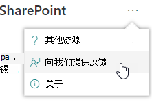
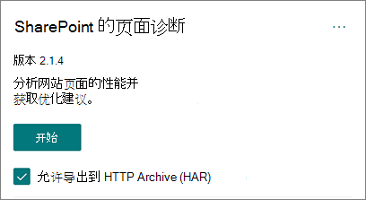
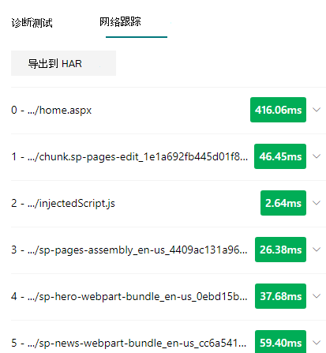
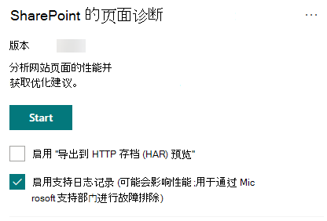

# 使用适用于用户的页面诊断SharePoint工具

本文介绍如何使用适用于 **SharePoint** 的页面诊断工具根据一组预定义的性能SharePoint分析 SharePoint Online 新式和经典网站页面。

可针对以下SharePoint页面诊断工具进行安装：

- **Microsoft Edge (**[边缘扩展)](https://microsoftedge.microsoft.com/addons/detail/ocemkolpnamjcacndljdfmhlpcaoipji)
- **Chrome** [ (Chrome 扩展)](https://chrome.google.com/webstore/detail/inahogkhlkbkjkkaleonemeijihmfagi)

>[!TIP]
>版本 **2.0.0** 及更高版本包括对新式页面以及经典网站页面的支持。 如果你不确定使用哪种版本的工具，可以选择关于链接或省略号 (...) 验证你的版本。 **使用该工具时，始终** 更新到最新版本。

适用于 SharePoint 的页面诊断工具是一款面向新 Microsoft Edge（https://www.microsoft.com/edge) 和 Chrome 浏览器）的浏览器扩展，可用于分析 SharePoint Online 新式门户和经典发布网站页面。 此工具仅适用于 SharePoint Online，不能用于 SharePoint 系统页面。

该工具将针对每个分析的页面生成一个报告，其中显示页面如何针对预定义的规则集执行，并显示测试的结果超出基线值时的详细信息。 SharePoint联机管理员和设计人员可以使用该工具解决性能问题，并确保新页面在发布之前已经过优化。

页面诊断工具旨在仅分析SharePoint，而不是分析系统页面（如 *allitems.aspx* 或 *sharepoint.aspx）。* 如果您尝试在系统页面或其他任何非网站页面上运行该工具，您将收到一条错误消息，提示无法针对该类型的页面运行该工具。

> [!div class="mx-imgBorder"]
> 

此工具没有错误，因为评估库或系统页面没有任何价值。 请导航到SharePoint网站页面以使用该工具。 如果此错误发生在SharePoint页上，请检查母版页以确保尚未删除SharePoint元标记。

若要提供有关工具的反馈，请选择工具右上角的省略号，然后选择"提供[反馈"。](https://go.microsoft.com/fwlink/?linkid=874109)

> [!div class="mx-imgBorder"]
> 
  
## 安装适用于 SharePoint 的页面诊断工具

本节中的安装过程适用于 Chrome 和 Microsoft Edge浏览器。

> [!IMPORTANT]
> Microsoft 不会读取页面诊断 for SharePoint 工具分析的数据或页面内容，并且我们不会捕获任何个人信息、网站或下载信息。 该工具记录到 Microsoft 的唯一可识别信息是租户名称、失败的规则计数以及工具运行的日期和时间。 Microsoft 使用此信息来更好地了解新式门户和发布网站使用趋势以及常见的性能问题。

1. 安装适用于 SharePoint Edge 扩展Microsoft Edge (Chrome ) [或](https://microsoftedge.microsoft.com/addons/detail/ocemkolpnamjcacndljdfmhlpcaoipji) **Chrome** ([部件](https://chrome.google.com/webstore/detail/inahogkhlkbkjkkaleonemeijihmfagi)版扩展) 。 请查看应用商店中的说明页面上提供的用户隐私策略。 将工具添加到浏览器时，你将看到以下权限通知。

    > [!div class="mx-imgBorder"]
    > 

    此通知就位是因为页面可能包含来自网站外部SharePoint，具体取决于页面上的 Web 部件和自定义项。 这意味着，当单击"开始"按钮时，该工具将读取请求和响应，并且仅适用于SharePoint运行该工具的活动"开始"选项卡。 此信息由 Web 浏览器本地捕获，并且可通过工具的"网络跟踪"选项卡中的"导出到 **JSON"** 或"导出到 **HAR"** 按钮 _提供给你。_ 此信息不会发送到 Microsoft 或由 **Microsoft** 捕获。  (该工具遵守可在此处访问的 Microsoft 隐私[策略) ](https://go.microsoft.com/fwlink/p/?linkid=857875)

    " _管理下载"_ 权限涵盖了工具的 **"导出到 JSON"功能的** 使用。 在组织外部共享 JSON 文件之前，请遵循贵公司的隐私准则，因为结果包含 URL，并且可将其分类为个人身份信息 (PII) 。
1. 如果要在 Incognito 或 InPrivate 模式下使用该工具，请按照浏览器的过程操作：
    1. In Microsoft Edge， navigate to **Extensions** or type _edge://extensions_ in the URL bar and select **Details** for the extension. 在扩展设置中，选中 **InPrivate 中的"允许"复选框**。
    1. 在 Chrome 中 **，导航到** "扩展"或 _chrome://extensions_ URL 栏中键入"详细信息"，然后选择 **扩展** 的详细信息。 在扩展设置中，选择允许 **Incognito 中的滑块**。
1. 导航到 SharePoint Online 上要SharePoint查看的"网站"页面。 我们已允许在页面上"延迟加载"项目;因此，该工具不会自动停止 (这是为适应所有页面加载方案) 。 若要停止集合，请选择"停止 **"。** 请确保在停止数据收集之前已完成页面加载，否则您将只捕获部分跟踪。
1. 单击扩展的工具栏按钮  加载该工具，你将被显示以下扩展弹出窗口：

    

选择 **"** 开始"以开始收集数据进行分析。

## 你将在页面诊断 for SharePoint 工具中看到的内容

1. 单击工具右上角 (...) 省略号以查找以下链接：
   1. " **其他资源** "链接提供有关工具的一般指南和详细信息，包括本文的链接。
   1. "**提供反馈**"链接提供指向"网站SharePoint _协作用户语音"_ 网站的链接。
   1. " **关于** "链接包括当前安装的工具版本和指向工具的第三方通知的直接链接。  
1. 相关 **ID、SPRequestDuration、SPIISLatency、****页面** 加载时间和 **URL** 详细信息是信息性的，可用于几个目的。

    > [!div class="mx-imgBorder"]
    > 

   - **CorrelationID** 是使用 Microsoft 支持时的重要元素，因为它允许他们收集特定页面的其他诊断数据。
   - **SPRequestDuration** 是用户SharePoint页面所花时间。 结构导航、大型图像和大量 API 调用都可能导致持续时间较长。
   - **SPIISLatency** 是联机加载页面SharePoint所花的时间（以毫秒为单位）。 此值不包括 Web 应用程序响应所花时间。
   - **页面加载** 时间是页面从请求时间到接收响应并呈现在浏览器中时记录的总时间。 此值受各种因素影响，包括网络延迟、计算机的性能以及浏览器加载页面所花的时间。
   - 统 **一** (定位器) Url 是当前页面的 Web 地址。

1. "[**诊断测试**](#how-to-use-the-diagnostic-tests-tab)"选项卡按三个类别显示分析结果;**无需任何操作**，**改进机会****和关注也是必需的**。 每个测试结果由这些类别中的某个项目表示，如下表所述：

    |类别  |颜色  |说明  |
    |---------|---------|---------|
    |**需要关注** |红色 |测试结果超出基线值，并且会影响页面性能。 按照修正指南操作。|
    |**改进机会** |黄色 |测试结果超出基线值，可能导致性能问题。 测试特定的条件可能适用。|
    |**不需要执行任何操作** |绿色 |测试结果在测试的基线值之内。|

    > [!div class="mx-imgBorder"]
    > 

1. " [**网络跟踪**](#how-to-use-the-network-trace-tab-and-how-to-export-a-har-file) "选项卡提供有关页面生成请求和响应的详细信息。

## 如何使用"诊断测试"选项卡

使用 SharePoint 页面诊断工具分析 SharePoint 新式门户页面或经典发布网站页面时，会使用预定义的规则分析结果，这些规则将结果与基线值进行比较，并显示在"诊断测试"选项卡中。某些测试的规则可能会对新式门户和经典发布网站使用不同的基线值，具体取决于这两者的特定性能特征如何不同。

显示在"改进机会"或"需要关注"类别中的测试结果指示了应针对建议做法进行审阅的区域，并且可以通过选择这些区域来显示有关结果的其他信息。 每个项目的详细信息包括" _了解详细信息_ "链接，该链接将引导你直接查看与测试相关的相应指导。 显示在"不需要操作 **"** 类别中的测试结果表示符合相关规则，并且选中后不显示其他详细信息。

"诊断测试"选项卡中的信息不会告诉您如何设计页面，但会突出显示可能会影响页面性能的因素。 某些页面功能和自定义项对页面性能具有无法避免的影响，如果它们的影响很大，应该从页面中查看可能的修正或遗漏。

红色或黄色结果也可能指示刷新数据的 Web 部件过于频繁。 例如，公司新闻不是每秒钟更新一次，但自定义 Web 部件通常构建为每秒获取一次最新新闻，而不是实现可改善整体用户体验的缓存元素。 请记住，在页面上包括 Web 部件时，通常有一些简单的方法可以评估每个可用参数的值来降低其性能影响，以确保为达到预期目的正确设置它。

>[!NOTE]
>未启用发布功能的经典团队网站无法使用 CDN。 在这些网站上运行该工具时，CDN测试应该会失败，可以忽略，但其余所有测试都适用。 发布功能的其他功能SharePoint增加页面加载时间，因此不应仅启用该功能以允许CDN功能。

>[!IMPORTANT]
>测试规则会定期添加和更新，因此请参考该工具的最新版本，了解有关当前规则和测试结果中包含的特定信息的详细信息。 可以通过管理扩展验证版本，扩展将告知更新是否可用。

## 如何使用"网络跟踪"选项卡以及如何导出 HAR 文件

"**网络跟踪**"选项卡提供有关生成页面的请求和从网站页面接收的响应SharePoint。

1. **查找标记为红色 的项目加载时间**。 每个请求和响应都经过颜色编码，以使用下列延迟指标指示对整体页面性能的影响：
    - 绿色 \< ：500 毫秒
    - 黄色：500-1000ms
    - 红色 \> ：1000 毫秒

    > [!div class="mx-imgBorder"]
    > 

    在以上图像中，红色项目与默认页面相关。 除非页面在 1000 毫秒内加载， (少于 \< 1 秒，否则) 。

2. **测试项目加载时间**。 在某些情况下，没有时间或颜色指示器，因为项目已被浏览器缓存。 若要正确测试这一点，请打开页面，清除浏览器缓存，然后单击"开始"，因为这会强制加载"冷"页面，并真正反映初始页面加载。 然后，这应该与"温"页面负载进行比较，因为这也将有助于确定正在页面上缓存哪些项目。

3. **与可以帮助调查问题的其他人共享相关详细信息**。 若要与开发人员或技术支持人员共享此工具中提供的详细信息或信息，建议使用"允许导出到 HTTP 存档 (**HAR**) "是推荐的方法。 

   > [!div class="mx-imgBorder"]
   > 

这应在单击"开始"之前启用，这将在浏览器中启用调试模式。 它将在 HAR (HTTP 存档) ，然后可以通过"网络跟踪"选项卡访问该文件。单击"导出到 HAR"，它会将文件下载到计算机，然后你可以进行相应的共享。 该文件可以在各种调试工具（如 F12 开发人员工具和 Fiddler）中打开。

> [!div class="mx-imgBorder"]
> 

> [!IMPORTANT]
> 这些结果包含 URL，可将其分类为个人身份 (个人身份信息的 PII) 。 在分发该信息之前，请务必遵循组织的准则。

## 与 Microsoft 支持人员合作

我们包含了 **Microsoft 支持级别** 功能，该功能仅在直接处理支持案例时使用。 在没有支持团队参与的情况下使用此功能不会带来任何好处，并且会使页面执行速度明显变慢。 当在工具中使用此功能时，无需其他信息，因为其他信息会添加到服务中的日志记录中。

没有变化是可见的，只是通知你已启用它，并且页面性能将显著降低 2-3 倍于启用性能。 它仅与特定页面和该活动会话相关。 因此，应谨慎使用，且仅在积极提供支持时使用。

### 启用 Microsoft 支持级别功能

1. 打开页面诊断SharePoint工具。
2. 在键盘上，按 **Alt-Shift-L。** 这将显示" **启用支持日志记录"** 复选框。
3. 选中该复选框，然后单击 **"开始"** 以重新加载页面并生成详细日志记录。

   > [!div class="mx-imgBorder"]
   > 
  
    你应该注意显示在工具 (顶部的 CorrelationID) 并将其提供给你的支持代表，以便他们能够收集有关诊断会话的其他信息。

## 相关主题

[优化 SharePoint Online 性能](tune-sharepoint-online-performance.md)

[优化 Office 365 性能](tune-microsoft-365-performance.md)

[新式 SharePoint 体验中的性能](/sharepoint/modern-experience-performance)

[内容分发网络](content-delivery-networks.md)

[结合使用 Office 365 内容分发网络和 SharePoint Online](use-microsoft-365-cdn-with-spo.md)