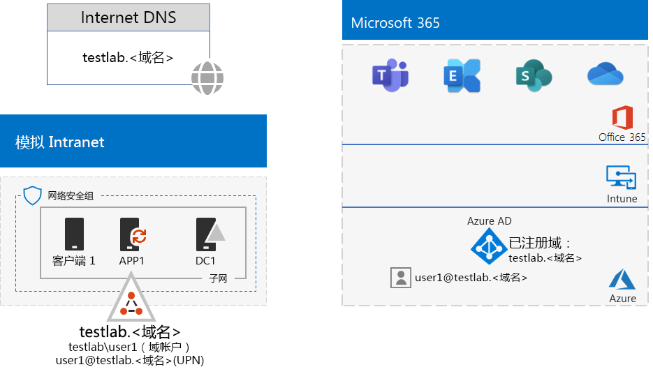
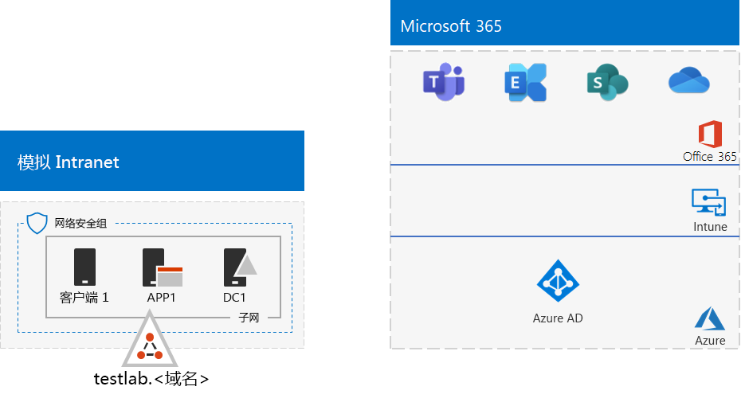
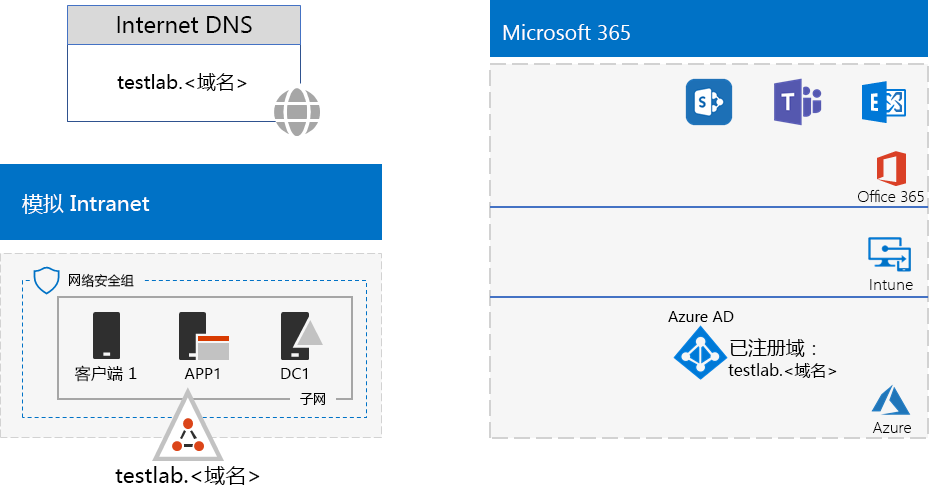

# <a name="password-hash-synchronization-for-your-microsoft-365-test-environment"></a><span data-ttu-id="131b9-103">Microsoft 365 测试环境的密码哈希同步</span><span class="sxs-lookup"><span data-stu-id="131b9-103">Password hash synchronization for your Microsoft 365 test environment</span></span>

<span data-ttu-id="131b9-104">许多组织使用 Azure AD Connect 和密码哈希同步来同步他们内部部署的 Active Directory 域服务 (AD DS) 林账户集与 Office 365 和 EMS E5 订阅的 Azure AD 租户账户集。</span><span class="sxs-lookup"><span data-stu-id="131b9-104">Many organizations use Azure AD Connect and password hash synchronization to synchronize the set of accounts in their on-premises Windows Server Active Directory (AD) forest to the set of accounts in the Azure AD tenant of their Office 365 and EMS E5 subscriptions. This article describes how you can add password hash synchronization to your Microsoft 365 test environment, resulting in the following configuration:</span></span> <span data-ttu-id="131b9-105">本文介绍了如何添加密码哈希同步至 Microsoft 365 测试环境，从而生成以下配置：</span><span class="sxs-lookup"><span data-stu-id="131b9-105">This article describes how you can add DirSync with password synchronization to the Office 365 dev/test environment, resulting in the following configuration.</span></span>
  

  
<span data-ttu-id="131b9-107">此测试环境的设置分为以下两个阶段：</span><span class="sxs-lookup"><span data-stu-id="131b9-107">There are two phases to setting up this test environment:</span></span>
  
1. <span data-ttu-id="131b9-108">创建 Microsoft 365 模拟企业测试环境。</span><span class="sxs-lookup"><span data-stu-id="131b9-108">Create the Microsoft 365 simulated enterprise test environment.</span></span>
2. <span data-ttu-id="131b9-109">在 APP1 上安装和配置 Azure AD Connect。</span><span class="sxs-lookup"><span data-stu-id="131b9-109">Install and configure Azure AD Connect on APP1.</span></span>
    
> [!TIP]
> <span data-ttu-id="131b9-110">单击[此处](https://aka.ms/m365etlgstack)，即可获得 Microsoft 365 企业版测试实验室指南堆栈中所有文章的直观目录图。</span><span class="sxs-lookup"><span data-stu-id="131b9-110">Click [here](https://aka.ms/m365etlgstack) for a visual map to all the articles in the Microsoft 365 Enterprise Test Lab Guide stack.</span></span>
  
## <a name="phase-1-create-the-microsoft-365-simulated-enterprise-test-environment"></a><span data-ttu-id="131b9-111">第 1 阶段：创建 Microsoft 365 模拟企业测试环境</span><span class="sxs-lookup"><span data-stu-id="131b9-111">Phase 1: Create the Microsoft 365 simulated enterprise test environment</span></span>

<span data-ttu-id="131b9-p102">请按照[适用于 Microsoft 365 的模拟企业基础配置](simulated-ent-base-configuration-microsoft-365-enterprise.md)中的说明操作。生成的配置如下。</span><span class="sxs-lookup"><span data-stu-id="131b9-p102">Follow the instructions in [simulated enterprise base configuration for Microsoft 365](simulated-ent-base-configuration-microsoft-365-enterprise.md). Here is your resulting configuration.</span></span>
  

  
<span data-ttu-id="131b9-115">此配置包括：</span><span class="sxs-lookup"><span data-stu-id="131b9-115">This configuration consists of:</span></span> 
  
- <span data-ttu-id="131b9-116">Office 365 E5 和 EMS E5 试用订阅或付费订阅。</span><span class="sxs-lookup"><span data-stu-id="131b9-116">Office 365 E5 and EMS E5 trial or paid subscriptions.</span></span>
- <span data-ttu-id="131b9-117">连接到 Internet 的简化的组织 Intranet，包含 Azure 虚拟网络中的 DC1、APP1 和 CLIENT1 虚拟机。</span><span class="sxs-lookup"><span data-stu-id="131b9-117">A simplified organization intranet connected to the Internet, consisting of the DC1, APP1, and CLIENT1 virtual machines on a subnet of an Azure virtual network.</span></span> <span data-ttu-id="131b9-118">DC1 是 testlab 的域控制器。\<你的公共域名 > Active Directory 域服务 (AD DS) 域。</span><span class="sxs-lookup"><span data-stu-id="131b9-118">DC1 is a domain controller for the testlab.\<your public domain name> Active Directory Domain Services (AD DS) domain.</span></span>

## <a name="phase-2-create-and-register-the-testlab-domain"></a><span data-ttu-id="131b9-119">第 2 阶段：创建和注册 testlab 域</span><span class="sxs-lookup"><span data-stu-id="131b9-119">Phase 2: Create and register the testlab domain</span></span>

<span data-ttu-id="131b9-120">在这一阶段，将公共 DNS 域添加到订阅中。</span><span class="sxs-lookup"><span data-stu-id="131b9-120">In this phase you add a public DNS domain and add it to your subscription.</span></span>

<span data-ttu-id="131b9-p104">首先，使用公共 DNS 注册提供程序，根据当前域名新建一个公共 DNS 域名，并将它添加到 Office 365 订阅中。建议命名为 **testlab.**\<公共域名>。例如，如果公共域名是 <span>**contoso</span>.com**，请添加公共域名 **<span>testlab</span>.contoso.com**。</span><span class="sxs-lookup"><span data-stu-id="131b9-p104">First, work with your public DNS registration provider to create a new public DNS domain name based on your current domain name and add it to your Office 365 subscription. We recommend using the name **testlab.**\<your public domain>. For example, if your public domain name is <span>**contoso</span>.com**, add the public domain name **<span>testlab</span>.contoso.com**.</span></span>
  
<span data-ttu-id="131b9-124">接下来，通过域注册过程添加**testlab.**\<公共域 > 域到 Office 365 试用版或付费订阅。</span><span class="sxs-lookup"><span data-stu-id="131b9-124">Next, you add the **testlab.**\<your public domain> domain to your Office 365 trial or permanent subscription by going through the domain registration process. This consists of adding additional DNS records to the testlab.your public domain> domain. For more information, see Add users and domain to Office 365.</span></span> <span data-ttu-id="131b9-125">这包括添加其他 DNS 记录到**testlab.**\<公共域 > 域。</span><span class="sxs-lookup"><span data-stu-id="131b9-125">This consists of adding additional DNS records to the **testlab.**\<your public domain> domain.</span></span> <span data-ttu-id="131b9-126">有关详细信息，请参阅[添加用户和域到 Office 365](https://support.office.com/article/Add-users-and-domain-to-Office-365-6383f56d-3d09-4dcb-9b41-b5f5a5efd611)。</span><span class="sxs-lookup"><span data-stu-id="131b9-126">To learn more, see [Add users and domain to Office 365](https://support.office.com/article/Add-users-and-domain-to-Office-365-6383f56d-3d09-4dcb-9b41-b5f5a5efd611).</span></span> 

<span data-ttu-id="131b9-127">下面是生成的配置。</span><span class="sxs-lookup"><span data-stu-id="131b9-127">Here is your resulting configuration.</span></span>
  

  
<span data-ttu-id="131b9-129">此配置包括：</span><span class="sxs-lookup"><span data-stu-id="131b9-129">This configuration consists of:</span></span>

- <span data-ttu-id="131b9-130">包含已注册 DNS 域 testlab.\<你的公共域名> 的 Office 365 E5 和 EMS E5 试用订阅或付费订阅。</span><span class="sxs-lookup"><span data-stu-id="131b9-130">Office 365 E5 and EMS E5 trial or permanent subscriptions with the DNS domain testlab.\<your public domain name> registered.</span></span>
- <span data-ttu-id="131b9-131">连接到 Internet 的简化的组织 Intranet，包含 Azure 虚拟网络子网中的 DC1、APP1 和 CLIENT1 虚拟机。</span><span class="sxs-lookup"><span data-stu-id="131b9-131">A simplified organization intranet connected to the Internet, consisting of the DC1, APP1, and CLIENT1 virtual machines on a subnet of an Azure virtual network.</span></span>

<span data-ttu-id="131b9-132">请注意，现在 testlab.\<你的公共域名>：</span><span class="sxs-lookup"><span data-stu-id="131b9-132">Notice how the testlab.\<your public domain name> is now:</span></span>

- <span data-ttu-id="131b9-133">受公共 DNS 记录支持。</span><span class="sxs-lookup"><span data-stu-id="131b9-133">Supported by public DNS records.</span></span>
- <span data-ttu-id="131b9-134">在 Office 365 和 EMS 订阅中进行了注册。</span><span class="sxs-lookup"><span data-stu-id="131b9-134">Registered in your Office 365 and EMS subscriptions.</span></span>
- <span data-ttu-id="131b9-135">是模拟 Intranet 上的 AD DS 域。</span><span class="sxs-lookup"><span data-stu-id="131b9-135">The Windows Server AD domain on your simulated intranet.</span></span>
     
## <a name="phase-3-install-azure-ad-connect-on-app1"></a><span data-ttu-id="131b9-136">第 3 阶段：在 APP1 上安装 Azure AD Connect</span><span class="sxs-lookup"><span data-stu-id="131b9-136">Phase 3: Install Azure AD Connect on APP1</span></span>

<span data-ttu-id="131b9-137">在这一阶段，在 APP1 上安装和配置 Azure AD Connect 工具，并验证它能否正常工作。</span><span class="sxs-lookup"><span data-stu-id="131b9-137">In this phase, you install and configure the Azure AD Connect tool on APP1, and then verify that it works.</span></span>
  
<span data-ttu-id="131b9-138">首先，在 APP1 上安装和配置 Azure AD Connect。</span><span class="sxs-lookup"><span data-stu-id="131b9-138">First, you install and configure Azure AD Connect on APP1.</span></span>

1. <span data-ttu-id="131b9-139">在 [Azure 门户](https://portal.azure.com)中，使用全局管理员帐户进行登录，再使用 TESTLAB\\User1 帐户连接到 APP1。</span><span class="sxs-lookup"><span data-stu-id="131b9-139">From the [Azure portal](https://portal.azure.com), sign in with your global administrator account, and then connect to APP1 with the TESTLAB\\User1 account.</span></span>
    
2. <span data-ttu-id="131b9-140">在 APP1 的桌面中，打开管理员级 Windows PowerShell 命令提示符，然后运行下面这些命令：</span><span class="sxs-lookup"><span data-stu-id="131b9-140">From the desktop of APP1, open an administrator-level Windows PowerShell command prompt, and then run these commands:</span></span>
    
   ```
   Set-ItemProperty -Path "HKLM:\SOFTWARE\Microsoft\Active Setup\Installed Components\{A509B1A7-37EF-4b3f-8CFC-4F3A74704073}" -Name "IsInstalled" -Value 0
   Set-ItemProperty -Path "HKLM:\SOFTWARE\Microsoft\Active Setup\Installed Components\{A509B1A8-37EF-4b3f-8CFC-4F3A74704073}" -Name "IsInstalled" -Value 0
   Stop-Process -Name Explorer -Force
   ```

3. <span data-ttu-id="131b9-141">从任务栏中单击 **Internet Explorer**，然后转到 [https://aka.ms/aadconnect](https://aka.ms/aadconnect)。</span><span class="sxs-lookup"><span data-stu-id="131b9-141">From the task bar, click **Internet Explorer** and go to [https://aka.ms/aadconnect](https://aka.ms/aadconnect).</span></span>
    
4. <span data-ttu-id="131b9-142">在“Microsoft Azure Active Directory Connect”页上，单击“下载”\*\*\*\*，然后单击“运行”\*\*\*\*。</span><span class="sxs-lookup"><span data-stu-id="131b9-142">On the Microsoft Azure Active Directory Connect page, click **Download**, and then click **Run**.</span></span>
    
5. <span data-ttu-id="131b9-143">在“欢迎使用 Azure AD Connect”\*\*\*\* 页上，单击“我同意”\*\*\*\*，然后单击“继续”\*\*\*\*。</span><span class="sxs-lookup"><span data-stu-id="131b9-143">On the **Welcome to Azure AD Connect** page, click **I agree**, and then click **Continue**.</span></span>
    
6. <span data-ttu-id="131b9-144">在“快速设置”\*\*\*\* 页上，单击“使用快速设置”\*\*\*\*。</span><span class="sxs-lookup"><span data-stu-id="131b9-144">On the **Express Settings** page, click **Use express settings**.</span></span>
    
7. <span data-ttu-id="131b9-145">在“连接到 Azure AD”\*\*\*\* 页上，在“用户名”\*\*\*\* 中键入 Office 365 全局管理员帐户名，在“密码”\*\*\*\* 中键入密码，再单击“下一步”\*\*\*\*。</span><span class="sxs-lookup"><span data-stu-id="131b9-145">On the **Connect to Azure AD** page, type your Office 365 global administrator account name in **Username,** type its password in **Password**, and then click **Next**.</span></span>
    
8. <span data-ttu-id="131b9-146">在“连接到 AD DS”\*\*\*\* 页上，在“用户名”\*\*\*\* 中键入“TESTLAB\\User1”\*\*\*\*，在“密码”\*\*\*\* 中键入密码，再单击“下一步”\*\*\*\*。</span><span class="sxs-lookup"><span data-stu-id="131b9-146">On the **Connect to AD DS** page, type **TESTLAB\\User1** in **Username,** type its password in **Password**, and then click **Next**.</span></span>
    
9. <span data-ttu-id="131b9-147">单击“配置就绪”\*\*\*\* 页上的“安装”\*\*\*\*。</span><span class="sxs-lookup"><span data-stu-id="131b9-147">On the **Ready to configure** page, click **Install**.</span></span>
    
10. <span data-ttu-id="131b9-148">在“配置完成”\*\*\*\* 页上，单击“退出”\*\*\*\*。</span><span class="sxs-lookup"><span data-stu-id="131b9-148">On the **Configuration complete** page, click **Exit**.</span></span>
    
11. <span data-ttu-id="131b9-149">在 Internet Explorer 中，转到“Office 门户”([https://office.com](https://office.com))。</span><span class="sxs-lookup"><span data-stu-id="131b9-149">In Internet Explorer, go to the Office 365 portal ([https://office.com](https://office.com)).</span></span>
    
12. <span data-ttu-id="131b9-150">在主门户页上，单击“管理员”\*\*\*\*。</span><span class="sxs-lookup"><span data-stu-id="131b9-150">From the main portal page, click **Admin**.</span></span>
    
13. <span data-ttu-id="131b9-151">在左侧导航窗格中，单击“**用户 > 活动用户**”。</span><span class="sxs-lookup"><span data-stu-id="131b9-151">In the left navigation, click **Users > Active users**.</span></span>
    
    <span data-ttu-id="131b9-152">请注意，该帐户名为**用户 1**。</span><span class="sxs-lookup"><span data-stu-id="131b9-152">Note the account named **User1**.</span></span> <span data-ttu-id="131b9-153">此帐户来自 TESTLAB AD DS 域，证明目录同步已正常工作。</span><span class="sxs-lookup"><span data-stu-id="131b9-153">Note the account named User1. This account is from the CORP AD DS domain and is proof that directory synchronization has worked.</span></span>
    
14. <span data-ttu-id="131b9-p107">单击 **User1** 帐户。对于产品许可证，请单击“编辑”\*\*\*\*。</span><span class="sxs-lookup"><span data-stu-id="131b9-p107">Click the **User1** account. For product licenses, click **Edit**.</span></span>
    
15. <span data-ttu-id="131b9-p108">在“产品许可证”\*\*\*\* 中，选择所在的国家/地区，再单击“Office 365 企业版 E5”\*\*\*\* 的“关”\*\*\*\* 控件（将它切换为“开”\*\*\*\*）。对“企业移动性 + 安全性 E5”\*\*\*\* 许可证执行相同的操作。</span><span class="sxs-lookup"><span data-stu-id="131b9-p108">In **Product licenses**, select your scountry, and then click the **Off** control for **Office 365 Enterprise E5** (switching it to **On**). Do the same for the **Enterprise Mobility + Security E5** license.</span></span> 

16. <span data-ttu-id="131b9-158">依次单击页面底部的“**保存**”和“**关闭**”。</span><span class="sxs-lookup"><span data-stu-id="131b9-158">Click **Save** at the bottom of the page, and then click **Close**.</span></span>
    
<span data-ttu-id="131b9-159">接下来，使用 User1 帐户的用户名“<strong>user1@testlab.</strong>\<域名>”，测试能否登录 Office 365 订阅。</span><span class="sxs-lookup"><span data-stu-id="131b9-159">Next, you test the ability to sign in to your Office 365 subscription with the <strong>user1@testlab.</strong>\<your domain name> user name of the User1 account.</span></span>

1. <span data-ttu-id="131b9-160">在 APP1 中，注销 Office 365，再重新登录，这次指定不同的帐户。</span><span class="sxs-lookup"><span data-stu-id="131b9-160">From APP1, sign out of Office 365, and then sign in again, this time specifying a different account.</span></span>

2. <span data-ttu-id="131b9-p109">当系统提示输入用户名和密码时，指定 <strong>user1@testlab.</strong>\<你的公共域名> 和 User1 密码。应该能以 User1 身份成功登录。</span><span class="sxs-lookup"><span data-stu-id="131b9-p109">When prompted for a user name and password, specify <strong>user1@testlab.</strong>\<your domain name> and the User1 password. You should successfully sign in as User1.</span></span> 
 
<span data-ttu-id="131b9-163">请注意，虽然 User1 具有 TESTLAB AD DS 域的域管理员权限，但它不是 Office 365 全局管理员。</span><span class="sxs-lookup"><span data-stu-id="131b9-163">Notice that although User1 has domain administrator permissions for the TESTLAB Windows Server AD domain, it is not an Office 365 global administrator. Therefore, you will not see the Admin icon as an option.</span></span> <span data-ttu-id="131b9-164">因此，不会看到作为一个选项的**管理员**图标。</span><span class="sxs-lookup"><span data-stu-id="131b9-164">Therefore, you will not see the **Admin** icon as an option.</span></span> 

<span data-ttu-id="131b9-165">下面是生成的配置。</span><span class="sxs-lookup"><span data-stu-id="131b9-165">Here is your resulting configuration.</span></span>


<span data-ttu-id="131b9-167">此配置包括：</span><span class="sxs-lookup"><span data-stu-id="131b9-167">This configuration consists of:</span></span> 
  
- <span data-ttu-id="131b9-168">包含已注册 DNS 域 TESTLAB.\<域名> 的 Office 365 E5 和 EMS E5 试用订阅或付费订阅。</span><span class="sxs-lookup"><span data-stu-id="131b9-168">Office 365 E5 and EMS E5 trial or paid subscriptions with the DNS domain TESTLAB.\<your domain name> registered.</span></span>
- <span data-ttu-id="131b9-169">连接到 Internet 的简化的组织 Intranet，包含 Azure 虚拟网络子网中的 DC1、APP1 和 CLIENT1 虚拟机。</span><span class="sxs-lookup"><span data-stu-id="131b9-169">A simplified organization intranet connected to the Internet, consisting of the DC1, APP1, and CLIENT1 virtual machines on a subnet of an Azure virtual network.</span></span> <span data-ttu-id="131b9-170">在 APP1 上运行的 Azure AD Connect，用于将 TESTLAB AD DS 域周期性同步到 Office 365 和 EMS E5 订阅的 Azure AD 租户。</span><span class="sxs-lookup"><span data-stu-id="131b9-170">Azure AD Connect runs on APP1 to synchronize the TESTLAB AD DS domain to the Azure AD tenant of your Office 365 and EMS E5 subscriptions.</span></span>
- <span data-ttu-id="131b9-171">TESTLAB  AD DS 域中的 User1 帐户已与 Azure AD 租户同步。</span><span class="sxs-lookup"><span data-stu-id="131b9-171">The User1 account in the TESTLAB  Windows Server AD domain has been synchronized with the Azure AD tenant.</span></span>

## <a name="next-step"></a><span data-ttu-id="131b9-172">后续步骤</span><span class="sxs-lookup"><span data-stu-id="131b9-172">Next step</span></span>

<span data-ttu-id="131b9-173">在测试环境中探索其他[标识](m365-enterprise-test-lab-guides.md#identity)特性和功能。</span><span class="sxs-lookup"><span data-stu-id="131b9-173">Explore additional [identity](m365-enterprise-test-lab-guides.md#identity) features and capabilities in your test environment.</span></span>

## <a name="see-also"></a><span data-ttu-id="131b9-174">另请参阅</span><span class="sxs-lookup"><span data-stu-id="131b9-174">See also</span></span>

[<span data-ttu-id="131b9-175">Microsoft 365 企业版测试实验室指南</span><span class="sxs-lookup"><span data-stu-id="131b9-175">Microsoft 365 Enterprise Test Lab Guides</span></span>](m365-enterprise-test-lab-guides.md)

[<span data-ttu-id="131b9-176">部署 Microsoft 365 企业版</span><span class="sxs-lookup"><span data-stu-id="131b9-176">Deploy Microsoft 365 Enterprise</span></span>](deploy-microsoft-365-enterprise.md)

[<span data-ttu-id="131b9-177">Microsoft 365 企业版文档</span><span class="sxs-lookup"><span data-stu-id="131b9-177">Microsoft 365 Enterprise documentation</span></span>](https://docs.microsoft.com/microsoft-365-enterprise/)


