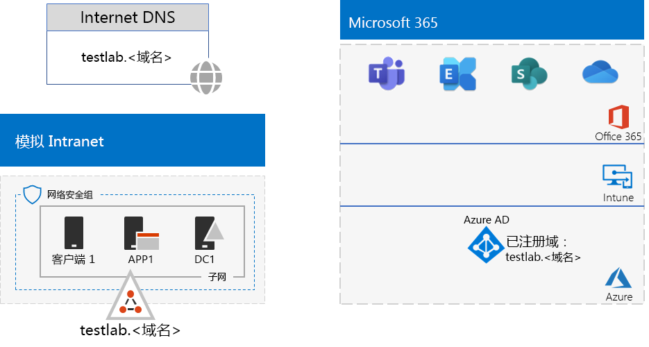

# <a name="password-hash-synchronization-for-your-microsoft-365-test-environment"></a>Microsoft 365 测试环境的密码哈希同步

*本测试实验室指南可用于企业Microsoft 365和Office 365 企业版环境。*

许多组织使用 Azure AD Connect 和密码哈希同步来同步他们内部部署的 Active Directory 域服务 (AD DS) 林帐户集与 Microsoft 365 订阅的 Azure AD 租户帐户集。 

本文介绍如何将密码哈希同步添加到Microsoft 365测试环境，这将生成此配置：
  

  
设置此测试环境包括三个阶段：
- [第 1 阶段：创建 Microsoft 365 模拟企业测试环境](#phase-1-create-the-microsoft-365-simulated-enterprise-test-environment)
- [第 2 阶段：创建和注册 testlab 域](#phase-2-create-and-register-the-testlab-domain)
- [第 3 阶段：在 APP1 上安装 Azure AD Connect](#phase-3-install-azure-ad-connect-on-app1)
    
> [!TIP]
> 有关企业测试实验室指南堆栈中Microsoft 365文章的直观映射，请转到 Microsoft 365 [for enterprise Test Lab Guide Stack](../downloads/Microsoft365EnterpriseTLGStack.pdf)。
  
## <a name="phase-1-create-the-microsoft-365-simulated-enterprise-test-environment"></a>第 1 阶段：创建 Microsoft 365 模拟企业测试环境

按照模拟企业[基础配置中的说明进行操作Microsoft 365。](simulated-ent-base-configuration-microsoft-365-enterprise.md) 生成的配置如下所示：
  

  
此配置包括：
  
- Microsoft 365 E5 试用版或付费版订阅。
- 连接到 Internet 的简化的组织 Intranet，由 Azure 虚拟网络中的 DC1、APP1 和 CLIENT1 虚拟机组成。 DC1 是 testlab.<AD DS域中>域控制器。

## <a name="phase-2-create-and-register-the-testlab-domain"></a>第 2 阶段：创建和注册 testlab 域

在此阶段，添加公共 DNS 域，然后将其添加到订阅。

首先，与公共 DNS 注册提供商合作，创建一个基于当前域名的新公共 DNS 域名，然后将其添加到订阅中。 我们建议使用名称 **testlab.<*公共域* >**。 例如，如果公共域名是 **<span>contoso</span>.com，** 请添加公共域名 **<span>：testlab</span>.contoso.com**。
  
接下来，通过<注册过程，将你的公共域Microsoft 365 **testlab.Microsoft 365 >** 或付费订阅。 这包括向公共域的 **testlab.<*添加其他* >** DNS 记录。 有关详细信息，请参阅将[域添加到Microsoft 365。](../admin/setup/add-domain.md)

生成的配置如下所示：
  

  
此配置包括：

- 已Microsoft 365 E5域名为 dns 域 testlab.<试用或付费>订阅。 
- 连接到 Internet 的简化的组织 Intranet，由 Azure 虚拟网络子网中的 DC1、APP1 和 CLIENT1 虚拟机组成。

请注意您的公共域名<*testlab.>* 现在如何：

- 受公共 DNS 记录支持。
- 已在 Microsoft 365 订阅中注册。
- 是模拟 Intranet 上的 AD DS 域。
     
## <a name="phase-3-install-azure-ad-connect-on-app1"></a>第 3 阶段：在 APP1 上安装 Azure AD Connect

在此阶段，在 APP1 上安装和配置 Azure AD 连接工具，然后验证它是否正常工作。
  
首先，在 APP1 上安装和连接 Azure AD 应用程序。

1. 在 [Azure 门户](https://portal.azure.com)中，使用全局管理员帐户进行登录，再使用 TESTLAB\\User1 帐户连接到 APP1。
    
2. 在 APP1 的桌面中，打开管理员级 Windows PowerShell 命令提示符，然后运行下面这些命令来禁用 Internet Explorer 增强安全：
    
   ```powershell
   Set-ItemProperty -Path "HKLM:\SOFTWARE\Microsoft\Active Setup\Installed Components\{A509B1A7-37EF-4b3f-8CFC-4F3A74704073}" -Name "IsInstalled" -Value 0
   Set-ItemProperty -Path "HKLM:\SOFTWARE\Microsoft\Active Setup\Installed Components\{A509B1A8-37EF-4b3f-8CFC-4F3A74704073}" -Name "IsInstalled" -Value 0
   Stop-Process -Name Explorer -Force
   ```

3. 从任务栏中选择 **"Internet Explorer"，** 然后转到 [https://aka.ms/aadconnect](https://aka.ms/aadconnect) 。
    
4. 在"Microsoft Azure Active Directory 连接"页上，选择 **"下载"，** 然后选择"运行 **"。**
    
5. 在"**欢迎使用 Azure AD 连接** 页面上，**选择"我同意"，** 然后选择"继续 **"。**
    
6. 在 Express **设置** 页面上，选择 **"使用快速设置"。**
    
7. 在 **"连接 Azure AD"** 页上，在"用户名"中输入全局管理员帐户名称，在"密码"中输入其密码，然后选择"下一 **步"。**
    
8. 在 **"连接 AD DS"** 页上，在"用户名"中输入 **TESTLAB \\ User1，** 在"密码"中输入其密码，然后选择"下一 **步"。**
    
9. 在"**准备配置"页上，** 选择"安装 **"。**
    
10. 在"**配置完成"页上**，选择"退出 **"。**
    
11. 在 Internet Explorer 中，转到 Microsoft 365 管理中心 ([https://portal.microsoft.com](https://portal.microsoft.com))。
    
12. 在左侧导航窗格中，选择"活动 **>用户"。**
    
    请注意，该帐户名为 **用户 1**。 此帐户来自 TESTLAB AD DS 域，证明目录同步已正常工作。
    
13. 选择 **User1 帐户**，然后选择"**许可证和应用"。**
    
14. 在 **"产品许可证**"中，根据需要选择 (位置) 禁用Office 365 E5许可证，然后启用 **Microsoft 365 E5许可证。**  

15. 选择 **页面** 底部的"保存"，然后选择"关闭 **"。**
    
接下来，测试能否使用 **user1@testlab.< >** User1 帐户的域名用户名登录订阅：

1. 在 APP1 中，注销，再重新登录，这次指定不同的帐户。

2. 当系统提示输入用户名和密码时 **，user1@testlab.<*您的域名* >** 和 User1 密码。 你应该能以 User1 身份成功登录。
 
请注意，虽然 User1 具有 TESTLAB AD DS 域的域管理员权限，但它不是全局管理员。 因此，不会看到作为一个选项的 **管理员** 图标。 

生成的配置如下所示：


此配置包括： 
  
- Microsoft 365 E5注册Office 365 E5 DNS 域 TESTLAB.<试用或付费>订阅。 
- 连接到 Internet 的简化的组织 Intranet，由 Azure 虚拟网络子网中的 DC1、APP1 和 CLIENT1 虚拟机组成。 Azure AD 连接 APP1 上运行，以定期将 TESTLAB AD DS 域同步到你的订阅的 Azure AD Microsoft 365租户。
- TESTLAB  AD DS 域中的 User1 帐户已与 Azure AD 租户同步。

## <a name="next-step"></a>后续步骤

在测试环境中探索其他[标识](m365-enterprise-test-lab-guides.md#identity)特性和功能。

## <a name="see-also"></a>另请参阅

[Microsoft 365 企业版测试实验室指南](m365-enterprise-test-lab-guides.md)

[Microsoft 365 企业版概述](microsoft-365-overview.md)

[适用于企业的 Microsoft 365 文档](/microsoft-365-enterprise/)