# <a name="performance-troubleshooting-plan-for-office-365"></a>Office 365 的性能疑难解答计划

您是否需要知道为识别和修复 SharePoint Online、OneDrive for Business、Exchange Online 或 Skype for Business Online 和客户端计算机之间的延迟、挂起和缓慢性能而要执行的步骤？ 在致电支持人员之前，本文可以帮助您Office 365性能问题，甚至解决一些最常见的问题。

本文实际上是一个示例行动计划，可用于捕获有关性能问题的有价值的数据。 本文中还包括一些首要问题。

如果你对网络性能没有了解，并且想要制定长期计划来监视客户端计算机和 Office 365 之间的性能，请看一下[Office 365 性能](performance-tuning-using-baselines-and-history.md)调整和疑难解答 - 管理员和 IT Pro。

## <a name="sample-performance-troubleshooting-action-plan"></a>性能疑难解答操作计划示例

此行动计划包含两个部分;准备阶段和日志记录阶段。 如果当前存在性能问题，并且需要执行数据收集，可以立即开始使用此计划。

### <a name="prepare-the-client-computer"></a>准备客户端计算机

- 查找可重现性能问题的客户端计算机。 此计算机将在疑难解答过程中使用。
- 记下导致出现性能问题的步骤，以便准备好进行测试。
- 安装用于收集和记录信息的工具：
  - 安装 [Netmon 3.4](https://www.microsoft.com/download/details.aspx?id=4865) (或使用等效的网络跟踪工具) 。
  - 安装免费的 BASIC Edition [HTTPWatch](https://www.httpwatch.com/download/) (或使用等效的网络跟踪工具) 。
  - 使用屏幕录制器或运行 (PSR.exe) Vista Windows更高版本随附的步骤录制器，以便记录测试过程中所执行的步骤。

### <a name="log-the-performance-issue"></a>记录性能问题

- 关闭所有多余的 Internet 浏览器。
- 启动步骤录制器或其他屏幕录制器。
- 启动 Netmon 捕获 (或网络跟踪工具) 。
- 通过键入 ipconfig /flushdns，从命令行清除客户端计算机上的 DNS 缓存。
- 启动新的浏览器会话并打开 HTTPWatch。
- 可选：如果要测试Exchange Online，请从 Exchange 管理控制台运行 Office 365 Client Performance Analyzer 工具。
- 重现导致性能问题的确切步骤。
- 停止 Netmon 或其他工具的跟踪。
- 在命令行中，键入以下命令，然后按 Enter，Office 365到您的订阅的跟踪路由：

  ``` cmd
  tracert <subscriptionname>.onmicrosoft.com
  ```

- 停止步骤录制器并保存视频。 请务必包括捕获的日期和时间，以及它是否能证明性能良好。
- 保存跟踪文件。 同样，请务必包括捕获的日期和时间，以及它是否演示良好或坏的性能。

如果您不熟悉运行本文中提到的工具，请不要担心，因为我们接下来将提供这些步骤。 如果你习惯执行此类网络捕获，可以跳到如何收集基线 [，其中](performance-tuning-using-baselines-and-history.md#how-to-collect-baselines)介绍了筛选和读取日志。

### <a name="flush-the-dns-cache-first"></a>首先刷新 DNS 缓存

为什么？ 通过刷新 DNS 缓存，你使用干净的平板电脑开始测试。 通过清除缓存，将 DNS 解析程序内容重置为最新条目。 请记住，刷新不会删除 HOSTs 文件条目。 如果您大量使用 HOST 文件条目，则应该将那些条目复制到另一个目录中的文件中，然后清空 HOST 文件。

#### <a name="flush-your-dns-resolver-cache"></a>刷新 DNS 解析程序缓存

1. 打开命令提示符， (**Start** \> **Run** \> **cmd** 或 Windows  \> **cmd 键) 。**
2. 键入下面的命令，并按 Enter：

    ``` cmd
    ipconfig /flushdns
    ```

## <a name="netmon"></a>Netmon

Microsoft 的网络监控工具 ([Netmon](https://www.microsoft.com/download/details.aspx?id=4865)) 分析数据包（即网络上计算机之间传递的流量）。 通过使用 Netmon 跟踪 Office 365可以捕获、查看和读取数据包头、标识中间设备、检查网络硬件上的重要设置、查找丢弃的数据包，以及跟踪企业网络中计算机和 Office 365 之间的通信流。 由于通信的实际正文是加密的，即， (通过 SSL/TLS 在端口 443 上传输，因此无法读取正在发送的文件。 相反，您可以获取数据包采用的路径的未筛选跟踪，这可以帮助您跟踪问题行为。

请确保此时不应用筛选器。 相反，请运行这些步骤并演示问题，然后再停止跟踪和保存。

安装 Netmon 3.4 后，打开该工具，然后执行以下步骤：

### <a name="take-a-netmon-trace-and-reproduce-the-issue"></a>进行 Netmon 跟踪并重现问题

1. 启动 Netmon 3.4。
"开始"页上有三个窗格 **：Recent Captures、Select** **Networks** 和 **Getting Started with Microsoft Network Monitor 3.4。请注意**。 "选择网络"面板还将提供可以从中捕获的默认网络的列表。 请确保在此处选择了网卡。

2. 单击 **起始页** 顶部的"新建 **捕获** "。 这会在"起始页"选项卡 **旁边添加** 名为 **"捕获 1"的新选项卡**。
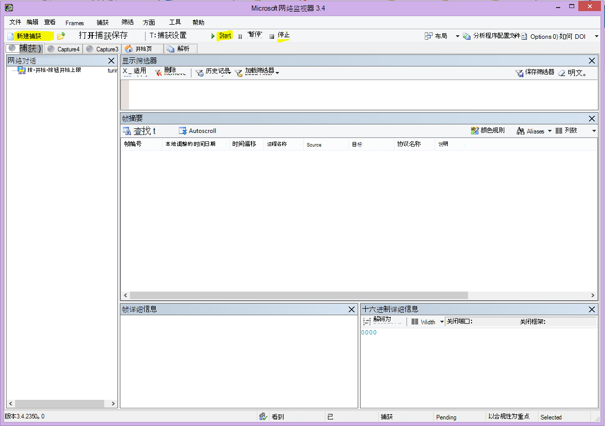

3. 若要获取简单的捕获 **，请单击工具栏** 上的"开始"。

4. 重现出现性能问题的步骤。

5. 单击 **"停止** \> **文件** \> **另存为"。** 请记住将日期和时间与时区一起提供，并提及它是否演示了性能不佳或良好。

## <a name="httpwatch"></a>HTTPWatch

[HTTPWatch](https://www.httpwatch.com/download/) 提供收费和免费版本。 免费的 Basic Edition 涵盖此测试所需的一切内容。 HTTPWatch 从浏览器窗口监视网络流量和页面加载时间。 HTTPWatch 是一个插件，Internet Explorer以图形方式描述性能。 分析可以在 HTTPWatch Studio 中保存和查看。

> [!NOTE]
> 如果使用的是其他浏览器（如 Firefox、Google Chrome）或无法安装 Internet Explorer 中的 HTTPWatch，请打开一个新的浏览器窗口，然后按键盘上的 F12。 您应该在浏览器底部看到"开发人员工具"弹出窗口。 如果使用 Opera，请按 Ctrl+Shift+I for Web Inspector，然后单击"网络"选项卡并完成下面列出的测试。 该信息将略有不同，但加载时间仍将以毫秒为单位显示。 > HTTPWatch 对于联机页面加载SharePoint问题也非常有用。

### <a name="run-httpwatch-and-reproduce-the-issue"></a>运行 HTTPWatch 并重现问题

HTTPWatch 是一个浏览器插件，因此对于每个版本的浏览器，在浏览器中公开该工具Internet Explorer。 通常，您可以在浏览器的"命令"栏下Internet Explorer HTTPWatch。 如果在浏览器窗口中看不到 HTTPWatch 插件，请通过单击"帮助""关于"来检查浏览器的版本，或在Internet Explorer 的更高版本中，单击齿轮符号和"关于 \> **Internet Explorer"。** 若要启动 **命令栏** ，请右键单击命令栏中的菜单Internet Explorer然后单击命令 **栏**。

过去，HTTPWatch 已与命令和资源管理器栏关联，因此安装后，如果未立即看到图标 (即使在重新启动) 后也看不到该图标，请检查"工具"和工具栏以查看图标。  请记住，可以自定义工具栏，并可以添加选项。

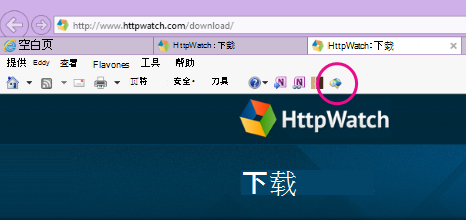

1. 在浏览器窗口中Internet Explorer HTTPWatch。 它将显示在该窗口底部的浏览器上。 单击"**记录"。**

2. 重现性能问题中涉及的确切步骤。 单击 HTTPWatch **中的"** 停止"按钮。

3. **保存** HTTPWatch 或 **通过电子邮件发送**。 请记住命名文件，以便它包含日期和时间信息，并指示 Watch 包含性能良好还是性能不佳的演示。


此屏幕截图来自 HTTPWatch Professional版本。 可以在具有新版本的计算机上打开在基本版本中Professional跟踪，然后从该计算机上读取。 通过该方法，跟踪中可能会提供额外信息。

## <a name="problem-steps-recorder"></a>问题步骤记录器

步骤录制器PSR.exe记录器，允许您在问题发生时记录问题。 这是一个非常有用的工具，并且运行起来非常简单。

### <a name="run-problem-steps-recorder-psrexe-to-record-your-work"></a>运行问题步骤记录 (PSR.exe) 记录器以记录你的工作

1. 使用"**开始** \> **运行** \>  \> **"PSR.exe"确定**"，或单击"Windows键类型"PSR.exe\>  \> 然后按 Enter。

2. 当小PSR.exe窗口出现时，单击"启动 **记录** "并重现重现性能问题的步骤。 您可通过单击"添加注释"根据需要 **添加注释**。

3. 完成 **这些步骤后** ，单击"停止记录"。 如果性能问题是页面呈现，请等待页面呈现，然后再停止录制。

4. 单击“**保存**”。


将记录日期和时间。 这会将 PSR 实时链接到 Netmon 跟踪和 HTTPWatch，并帮助进行精确疑难解答。 例如，PSR 记录中的日期和时间可以显示 URL 的登录和浏览与部分呈现之间传递的分钟数。

## <a name="read-your-traces"></a>读取跟踪

无法通过文章来介绍有关网络和性能疑难解答的一切内容。 获得良好的性能需要经验，并且需要了解网络的工作方式和通常执行方式。 但是，可以向上舍入主要问题列表，并说明工具如何更轻松地消除最常见的问题。

如果你想要获得读取 Office 365 网站网络跟踪的技能，没有比定期创建页面加载跟踪并获取读取这些跟踪的经验更好的教师。 例如，当您有机会时，加载一个 Office 365 服务并跟踪该过程。 筛选 DNS 流量的跟踪，或搜索 FrameData 以查找您浏览的服务的名称。 扫描跟踪，了解服务加载时发生的步骤。 这将帮助你了解正常页面负载应该是什么样，在疑难解答的情况下，尤其是关于性能的情况下，将好与坏的跟踪进行比较可以告诉你很多。

Netmon 在"显示筛选器"字段中使用 Microsoft Intellisense。 智能感知（或智能代码完成）就是一个技巧，即你在一段时间的键入位置，所有可用选项都显示在下拉选择框中。 例如，如果您担心 TCP 窗口缩放，您可以通过此方式找到 (如)  `.protocol.tcp.window < 100` 筛选器的方法。

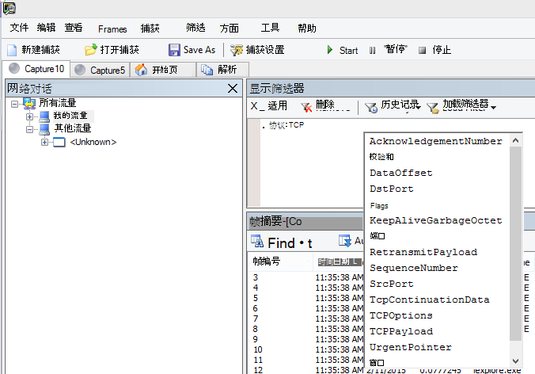

Netmon 跟踪中可能有很多流量。 如果你没有阅读它们经验，那么第一次打开跟踪时可能会感到不知所措。 首先要执行以下操作：将信号与跟踪中的背景噪音分开。 你针对Office 365进行了测试，这就是你想要查看的流量。 如果您习惯在跟踪中导航，则您可能不需要此列表。

客户端和客户端Office 365流量通过 TLS 传输，这意味着通信正文将在常规 Netmon 跟踪中加密且不可读取。 性能分析不需要知道数据包中信息的具体信息。 但是，它非常关注数据包头及其包含的信息。

### <a name="tips-to-get-a-good-trace"></a>使用技巧一个很好的跟踪

- 了解客户端计算机的 IPv4 或 IPv6 地址的值。 可以通过键入 **IPConfig** 然后按 Enter 从命令提示符获取此参数。 通过了解此地址，您可以一目了然地判断跟踪中的流量是否直接涉及客户端计算机。 如果存在已知代理，则 Ping 它并获取其 IP 地址。

- 刷新 DNS 解析程序缓存，如果可能，请关闭除运行测试的浏览器之外的所有浏览器。 例如，如果不支持使用某些基于浏览器的工具查看客户端计算机的桌面，请准备好筛选跟踪。

- 在繁忙跟踪中，找到Office 365服务。 如果你之前从未或很少看到流量，这是将性能问题与其他网络干扰区分开的有用步骤。 有一些方法可以这样做。 在测试之前，您可以直接对特定服务的 URL 使用 _ping_ 或 _PsPing_ `ping outlook.office365.com` (，例如 `psping -4 microsoft-my.sharepoint.com:443` ，) 。 您还可以轻松找到 Netmon 跟踪中的 ping 或 PsPing (其进程名称) 。 这将为您提供开始查找的位置。

如果您在出现问题时仅使用 Netmon 跟踪，也无用事。 若要引导自己，请使用类似 或 `ContainsBin(FrameData, ASCII, "office")` 的筛选器 `ContainsBin(FrameData, ASCII, "outlook")` 。 可以从跟踪文件记录帧编号。 您可能还想要一路向右滚动"框架摘要"窗格并查找"对话 ID"列。 有一个数字指示了此特定对话的 ID，稍后还可以单独记录和查看。 在应用任何其他筛选之前，请记住删除此筛选器。

> [!TIP]
> Netmon 有很多有用的内置筛选器。 尝试" **显示筛选器** "窗格顶部的"加载筛选器 _"_ 按钮。


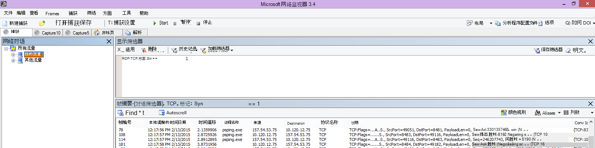

熟悉流量，并了解如何查找所需的信息。 例如，了解如何确定跟踪中的哪个数据包具有对Office 365服务的第一个引用， ("Outlook") 。

以 Office 365 Outlook Online 为例，流量开始如下所示：

- 具有匹配 QueryID outlook.office365.com DNS 标准查询和 DNS 响应。 必须注意此转网的时间偏移量，以及全局 DNS Office 365发送名称解析请求的地方。 理想情况下，尽可能在本地，而不是全球的一半。

- 其状态报告已永久移动到 301 (HTTP GET) 

- RWS 流量，包括 RWS 连接请求连接回复。  (这是为用户建立连接的远程 Winsock。) 

- TCP SYN 和 TCP SYN/ACK 对话。 此对话中的许多设置会影响性能。

- 然后，发生 TLS 握手和 TLS 证书对话的一系列 TLS：TLS 流量。  (记住数据是通过 SSL/TLS.) 

流量的所有部分都很重要且已连接，但跟踪的一小部分包含对于性能疑难解答特别重要的信息，因此我们将重点介绍这些方面。 此外，由于我们已在 Microsoft Office 365执行足够的性能疑难解答，以编译常见问题的十大列表，我们将重点介绍这些问题，以及如何使用下一步必须解决的工具。

如果你尚未全部安装它们，下面的矩阵将利用多种工具。 如果可能。 提供了指向安装点的链接。 该列表包括常见的网络跟踪工具（如 [Netmon](https://www.microsoft.com/download/details.aspx?id=4865) 和 [Wireshark），](https://www.wireshark.org/)但可使用您习惯以及您习惯筛选网络流量的任何跟踪工具。 在测试时，请记住：

- *关闭浏览器，并仅运行一个浏览器进行测试*  - 这将减少捕获的总流量。 它使跟踪变得不太忙。
- *刷新客户端计算机*  上的 DNS 解析程序缓存 - 这会在您开始捕获时为您提供一个干净的平板电脑，以更简洁的跟踪。

## <a name="common-issues"></a>常见问题

你可能面临的一些常见问题以及如何在网络跟踪中查找它们。

### <a name="tcp-windows-scaling"></a>TCP Windows缩放

在 SYN - SYN/ACK 中找到。 旧版或旧式硬件可能不会利用 TCP 窗口缩放。  如果没有正确的 TCP 窗口缩放设置，TCP 标头中的默认 16 位缓冲区将填充以毫秒为单位。  在客户端收到已收到原始数据的确认信息之前，通信无法继续发送，从而导致延迟。

#### <a name="tools"></a>工具

- Netmon
- Wireshark

#### <a name="what-to-look-for"></a>要查找什么

查找网络跟踪中的 SYN - SYN/ACK 流量。  在 Netmon 中，使用类似 的筛选器  `tcp.flags.syn == 1` 。 此筛选器在 Wireshark 中相同。

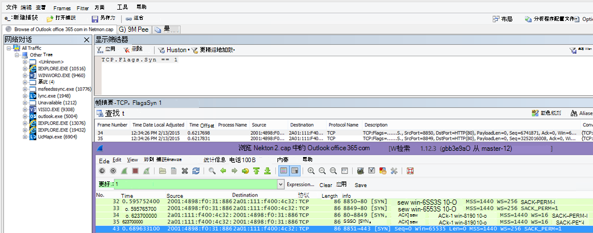

请注意，每个 SYN 都有一个源端口 (SrcPort) 号码，该号码在相关 Acknowledgment (SYN/ACK) 的目标端口 (DstPort) 中匹配。

To see the Windows Scaling value that is used by your network connection， expand first the SYN， and then the related SYN/ACK.

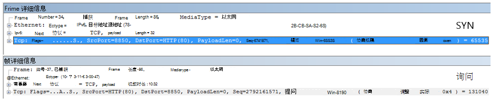

### <a name="tcp-idle-time-settings"></a>TCP 空闲时间设置

过去，大多数外围网络都配置为使用瞬态连接，这意味着空闲连接通常会终止。 空闲 TCP 会话可以在大于 100 秒到 300 秒时由代理和防火墙终止。 这对联机Outlook存在问题，因为它创建并使用长期连接，无论连接是否处于空闲状态。

当连接被代理或防火墙设备终止时，客户端不会得到通知，尝试使用 Outlook Online 意味着客户端计算机将反复尝试在新建连接之前破坏连接。 您可能会在页面加载时看到产品挂起、提示或性能变慢。

#### <a name="tools"></a>工具

- Netmon
- Wireshark

#### <a name="what-to-look-for"></a>要查找什么

在 Netmon 中，查看"时间偏移"字段进行往返。 往返行程是客户端向服务器发送请求和收到回信之间的时间。 在客户端和出口点之间检查 (点。 客户端 -- \> 代理) 或客户端到 Office 365 (客户端 ） \> Office 365) 。 您可以在许多类型的数据包中查看此内容。

例如，Netmon 中的筛选器可能看起来像 ，  `.Protocol.IPv4.Address == 10.102.14.112 AND .Protocol.IPv4.Address == 10.201.114.12` 或者，在 Wireshark 中  `ip.addr == 10.102.14.112 &amp;&amp; ip.addr == 10.201.114.12` 。

> [!TIP]
> 不知道跟踪中的 IP 地址是否属于 DNS 服务器？ 请尝试在命令行上查找它。 单击 **开始** \> **运行** \> 并键入 **cmd**，或按 **Windows 键** \> 并键入 **cmd**。 在提示符下，键入  `nslookup <the IP address from the network trace>` 。 若要进行测试，请针对您自己的计算机的 IP 地址使用 nslookup。 >查看 Microsoft 的 IP 范围列表，请参阅Office 365 [URL 和 IP 地址范围](./urls-and-ip-address-ranges.md)。

如果出现问题，预计会出现长时间偏移，在这种情况下， (Outlook Online) ，尤其是在 TLS：TLS 数据包中，它显示应用程序数据 (例如，在 Netmon 中，可以通过) 查找 `.Protocol.TLS AND Description == "TLS:TLS Rec Layer-1 SSL Application Data"` 应用程序数据包。 在会话期间，你应该会看到一个平稳的进度。 如果在刷新 Outlook Online 时看到长时间延迟，这可能是由发送的高级别重置导致的。

### <a name="latencyround-trip-time"></a>延迟/往返时间

延迟是一种度量方式，根据许多变量（例如，升级分页设备、向网络添加大量用户以及网络连接上的其他任务使用的总带宽百分比）可能会更改很多。

此"网络规划和性能[Office 365"](network-planning-and-performance.md)页面中提供了适用于 Office 365 的带宽计算器。

是否需要测量连接速度或 ISP 连接的带宽？ 尝试此 (或类似它的网站 [) ：Speedtest Official Site](https://www.speedtest.net/)，或查询你最喜爱的搜索引擎，以查找短语 **"speed test"。**

#### <a name="tools"></a>工具

- Ping
- PsPing
- Netmon
- Wireshark

#### <a name="what-to-look-for"></a>要查找什么

若要跟踪跟踪中的延迟，您将受益于将客户端计算机 IP 地址和 DNS 服务器的 IP 地址记录在 Office 365 中。 这是为了简化跟踪筛选。 如果通过代理连接，则需要客户端计算机 IP 地址、代理/出口 IP 地址和 Office 365 DNS IP 地址，以便更轻松地工作。

发送到 outlook.office365.com 的  *ping*  请求将告知您接收请求的数据中心的名称，即使 ping 可能无法连接以发送连续的商标 ICMP 数据包。 如果使用 PsPing (下载) 的免费工具，并指定端口 (443) 并且可能使用 IPv4 (-4) 您将获得发送数据包的平均往返时间。 此操作适用于其他服务中的Office 365 URL，例如 `psping -4 yourSite.sharepoint.com:443` 。 事实上，您可以指定大量 ping 获取一个较大的样本作为平均值，请尝试类似 这样的示例 `psping -4 -n 20 yourSite-my.sharepoint.com:443` 。

> [!NOTE]
> PsPing 不会发送 ICMP 数据包。 它通过特定端口对 TCP 数据包执行 ping 操作，因此您可以使用任何一个您认识要打开的端口。 在Office 365，它使用 SSL/TLS，请尝试将端口 ：443 附加到 PsPing。


如果在执行网络跟踪时加载Office 365速度较慢的页面，应为 筛选 Netmon 或 Wireshark 跟踪 `DNS` 。 这是我们查找的 IP 之一。

下面是筛选 Netmon 以获取 IP 地址 (并查看 DNS 延迟) 。 此示例使用 outlook.office365.com，但也可能使用 SharePoint Online 租户的 URL (hithere.sharepoint.com 例如) 。

1. Ping URL，在结果中记录 ping 请求发送到的 DNS 服务器的名称和 `ping outlook.office365.com` IP 地址。
2. 网络跟踪打开页面，或执行会给您带来性能问题的操作，或者，如果您在 ping 上看到高延迟，网络本身会跟踪它。
3. 在 Netmon 中打开跟踪并筛选 DNS (此筛选器也可在 Wireshark 中运行，但区分大小写 `-- dns`) 。 由于从 ping 中知道 DNS 服务器的名称，因此还可以在 Netmon 中更快速进行筛选，如下所示：，在 `DNS AND ContainsBin(FrameData, ASCII, "namnorthwest")` Wireshark dns 中如下所示，frame 包含"namnorthwest"。<br/>打开响应数据包，在"Netmon **帧详细信息** "窗口中，单击 **"DNS"** 展开以了解更多信息。 在 DNS 信息中，你将找到请求所针对的 DNS 服务器的 IP 地址Office 365。 在 PsPing 工具设置下一步 (需要此 IP) 。 删除筛选器，右键单击 Netmon 中的 DNS 响应 (**框架摘要** \> **查找** \> **对话 DNS**) 查看并排的 DNS 查询和响应。
4. 在 Netmon 中，还要注意 DNS 请求和响应之间的"时间偏移"列。 下一步，可轻松安装和使用 [PsPing](/sysinternals/downloads/psping) 工具非常方便，因为 ICMP 通常会在防火墙上被阻止，并且 PsPing 可以很轻松地跟踪延迟（以毫秒为单位）。 PsPing 完成到地址和端口 (的 TCP 连接，在我们的案例中为开放端口 443) 。
5. 安装 PsPing。
6. 打开命令提示符 (Start \> Run \> type cmd，或 Windows Key type cmd) ，将目录更改为安装 PsPing 的目录以运行 \> PsPing 命令。 在我的示例中，你可以看到我在 C 的根上创建一个"Perf"文件夹。您可以执行相同的操作以快速访问。
7. 键入命令，以便针对早期 Netmon 跟踪中的 Office 365 DNS 服务器的 IP 地址（包括端口号，如 ）进行 `psping -n 20 132.245.24.82:445` PsPing。 这将为您提供 20 个 ping 的采样，并计算 PsPing 停止时的平均延迟。

如果要通过代理服务器Office 365，步骤会有所不同。 首先，PsPing 进入代理服务器，获取代理/出口和返回的平均延迟值（以毫秒为单位），然后在代理或具有直接 Internet 连接的计算机上运行 PsPing，获取缺少值 (从一个到 Office 365，然后再返回) 。

如果选择从代理运行 PsPing，您将具有两毫秒值：客户端计算机到代理服务器或出口点，以及代理服务器到 Office 365。 操作完成！ 无论如何，请录制值。

如果在与 Internet 有直接连接（即没有代理）的另一台客户端计算机上运行 PsPing，您将具有两毫秒值：客户端计算机到代理服务器或出口点，以及客户端计算机到 Office 365。 在这种情况下，从客户端计算机的值减去客户端计算机到代理服务器或出口点的值到 Office 365，并且您将具有从客户端计算机到代理服务器或出口点、代理服务器或出口点到 Office 365 的 RTT 号码。

但是，如果可以在直接连接的影响位置找到客户端计算机，或者绕过代理，可以选择查看问题是否从该位置重现开始，然后使用它进行测试。

如在 Netmon 跟踪中所见，如果在任何给定会话中有足够的延迟，这些额外毫秒可能会增加。

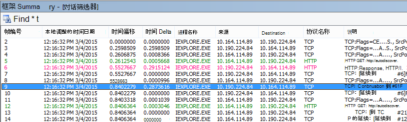

> [!NOTE]
> IP 地址可能不同于此处显示的 IP，例如，ping 可能会返回类似于 157.56.0.0/16 或类似的范围。 有关用户使用的范围Office 365，Office 365 [URL 和 IP 地址范围](./urls-and-ip-address-ranges.md)。

请记住展开所有节点 (例如，如果要搜索 132.245) 则此节点的顶部有一个按钮。

### <a name="proxy-authentication"></a>代理身份验证

这仅适用于通过代理服务器的情况。 如果没有，可以跳过这些步骤。 正常工作时，代理身份验证应一致地以毫秒为单位进行。 不应在高峰使用时段期间看到间歇性性能不佳 (例如) 。

如果代理身份验证已打开，则每次您建立与客户端的新 TCP Office 365才能获取信息，您需要在后台传递身份验证过程。 因此，例如，在 Outlook Online 中从日历切换到邮件时，您将进行身份验证。 在 SharePoint Online 中，如果页面显示来自多个站点或位置的媒体或数据，您将针对呈现数据所需的每个不同 TCP 连接进行身份验证。

在 Outlook Online 中，每次在日历和邮箱之间切换时，可能会遇到加载速度过慢的问题，或在 SharePoint Online 中遇到缓慢SharePoint情况。 但是，此处未列出其他症状。

代理身份验证是出口代理服务器上的设置。 如果导致与用户产生性能问题Office 365，则必须咨询网络团队。

#### <a name="tools"></a>工具

- Netmon
- Wireshark

#### <a name="what-to-look-for"></a>要查找什么

每当必须启动新的 TCP 会话、通常从服务器请求文件或信息或提供信息时，就会进行代理身份验证。 例如，您可能会看到围绕 HTTP GET 或 HTTP POST 请求的代理身份验证。 如果要查看跟踪中对请求进行身份验证的框架，可以将"NTLMSSP 摘要"列添加到 Netmon 并筛选出  `.property.NTLMSSPSummary` 。 若要了解身份验证所花时间，请添加"时间增量"列。

若要向 Netmon 添加列：

1. 右键单击"说明"等 **列**。
2. 单击 **"选择列"。**
3. 在 _列表中找到"NTLMSSP 摘要__和_ 时间增量"，然后单击"添加 **"。**
4. 将新列移动到"说明"列之前或后面，以便可以并排读取它们。
5. 单击“**确定**”。

即使您不添加列，Netmon 筛选器也能够正常工作。 但是，如果您可以看到您处于身份验证的哪一个阶段，则故障排除将容易得多。

在查找代理身份验证实例时，请务必研究存在 NTLM 质询的所有帧，或存在身份验证消息的所有帧。 如有必要，右键单击特定的流量部分并查找对话 \> TCP。 请注意这些对话中的"时间增量"值。

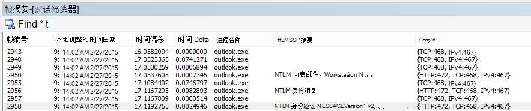

代理身份验证延迟四秒，如 Wireshark 所见。 通过 **右键单击** 帧详细信息中同名的字段并选择"添加为列"，可完成上一个显示框架列的时间增量。  <br/> 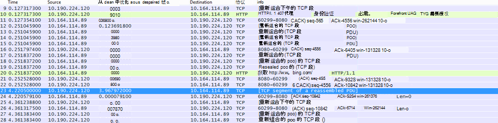

### <a name="dns-performance"></a>DNS 性能

名称解析在尽可能接近客户端国家/地区时效果最好且最快速。

如果 DNS 名称解析正在被注意到，它可以在页面加载中添加秒数。 理想情况下，名称解析在 100 毫秒内发生。 如果没有，应执行进一步调查。

> [!TIP]
> 不确定客户端连接在客户端连接Office 365？ 请在此处查看客户端连接参考 [文档](/previous-versions//dn741250(v=technet.10))。

#### <a name="tools"></a>工具

- Netmon
- Wireshark
- PsPing

#### <a name="what-to-look-for"></a>要查找什么

分析 DNS 性能通常是网络跟踪的另一项作业。 但是，PsPing 还有助于发现可能的原因。

DNS 流量基于 TCP 和 UDP 请求，响应会使用 ID 进行明确标记，这有助于将特定请求与特定响应匹配。 例如，当 SharePoint Online 在网页上使用网络名称或 URL 时，你将看到 DNS 流量。 根据经验，大多数流量（传输区域时除外）通过 UDP 运行。

在 Netmon 和 Wireshark 中，让你查看 DNS 流量的最基本筛选器就是 `dns` 。 指定筛选器时，请务必使用小写。 请记住，在开始在客户端计算机上重现该问题之前刷新 DNS 解析程序缓存。 例如，如果主页的 SharePoint Online 页面加载速度较慢，应关闭所有浏览器、打开新浏览器、开始跟踪、刷新 DNS 解析程序缓存并浏览到 SharePoint Online 网站。 解析整个页面后，应停止并保存跟踪。

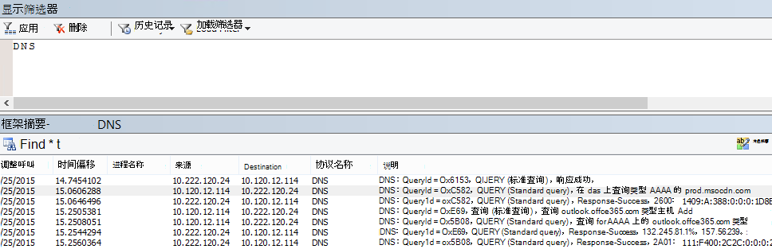

你想要查看此处的时间偏移。 并且，将"时间增量"列添加到 Netmon 中可能会有所帮助，您可以通过完成以下步骤来完成这些步骤：

1. 右键单击"说明"等 **列**。
2. 单击 **"选择列"。**
3. 在 _列表中找到"时间_ 增量"，然后单击"添加 **"。**
4. 将新列移动到"说明"列之前或后面，以便可以并排读取它们。
5. 单击“**确定**”。

如果发现感兴趣的查询，请考虑通过右键单击帧详细信息面板中的该查询来隔离它，选择"**查找对话** \> **DNS"。** 请注意，"网络对话"面板直接跳转到其 UDP 流量日志中的特定对话。

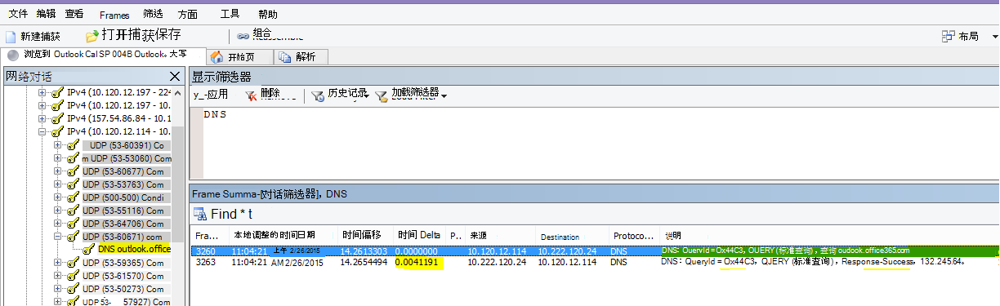

在 Wireshark 中，您可以为 DNS 时间创建列。 在 Wireshark (跟踪信息或) 跟踪记录，并按 筛选，或者更 `dns` 有用。 `dns.time` 单击任何 DNS 查询，在显示详细信息的面板中展开  `Domain Name System (response)` 详细信息。 你将看到一个"时间"字段 (例如， `[Time: 0.001111100 seconds]` 。 右键单击此时间，然后选择 **"应用为列"。** 这将为您提供一 **个"时间** "列，以便更快速地对跟踪进行排序。 单击新列以按降序值排序，以查看解析哪个 DNS 呼叫的时间最长。

[按照 dns.time（小写）在 Wireshark 中筛选的 SharePoint Online 的浏览，其中包含将详细信息插入到某个列以及按升序进行排序的时间。](../media/1439dcc2-12ff-4ee2-9ef3-1484cf79c384.PNG)

如果要对 DNS 解析时间进行更多调查，请尝试对 TCP 服务使用的 DNS 端口执行 PsPing (例如  `psping <IP address of DNS server>:53` ，) 。 是否仍看到性能问题？ 如果这样做，则问题更有可能是更广泛的网络问题，而不是要解决的特定 DNS 应用程序的问题。 还值得一提的是，ping to outlook.office365.com 将告知您 Outlook Online 的 DNS 名称解析 (例如，outlook-namnorthwest.office365.com) 。

如果问题看起来特定于 DNS，可能需要联系 IT 部门，查看 DNS 配置和 DNS 转发器以进一步调查此问题。

### <a name="proxy-scalability"></a>代理可伸缩性

Outlook Online 等Office 365向客户端授予多个长期连接。 因此，每个用户可能使用需要更长时间的更多连接。

#### <a name="tools"></a>工具

数学

#### <a name="what-to-look-for"></a>要查找什么

没有特定于此的网络跟踪或疑难解答工具。 相反，它基于给定限制和其他变量的带宽计算。

### <a name="tcp-max-segment-size"></a>TCP 最大段大小

在 SYN - SYN/ACK 中找到。  执行此检查将检查您执行的任何性能网络跟踪，以确保 TCP 数据包配置为包含可能的最大数据量。

目标是查看 1460 字节的 MSS 以传输数据。 如果你使用的是代理，或者正在使用 NAT，请记住从客户端运行此测试到代理/出口/NAT，以及从代理/出口/NAT 到 Office 365以获得最佳结果！ 这些会话是不同的 TCP 会话。

#### <a name="tools"></a>工具

Netmon

#### <a name="what-to-look-for"></a>要查找什么

TCP 最大段大小 (MSS) 是网络跟踪中三向握手的另一个参数，这意味着你将在 SYN - SYN/ACK 数据包中查找所需的数据。 MSS 实际上非常易于查看。

打开您拥有的任何性能网络跟踪，并查找您想知道或演示性能问题的连接。

> [!NOTE]
> 如果正在查看跟踪并需要查找与对话相关的流量，请按客户端的 IP 或代理服务器或出口点的 IP 进行筛选，或同时进行这两项操作。 直接执行时，您需要 ping 要测试的 URL，以在跟踪中Office 365 IP 地址，并按其进行筛选。

查看跟踪第二手？ 尝试使用筛选器来引导自己。 在 Netmon 中，根据 URL（如 ）运行搜索 `Containsbin(framedata, ascii, "sphybridExample")` ，记下帧号。

在 Wireshark 中，使用类似 这样的  `frame contains "sphybridExample"` 。 如果你注意到你已找到 Remote Winsock (RWS) 流量 (它可能显示为 Wireshark) 中的 [PSH， ACK]，请记住，RWS 连接可以在相关的 SYN - SYN/AKS 之前不久看到，如前面所述。

此时，你可以记录帧编号，删除筛选器，单击 Netmon 的"网络对话"窗口中的"所有流量"，查看最近的 SYN。

重要的是，如果您在跟踪时未收到任何 IP 地址信息，在跟踪 (的一部分（例如) ）中查找 URL 将为您提供要筛选的 IP 地址。 `sphybridExample-my.sharepoint.com`

在跟踪中查找你感兴趣的连接。 为此，可以扫描跟踪、按 IP 地址筛选，或者使用 Netmon 中的"网络对话"窗口选择特定的对话 ID。 找到 SYN 数据包后，展开 Netmon (中的 TCP) 或"帧详细信息"面板中 Wireshark) 中的传输控制协议 (。 展开"TCP 选项"和"MaxSegmentSize"。 找到相关的 SYN-ACK 帧并展开 TCP 选项和 MaxSegmentSize。 两个值中较小的值将是"最大段大小"。 在此图中，我使用了名为 TCP 疑难解答的 Netmon 中的内置 Column。

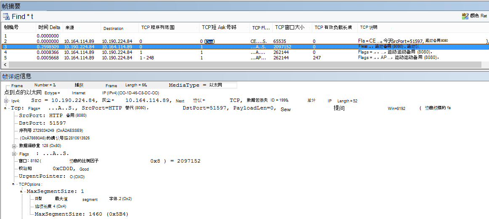

内置列位于"框架详细信息 **"面板的顶部** 。  (若要切换回正常视图，请再次单击"列"，然后选择"时区 **.)**

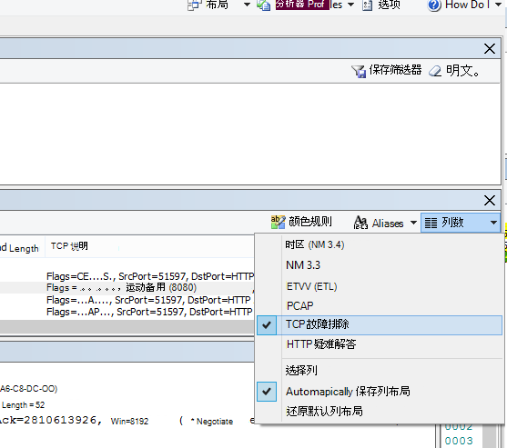

下面是 Wireshark 中的筛选跟踪。 存在特定于 MSS 值筛选器 `tcp.options.mss` () 。 SYN、SYN/ACK、ACK 握手的帧链接在 Wireshark 的底部，相当于帧详细信息 (因此帧 47 ACK、指向 46 SYN/ACK 的链接、指向 43 SYN) 的链接可简化此类工作。

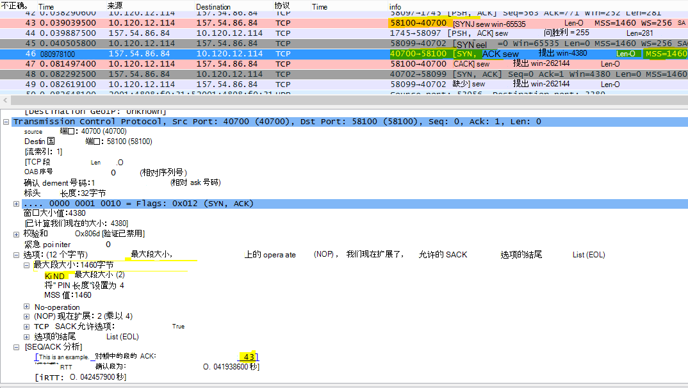

如果你需要检查选择性确认 (此矩阵中的下一主题) ，请不要关闭跟踪！

### <a name="selective-acknowledgment"></a>选择性确认

在 SYN - SYN/ACK 中找到。 必须在 SYN 和 SYN/ACK 中报告为"允许"。 使用 SELECTIVE (ACKNOW) ，可以在数据包丢失时更顺畅地重新传输数据。 设备可以禁用此功能，这可能会导致性能问题。

如果你使用的是代理，或者正在使用 NAT，请记住从客户端运行此测试以从客户端到代理/出口/NAT，以及从代理/出口/NAT 到 Office 365以获得最佳结果！ 这些会话是不同的 TCP 会话。

#### <a name="tools"></a>工具

Netmon

#### <a name="what-to-look-for"></a>要查找什么

SELECTIVE Acknowledgment (的) 是 SYN-SYN/ACK 握手中的另一个参数。 可以通过多种方式筛选跟踪 SYN - SYN/ACK。

通过扫描跟踪、按 IP 地址筛选或通过使用 Netmon 中的"网络对话"窗口单击对话 ID，在跟踪中查找你感兴趣的连接。 找到 SYN 数据包后，在 Netmon 中展开 TCP，或在 Frame Details 部分展开 Wireshark 中的传输控制协议。 展开"TCP 选项"，然后展开"计划"。 找到相关的 SYN-ACK 帧和"展开 TCP 选项"及其"显示"字段。 确保 SYN 和 SYN/ACK 中均允许使用一个功能区。 下面是 NETmon 和 Wireshark 中的一些值。

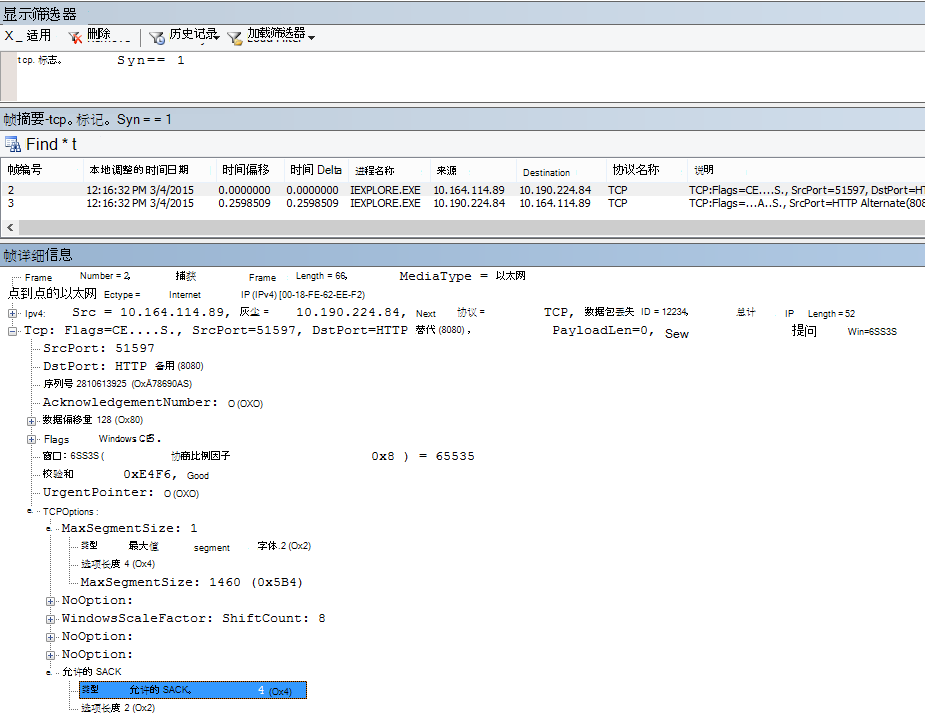

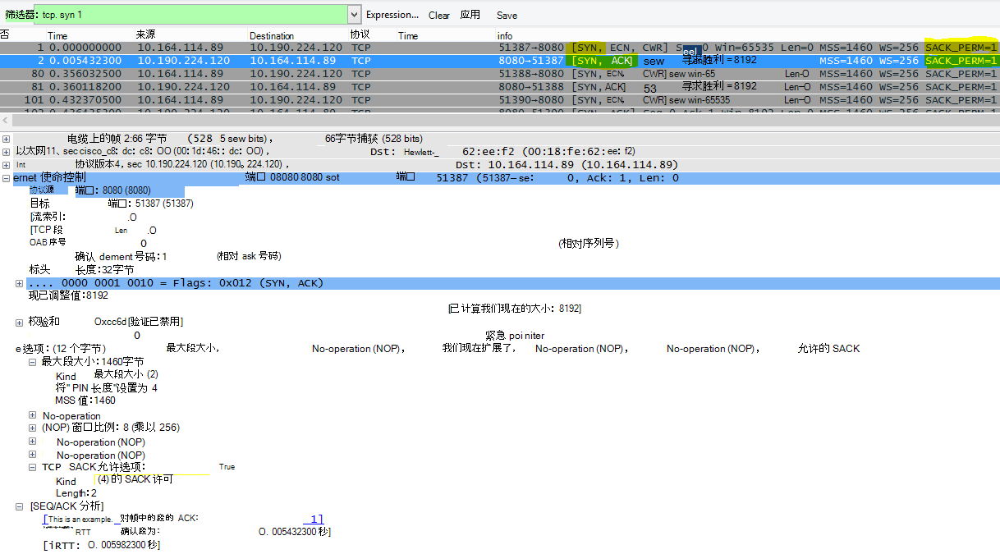

### <a name="dns-geolocation"></a>DNS 地理位置

世界上的Office 365尝试解析 DNS 呼叫将影响连接速度。

在 Outlook Online 中，完成第一次 DNS 查找后，该 DNS 的位置将用于连接到最近的数据中心。 你将连接到 Outlook Online CAS 服务器，该服务器将使用主干网络连接到存储数据的数据中心 (dC) 。 这速度更快。

当访问 SharePoint Online 时，旅行中的用户将被定向到其活动数据中心，即其位置基于其 SPO 租户的主页的 dC (因此，如果用户位于美国，则使用美国 dC) 。

Lync Online 一次具有多个 dC 中的活动节点。 向 Lync Online 实例发送请求时，Microsoft DNS 将确定请求的源位置，并返回最近的 Lync Online 活动区域 dC 中的 IP 地址。

> [!TIP]
> 需要了解有关客户端如何连接到客户端Office 365？ 请看一下客户端 [连接](/previous-versions//dn741250(v=technet.10)) 参考文章 (及其有用的图形) 。

#### <a name="tools"></a>工具

- Ping
- PsPing

#### <a name="what-to-look-for"></a>要查找什么

在大多数情况下，从客户端的 DNS 服务器到 Microsoft DNS 服务器的名称解析请求应该会导致 Microsoft DNS 返回区域数据中心的 IP 地址 (dC) 。 这对你意味着什么？ 如果你的总部位于印度孟加拉，但正在美国出差，当浏览器向 Outlook Online 提出请求时，Microsoft 的 DNS 服务器应该将 IP 地址提交到美国的数据中心（一个区域数据中心）。 如果需要邮件从Outlook，该数据将在数据中心之间通过 Microsoft 的快速主干网传输。

当名称解析尽可能接近用户位置时，DNS 运行速度最快。 如果你在欧洲，你想要转到欧洲 Microsoft DNS，最好 (欧洲) 数据中心。 从欧洲客户端到美国的 DNS 和数据中心的性能将变慢。

针对此 outlook.office365.com Ping 工具，以确定 DNS 请求的路由位置。 如果您在欧洲，您应看到来自类似 outlook-emeawest.office365.com 的答复。 在美洲，预计会 outlook-namnorthwest.office365.com。

打开客户端计算机上的命令提示符， (Start Run cmd 或 Windows \> \> 键 \> 类型 cmd) 。 键入 ping outlook.office365.com 然后按 Enter。 请记住，如果要通过 IPv4 指定 ping，则指定 -4。 您可能无法从 ICMP 数据包获得答复，但您应该会看到请求路由到的 DNS 的名称。 如果要查看此连接的延迟数字，请尝试将 PsPing 连接到 ping 返回的服务器的 IP 地址。


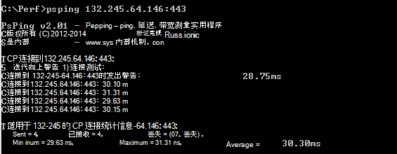

### <a name="office-365-application-troubleshooting"></a>Office 365应用程序疑难解答

#### <a name="tools"></a>工具

- Netmon
- HTTPWatch
- 浏览器中的 F12 控制台

本网络专用文章中不介绍特定于应用程序的疑难解答中使用的工具。 但是，你将找到可在 *此页面*[使用的资源](https://support.office.com/article/Network-planning-and-performance-tuning-for-Office-365-e5f1228c-da3c-4654-bf16-d163daee8848)。

## <a name="related-topics"></a>相关主题

[管理 Office 365 终结点](https://support.office.com/article/99cab9d4-ef59-4207-9f2b-3728eb46bf9a)

[Office 365 终结点 FAQ](https://support.office.com/article/d4088321-1c89-4b96-9c99-54c75cae2e6d)