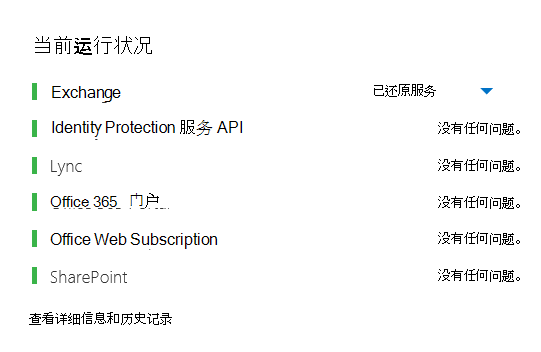
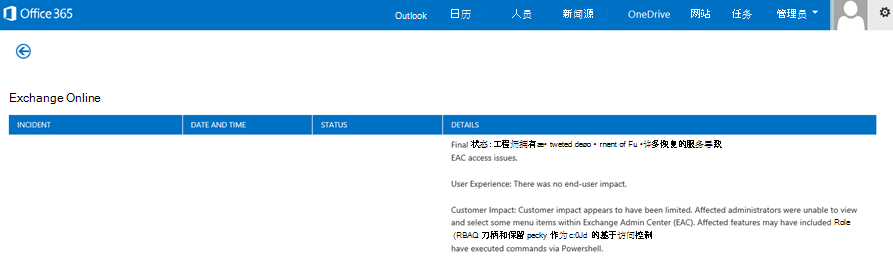
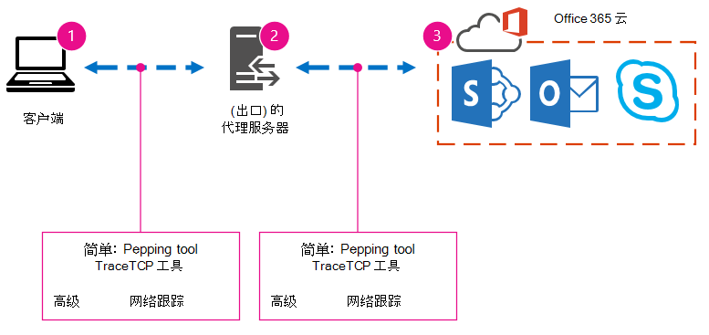
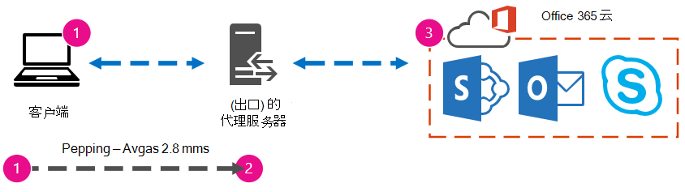
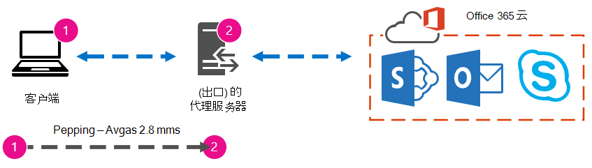

# 使用基线和性能历史记录优化 Office 365 性能

有一些简单的方法可以检查企业与Office 365之间的连接性能，这可让你建立大致的连接基线。 了解客户端计算机连接的性能历史记录可帮助您提前检测新出现的问题、识别和预测问题。
  
如果您不习惯处理性能问题，本文旨在帮助您考虑一些常见问题。 您如何知道您看到的问题是性能问题，而不是服务Office 365问题？ 如何规划良好的长期性能？ 如何关注性能？ 如果你的团队或客户在使用 Office 365时发现性能缓慢，并且你想知道其中任何一个问题，请继续阅读。
  
> [!IMPORTANT]
> **客户端和客户端之间目前Office 365性能问题？** 按照性能疑难解答计划中概述[的步骤操作Office 365](performance-troubleshooting-plan.md)。 
    
## 应了解的有关性能Office 365信息

Office 365位于由自动化和真实人员监视的高容量专用 Microsoft 网络内。 维护云Office 365部分就是尽可能优化和简化性能。 由于云Office 365客户端必须跨 Internet 连接，因此，我们一直努力微调跨云服务Office 365性能。

性能改进从未真正停止在云中，因此，保持云正常运行和快速的体验也不一样。 如果从你的位置连接到 Office 365时出现性能问题，最好不要从支持案例开始或等待。 相反，你应该从"从内到外"开始调查问题。 也就是说，从网络内部开始，并努力解决Office 365。 在通过支持打开案例之前，可以收集数据，并采取措施来浏览并可能解决该问题。
  
> [!IMPORTANT]
> 请注意容量规划和容量Office 365。 在尝试解决性能问题时，该信息将置于曲线的前面。 下面是指向服务说明[Microsoft 365 Office 365的链接](/office365/servicedescriptions/office-365-service-descriptions-technet-library)。 这是一个中心中心，由 Office 365提供的所有服务都有一个链接，从此处转到其自己的服务说明。 也就是说，如果你需要查看 SharePoint Online 的标准限制，可单击"SharePoint [Online 服务](/office365/servicedescriptions/sharepoint-online-service-description/sharepoint-online-service-description)说明"并找到其"SharePoint [Online 限制"部分](/office365/servicedescriptions/sharepoint-online-service-description/sharepoint-online-limits)。
  
请确保在了解性能是一个滑动比例后进行疑难解答。 并非实现理想化值并永久维护它。 有时执行高带宽任务（例如，将大量用户上移或执行大型数据迁移）将带来压力，因此请规划对性能的影响。 您应该大致了解性能目标，但许多变量会影响性能，因此性能会有所不同。
  
性能疑难解答与实现特定目标并无限期地维护这些数字有关，而与改进现有活动（假设存在所有变量）有关。 
  
## 好的，性能问题看起来是什么？

首先，需要确保你遇到的情况确实是性能问题，而不是服务事件。 性能问题与服务事件中的服务事件Office 365。 下面将介绍它们分开。
  
当服务本身遇到Office 365时，将发生服务事件。 You may see red or yellow icons under **Current health** in the Microsoft 365 管理中心. 您可能会注意到连接到客户端计算机的Office 365速度很慢。 例如，如果"当前运行状况"报告红色图标，且在  Exchange 旁边看到"正在调查"，则您可能也会收到来自组织中抱怨使用客户端邮箱的客户端邮箱速度较慢Exchange Online的呼叫。 在这种情况下，可以合理假定您的Exchange Online是服务问题的受害者。
  

  
此时，你（Office 365管理员）应检查"当前运行状况"，然后经常查看详细信息和历史记录，以及时了解系统维护情况。 **已创建** 当前运行状况仪表板，以更新服务更改和问题。 记录到运行状况历史记录的注释和说明（管理员到管理员）可帮助你衡量并持续发布正在进行的工作。
  

  
性能问题不是服务事件，即使事件会导致性能下降。 性能问题如下所示：
  
- 无论管理中心是什么当前运行状况报告服务 **，都会出现** 性能问题。
    
-  用于流的行为需要很长时间才能完成或永远不会完成。
    
- 您也可以复制该问题，或者知道如果您执行正确的一系列步骤，将会发生这种情况。
    
-  如果问题是间歇性的，则仍可以存在模式。 例如，你知道在 10：00 AM 前，你将从不能始终访问呼叫的用户Office 365。 呼叫将在中午左右结束。
    
此列表可能很熟悉;可能太熟悉了。 一旦意识到这是性能问题，问题就变为"下一步该怎么办？" 本文的其余部分将帮助您准确确定这一点。
  
## 如何定义和测试性能问题

性能问题通常会随着时间的推移而出现，因此定义实际问题可能非常困难。 创建一个能良好理解问题上下文的问题陈述，然后需要重复测试步骤。 下面是一些无法提供足够信息的问题语句示例：
  
- 从"收件箱"切换到"日历"过去是一个我未注意到的内容，现在它是一个咖啡壶。 能否使其像以前一样工作？
    
- 将文件上传到 SharePoint Online 需要永久完成。 为什么下午很慢，但在其他任何时间，速度都很快？ 不够快吗？
    
上面的问题陈述带来了一些较大的挑战。 具体而言，需要处理多的歧义。 例如：
  
- 不清楚在用于笔记本电脑的收件箱和日历之间如何切换。
    
- 当用户说"无法快速"时，什么是"快速"？
    
- "永远"多久？ 这是否几秒钟？ 或几分钟？ 或者，用户能否午餐，操作将在他们回来后 10 分钟后完成？
    
管理员和疑难解答程序无法从类似此类的一般陈述中了解问题的详细信息。 例如，他们不知道问题何时开始发生。 疑难解答程序可能不知道用户在家工作，并且只会在家庭网络上看到缓慢切换。 或者，用户在本地客户端上运行其他 RAM 密集型应用程序。 管理员可能不知道用户运行的是较旧的操作系统，或者未运行最近的更新。
  
当用户报告性能问题时，需要收集许多信息。 获取和记录信息称为界定问题范围。 下面是可用于收集有关性能问题的信息的基本范围列表。 此列表并不详尽，但可以开始：
  
- 该问题在什么日期发生，以及一天或一夜的哪一天？
    
- 你使用的是哪种类型的客户端计算机，它如何连接到使用 VPN、有线、无线 (业务) ？
    
- 你是远程工作还是正在办公室工作？
    
- 您是否尝试在另一计算机上执行相同的操作，并看到相同的行为？
    
- 演练为您提供问题的步骤，以便您可以编写要采取的操作。
    
- 性能以秒或分钟的速度有多慢？
    
- 你位于世界上的什么位置？
    
其中一些问题比其他问题更明显。 大多数每个人都会了解疑难解答程序需要确切步骤来重现问题。 毕竟，如何记录错误，以及如果问题已修复，如何进行测试？ 不太明显的是"您看到该问题的日期和时间？"和"您位于何处？"等内容，信息可以一起使用。 根据用户工作的时间，几小时的时差可能意味着已在公司网络的某些部分进行维护。 例如，贵公司具有混合实现，如混合 SharePoint 搜索，它可以查询 SharePoint Online 和本地 SharePoint Server 2013 实例中的搜索索引，本地服务器场中可能会进行更新。 如果你的公司全部位于云中，则系统维护可能包括添加或删除网络硬件、推出公司范围内的更新，或者更改 DNS 或其他核心基础结构。
  
当你对性能问题进行故障排除时，它有点像一个犯罪场景，你需要精确观察，以从证据中得出任何结论。 为此，必须通过收集证据获得一个很好的问题陈述。 它应包括计算机的上下文、用户的上下文、问题开始时以及公开性能问题的确切步骤。 This problem statement should， and stay， the top top top page in your notes. 在解决问题后，通过再次浏览问题陈述，您可以采取一些步骤来测试并证明您采取的操作是否已解决问题。 这一点对于了解工作何时完成至关重要。
  
## 你是否知道性能在好时如何显示？

如果你未通过，则没有人知道。 没有人有数字。 这意味着没有人可以回答简单的问题"关于在 Office 365 中显示收件箱所花的秒数？"或"当主管人员召开 Lync Online 会议时，它过去需要多久？"，这是许多公司的常见方案。
  
性能基准中缺少哪些功能？
  
基线可为您提供性能上下文。 您有时应该经常采取基准，具体取决于公司的需求。 如果你是一家较大的公司，则运营团队可能已经为本地环境设定了基准。 例如，如果在当月的第一个星期一修补所有 Exchange 服务器，第三个星期一修补所有 SharePoint 服务器，则 Operations 团队可能有一个任务和方案列表，这些任务和方案在修补后运行，以证明关键功能可正常运行。 例如，打开"收件箱"，单击"发送/接收"，并确保文件夹更新，或在 SharePoint 中浏览网站的主页，进入企业"搜索"页，然后执行返回结果的搜索。
  
如果应用程序位于 Office 365 中，您可以测量从网络内部的客户端计算机到出口点的时间)  (（以毫秒为单位）或离开网络并进入 Office 365 的点。 以下是你可以调查和记录的一些有用的基线：
  
- 标识客户端计算机和出口点之间的设备，例如代理服务器。
    
  - 你必须了解你的设备，以便你拥有针对 (IP 地址、设备类型等) 的上下文。
    
  - 代理服务器是常见的出口点，因此你可以检查 Web 浏览器以查看它设置为使用哪些代理服务器（如果有）。
    
  - 虽然有第三方工具可以发现和映射你的网络，但最安全的了解你的设备的方式是询问你的网络团队成员。
    
- 向 ISP (Internet 服务提供商) ，记下其联系信息，并询问您有多少电路带宽。
    
- 在公司内，确定客户端和出口点之间的设备资源，或标识要与网络问题交谈的紧急联系人。
    
下面是使用工具的简单测试可以计算的一些基线：
  
- 从客户端计算机到出口点的时间（以毫秒为单位）
    
- 从出口点到出口Office 365的时间（以毫秒为单位）
    
- 在服务器的世界的位置，在浏览时解析Office 365 URL
    
- ISP DNS 解析的速度（以毫秒为单位），数据包到达时间不一 (网络抖动) 、上载和下载时间（以毫秒为单位）
    
如果您不熟悉如何执行这些步骤，我们将在本文中详细介绍。 
  
## 什么是基线？

当它变差时，你将了解它的影响，但如果你不知道你的历史性能数据，则不可能有关于它可能变得有多差以及何时发生的情况的上下文。 因此，如果没有基线，你缺少解决问题的关键线索：问题框上的图片。 在性能疑难解答中，您需要一个比较  *点*。 简单性能基线并不难接受。 运营团队可以负责按计划执行这些操作。 例如，假设你的连接如下所示： 
  

  
这意味着你已与网络团队核实，并且发现你通过代理服务器离开公司用于 Internet，并且该代理将处理客户端计算机发送到云的所有请求。 在这种情况下，应绘制列出所有干预设备的简化连接版本。 现在，插入可用于测试客户端、Internet (网络的出口点和云) 测试Office 365的工具。
  

  
这些选项列为 **"简单**"和"高级"，因为查找性能数据所需的专业技能量。 与运行 PsPing 和 TraceTCP 等命令行工具相比，网络跟踪需要很长时间。 之所以选择这两个命令行工具，是因为它们不使用 ICMP 数据包，这些数据包将被 Office 365 阻止，并且它们提供离开客户端计算机或代理服务器 (（如果您有权访问) 并到达 Office 365）所花的时间（以毫秒为单位）。 从一台计算机到另一台计算机的每个跃点最终都会有一个时间值，这非常适用于基线！ 与重要的是，这些命令行工具允许您在命令中添加端口号，这非常有用，因为 Office 365 通过端口 443 进行通信，端口 443 是安全套接字层和传输层安全性 (SSL 和 TLS) 使用的端口。 但是，其他第三方工具可能更适用于你的情况。 Microsoft 不支持所有这些工具，因此，如果出于某种原因，无法使 PsPing 和 TraceTCP 正常工作，请使用 Netmon 等工具继续网络跟踪。 
  
您可以在工作时间之前、在大量使用期间、之后再次采用基准。 这意味着你最终可能拥有一个如下所示的文件夹结构：
  

  
还应选取文件的命名约定。 下面是一些示例：
  
- Feb_09_2015_9amPST_PerfBaseline_Netmon_ClientToEgress_Normal
    
- Jan_10_2015_3pmCST_PerfBaseline_PsPing_ClientToO365_bypassProxy_SLOW
    
- Feb_08_2015_2pmEST_PerfBaseline_BADPerf
    
- Feb_08_2015_8-30amEST_PerfBaseline_GoodPerf
    
有许多不同方法可以这样做，但 **\<dateTime\>\<what's happening in the test\>** 使用 格式是一个很好的起点。 当您稍后尝试解决问题时，对此多做了解将大有帮助。 稍后，你可以说"我在 2 月 8 日跟踪了两次，一次显示良好性能，另一次显示不佳，因此我们可以比较它们"。 这有助于进行疑难解答。 
  
你需要有条不理地保留历史基线。 在此示例中，简单方法生成了三个命令行输出，并且结果收集为屏幕截图，但您可以改为使用网络捕获文件。 使用最适合您的方法。 存储历史基线，在发现联机服务行为发生变化的点引用这些基线。 
  
## 为什么在试点期间收集性能数据？

与试用服务期间没有更好的时间来开始Office 365。 你的办公室可能有成千上万个用户、数十万，或者可能有五个用户，但即使只有少数用户，也可以执行测试来测量性能中的波动。 对于大型公司，可以向外规划数百个用户试点的Office 365数千个用户，以便了解问题在出现之前可能出现在哪里。
  
对于小型公司，其中上机意味着所有用户同时访问服务，并且没有试点，请保留性能度量，以便向可能必须解决运行不良问题的人显示数据。 例如，如果你注意到一下突然，你可以一边在建筑物四处移动，一边上传曾快速发生的中型图形。
  
## 如何收集基线

对于所有疑难解答计划，至少需要确定以下项：
  
- 你使用的客户端计算机 (计算机或设备的类型、IP 地址以及导致问题) 
    
- 例如，客户端计算机所在的世界 (例如，此用户是使用 VPN 连接到网络、远程工作，还是使用公司 Intranet) 
    
- 客户端计算机从网络使用的出口点 (ISP 或 Internet 服务提供商的流量离开业务) 
    
 你可以从网络管理员找到你的网络布局。 如果你使用小型网络，请看一下将你连接到 Internet 的设备，如果对布局有疑问，请呼叫 ISP。 为参考创建最终布局的图形。 
  
本节分为简单的命令行工具和方法以及更高级的工具选项。 我们将首先介绍简单方法。 但是，如果当前存在性能问题，应跳转到高级方法并尝试示例性能疑难解答行动计划。
  
### 简单方法

这些简单方法的目标是了解、了解并正确存储一段时间的简单性能基准，以便告知您有关性能Office 365的信息。 下面是一个简单的简单图表，如您之前所见：
  

  
> [!NOTE]
> TraceTCP 包括在此屏幕截图中，因为它是一个有用的工具，可用于显示请求到达目标需要的时间（以毫秒为单位），以及从一台计算机到下一台计算机的网络跃点数或连接数。 TraceTCP 还可以提供跃点期间所使用的服务器的名称，这可用于支持中的Microsoft Office 365疑难解答程序。 > TraceTCP 命令可能非常简单，例如：  `tracetcp.exe outlook.office365.com:443` >>请记住在命令中包括端口号！ > [TraceTCP](https://simulatedsimian.github.io/tracetcp_download.html) 是一个免费下载，但依赖于 Wincap。 Wincap 是 Netmon 也使用和安装的工具。 我们还在高级方法部分中使用 Netmon。 
  
 如果有多个办公室，则还需要在每个位置保留来自客户端的一组数据。 此测试测量延迟（本例中为描述客户端向 Office 365 发送请求与响应Office 365之间的时间量。 测试源自客户端计算机上的域内部，并查找测量从网络内部、通过出口点、通过 Internet 到 Office 365 和返回的往返行程。 
  
有多种方式可以处理出口点，在这种情况下，是代理服务器。 你可以跟踪 1 到 2，然后跟踪 2 到 3，然后以毫秒为单位添加数字，以得到网络边缘的最终总计。 或者，可以将连接配置为绕过其他地址Office 365代理。 在具有防火墙、反向代理或这两者的组合的较大网络中，您可能需要在代理服务器上创建允许流量通过大量 URL 的例外。 有关用户使用的终结点Office 365，请参阅Office 365 [URL 和 IP 地址范围](https://support.office.com/article/8548a211-3fe7-47cb-abb1-355ea5aa88a2)。 如果你有身份验证代理，请首先测试以下各项的异常：
  
- 端口 80 和 443
    
- TCP 和 HTTPs
    
- 出站到以下任一 URL 的连接：
    
- \*.microsoftonline.com
    
- \*.microsoftonline-p.com
    
- \*.sharepoint.com
    
- \*.outlook.com
    
- \*.lync.com
    
- osub.microsoft.com
    
需要允许所有用户访问这些地址，而无需任何代理干扰或身份验证。 在较小的网络中，应在 Web 浏览器中将其添加到代理旁路列表。 
  
若要将其添加到代理中的代理旁路Internet Explorer，\>请转到"工具 **""Internet** \> 选项 **"**\>"**连接""LAN** \> 设置 **""高级"**。 高级选项卡也是找到代理服务器和代理服务器端口的地方。 你可能需要单击" **为 LAN** 使用代理服务器"复选框，以访问"高级 **"** 按钮。 您需要确保选中"对本地 **地址绕过** 代理服务器"。 单击" **高级"** 后，你将看到一个文本框，您可以在其中输入例外。 用分号分隔上面列出的通配符 URL，例如：
  
\*.microsoftonline.com; \*.sharepoint.com
  
绕过代理后，您应该可以直接在 url 上使用 ping 或 psPing Office 365 URL。 下一步是 **测试 ping outlook.office365.com**。 或者，如果你使用的是 PsPing 或其他工具，该工具将允许向命令提供端口号，PsPing 针对 **portal.microsoftonline.com:443** 查看平均往返时间（以毫秒为单位）。 
  
往返时间（即 RTT）是一个数字值，它测量向服务器（如 outlook.office365.com）发送 HTTP 请求并返回确认服务器知道您这样做的响应需要的时间。 有时，你将看到此缩写为 RTT。 这应该是一个相对短的时间。
  
您必须使用 [PSPing](/sysinternals/downloads/psping) 或其他不使用 ICMP 数据包（该数据包被 Office 365阻止）的工具才能执行此测试。 
  
 **如何使用 PsPing 直接从 URL 获取总往返时间（以毫秒Office 365时间**
  
1. 通过完成以下步骤运行提升的命令提示符：
    
1. 单击“**开始**”。
    
2. 在" **开始搜索"** 框中，键入 cmd，然后按 Ctrl+Shift+Enter。
    
3. 如果出现“**用户帐户控制**”对话框，请确认所显示的是您想要执行的操作，然后单击“**继续**”。
    
2. 导航到安装此工具的文件夹 (安装 PsPing) 并测试以下Office 365 URL：
    
  - psping admin.microsoft.com:443
    
  - psping microsoft-my.sharepoint.com:443
    
  - psping outlook.office365.com:443
    
  - psping www.yammer.com:443
    
    
  
请务必包含端口号 443。 请记住，Office 365加密通道。 如果没有端口号的 PsPing，请求将失败。 Ping 短列表后，查找"毫秒数" (毫秒) 。 这就是你想要录制的！
  

  
如果您不熟悉代理旁路，并且更喜欢分步操作，则需要首先查找代理服务器的名称。 In Internet Explorer， go to **Tools** \> **Internet Options Connections** \>  \> **LAN settings** \> **Advanced**. 在 **"** 高级"选项卡中，你将看到列出的代理服务器。 通过完成此任务，在命令提示符下 Ping 该代理服务器： 
  
 **Ping 代理服务器并获取第 1 阶段到第 2 阶段的往返值（以毫秒为单位）**
  
1. 通过完成以下步骤运行提升的命令提示符：
    
1. 单击“**开始**”。
    
2. 在" **开始搜索"** 框中，键入 cmd，然后按 Ctrl+Shift+Enter。
    
3. 如果出现“**用户帐户控制**”对话框，请确认所显示的是您想要执行的操作，然后单击“**继续**”。
    
2. 键入 ping \<the name of the proxy server your browser uses, or the IP address of the proxy server\> ，然后按 Enter。 如果已安装 PsPing 或其他一些工具，可以选择改为使用此工具。 
    
    命令可能如以下任意示例所示： 
    
  - ping ourproxy.ourdomain.industry.business.com
    
  - ping 155.55.121.55
    
  - ping ourproxy
    
  - psping ourproxy.ourdomain.industry.business.com:80
    
  - psping 155.55.121.55：80
    
  - psping ourproxy：80
    
3. 当跟踪停止发送测试数据包时，您将获得一个小摘要，其中列出了平均值（以毫秒为单位），这是您之后的值。 拍摄提示的屏幕截图，然后使用命名约定保存它。 此时，使用值填充图表可能也有所帮助。
    
也许在凌晨你已进行跟踪，你的客户端可以快速访问代理 (或任何进入 Internet) 出口。 在这种情况下，你的数字可能如下所示：
  

  
如果客户端计算机是有权访问代理 (或出口) 服务器的少数计算机之一，则可以通过远程连接到该计算机来运行下一段测试，从该位置将命令提示符运行到 PsPing 到 Office 365 URL。 如果无法访问该计算机，可以联系网络资源，获取下一段帮助，然后通过此方式获取准确号码。 如果不可能，请针对该 URL Office 365 PsPing，并将其与代理服务器的 PsPing 或 Ping 时间进行比较。 
  
例如，如果从客户端到 Office 365 URL 的时间为 51.84 毫秒，并且从客户端到代理 (或出口点) 有 2.8 毫秒，那么从出口到 Office 365 有 49.04 毫秒。 同样，如果在一天的高度内从客户端到代理的 PsPing 为 12.25 毫秒，从客户端到 Office 365 URL 的 PsPing 为 62.01 毫秒，则代理到 Office 365 URL 的平均值为 49.76 毫秒。
  

  
在疑难解答方面，你可能发现一些有趣的内容就是保留这些基线。 例如，如果您发现从代理或出口点到 Office 365 URL 的延迟通常有约 40 毫秒到 59 毫秒，并且让客户端代理或出口点延迟大约 3 毫秒到 7 毫秒 (具体取决于在) 这一天这一时间看到的网络流量，如果您最后三个客户端要代理或出口，您将知道存在问题。基线显示 45 毫秒的延迟。
  
### 高级方法

如果确实想要了解 Internet 请求如何Office 365，则需要熟悉网络跟踪。 对于这些跟踪，您喜欢哪些工具并不重要，HTTPWatch、Netmon、Message Analyzer、Wireshark、Fiddler、开发人员仪表板工具或其他工具只要该工具可以捕获和筛选网络流量就可以执行。 你将在此部分中看到，运行这些工具中的多个工具以更完整地了解问题会非常有益。 在测试时，其中某些工具还自行充当代理。 配套文章 Performance [troubleshooting plan for Office 365](performance-troubleshooting-plan.md)中使用的工具包括 [Netmon 3.4](https://www.microsoft.com/download/details.aspx?id=4865)、[HTTPWatch](https://www.httpwatch.com/download/) 或 [WireShark](https://www.wireshark.org/)。
  
采用性能基准是此方法的简单部分，许多步骤与解决性能问题时的步骤相同。 创建性能基线的更高级方法需要您采用和存储网络跟踪。 本文中的大多数示例都使用 SharePoint Online，但您应制定您订阅测试和记录的 Office 365 服务中的常见操作列表。 下面是一个比较基准示例：
  
- SPO 的基线列表 - ** 步骤 1：** 浏览 SPO 网站的主页，然后执行网络跟踪。 保存跟踪。 
    
- SPO 的基线列表 - 步骤 **2**：搜索术语 (例如，通过) 搜索Enterprise公司名称并执行网络跟踪。 保存跟踪。 
    
- SPO 的基线列表 - **第 3** Upload步：将大文件SharePoint联机文档库并执行网络跟踪。 保存跟踪。 
    
- SPO 的基线列表 - **步骤 4**：浏览 OneDrive网站的主页，然后执行网络跟踪。 保存跟踪。 
    
此列表应包括用户对联机联机版执行最重要的SharePoint操作。 请注意，最后一步（跟踪到 OneDrive for Business）构建了 SharePoint Online 主页 (的负载比较，该主页通常由公司) 和 OneDrive for Business 主页自定义，但很少自定义。 对于加载缓慢的联机网站，这是一个基本SharePoint测试。 可以在测试中生成此差异的记录。
  
如果您正解决性能问题，则许多步骤与执行基线时的步骤相同。 网络跟踪变得至关重要，因此接下来我们将如何处理重要跟踪。 
  
若要解决性能问题，现在您需要在遇到性能问题时进行跟踪。 您需要具有适当的工具来收集日志，并且您需要一个行动计划，即，为收集可能的最佳信息而要采取的疑难解答操作列表。 首先要记录测试的日期和时间，以便文件可以保存在反映时间的文件夹中。 接下来，缩小到问题步骤本身。 这些是你将用于测试的确切步骤。 不要忘记基础知识：如果问题仅与 Outlook，请确保记录问题行为仅在一个 Office 365 服务中发生。 缩小此问题的范围有助于专注于可以解决的问题。 
  
## 另请参阅

[管理 Office 365 终结点](https://support.office.com/article/99cab9d4-ef59-4207-9f2b-3728eb46bf9a)