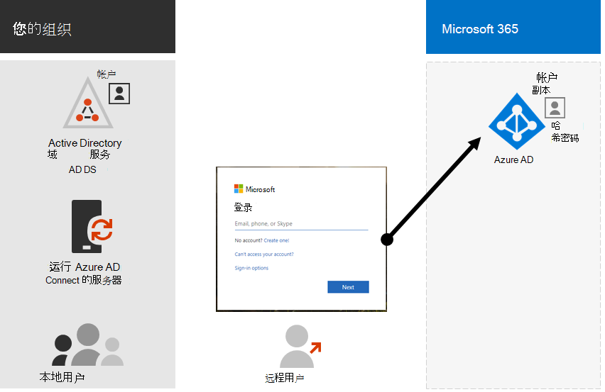
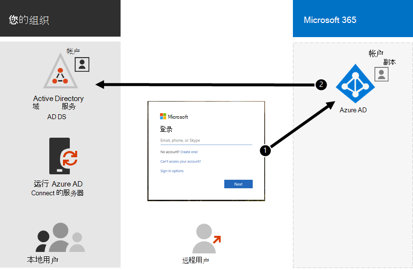

# 混合标识和目录同步Microsoft 365

*此文章适用于 Microsoft 365 企业版和 Office 365 企业版。* 

混合标识模型和目录同步是采用混合标识的企业客户最常用的选择，具体取决于业务需求和技术Microsoft 365。 目录同步允许你管理 Active Directory 域服务 (AD DS) 中的标识，并且用户帐户、组和联系人的所有更新将同步到 Microsoft 365 订阅的 Azure Active Directory (Azure AD) 租户。

>[!Note]
>首次同步 AD DS 用户帐户时，不会自动为其分配 Microsoft 365 许可证，并且无法访问 Microsoft 365 服务（如电子邮件）。 您必须先为其分配使用位置。 然后，通过组成员身份单独或动态地向这些用户帐户分配许可证。
>

## 混合标识的身份验证

使用混合标识模型时有两种类型的身份验证：

- 托管身份验证

  Azure AD 使用本地存储的密码哈希版本处理身份验证过程，或将凭据发送到本地软件代理，由本地 AD DS 进行身份验证。

- 联合身份验证

  Azure AD 将请求身份验证的客户端计算机重定向到另一个标识提供程序。

### 托管身份验证

有两种类型的托管身份验证：

- PHS (密码哈希) 

  Azure AD 执行身份验证本身。

- 直通身份验证 (PTA)

  Azure AD 具有 AD DS 来执行身份验证。

#### PHS (密码哈希) 

借助 PHS，你可以将 AD DS 用户帐户Microsoft 365并在本地管理用户。 用户密码哈希从 AD DS 同步到 Azure AD，以便用户在本地和云中具有相同的密码。 这是在 Azure AD 中启用 AD DS 标识身份验证的最简单方法。 

在本地更改或重置密码时，新的密码哈希将同步到 Azure AD，以便你的用户始终可以使用相同的密码来访问云资源和本地资源。 用户密码从不发送到 Azure AD 或以纯文本存储在 Azure AD 中。 Azure AD 的一些高级功能（如 Identity Protection）需要 PHS，而不考虑选择哪种身份验证方法。
  
有关详细信息 [，请参阅选择正确的](/azure/active-directory/hybrid/choose-ad-authn) 身份验证方法。
  
#### 直通身份验证 (PTA)

PTA 使用一个或多个本地服务器上运行的软件代理，为 Azure AD 身份验证服务提供简单的密码验证，以直接使用 AD DS 验证用户。 借助 PTA，你可以将 AD DS 用户帐户Microsoft 365本地管理用户。 

PTA 允许用户使用本地帐户和密码登录到本地和 Microsoft 365 资源和应用程序。 此配置直接针对本地 AD DS 验证用户密码，而无需在 Azure AD 中存储密码哈希。 

PTA 还适用于具有立即强制执行本地用户帐户状态、密码策略和登录时间的安全要求的组织。 
  
有关详细信息 [，请参阅选择正确的](/azure/active-directory/hybrid/choose-ad-authn) 身份验证方法。
  
### 联合身份验证

联合身份验证主要用于身份验证要求更复杂的大型企业组织。 AD DS 标识与Microsoft 365同步，并且用户帐户在本地管理。 使用联合身份验证，用户在本地和云中具有相同的密码，他们不需要再次登录，就可使用Microsoft 365。 

联合身份验证可以支持其他身份验证要求，如基于智能卡的身份验证或第三方多重身份验证，当组织具有 Azure AD 不支持的身份验证要求时，通常需要此要求。
 
有关详细信息 [，请参阅选择正确的](/azure/active-directory/hybrid/choose-ad-authn) 身份验证方法。
  
#### 第三方身份验证和标识提供程序

本地目录对象可以同步到Microsoft 365并且云资源访问主要由 IdP (第三方标识) 。 如果组织使用第三方联合解决方案，可以使用该解决方案为 Microsoft 365 配置登录，但第三方联合解决方案与 Azure AD 兼容。
  
有关详细信息，请参阅 [Azure AD 联合兼容性](/azure/active-directory/connect/active-directory-aadconnect-federation-compatibility) 列表。
  
## AD DS 准备

为了帮助确保使用同步无缝Microsoft 365，必须在开始部署目录同步之前准备 AD DS Microsoft 365部署。
  
目录准备应专注于以下任务：

- 删除重复 **的 proxyAddress** 和 **userPrincipalName** 属性。
- 使用有效的 **userPrincipalName** 属性更新空和无效 **的 userPrincipalName** 属性。
- 删除 **givenName、surname** **( sn** ) 、sAMAccountName、displayName、mail、proxyAddresses、mailNickname 和 **userPrincipalName** 属性中的无效和问题字符。     有关准备属性的详细信息，请参阅由同步工具同步Azure Active Directory[列表](https://go.microsoft.com/fwlink/p/?LinkId=396719)。

    > [!NOTE]
    > 这些属性与 Azure AD 同步连接相同。 
  
## 多林部署注意事项

对于多个林和 SSO 选项，请使用[Azure AD](/azure/active-directory/hybrid/how-to-connect-install-custom)自定义连接。
  
如果您的组织具有多个用于身份验证的林 (登录) ，我们强烈建议您执行以下操作：
  
- **请考虑合并林。** 通常，维护多个林需要更多开销。 除非贵组织的安全约束规定需要单独的林，否则请考虑简化您的本地环境。
- **仅在主登录林中使用。** 请考虑仅在Microsoft 365登录林中部署客户端，以初始部署Microsoft 365。 

如果无法合并多林 AD DS 部署或正在使用其他目录服务来管理标识，则可以通过 Microsoft 或合作伙伴的帮助来同步这些部署。
  
有关详细信息[，请参阅 Azure AD 连接](/azure/active-directory/hybrid/plan-connect-topologies)拓扑。
  
## 依赖于目录同步的功能
  
以下特性和功能需要目录同步：
  
- Azure AD 无缝单Sign-On (SSO) 
- Skype共存
- Exchange混合部署，包括：
  - 在本地环境与 (之间) 全局地址列表Exchange GAL Microsoft 365。
  - 同步不同邮件系统中的 GAL 信息。
  - 在服务产品中添加用户以及从服务Microsoft 365用户的能力。 这要求：
  - 在目录同步设置过程中必须配置双向同步。 默认情况下，目录同步工具仅将目录信息写入云。 配置双向同步时，将启用写回功能，以便从云中复制有限数量的对象属性，然后将这些属性写回本地 AD DS。 回写也称为Exchange模式。 
  - 内部部署Exchange混合部署
  - 将一些用户邮箱移动到 Microsoft 365同时将其他用户邮箱保留在本地的能力。
  - 保险箱将本地发件人和阻止的发件人复制到Microsoft 365。
  - 基本委托和代表发送电子邮件功能。
  - 你拥有集成的本地智能卡或多重身份验证解决方案。
- 同步照片、缩略图、会议室和安全组

## 后续步骤

准备好部署混合标识时，请参阅 [准备目录同步](prepare-for-directory-synchronization.md)。
