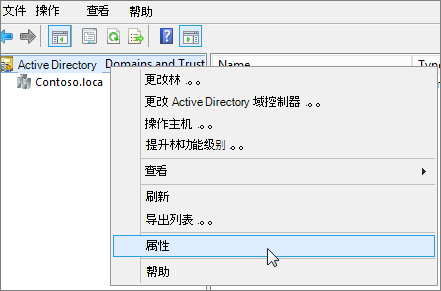

# <a name="prepare-a-non-routable-domain-for-directory-synchronization"></a>准备不可路由域以进行目录同步

当您将本地目录与 Microsoft 365 同步时，您必须在 Azure Active Directory (Azure AD) 中拥有一个已验证的域。 仅同步 (AD DS) 本地 Active Directory 域服务关联的用户主体 (AD DS) UPN。 但是，任何包含不可路由域的 UPN（如".local" (示例：billa@contoso.local) ）都将同步到 .onmicrosoft.com 域 (示例：billa@contoso.onmicrosoft.com) 。 

如果当前对 AD DS 中的用户帐户使用".local"域，建议将其更改为使用验证域（如 billa@contoso.com）以便与 Microsoft 365 域正确同步。
  
## <a name="what-if-i-only-have-a-local-on-premises-domain"></a>如果我只有".local"本地域，应该怎么做？

可使用Azure AD 连接将 AD DS 同步到 Azure AD 租户的 Microsoft 365 租户。 有关详细信息，请参阅[将本地](/azure/architecture/reference-architectures/identity/azure-ad)标识与Azure AD。
  
Azure AD 连接同步用户的 UPN 和密码，以便用户可以使用他们在本地使用的相同凭据登录。 但是，Azure AD 连接将用户同步到由用户验证的Microsoft 365。 这意味着该域也由管理员Azure AD，Microsoft 365由管理员Azure AD。 换句话说，该域必须是有效的 Internet 域 (例如 .com、.org、.net、.us) 。 如果内部 AD DS 仅使用不可路由的域 (例如，".local") ，这可能与你的 Microsoft 365 租户的已验证域不匹配。 可以通过在本地 AD DS 中更改主域或添加一个或多个 UPN 后缀来解决此问题。
  
### <a name="change-your-primary-domain"></a>更改主域

将主域更改为已验证的域Microsoft 365例如，contoso.com。 然后，将拥有域 contoso.local 的每个用户更新为 contoso.com。 但是，这是一个涉及的过程，下一节将介绍一个更简单的解决方案。
  
### <a name="add-upn-suffixes-and-update-your-users-to-them"></a>添加 UPN 后缀并更新用户

您可以通过在 AD DS 中注册新的 UPN 后缀来匹配在 Microsoft 365 中验证的域 (或域) ".local"问题。 注册新后缀后，更新用户 UPN 以将".local"替换为新的域名，例如，使用户帐户看起来像 billa@contoso.com。
  
更新 UPN 以使用已验证域后，即可将本地 AD DS 与 Microsoft 365。
  
#### <a name="step-1-add-the-new-upn-suffix"></a>步骤 1：添加新的 UPN 后缀**
  
1. 在 AD DS 域控制器上，在服务器管理器中选择" **工具** \> **""Active Directory 域和信任"**。
    
    **或者，如果你没有Windows Server 2012**
    
    按 **Windows键 + R** 打开 **"运行**"对话框，然后在 Domain.msc 中键入，然后选择"确定 **"**。
    
    
  
2. 在 **"Active Directory 域和信任"** 窗口中，右键单击 **"Active Directory 域和** 信任"，然后选择"属性 **"**。
    
    
  
3. 在 **"UPN 后缀"** 选项卡上的"备用 **UPN** 后缀"框中，键入新的 UPN 后缀，然后选择" **添加应用** \> **"**。
    
    
  
    添加 **完** 后缀后，选择"确定"。 
    
 #### <a name="step-2-change-the-upn-suffix-for-existing-users"></a>步骤 2：更改现有用户的 UPN 后缀
  
1. 在 AD DS 域控制器上，在服务器管理器中选择" **工具** \> **""Active Directory 用户和计算机"**。
    
    **或者，如果你没有Windows Server 2012**
    
    按 **Windows 键 + R** 打开"**运行**"对话框，然后在 Dsa.msc 中键入 ，然后单击"确定 **"**
    
2. 选择一个用户，右键单击，然后选择"属性 **"**。
    
3. 在" **帐户** "选项卡上的"UPN 后缀"下拉列表中，选择新的 UPN 后缀，然后选择"确定 **"**。
    
    
  
4. 为每个用户完成这些步骤。
    
   
### <a name="use-powershell-to-change-the-upn-suffix-for-all-of-your-users"></a>使用 PowerShell 更改所有用户的 UPN 后缀

如果您有许多要更新的用户帐户，则使用 PowerShell 会更加简单。 以下示例使用 cmdlet [Get-ADUser](/previous-versions/windows/it-pro/windows-server-2008-R2-and-2008/ee617241(v=technet.10)) 和 [Set-ADUser](/previous-versions/windows/it-pro/windows-server-2008-R2-and-2008/ee617215(v=technet.10)) 将所有 contoso.local 后缀更改为 contoso.com AD DS 中的后缀。 

例如，可以运行以下 PowerShell 命令，将所有 contoso.local 后缀更新为 contoso.com：
    
  ```powershell
  $LocalUsers = Get-ADUser -Filter "UserPrincipalName -like '*contoso.local'" -Properties userPrincipalName -ResultSetSize $null
  $LocalUsers | foreach {$newUpn = $_.UserPrincipalName.Replace("@contoso.local","@contoso.com"); $_ | Set-ADUser -UserPrincipalName $newUpn}
  ```

请参阅 [Active Directory Windows PowerShell](/previous-versions/windows/it-pro/windows-server-2008-R2-and-2008/ee617195(v=technet.10))模块，了解有关在 AD DS Windows PowerShell应用程序功能。