# 恢复用户邮箱中的已删除项目

**本文适用于管理员。您是否正在尝试恢复您自己的邮箱中的已删除邮件？** 尝试执行下列操作之一：
- [在 Outlook for Windows 中恢复已删除项目](https://support.office.com/article/49e81f3c-c8f4-4426-a0b9-c0fd751d48ce)
- [在 Outlook Web App 中恢复已删除项目或电子邮件](https://support.office.com/article/c3d8fc15-eeef-4f1c-81df-e27964b7edd4)
- [在 web 上的 Outlook 中还原已删除的电子邮件](https://support.office.com/article/a8ca78ac-4721-4066-95dd-571842e9fb11)
- [Outlook.com](https://go.microsoft.com/fwlink/p/?LinkID=623435)
   
用户是否从其 Outlook 邮箱中永久删除了项目？ 用户希望它们回退，但无法恢复它们。 如果清除的项目尚未从用户的邮箱中永久删除，则可以恢复这些清除的项目。 为此，可以使用 Exchange Online 中的就地电子数据展示工具在用户邮箱中搜索已删除的电子邮件和其他项目（如联系人、日历约会和任务）。 如果找到已删除的项目，则可以将其导出到 PST 文件 (也称为 Outlook 数据文件) ，然后用户可以使用该文件将项目还原回其邮箱。
  
以下是恢复用户邮箱中已删除项目的步骤。 这将花费多长时间？ 第一次可能需要20或30分钟才能完成所有步骤，具体取决于尝试恢复的项目数。
  
> [!NOTE]
> 您必须是 Microsoft 365 中的 **Exchange 管理员** 或 **全局管理员** ，或者是 exchange Online 中的 "组织管理" 角色组的成员，才能执行本文中的步骤。 有关详细信息，请参阅[关于 Microsoft 365 管理员角色](https://support.office.com/article/da585eea-f576-4f55-a1e0-87090b6aaa9d)。 
  
## 步骤1：为自己分配电子数据展示权限

第一步是在 Exchange Online 中为自己分配必要的权限，以便您可以使用就地电子数据展示工具搜索用户的邮箱。 只需执行一次此操作。 如果您需要在将来搜索另一个邮箱，可以跳过此步骤。
  
1. 在何处登录到使用工作或学校帐户的[Microsoft 365 的公司](https://support.microsoft.com/office/where-to-sign-into-microsoft-365-for-business-e9eb7d51-5430-4929-91ab-6157c5a050b4)。 
    
2. 在左上角的 Microsoft 365 中选择应用启动器图标，  然后单击 " **管理**"。
    
3. 在 Microsoft 365 管理中心的左侧导航中，展开 " **管理中心**"，然后单击 " **Exchange**"。
    
    
  
4. 在 Exchange 管理中心中，单击 " **权限**"，然后单击 " **管理角色**"。
    
5. 在列表视图中，选择 "**发现管理**"，然后单击 "**编辑**  。
    
    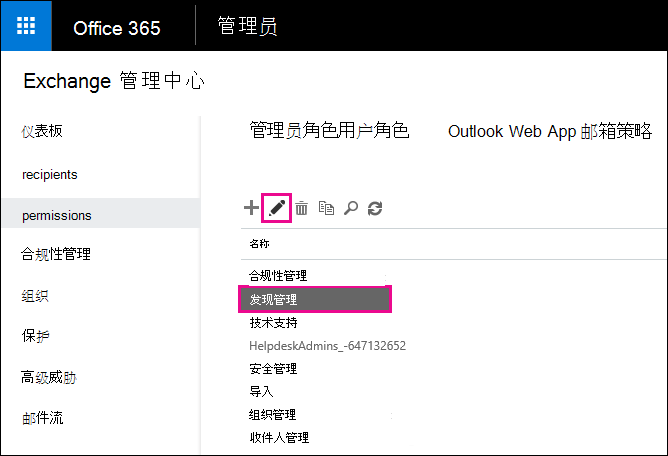
  
6. 在 "**角色组**" 中的 "**成员**" 下，单击 "**添加**  。
    
7. 在 " **选择成员**" 中，从名称列表中选择自己，单击 " **添加**"，然后单击 **"确定"**。
    
    > [!NOTE]
    > 您还可以添加您所属的组，例如 "组织管理" 或 "TenantAdmins"。 如果添加一个组，则会向该组的其他成员分配运行就地电子数据展示工具所需的权限。 
  
8. 在 " **角色组**" 中，单击 " **保存**"。
    
9. 注销 Microsoft 365。
    
    必须先注销，然后才能开始下一步，以便新权限生效。
    
> [!CAUTION]
> 发现管理角色组的成员可以访问敏感邮件内容。 这包括搜索组织中的所有邮箱、预览搜索结果 (和其他邮箱项目) 、将结果复制到发现邮箱，以及将搜索结果导出到 PST 文件。 
  
[Return to top](recover-deleted-items-in-a-mailbox.md)
  
## 步骤2：在用户的邮箱中搜索已删除的项目

当您运行就地电子数据展示搜索时，搜索中的邮箱中的 "可恢复的项目" 文件夹将自动包含在搜索中。 "可恢复的项目" 文件夹是指永久删除的项目在被清除 (从邮箱中永久删除) 之前的存储位置。 因此，如果尚未清除某个项目，则应该能够使用就地电子数据展示工具找到它。
  
1. 在何处登录到使用工作或学校帐户的[Microsoft 365 的公司](https://support.microsoft.com/office/where-to-sign-into-microsoft-365-for-business-e9eb7d51-5430-4929-91ab-6157c5a050b4)。 
    
2. 在左上角的 Microsoft 365 中选择应用启动器图标，  然后单击 " **管理**"。
    
3. 在 Microsoft 365 管理中心的左侧导航中，展开 " **管理员**"，然后单击 " **Exchange**"。
    
4. 在 Exchange 管理中心中，单击 "**合规性管理**"，单击 "**就地电子数据展示 &amp; 保留**"，然后单击 "**新建**  。
    
    
  
5. 在 " **名称和说明** " 页上，键入搜索 (的名称，例如，要恢复其电子邮件的用户的名称) 的名称，可选说明，然后单击 " **下一步**"。
    
6. 在 "**邮箱**" 页上，单击 "**指定要搜索的邮箱**"，然后单击 "**添加**" "添加"  。
    
    
  
7. 查找并选择要恢复已删除电子邮件的用户的名称，单击 " **添加**"，然后单击 **"确定"**。
    
8. 单击“**下一步**”。
    
    将显示 " **搜索查询** " 页。 你可以在此处定义搜索条件，以帮助你查找用户邮箱中缺少的项目。 
    
9. 在“搜索查询”**** 页上，填写下列字段： 
    
  - **包含所有内容** 选择此选项可将用户邮箱中的所有内容包含在搜索结果中。 如果您选择此选项，则无法指定其他搜索条件。 
    
  - **基于条件进行筛选** 选择此选项以指定搜索条件，包括关键词、开始和结束日期、发件人和收件人地址以及邮件类型。 
    
    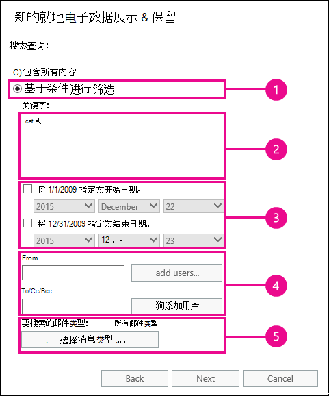
  
|**Field**|**使用以下各 .。。**|
|:-----|:-----|
|             |指定关键字、日期范围、收件人和邮件类型。    |
|             |搜索带关键字或短语的邮件，并使用逻辑运算符（如 **and** 或 **or**）。    |
|             |搜索在某个日期范围内发送或接收的邮件。    |
|             |搜索从特定人员接收或发送的邮件。    |
|             |搜索所有邮件类型或选择特定的邮件类型。    |
   
   > [!TIP]
   >  以下是有关如何构建搜索查询以查找缺失项目的一些提示。 尝试从用户处获取尽可能多的信息，以帮助您创建搜索查询，以便您可以找到要查找的内容。 如果您不确定如何查找缺失的邮件，请考虑使用 " **包括所有内容** " 选项。 搜索结果将包含用户的 "可恢复的项目" 文件夹中的所有项目，包括隐藏文件夹 (称为 "清除文件夹") 包含已被用户清除的项目。 然后，您可以转到步骤3，将结果复制到发现邮箱，并查看隐藏文件夹中的邮件。 如果您知道用户最初何时发送或接收丢失的邮件，请使用 " **指定开始日期** " 和 " **指定结束日期** " 选项提供日期范围。 这将返回该日期范围内用户发送或接收的所有邮件。 指定日期范围是缩小搜索结果范围的一种非常好的方法。 如果您知道缺少的电子邮件的发件人，请使用 " **发** 件人" 框指定此发件人。 如果要将搜索结果缩小为不同类型的邮箱项目，请单击 " **选择邮件类型**"，单击 **"选择要搜索的邮件类型**"，然后选择要搜索的特定邮件类型。 例如，可以仅搜索日历项目或联系人。 以下是您可以搜索的不同邮件类型的屏幕截图。默认值为搜索所有邮件类型。 
  
   完成**搜索查询**页后，单击 "**下一步**"。 
    
10. 在 " **就地保留设置** " 页上，单击 " **完成** " 以启动搜索。 若要恢复已删除的电子邮件，没有理由将用户的邮箱置于保留状态。 
    
    启动搜索后，Exchange 将根据您指定的条件显示搜索将返回的总大小和项目数的估计值。
    
11. 选择刚刚创建的搜索，然后单击 "**刷新**  以更新详细信息窗格中显示的信息。 " **估计成功** 状态" 指示搜索已完成。 Exchange 还会根据您在步骤9中指定的搜索条件，在搜索找到的项目总数 (及其大小) 中显示估计。 
    
12. 在 "详细信息" 窗格中，单击 " **预览搜索结果** " 以查看找到的项目。 这可能会帮助您确定要查找的项目 (s) 。 如果您在尝试恢复时发现项目 (s) ，请转到步骤4，将搜索结果导出到 PST 文件。 
    
    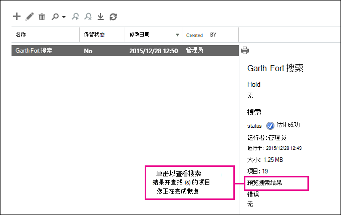
  
13. 如果找不到您要查找的内容，可以通过选择搜索，单击 "**编辑**  "，然后单击 "**搜索查询**" 来修改搜索条件。 更改搜索条件，然后重新运行搜索。
    
[Return to top](recover-deleted-items-in-a-mailbox.md)
  
##  (可选) 步骤3：将搜索结果复制到发现邮箱

如果您无法通过预览搜索结果找到项目，或者如果您想要查看用户的 "可恢复的项目" 文件夹中的项目，则可以将搜索结果复制到名为 "发现邮箱" 的特殊邮箱 () 然后在 web 上的 Outlook 中打开该邮箱以查看实际项目。 复制搜索结果的最佳原因是，您可以查看用户的 "可恢复的项目" 文件夹中的项目。 您尝试恢复的项目很可能位于 "清除" 子文件夹中。 
  
1. 在 Exchange 管理中心中，转到 " **合规性管理**就地 \> **电子数据展示 &amp; 保留**"。
    
2. 在搜索列表中，选择您在步骤2中创建的搜索。
    
3. 单击 "**搜索**  "，然后从下拉列表中单击 "**复制搜索结果**"。 
    
    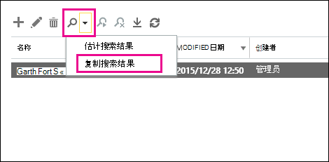
  
4. 在 " **复制搜索结果** " 页上，单击 " **浏览**"。
    
    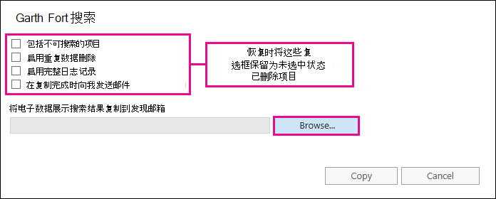
  
5. 在 " **显示名称**" 下，单击 " **发现搜索邮箱**"，然后单击 **"确定"**。
    
    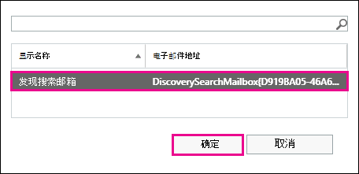
  
    > [!NOTE]
    > 发现搜索邮箱是在 Microsoft 365 组织中自动创建的默认发现邮箱。 
  
6. 返回到 " **复制搜索结果** " 页上，单击 " **复制** " 以开始将搜索结果复制到发现搜索邮箱的过程。 
    
    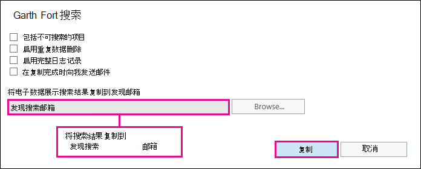
  
7. 单击 "**刷新**  以更新有关显示在详细信息窗格中的复制状态的信息。 
    
8. 复制完成后，单击 " **打开** " 以打开 "发现搜索" 邮箱查看搜索结果。 
    
    
  
    复制到发现搜索邮箱的搜索结果放置在与就地电子数据展示搜索同名的文件夹中。 您可以单击一个文件夹以显示该文件夹中的项目。
    
    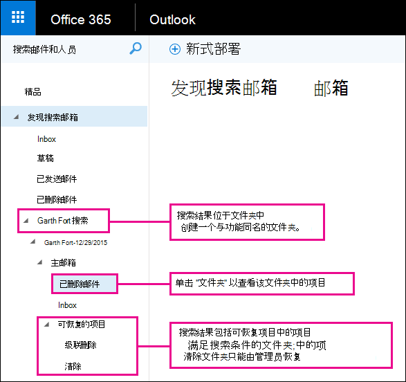
  
    运行搜索时，也会搜索用户的 "可恢复的项目" 文件夹。 这意味着，如果 "可恢复的项目" 文件夹中的项目满足搜索条件，则这些项目将包含在搜索结果中。 "删除邮件" 文件夹中的项目是指用户通过从 "已删除邮件" 文件夹中删除项目或通过选择它并按 **Shift + Delete** (永久删除的项目。 用户可以使用 Outlook 或 web 上的 Outlook 中的 "恢复已删除邮件" 工具恢复删除文件夹中的项目。 "清除" 文件夹中的项目是用户使用 "恢复已删除项目" 工具清除的项目，或者是应用于邮箱的策略自动清除的项目。 在这两种情况下，只有管理员才能恢复 "清除" 文件夹中的项目。 
    
    > [!TIP]
    > 如果用户无法使用 "可恢复的项目" 工具找到已删除的项目，但该项目仍是可恢复的 (意味着它没有从邮箱) 中永久删除，则很可能位于 "清除" 文件夹中。 因此，请务必在 "清除" 文件夹中查找要为用户尝试恢复的已删除项目。 
  
[Return to top](recover-deleted-items-in-a-mailbox.md)
  
## 步骤4：将搜索结果导出到 PST 文件

在您找到要为用户尝试恢复的项目后，下一步是将在步骤2中运行的搜索的结果导出到 PST 文件。 用户将在下一步中使用此 PST 文件，将已删除的项目还原到其邮箱。
  
1. 在 Exchange 管理中心中，转到 " **合规性管理**就地 \> **电子数据展示 &amp; 保留**"。
    
2. 在搜索列表中，选择您在步骤2中创建的搜索。
    
3. 单击 " **导出到 PST 文件**"。
    
    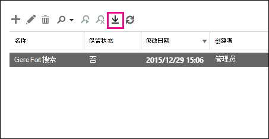
  
4. 如果系统提示您安装电子数据展示导出工具，请单击 " **运行**"。
    
5. 在 "电子数据展示 PST 导出" 工具中，单击 " **浏览** " 以指定要下载 PST 文件的位置。 
    
    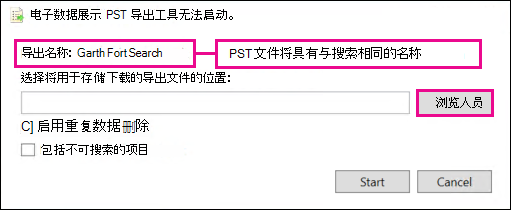
  
    您可以忽略选项以启用重复数据删除并包括不可搜索项目。
    
6. 单击 " **开始** " 将 PST 文件下载到您的计算机。 
    
    **电子数据展示 PST 导出工具**显示有关导出过程的状态信息。 导出完成后，可以在文件的下载位置访问该文件。 
    
[Return to top](recover-deleted-items-in-a-mailbox.md)
  
## 步骤5：将已恢复的项目还原到用户的邮箱

最后一步是使用在步骤4中导出的 PST 文件将已恢复的项目还原到用户的邮箱中。 将 PST 文件发送给用户后，用户将执行此步骤的其余部分，以打开 PST 文件，然后将恢复的项目移至其邮箱中的其他文件夹。 对于分步说明，您还可以向用户发送指向此主题的链接： [打开和关闭 Outlook 数据文件 ( .pst) ](https://support.office.com/article/381b776d-7511-45a0-953a-0935c79d24f2)。 或者，您可以使用下面的 "PST 文件" 部分向用户发送一个指向 " [还原已删除邮件](recover-deleted-items-in-a-mailbox.md#restoredeleteditems) " 的链接，并要求他们执行这些步骤。 
  
 **将 PST 文件发送给用户**
  
需要执行的最后一步是将在步骤4中导出的 PST 文件发送给用户。 有几种方法可以实现此目的：
  
- 将 PST 文件附加到电子邮件。 如果将 Outlook 配置为阻止 PST 文件，则必须压缩该文件，然后将其附加到邮件中。 操作步骤如下：
    
1. 在 Windows 资源管理器或文件资源管理器中，浏览到 PST 文件。
    
2. 右键单击该文件，然后选择 " **发送到** \> **压缩 (压缩) " 文件夹**。 Windows 将创建一个新的 zip 文件，并为其提供与 PST 文件相同的名称。
    
3. 将压缩的 PST 文件附加到电子邮件，并将其发送给用户，然后可以通过单击该文件来对其进行解压缩。
    
- 将 PST 文件复制到用户可访问和检索的共享文件夹。
    
下一节中的步骤由用户执行，以将已删除的项目还原到其邮箱。
  
 
**使用 PST 文件将已删除邮件还原到邮箱**
  
您必须使用 Outlook 桌面应用程序使用 PST 文件还原已删除的项目。 您不能使用 Outlook Web App 或 Web 上的 Outlook 打开 PST 文件。
  
1. 在 Outlook 2013 或 Outlook 2016 中，单击 " **文件** " 选项卡。 
    
2. 单击 " **打开 &amp; 导出**"，然后单击 " **打开 Outlook 数据文件**"。
    
3. 浏览到您保存管理员发送的 PST 文件的位置。
    
4. 选择该 PST，然后单击 " **打开**"。
    
    PST 文件显示在 Outlook 的左侧导航栏中。
    
    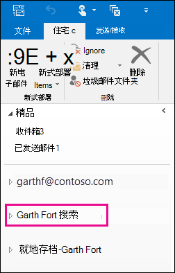
  
5. 单击箭头以展开 PST 文件以及它下面的文件夹，找到要恢复的项目。
    
    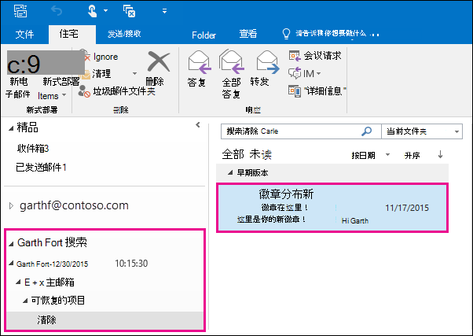
  
    > [!TIP]
    > 在 "清除" 文件夹中查找要恢复的项目。 这是清除的项目移至的隐藏文件夹。 您的管理员恢复的项目很可能在此文件夹中。 
  
6. 右键单击要恢复的项目，然后单击 " **移动** \> **其他文件夹**"。
    
    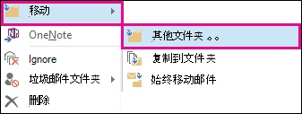
  
7. 若要将项目移到收件箱中，请单击 **"收件箱**"，然后单击 **"确定"**。
    
    **提示：** 若要恢复其他类型的项目，请执行下列操作之一： 
    
  - 若要恢复日历项目，请右键单击该项目，然后单击 " **移动** \> **其他文件夹** \> **日历**"。
    
  - 若要恢复某个联系人，请右键单击该联系人，然后单击 " **移动** \> **其他文件夹** \> **联系人**"。
    
  - 若要恢复某个任务，请右键单击该任务，然后单击 " **移动** \> **其他文件夹** \> **任务**"。
    
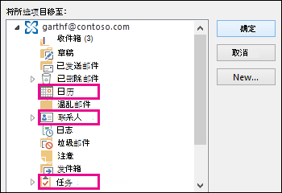
  
   > [!NOTE]
   > 日历项目、联系人和任务直接位于 "清除" 文件夹中，而不是在 "日历"、"联系人" 或 "任务" 子文件夹中。 不过，您可以按 **类型** 进行排序，以将相似类型的项目分组。 
    
8. 完成恢复已删除项目后，右键单击左侧导航栏中的 PST 文件，然后选择 **"关闭" "pst 文件的名称"**。
    
[Return to top](recover-deleted-items-in-a-mailbox.md)
  
## 详细信息

- 如果项目的已删除项目保留期尚未过期，则用户可能会恢复永久删除的项目。 作为管理员，您可能已指定 "可恢复的项目" 文件夹中的项目可用于恢复的时间。 例如，可能存在一个策略，用于删除用户的 "已删除邮件" 文件夹中的30天内的任何内容，以及允许用户将 "可恢复的项目" 文件夹中的项目恢复到另一个14天的其他策略。 但是，在此14天之后，您可能仍可以使用本主题中的过程恢复用户邮箱中的项目。
    
- 如果项目尚未清除且已删除项目的保留期尚未过期，则用户可以恢复已删除项目。 若要帮助用户恢复邮箱中的已删除邮件，请将其指向下列主题之一：
    
  - [在 Outlook for Windows 中恢复已删除项目](https://support.office.com/article/49e81f3c-c8f4-4426-a0b9-c0fd751d48ce)
    
  - [在 Outlook 2010 中恢复已删除邮件](https://support.office.com/article/cd9dfe12-8e8c-4a21-bbbf-4bd103a3f1fe)
    
  - [在 Outlook Web App 中恢复已删除项目或电子邮件](https://support.office.com/article/c3d8fc15-eeef-4f1c-81df-e27964b7edd4)
    
  - [在 web 上的 Outlook 中还原已删除的电子邮件](https://support.office.com/article/a8ca78ac-4721-4066-95dd-571842e9fb11)
    
  - [在 Outlook 中恢复已删除的联系人](https://support.office.com/article/51c83288-6888-4dcd-8c99-4932daabf643)
    
  - [在 Outlook.com 中还原已删除的电子邮件](https://go.microsoft.com/fwlink/p/?LinkID=623435)
    
[Return to top](recover-deleted-items-in-a-mailbox.md)
  

