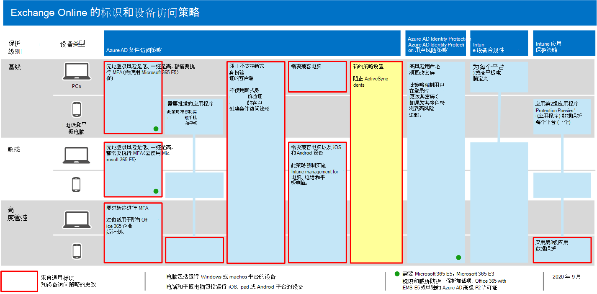

# 用于保护电子邮件的策略建议Policy recommendations for securing email

本文介绍如何实现建议的标识和设备访问策略，以保护支持新式身份验证和条件访问的组织电子邮件和电子邮件客户端。This article describes how to implement the recommended identity and device access policies to protect organizational email and email clients that support modern authentication and conditional access. 本指南建立在 [通用标识和设备访问策略](identity-access-policies.md) 之上，还包括一些其他建议。This guidance builds on the [Common identity and device access policies](identity-access-policies.md) and also includes a few additional recommendations.

这些建议基于三种不同的安全性和保护层，可根据您需求的粒度进行应用： **比较基准**、 **敏感**和 **高度管控**。These recommendations are based on three different tiers of security and protection that can be applied based on the granularity of your needs: **baseline**, **sensitive**, and **highly regulated**. You can learn more about these security tiers, and the recommended client operating systems, referenced by these recommendations in the [recommended security policies and configurations introduction](microsoft-365-policies-configurations.md).You can learn more about these security tiers, and the recommended client operating systems, referenced by these recommendations in the [recommended security policies and configurations introduction](microsoft-365-policies-configurations.md).

这些建议要求用户使用新式电子邮件客户端，包括移动设备上的 Outlook for iOS 和 Outlook for Android。These recommendations require your users to use modern email clients, including Outlook for iOS and Android on mobile devices. 适用于 iOS 和 Android 的 Outlook 提供了对 Office 365 最佳功能的支持。Outlook for iOS and Android provide support for the best features of Office 365. 这些移动 Outlook 应用程序还使用支持移动使用的安全功能以及与其他 Microsoft 云安全功能配合使用的安全功能。These mobile Outlook apps are also architected with security capabilities that support mobile use and work together with other Microsoft cloud security capabilities. 有关详细信息，请参阅 [Outlook For iOS 和 ANDROID FAQ](https://docs.microsoft.com/exchange/clients-and-mobile-in-exchange-online/outlook-for-ios-and-android/outlook-for-ios-and-android-faq)。For more information, see [Outlook for iOS and Android FAQ](https://docs.microsoft.com/exchange/clients-and-mobile-in-exchange-online/outlook-for-ios-and-android/outlook-for-ios-and-android-faq).

## 更新常见策略以包含电子邮件Updating common policies to include email

为了保护电子邮件，下图说明了要从通用标识和设备访问策略中更新的策略。To protect email, the following diagram illustrates which policies to update from the the common identity and device access policies.

[查看此图像的更大版本See a larger version of this image](https://github.com/MicrosoftDocs/microsoft-365-docs/raw/public/microsoft-365/media/microsoft-365-policies-configurations/identity-access-ruleset-mail.png)

请注意，为 Exchange Online 添加新策略以阻止 ActiveSync 客户端。Note the addition of a new policy for Exchange Online to block ActiveSync clients. 这将强制使用 Outlook mobile。This forces the use of Outlook mobile.

如果在设置 Exchange Online 和 Outlook 时将其包含在策略范围中，则只需创建新策略来阻止 ActiveSync 客户端。If you included Exchange Online and Outlook in the scope of the policies when you set them up, you only need to create the new policy to block ActiveSync clients. 查看下表中列出的策略，并执行建议的添加项，或者确认是否已包含这些策略。Review the policies listed in the following table and either make the recommended additions, or confirm that these are already included. 每个策略链接到 [常见标识和设备访问策略](identity-access-policies.md)中的关联配置说明。Each policy links to the associated configuration instructions in [Common identity and device access policies](identity-access-policies.md).

|保护级别Protection level|策略Policies|详细信息More information|
|:---------------|:-------|:----------------|
|**Baseline****Baseline**|[当登录风险为 "*中*" 或 "*高*" 时，需要进行 MFARequire MFA when sign-in risk is *medium* or *high*](identity-access-policies.md#require-mfa-based-on-sign-in-risk)|在云应用的分配中包括 Exchange OnlineInclude Exchange Online in the assignment of cloud apps|
|        |[阻止不支持新式身份验证的客户端Block clients that don't support modern authentication](identity-access-policies.md#block-clients-that-dont-support-modern-authentication)|在云应用的分配中包括 Exchange OnlineInclude Exchange Online in the assignment of cloud apps|
|        |[应用应用数据保护策略Apply APP data protection policies](identity-access-policies.md#apply-app-data-protection-policies)|确保 Outlook 包含在应用程序列表中。Be sure Outlook is included in the list of apps. 请务必为每个平台 (iOS、Android、Windows) 更新策略Be sure to update the policy for each platform (iOS, Android, Windows)|
|        |[需要经批准的应用和应用保护Require approved apps and APP protection](identity-access-policies.md#require-approved-apps-and-app-protection)|在云应用列表中包括 Exchange OnlineInclude Exchange Online in the list of cloud apps|
|        |[需要兼容电脑Require compliant PCs](identity-access-policies.md#require-compliant-pcs-but-not-compliant-phones-and-tablets)|在云应用列表中加入 Exchange OnlineInclude Exchange Online in list of cloud apps|
|        |[阻止 ActiveSync 客户端Block ActiveSync clients](#block-activesync-clients)|添加此新策略Add this new policy| 
|**敏感****Sensitive**|[当登录风险为*低*、*中*或*高*时，需要进行 MFARequire MFA when sign-in risk is *low*, *medium* or *high*](identity-access-policies.md#require-mfa-based-on-sign-in-risk)| 在云应用的分配中包括 Exchange OnlineInclude Exchange Online in the assignment of cloud apps|
|         |[需要符合要求 *的 pc 和* 移动设备Require compliant PCs *and* mobile devices](identity-access-policies.md#require-compliant-pcs-and-mobile-devices)|在云应用列表中包括 Exchange OnlineInclude Exchange Online in the list of cloud apps|
|**高度管控****Highly regulated**|[*始终* 要求进行 MFA*Always* require MFA](identity-access-policies.md#require-mfa-based-on-sign-in-risk)|在云应用的分配中包括 Exchange OnlineInclude Exchange Online in the assignment of cloud apps|

## 阻止 ActiveSync 客户端Block ActiveSync clients

此策略将阻止 ActiveSync 客户端绕过其他条件访问策略。This policy prevents ActiveSync clients from bypassing other Conditional Access policies. 策略配置仅适用于 ActiveSync 客户端。The policy configuration applies only to ActiveSync clients. 通过选择 " **[需要应用保护策略](https://docs.microsoft.com/azure/active-directory/conditional-access/concept-conditional-access-grant#require-app-protection-policy)**"，此策略将阻止 ActiveSync 客户端。By selecting **[Require app protection policy](https://docs.microsoft.com/azure/active-directory/conditional-access/concept-conditional-access-grant#require-app-protection-policy)**, this policy blocks ActiveSync clients. 有关创建此策略的详细信息，请参阅 [需要使用条件访问的云应用访问的应用保护策略](https://docs.microsoft.com/azure/active-directory/conditional-access/app-protection-based-conditional-access)。Details on creating this policy can be found in [Require app protection policy for cloud app access with Conditional Access](https://docs.microsoft.com/azure/active-directory/conditional-access/app-protection-based-conditional-access).

- 按照 "第2步：为 Exchange Online 配置 Azure AD 条件访问策略" 中的 "应用 ActiveSync (EAS) " 中的 [方案1： Office 365 应用程序需要批准的应用程序使用应用保护策略](https://docs.microsoft.com/azure/active-directory/conditional-access/app-protection-based-conditional-access#scenario-1-office-365-apps-require-approved-apps-with-app-protection-policies)，这会阻止 Exchange ActiveSync 客户端利用基本身份验证连接到 Exchange Online。Follow "Step 2: Configure an Azure AD Conditional Access policy for Exchange Online with ActiveSync (EAS)" in [Scenario 1: Office 365 apps require approved apps with app protection policies](https://docs.microsoft.com/azure/active-directory/conditional-access/app-protection-based-conditional-access#scenario-1-office-365-apps-require-approved-apps-with-app-protection-policies), which prevents Exchange ActiveSync clients leveraging basic authentication from connecting to Exchange Online.

您还可以使用身份验证策略 [禁用基本身份验证](https://docs.microsoft.com/exchange/clients-and-mobile-in-exchange-online/disable-basic-authentication-in-exchange-online)，这将强制所有客户端访问请求使用新式验证。You can also use authentication policies to [disable Basic authentication](https://docs.microsoft.com/exchange/clients-and-mobile-in-exchange-online/disable-basic-authentication-in-exchange-online), which forces all client access requests to use modern authentication.

## 设置邮件加密Set up message encryption

使用新的 Office 365 邮件加密 (OME) 功能，利用 Azure 信息保护中的保护功能，您的组织可以轻松地与任何设备上的任何人共享受保护的电子邮件。With the new Office 365 Message Encryption (OME) capabilities, which leverage the protection features in Azure Information Protection, your organization can easily share protected email with anyone on any device. 用户可以使用 Outlook.com、Gmail 和其他电子邮件服务发送和接收与其他 Microsoft 365 组织以及非客户的受保护邮件。Users can send and receive protected messages with other Microsoft 365 organizations as well as non-customers using Outlook.com, Gmail, and other email services.

有关详细信息，请参阅 [设置新的 Office 365 邮件加密功能](https://docs.microsoft.com/microsoft-365/compliance/set-up-new-message-encryption-capabilities)。For more information, see [Set up new Office 365 Message Encryption capabilities](https://docs.microsoft.com/microsoft-365/compliance/set-up-new-message-encryption-capabilities).

## 后续步骤Next steps

为以下项配置条件访问策略：Configure Conditional Access policies for:

- [Microsoft TeamsMicrosoft Teams](teams-access-policies.md)
- [SharePointSharePoint](secure-email-recommended-policies.md)
