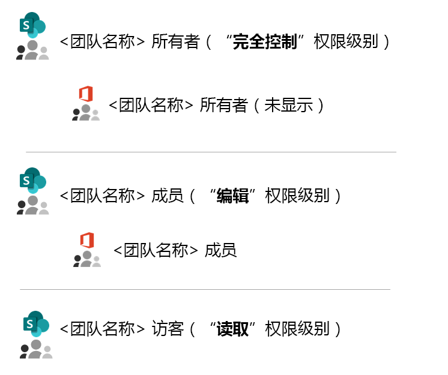
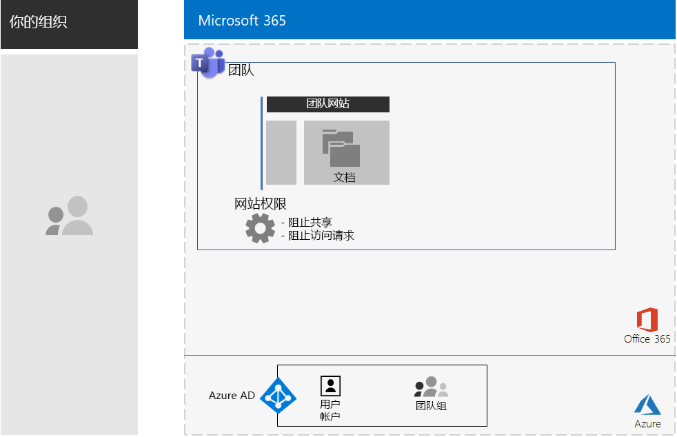
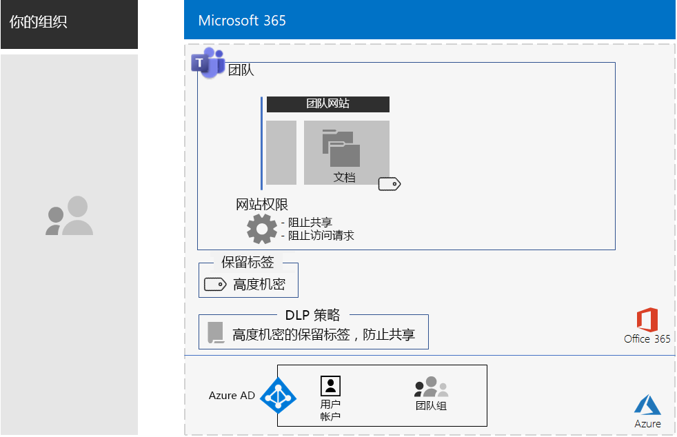
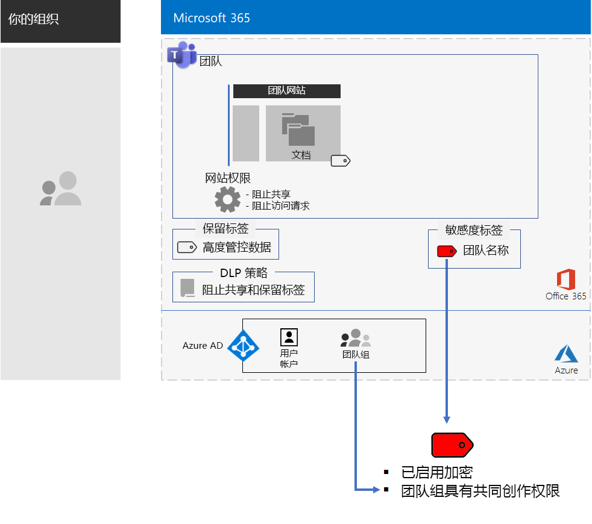
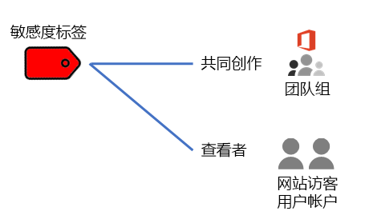
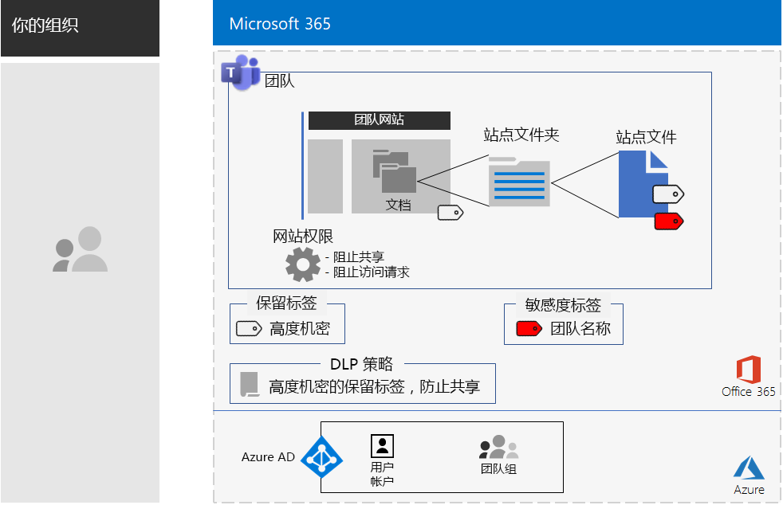

# 用于高度管控数据的 Teams

本文为你提供在 Microsoft Teams 中配置私人团队的建议和步骤，它只允许 Office 365 团队组的成员和所有者访问 Teams 功能 — 例如聊天、会议和文件。 

除了基于 Office 365 组的专用访问之外，本文还介绍了如何配置基础专用 SharePoint 团队网站，你可以从团队频道的“**文件**”部分进行访问，以获得存储高度管控数据所需的其他安全性。 在此 SharePoint 团队网站上，可存储和协作处理文件、页面、共享日历、任务、笔记本和列表。

针对高度管控数据的团队的配置元素如下：

- 具有相应的 Office 365 组的私人团队，该组具有所有者和成员用户帐户。
- 基础 SharePoint 团队网站上的其他安全性：
  - 阻止网站成员向其他人授予访问权限。
  - 阻止非网站成员请求访问该网站。
- 基础 SharePoint 网站的 Office 365 保留标签，作为定义保留策略的默认方法，该标签将自动应用于该网站上的新文件。
- 数据丢失防护 (DLP) 策略，该策略使用保留标签并阻止用户在组织外部共享或发送文件。
- Office 365 敏感度标签或高度管控标签的子标签，它已启用加密并且为 Office 365 团队组提供了共同创作权限。 通过 Word、Excel 和 PowerPoint 中的“敏感度”菜单栏选项，用户可以为团队的“**文件**”部分中存储的文件应用标签或子标签。

下面是使用敏感度标签生成的配置。

 
## 阶段 1：为高度管控数据配置团队

端到端配置包括以下步骤：

1. 配置标识和设备访问。
2. 创建私人团队。
3. 配置基础 SharePoint 网站的其他安全性。
4. 创建保留标签和 DLP 策略。
5. 创建标签或高度管控标签的子标签。

### 步骤 1：配置标识和设备访问

若要保护对团队及其基础 SharePoint 网站的访问，请确保已配置[标识和设备访问策略](https://docs.microsoft.com/microsoft-365/enterprise/identity-access-policies)以及建议的 [SharePoint Online 访问策略](https://docs.microsoft.com/microsoft-365/enterprise/sharepoint-file-access-policies)。

### 步骤 2：创建私人团队

请按照[这些说明](https://support.office.com/article/create-a-team-from-scratch-174adf5f-846b-4780-b765-de1a0a737e2b)创建私人团队。

创建私人团队时，以下是默认权限：

- Office 365 团队组（团队组）具有组所有者和组成员
- 对于基础 SharePoint 团队网站（团队网站）：
  - 已为团队组所有者配置网站集管理员
  - 对于团队网站： 
    - 具有“完全控制”权限级别的团队网站所有者 SharePoint 组已设置为团队组所有者
    - 具有“编辑”权限级别的团队网站成员 SharePoint 组已设置为团队组成员
    - 具有“读取”权限级别的团队网站访问者 SharePoint 组没有任何组或用户帐户

下面是团队网站的默认权限。

 
>[!Note]
>如果查看“编辑”权限级别的\<团队名称 > 所有者 SharePoint 组，则不会显示\<团队名称 > 所有者。
>

生成的权限允许：

- 团队组所有者管理网站，并对网站内容拥有完全控制权。
- 团队组成员在网站上创建和编辑文件。 

权限维护与团队成员和所有者维护相同。

下面是到目前为止生成的配置。

 
### 步骤 3：配置基础 SharePoint 网站的其他安全性

对于团队网站，请配置以下权限设置。

1. 在工具栏中，依次单击设置图标和“**网站权限**”。
2. 在“**网站权限**”窗格的“**共享设置**”下方，单击“**更改共享设置**”。
3. 在“**共享权限**”下方，选择“**仅网站所有者可以共享文件、文件夹和网站**”。
4. 关闭“**允许访问请求**”，然后单击“**保存**”。

使用这些设置，可以禁止团队组成员与其他成员共享团队网站以及非成员请求访问团队网站。

下面是到目前为止生成的配置。

 
### 步骤 4：创建保留标签和 DLP 策略

按照[这些说明](https://docs.microsoft.com/microsoft-365/compliance/protect-sharepoint-online-files-with-office-365-labels-and-dlp)执行以下操作：

1. 创建并发布高度管控数据的保留标签（如果需要）。
2. 为团队网站配置步骤 1 中创建的保留标签。
3. 为高度管控数据创建 DLP 策略以使用步骤 2 中创建的保留标签并阻止用户将文件发送到组织外部。 你还可以基于 [DLP 策略模板](https://docs.microsoft.com/microsoft-365/compliance/data-loss-prevention-policies#dlp-policy-templates)，根据其他要求（例如健康和金融行业的法规要求）来配置策略。

下面是到目前为止生成的配置。

 
### 步骤 5：创建标签或高度管控标签的子标签

与可由任何人应用于任何文件的高度管控数据敏感度标签不同，安全团队需要其自己的标签或子标签，以使分配的文件：

- 启用加密，并且加密信息将与文件一起移动。
- 包含自定义权限，以便只有团队组的成员能打开文件。

若要以这种方式为团队网站中存储的文件实现更高的安全级别，必须配置一个新的敏感度标签，以用作其自身标签，或作为高度管控文件的常规标签的子标签。 只有团队组成员才能在其标签列表中看到它。

如果需要将少量标签应用于全局和各个私人团队，请使用敏感度标签。 如果你拥有大量标签，或者希望在高度管控标签下整理私人团队的标签，请使用敏感度子标签。

[按照这些说明](https://docs.microsoft.com/microsoft-365/compliance/encryption-sensitivity-labels)，使用以下设置配置单独的标签或子标签：

- 标签名称包含团队名称
- 启用加密
- 团队组具有共同创作权限

下面是使用新标签生成的配置。

下面是敏感度标签与团队组之间的关系。

>[!Note]
>如果为用户定义的权限配置敏感度标签或子标签或具有到期日期，则无法从 Teams 或 SharePoint 中打开文件。 必须使用 Office 应用。
>

### 自定义权限

你还可以为团队网站配置自定义 SharePoint 网站权限，并根据需要配置其相应的敏感度标签。 下面是两个示例。

#### 示例 1：委派 SharePoint 网站管理

如果团队所有者没有 SharePoint 管理经验，或者希望委派团队网站的管理，则他们可以将 SharePoint 管理员的用户帐户添加到团队所有者列表中。 但是，SharePoint 管理员可以完全访问团队及其所有资源，并且可以打开应用了敏感度标签的文件。 

为了防止过度授予特权，请在网站的高级权限设置中将 SharePoint 管理员的用户帐户添加到团队网站所有者 SharePoint 组中。 SharePoint 管理员可以管理网站，但是将无法访问团队及其任何资源，也无法打开分配了敏感度标签的文件。

#### 示例 2：允许仅查看带标签的文件

如果某些员工只需要查看团队网站中带标签的文件内容，可将其个人用户帐户添加到：

- \<团队名称 > 访问者 SharePoint 组，默认情况下它具有“读取”权限级别。 
- 具有查看者权限的敏感度标签。

下面是标签上生成的权限。

 
网站访问者将能够直接访问团队网站，并查看已应用子标签的文件内容。 但是，由于它们不是团队组的成员，因此不能访问团队或其任何资源。

## 阶段 2：驱动团队成员的用户采用

随着团队的建立，是时候驱动该团队的采用以及提升它对团队成员的额外安全性。

### 步骤 1：培训用户

团队组成员可以访问团队及其所有资源，包括聊天、会议和其他应用。 使用频道的“**文件**”部分中的文件时，团队组成员必须将敏感度标签或子标签分配给为安全团队创建的文件。 下面是一个示例。

 
将标签应用于受保护的文件时。 团队组成员可以在 Teams 中打开它并进行实时协作。 它已加密，并且包含为团队组成员提供的共同创作权限集。 如果文件离开网站并转发给恶意用户，则他们必须提供作为团队组成员的用户帐户的凭据，这样才能打开文件并查看其内容。 

培训团队成员：

- 了解使用新团队访问聊天、会议、文件和团队网站的其他资源的重要性以及高度管控数据泄露的后果，例如法律后果、监管罚款、勒索软件或失去竞争优势。
- 如何访问团队。
- 如何在网站上创建新文件和上传本地存储的新文件。
- DLP 策略如何阻止它们在外部共享文件。
- 如何使用团队的自定义标签或子标签来标记文件。
- 标签或子标签如何保护文件（即使文件泄露到网站外部）。

此培训应包括实践练习，让团队成员可以体验这些功能及其结果。

### 步骤 2：定期审查使用情况并处理团队成员的反馈意见

在培训后的几周内：

- 快速处理团队成员的反馈意见并微调相关策略和配置。
- 分析团队的使用情况，并将其与预期使用情况进行比较。
- 验证是否使用自定义敏感度标签或子标签正确标记了高度管控的文件。

  通过查看 SharePoint 中的文件夹并使用“**添加列**”的“**显示/隐藏列**”选项添加“**敏感度**”列，可以查看为哪些文件分配了标签。

根据需要重新培训用户。

## 另请参阅

[用于高度管控数据的 SharePoint 网站](teams-sharepoint-online-sites-highly-regulated-data.md)

[Microsoft 365 企业版工作负载和方案](deploy-workloads.md)

[Microsoft 365 工作效率库](https://aka.ms/productivitylibrary) https://aka.ms/productivitylibrary)

[部署指南](deploy-microsoft-365-enterprise.md)
