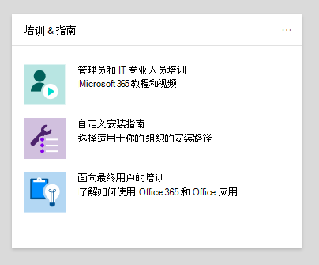
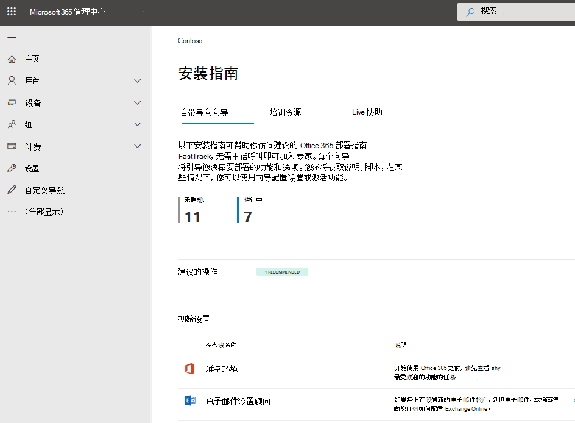

# Microsoft 365 和 Office 365 服务的设置指南Setup guides for Microsoft 365 and Office 365 services

Microsoft 365 和 Office 365 安装指南为管理员提供了用于部署应用程序和服务的专门指南和资源。Microsoft 365 and Office 365 setup guides give admins tailored guidance and resources for deploying apps and services. 这些指南是使用与 FastTrack 内置专家在单独交互中共享的相同最佳实践创建的，并且可供 Microsoft 365 管理中心内的所有管理员使用。These guides are created using the same best practices that FastTrack onboarding specialists share in individual interactions, and they're available to all admins within the Microsoft 365 admin center. 它们提供有关产品安装、启用安全功能、部署协作工具和提供脚本以加快高级部署的信息。They give information on product setup, enabling security features, deploying collaboration tools, and provide scripts to speed up advanced deployments.

## 如何访问 Microsoft 365 管理中心中的安装指南How to access setup guides in the Microsoft 365 admin center

可以从 Microsoft 365 管理中心的 " [安装指南](https://aka.ms/setupguidance) " 页访问安装指南。The setup guides are accessible from the [Setup guidance](https://aka.ms/setupguidance) page in the Microsoft 365 admin center. 您可以跟踪进度的状态，并且您可以随时返回以完成指南。You can keep track of the status of your progress and you have the option to return at any time to complete a guide. 若要访问 " **安装指南** " 页面，请执行以下操作：To reach the **Setup guidance** page:

1. 在 " [管理中心](https://admin.microsoft.com/)" 中，转到 " **主页** "。In the [admin center](https://admin.microsoft.com/), go to the **Home** page.

2. 查找 **培训 & 指南** 卡片。Find the **Training & guides** card. 

   

3. 选择 " **自定义安装指南**"。Select **Customized setup guidance**.

   

>[!NOTE]
>必须拥有租户管理员权限才能访问 Microsoft 365 管理中心。Tenant administrator permissions are required to access the Microsoft 365 admin center.

## 安装指南在 Microsoft 365 管理中心中的工作原理是什么？How do setup guides work in the Microsoft 365 admin center?

每个指南都为您提供了分步说明、资源、文章以及在需要时可用于进行配置更改的脚本。Each guide provides you with step-by-step instructions, resources, articles, and when needed, scripts you can use to make configuration changes. 这些指南为您提供了可反映小型组织和大型组织的特定需求的选项。These guides provide you with choices that reflect the specific needs of both small and large organizations. 此外，提供的指南还包括针对新的和更有经验的管理员的协助。Additionally, the guidance provided includes assistance for both new and more experienced admins.

在规划阶段，您可以使用指南了解有关特定 Microsoft 365 和 Office 365 功能的详细信息，或在完成部署以修改设置后重新访问这些功能。You can use the guides to learn more about specific Microsoft 365 and Office 365 features during the planning phase or revisit them after you've completed a deployment to modify a setting.

## 初始设置指南Guides for initial setup

### 准备环境Prepare your environment

" [准备环境](https://aka.ms/prepareyourenvironment) " 指南可帮助您为组织的 Microsoft 365 和 Office 365 服务准备环境。The [Prepare your environment](https://aka.ms/prepareyourenvironment) guide helps you prepare your organization's environment for Microsoft 365 and Office 365 services. 无论您的目标如何，都需要完成一些任务以确保成功部署。Regardless of your goals, there are tasks you'll need to complete to ensure a successful deployment. 若要在准备环境时避免出现任何错误，请按照分步说明操作，以连接域、添加用户、分配许可证、使用 Exchange Online 设置电子邮件以及安装或部署 Office 应用。To avoid any errors while preparing your environment, you're provided with step-by-step instructions to connect your domain, add users, assign licenses, set up email with Exchange Online, and install or deploy Office apps. 

### 电子邮件设置顾问Email setup advisor

[电子邮件设置顾问](https://aka.ms/office365setup)为您提供了为组织配置 Exchange Online 所需的分步指南。The [Email setup advisor](https://aka.ms/office365setup) provides you with the step-by-step guidance needed for configuring Exchange Online for your organization. 这包括设置新的电子邮件帐户、迁移电子邮件和配置电子邮件保护。This includes setting up new email accounts, migrating email, and configuring email protection. 若要成功设置电子邮件，请使用此顾问，并根据组织的当前邮件系统、要迁移的邮箱数以及管理用户及其访问的方式来接收建议的迁移方法。For a successful email set up, use this advisor and you'll receive the recommended migration method based on your organization's current mail system, the number of mailboxes being migrated, and how you want to manage users and their access.

### Gmail 联系人和日历顾问Gmail contacts and calendar advisor

将 Gmail 用户的邮箱迁移到 Microsoft 365 时，将迁移电子邮件，但不会迁移联系人和日历项目。When you migrate a Gmail user's mailbox to Microsoft 365, email messages are migrated, but contacts and calendar items are not. [Gmail "联系人" 和 "日历顾问](https://aka.ms/gmailcontactscalendar)" 提供了有关使用 Outlook.com、Outlook 客户端或 PowerShell 的导入和导出方法将 google 联系人和 Google calendar 项目导入到 Microsoft 365 的步骤。The [Gmail contacts and calendar advisor](https://aka.ms/gmailcontactscalendar) provides steps for importing Google contacts and Google calendar items to Microsoft 365 using import and export methods with Outlook.com, the Outlook client, or PowerShell.

### Microsoft 365 部署顾问Microsoft 365 deployment advisor

[Microsoft 365 部署顾问](https://aka.ms/microsoft365setupguide)在设置生产率工具、安全策略和设备管理功能时为商业客户提供指导。The [Microsoft 365 deployment advisor](https://aka.ms/microsoft365setupguide) provides commercial customers with guidance when setting up productivity tools, security policies, and device management capabilities. 使用 Microsoft 365 商业高级版或 Microsoft 365 企业版订阅时，可以使用此顾问来设置和配置组织的设备。With a Microsoft 365 Business Premium or Microsoft 365 Enterprise subscription, you can use this advisor to set up and configure your organization's devices. 

你将收到指南并访问资源，以启用云服务、将设备更新到最新的 Windows 10 支持版本，并将设备加入到 Azure Active Directory (Azure AD) ，所有这些都位于一个中心位置。You'll receive guidance and access to resources to enable your cloud services, update devices to the latest supported version of Windows 10, and join devices to Azure Active Directory (Azure AD), all in one central location.

### 远程工作安装指南Remote work setup guide

[远程工作设置指南](https://aka.ms/remoteworksetup)为组织提供了所需的提示和资源，以确保您的用户可以远程成功工作，您的数据是安全的，并且用户的凭据受到保护。The [Remote work setup guide](https://aka.ms/remoteworksetup) provides organizations with the tips and resources needed to ensure your users can successfully work remotely, your data is secure, and users' credentials are safeguarded. 

你将收到用于将远程工作线程的设备流量优化为云和组织网络中的 Microsoft 365 资源的指南，这将降低对你的 VPN 基础结构的压力。You'll receive guidance to optimize remote workers' device traffic to both Microsoft 365 resources in the cloud and your organization's network, which will reduce the strain on your VPN infrastructure. 

### Windows 虚拟桌面安装指南Windows Virtual Desktop setup guide

Windows 虚拟桌面是在云中运行的全面桌面和应用虚拟化服务。Windows Virtual Desktop is a comprehensive desktop and app virtualization service running in the cloud. 它是唯一一个 (VDI) 的虚拟桌面基础结构，它提供简化的管理、多会话 Windows 10、Microsoft 365 应用的优化以及对远程桌面服务 (RDS) 环境的支持。It's the only virtual desktop infrastructure (VDI) that delivers simplified management, multi-session Windows 10, optimizations for Microsoft 365 Apps, and support for Remote Desktop Services (RDS) environments. 在几分钟内部署 Windows 桌面和应用程序并将其扩展到 Azure，并获取内置安全性和合规性功能。Deploy and scale your Windows desktops and apps to Azure in minutes and get built-in security and compliance features. 

[Windows 虚拟桌面安装指南](https://aka.ms/wvdsetupguide)为管理员提供了规划资源以及部署、安装指南和其他资源的先决条件。The [Windows Virtual Desktop setup guide](https://aka.ms/wvdsetupguide) provides administrators with planning resources and the prerequisites for deployment, setup guidance, and additional resources. 

## 身份验证和访问指南Guides for authentication and access

### Azure AD 安装指南Azure AD setup guide

[AZURE AD 安装指南](https://aka.ms/aadpguidance)提供的信息可确保您的组织具有强大的安全基础。The [Azure AD setup guide](https://aka.ms/aadpguidance) provides information to ensure your organization has a strong security foundation. 在本指南中，您将设置初始功能，如 Azure 基于角色的访问控制 (Azure RBAC) for admins、用于本地目录的 Azure AD Connect 和 Azure AD Connect Health，这样您就可以在自动同步过程中监视混合身份的运行状况。In this guide you’ll set up initial features, like Azure role-based access control (Azure RBAC) for admins, Azure AD Connect for your on-premises directory, and Azure AD Connect Health, so you can monitor your hybrid identity's health during automated syncs. 

此外，还提供有关启用自助密码重置、条件访问和集成的第三方登录（包括可选的高级 ID 保护和用户预配自动化）的基本信息。It also includes essential information on enabling self-service password resets, conditional access and integrated third-party sign-on including optional advanced ID protection, and user provisioning automation.

### 规划 passwordless 部署Plan your passwordless deployment

升级到替代登录方法，以允许用户使用以下 passwordless 身份验证方法之一安全地访问其设备： Windows Hello 企业版、Microsoft 身份验证器应用程序或安全密钥。Upgrade to an alternative sign-in approach that allows users to access their devices securely with one of the following passwordless authentication methods: Windows Hello for Business, Microsoft Authenticator app, or security keys. 

使用 " [规划您的 passwordless 部署" 向导](https://aka.ms/passwordlesssetup) 来发现最佳的 passwordless 身份验证方法，以使用和接收有关如何部署它们的指导。Use the [Plan your passwordless deployment wizard](https://aka.ms/passwordlesssetup) to discover the best passwordless authentication methods to use and receive guidance on how to deploy them. 

### 规划自助密码重置部署Plan your self-service password reset deployment

使用户能够独立地更改或重置其密码，如果帐户被锁定或忘记了密码，则无需联系帮助台工程师。Give users the ability to change or reset their password independently, if their account is locked, or they forget their password without the need to contact a helpdesk engineer. 

使用 " [规划您的自助式密码重置部署" 向导](https://aka.ms/SSPRSetupGuide) ，以获取有关配置相应的 Azure 门户选项以帮助您在环境中部署 SSPR 的相关文章和说明。Use the [Plan your self-service password reset deployment wizard](https://aka.ms/SSPRSetupGuide) to receive relevant articles and instructions for configuring the appropriate Azure portal options to help you deploy SSPR in your environment.

### Active Directory 联合身份验证服务 (AD FS) 部署顾问Active Directory Federation Services (AD FS) deployment advisor

[AD FS 部署顾问](https://aka.ms/adfsguidance)为您提供了有关部署对 Microsoft 365 和 Office 365 服务的用户进行身份验证的本地 AD FS 基础结构的分步指南。The [AD FS deployment advisor](https://aka.ms/adfsguidance) provides you with step-by-step guidance on deploying an on-premises AD FS infrastructure that authenticates users for Microsoft 365 and Office 365 services. 在本指南中，您的组织可以查看 AD FS 组件和要求，获取并安装部署所需的 SSL 证书，并安装所需的 web 应用程序代理服务器。With this guide, your organization can review AD FS components and requirements, acquire and install SSL certificates that are necessary for deployment, and install a required web application proxy server. 

## 安全性和合规性指南Guides for security and compliance

### Microsoft Defender 高级威胁防护 (ATP) 顾问Microsoft Defender Advanced Threat Protection (ATP) advisor

[Microsoft Defender 高级威胁防护顾问](https://aka.ms/mdatpsetup)提供的说明可帮助你的企业网络阻止、检测、调查和响应高级威胁。The [Microsoft Defender Advanced Threat Protection advisor](https://aka.ms/mdatpsetup) provides instructions that will help your enterprise network prevent, detect, investigate, and respond to advanced threats. 对组织的安全漏洞做出有根据的评估，并决定最佳的部署包和配置方法。Make an informed assessment of your organization's vulnerability and decide which deployment package and configuration methods are best. 

>[!NOTE]
>Microsoft Defender ATP 需要 Microsoft 批量许可证。A Microsoft Volume License is required for Microsoft Defender ATP.

### Exchange Online Protection 安装指南Exchange Online Protection setup guide

Microsoft Exchange Online Protection (EOP) 是一种基于云的电子邮件筛选服务，用于针对垃圾邮件和恶意软件进行保护，其中包含保护组织不受邮件策略冲突的功能。Microsoft Exchange Online Protection (EOP) is a cloud-based email filtering service for protection against spam and malware, with features to safeguard your organization from messaging policy violations. 

使用 [Exchange Online Protection 设置指南](https://aka.ms/EOPguidance) 来设置 EOP，方法是选择以下三个部署方案中的哪一个： &mdash; 本地邮箱、混合 (本地邮箱和云) 邮箱的混合，或所有云邮箱 &mdash; 适合您的组织。Use the [Exchange Online Protection setup guide](https://aka.ms/EOPguidance) to set up EOP by selecting which of the three deployment scenarios&mdash;on-premises mailboxes, hybrid (mix of on-premises and cloud) mailboxes, or all cloud mailboxes&mdash;fits your organization. 指南提供了用于设置和查看用户的许可的信息和资源，在 Microsoft 365 管理中心中分配权限，以及在安全 & 合规性中心中配置组织的反恶意软件和垃圾邮件策略。The guide provides information and resources to set up and review your user's licensing, assign permissions in the Microsoft 365 admin center, and configure your organization's anti-malware and spam policies in the Security & Compliance Center. 

### Office 365 高级威胁防护顾问Office 365 Advanced Threat Protection advisor

[Office 365 高级威胁防护顾问](https://aka.ms/oatpsetup)针对您的环境可能会通过电子邮件、链接和第三方协作工具遇到的恶意威胁来保护您的组织。The [Office 365 Advanced Threat Protection advisor](https://aka.ms/oatpsetup) safeguards your organization against malicious threats that your environment might encounter through email messages, links, and third-party collaboration tools. 本指南为您提供了资源和信息，可帮助您准备和确定高级威胁防护计划以满足组织的需求。This guide provides you with the resources and information to help you prepare and identify the advanced threat protection plan to fit your organization's needs. 

### Microsoft 信息保护设置指南Microsoft information protection setup guide

获取可应用于您的信息保护策略的功能的概述，这样您就可以确信敏感信息受到保护。Get an overview of the capabilities you can apply to your Information Protection strategy so you can be confident your sensitive information is protected. 使用四个阶段的生命周期方法，您可以在其中发现、分类、保护和监控敏感信息。Use a four-stage lifecycle approach in which you discover, classify, protect, and monitor sensitive information. 《 [Microsoft 信息保护设置指南》](https://aka.ms/mipsetupguide) 提供了有关完成每个阶段的指南。The [Microsoft information protection setup guide](https://aka.ms/mipsetupguide) provides guidance for completing each of these stages.

### Microsoft 信息治理设置指南Microsoft information governance setup guide

[Microsoft 信息管理设置指南](https://aka.ms/migsetupguide)为您提供了设置和管理组织治理策略所需的信息，以确保根据您设置的特定生命周期准则对数据进行分类和管理。The [Microsoft Information governance setup guide](https://aka.ms/migsetupguide) provides you with the information you'll need to set up and manage your organization's governance strategy, to ensure that your data is classified and managed according to the specific lifecycle guidelines you set. 在本指南中，您将了解如何创建、自动应用或发布应用于组织的可重用内容和合规性记录的标签、标签策略和保留策略。With this guide, you'll learn how to create, auto-apply, or publish labels, label policies, and retention policies that are applied to your organization's reusable content and compliance records. 您还将获得有关导入 CSV 文件的信息，以用于批量方案或手动将其应用到各个文档的文件计划。You'll also get information on importing CSV files with a file plan for bulk scenarios or for applying them manually to individual documents. 

## 协作指南Guides for collaboration

### Microsoft 365 应用部署顾问Microsoft 365 Apps deployment advisor

[Microsoft 365 Apps 部署顾问](https://aka.ms/OPPquickstartguide)可帮助你获取运行最新版本的 Office 产品（如 Word、Excel、PowerPoint 和 OneNote）的用户设备。The [Microsoft 365 Apps deployment advisor](https://aka.ms/OPPquickstartguide) helps you get your users' devices running the latest version of Office products like Word, Excel, PowerPoint, and OneNote. 您将获得各种部署方法的指南，其中包括简单的自安装选项，以使用管理工具进行企业部署。You'll get guidance on the various deployment methods that include easy self-install options to enterprise deployments with management tools. 这些说明将帮助您评估您的环境，确定具体的部署要求，并实现必要的支持工具以确保成功安装。The instructions will help you assess your environment, figure out your specific deployment requirements, and implement the necessary support tools to ensure a successful install. 

### Office 移动应用安装助理Office mobile apps setup assistant

[Office 移动应用安装助理](https://aka.ms/officeappguidance)提供了有关在 Windows、IOS 和 Android 移动设备上下载和安装 Office 应用程序的说明。The [Office mobile apps setup assistant](https://aka.ms/officeappguidance) provides instructions for the download and installation of Office apps on your Windows, iOS, and Android mobile devices. 本指南为你提供了在手机和平板电脑设备上下载和安装 Microsoft 365 和 Office 365 应用的分步信息。This guide provides you with step-by-step information to download and install Microsoft 365 and Office 365 apps on your phone and tablet devices.

### Microsoft 团队设置指南Microsoft Teams setup guide

[Microsoft 团队设置指南](https://aka.ms/teamsguidance)为你的组织提供了有关设置团队工作区的指南，这些团队工作区通过消息传递、呼叫、音频或视频会议进行团队和私人通信。The [Microsoft Teams setup guide](https://aka.ms/teamsguidance) provides your organization with guidance to set up team workspaces that host real-time conversations through messaging, calls, and audio or video meetings for both team and private communication. 你将通过使用网络规划器工具和团队管理员中心的团队顾问来了解有关确定组织的网络要求的说明。You'll receive the instructions for determining your organization's network requirements by using the Network Planner tool and the Teams advisor within the Teams admin center. 部署完成后，指南中包含的资源可帮助您开始使用团队。Once your deployment is complete, the guide includes helpful resources to get started using Teams.

### SharePoint 安装指南SharePoint setup guide

[SharePoint 安装指南](https://aka.ms/spoguidance)可帮助您设置 SharePoint 文档存储和内容管理、创建网站、配置外部共享、迁移数据和配置高级设置，并推动组织中的用户接洽和通信。The [SharePoint setup guide](https://aka.ms/spoguidance) helps you set up your SharePoint document storage and content management, create sites, configure external sharing, migrate data and configure advanced settings, and drive user engagement and communication within your organization. 您将按照以下步骤操作，以配置内容共享权限策略、选择迁移同步工具以及为您的 SharePoint 环境启用安全设置。You'll follow steps for configuring your content-sharing permission policies, choose your migration sync tools, as well as enable the security settings for your SharePoint environment. 

### OneDrive 设置指南OneDrive setup guide

使用 [onedrive 设置指南](https://aka.ms/ODfBquickstartguide) 开始使用 onedrive 文件存储、共享、协作和同步功能。Use the [OneDrive setup guide](https://aka.ms/ODfBquickstartguide) to get started with OneDrive file storage, sharing, collaboration, and syncing capabilities. OneDrive 提供了一个中心位置，用户可在其中同步 Microsoft 365 应用程序文件、配置外部共享、迁移用户数据以及配置高级安全性和设备访问设置。OneDrive provides a central location where users can sync their Microsoft 365 Apps files, configure external sharing, migrate user data, and configure advanced security and device access settings. 可以使用 OneDrive 订阅或独立 OneDrive 计划部署 OneDrive 安装指南。The OneDrive setup guide can be deployed using a OneDrive subscription or a standalone OneDrive plan. 

### Yammer 部署顾问Yammer deployment advisor

在您的组织中使用 Yammer 进行连接和参与。Connect and engage across your organization with Yammer. [Yammer 部署顾问](https://aka.ms/yammerdeploymentguide)通过添加域、定义管理员和组合 yammer 网络来准备 yammer 网络。The [Yammer deployment advisor](https://aka.ms/yammerdeploymentguide) prepares your Yammer network by adding domains, defining admins, and combining Yammer networks. 你将获得部署 Yammer 的指导，然后自定义外观，配置安全性和合规性，并优化设置。You'll get guidance to deploy Yammer and then customize the look, configure security and compliance, and refine the settings.

## 高级向导Advanced wizards

### 使用配置管理器的就地升级In-place upgrade with Configuration Manager

将 Windows 7 和 Windows 8.1 设备升级到最新版本的 Windows 10 时，请使用 [包含 Configuration Manager 指南的就地升级](https://aka.ms/win10upgradedemo) 。Use the [In-place upgrade with Configuration Manager guide](https://aka.ms/win10upgradedemo) when upgrading Windows 7 and Windows 8.1 devices to the latest version of Windows 10. 您将使用所提供的脚本检查先决条件，并自动配置就地升级。You'll use the script provided to check the prerequisites and automatically configure an in-place upgrade.

### 将 Office 部署到您的用户Deploy Office to your users

使用 Office 部署工具从云中部署 Office 应用，从而能够自定义安装。Deploy Office apps from the cloud with the ability to customize your installation by using the Office Deployment Tool. " [向用户部署 office" 指南 ](https://aka.ms/proplusodt) 可帮助您使用高级设置创建自定义的 Office 配置，也可以使用预构建的建议配置。The [Deploy Office to your users guide ](https://aka.ms/proplusodt) helps you create a customized Office configuration with advanced settings, or you can use a pre-built recommended configuration. 无论您的用户正在进行自我安装还是要批量部署到用户，此高级向导都会提供分步说明，以向用户提供针对您的组织量身定制的 Office 安装。Whether your users are conducting a self-install or you're deploying to your users individually or in bulk, this advanced wizard provides you with step-by-step instructions to give users an Office installation tailored to your organization.

### 将 Office 部署到远程用户Deploy Office to remote users

现在，远程工作是标准的，用户需要在未连接到内部网络或使用自己的设备时接收组织的 Office 设置。Now that working remotely is the norm, users need to receive your organization's Office settings when they're not connected to your internal network or when using their own devices. 

使用 " [向远程用户部署 office" 指南](https://aka.ms/officeremoteinstall) 创建自定义 Office 安装，然后向用户发送生成的 PowerShell 脚本，该脚本可无缝地将 Office 与您的配置一起安装。Use the [Deploy Office to remote users guide](https://aka.ms/officeremoteinstall) to create a customized Office installation and then send users a generated PowerShell script that will seamlessly install Office with your configuration.

### 使用 Configuration Manager 部署和更新 Microsoft 365 应用Deploy and update Microsoft 365 Apps with Configuration Manager

对于使用 Configuration Manager 的组织，您可以使用 [Deploy and Update microsoft 365 apps With Configuration manager advisor](https://aka.ms/oppinstall) 生成脚本，该脚本将使用 FastTrack 工程师建议的最佳做法自动配置 Microsoft 365 应用程序部署。For organizations using Configuration Manager, you can use the [Deploy and update Microsoft 365 Apps with Configuration Manager advisor](https://aka.ms/oppinstall) to generate a script that will automatically configure your Microsoft 365 Apps deployment using best practices recommended by FastTrack engineers. 使用此指南可生成部署组、自定义 Office 应用和功能、配置动态或精益安装，然后运行脚本来创建用于部署的应用程序、自动部署规则和设备集合。Use this guide to build your deployment groups, customize your Office apps and features, configure dynamic or lean installations, and then run the script to create the applications, automatic deployment rules, and device collections you need to target your deployment. 

