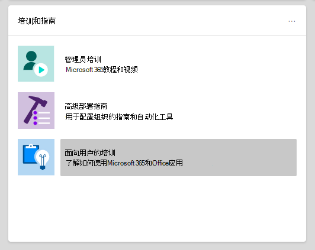

# Microsoft 365 和 Office 365 服务的设置指南Setup guides for Microsoft 365 and Office 365 services

Microsoft 365和Office 365设置指南会提供针对规划和部署租户、应用和服务而定制的指南和资源。Microsoft 365 and Office 365 setup guides give you tailored guidance and resources for planning and deploying your tenant, apps, and services. 这些指南的创建方式与[FastTrack](https://www.microsoft.com/fasttrack/microsoft-365) Microsoft 365专家在个人交互中共享的最佳方案相同，可供 Microsoft 365 中心内的所有管理员使用。These guides are created using the same best practices that [Microsoft 365 FastTrack](https://www.microsoft.com/fasttrack/microsoft-365) onboarding specialists share in individual interactions, and they're available to all admins within the Microsoft 365 admin center. 它们提供有关产品设置、启用安全功能、部署协作工具以及提供脚本以加快高级部署的信息。They give information on product setup, enabling security features, deploying collaboration tools, and provide scripts to speed up advanced deployments.

## 如何访问管理中心中的Microsoft 365指南How to access setup guides in the Microsoft 365 admin center

可通过管理中心中的"设置指南"[页](https://aka.ms/setupguidance)访问Microsoft 365指南。The setup guides are accessible from the [Setup guidance](https://aka.ms/setupguidance) page in the Microsoft 365 admin center. 你可以跟踪进度状态，并且可以选择随时返回以完成指南。You can keep track of the status of your progress and you have the option to return at any time to complete a guide. 若要访问" **设置指南"页** ：To reach the **Setup guidance** page:

1. 在Microsoft 365 [管理中心中](https://admin.microsoft.com/)，转到 **主页**。In the [Microsoft 365 admin center](https://admin.microsoft.com/), go to the **Home** page.

2. 查找 **培训&指南** 卡。Find the **Training & guides** card. 

   

3. 选择 **"自定义设置指南"。**Select **Customized setup guidance**.

   

>[!NOTE]
>需要租户管理员权限才能访问Microsoft 365中心。Tenant administrator permissions are required to access the Microsoft 365 admin center.

## 设置指南在管理中心Microsoft 365工作？How do setup guides work in the Microsoft 365 admin center?

每个指南都为您提供了分步说明、资源、文章，并根据需要提供了可用于更改配置的脚本。Each guide provides you with step-by-step instructions, resources, articles, and when needed, scripts you can use to make configuration changes. 这些指南为您提供了反映小型和大型组织的特定需求的选择。These guides provide you with choices that reflect the specific needs of both small and large organizations. 此外，该指南还包括针对新管理员和有经验的管理员的帮助。Additionally, the guidance includes assistance for both new and more experienced admins.

在规划阶段、部署和推出期间，可以使用指南了解有关特定 Microsoft 365 和 Office 365 功能的信息，或在完成部署后重新访问它们以修改设置。You can use the guides to learn more about specific Microsoft 365 and Office 365 features during the planning phase, during deployment and rollout, or to revisit them after you've completed a deployment to modify a setting.

## 初始设置指南Guides for initial setup

### 准备环境Prepare your environment

准备[环境](https://aka.ms/prepareyourenvironment)指南可帮助你为组织的环境准备Microsoft 365 Office 365服务。The [Prepare your environment](https://aka.ms/prepareyourenvironment) guide helps you prepare your organization's environment for Microsoft 365 and Office 365 services. 无论你的目标如何，都需要完成一些任务以确保成功部署。Regardless of your goals, there are tasks you'll need to complete to ensure a successful deployment. 为了避免在准备环境时出现任何错误，我们会提供连接域、添加用户、分配许可证、使用 Exchange Online 设置电子邮件以及安装或部署 Office 应用的分步说明。To avoid any errors while preparing your environment, you're provided with step-by-step instructions to connect your domain, add users, assign licenses, set up email with Exchange Online, and install or deploy Office apps. 

### 电子邮件设置顾问Email setup advisor

[电子邮件设置顾问](https://aka.ms/office365setup)为您提供了为组织配置电子邮件Exchange Online分步指南。The [Email setup advisor](https://aka.ms/office365setup) provides you with the step-by-step guidance needed for configuring Exchange Online for your organization. 这包括设置新的电子邮件帐户、迁移电子邮件和配置电子邮件保护。This includes setting up new email accounts, migrating email, and configuring email protection. 若要成功设置电子邮件，请使用此顾问，你将收到基于您组织的当前邮件系统、要迁移的邮箱数以及您希望如何管理用户及其访问权限的建议迁移方法。For a successful email set up, use this advisor and you'll receive the recommended migration method based on your organization's current mail system, the number of mailboxes being migrated, and how you want to manage users and their access.

### 迁移 Gmail 联系人和日历项目Migrate Gmail contacts and calendar items

将 Gmail 用户的邮箱迁移到 Microsoft 365时，电子邮件会进行迁移，但联系人和日历项目不会迁移。When you migrate a Gmail user's mailbox to Microsoft 365, email messages are migrated, but contacts and calendar items are not. Gmail 联系人和日历[顾问](https://aka.ms/gmailcontactscalendar)提供了使用 Outlook.com、Outlook 客户端或 PowerShell 的导入和导出方法将 Google 联系人和 Google 日历项目导入 Microsoft 365 的步骤。The [Gmail contacts and calendar advisor](https://aka.ms/gmailcontactscalendar) provides steps for importing Google contacts and Google calendar items to Microsoft 365 using import and export methods with Outlook.com, the Outlook client, or PowerShell.

### Microsoft 365顾问Microsoft 365 deployment advisor

部署[Microsoft 365顾问](https://aka.ms/microsoft365setupguide)提供有关设置生产力工具、安全策略和设备管理功能的指南。The [Microsoft 365 deployment advisor](https://aka.ms/microsoft365setupguide) provides you with guidance when setting up productivity tools, security policies, and device management capabilities. 通过Microsoft 365 商业高级版或Microsoft 365订阅，你可以使用此顾问来设置和配置你的组织设备。With a Microsoft 365 Business Premium or Microsoft 365 for enterprise subscription, you can use this advisor to set up and configure your organization's devices. 

你将收到用于启用云服务、将设备更新到最新受支持的 Windows 10 版本以及将设备加入 Azure Active Directory (Azure AD) 的指南和访问资源，所有这些操作都位于一个中心位置。You'll receive guidance and access to resources to enable your cloud services, update devices to the latest supported version of Windows 10, and join devices to Azure Active Directory (Azure AD), all in one central location.

### 远程工作设置指南Remote work setup guide

远程 [工作设置指南](https://aka.ms/remoteworksetup) 为组织提供了所需的提示和资源，以确保用户能够成功远程工作、数据安全并保护用户的凭据。The [Remote work setup guide](https://aka.ms/remoteworksetup) provides organizations with the tips and resources needed to ensure your users can successfully work remotely, your data is secure, and users' credentials are safeguarded. 

你将收到有关优化远程工作者对云中 Microsoft 365 资源和组织网络的设备流量的指导，这将减轻远程访问 VPN 基础结构的压力。You'll receive guidance to optimize remote workers' device traffic to both Microsoft 365 resources in the cloud and your organization's network, which will reduce the strain on your remote access VPN infrastructure. 

### Windows虚拟桌面设置指南Windows Virtual Desktop setup guide

Windows虚拟桌面是在云中运行的全面桌面应用虚拟化服务。Windows Virtual Desktop is a comprehensive desktop and app virtualization service running in the cloud. 它是唯一的虚拟桌面基础结构 (VDI) ，可提供简化管理、多会话 Windows 10、Microsoft 365 应用版 优化，并支持远程桌面服务 (RDS) 环境。It's the only virtual desktop infrastructure (VDI) that delivers simplified management, multi-session Windows 10, optimizations for Microsoft 365 Apps, and support for Remote Desktop Services (RDS) environments. 在数分钟内将Windows桌面和应用部署到 Azure，并获取内置的安全性和合规性功能。Deploy and scale your Windows desktops and apps to Azure in minutes and get built-in security and compliance features. 

虚拟[Windows](https://aka.ms/wvdsetupguide)设置指南为管理员提供了规划资源和部署的先决条件、设置指南和其他资源。The [Windows Virtual Desktop setup guide](https://aka.ms/wvdsetupguide) provides administrators with planning resources and the prerequisites for deployment, setup guidance, and additional resources. 

### Microsoft Edge设置指南Microsoft Edge setup guide

Microsoft Edge已经过全新构建，可让你获得世界一流的兼容性和性能、值得你享有的安全和隐私以及旨在提供最佳 Web 功能的新功能。Microsoft Edge has been rebuilt from the ground up to bring you world-class compatibility and performance, the security and privacy you deserve, and new features designed to bring you the best of the web.

[Microsoft Edge](https://aka.ms/edgeadvisor)设置指南将帮助您配置 Enterprise 站点发现，以查看在贵组织访问哪些网站可能需要使用 IE 模式、查看和配置重要的安全功能、配置隐私策略和其他策略以满足组织的要求，以及管理您设备的 Web 访问。The [Microsoft Edge setup guide](https://aka.ms/edgeadvisor) will help you configure Enterprise Site Discovery to see which sites accessed in your org might need to use IE mode, review and configure important security features, configure privacy policies and additional policies to meet your org's requirements, and manage web access on your devices. 你可以将Microsoft Edge下载到个别设备，或者我们将展示如何使用 Configuration Manager 或 Microsoft Intune 部署到组织中的多个用户。You can download Microsoft Edge to individual devices, or we'll show you how to deploy to multiple users in your org with Configuration Manager or Microsoft Intune. 

### Microsoft 搜索设置指南Microsoft Search setup guide

Microsoft 搜索可帮助你的组织找到完成他们正在处理的工作所需的内容。Microsoft Search helps your organization find what they need to complete what they're working on. 无论是搜索人员、文件、组织结构图、网站或常见问题解答，组织都可以在整个工作日使用 Microsoft 搜索获取答案。Whether it's searching for people, files, org charts, sites, or answers to common questions, your org can use Microsoft Search throughout their workday to get answers.

[Microsoft 搜索设置指南](https://aka.ms/MicrosoftSearchSetup)可帮助你配置 Microsoft 搜索，是希望将其试点到一组用户，还是将其向组织中的每个人推出。你将分配搜索管理员和搜索编辑器，然后使用答案和其他选项为用户自定义搜索体验，例如将 必应 扩展添加到 Chrome 或将 必应 设置为默认搜索引擎。The [Microsoft Search setup guide](https://aka.ms/MicrosoftSearchSetup) helps you configure Microsoft Search whether you want to pilot it to a group of users or roll it out to everyone in your org. You'll assign Search admins and Search editors and then customize the search experience for your users with answers and additional options, like adding the Bing extension to Chrome or setting Bing as your default search engine.

### Intune Configuration Manager 共同管理设置指南Intune Configuration Manager co-management setup guide

将[Intune Configuration Manager](https://aka.ms/comanagementsetup)共同管理设置指南用于现有 Configuration Manager 客户端设备和组织希望与 Configuration Manager 和 Configuration Manager 共同管理的基于 internet 的新Microsoft Intune设置指南。Use the [Intune Configuration Manager co-management setup guide](https://aka.ms/comanagementsetup) for existing Configuration Manager client devices and new internet-based devices that your org wants to co-manage with both Microsoft Intune and Configuration Manager. 此共同管理部署指南允许你管理Windows 10设备，并将新功能添加到组织设备，同时同时获得这两种解决方案的好处。This co-management deployment guide allows you to manage Windows 10 devices and adds new functionality to your org's devices, while receiving the benefits of both solutions.

## 身份验证和访问指南Guides for authentication and access

### Azure AD 设置指南Azure AD setup guide

[Azure AD 设置指南](https://aka.ms/aadpguidance)提供了一些信息，以确保你的组织具有强大的安全基础。The [Azure AD setup guide](https://aka.ms/aadpguidance) provides information to ensure your organization has a strong security foundation. 在本指南中，你将设置初始功能，如用于管理员的基于 Azure 角色的访问控制 (Azure RBAC) 、本地目录的 Azure AD 连接 和 Azure AD 连接 运行状况，以便你可以监视自动同步期间混合标识的运行状况。In this guide you’ll set up initial features, like Azure role-based access control (Azure RBAC) for admins, Azure AD Connect for your on-premises directory, and Azure AD Connect Health, so you can monitor your hybrid identity's health during automated syncs. 

它还包括有关启用自助服务密码重置、条件访问和集成第三方登录（包括可选高级标识保护和用户设置自动化）的必需信息。It also includes essential information on enabling self-service password resets, conditional access and integrated third-party sign-on including optional advanced identity protection and user provisioning automation.

### 从组织目录中同步用户Sync users from your org’s directory

同步 [组织目录向导中的用户](https://aka.ms/directorysyncsetup) 将引导你打开目录同步。The [Sync users from your org’s directory wizard](https://aka.ms/directorysyncsetup) walks you through turning on directory synchronization. 这会将本地标识和云标识汇集在一起，以便更轻松地访问和简化管理。This brings your on-premises and cloud identities together for easier access and simplified management. 解锁新功能，如单一登录、自助服务选项、自动帐户设置、条件访问控制和合规性策略。Unlock new capabilities, like single sign-on, self-service options, automatic account provisioning, conditional access controls, and compliance policies. 这可确保用户能够随时随地访问所需的资源。This ensures that your users have access to the resources they need from anywhere.

### 规划无密码部署Plan your passwordless deployment

升级到允许用户通过以下无密码身份验证方法之一安全地访问其设备的备用登录方法：Upgrade to an alternative sign-in approach that allows users to access their devices securely with one of the following passwordless authentication methods: 

- Windows Hello 企业版Windows Hello for Business
- Microsoft Authenticator 应用The Microsoft Authenticator app
- 安全密钥Security keys 

使用 [规划无密码部署向导](https://aka.ms/passwordlesssetup) 来发现使用的最佳无密码身份验证方法，并接收有关如何部署这些方法的指导。Use the [Plan your passwordless deployment wizard](https://aka.ms/passwordlesssetup) to discover the best passwordless authentication methods to use and receive guidance on how to deploy them. 

### 在 SSPR 部署中规划 (密码) 重置Plan your self-service password reset (SSPR) deployment

如果用户的帐户被锁定，或者他们忘记密码，而无需联系支持工程师，则允许用户单独更改或重置其密码。Give users the ability to change or reset their password independently, if their account is locked, or they forget their password without the need to contact a helpdesk engineer. 

使用 [规划自助服务密码重置](https://aka.ms/SSPRSetupGuide) 部署向导接收相关文章和说明，以配置适当的 Azure 门户选项，以帮助你在你的环境中部署 SSPR。Use the [Plan your self-service password reset deployment wizard](https://aka.ms/SSPRSetupGuide) to receive relevant articles and instructions for configuring the appropriate Azure portal options to help you deploy SSPR in your environment.

### Active Directory 联合身份验证服务 (AD FS) 顾问Active Directory Federation Services (AD FS) deployment advisor

[AD FS](https://aka.ms/adfsguidance)部署顾问提供有关部署本地 AD FS 基础结构的分步指南，该基础结构可对用户进行身份验证以使用 Microsoft 365 和 Office 365 服务。The [AD FS deployment advisor](https://aka.ms/adfsguidance) provides you with step-by-step guidance on deploying an on-premises AD FS infrastructure that authenticates users for Microsoft 365 and Office 365 services. 借助本指南，贵组织可以检查 AD FS 组件和要求、获取和安装部署所需的 SSL 证书，以及安装所需的 Web 应用程序代理服务器。With this guide, your organization can review AD FS components and requirements, acquire and install SSL certificates that are necessary for deployment, and install a required web application proxy server. 

## 安全性和合规性指南Guides for security and compliance

### Microsoft Intune设置指南Microsoft Intune setup guide 

设置Microsoft Intune管理组织中设备的设备。Set up Microsoft Intune to manage devices in your organization. 为了完全控制公司设备，你将使用 Intune 的移动设备管理 (MDM) 功能。For full control of corporate devices, you’ll use Intune’s mobile device management (MDM) features. 若要在共享和个人设备上管理组织的数据，可以使用 Intune 的移动应用程序管理功能 (MAM) 功能。To manage your organization's data on shared and personal devices, you can use Intune’s mobile application management (MAM) features. 

借助[Microsoft Intune](https://aka.ms/intunesetupguide)设置指南，你可以设置设备和应用合规性策略、分配应用保护策略，并监视设备和应用保护状态。With the [Microsoft Intune setup guide](https://aka.ms/intunesetupguide), you'll set up device and app compliance policies, assign app protection policies, and monitor the device and app protection status. 

### Microsoft Defender for Endpoint 顾问Microsoft Defender for Endpoint advisor

[Microsoft Defender for Endpoint 顾问](https://aka.ms/mdatpsetup)提供可帮助你的企业网络预防、检测、调查和响应高级威胁的说明。The [Microsoft Defender for Endpoint advisor](https://aka.ms/mdatpsetup) provides instructions that will help your enterprise network prevent, detect, investigate, and respond to advanced threats. 对组织的漏洞进行明智评估，并决定最适合的部署包和配置方法。Make an informed assessment of your organization's vulnerability and decide which deployment package and configuration methods are best. 

>[!NOTE]
>Microsoft Defender 终结点需要 Microsoft 批量许可证。A Microsoft Volume License is required for Microsoft Defender for Endpoint.

### Exchange Online Protection设置指南Exchange Online Protection setup guide

Microsoft Exchange OnlineEOP (EOP) 是一种基于云的电子邮件筛选服务，用于防范垃圾邮件和恶意软件，具有保护您的组织免受邮件策略违规攻击的功能。Microsoft Exchange Online Protection (EOP) is a cloud-based email filtering service for protection against spam and malware, with features to safeguard your organization from messaging policy violations. 

使用[Exchange Online Protection](https://aka.ms/EOPguidance)设置指南设置 EOP，方法为选择三种部署方案中的哪一种是内部部署邮箱、混合 (混合本地邮箱和云) 邮箱，还是适合组织的所有云邮箱。 &mdash; &mdash;Use the [Exchange Online Protection setup guide](https://aka.ms/EOPguidance) to set up EOP by selecting which of the three deployment scenarios&mdash;on-premises mailboxes, hybrid (mix of on-premises and cloud) mailboxes, or all cloud mailboxes&mdash;fits your organization. 本指南提供了用于设置和查看用户许可、在 Microsoft 365 & 管理中心分配权限，以及配置安全与合规中心中的组织的反恶意软件和垃圾邮件策略的信息和资源。The guide provides information and resources to set up and review your user's licensing, assign permissions in the Microsoft 365 admin center, and configure your organization's anti-malware and spam policies in the Security & Compliance Center. 

### Microsoft Defender for Office 365 顾问Microsoft Defender for Office 365 advisor

[Microsoft Defender for Office 365](https://aka.ms/oatpsetup)顾问可保护你的组织免受你的环境可能通过电子邮件、链接和第三方协作工具遇到的恶意威胁。The [Microsoft Defender for Office 365 advisor](https://aka.ms/oatpsetup) safeguards your organization against malicious threats that your environment might encounter through email messages, links, and third-party collaboration tools. 本指南提供了资源和信息，可帮助你准备和确定 Defender Office 365计划以满足组织的需求。This guide provides you with the resources and information to help you prepare and identify the Defender for Office 365 plan to fit your organization's needs. 

### Microsoft 信息保护设置指南Microsoft information protection setup guide

大致了解可应用于信息保护策略的功能，以便确信敏感信息受到保护。Get an overview of the capabilities you can apply to your Information Protection strategy so you can be confident your sensitive information is protected. 使用四个阶段的生命周期方法来发现、分类、保护和监视敏感信息。Use a four-stage lifecycle approach in which you discover, classify, protect, and monitor sensitive information. [Microsoft 信息保护设置指南](https://aka.ms/mipsetupguide)提供了有关完成每个阶段的指导。The [Microsoft information protection setup guide](https://aka.ms/mipsetupguide) provides guidance for completing each of these stages.

### Microsoft 信息治理设置指南Microsoft information governance setup guide

[Microsoft 信息治理设置](https://aka.ms/migsetupguide)指南提供了设置和管理组织的治理策略时需要的信息，以确保根据你设置的特定生命周期指南对数据进行分类和管理。The [Microsoft Information governance setup guide](https://aka.ms/migsetupguide) provides you with the information you'll need to set up and manage your organization's governance strategy, to ensure that your data is classified and managed according to the specific lifecycle guidelines you set. 通过本指南，你将了解如何创建、自动应用或发布应用于组织的可重用内容和合规性记录的标签、标签策略和保留策略。With this guide, you'll learn how to create, auto-apply, or publish labels, label policies, and retention policies that are applied to your organization's reusable content and compliance records. 你还将获取有关使用批量方案的文件计划导入 CSV 文件或手动将其应用到单个文档的信息。You'll also get information on importing CSV files with a file plan for bulk scenarios or for applying them manually to individual documents. 

## 协作指南Guides for collaboration

### Microsoft 365 应用版顾问Microsoft 365 Apps deployment advisor

Microsoft 365 应用版[顾问](https://aka.ms/OPPquickstartguide)可帮助你的用户设备运行最新版本的 Office 产品，如 Word、Excel、PowerPoint 和 OneNote。The [Microsoft 365 Apps deployment advisor](https://aka.ms/OPPquickstartguide) helps you get your users' devices running the latest version of Office products like Word, Excel, PowerPoint, and OneNote. 你将获取有关各种部署方法的指导，这些方法包括使用管理工具的企业部署轻松自安装选项。You'll get guidance on the various deployment methods that include easy self-install options to enterprise deployments with management tools. 这些说明将帮助您评估环境、确定特定部署要求，以及实施必要的支持工具以确保成功安装。The instructions will help you assess your environment, figure out your specific deployment requirements, and implement the necessary support tools to ensure a successful install. 

### 移动应用设置指南Mobile apps setup guide

移动应用[设置指南](https://aka.ms/officeappguidance)提供有关在 Office、iOS 和 Android Windows下载和安装应用的说明。The [Mobile apps setup guide](https://aka.ms/officeappguidance) provides instructions for the download and installation of Office apps on your Windows, iOS, and Android mobile devices. 本指南提供了在手机和平板电脑设备上下载和安装 Microsoft 365 Office 365 应用的分步信息。This guide provides you with step-by-step information to download and install Microsoft 365 and Office 365 apps on your phone and tablet devices.

### Microsoft Teams设置指南Microsoft Teams setup guide

Microsoft Teams[设置](https://aka.ms/teamsguidance)指南为组织提供了设置团队工作区的指导，这些工作区通过消息传递、呼叫以及用于团队和私人通信的音频或视频会议来承载实时对话。The [Microsoft Teams setup guide](https://aka.ms/teamsguidance) provides your organization with guidance to set up team workspaces that host real-time conversations through messaging, calls, and audio or video meetings for both team and private communication. 你将收到使用网络规划器工具确定组织的网络要求的说明，Teams管理中心内的Teams顾问。You'll receive the instructions for determining your organization's network requirements by using the Network Planner tool and the Teams advisor within the Teams admin center. 部署完成后，该指南将包含一些有用的资源，以帮助您开始使用 Teams。Once your deployment is complete, the guide includes helpful resources to get started using Teams.

### SharePoint设置指南SharePoint setup guide

SharePoint[设置](https://aka.ms/spoguidance)指南可帮助你设置 SharePoint 文档存储和内容管理、创建网站、配置外部共享、迁移数据和配置高级设置，以及推动组织内部的用户参与和通信。The [SharePoint setup guide](https://aka.ms/spoguidance) helps you set up your SharePoint document storage and content management, create sites, configure external sharing, migrate data and configure advanced settings, and drive user engagement and communication within your organization. 您将按照配置内容共享权限策略的步骤操作，选择迁移同步工具，以及为您的 SharePoint 环境启用安全设置。You'll follow steps for configuring your content-sharing permission policies, choose your migration sync tools, as well as enable the security settings for your SharePoint environment. 

### OneDrive设置指南OneDrive setup guide

使用[OneDrive设置](https://aka.ms/ODfBquickstartguide)指南开始使用OneDrive文件存储、共享、协作和同步功能。Use the [OneDrive setup guide](https://aka.ms/ODfBquickstartguide) to get started with OneDrive file storage, sharing, collaboration, and syncing capabilities. OneDrive提供了一个中心位置，用户可在这里同步其 Microsoft 365 应用版 文件、配置外部共享、迁移用户数据以及配置高级安全和设备访问设置。OneDrive provides a central location where users can sync their Microsoft 365 Apps files, configure external sharing, migrate user data, and configure advanced security and device access settings. 可以使用 OneDrive 订阅或独立 OneDrive 部署 OneDrive 指南。The OneDrive setup guide can be deployed using a OneDrive subscription or a standalone OneDrive plan. 

### Yammer部署顾问Yammer deployment advisor

连接组织与员工互动Yammer。Connect and engage across your organization with Yammer. 部署[Yammer顾问](https://aka.ms/yammerdeploymentguide)通过添加Yammer、定义管理员和合并网络来准备Yammer网络。The [Yammer deployment advisor](https://aka.ms/yammerdeploymentguide) prepares your Yammer network by adding domains, defining admins, and combining Yammer networks. 你可获取有关部署Yammer，然后自定义外观、配置安全性和合规性以及优化设置的指导。You'll get guidance to deploy Yammer and then customize the look, configure security and compliance, and refine the settings.

## 高级向导Advanced wizards

### 使用 Configuration Manager 进行就地升级In-place upgrade with Configuration Manager

在将 Windows 7[和](https://aka.ms/win10upgradedemo)Windows 8.1 设备升级到最新版本的 Windows 10 时，请使用配置管理器的就地升级指南。Use the [In-place upgrade with Configuration Manager guide](https://aka.ms/win10upgradedemo) when upgrading Windows 7 and Windows 8.1 devices to the latest version of Windows 10. 您将使用提供的脚本检查先决条件并自动配置就地升级。You'll use the script provided to check the prerequisites and automatically configure an in-place upgrade.

### 将Office部署到用户Deploy Office to your users

从Office部署应用程序，并能够使用 Office 部署工具自定义安装。Deploy Office apps from the cloud with the ability to customize your installation by using the Office Deployment Tool. ["Office用户](https://aka.ms/proplusodt)部署策略"指南可帮助你使用高级设置Office自定义配置，或使用预建的建议配置。The [Deploy Office to your users guide ](https://aka.ms/proplusodt) helps you create a customized Office configuration with advanced settings, or you can use a pre-built recommended configuration. 无论你的用户是进行自安装还是单独还是批量部署到用户，此高级向导都为您提供了分步说明，为用户提供了专为您的组织定制的 Office 安装。Whether your users are conducting a self-install or you're deploying to your users individually or in bulk, this advanced wizard provides you with step-by-step instructions to give users an Office installation tailored to your organization.

### 将Office部署到远程用户Deploy Office to remote users

现在，远程工作已是标准，用户需要在未连接到内部网络或使用其自己的设备时接收组织的 Office 设置。Now that working remotely is the norm, users need to receive your organization's Office settings when they're not connected to your internal network or when using their own devices. 

使用["Office远程](https://aka.ms/officeremoteinstall)用户"指南创建自定义 Office 安装，然后向用户发送生成的 PowerShell 脚本，该脚本Office配置进行无缝安装。Use the [Deploy Office to remote users guide](https://aka.ms/officeremoteinstall) to create a customized Office installation and then send users a generated PowerShell script that will seamlessly install Office with your configuration.

### 使用 Configuration Manager Microsoft 365 应用版和更新策略Deploy and update Microsoft 365 Apps with Configuration Manager

对于使用 Configuration Manager 的组织，可以使用与[Configuration Manager](https://aka.ms/oppinstall)顾问一起部署和更新 Microsoft 365 应用版 来生成一个脚本，该脚本将使用 FastTrack 工程师建议的最佳方案自动配置 Microsoft 365 应用版 部署。For organizations using Configuration Manager, you can use the [Deploy and update Microsoft 365 Apps with Configuration Manager advisor](https://aka.ms/oppinstall) to generate a script that will automatically configure your Microsoft 365 Apps deployment using best practices recommended by FastTrack engineers. 使用本指南构建部署组、自定义 Office 应用和功能、配置动态或精简安装，然后运行脚本以创建面向部署所需的应用程序、自动部署规则和设备集合。Use this guide to build your deployment groups, customize your Office apps and features, configure dynamic or lean installations, and then run the script to create the applications, automatic deployment rules, and device collections you need to target your deployment. 

### 将第三方云应用与 Azure AD 集成Integrate a third-party cloud app with Azure AD

通过将第三方应用与 Azure AD Azure Active Directory (集成，改进用户体验并提供额外的) 。Improve the user experience and provide an additional layer of security by integrating your third-party app with ‎Azure Active Directory (Azure AD). 借助此端到端体验，可以直接从此向导执行大部分配置。With this end-to-end experience, you can do most of the configuration directly from this wizard. 在适当的时候，我们会将你重定向到相应的配置页面。Where appropriate, we'll redirect you to the corresponding configuration page.

使用 [集成第三方云应用](https://admin.microsoft.com/Adminportal/Home?#/azureadappintegration) 向导将第三方云应用与 Azure AD 集成。Use the [Integrate third-party cloud app](https://admin.microsoft.com/Adminportal/Home?#/azureadappintegration) wizard to integrate a third-party cloud app with Azure AD.
