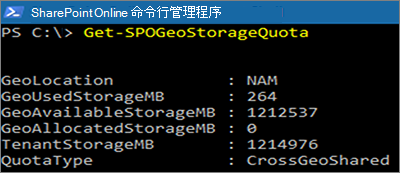

# <a name="sharepoint-storage-quotas-in-multi-geo-environments"></a>多地理位置环境中的 SharePoint 存储配额

默认情况下，多地理位置环境中的所有地理位置具有相同的可用租户存储配额。

使用 SharePoint 地理位置存储配额设置，你可以管理每个地理位置的存储配额。 为地理位置分配存储配额时，该配额将成为可用于该地理位置的最大存储量，并将从可用租户存储配额扣除该配额。 然后，将在未分配特定存储配额的已配置地理位置之间共享剩余的可用租户存储配额。

SharePoint Online 管理员可通过连接到中心位置来为任何地理位置分配 SharePoint 存储配额。 附属位置的地理位置管理员可查看存储配额，但无法分配。

## <a name="configure-a-storage-quota-for-a-geo-location"></a>为地理位置配置存储配额

使用 [Microsoft SharePoint Online 模块](https://www.microsoft.com/download/details.aspx?id=35588)，并连接到中心位置来为地理位置分配存储配额。

若要为某个位置分配存储配额，请运行 cmdlet：

```powershell
Set-SPOGeoStorageQuota -GeoLocation <geolocationcode> -StorageQuotaMB <value>
```

若要查看当前地理位置的存储配额，请运行：

```powershell
Get-SPOGeoStorageQuota
```



若要查看所有地理位置的存储配额，请运行：

```powershell
Get-SPOGeoStorageQuota -AllLocations
```

若要为某个地理位置删除分配的存储配额，请设置 `StorageQuota value = 0`：

```powershell
Set-SPOGeoStorageQuota -GeoLocation <geolocationcode> -StorageQuotaMB 0
```
