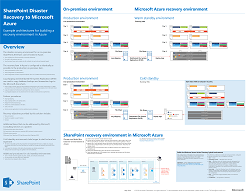
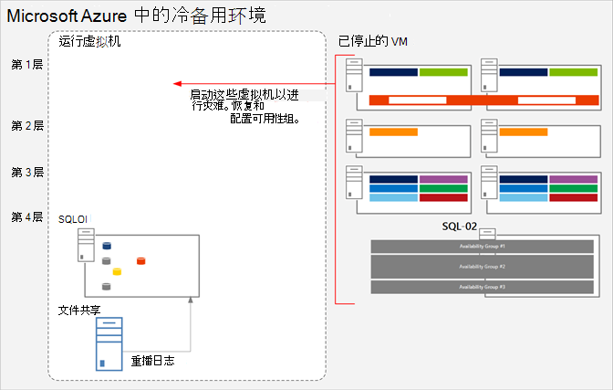

# <a name="sharepoint-server-2013-disaster-recovery-in-microsoft-azure"></a>Microsoft Azure 中的 SharePoint Server 2013 灾难恢复

 使用 Azure，你可以为本地服务器场创建灾难恢复SharePoint环境。 本文介绍如何设计和实施此解决方案。

 **观看 SharePoint Server 2013 灾难恢复概述视频**
> [!VIDEO https://www.microsoft.com/videoplayer/embed/1b73ec8f-29bd-44eb-aa3a-f7932784bfd9?autoplay=false]

 当灾难袭击你的 SharePoint 内部部署环境时，头等大事是迅速使系统恢复运行。如果你已有备份环境在 Microsoft Azure 中运行，SharePoint 灾难恢复将更加快速、轻松。本视频介绍 SharePoint 温故障转移环境的主要概念，并补充了本文中提供的完整详细信息。

将本文与以下解决方案模型结合使用： **Microsoft Azure 中的 SharePoint 灾难恢复** 。

[](https://go.microsoft.com/fwlink/p/?LinkId=392555)

 [PDF](https://go.microsoft.com/fwlink/p/?LinkId=392555) | [Visio](https://go.microsoft.com/fwlink/p/?LinkId=392554)

## <a name="use-azure-infrastructure-services-for-disaster-recovery"></a>使用 Azure 基础结构服务进行灾难恢复

很多组织没有 SharePoint 的灾难恢复环境，因为在内部构建和维护此环境非常昂贵。Azure 基础结构服务提供了灾难恢复环境极具吸引力的选项，这些选项更加灵活且成本比内部部署方案要低。

使用 Azure 基础结构服务的优点如下：

- **资源成本更低** 维护和支付比内部部署灾难恢复环境更少的资源。资源数量取决于你选择的灾难恢复环境：冷备用、温备用或热备用。

- **资源灵活性更高** 如果发生灾难，轻松扩展恢复 SharePoint 服务器场以满足负载要求。当你不再需要这些资源时，进行缩放。

- **数据中心承诺更低** 使用 Azure 基础结构服务，而不是在其他地区投资建设辅助数据中心。

对于刚刚开始接触灾难恢复的组织，提供不太复杂的选项；对于具有高弹性要求的组织，则提供一些高级选项。当环境承载在云平台上时，冷备用、温备用和热备用环境的定义略有不同。下表介绍了在 Azure 中构建 SharePoint 恢复场的环境。

**表：恢复环境**

|恢复环境的类型|说明|
|---|---|
|热备用|设置并更新一个完全大小的服务器场，且以备用状态运行。|
|温备用|已构建服务器场，虚拟机正在运行并且已更新。 <br/> 恢复包括附加内容数据库、设置服务应用程序和爬网内容。 <br/> 服务器场可以是生产服务器场的较小版本，它可以向外扩展以便为整个用户群提供服务。|
|冷备用|服务器场已完全构建，但虚拟机已停止。 <br/> 维护环境包括偶尔启动虚拟机，以及修补、更新和验证环境。 <br/> 启动完整环境发生灾难时。|

请务必评估你的组织的恢复时间目标 (RTO) 和恢复点目标 (RPO)。这些要求确定了哪个环境是最适合贵组织的投资。

本文中的指南介绍如何实现温备用环境。你也可以对其进行调整使其适合冷备用环境，尽管你需要执行一些其他步骤才能支持此类环境。本文不会介绍如何实现热备用环境。

有关灾难恢复解决方案的详细信息，请参阅 [High availability and disaster recovery concepts in SharePoint 2013](/SharePoint/administration/high-availability-and-disaster-recovery-concepts)和[Choose a disaster recovery strategy for SharePoint 2013](/SharePoint/administration/plan-for-disaster-recovery)。

## <a name="solution-description"></a>解决方案描述

温备用灾难恢复解决方案需要以下环境：

- 内部部署 SharePoint 生产服务器场

- Azure 中的恢复 SharePoint 服务器场

- 两个环境之间的站点到站点 VPN 连接

下图说明了这三个元素。

**图：Azure 中温备用解决方案的元素**


SQL Server 日志传送与分布式文件系统复制 (DFSR) 用于将数据库备份和事务日志复制到 Azure 中的恢复场：

- DFSR 将日志从生产环境传输到恢复环境。在 WAN 方案中，DFSR 比将日志直接传输到 Azure 中的辅助服务器更有效。

- 日志将重播到 Azure 恢复环境中的 SQL Server。

- 你不会在恢复环境中附加日志传送的 SharePoint 内容数据库，除非执行恢复操作。

执行下列步骤，恢复服务器场：

1. 停止日志传送。

2. 停止接受到主服务器场通信。

3. 重播最后的事务日志。

4. 将内容数据库附加到服务器场。

5. 从复制的服务数据库中还原服务应用程序。

6. 将域名系统 (DNS) 记录更新为指向恢复场。

7. 启动完全爬网。

我们建议你定期演练这些步骤并进行记录，以确保在线恢复顺利运行。附加内容数据库和恢复服务应用程序可能需要一些时间，并且通常涉及一些手动配置。

执行恢复后，此解决方案将提供下表中列出的项目。

**表：解决方案恢复目标**

|Item|说明|
|---|---|
|网站和内容|网站和内容在恢复环境中可用。|
|新的搜索实例|在此温备用解决方案中，不会从搜索数据库还原搜索。恢复场中的搜索组件尽可能配置得与生产服务器场类似。网站和内容还原后，会启动完全爬网以重建搜索索引。你不需要等待爬网完成，即可使网站和内容可用。|
|服务|将数据存储在数据库中的服务从日志传送的数据库还原。不在数据库中存储数据的服务则直接启动。 <br/> 并非数据库的所有服务都需要还原。下列服务不需要从数据库还原，在故障转移后可以直接启动： <br/> Usage and Health Data Collection <br/> State service <br/> Word Automation <br/> 任何其他不使用数据库的服务|

你可以与 Microsoft 咨询服务 (MCS) 或合作伙伴合作以实现更复杂的恢复目标。下表中汇总了详细信息。

**表：可以由 MCS 或合作伙伴解决的其他项目**

|Item|说明|
|---|---|
|正在同步的自定义场解决方案|理想情况下，恢复场的配置与生产服务器场相同。你可以与顾问或合作伙伴合作，评估是否复制了自定义服务器场解决方案，以及是否制定了将两个环境保持同步的流程。|
|到内部部署数据源的连接|将连接复制到后端数据系统可能并不实用，例如备份域控制器 (BDC) 连接和搜索内容源。|
|搜索还原方案|由于企业搜索部署通常非常独特且复杂，从数据库还原搜索需要更大的投资。你可以与顾问或合作伙伴合作，以确定并实施贵组织可能需要的搜索还原方案。|

本文中提供的指南假定已设计和部署内部部署服务器场。

## <a name="detailed-architecture"></a>详细体系结构

理想情况下，Azure 中的恢复服务器场配置与内部部署服务器场相同，其中包括以下内容：

- 服务器角色的表示形式相同

- 自定义配置相同

- 搜索组件的配置相同

Azure 中的环境可以是生产服务器场的较小版本。如果你计划在故障转移后向外扩展恢复场，必须对每种类型的服务器进行初始表示。

某些配置可能无法在故障转移环境中复制。请务必测试故障转移过程和环境，确保故障转移服务器场提供预期的服务级别。

此解决方案不会规定 SharePoint 服务器场的特定拓扑。此解决方案的焦点是将 Azure 用于故障转移服务器场，并在两个环境之间实施日志传送和 DFSR。

### <a name="warm-standby-environments"></a>温备用环境

在温备用环境中，Azure 环境中的所有虚拟机均正常运行。环境已准备就绪，可用于故障转移练习或事件。

下图说明了从内部部署 SharePoint 服务器场到基于 Azure 的 SharePoint 服务器场（配置为温备用环境）的灾难恢复解决方案。

**图：生产场和温备用状态恢复场的拓扑和主要元素**


在此图中：

- 两个环境并排显示：内部部署 SharePoint 服务器场和 Azure 中的温备用服务器场。

- 每个环境包含一个文件共享。

- 每个服务器场包含四层。为实现高可用性，每一层包含两台服务器或为特定角色配置得相同的虚拟机，如前端服务、分布式缓存、后端服务和数据库。在此图中，调用特定的组件并不重要。两个服务器场的配置相同。

- 第四层是数据库层。日志传送用于将日志从本地环境中的辅助数据库服务器复制到同一环境中的文件共享。

- DFSR 将本地环境中的文件共享复制到 Azure 环境中的文件共享

- 日志传送将日志从 Azure 环境中的文件共享中继到恢复环境中 SQL Server AlwaysOn 可用性组的主副本。

### <a name="cold-standby-environments"></a>冷备用环境

在冷备用环境中，大部分 SharePoint 服务器场虚拟机都可以关闭。（建议有时启动虚拟机，例如每两周或一次或一个月一次，以便每个虚拟机可与域同步。）Azure 恢复环境中的下列虚拟机必须保持运行状态，以确保日志传送和 DFSR 持续运行：

- 文件共享

- 主数据库服务器

- 至少一个运行 Windows Server Active Directory 域服务和 DNS 的虚拟机

下图显示了文件共享虚拟机和主 SharePoint 数据库虚拟机正在运行的 Azure 故障转移环境。所有其他 SharePoint 虚拟机都已停止。运行 Windows Server Active Directory 和 DNS 的虚拟机不会显示。

**图：包含运行的虚拟机的冷备用恢复场**



故障转移到冷备用环境之后，所有虚拟机都将启动，必须配置实现数据库服务器高可用性的方法，例如 SQL Server AlwaysOn 可用性组。

如果实施了多个存储组（数据库分布在多个 SQL Server 高可用性集之间），则每个存储组的主数据库都必须处于运行状态以接受与其存储组关联的日志。

### <a name="skills-and-experience"></a>技能和经验

此灾难恢复解决方案中使用了多种技术。要确保这些技术按预期交互，内部部署和 Azure 环境中的每个组件都必须正确安装和配置。我们建议设置此解决方案的用户或团队具有下列文章中所述技术的丰富工作知识和动手技能：

- [分布式文件系统 (DFS) 复制服务](/previous-versions/windows/it-pro/windows-server-2012-R2-and-2012/jj127250(v=ws.11))

- [Windows Server 故障转移群集 (WSFC) 与 SQL Server](/sql/sql-server/failover-clusters/windows/windows-server-failover-clustering-wsfc-with-sql-server)

- [AlwaysOn 可用性组 (SQL Server)](/sql/database-engine/availability-groups/windows/always-on-availability-groups-sql-server)

- [SQL Server 数据库的备份和还原](/sql/relational-databases/backup-restore/back-up-and-restore-of-sql-server-databases)

- [SharePoint Server 2013 安装和服务器场部署](/SharePoint/install/installation-and-configuration-overview)

- [Microsoft Azure](/azure/)

最后，我们建议使用脚本编程技能，你可以用于将与这些技术相关的任务自动化。可以使用可用的用户界面完成此解决方案中所述的所有任务。但是，手动方法可能非常耗时且容易出现错误，并会交付不一致的结果。

除了 Windows PowerShell 之外，还有用于 SQL Server、SharePoint Server 和 Azure 的 Windows PowerShell 库。不要忘记 T-SQL，它还可以帮助减少配置和维护灾难恢复环境所需的时间。

## <a name="disaster-recovery-roadmap"></a>灾难恢复路线图


此路线图假定你已经在生产中部署了 SharePoint Server 2013 服务器场。

**表：灾难恢复路线图**

|阶段|说明|
|---|---|
|阶段 1|设计灾难恢复环境。|
|阶段 2|创建 Azure 虚拟网络和 VPN 连接。|
|阶段 3|将 Windows Active Directory 和域名服务部署到 Azure 虚拟网络。|
|阶段 4|将 SharePoint 恢复场部署到 Azure 中。|
|阶段 5|设置场之间的 DFSR。|
|阶段 6|设置到恢复场的日志传送。|
|阶段 7|验证故障转移和恢复解决方案，其中包括以下过程和技术： <br/> 停止日志传送。 <br/> 将备份还原。 <br/> 对内容爬网。 <br/> 恢复服务。 <br/> 管理 DNS 记录。|

## <a name="phase-1-design-the-disaster-recovery-environment"></a>阶段 1：设计灾难恢复环境

使用 [SharePoint 2013 的 Microsoft Azure 体系结构](microsoft-azure-architectures-for-sharepoint-2013.md)中的指导设计灾难恢复环境，包括 SharePoint 恢复场。 可以使用 Azure SharePoint 灾难恢复解决方案 Visio 中的[](https://go.microsoft.com/fwlink/p/?LinkId=392554)图形开始设计过程。 我们建议你先设计整个环境，然后开始在 Azure 环境中执行任何工作。

除了 [SharePoint 2013 的 Microsoft Azure 体系结构](microsoft-azure-architectures-for-sharepoint-2013.md)中提供的虚拟网络、VPN 连接、Active Directory 和 SharePoint 服务器场设计指导外，请务必将文件共享角色添加到 Azure 环境。

要在灾难恢复解决方案中支持日志传送，应将文件共享虚拟机添加到数据库角色驻留的子网。文件共享还充当 SQL Server AlwaysOn 可用性组多数节点的第三个节点。对于使用 SQL Server AlwaysOn 可用性组的标准 SharePoint 服务器场，这是建议配置。

> [!NOTE]
> 必须查看使数据库参与 SQL Server AlwaysOn 可用性组的先决条件。有关详细信息，请参阅[针对 AlwaysOn 可用性组的先决条件、限制和建议](/sql/database-engine/availability-groups/windows/prereqs-restrictions-recommendations-always-on-availability)。

**图：用于灾难恢复解决方案的文件服务器的放置**


在此图中，文件共享虚拟机将添加到 Azure 中包含数据库服务器角色的相同子网中。请勿将文件共享虚拟机添加到具有其他服务器角色的可用性集，例如 SQL Server 角色。

如果你关注日志的高可用性，请考虑采取其他方法，即[使用 Azure Blob 存储服务进行 SQL Server 备份和还原](/sql/relational-databases/backup-restore/sql-server-backup-and-restore-with-microsoft-azure-blob-storage-service)。这是 Azure 中的新增功能，可将日志直接保存到 Blob 存储 URL。此解决方案不包括有关使用此功能的指导。

在设计恢复场时，请牢记，成功的灾难恢复环境能够准确反映你想要恢复的生产服务器场。恢复场的大小不是恢复场设计、部署和测试中最重要的因素。恢复场规模因组织而异，具体取决于组织的需求。在出现短暂中断时，它可能会使用向下伸缩的服务器场，或者直到性能和容量需求要求你扩展服务器场。

将恢复场尽量配置得与生产服务器场相同，以便其满足服务级别协议 (SLA) 要求并提供支持业务所需的功能。当你设计灾难恢复环境时，还需审核生产环境的变更管理过程。我们建议你按与生产环境相同的间隔更新恢复环境，以将变更管理过程扩展到恢复环境。作为变更管理过程的一部分，我们建议你维护一张详细的服务器场配置、应用程序和用户清单。

## <a name="phase-2-create-the-azure-virtual-network-and-vpn-connection"></a>阶段 2：创建 Azure 虚拟网络和 VPN 连接

[将本地网络连接到 Microsoft Azure 虚拟网络](connect-an-on-premises-network-to-a-microsoft-azure-virtual-network.md) 介绍如何在 Azure 中规划和部署虚拟网络以及如何创建 VPN 连接。请按照相应主题中的指导完成下列过程：

- 规划虚拟网络的专用 IP 地址空间。

- 规划虚拟网络的路由基础结构更改。

- 规划发送到本地 VPN 设备以及从本地 VPN 设备发出的流量的防火墙规则。

- 在 Azure 中创建跨部署虚拟网络。

- 配置本地网络和虚拟网络之间的路由。

## <a name="phase-3-deploy-active-directory-and-domain-name-services-to-the-azure-virtual-network"></a>阶段 3：将 Active Directory 和域名服务部署到 Azure 虚拟网络

此阶段包括将 Windows Server Active Directory 和 DNS 部署到混合方案中的 虚拟网络，如 [SharePoint 2013 的 Microsoft Azure 体系结构](microsoft-azure-architectures-for-sharepoint-2013.md)中所述以及下图中所示。

**图：混合 Active Directory 域配置**


在此图中，将两个虚拟机部署到相同的子网中。这两个虚拟机分别托管两个角色：Active Directory 和 DNS。

在 Azure 中部署 Active Directory 之前，阅读[在 Azure 虚拟机上部署 Windows Server Active Directory 的指南](/windows-server/identity/ad-ds/introduction-to-active-directory-domain-services-ad-ds-virtualization-level-100)。这些指南将帮助你确定你的解决方案是否需要不同的体系结构或不同的配置设置。

有关在 Azure 中设置域控制器的详细指导，请参阅[在 Azure 虚拟网络中安装副本 Active Directory 域控制器](/windows-server/identity/ad-ds/introduction-to-active-directory-domain-services-ad-ds-virtualization-level-100)。

在此阶段之前，你没有向虚拟网络部署虚拟机。用于承载 Active Directory 和 DNS 的虚拟机可能不是你的解决方案需要的最大虚拟机。在部署这些虚拟机之前，首先创建你计划在虚拟网络中使用的最大虚拟机。这有助于确保你的解决方案在 Azure 中被标记为允许你需要的最大大小。目前不需要配置此虚拟机。只需进行创建，然后放到一旁。如果不这样做，你稍后在尝试创建更大的虚拟机时可能会受到限制，编写本文时此问题尚未解决。

## <a name="phase-4-deploy-the-sharepoint-recovery-farm-in-azure"></a>阶段 4：在 Azure 中部署 SharePoint 恢复场

根据你的设计规划，在 虚拟网络 中部署 SharePoint 服务器场。在 Azure 中部署 SharePoint 角色之前，查看[在 Azure 基础结构服务上规划 SharePoint 2013](/previous-versions/azure/dn275958(v=azure.100)) 对你有一定的帮助。

考虑在构建概念证明环境时了解到的以下做法：

- 通过使用 Azure 门户或 PowerShell 创建虚拟机。

- Azure 和 Hyper-V 不支持动态内存。请确保在你的性能和容量规划中考虑到了这一点。

- 通过 Azure 界面重新启动虚拟机，而不是在虚拟机登录时。使用 Azure 界面会更顺利，并且更易于预测。

- 如果你想关闭某个虚拟机以节约成本，请使用 Azure 界面。如果你在虚拟机登录时关闭，费用仍会累计。

- 使用虚拟机的命名约定。

- 注意虚拟机部署在哪个数据中心位置。

- SharePoint 角色不支持 Azure 中的自动缩放功能。

- 请勿在将要还原的服务器场中配置项目，例如网站集。

## <a name="phase-5-set-up-dfsr-between-the-farms"></a>阶段 5：设置场之间的 DFSR

要使用 DFSR 设置文件复制，请使用 DNS Management 管理单元。但是在 DFSR 设置之前，请登录到你的内部部署文件服务器和 Azure 文件服务器，并在 Windows 中启用服务。

从服务器管理器仪表板中，完成以下步骤：

- 配置本地服务器。

- 启动"添加角色和功能向导"。

- 打开"文件和存储服务"节点。

- 选择"DFS 命名空间"和"DFS 复制"。

- 单击"下一步"完成向导步骤。

下表提供了指向 DFSR 参考文章和博客文章的链接。

**表：DFSR 的参考文章**

|标题|说明|
|---|---|
|[复制](/previous-versions/windows/it-pro/windows-server-2008-R2-and-2008/cc770278(v=ws.11))|DFS 管理 TechNet 主题，包含复制链接|
|[DFS 复制：生存指南](https://go.microsoft.com/fwlink/p/?LinkId=392737)|Wiki，包含 DFS 信息的链接|
|[DFS 复制：常见问题](/previous-versions/windows/it-pro/windows-server-2003/cc773238(v=ws.10))|DFS 复制 TechNet 主题|
|[Jose Barreto 的博客](/archive/blogs/josebda/)|由 Microsoft 文件服务器团队首席项目经理撰写的博客|
|[Microsoft 存储团队 - 文件柜博客](https://go.microsoft.com/fwlink/p/?LinkId=392740)|关于 Windows Server 中的文件服务和存储功能的博客|

## <a name="phase-6-set-up-log-shipping-to-the-recovery-farm"></a>阶段 6：设置到恢复场的日志传送

日志传送是在此环境中设置灾难恢复的关键组件。你可以使用日志传送，将数据库的事务日志文件从主数据库服务器实例自动传送到辅助数据库服务器实例。要设置日志传送，请参阅[Configure log shipping in SharePoint 2013](/sharepoint/administration/configure-log-shipping)。

> [!IMPORTANT]
> SharePoint Server 中的日志传送支持仅限于特定数据库。有关详细信息，请参阅 [SharePoint 数据库的受支持的高可用性和灾难恢复选项 (SharePoint 2013)](/SharePoint/administration/supported-high-availability-and-disaster-recovery-options-for-sharepoint-databas)。

## <a name="phase-7-validate-failover-and-recovery"></a>阶段 7：验证故障转移和恢复

最后这一阶段的目的是验证灾难恢复解决方案按计划运行。为此，请创建一个故障转移事件，关闭生产服务器场并启动恢复场以进行替换。您可以手动或使用脚本启动故障转移方案。

第一步是停止对服务器场服务或内容的传入用户请求。你可以通过禁用 DNS 条目或关闭前端 Web 服务器来执行此操作。服务器场关闭后，你可以故障转移到恢复场。

### <a name="stop-log-shipping"></a>停止日志传送

你必须在服务器场恢复之前停止日志传送。首先在 Azure 中的辅助服务器上停止日志传送，然后在内部部署主服务器上停止日志传送。使用以下脚本，首先在辅助服务器上，然后在主服务器上停止日志传送。脚本中的数据库名称可能不同，具体取决于你的环境。

```
-- This script removes log shipping from the server.
-- Commands must be executed on the secondary server first and then on the primary server.

SET NOCOUNT ON
DECLARE  @PriDB nvarchar(max)
,@SecDB nvarchar(250)
,@PriSrv nvarchar(250)
,@SecSrv nvarchar(250)

Set @PriDB= ''
SET @PriDB = UPPER(@PriDB)
SET @PriDB = REPLACE(@PriDB, ' ', '')
SET @PriDB = '''' + REPLACE(@PriDB, ',', ''', ''') + ''''

Set @SecDB = @PriDB

Exec ( 'Select  ''exec master..sp_delete_log_shipping_secondary_database '' + '''''''' + prm.primary_database +  ''''''''
from msdb.dbo.log_shipping_monitor_primary prm INNER JOIN msdb.dbo.log_shipping_primary_secondaries sec  ON  prm.primary_database=sec.secondary_database
where prm.primary_database in ( ' + @PriDB + ' )')

Exec ( 'Select  ''exec master..sp_delete_log_shipping_primary_secondary '' + '''''''' + prm.Primary_Database + '''''', '''''' + sec.Secondary_Server + '''''', '''''' + sec.Secondary_database + ''''''''
from msdb.dbo.log_shipping_monitor_primary prm INNER JOIN msdb.dbo.log_shipping_primary_secondaries sec  ON  prm.primary_database=sec.secondary_database
where prm.primary_database in ( ' + @PriDB + ' )')

Exec ( 'Select  ''exec master..sp_delete_log_shipping_primary_database '' + '''''''' + prm.primary_database +  ''''''''
from msdb.dbo.log_shipping_monitor_primary prm INNER JOIN msdb.dbo.log_shipping_primary_secondaries sec  ON  prm.primary_database=sec.secondary_database
where prm.primary_database in ( ' + @PriDB + ' )')

Exec ( 'Select  ''exec master..sp_delete_log_shipping_secondary_primary '' + '''''''' + prm.primary_server + '''''', '''''' + prm.primary_database +  ''''''''
from msdb.dbo.log_shipping_monitor_primary prm INNER JOIN msdb.dbo.log_shipping_primary_secondaries sec  ON  prm.primary_database=sec.secondary_database
where prm.primary_database in ( ' + @PriDB + ' )')
```

### <a name="restore-the-backups"></a>将备份还原

备份必须按其创建的顺序还原。在还原特定事务日志备份之前，你必须首先在不回滚未提交的事务的情况下，还原下列之前的备份（即，使用  `WITH NORECOVERY`）：

- 完整的数据库备份和最新的差异备份 - 还原在执行特定事务日志备份之前创建的备份（如果存在）。在最新的完整或差异数据库备份创建之前，数据库使用完整恢复模型或大容量日志恢复模型。

- 所有事务日志备份 - 还原在执行完整数据库备份或差异备份（如果还原其中一个）之后，执行特定事务日志备份之前创建的备份。日志备份必须按其创建顺序应用，日志链中没有任何间隔。

要恢复辅助服务器上的内容数据库以便由网站呈现，请在恢复之前移除所有数据库连接。要还原数据库，请运行以下 SQL 语句。

```SQL
restore database WSS_Content with recovery
```

> [!IMPORTANT]
> 明确使用 T-SQL 时，在每个 RESTORE 语句中指定 **WITH NORECOVERY** 或 **WITH RECOVERY** 以消除歧义这在编写脚本时非常重要。还原完整和差异备份后，可以在 SQL Server Management Studio 中还原事务日志。此外，由于日志传送已停止，内容数据库处于备用状态，因为你必须将状态更改为完全访问。

在 SQL Server Management Studio 中，右键单击“WSS_Content”数据库，依次指向“任务” > “还原”，再单击“事务日志”（如果还没有还原完整备份，则不可用）。有关详细信息，请参阅[还原事务日志备份 (SQL Server)](/sql/relational-databases/backup-restore/restore-a-transaction-log-backup-sql-server)。

### <a name="crawl-the-content-source"></a>对内容源进行爬网

你必须为每个内容源启动完整爬网以还原 Search Service。请注意，你会丢失内部部署服务器场的部分分析信息，例如搜索建议。在启动完整爬网之前，请使用 Windows PowerShell cmdlet **Restore-SPEnterpriseSearchServiceApplication** 并指定日志传送和复制的搜索管理数据库 **Search_Service__DB_\<GUID\>**。此 cmdlet 将提供搜索配置、架构、托管属性、规则和源，并创建一组默认的其他组件。

要启动完全爬网，请完成以下步骤：

1. 在 SharePoint 2013 管理中心中，转到"应用程序管理">"服务应用程序">"管理服务应用程序"，然后单击你要爬网的 Search Service 应用程序。

2. 在"搜索管理"页上，单击"内容源"，指向你需要的内容源，单击箭头，然后单击"启动完整爬网"。

### <a name="recover-farm-services"></a>恢复服务器场服务

下表显示如何恢复已对数据库进行日志传送的服务、具有数据库但不建议使用日志传送进行还原的服务，以及没有数据库的服务。

> [!IMPORTANT]
> 将内部部署 SharePoint 数据库还原到 Azure 环境中将不会恢复任何尚未手动安装在 Azure 中的 SharePoint 服务。

**表：服务应用程序数据库引用**

|从已进行日志传送的数据库还原这些服务|这些服务具有数据库，但我们建议您直接启动这些服务，无需还原其数据库|这些服务不在数据库中存储任何数据；请在故障转移后启动这些服务|
|---|---|---|
|机器翻译服务 <br/> Managed Metadata Service <br/> Secure Store Service <br/> User Profile。（仅支持配置文件和社交标签数据库。不支持同步数据库。） <br/> Microsoft SharePoint Foundation Subscription Settings Service|Usage and Health Data Collection <br/> State service <br/> Word Automation|Excel Services <br/> PerformancePoint Services <br/> PowerPoint 转换 <br/> Visio Graphics Service <br/> 工作管理|

以下示例演示如何从数据库中还原 Managed Metadata Service。

需使用现有的Managed_Metadata_DB数据库。此数据库已进行日志传送，但辅助服务器场上没有活动的服务应用程序，因此需要在服务应用程序就位后进行连接。

首先，使用  `New-SPMetadataServiceApplication`，并使用已还原数据库的名称指定  `DatabaseName` 开关。

接下来，在辅助服务器上配置新的 Managed Metadata Service 应用程序，如下所示：

- 名称：Managed Metadata Service

- 数据库服务器：传送的事务日志中的数据库名称

- 数据库名称：Managed_Metadata_DB

- 应用程序池：SharePoint 服务应用程序

### <a name="manage-dns-records"></a>管理 DNS 记录

您必须手动创建 DNS 记录以指向您的 SharePoint 服务器场。

在你具有多个前端 Web 服务器的大多数情况下，利用 Windows Server 2012 中的网络负载平衡功能或硬件负载平衡器在服务器场中的 Web 前端服务器之间分发请求是明智的。网络负载平衡还可以在一个 Web 前端服务器出现故障时将请求分发到其他服务器，从而减少风险。

通常情况下，当你设置网络负载平衡时，将向群集分配单个 IP 地址。然后你在 DNS 提供程序中为指向群集的网络创建 DNS 主机。（在此项目中，我们将 DNS 服务器放置在 Azure 中，确保在出现内部部署数据中心故障时能够恢复。）例如，你可以在 DNS 管理器的 Active Directory 中创建指向负载平衡群集的 IP 地址的 DNS 记录（例如，称为  `https://sharepoint.contoso.com`）。

对于对 SharePoint 服务器场的外部访问，您可以在外部 DNS 服务器上创建一个主机记录，其 URL 与客户端在 Intranet (上使用的 URL 相同 (`https://sharepoint.contoso.com` 例如，指向防火墙中的外部 IP 地址的) 。  (此示例的最佳实践是设置拆分 DNS，以便内部 DNS `contoso.com` 服务器对 DNS 服务器具有权威性，将请求直接路由到 SharePoint 场群集，而不是将 DNS 请求路由到外部 DNS 服务器。) 然后，可以将外部 IP 地址映射到内部部署群集的内部 IP 地址，以便客户端找到所需的资源。

接下来，将介绍几种不同的灾难恢复应用场景：

 **示例场景：由于内部部署 SharePoint 服务器场中的硬件故障，内部部署 SharePoint 服务器场不可用。** 这种情况下，在你完成故障转移到 Azure SharePoint 服务器场的步骤后，你可以在恢复 SharePoint 服务器场的 Web 前端服务器上配置网络负载平衡，就像在内部部署服务器场中一样。然后你可以将内部 DNS 提供程序中的主机记录重定向为指向恢复场的群集 IP 地址。请注意，可能需要一些时间才会刷新客户端上的缓存 DNS 记录并使其指向恢复场。

 **示例场景：内部部署数据中心会完全中断。** 此场景可能是由于自然灾害所致，例如火灾或水灾。这种情况下，对于企业来说，可能希望有一个辅助数据中心承载在另一个区域，还有具有自己的目录服务和 DNS 的 Azure 子网。与前一个灾难场景中一样，你可以将内部和外部 DNS 记录重定向为指向 Azure SharePoint 服务器场。同样，记下该 DNS 记录传播可能需要一些时间。

如果您使用的是以主机命名的网站集，如以主机命名的网站集体系结构和部署 [ (SharePoint 2013) ](/SharePoint/administration/host-named-site-collection-architecture-and-deployment)中的建议，则 SharePoint 服务器场中可能由同一 Web 应用程序承载多个网站集， `https://sales.contoso.com` `https://marketing.contoso.com` 其中唯一 DNS 名称为 (，) 。 在这种情况下，你可以为每个网站集创建指向群集 IP 地址的 DNS 记录。 请求到达 SharePoint Web 前端服务器之后，它们会将每个请求路由到相应的网站集。

## <a name="microsoft-proof-of-concept-environment"></a>Microsoft 概念证明环境

我们为此解决方案设计了概念证明环境并进行了测试。我们的测试环境的设计目标是部署和恢复已在客户环境中找到的 SharePoint 服务器场。我们进行了几种假设，但我们始终牢记，服务器场需提供所有现成功能，而无需进行任何自定义。我们使用现场和产品团队的最佳实践指南设计拓扑，确保其高可用性。

下表列出了我们为内部部署测试环境创建和配置的 Hyper-V 虚拟机。

**表：用于内部部署测试的虚拟机**

|服务器名称。|角色|配置|
|---|---|---|
|DC1|具有 Active Directory 的域控制器。|两个处理器 <br/> 从 512 MB 到 4 GB RAM <br/> 1 x 127-GB 硬盘|
|RRAS|配置为路由和远程访问服务 (RRAS) 角色的服务器。|两个处理器 <br/> 2-8 GB 的 RAM <br/> 1 x 127-GB 硬盘|
|FS1|具有备份共享和 DFSR 终结点的文件服务器。|四个处理器 <br/> 2-12 GB 的 RAM <br/> 1 x 127-GB 硬盘 <br/> 1 x 1-TB 硬盘 (SAN) <br/> 1 x 750-GB 硬盘|
|SP-WFE1、SP-WFE2|前端 Web 服务器。|四个处理器 <br/> 16 GB RAM|
|SP-APP1、SP-APP2、SP-APP3|应用程序服务器。|四个处理器 <br/> 2-16 GB 的 RAM|
|SP-SQL-HA1、SP-SQL-HA2|数据库服务器，配置了 SQL Server 2012 AlwaysOn 可用性组以提供高可用性。此配置使用 SP-SQL-HA1 和 SP-SQL-HA2 作为主副本和辅助副本。|四个处理器 <br/> 2-16 GB 的 RAM|

下表介绍了我们为内部部署测试环境的前端 Web 服务器和应用程序服务器而创建和配置的 Hyper-V 虚拟机的驱动器配置。

**表：用于内部部署测试的前端 Web 服务器和应用程序服务器的虚拟机驱动器要求**

|驱动器号|Size|目录名称|Path|
|---|---|---|---|
|C|80|系统驱动器|\<DriveLetter\>:\\Program Files\\Microsoft SQL Server\\|
|E|80|日志驱动器 (40 GB)|\<DriveLetter\>:\\Program Files\\Microsoft SQL Server\\MSSQL10_50.MSSQLSERVER\\MSSQL\\DATA|
|F|80|页面 (36 GB)|\<DriveLetter\>:\\Program Files\\Microsoft SQL Server\\MSSQL\\DATA|

下表介绍了创建和配置作为内部部署数据库服务器的 Hyper-V 虚拟机的驱动器配置。在"数据库引擎配置"页上，访问"数据目录"选项卡以设置并确认下表中所示的设置。

**表：用于内部部署测试的数据库服务器的虚拟机驱动器要求**

|驱动器号|Size|目录名称|Path|
|---|---|---|---|
|C|80|数据根目录|\<DriveLetter\>:\\Program Files\\Microsoft SQL Server\\|
|E|500|用户数据库目录|\<DriveLetter\>:\\Program Files\\Microsoft SQL Server\\MSSQL10_50.MSSQLSERVER\\MSSQL\\DATA|
|F|500|用户数据库日志目录|\<DriveLetter\>:\\Program Files\\Microsoft SQL Server\\MSSQL10_50.MSSQLSERVER\\MSSQL\\DATA|
|G|500|临时数据库目录|\<DriveLetter\>:\\Program Files\\Microsoft SQL Server\\MSSQL10_50.MSSQLSERVER\\MSSQL\\DATA|
|H|500|临时数据库日志目录|\<DriveLetter\>:\\Program Files\\Microsoft SQL Server\\MSSQL10_50.MSSQLSERVER\\MSSQL\\DATA|

### <a name="setting-up-the-test-environment"></a>设置测试环境

在不同的部署阶段，测试团队通常首先构建内部部署基础结构，然后构建相应的 Azure 环境。这反映了内部生产服务器场已在运行的常规真实案例。更为重要的是，你应该了解当前生产工作负载、容量和典型性能。除了构建可以满足业务需求的灾难恢复模型外，你还应该调整恢复场服务器的大小以交付最低级别的服务。在冷备用或温备用环境中，恢复场通常小于生产服务器场。恢复场稳定并且投入生产之后，服务器场可以向上和向外扩展以满足工作负载要求。

我们分三个阶段来部署测试环境：

- 设置混合基础结构

- 设置服务器

- 部署 SharePoint 服务器场

#### <a name="set-up-the-hybrid-infrastructure"></a>设置混合基础结构

此阶段涉及设置内部部署服务器场的域环境以及 Azure 中的恢复场。除了与配置 Active Directory 相关的普通任务之外，测试团队还在两个环境之间实施了一个路由解决方案和 VPN 连接。

#### <a name="provision-the-servers"></a>设置服务器

除了场服务器之外，还必须为域控制器设置服务器，并配置处理 RRAS 以及站点间 VPN 的服务器。为 DFSR 服务设置两个文件服务器，为测试人员设置多个客户端计算机。

#### <a name="deploy-the-sharepoint-farms"></a>部署 SharePoint 服务器场

SharePoint 服务器场分两个阶段部署，以便在必要时简化环境稳定化和故障排除。在第一个阶段中，每个服务器场部署在拓扑每一层最低数量的服务器上，以支持所需功能。

我们在创建 SharePoint 2013 服务器之前创建安装了 SQL Server 的数据库服务器。因为这是一个新部署，我们在部署 SharePoint 之前创建了可用性组。我们根据 MCS 最佳实践指南创建了三个组。

> [!NOTE]
> 创建占位符数据库，以便你可以在执行 SharePoint 安装之前创建可用性组。有关详细信息，请参阅[为 SharePoint 2013 配置 SQL Server 2012 AlwaysOn 可用性组](/SharePoint/administration/configure-an-alwayson-availability-group)

我们创建了服务器场并按以下顺序加入其他服务器：

- 设置 SP-SQL-HA1 和 SP-SQL-HA2。

- 为服务器场配置 AlwaysOn 并创建三个可用性组。

- 将 SP-APP1 设置为承载管理中心。

- 将 SP-WFE1 和 SP-WFE2 设置为承载分布式缓存。

在命令行运行 _psconfig.exe_ 时，我们使用了 **skipRegisterAsDistributedCachehost** 参数。 有关详细信息，请参阅[在 SharePoint 中规划源和分布式缓存服务 (SharePoint Server 2013)](/sharepoint/administration/plan-for-feeds-and-the-distributed-cache-service)。

在恢复环境中重复以下步骤：

- 设置 AZ-SQL-HA1 和 AZ-SQL-HA2。

- 为服务器场配置 AlwaysOn 并创建三个可用性组。

- 将 AZ-APP1 设置为承载管理中心。

- 将 AZ-WFE1 和 AZ-WFE2 设置为承载分布式缓存。

配置分布式缓存并添加测试用户和测试内容后，我们开始部署的第二个阶段。此阶段需要向外扩展各层并将场服务器配置为支持服务器场体系结构中所述的高可用性拓扑。

下表介绍了我们为恢复场设置的虚拟机、子网和可用性集。

**表：恢复场基础结构**

|服务器名称。|角色|配置|子网|可用性集|
|---|---|---|---|---|
|spDRAD|具有 Active Directory 的域控制器|两个处理器 <br/> 从 512 MB 到 4 GB RAM <br/> 1 x 127-GB 硬盘|sp-ADservers||
|AZ-SP-FS|具有备份共享和 DFSR 终结点的文件服务器|A5 配置： <br/> 两个处理器 <br/> 14 GB RAM <br/> 1 x 127-GB 硬盘 <br/> 1 x 135-GB 硬盘 <br/> 1 x 127-GB 硬盘 <br/> 1 x 150-GB 硬盘|sp-databaseservers|DATA_SET|
|AZ-WFE1、AZ -WFE2|前端 Web 服务器|A5 配置： <br/> 两个处理器 <br/> 14 GB RAM <br/> 1 x 127-GB 硬盘|sp-webservers|WFE_SET|
|AZ -APP1、AZ -APP2、AZ -APP3|应用程序服务器|A5 配置： <br/> 两个处理器 <br/> 14 GB RAM <br/> 1 x 127-GB 硬盘|sp-applicationservers|APP_SET|
|AZ -SQL-HA1、AZ -SQL-HA2|数据库服务器以及 AlwaysOn 可用性组的主副本和辅助副本|A5 配置： <br/> 两个处理器 <br/> 14 GB RAM|sp-databaseservers|DATA_SET|

### <a name="operations"></a>操作

测试团队将服务器场环境稳定下来并完成功能测试之后，即开始配置内部部署恢复环境所需的下列操作任务：

- 配置完整备份和差异备份。

- 在负责在内部部署环境和 Azure 环境之间传输事务日志的文件服务器上配置 DFSR。

- 在主数据库服务器上配置日志传送。

- 根据需要稳定和验证日志传送并进行故障排除。这包括标识和记录可能导致网络延迟等问题的任何行为，这些行为可能导致日志传送或 DFSR 文件同步失败。

### <a name="databases"></a>数据库

我们的故障转移测试涉及以下数据库：

- WSS_Content

- ManagedMetadata

- 配置文件数据库

- 同步数据库

- 社交数据库

- 内容类型集线器（用于专用内容类型联合集线器的数据库）

## <a name="troubleshooting-tips"></a>疑难解答提示

本节介绍在测试过程中遇到的问题及其解决方案。

### <a name="using-the-term-store-management-tool-caused-the-error-the-managed-metadata-store-or-connection-is-currently-not-available"></a>使用术语库管理工具导致了错误："托管元数据存储或连接当前不可用。"

确保 Web 应用程序使用的应用程序池帐户具有读取术语库的权限。

### <a name="custom-term-sets-are-not-available-in-the-site-collection"></a>自定义术语集在网站集中不可用

检查内容网站集和内容类型集线器之间是否缺少服务应用程序关联。此外，在"Managed Metadata - <网站集名称> 连接"属性屏幕中，确保此选项已启用："此服务应用程序是栏特定的术语集的默认存储位置。"

### <a name="the-get-adforest-windows-powershell-command-generates-the-error-the-term-get-adforest-is-not-recognized-as-the-name-of-a-cmdlet-function-script-file-or-operable-program"></a>Get-ADForest Windows PowerShell 命令会生成错误："术语'Get-ADForest'未识别为 cmdlet、函数、脚本文件或可运行程序的名称。"

设置用户配置文件时，需要 Active Directory 林名称。在“添加角色和功能”向导中，确保已启用用于 Windows PowerShell 的 Active Directory 模块（依次转到“远程服务器管理工具”>“角色管理工具”>“AD DS 和 AD LDS 工具”部分下）。此外，先运行以下命令，再使用 **Get-ADForest**，以确保已加载软件依赖项。

```powershell
Import-Module ServerManager
Import-Module ActiveDirectory
```

### <a name="availability-group-creation-fails-at-starting-the-alwayson_health-xevent-session-on-server-name"></a>在"<服务器名称>"上启动"AlwaysOn_health"XEvent 会话时可用性组创建失败

确保故障转移群集中的两个节点已启动，没有暂停或停止。

### <a name="sql-server-log-shipping-job-fails-with-access-denied-error-trying-to-connect-to-the-file-share"></a>SQL Server 日志传送作业失败，并显示尝试连接到文件共享时出现访问拒绝错误

确保你的 SQL Server Agent 在网络凭据而不是默认凭据下运行。

### <a name="sql-server-log-shipping-job-indicates-success-but-no-files-are-copied"></a>SQL Server 日志传送作业指示成功，但未复制任何文件

发生这种情况是因为可用性组的默认备份首选项是"首选辅助"。确保你是从可用性组的辅助服务器而不是主服务器运行日志传送作业，否则，作业将失败且无提示。

### <a name="managed-metadata-service-or-other-sharepoint-service-fails-to-start-automatically-after-installation"></a>Managed Metadata Service（或其他 SharePoint 服务）在安装后无法自动启动

服务可能需要几分钟才能启动，具体取决于你的 SharePoint Server 的性能和当前负载。 手动单击服务的" **启动**"按钮，留出足够的时间让服务器启动，并时常刷新一下服务器上的服务屏幕以监视其状态。 如果服务仍处于停止状态，启用 SharePoint 诊断日志记录，再次尝试启动服务，然后检查日志中是否包含错误。 有关详细信息，请参阅在 [SharePoint 2013 中配置诊断日志记录](/sharepoint/administration/configure-diagnostic-logging)

### <a name="after-changing-dns-to-the-azure-failover-environment-client-browsers-continue-to-use-the-old-ip-address-for-the-sharepoint-site"></a>将 DNS 更改为 Azure 故障转移环境之后，客户端浏览器继续使用 SharePoint 网站的旧 IP 地址

你的 DNS 更改可能不会立即对所有客户端可见。在测试客户端上，从提升的命令提示符处执行以下命令，并再次尝试访问该网站。

```DOS
Ipconfig /flushdns
```

## <a name="additional-resources"></a>其他资源

[SharePoint 数据库受支持的高可用性和灾难恢复选项](/sharepoint/administration/supported-high-availability-and-disaster-recovery-options-for-sharepoint-databas)

[为 SharePoint 2013 配置 SQL Server 2012 AlwaysOn 可用性组](/SharePoint/administration/configure-an-alwayson-availability-group)

## <a name="see-also"></a>另请参阅

[Microsoft 365 解决方案和体系结构中心](../solutions/index.yml)
