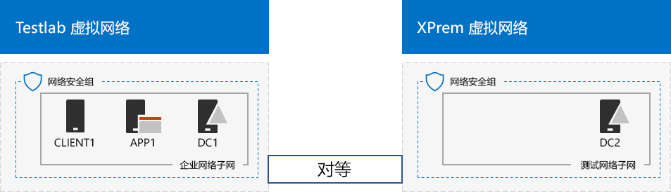

# <a name="simulated-cross-premises-virtual-network-in-a-microsoft-365-test-environment"></a>Microsoft 365 测试环境中的模拟跨界虚拟网络

*本测试实验室指南可用于企业Microsoft 365和Office 365 企业版环境。*

本文逐步介绍了如何使用两个 Azure 虚拟网络来创建 Microsoft Azure 模拟混合云环境。下面是生成的配置。 
  

  
此配置模拟 Azure IaaS 混合云生产环境，具体包括：
  
- Azure 虚拟网络中托管的模拟简化本地网络（TestLab 虚拟网络）。
    
- Azure 中托管的模拟跨界虚拟网络 (XPrem)。
    
- 两个虚拟网络之间的 VNet 对等关系。
    
- XPrem 虚拟网络中辅助域控制器。
    
这是你执行以下操作的常见基础入手配置： 
  
- 在模拟 Azure IaaS 混合云环境中开发和测试应用程序。
    
- 创建计算机的测试配置（一些位于 TestLab 虚拟网络中，一些位于 XPrem 虚拟网络中），以模拟基于混合云的 IT 工作负荷。
    
设置此测试环境包含三个主要阶段：
  
1. 配置 TestLab 虚拟网络。
    
2. 创建跨界虚拟网络。
    
3. 配置 DC2。
    
> [!NOTE]
> 此配置需要付费的 Azure 订阅。 

您可以使用生成的环境通过额外的测试实验室指南或Microsoft 365[测试](https://www.microsoft.com/microsoft-365/enterprise)企业版应用程序的功能。 [](m365-enterprise-test-lab-guides.md)


> [!TIP]
> 转到 Microsoft 365 企业测试实验室指南[堆栈](../downloads/Microsoft365EnterpriseTLGStack.pdf)，直观地映射到 Microsoft 365 for enterprise Test Lab Guide 堆栈中的文章。

## <a name="phase-1-configure-the-testlab-virtual-network"></a>第 1 阶段：配置 TestLab 虚拟网络

请按 [模拟企业基础配置](simulated-ent-base-configuration-microsoft-365-enterprise.md)的 **第 1 阶段** 中的说明操作，在名为 TestLab 的 Azure 虚拟网络中配置 DC1、APP1 和 CLIENT1 计算机。
  
当前配置如下。 
  

  
## <a name="phase-2-create-the-xprem-virtual-network"></a>第 2 阶段：创建 XPrem 虚拟网络

在此阶段，你需要创建和配置新的 XPrem 虚拟网络，然后通过 VNet 对等关系将其连接到 TestLab 虚拟网络。
  
首先，在本地计算机上启动 Azure PowerShell 提示符。
  
> [!NOTE]
> 下面的命令集使用最新版 Azure PowerShell。请参阅 [Get started with Azure PowerShell cmdlets](/powershell/azureps-cmdlets-docs/)（Azure PowerShell cmdlet 使用入门）。 
  
使用此命令登录 Azure 帐户。
  
```powershell
Connect-AzAccount
```

使用此命令获取订阅名称。
  
```powershell
Get-AzSubscription | Sort Name | Select Name
```

设置 Azure 订阅。使用正确的名称替换引号内的所有内容（包括 \< and > 字符）。
  
```powershell
$subscrName="<subscription name>"
Select-AzSubscription -SubscriptionName $subscrName
```

接下来，创建 XPrem 虚拟网络，然后使用这些命令通过网络安全组保护此虚拟网络。
  
```powershell
$rgName="<name of the resource group that you used for your TestLab virtual network>"
$locName=(Get-AzResourceGroup -Name $rgName).Location
$Testnet=New-AzVirtualNetworkSubnetConfig -Name "Testnet" -AddressPrefix 192.168.0.0/24
New-AzVirtualNetwork -Name "XPrem" -ResourceGroupName $rgName -Location $locName -AddressPrefix 192.168.0.0/16 -Subnet $Testnet -DNSServer 10.0.0.4
$rule1=New-AzNetworkSecurityRuleConfig -Name "RDPTraffic" -Description "Allow RDP to all VMs on the subnet" -Access Allow -Protocol Tcp -Direction Inbound -Priority 100 -SourceAddressPrefix Internet -SourcePortRange * -DestinationAddressPrefix * -DestinationPortRange 3389
New-AzNetworkSecurityGroup -Name "Testnet" -ResourceGroupName $rgName -Location $locName -SecurityRules $rule1
$vnet=Get-AzVirtualNetwork -ResourceGroupName $rgName -Name XPrem
$nsg=Get-AzNetworkSecurityGroup -Name "Testnet" -ResourceGroupName $rgName
Set-AzVirtualNetworkSubnetConfig -VirtualNetwork $vnet -Name "Testnet" -AddressPrefix 192.168.0.0/24 -NetworkSecurityGroup $nsg
$vnet | Set-AzVirtualNetwork
```

接下来，使用下面这些命令在 TestLab 和 XPrem VNet 之间创建 VNet 对等关系。
  
```powershell
$rgName="<name of the resource group that you used for your TestLab virtual network>"
$vnet1=Get-AzVirtualNetwork -ResourceGroupName $rgName -Name TestLab
$vnet2=Get-AzVirtualNetwork -ResourceGroupName $rgName -Name XPrem
Add-AzVirtualNetworkPeering -Name TestLab2XPrem -VirtualNetwork $vnet1 -RemoteVirtualNetworkId $vnet2.Id
Add-AzVirtualNetworkPeering -Name XPrem2TestLab -VirtualNetwork $vnet2 -RemoteVirtualNetworkId $vnet1.Id
```

当前配置如下。 
  

  
## <a name="phase-3-configure-dc2"></a>第 3 阶段：配置 DC2

在此阶段，你需要在 XPrem 虚拟网络中创建 DC2 虚拟机，然后将其配置为副本域控制器。
  
首先，创建 DC2 虚拟机。在本地计算机上的 Azure PowerShell 命令提示符处，运行下面这些命令。
  
```powershell
$rgName="<your resource group name>"
$locName=(Get-AzResourceGroup -Name $rgName).Location
$vnet=Get-AzVirtualNetwork -Name XPrem -ResourceGroupName $rgName
$pip=New-AzPublicIpAddress -Name DC2-PIP -ResourceGroupName $rgName -Location $locName -AllocationMethod Dynamic
$nic=New-AzNetworkInterface -Name DC2-NIC -ResourceGroupName $rgName -Location $locName -SubnetId $vnet.Subnets[0].Id -PublicIpAddressId $pip.Id -PrivateIpAddress 192.168.0.4
$vm=New-AzVMConfig -VMName DC2 -VMSize Standard_A2_V2
$cred=Get-Credential -Message "Type the name and password of the local administrator account for DC2."
$vm=Set-AzVMOperatingSystem -VM $vm -Windows -ComputerName DC2 -Credential $cred -ProvisionVMAgent -EnableAutoUpdate
$vm=Set-AzVMSourceImage -VM $vm -PublisherName MicrosoftWindowsServer -Offer WindowsServer -Skus 2016-Datacenter -Version "latest"
$vm=Add-AzVMNetworkInterface -VM $vm -Id $nic.Id
$vm=Set-AzVMOSDisk -VM $vm -Name "DC2-OS" -DiskSizeInGB 128 -CreateOption FromImage -StorageAccountType "Standard_LRS"
$diskConfig=New-AzDiskConfig -AccountType "Standard_LRS" -Location $locName -CreateOption Empty -DiskSizeGB 20
$dataDisk1=New-AzDisk -DiskName "DC2-DataDisk1" -Disk $diskConfig -ResourceGroupName $rgName
$vm=Add-AzVMDataDisk -VM $vm -Name "DC2-DataDisk1" -CreateOption Attach -ManagedDiskId $dataDisk1.Id -Lun 1
New-AzVM -ResourceGroupName $rgName -Location $locName -VM $vm
```

接下来，在 [Azure 门户](https://portal.azure.com)中使用本地管理员帐户名称和密码连接到新的 DC2 虚拟机。
  
接下来，将 Windows 防火墙规则配置为允许通信以进行基本的连接测试。在 DC 2 上的管理员级别 Windows PowerShell 命令提示符处，运行下面这些命令。 
  
```powershell
Set-NetFirewallRule -DisplayName "File and Printer Sharing (Echo Request - ICMPv4-In)" -enabled True
ping dc1.corp.contoso.com
```

ping 命令应获得从 IP 地址 10.0.0.4 发出的四个成功响应。这是跨 VNet 对等关系的通信测试。 
  
接下来，在 DC2 上的 Windows PowerShell 命令提示符处，使用下面的命令将额外的数据磁盘添加为新卷，驱动器号为 F:。
  
```powershell
Get-Disk | Where PartitionStyle -eq "RAW" | Initialize-Disk -PartitionStyle MBR -PassThru | New-Partition -AssignDriveLetter -UseMaximumSize | Format-Volume -FileSystem NTFS -NewFileSystemLabel "WSAD Data"
```

接下来，将 DC2 配置为 corp.contoso.com 域的副本域控制器。在 DC2 上的 Windows PowerShell 命令提示符处，运行下面这些命令。
  
```powershell
Install-WindowsFeature AD-Domain-Services -IncludeManagementTools
Install-ADDSDomainController -Credential (Get-Credential CORP\User1) -DomainName "corp.contoso.com" -InstallDns:$true -DatabasePath "F:\NTDS" -LogPath "F:\Logs" -SysvolPath "F:\SYSVOL"
```

请注意，系统会提示你输入 CORP\\User1 密码和目录服务还原模式 (DSRM) 密码，并重启 DC2。 
  
至此，XPrem 虚拟网络已拥有自己的 DNS 服务器 (DC2)。你必须将 XPrem 虚拟网络配置为使用此 DNS 服务器。在本地计算机上的 Azure PowerShell 命令提示符处，运行下面这些命令。
  
```powershell
$vnet=Get-AzVirtualNetwork -ResourceGroupName $rgName -name "XPrem"
$vnet.DhcpOptions.DnsServers="192.168.0.4" 
Set-AzVirtualNetwork -VirtualNetwork $vnet
Restart-AzVM -ResourceGroupName $rgName -Name "DC2"
```

在本地计算机上的 Azure 门户中，使用 CORP\\User1 凭据连接到 DC1。要配置 CORP 域以便计算机和用户可以使用其本地域控制器进行身份验证，请在 DC1 上的管理员级别 Windows PowerShell 命令提示符处，运行下面这些命令。
  
```powershell
New-ADReplicationSite -Name "TestLab" 
New-ADReplicationSite -Name "XPrem"
New-ADReplicationSubnet -Name "10.0.0.0/8" -Site "TestLab"
New-ADReplicationSubnet -Name "192.168.0.0/16" -Site "XPrem"
```

当前配置如下。 
  

  
此时，你的模拟 Azure 混合云环境就可供测试了。
  
现在，你已准备好试用适用于企业的 Microsoft 365[功能](https://www.microsoft.com/microsoft-365/enterprise)。
  
## <a name="next-steps"></a>后续步骤

浏览下面这些附加的一系列测试实验室指南：
  
- [标识](m365-enterprise-test-lab-guides.md#identity)
- [移动设备管理](m365-enterprise-test-lab-guides.md#mobile-device-management)
- [信息保护](m365-enterprise-test-lab-guides.md#information-protection)

## <a name="see-also"></a>另请参阅

[Microsoft 365 企业版测试实验室指南](m365-enterprise-test-lab-guides.md)

[Microsoft 365 企业版概述](microsoft-365-overview.md)

[适用于企业的 Microsoft 365 文档](/microsoft-365-enterprise/)