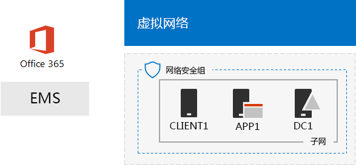
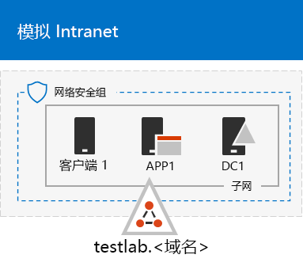
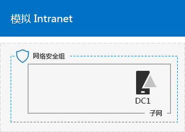

# <a name="the-simulated-enterprise-base-configuration"></a>模拟企业基础配置

本文分步介绍了如何创建适用于 Microsoft 365 企业版 的简化环境，其中包括：

- Microsoft 365 E5 试用版或付费版订阅。
- 连接到 Internet 的简化组织 Intranet，包含 Azure 虚拟网络中的三个虚拟机（DC1、APP1 和 CLIENT1）。
 


利用生成的环境，可以通过额外的[测试实验室指南](m365-enterprise-test-lab-guides.md)或自行测试 [Microsoft 365 企业版](https://www.microsoft.com/microsoft-365/enterprise)的特性和功能。


> [!TIP]
> 单击[此处](https://aka.ms/m365etlgstack)，即可获得 Microsoft 365 企业版测试实验室指南堆栈中所有文章的直观目录图。

## <a name="phase-1-create-a-simulated-intranet"></a>第 1 阶段：创建模拟 Intranet

在该阶段，要在 Azure 基础结构服务中构建模拟 Intranet，包括 Active Directory 域服务 (AD DS) 域控制器、应用程序服务器和客户端计算机。 

你将在额外的 [Microsoft 365 企业版测试实验室指南](m365-enterprise-test-lab-guides.md)中使用这些计算机来配置和演示混合标识和其他功能。

### <a name="method-1-build-your-simulated-intranet-with-an-azure-resource-manager-template"></a>方法 1：使用 Azure 资源管理器模板构建模拟 Intranet

在此方法中，你可以使用 Azure 资源管理器 (ARM) 模板来构建模拟 Intranet。ARM 模板中包含有关创建 Azure 网络基础结构、虚拟机及其配置的所有说明。

部署该模板之前，请通读“[模板自述文件](https://github.com/maxskunkworks/TLG/tree/master/tlg-base-config_3-vm.m365-ems)”页面且准备好以下信息：

- 测试环境的公共 DNS 域名 (testlab.\<你的公共域名>)。你将需要在“**自定义部署**”页面的“**域名**”字段中输入此名称。
- 虚拟机公共 IP 地址 URL 的 DNS 标签前缀。你将需要在“**自定义部署**”页面的“**Dns 标签前缀**”字段中输入此标签。

通读说明后，在“[模板自述文件](https://github.com/maxskunkworks/TLG/tree/master/tlg-base-config_3-vm.m365-ems)”页面上单击“**部署到 Azure**”，以开始进行部署。

>[!Note]
>通过 ARM 模板构建的模拟 Intranet 需要付费 Azure 订阅。
>

模板完成后，会生成以下配置。



### <a name="method-2-build-your-simulated-intranet-with-azure-powershell"></a>方法 2：使用 Azure PowerShell 构建模拟 Intranet

在此方法中，你可以使用 Windows PowerShell 和 Azure PowerShell 模块来构建网络基础结构、虚拟机及其配置。

如果想要体验通过 PowerShell 一次使用一个步骤创建 Azure 基础结构元素的过程，则可以使用此方法。然后可以自定义 PowerShell 命令块，以便自行在 Azure 中部署其他虚拟机。

#### <a name="step-1-create-dc1"></a>步骤 1：创建 DC1

在这一步，我们会创建 Azure 虚拟网络并添加 DC1（一台用作 AD DS 域的域控制器的虚拟机）。

首先，在本地计算机上启动 Windows PowerShell 命令提示符。
  
> [!NOTE]
> 下面的命令集使用最新版 Azure PowerShell。请参阅 [Azure PowerShell cmdlet 使用入门](https://docs.microsoft.com/powershell/azureps-cmdlets-docs/) 
  
使用以下命令登录 Azure 帐户。
  
```
Connect-AzAccount
```

使用以下命令获得订阅名称。
  
```
Get-AzSubscription | Sort Name | Select Name
```

设置 Azure 订阅。将引号内的所有内容（包括 < 和 > 字符）都替换为正确的名称。
  
```
$subscr="<subscription name>"
Get-AzSubscription -SubscriptionName $subscr | Select-AzSubscription
```

接下来，为模拟企业测试实验室新建一个资源组。若要确定唯一资源组名称，请运行下面的命令，以列出现有资源组。
  
```
Get-AzResourceGroup | Sort ResourceGroupName | Select ResourceGroupName
```

运行下面这些命令，以新建资源组。将引号内的所有内容（包括 < 和 > 字符）都替换为正确的名称。
  
```
$rgName="<resource group name>"
$locName="<location name, such as West US>"
New-AzResourceGroup -Name $rgName -Location $locName
```

接下来，创建托管模拟企业环境的公司网络子网的 TestLab 虚拟网络，并使用网络安全组来保护它。填写资源组名称，并在本地计算机上的 PowerShell 命令提示符处运行下面这些命令。
  
```
$rgName="<name of your new resource group>"
$locName=(Get-AzResourceGroup -Name $rgName).Location
$corpnetSubnet=New-AzVirtualNetworkSubnetConfig -Name Corpnet -AddressPrefix 10.0.0.0/24
New-AzVirtualNetwork -Name TestLab -ResourceGroupName $rgName -Location $locName -AddressPrefix 10.0.0.0/8 -Subnet $corpnetSubnet -DNSServer 10.0.0.4
$rule1=New-AzNetworkSecurityRuleConfig -Name "RDPTraffic" -Description "Allow RDP to all VMs on the subnet" -Access Allow -Protocol Tcp -Direction Inbound -Priority 100 -SourceAddressPrefix Internet -SourcePortRange * -DestinationAddressPrefix * -DestinationPortRange 3389
New-AzNetworkSecurityGroup -Name Corpnet -ResourceGroupName $rgName -Location $locName -SecurityRules $rule1
$vnet=Get-AzVirtualNetwork -ResourceGroupName $rgName -Name TestLab
$nsg=Get-AzNetworkSecurityGroup -Name Corpnet -ResourceGroupName $rgName
Set-AzVirtualNetworkSubnetConfig -VirtualNetwork $vnet -Name Corpnet -AddressPrefix "10.0.0.0/24" -NetworkSecurityGroup $nsg
```

接下来，创建 DC1 虚拟机，并将它配置为 **testlab.**\<你的公共域> AD DS 域的域控制器，以及 TestLab 虚拟网络中虚拟机的 DNS 服务器。 例如，如果公共域名是 **<span>contoso</span>.com**，DC1 虚拟机将是 **<span>testlab</span>.contoso.com** 域的域控制器。
  
若要为 DC1 创建 Azure 虚拟机，请填写资源组名称，并在本地计算机上的 PowerShell 命令提示符处运行下面这些命令。
  
```
$rgName="<resource group name>"
$locName=(Get-AzResourceGroup -Name $rgName).Location
$vnet=Get-AzVirtualNetwork -Name TestLab -ResourceGroupName $rgName
$pip=New-AzPublicIpAddress -Name DC1-PIP -ResourceGroupName $rgName -Location $locName -AllocationMethod Dynamic
$nic=New-AzNetworkInterface -Name DC1-NIC -ResourceGroupName $rgName -Location $locName -SubnetId $vnet.Subnets[0].Id -PublicIpAddressId $pip.Id -PrivateIpAddress 10.0.0.4
$vm=New-AzVMConfig -VMName DC1 -VMSize Standard_A1
$cred=Get-Credential -Message "Type the name and password of the local administrator account for DC1."
$vm=Set-AzVMOperatingSystem -VM $vm -Windows -ComputerName DC1 -Credential $cred -ProvisionVMAgent -EnableAutoUpdate
$vm=Set-AzVMSourceImage -VM $vm -PublisherName MicrosoftWindowsServer -Offer WindowsServer -Skus 2016-Datacenter -Version "latest"
$vm=Add-AzVMNetworkInterface -VM $vm -Id $nic.Id
$vm=Set-AzVMOSDisk -VM $vm -Name "DC1-OS" -DiskSizeInGB 128 -CreateOption FromImage
$diskConfig=New-AzDiskConfig -AccountType "Standard_LRS" -Location $locName -CreateOption Empty -DiskSizeGB 20
$dataDisk1=New-AzDisk -DiskName "DC1-DataDisk1" -Disk $diskConfig -ResourceGroupName $rgName
$vm=Add-AzVMDataDisk -VM $vm -Name "DC1-DataDisk1" -CreateOption Attach -ManagedDiskId $dataDisk1.Id -Lun 1
New-AzVM -ResourceGroupName $rgName -Location $locName -VM $vm
```

系统将提示你为 DC1 上的本地管理员帐户输入用户名和密码。使用强密码，并在安全位置记录名称和密码。
  
接下来，连接到 DC1 虚拟机。
  
1. 在 [Azure 门户](https://portal.azure.com)中，单击“**资源组”>** [新资源组的名称] ** > DC1 >“连接**”。
    
2. 在打开的窗格中，单击“**下载 RDP 文件**”。打开下载的 DC1.rdp 文件，然后单击“**连接**”。
    
3. 指定 DC1 本地管理员帐户名：
    
   - 对于 Windows 7：
    
     在“Windows 安全性”**** 对话框中，单击“使用另一个帐户”****。在“用户名称”**** 中，键入 **DC1\\**[本地管理员帐户名称]
    
   - 对于 Windows 8 或 Windows 10：
    
     在“Windows 安全性”**** 对话框中，单击“更多选择”****，然后单击“使用不同帐户”****。在“用户名”**** 中，键入 **DC1\\**[本地管理员帐户名称]。
    
4. 在“密码”**** 中，键入本地管理员帐户密码，然后单击“确定”****。
    
5. 出现提示时，请单击“是”****。
    
接下来，在 DC1 上的管理员级 Windows PowerShell 命令提示符处运行下面的命令，将额外的数据磁盘添加为新卷，驱动器号为 F:。
  
```
Get-Disk | Where PartitionStyle -eq "RAW" | Initialize-Disk -PartitionStyle MBR -PassThru | New-Partition -AssignDriveLetter -UseMaximumSize | Format-Volume -FileSystem NTFS -NewFileSystemLabel "WSAD Data"
```

接下来，将 DC1 配置为 **testlab.**\<公共域名> 域的域控制器和 DNS 服务器。指定公共域名，删除 \< 和 > 字符，再在 DC1 上的管理员级 Windows PowerShell 命令提示符处运行下面这些命令。
  
```
$yourDomain="<your public domain>"
Install-WindowsFeature AD-Domain-Services -IncludeManagementTools
Install-ADDSForest -DomainName testlab.$yourDomain -DatabasePath "F:\NTDS" -SysvolPath "F:\SYSVOL" -LogPath "F:\Logs"
```
需要指定安全模式管理员密码。将此密码存储到安全位置。
  
请注意，这些命令可能会花几分钟才能完成。
  
DC1 重启后，重新连接到 DC1 虚拟机。
  
1. 在 [Azure 门户](https://portal.azure.com)中，单击“**资源组 >** [你的资源组名称] **> DC1 > 连接**”。
    
2. 运行下载的 DC1.rdp 文件，再单击“连接”****。
    
3. 在“Windows 安全性”**** 内，单击“使用另一帐户”****。在“用户名”**** 中，键入“TESTLAB\\****[本地管理员帐户名]”。
    
4. 在“密码”**** 中，键入本地管理员帐户密码，再单击“确定”****。
    
5. 当出现提示时，单击“是”****。
    
接下来，在 Active Directory 中创建用于登录 TESTLAB 域成员计算机的用户帐户。在管理员级 Windows PowerShell 命令提示符处，运行下面的命令。
  
```
New-ADUser -SamAccountName User1 -AccountPassword (read-host "Set user password" -assecurestring) -name "User1" -enabled $true -PasswordNeverExpires $true -ChangePasswordAtLogon $false
```

请注意，此命令会提示你提供 User1 帐户密码。由于这个帐户要用于所有 TESTLAB 域成员计算机的远程桌面连接，因此选择使用强密码。记录 User1 帐户密码，并将它存储到安全位置。
  
接下来，将新的 User1 帐户配置为域、企业和架构管理员。在管理员级 Windows PowerShell 命令提示符处，运行下面的命令。
  
```
$yourDomain="<your public domain>"
$domainName = "testlab"+$yourDomain
$userName="user1@" + $domainName
$userSID=(New-Object System.Security.Principal.NTAccount($userName)).Translate([System.Security.Principal.SecurityIdentifier]).Value
$groupNames=@("Domain Admins","Enterprise Admins","Schema Admins")
ForEach ($name in $groupNames) {Add-ADPrincipalGroupMembership -Identity $userSID -MemberOf (Get-ADGroup -Identity $name).SID.Value}
```

关闭与 DC1 的远程桌面会话，再使用 TESTLAB\\User1 帐户重新连接。
  
接下来，若要允许 Ping 工具有流量，请在管理员级 Windows PowerShell 命令提示符处运行下面的命令。
  
```
Set-NetFirewallRule -DisplayName "File and Printer Sharing (Echo Request - ICMPv4-In)" -enabled True
```

当前配置如下。
  

  
#### <a name="step-2-configure-app1"></a>步骤 2：配置 APP1

在这一步，创建和配置 APP1，这是初始提供 Web 和文件共享服务的应用程序服务器。

若要为 APP1 创建 Azure 虚拟机，请填写资源组名称，并在本地计算机上的命令提示符处运行下面这些命令。
  
```
$rgName="<resource group name>"
$locName=(Get-AzResourceGroup -Name $rgName).Location
$vnet=Get-AzVirtualNetwork -Name TestLab -ResourceGroupName $rgName
$pip=New-AzPublicIpAddress -Name APP1-PIP -ResourceGroupName $rgName -Location $locName -AllocationMethod Dynamic
$nic=New-AzNetworkInterface -Name APP1-NIC -ResourceGroupName $rgName -Location $locName -SubnetId $vnet.Subnets[0].Id -PublicIpAddressId $pip.Id
$vm=New-AzVMConfig -VMName APP1 -VMSize Standard_A1
$cred=Get-Credential -Message "Type the name and password of the local administrator account for APP1."
$vm=Set-AzVMOperatingSystem -VM $vm -Windows -ComputerName APP1 -Credential $cred -ProvisionVMAgent -EnableAutoUpdate
$vm=Set-AzVMSourceImage -VM $vm -PublisherName MicrosoftWindowsServer -Offer WindowsServer -Skus 2016-Datacenter -Version "latest"
$vm=Add-AzVMNetworkInterface -VM $vm -Id $nic.Id
$vm=Set-AzVMOSDisk -VM $vm -Name "APP1-OS" -DiskSizeInGB 128 -CreateOption FromImage
New-AzVM -ResourceGroupName $rgName -Location $locName -VM $vm
```

接下来，使用 APP1 本地管理员帐户名称和密码连接到 APP1 虚拟机，然后打开 Windows PowerShell 命令提示符。
  
若要检查 APP1 和 DC1 之间的名称解析和网络通信，请运行 **ping dc1.testlab.**\<公共域名> 命令，并验证是否有四个回复。
  
接下来，在 Windows PowerShell 提示符处，运行下面这些命令，将 APP1 虚拟机加入 TESTLAB 域。
  
```
$yourDomain="<your public domain name>"
Add-Computer -DomainName ("testlab" + $yourDomain)
Restart-Computer
```

请注意，运行 **Add-Computer** 命令后，必须提供 TESTLAB\\User1 域帐户凭据。
  
在 APP1 重启后，使用 TESTLAB\\User1 帐户连接到它，再打开管理员级 Windows PowerShell 命令提示符。
  
接下来，在 APP1 上的管理员级 Windows PowerShell 命令提示符处，运行下面的命令，将 APP1 设置为 Web 服务器。
  
```
Install-WindowsFeature Web-WebServer -IncludeManagementTools
```

接下来，运行下面这些 PowerShell 命令，在 APP1 上的文件夹中创建共享文件夹和文本文件。
  
```
New-Item -path c:\files -type directory
Write-Output "This is a shared file." | out-file c:\files\example.txt
New-SmbShare -name files -path c:\files -changeaccess TESTLAB\User1
```

当前配置如下。
  

  
#### <a name="step-3-configure-client1"></a>步骤 3：配置 CLIENT1

在这一步，创建和配置 CLIENT1，这是 Intranet 上的典型笔记本电脑、平板电脑或台式计算机。

> [!NOTE]  
> 下面的命令集会创建运行 Windows Server 2016 Datacenter 的 CLIENT1，可对所有类型的 Azure 订阅执行此操作。若有基于 Visual Studio 的 Azure 订阅，可以通过 [Azure 门户](https://portal.azure.com)创建运行 Windows 10 的 CLIENT1。 
  
若要为 CLIENT1 创建 Azure 虚拟机，请填写资源组名称，并在本地计算机上的命令提示符处运行下面这些命令。
  
```
$rgName="<resource group name>"
$locName=(Get-AzResourceGroup -Name $rgName).Location
$vnet=Get-AzVirtualNetwork -Name TestLab -ResourceGroupName $rgName
$pip=New-AzPublicIpAddress -Name CLIENT1-PIP -ResourceGroupName $rgName -Location $locName -AllocationMethod Dynamic
$nic=New-AzNetworkInterface -Name CLIENT1-NIC -ResourceGroupName $rgName -Location $locName -SubnetId $vnet.Subnets[0].Id -PublicIpAddressId $pip.Id
$vm=New-AzVMConfig -VMName CLIENT1 -VMSize Standard_A1
$cred=Get-Credential -Message "Type the name and password of the local administrator account for CLIENT1."
$vm=Set-AzVMOperatingSystem -VM $vm -Windows -ComputerName CLIENT1 -Credential $cred -ProvisionVMAgent -EnableAutoUpdate
$vm=Set-AzVMSourceImage -VM $vm -PublisherName MicrosoftWindowsServer -Offer WindowsServer -Skus 2016-Datacenter -Version "latest"
$vm=Add-AzVMNetworkInterface -VM $vm -Id $nic.Id
$vm=Set-AzVMOSDisk -VM $vm -Name "CLIENT1-OS" -DiskSizeInGB 128 -CreateOption FromImage
New-AzVM -ResourceGroupName $rgName -Location $locName -VM $vm
```

接下来，使用 CLIENT1 本地管理员帐户名称和密码连接到 CLIENT1 虚拟机，然后打开管理员级别 Windows PowerShell 命令提示符。
  
若要检查 CLIENT1 和 DC1 之间的名称解析和网络通信，请在 Windows PowerShell 命令提示符处运行 **ping dc1.testlab.**\<公共域名> 命令，并验证是否有四个回复。
  
接下来，在 Windows PowerShell 提示符处，运行下面这些命令，将 CLIENT1 虚拟机加入 TESTLAB 域。
  
```
$yourDomain="<your public domain name>"
Add-Computer -DomainName ("testlab" + $yourDomain)
Restart-Computer
```

请注意，运行 **Add-Computer** 命令后，必须提供 TESTLAB\\User1 域帐户凭据。
  
在 CLIENT1 重启后，使用 TESTLAB\\User1 帐户名和密码连接到它，再打开管理员级 Windows PowerShell 命令提示符。
  
接下来，验证能否从 CLIENT1 中的 APP1 访问 Web 和文件共享资源。
  
1. 在服务器管理器的树窗格中，单击“**本地服务器**”。
    
2. 在“CLIENT1 的属性”**** 中，单击“IE 增强的安全配置”**** 旁边的“打开”****。
    
3. 在“Internet Explorer 增强的安全性配置”**** 中，为**管理员**和**用户**单击“关闭”****，然后单击“确定”****。
    
4. 在“开始”屏幕中，依次单击“Internet Explorer”**** 和“确定”****。
    
5. 在地址栏中，键入“http<span>://</span>app1.testab.****\<公共域名/****”，再按 ENTER。应该会看到 APP1 的默认 Internet Information Services 网页。
    
6. 从桌面任务栏中，单击“文件资源管理器”图标。
    
7. 在地址栏中，键入 **\\\\app1\\Files**，然后按 ENTER 键。应该会看到带有文件共享文件夹内容的文件夹窗口。
    
8. 在“文件”**** 共享文件夹窗口中，双击“Example.txt”**** 文件。应该会看到 Example.txt 文件的内容。
    
9. 关闭“example.txt - 记事本”**** 和“文件”**** 共享文件夹窗口。
    
当前配置如下。
  


## <a name="phase-2-create-your-microsoft-365-e5-subscriptions"></a>第 2 阶段：创建 Microsoft 365 E5 订阅

在此阶段，你将创建一个新的 Microsoft 365 E5 订阅，该订阅使用新的 Azure AD 租户（独立于生产订阅）。可通过两种方式实现此目的：

- 使用 Microsoft 365 E5 的试用版订阅。 

  Microsoft 365 E5 试用版订阅的有效期为 30 天，可轻松延长至 60 天。试用版订阅到期后，你必须将其转换为付费版订阅或创建新的试用版订阅。创建新的试用版订阅意味着你将保留配置，其中可能包含复杂的方案。  
- 使用包含少量许可证的 Microsoft 365 E5 独立生产订阅。

  虽然这会产生额外费用，但可确保拥有不会到期的有效测试环境，可用于尝试功能、配置和方案。可以长期使用相同的测试环境，用于概念验证、平级演示和管理以及应用程序开发和测试。建议使用这种方法。

### <a name="use-trial-subscriptions"></a>使用试用版订阅

首先，按照 [Office 365 开发/测试环境](https://docs.microsoft.com/office365/enterprise/office-365-dev-test-environment)的第 2 和 第 3 阶段的步骤，创建轻型 Office 365 开发/测试环境。

>[!Note]
>我们为你创建了 Office 365 的试用版订阅，以便你的开发/测试环境具有与你当前拥有的任何付费版订阅分开的 Azure AD 租户。 这种分离意味着你可以在测试租户中添加和删除用户和组，而不会影响你的生产订阅。
>

接下来，添加 Microsoft 365 E5 试用版订阅，并将 Microsoft 365 许可证分配给全局管理员帐户。

1. 通过 Internet 浏览器的专用实例，使用全局管理员帐户凭据登录 [http://admin.microsoft.com](http://admin.microsoft.com) 上的 Microsoft 365 管理中心。
    
2. 在“**Microsoft 365 管理中心**”页面上的左侧导航栏中，单击“**计费 > 购买服务**”。
    
3. 在“**购买服务**”页面上，找到“**Microsoft 365 E5**”项目。 将鼠标指针悬停在该项目上方并单击“**开始免费试用**”。

4. 在“**Microsoft 365 E5 试用版**”页面上，选择接收短信或通话，输入你的电话号码，然后单击“**发短信给我**”或“**打电话给我**”。

5. 在“确认订单”页上，单击“立即试用”********。

6. 在“订单签收”页中，单击“继续”********。

7. 在 Microsoft 365 管理中心中，单击“**活动用户**”，然后单击管理员帐户。

8. 对于**产品许可证**，请单击“**编辑**”。

9. 关闭 Office 365 企业版 E5 的许可证，并打开 Microsoft 365 E5 的许可证。

10. 单击“**保存 > 关闭 > 关闭**”。

 接下来，***如果你完成了*** [Office 365 开发/测试环境](https://docs.microsoft.com/office365/enterprise/office-365-dev-test-environment)的第 3 阶段，请为所有其他帐户（用户 2、用户 3、用户 4 和用户 5）重复前述过程的步骤 8 到 11。
  
> [!NOTE]
> Microsoft 365 E5 试用版订阅的有效期为 30 天。 对于永久性测试环境，请将此试用版订阅转换为包含少量许可证的付费版订阅。
  
测试环境现在包含：
  
- Microsoft 365 E5 试用版订阅。
- 所有适当的用户帐户（无论是全局管理员帐户还是全部五个用户帐户）都可以使用 Microsoft 365 E5。
    
### <a name="results"></a>结果

测试环境现在包含：
  
- Microsoft 365 E5 试用版订阅。
- 所有适当的用户帐户（无论是全局管理员帐户还是全部五个用户帐户）都可以使用 Microsoft 365 E5。
    
最终配置如下。
  

  
现在可以尝试 [Microsoft 365 企业版](https://www.microsoft.com/microsoft-365/enterprise)的其他功能。
  
## <a name="next-steps"></a>后续步骤

浏览下面这些附加的一系列测试实验室指南：
  
- [标识](m365-enterprise-test-lab-guides.md#identity)
- [移动设备管理](m365-enterprise-test-lab-guides.md#mobile-device-management)
- [信息保护](m365-enterprise-test-lab-guides.md#information-protection)

## <a name="see-also"></a>另请参阅

[Microsoft 365 企业版测试实验室指南](m365-enterprise-test-lab-guides.md)

[部署 Microsoft 365 企业版](deploy-microsoft-365-enterprise.md)

[Microsoft 365 企业版文档](https://docs.microsoft.com/microsoft-365-enterprise/)
