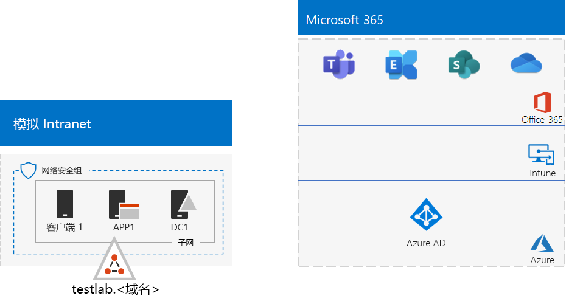
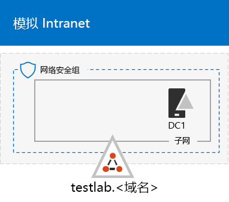

# <a name="the-simulated-enterprise-base-configuration"></a>模拟企业基础配置

*本测试实验室指南可用于企业Microsoft 365和Office 365 企业版环境。*

本文介绍如何为企业版创建简化Microsoft 365环境，其中包括：

- Microsoft 365 E5 试用版或付费版订阅。
- 连接到 Internet 的简化的组织 Intranet，由 Azure 虚拟网络上的三个虚拟机 (DC1、APP1 和 CLIENT1) 。
 


创建简化的测试环境包括两个阶段：
- [第 1 阶段：创建模拟 Intranet](#phase-1-create-a-simulated-intranet)
- [第 2 阶段：创建 Microsoft 365 E5 订阅](#phase-2-create-your-microsoft-365-e5-subscription)

您可以使用生成的环境通过额外的测试实验室指南或Microsoft 365[测试](https://www.microsoft.com/microsoft-365/enterprise)企业版应用程序的功能。 [](m365-enterprise-test-lab-guides.md)


> [!TIP]
> 有关企业测试实验室指南堆栈中Microsoft 365文章的直观映射，请转到 Microsoft 365 [for enterprise Test Lab Guide Stack](../downloads/Microsoft365EnterpriseTLGStack.pdf)。

## <a name="phase-1-create-a-simulated-intranet"></a>第 1 阶段：创建模拟 Intranet

在此阶段，在 Azure 基础结构服务中构建模拟 Intranet，其中包括 Active Directory 域服务 (AD DS) 域控制器、应用程序服务器和客户端计算机。

你将在企业测试实验室指南的其他Microsoft 365[](m365-enterprise-test-lab-guides.md)使用这些计算机来配置和演示混合标识和其他功能。

### <a name="method-1-build-your-simulated-intranet-with-an-azure-resource-manager-template"></a>方法 1：使用 Azure 资源管理器模板构建模拟 Intranet

在此方法中，使用 Azure 资源管理器模板构建模拟 Intranet。 Azure 资源管理器模板包含创建 Azure 网络基础结构、虚拟机及其配置的所有说明。

部署模板之前，请通读模板自述文件 [页](https://github.com/maxskunkworks/TLG/tree/master/tlg-base-config_3-vm.m365-ems) ，并准备好以下信息：

- 测试环境的公共 DNS 域名 (testlab。 \<*your public domain*>) 。 您将在"自定义部署"页的 **"域名** " **字段中输入此** 名称。
- 虚拟机公共 IP 地址 URL 的 DNS 标签前缀。你将需要在“**自定义部署**”页面的“**Dns 标签前缀**”字段中输入此标签。

阅读说明后，在模板自述文件页面上选择"部署到 **Azure"**[以开始](https://github.com/maxskunkworks/TLG/tree/master/tlg-base-config_3-vm.m365-ems)操作。

>[!Note]
>Azure 资源管理器模板构建的模拟 Intranet 需要付费 Azure 订阅。

模板完成后，配置如下所示：


### <a name="method-2-build-your-simulated-intranet-with-azure-powershell"></a>方法 2：使用 Azure PowerShell 构建模拟 Intranet

在此方法中，你可以使用 Windows PowerShell 和 Azure PowerShell 模块来构建网络基础结构、虚拟机及其配置。

如果想要体验通过 PowerShell 一次使用一个步骤创建 Azure 基础结构元素的过程，则可以使用此方法。然后可以自定义 PowerShell 命令块，以便自行在 Azure 中部署其他虚拟机。

#### <a name="step-1-create-dc1"></a>步骤 1：创建 DC1

在此步骤中，创建 Azure 虚拟网络并添加 DC1，这是一个虚拟机，它是 AD DS 域的域控制器。

首先，在本地计算机上启动 Windows PowerShell 命令提示符。
  
> [!NOTE]
> 下面的命令集使用最新版 Azure PowerShell。请参阅 [Azure PowerShell cmdlet 使用入门](/powershell/azureps-cmdlets-docs/) 
  
使用以下命令登录 Azure 帐户。
  
```powershell
Connect-AzAccount
```

使用以下命令获得订阅名称。
  
```powershell
Get-AzSubscription | Sort Name | Select Name
```

设置 Azure 订阅。 用正确的名称替换引号内的所有内容，包括 ("<"和">") 尖括号。
  
```powershell
$subscr="<subscription name>"
Get-AzSubscription -SubscriptionName $subscr | Select-AzSubscription
```

接下来，为模拟企业测试实验室新建一个资源组。若要确定唯一资源组名称，请运行下面的命令，以列出现有资源组。
  
```powershell
Get-AzResourceGroup | Sort ResourceGroupName | Select ResourceGroupName
```

使用这些命令创建新的资源组。 将引号内的所有内容（包括尖括号）替换为正确的名称。
  
```powershell
$rgName="<resource group name>"
$locName="<location name, such as West US>"
New-AzResourceGroup -Name $rgName -Location $locName
```

接下来，创建将托管模拟企业环境的企业网络子网的 TestLab 虚拟网络，并借助网络安全组对其进行保护。 填写资源组的名称，并在本地计算机的 PowerShell 命令提示符下运行以下命令。
  
```powershell
$rgName="<name of your new resource group>"
$locName=(Get-AzResourceGroup -Name $rgName).Location
$corpnetSubnet=New-AzVirtualNetworkSubnetConfig -Name Corpnet -AddressPrefix 10.0.0.0/24
New-AzVirtualNetwork -Name TestLab -ResourceGroupName $rgName -Location $locName -AddressPrefix 10.0.0.0/8 -Subnet $corpnetSubnet -DNSServer 10.0.0.4
$rule1=New-AzNetworkSecurityRuleConfig -Name "RDPTraffic" -Description "Allow RDP to all VMs on the subnet" -Access Allow -Protocol Tcp -Direction Inbound -Priority 100 -SourceAddressPrefix Internet -SourcePortRange * -DestinationAddressPrefix * -DestinationPortRange 3389
New-AzNetworkSecurityGroup -Name Corpnet -ResourceGroupName $rgName -Location $locName -SecurityRules $rule1
$vnet=Get-AzVirtualNetwork -ResourceGroupName $rgName -Name TestLab
$nsg=Get-AzNetworkSecurityGroup -Name Corpnet -ResourceGroupName $rgName
Set-AzVirtualNetworkSubnetConfig -VirtualNetwork $vnet -Name Corpnet -AddressPrefix "10.0.0.0/24" -NetworkSecurityGroup $nsg
$vnet | Set-AzVirtualNetwork
```

接下来，创建 DC1 虚拟机，并将它配置为 **testlab.**\<your public domain> AD DS 域的域控制器， 以及 TestLab 虚拟网络中虚拟机的 DNS 服务器。 例如，如果公共域名是 **<span>contoso</span>.com**，DC1 虚拟机将是 **<span>testlab</span>.contoso.com** 域的域控制器。
  
若要为 DC1 创建 Azure 虚拟机，请填写资源组名称，并在本地计算机上的 PowerShell 命令提示符处运行下面这些命令。
  
```powershell
$rgName="<resource group name>"
$locName=(Get-AzResourceGroup -Name $rgName).Location
$vnet=Get-AzVirtualNetwork -Name TestLab -ResourceGroupName $rgName
$pip=New-AzPublicIpAddress -Name DC1-PIP -ResourceGroupName $rgName -Location $locName -AllocationMethod Dynamic
$nic=New-AzNetworkInterface -Name DC1-NIC -ResourceGroupName $rgName -Location $locName -SubnetId $vnet.Subnets[0].Id -PublicIpAddressId $pip.Id -PrivateIpAddress 10.0.0.4
$vm=New-AzVMConfig -VMName DC1 -VMSize Standard_A2_V2
$cred=Get-Credential -Message "Type the name and password of the local administrator account for DC1."
$vm=Set-AzVMOperatingSystem -VM $vm -Windows -ComputerName DC1 -Credential $cred -ProvisionVMAgent -EnableAutoUpdate
$vm=Set-AzVMSourceImage -VM $vm -PublisherName MicrosoftWindowsServer -Offer WindowsServer -Skus 2016-Datacenter -Version "latest"
$vm=Add-AzVMNetworkInterface -VM $vm -Id $nic.Id
$vm=Set-AzVMOSDisk -VM $vm -Name "DC1-OS" -DiskSizeInGB 128 -CreateOption FromImage
$diskConfig=New-AzDiskConfig -AccountType "Standard_LRS" -Location $locName -CreateOption Empty -DiskSizeGB 20
$dataDisk1=New-AzDisk -DiskName "DC1-DataDisk1" -Disk $diskConfig -ResourceGroupName $rgName
$vm=Add-AzVMDataDisk -VM $vm -Name "DC1-DataDisk1" -CreateOption Attach -ManagedDiskId $dataDisk1.Id -Lun 1
New-AzVM -ResourceGroupName $rgName -Location $locName -VM $vm
```

系统将提示你为 DC1 上的本地管理员帐户输入用户名和密码。使用强密码，并在安全位置记录名称和密码。
  
接下来，连接到 DC1 虚拟机：
  
1. 在 [Azure 门户中](https://portal.azure.com)，选择"资源 **组 > <** 新资源组 ***的名称 _> > _* DC1**  >  **连接。**
    
2. 在打开的窗格中，选择 **下载 RDP 文件**。 打开下载的 DC1.rdp 文件，然后选择 **"连接"。**
    
3. 指定 DC1 本地管理员帐户名：
    
   - 对于 Windows 7：
    
     在 **"Windows 安全中心** 对话框中，选择"**使用另一个帐户"。** 在 **"用户名"** 中，**输入 \\ DC1** < *本地管理员帐户>。*
    
   - 对于 Windows 8 或 Windows 10：
    
     在 **"Windows 安全中心"** 对话框中，选择"**更多选项**"，然后选择"**使用不同的帐户"。** 在 **"用户名"** 中，**输入 \\ DC1** < *本地管理员帐户>。*
    
4. 在 **"密码**"中，输入本地管理员帐户的密码，然后选择"确定 **"。**
    
5. 当系统提示时，选择"**是"。**
    
接下来，在 DC1 上的管理员级 Windows PowerShell 命令提示符处运行下面的命令，将额外的数据磁盘添加为新卷，驱动器号为 F:。
  
```powershell
Get-Disk | Where PartitionStyle -eq "RAW" | Initialize-Disk -PartitionStyle MBR -PassThru | New-Partition -AssignDriveLetter -UseMaximumSize | Format-Volume -FileSystem NTFS -NewFileSystemLabel "WSAD Data"
```

接下来，将 DC1 配置为 **testlab.**\<*your public domain*> 域的域控制器和 DNS 服务器 。 指定公共域名，删除尖括号，然后在 DC1 上的管理员级别命令提示符Windows PowerShell运行这些命令。
  
```powershell
$yourDomain="<your public domain>"
Install-WindowsFeature AD-Domain-Services -IncludeManagementTools
Install-ADDSForest -DomainName testlab.$yourDomain -DatabasePath "F:\NTDS" -SysvolPath "F:\SYSVOL" -LogPath "F:\Logs"
```
需要指定安全模式管理员密码。将此密码存储到安全位置。
  
请注意，这些命令可能会花几分钟才能完成。
  
DC1 重启后，重新连接到 DC1 虚拟机。
  
1. 在 [Azure 门户中，](https://portal.azure.com)选择"资源 **组** > <你的 *资源组名称> >* **DC1**  >  **连接。**
    
2. 运行下载的 DC1.rdp 文件，然后选择 **"连接"。**
    
3. 在 **Windows 安全中心** 中，选择"**使用另一个帐户"。** 在 **"用户名"** 中，输入 **TESTLAB \\** < *本地管理员帐户>。*
    
4. 在 **"密码**"框中，输入本地管理员帐户的密码，然后选择"确定 **"。**
    
5. 当系统提示时，选择"**是"。**
    
接下来，在 Active Directory 中创建一个用户帐户，该帐户将在登录 TESTLAB 域成员计算机时使用。 在管理员级别 Windows PowerShell 命令提示符中，运行此命令。
  
```powershell
New-ADUser -SamAccountName User1 -AccountPassword (read-host "Set user password" -assecurestring) -name "User1" -enabled $true -PasswordNeverExpires $true -ChangePasswordAtLogon $false
```

请注意，此命令会提示你提供用户 1 帐户密码。 此帐户将用于所有 TESTLAB 域成员计算机的远程桌面连接，因此请选择强密码。 记录 User1 帐户密码并将其存储在安全位置。
  
接下来，将新的 User1 帐户配置为域、企业和架构管理员。在管理员级 Windows PowerShell 命令提示符处，运行下面的命令。
  
```powershell
$yourDomain="<your public domain>"
$domainName = "testlab."+$yourDomain
$userName="user1@" + $domainName
$userSID=(New-Object System.Security.Principal.NTAccount($userName)).Translate([System.Security.Principal.SecurityIdentifier]).Value
$groupNames=@("Domain Admins","Enterprise Admins","Schema Admins")
ForEach ($name in $groupNames) {Add-ADPrincipalGroupMembership -Identity $userSID -MemberOf (Get-ADGroup -Identity $name).SID.Value}
```

关闭与 DC1 的远程桌面会话，再使用 TESTLAB\\User1 帐户重新连接。
  
接下来，若要允许 Ping 工具有流量，请在管理员级 Windows PowerShell 命令提示符处运行下面的命令。
  
```powershell
Set-NetFirewallRule -DisplayName "File and Printer Sharing (Echo Request - ICMPv4-In)" -enabled True
```

当前的配置如下所示：
  

  
#### <a name="step-2-configure-app1"></a>步骤 2：配置 APP1

在这一步，创建和配置 APP1，这是初始提供 Web 和文件共享服务的应用程序服务器。

若要为 APP1 创建 Azure 虚拟机，请填写资源组名称，并在本地计算机上的命令提示符处运行下面这些命令。
  
```powershell
$rgName="<resource group name>"
$locName=(Get-AzResourceGroup -Name $rgName).Location
$vnet=Get-AzVirtualNetwork -Name TestLab -ResourceGroupName $rgName
$pip=New-AzPublicIpAddress -Name APP1-PIP -ResourceGroupName $rgName -Location $locName -AllocationMethod Dynamic
$nic=New-AzNetworkInterface -Name APP1-NIC -ResourceGroupName $rgName -Location $locName -SubnetId $vnet.Subnets[0].Id -PublicIpAddressId $pip.Id
$vm=New-AzVMConfig -VMName APP1 -VMSize Standard_A2_V2
$cred=Get-Credential -Message "Type the name and password of the local administrator account for APP1."
$vm=Set-AzVMOperatingSystem -VM $vm -Windows -ComputerName APP1 -Credential $cred -ProvisionVMAgent -EnableAutoUpdate
$vm=Set-AzVMSourceImage -VM $vm -PublisherName MicrosoftWindowsServer -Offer WindowsServer -Skus 2016-Datacenter -Version "latest"
$vm=Add-AzVMNetworkInterface -VM $vm -Id $nic.Id
$vm=Set-AzVMOSDisk -VM $vm -Name "APP1-OS" -DiskSizeInGB 128 -CreateOption FromImage
New-AzVM -ResourceGroupName $rgName -Location $locName -VM $vm
```

接下来，使用 APP1 本地管理员帐户名称和密码连接到 APP1 虚拟机，然后打开 Windows PowerShell 命令提示符。
  
若要检查 APP1 和 DC1 之间的名称解析和网络通信，请运行 **ping dc1.testlab.**\<*your public domain name*> 命令，并验证是否存在四个答复。
  
接下来，在 Windows PowerShell 提示符处，运行下面这些命令，将 APP1 虚拟机加入 TESTLAB 域。
  
```powershell
$yourDomain="<your public domain name>"
Add-Computer -DomainName ("testlab." + $yourDomain)
Restart-Computer
```

请注意，运行 **Add-Computer** 命令后，必须提供 TESTLAB \\ User1 域帐户凭据。
  
在 APP1 重启后，使用 TESTLAB\\User1 帐户连接到它，再打开管理员级 Windows PowerShell 命令提示符。
  
接下来，在 APP1 上的管理员级 Windows PowerShell 命令提示符处，运行下面的命令，将 APP1 设置为 Web 服务器。
  
```powershell
Install-WindowsFeature Web-WebServer -IncludeManagementTools
```

接下来，运行下面这些 PowerShell 命令，在 APP1 上的文件夹中创建共享文件夹和文本文件。
  
```powershell
New-Item -path c:\files -type directory
Write-Output "This is a shared file." | out-file c:\files\example.txt
New-SmbShare -name files -path c:\files -changeaccess TESTLAB\User1
```

当前的配置如下所示：
  

  
#### <a name="step-3-configure-client1"></a>步骤 3：配置 CLIENT1

在这一步，创建和配置 CLIENT1，这是 Intranet 上的典型笔记本电脑、平板电脑或台式计算机。

> [!NOTE]  
> 下面的命令集会创建运行 Windows Server 2016 Datacenter 的 CLIENT1，可对所有类型的 Azure 订阅执行此操作。若有基于 Visual Studio 的 Azure 订阅，可通过 [Azure 门户](https://portal.azure.com)创建运行 Windows 10 的 CLIENT1。
  
若要为 CLIENT1 创建 Azure 虚拟机，请填写资源组名称，并在本地计算机上命令提示符下运行以下命令。
  
```powershell
$rgName="<resource group name>"
$locName=(Get-AzResourceGroup -Name $rgName).Location
$vnet=Get-AzVirtualNetwork -Name TestLab -ResourceGroupName $rgName
$pip=New-AzPublicIpAddress -Name CLIENT1-PIP -ResourceGroupName $rgName -Location $locName -AllocationMethod Dynamic
$nic=New-AzNetworkInterface -Name CLIENT1-NIC -ResourceGroupName $rgName -Location $locName -SubnetId $vnet.Subnets[0].Id -PublicIpAddressId $pip.Id
$vm=New-AzVMConfig -VMName CLIENT1 -VMSize Standard_A2_V2
$cred=Get-Credential -Message "Type the name and password of the local administrator account for CLIENT1."
$vm=Set-AzVMOperatingSystem -VM $vm -Windows -ComputerName CLIENT1 -Credential $cred -ProvisionVMAgent -EnableAutoUpdate
$vm=Set-AzVMSourceImage -VM $vm -PublisherName MicrosoftWindowsServer -Offer WindowsServer -Skus 2016-Datacenter -Version "latest"
$vm=Add-AzVMNetworkInterface -VM $vm -Id $nic.Id
$vm=Set-AzVMOSDisk -VM $vm -Name "CLIENT1-OS" -DiskSizeInGB 128 -CreateOption FromImage
New-AzVM -ResourceGroupName $rgName -Location $locName -VM $vm
```

接下来，使用 CLIENT1 本地管理员帐户名称和密码连接到 CLIENT1 虚拟机，然后打开管理员级别 Windows PowerShell 命令提示符。
  
若要检查 CLIENT1 和 DC1 之间的名称解析和网络通信，请在 Windows PowerShell 命令提示符处运行 **ping dc1.testlab.**\<*your public domain name*> 命令，并验证是否存在四个答复。
  
接下来，在 Windows PowerShell 提示符处，运行下面这些命令，将 CLIENT1 虚拟机加入 TESTLAB 域。
  
```powershell
$yourDomain="<your public domain name>"
Add-Computer -DomainName ("testlab." + $yourDomain)
Restart-Computer
```

请注意，运行 **Add-Computer** 命令后，必须提供 TESTLAB\\User1 域帐户凭据。
  
在 CLIENT1 重启后，使用 TESTLAB\\User1 帐户名和密码连接到它，再打开管理员级 Windows PowerShell 命令提示符。
  
接下来，验证能否从 CLIENT1 中的 APP1 访问 Web 和文件共享资源。
  
1. 在"服务器管理器"的树窗格中，选择"**本地服务器"。**
    
2. 在 **CLIENT1 的属性中，****选择**"IE 增强的安全 **配置"旁边的"打开"。**
    
3. 在 **Internet Explorer增强的安全配置**"中 **，为"****管理员** 和用户"选择"关闭"，然后选择"确定 **"。**
    
4. 从"开始"屏幕中 **，Internet Explorer"，** 然后选择"确定 **"。**
    
5. 在地址栏中，输入 **http <span>：//</span>app1.testab.** \<*your public domain name*> **/** ，然后按 **Enter**。 应该会看到 APP1 的默认 Internet Information Services 网页。
    
6. 在桌面任务栏上，选择"文件资源管理器"图标。
    
7. 在地址栏中，输入 **\\ \\ app1 \\ 文件**，然后按 **Enter。** 应该会看到带有文件共享文件夹内容的文件夹窗口。
    
8. 在“文件”共享文件夹窗口中，双击“Example.txt”文件。应该会看到 Example.txt 文件的内容。
    
9. 关闭“example.txt - 记事本”和“文件”共享文件夹窗口。
    
当前的配置如下所示：
  


## <a name="phase-2-create-your-microsoft-365-e5-subscription"></a>第 2 阶段：创建 Microsoft 365 E5 订阅

在此阶段，你将创建一个新的 Microsoft 365 E5 订阅，该订阅使用新的 Azure AD 租户（独立于生产订阅）。可通过两种方式实现此目的：

- 使用 Microsoft 365 E5 的试用版订阅。

  Microsoft 365 E5 试用版订阅的有效期为 30 天，可轻松延长至 60 天。试用版订阅到期后，你必须将其转换为付费版订阅或创建新的试用版订阅。创建新的试用版订阅意味着你将保留配置，其中可能包含复杂的方案。  

- 使用包含少量许可证的 Microsoft 365 E5 独立生产订阅。

  这是一项额外的成本，但可确保您具有一个不会过期的工作测试环境;中，可以尝试功能、配置和方案。 可以长期使用相同的测试环境进行概念证明、对对等和管理的演示以及应用程序开发和测试。 这是推荐采用的方法。

### <a name="sign-up-for-an-office-365-e5-trial-subscription"></a>注册 Office 365 E5 试用订阅

从 Azure 门户，使用 CORP\User1 帐户连接到 CLIENT1。

若要创建新的 Office 365 E5 试用版订阅，请按照“轻型基准配置测试实验室指南”[阶段 1](lightweight-base-configuration-microsoft-365-enterprise.md#phase-1-create-your-microsoft-365-e5-subscription) 中的说明进行操作。

若要配置新的 Office 365 E5 试用版订阅，请按照“轻型基准配置测试实验室指南”[阶段 2](lightweight-base-configuration-microsoft-365-enterprise.md#phase-2-configure-your-office-365-trial-subscription) 中的说明进行操作。

#### <a name="using-an-office-365-e5-test-environment"></a>使用 Office 365 E5 测试环境

如果您只需要一Office 365测试环境，则无需阅读本文的其余部分。

有关适用于 Microsoft 365 和 Office 365 的其他测试实验室Microsoft 365，请参阅 Microsoft 365[企业测试实验室指南](m365-enterprise-test-lab-guides.md)。

### <a name="add-a-microsoft-365-e5-trial-subscription"></a>添加 Microsoft 365 E5 试用版订阅

若要添加Microsoft 365 E5订阅并配置具有许可证的用户帐户，请执行轻型基本配置测试实验室指南阶段[3](lightweight-base-configuration-microsoft-365-enterprise.md#phase-3-add-a-microsoft-365-e5-trial-subscription)中的说明。

  
## <a name="results"></a>结果

测试环境现在包含：
  
- Microsoft 365 E5 试用版订阅。
- 你所有相应的用户帐户都被允许使用 Microsoft 365 E5。
- 模拟和简化的 Intranet。
    
最终配置如下所示：
  

  
现在，你已准备好试用适用于企业的 Microsoft 365[功能](https://www.microsoft.com/microsoft-365/enterprise)。
  
## <a name="next-steps"></a>后续步骤

浏览下面这些附加的一系列测试实验室指南：
  
- [标识](m365-enterprise-test-lab-guides.md#identity)
- [移动设备管理](m365-enterprise-test-lab-guides.md#mobile-device-management)
- [信息保护](m365-enterprise-test-lab-guides.md#information-protection)

## <a name="see-also"></a>另请参阅

[Microsoft 365 企业版测试实验室指南](m365-enterprise-test-lab-guides.md)

[Microsoft 365 企业版概述](microsoft-365-overview.md)

[适用于企业的 Microsoft 365 文档](/microsoft-365-enterprise/)