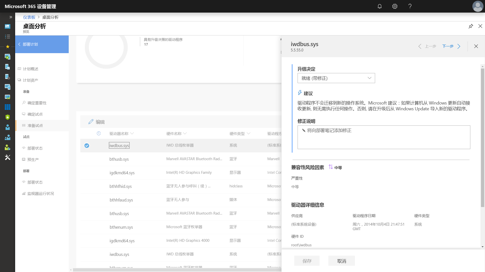
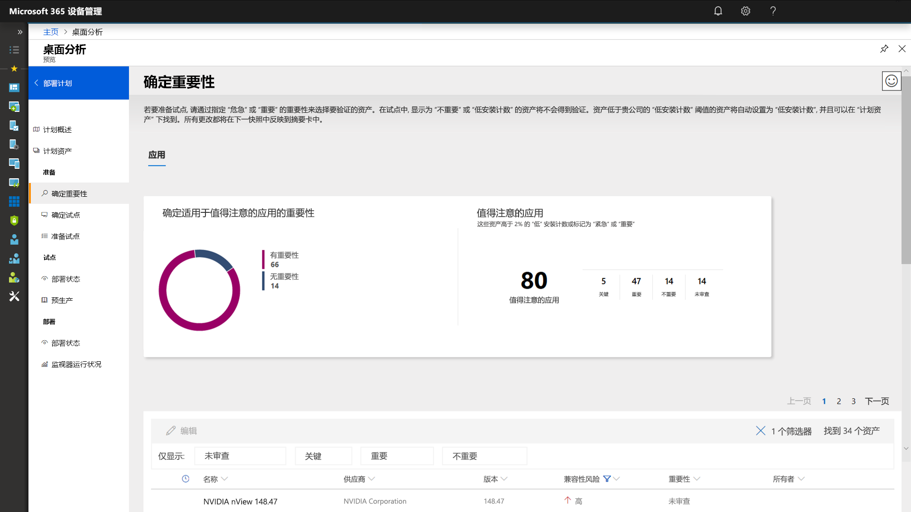
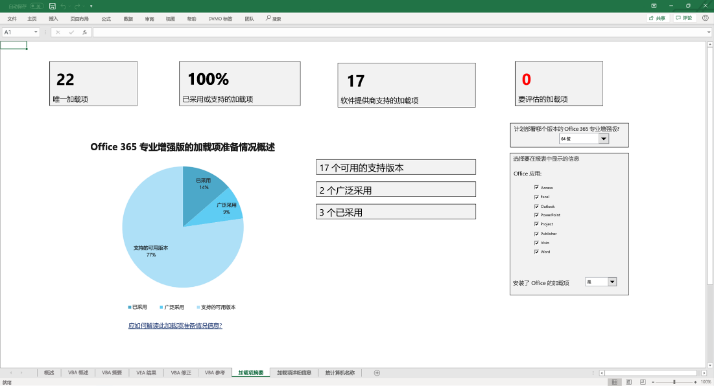
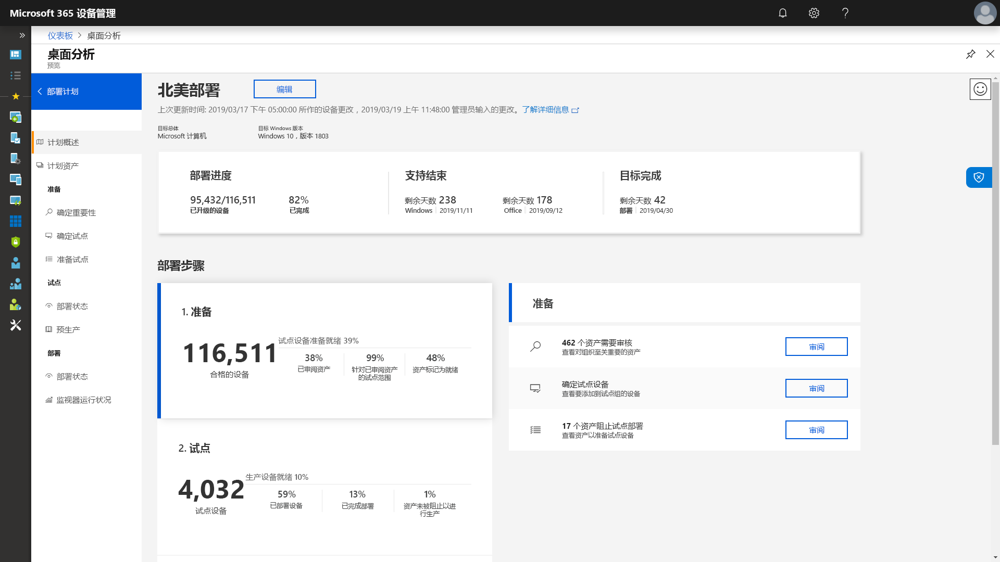

# 步骤 1：设备和应用就绪情况Step 1: Device and App Readiness

<table>
<thead>
<td></td>
<td>
<strong>步骤 1：设备和应用就绪情况</strong><strong>Step 1: Device and App Readiness</strong>

首先为桌面部署项目清查设备和应用，确定进行操作的所需优先顺序，测试按优先顺序排列的应用和设备，然后针对部署所需的先决条件进行查漏补缺。Begin your desktop deployment project with an inventory of your devices and apps, prioritize what you need to move forward, test prioritized apps and devices, then remediate what’s needed to get ready for deployment.
</td>
<td></td>
</thead>
</table>

>[!NOTE]
>设备和应用就绪情况是我们建议的部署过程周期的第一步，它涵盖了应用程序和硬件兼容性的各个方面。Device and App Readiness is the first step in our recommended deployment process wheel by covering the holistic aspects of application and hardware compatibility. 若要查看完整的桌面部署过程，请访问[桌面部署中心](https://aka.ms/HowToShift)。To see the full desktop deployment process, visit the [Desktop Deployment Center](https://aka.ms/HowToShift).
>

在过去，升级用户桌面的主要障碍是应用程序和硬件兼容性。好消息是，当你计划转用 Windows 10 和 Office 365 专业增强版时，在最近 10 年内编写的几乎所有应用程序都将在 Windows 10 上运行，而组织在自 Office 2010 以来的 Office 版本上使用的任何 COM 加载项和 VBA 宏都将继续在最新版本的 Office 上运行，无需进行任何修改。In the past, a major hurdle to upgrading the users’ desktops is application and hardware compatibility. The good news as you plan your shift to Windows 10 and Office 365 ProPlus, is just about any application written in the last 10 years will run on Windows 10, and any COM add-ins and VBA macros your organization used on versions of Office dating back to Office 2010, will continue to work on the latest versions of Office, without modification.

也就是说，根据组织的规模和年龄，验证应用程序和硬件兼容性很有可能仍是我们建议的 8 阶段部署过程中一个必不可少的初始步骤。That said, depending on the size and age of your organization, verifying application and hardware compatibility is likely still an essential initial step in our recommended 8-phase deployment process.

我们将在本文中指导你完成第一阶段：设备和应用就绪情况，方法是使用 Microsoft 就绪情况评估工具（包括桌面分析），这是一套可通过 Windows 许可证获得的基于云的智能解决方案。In this article we take you through that first phase – Device and App Readiness – using Microsoft readiness assessment tools including the Desktop Analytics, an intelligent cloud-based solution available with your Windows license.

## Windows 10 兼容性扫描Windows 10 Compatibility Scan

在部署 Windows 10 之前，Microsoft 建议检查运行 Windows 7 或 8/8.1 的现有设备的就绪情况。Before deploying Windows 10 Microsoft recommends checking the readiness of your existing devices running Windows 7 or 8/8.1. Windows 10 安装介质支持命令行开关，以便 setup.exe 运行升级，但仅检查兼容性，而非实际执行升级。Windows 10 installation media supports a command line switch for the setup.exe to run the upgrade but only check for compatibility, not actually perform the upgrade. ScanOnly 可以作为脚本化批处理文件运行，也可以集成到 Microsoft Endpoint Configuration Manager 任务序列中，包括直接从网络运行 ScanOnly 的功能，因此 Windows 10 安装介质不会被流式传输到本地设备。ScanOnly can be run as a scripted batch file or integrated into a Microsoft Endpoint Configuration Manager task sequence, including the ability to run the ScanOnly directly from the network so the Windows 10 installation media isn't streamed down to the local device. 当 ScanOnly 完成后，通过 Setup.EXE 生成的日志文件中的返回代码返回结果。When ScanOnly completes the results are returned via return codes in log files generated by Setup.EXE.   

自动完成兼容性扫描的示例 ScanOnly 命令行如下所示：A sample ScanOnly command line that completes the compatibility scan silently would look like the below:

    Setup.EXE /Auto Upgrade /Quiet /NoReboot /Compat ScanOnly

有关 ScanOnly 和其他 Windows 安装程序命令开关的更多信息，请查看 [Windows 安装程序命令行选项](https://aka.ms/setupswitches)。For more information on ScanOnly and other Windows setup command switches please review the [Windows Setup Command-line Options](https://aka.ms/setupswitches).

## 推荐的工具：桌面分析Recommended Tool: Desktop Analytics

桌面分析提供许多优于传统桌面管理系统的优势，是我们推荐使用的工具。Desktop Analytics offers many advantages over traditional desktop management systems and is our recommended tool. 它没有代理，可以指导你完成利用通过升级数亿台使用者电脑收集的应用程序和驱动程序兼容性信息所需的操作。It is agentless and guides you through what needs to be done making use of application and driver compatibility information gathered through the upgrade of hundreds of millions of consumer PCs. 此信息为你提供详细的评估，帮助确定可能会阻止升级的兼容性问题，并提供指向 Microsoft 已知建议修补程序的链接。This information gives you a detailed assessment, identifying compatibility issues that might block your upgrade, supported with links to suggested fixes known to Microsoft.

若要设置桌面分析，首先需要设置 Azure 订阅并为其添加一个 Azure Log Analytics 工作区。To set up Desktop Analytics you’ll first need to set up an Azure subscription and include an Azure Log Analytics workspace to that. 运行桌面分析服务后，便可以通过组策略设置注册任何连接 Internet 的 Windows 7 SP1 或更新系统的设备，非常简单。Once you have the Desktop Analytics service running, you can then enroll any Internet-connected Windows 7 SP1 or newer device via Group Policy settings - it’s that simple. 不需要部署代理，桌面分析的可视化工作流可指导你完成从试生产到生产部署的过程。There are no agents to deploy, and Desktop Analytics’ visual workflow guides you from pilot to production deployment. 如果需要，可以将桌面分析中的数据导出到软件部署工具（如 Microsoft Endpoint Configuration Manager（当前分支版本）），这样就可以在准备好部署时，直接定位电脑并生成集合。If you wish, you can export data from Desktop Analytics to software deployment tools such as Microsoft Endpoint Configuration Manager (Current Branch), to target PCs directly and build collections as they become ready for deployment.

如果当前环境未设置桌面分析或者想要注册试用版，请转到桌面分析页 https://www.aka.ms/desktopanalytics) 并开始使用。If you don’t currently have Desktop Analytics set up for your environment or would like to sign up for a trial, go the Desktop Analytics page](https://www.aka.ms/desktopanalytics) and get started.

## 设备和应用就绪情况过程Device and App Readiness Process

设备和应用就绪情况由个四个步骤组成：1.Device and App Readiness is comprised of four steps: 1. 清查，2.Inventory, 2. 确定优先顺序，3.Prioritize, 3. 测试，4.Test, 4. 修正。Remediate. 让我们依次了解一下。Let’s look at each of these in turn.

### 1\.1\. 清查Inventory

桌面分析将使用无代理流程跨桌面空间清查计算机和应用程序。Desktop Analytics uses an agent-less process to inventory the computers and applications across your desktop estate. 它还提供有关经常性访问的 Internet 站点、应用和 Intranet 位置报表，帮助你稍后进行兼容性测试。It also provides reports on highly visited Internet sites, apps, and Intranet locations to help you with compatibility testing later.

### 2\.2\. 确定优先顺序Prioritize

借助清查过程，桌面分析可帮助你确定组织中最常用的应用和硬件并区分优先次序，以及允许对尽可能多的电脑进行部署要注意的事项。With inventory taken, Desktop Analytics helps you to identify and prioritize the most common apps and hardware used in your organization, as well as what to focus on to unblock as many PCs as possible for deployment.

此外，还提供在下一步“测试”中解决问题所需的帮助评估更新的指导。It also provides guidance to help you assess the updates necessary to resolve issues during the next step: testing.

### 3\.3\. 测试Testing

你会发现清查的大多数应用程序、驱动程序和加载项将按原样工作。You will find that most of the applications, drivers, and add-ins inventoried will work as-is. 对于桌面分析评估出存在问题的项目，它会为你提供已知信息，包括在何处查找版本更新以解决兼容性问题。For items Desktop Analytics assesses to have issues, it provides you with known information including where to find version updates to resolve compatibility problems. 可以选择与用户一起停用和替换这些项目，而不是花费时间和资源来解决稀疏部署的非关键型应用程序和较旧设备中的复杂问题。Rather than devoting time and resource resolving complex issues in non-critical, sparsely deployed applications and older devices, you may choose instead to work with users to retire and replace these items.

还可以使用桌面分析来评估基于浏览器的兼容性问题，识别仍在使用 ActiveX 控件、浏览器帮助程序对象、VBScript 或 Microsoft Edge 浏览器不支持的其他旧技术的用户访问的网站和 Web 应用程序。You can use Desktop Analytics to assess browser-based compatibility issues too, identifying websites and web apps accessed by users still using ActiveX controls, Browser Helper Objects, VBScript, or other legacy technology not supported by the Microsoft Edge browser. 用户仍需要为这些站点使用 Internet Explorer 11，你可以使用 Enterprise Mode Site List Manager 将它们添加到 [Enterprise Mode Site List](https://docs.microsoft.com/microsoft-edge/deploy/emie-to-improve-compatibility)。Your users will still need to use Internet Explorer 11 for these sites, and you can add them to the [Enterprise Mode site list](https://docs.microsoft.com/microsoft-edge/deploy/emie-to-improve-compatibility), using the Enterprise Mode Site List Manager.

此外，为了帮助你迁移到 Office 365 专业增强版，你可能希望使用 [Readiness Toolkit for Office](https://docs.microsoft.com/deployoffice/use-the-readiness-toolkit-to-assess-application-compatibility-for-office-365-pro) 来测试加载项和 Microsoft Visual Basic for Applications (VBA) 宏的兼容性。Additionally, to assist in your move to Office 365 ProPlus, you may wish to make use of the [Readiness Toolkit for Office](https://docs.microsoft.com/deployoffice/use-the-readiness-toolkit-to-assess-application-compatibility-for-office-365-pro) to test the compatibility of your add-ins and Microsoft Visual Basic for Applications (VBA) macros.

### 4\. 修正4\. Remediation

设备和应用就绪情况的最后阶段是“修正”。The final phase of device and app readiness is to ‘remediate’. 在此，你将希望收集所需的软件或驱动程序包；作为部署过程的一部分，你将使用这些包来替代或更新较旧版本。Here you’ll want to collect the required software or driver packages; you are going to use these to supersede or update older versions as part of the deployment process.

在处理列表修正问题时，你将看到越来越多的电脑变为“已准备好部署”。这意味着电脑上的驱动程序和应用都被标记为与你要部署的 Windows 10 目标版本兼容。As you work through the list remediating issues, you’ll see that more and more PCs become “Ready for Deployment”. This means that both the drivers and apps on the PCs are noted as compatible with the version of Windows 10 you are targeting for deployment.

### 用于确定应用程序优先顺序的 Configuration Manager 软件清单Configuration Manager Software Inventory for Application Prioritization

Configuration Manager 软件清单是为设备和应用就绪情况使用基于云的分析解决方案的替代方法。Configuration Manager software inventory is an alternative to using cloud-based analytics solutions for device and app readiness. 可以使用安装计数并钻取到特定计算机，帮助确定兼容性测试和验证的优先顺序，并通过包设置将应用程序包设置为与 Windows 10 兼容。You can use installation counts and drill into specific computers to help prioritize compatibility testing and validation and set application packages as compatible with Windows 10 via package settings. 虽然此选项无法比较与 Microsoft 的分析服务的已知兼容性信息，但它可以作为一个有效解决方案来定位一组较小的按优先级排列的应用，用于进行手动测试。While this option does not offer the ability to compare known compatibility information with Microsoft’s analytics services, it can be an effective solution to target a smaller set of prioritized apps for manual testing. 

有关更多信息，请参阅 [Configuration Manager 中的软件清单简介](https://docs.microsoft.com/configmgr/core/clients/manage/inventory/introduction-to-software-inventory)和 [Configuration Manager 中的包和程序](https://docs.microsoft.com/configmgr/apps/deploy-use/packages-and-programs)中的应用程序包的设置平台要求。For more information, see [Introduction to software inventory in Configuration Manager](https://docs.microsoft.com/configmgr/core/clients/manage/inventory/introduction-to-software-inventory) and setting platform requirements in application packages in [Packages and programs in Configuration Manager](https://docs.microsoft.com/configmgr/apps/deploy-use/packages-and-programs).

## 应用保证App Assure

另一个帮助实现 Windows 10 和 Office 365 专业增强版应用兼容性的工具是[App Assure](https://aka.ms/appassure)程序，可通过 FastTrack 中心获取它。Another tool to help with Windows 10 and Office 365 ProPlus app compatibility is the [App Assure](https://aka.ms/appassure) program available through the FastTrack Center. 如果发生有效应用程序问题，Microsoft 工程师将与你协作，通过App Assure ，帮助修正应用程序不兼容问题，并且无需额外费用。In the event of valid application issues, a Microsoft engineer with work with you at no additional cost through App Assure to help remediate the application incompatibility.

## 继续使用诊断数据工具Continued Use of Diagnostic Data Tools

桌面分析不只是帮助你转移到 Windows 10 和 Office 365 专业增强版的工具。Desktop Analytics isn’t just a tool to help you shift to Windows 10 and Office 365 ProPlus. 一旦在 Windows 10 和 Office 365 上运行桌面，就可以使用它来维护部署，并管理半年度功能更新，以便掌握最新动态。Once you have desktops running on Windows 10 and Office 365 you can use it to help maintain your deployment and manage semi-annual Feature Updates so that you can stay current.

## 后续步骤Next Step 

## [步骤 2：目录和网络就绪情况Step 2: Directory and Network Readiness](https://aka.ms/mdd2)
