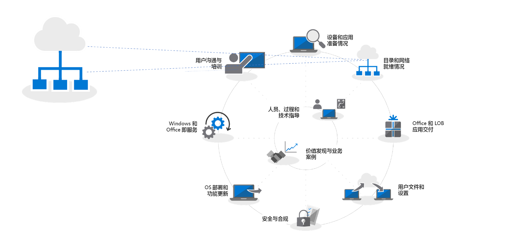
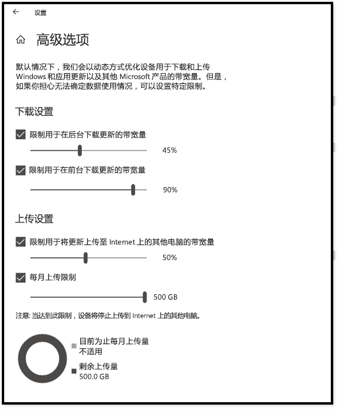
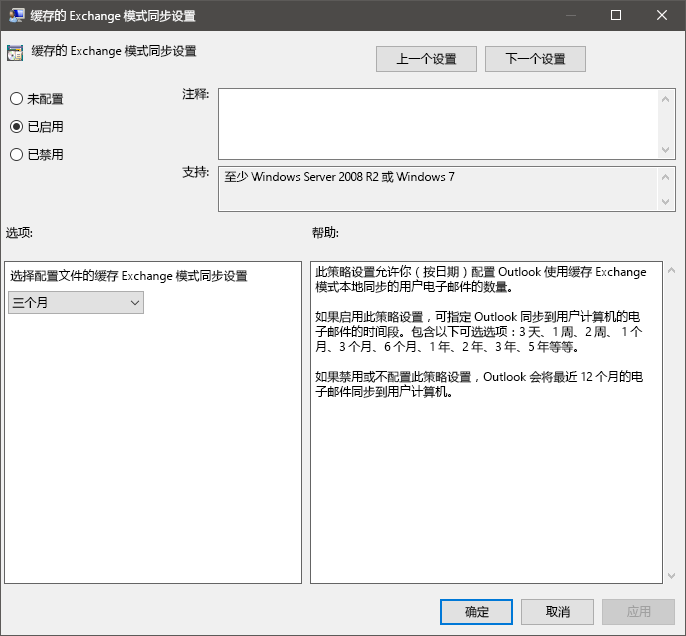
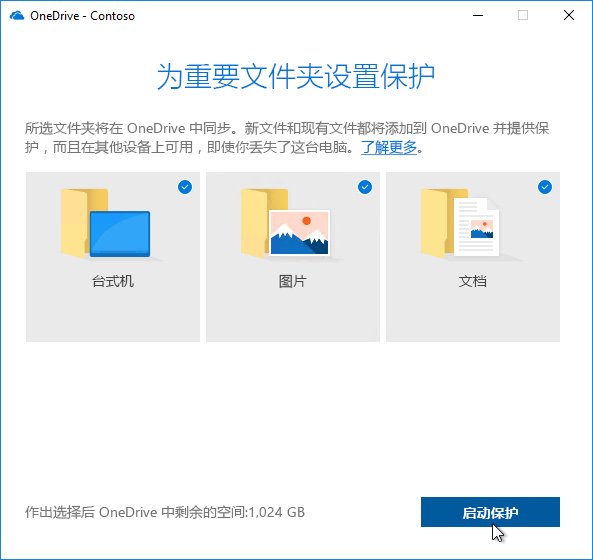

# 步骤 2：目录和网络就绪情况

确保你的目录和网络已配置并准备好支持转换到 Windows 10 和 Office 365 专业增强版。这将要求 Azure Active Directory 服务针对用户准备就绪，并且网络必须能够处理其常规流量以及在电脑升级、恢复用户文件、设置和应用程序时可能出现的大量数据移动量。

<table>
<thead>
<td></td>
<td>
<strong>步骤 2：目录和网络就绪情况</strong>

Office 365 专业增强版中的云连接服务和 Windows Autopilot 等新部署选项都需要安装 Azure Active Directory。在将 Windows 映像、应用、驱动程序和相关文件移动到电脑时，还需要规划网络和连接。请了解新工具和部署选项如何减少和简化网络流量。
</td>
<td></td>
</thead>
</table>

>[!NOTE]
>目录和网络就绪情况是我们建议的部署过程轮的第二步，重点是 Azure Active Directory 和优化网络。 若要查看完整的桌面部署过程，请访问[桌面部署中心](https://aka.ms/HowToShift)。
>

目录和网络就绪情况是确保平稳的 OS 和桌面部署的基础。与任何自动部署一样，必须确保完成文件共享，并且你的网络需要能够支持非常大的文件传输，一次可能支持数百台甚至数千台电脑。

转到 Windows 10 和 Office 365 专业增强版现在还需要确保使用 Azure Active Directory 设置基于云的身份。这不仅是激活 Office 365 专业增强版的关键，还让你能够利用 Windows Autopilot 等新式配置解决方案。

在本文中，我们将探讨准备目录服务的工具和选项，以及准备部署到 Windows 10 和 Office 365 专业增强版的用户和设备权限。

## 添加 Azure Active Directory

如果你的组织已使用 Office 365、Exchange Online、Microsoft Intune 或其他 Microsoft Online 服务，表明你已在使用 Azure Active Directory。 如果是这样的话，只需确保你的桌面部署目标用户位于 Azure Active Directory 中，并且已分配许可证。

如果当前未使用 Azure Active Directory，则有[大量资源](https://docs.microsoft.com/zh-CN/azure/active-directory/)可帮助你进行设置。 作为 Office 365 许可证的一部分，你可能完全有资格通过 Microsoft FastTrack 获得个性化帮助。 可以在[此处](https://fasttrack.microsoft.com)查看有关 Microsoft Fastrack 的更多信息。

Azure Active Directory 安装完成后，你的用户就可以登录并激活他们的 Office 365 专业增强版应用，你可以使用 Microsoft Intune 或 Windows Autopilot 部署来自动部署应用和策略。

## 网络就绪情况

规划部署时，必须考虑带宽要求。 部署过程中有三个主要部分会对网络产生影响：电脑映像、软件更新、用户个性化设置。 这意味着初始迁移的每台电脑空间可能超过 20 GB，并且每台电脑每月通常需要 1 GB 或更大空间才能保持最新状态。

我们首先探讨这三个主要部分的要求：

### 电脑成像

对于没有自定义项的 Windows 映像，通常应规划每台电脑 3 GB 的空间，而对于包含应用的自定义映像，可能需要留出 6 GB 或更大空间。 可能还需要考虑驱动程序包，可以是每台电脑几百 MB，有时高达 1 GB。

### 软件更新

需要为软件更新规划网络带宽。 Windows 10 和 Office 365 专业增强版使用新的服务模型，每月和每半年更新一次。 如果你不熟悉此模型，可以在[此处](https://docs.microsoft.com/zh-CN/windows/deployment/update/waas-overview)了解模型的更多信息。

新的服务模型包括一年两次的 Windows 功能更新、Office 半年频道更新和每月质量更新。功能更新大小通常为 2 - 4 GB，Office 半年频道更新大小为每次更新 300 - 400 MB。然后，每月质量更新大小可能从几百 MB 到 1 GB 以上。这是因为每月更新是累积更新，因此每个 Windows 10 版本的服务生命周期内的大小都会增加。也就是说，有些工具可以帮助减少必须通过网络传递实现更新的数据量。我们将在下面更详细地介绍这一点。

### 用户个性化设置

要考虑的第三个部分是用户个性化设置。对于这一点，需要规划网络带宽，以便在电脑刷新或更换过程中能够恢复用户文件、用户设置和应用程序。每台电脑上的这些项目的大小加起来通常超过 20 GB；对于某些用户，可能超过 100 GB。

## **限制带宽**

限制部署相关流量对网络的影响的一种方法是使用客户端上的 BITS（后台智能传输服务）设置来限制它。BITS 使用自适应比特率 (ABR) 来调整可用于部署目的的带宽；可以使用组策略在客户端上配置它。

  [关于 BITS](https://docs.microsoft.com/zh-CN/windows/desktop/bits/about-bits)

如果使用 System Center Configuration Manager (Current Branch)，还可以配置启用 BITS 的分发点或使用 WDS 启用多播。

限制特定流量意味着正常的网络流量受下载更新和应用程序的电脑的影响较小。但为这些任务划出一定比例的带宽有助于确保工作效率不受 Windows 或 Office 部署的影响，并且进程会根据需要继续运行，这可能会增加与部署相关的停机时间，导致用户在部署运行期间被锁定在电脑外。

幸好可以使用一些新工具更轻松地管理大规模桌面部署的网络影响，其中包括用于优化可用带宽使用情况的 LEDBAT，以及将部署流量从网络中心和外围移出的对等 (P2P) 选项

## **清理带宽**

Windows Server 2019 和 System Center Configuration Manager (Current Branch) 中支持的低额外时延背景传输 (LEDBAT) 旨在优化传送到 Windows 客户端的网络流量。

[Windows Server 2019 中的十大网络功能：\#9 LEDBAT - 延迟优化背景传输](https://blogs.technet.microsoft.com/networking/2018/07/25/ledbat/)

与传统限制不同，LEDBAT 可以将所有可用的网络带宽用作后台任务，在其他流量请求时立即产生带宽。与 BITS 不同的是，它不存在延迟；所有操作自动化执行，无需手动调整或计划，所有内容都在服务器端设置。这可以带来潜在的巨大性能提升。

## **对等限制**

对等选项越来越多地用于 Windows 10 迁移、电脑映像、软件更新和用户个性化设置。在初始 Windows 10 部署之后，它们对于推动版本到版本升级也很有价值。我们下面介绍几个示例，帮助将 Windows 10 和 Office 相关流量从网络中心移出，减少对经典限制方法的需求，并允许电脑在本地网络中的对等端上查找所需的更新文件，而不是从分发点或 Internet 下载它们。

**BranchCache** 可以帮助你在分布式环境中下载内容而不会使网络饱和。它包含两个选项：托管缓存模式（可以使用本地服务器缓存内容）和分布式缓存模式（System Center Configuration Manager 支持的模式），它允许客户端彼此共享已下载的内容。

**对等缓存** System Center Configure 支持的客户端也可以使用对等缓存。 这使在网络上可以可靠地使用的电脑可以托管内容分发源。 不必启用所有电脑，只需启用连接了可靠网络的主机（例如台式机、小型立式或立式电脑）。 对等缓存甚至可以在安装过程中用于在 Windows PE 阶段运行的部署任务。

注意：BranchCache 和对等缓存是互补的，可以在同一环境中协同工作。

[BranchCache 与对等缓存](https://blogs.technet.microsoft.com/swisspfe/2018/01/25/branch-cache-vs-peer-cache/)

**传递优化**传递优化是另一种对等缓存技术，为 Windows 部署提供基于网络的控制。 Windows 10 传递优化用于更新内置 UWP 应用，还用于从 Microsoft Store 安装应用程序，以及使用 Express Update 进行软件更新。 它在自早期版本的 Windows 10 发布以来已经可用，但最近才与 System Center Configuration Manager (Current Branch) 集成。 自 Windows 10 版本 1803 开始，新配置选项意味着现在可以独立设置后台更新和前台作业（例如来自应用商店的应用安装）的带宽限制。 Windows 传递优化现在还在客户端更新期间支持 Office 365 专业增强版，并通过所有受支持的 Office 365 客户端更新频道提供。 即将提供在 Office 365 客户端初始安装期间对 Windows 传递优化的支持。  

**Office 365 专业增强版的其他注意事项**

除了利用传递优化以外，还可以通过以下三项措施减少因 Office 365 专业增强版部署而导致的网络负载。

**二进制增量压缩**从最新版本的 Office 365 专业增强版更新到下一版本时，Office 365 专业增强版使用二进制增量压缩来减少软件更新所消耗的带宽。通过仅从先前版本中提取二进制级别更改，可以最大限度地减少累积更新的逐月增长所带来的影响。这样一来，每台电脑每月可以节省数百 MB 的数据空间。但是，若要使用此功能，不能跳过版本。如果这样做的话，必须下载完整的累积更新。

  [下载适用于 Office 365 的更新](https://docs.microsoft.com/zh-CN/deployoffice/overview-of-the-update-process-for-office-365-proplus#download-the-updates-for-office-365-proplus)

**Outlook 数据文件** Outlook 通常配置为在本地缓存用户的整个邮箱以供脱机使用。 在任何 Windows 部署中，只有就地升级需要用户的 Outlook 数据文件在升级后自行重建。 这是一个自动执行过程，但 Outlook 邮箱限制通常设置为最多 100 GB，所有用户在本地重新缓存整个邮箱意味着需要进行大量数据传输。 要减少网络负载，可能需要考虑使用组策略来减少“邮件保持脱机”设置。 在 Office 365 专业增强版的 Outlook 中或 Outlook 2016 中，默认值设置为 12 个月。 考虑将脱机缓存设置为持续 1 到 6 个月。 更改此设置不会影响联机邮箱的大小，并且在联机时仍可以通过 Outlook 搜索整个邮箱。

**OneDrive 文件按需下载和已知文件夹移动** OneDrive 是同步和保护电脑和云中其他设备的用户文件的绝佳方式。 使用“已知文件夹移动”，可以强制执行从用户的“桌面”、“文档”和“图片”文件夹到 OneDrive 的文件同步，从而在登录新设备或重置映像的电脑时使这些文件可用。 但请注意，由于“桌面”、“文档”和“图片”位置中保留的文件大小和数量庞大，需要有计划地推出在电脑上启用和实施 OneDrive 的策略。 一种选择是使用组策略网络控件来限制 OneDrive 同步服务使用的带宽。

[设置已知文件夹移动](https://techcommunity.microsoft.com/t5/Microsoft-OneDrive-Blog/Migrate-Your-Files-to-OneDrive-Easily-with-Known-Folder-Move/ba-p/207076)

[OneDrive 文件按需下载](https://www.microsoft.com/en-us/microsoft-365/blog/2017/05/11/introducing-onedrive-files-on-demand-and-additional-features-making-it-easier-to-access-and-share-files/)

如果你还没有推出 OneDrive，那么从 Windows 7 到 Windows 10 的转换是启用 OneDrive 的绝佳机会，它可以无缝集成 Office 365 专业增强版。 请考虑在完成应用和设备准备工作的同时开始推出。 在开始移动 Windows 映像并通过网络部署应用之前，将先执行文件同步。

## 后续步骤 

## [步骤 3：Office 和 LOB 应用交付](https://aka.ms/mdd3)

## 上一步：

## [步骤 1：设备和应用就绪情况](https://aka.ms/mdd1)

## 反馈

我们希望收到你的反馈。请选择要提供的类型：

产品反馈登录以提供文档反馈

我们的新反馈系统以 GitHub 问题为基础。请在我们的博客文章中了解此更改。
