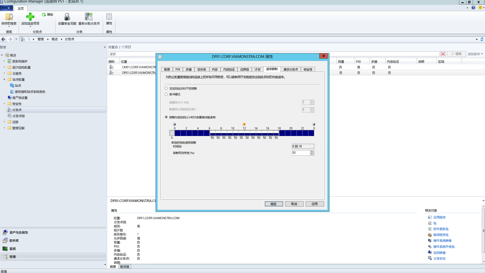
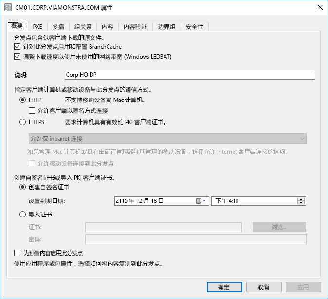
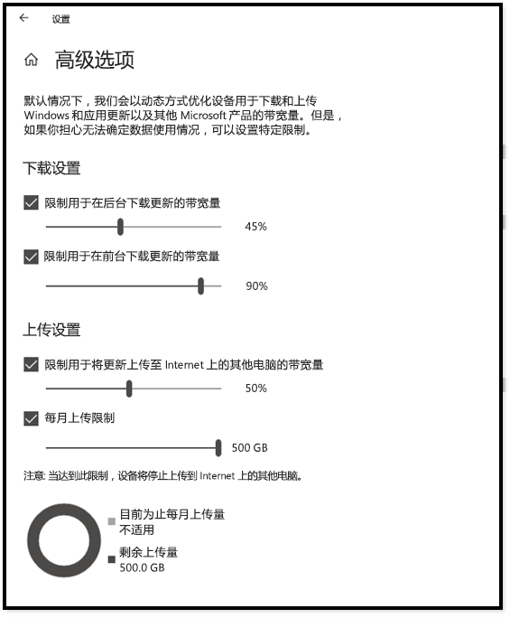
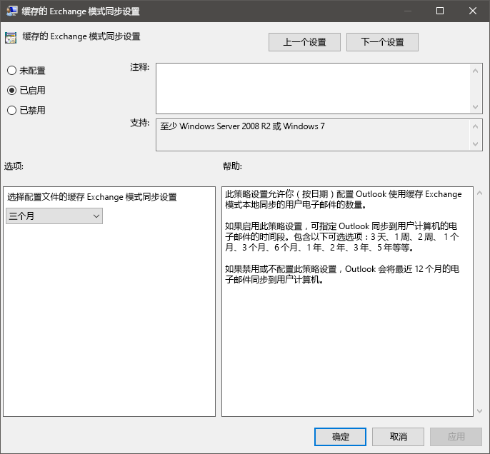

# 步骤 2：目录和网络就绪情况Step 2: Directory and Network Readiness

请确保目录和网络都已配置好，可以支持转换到 Windows 10 和 Microsoft 365 企业应用版。这要求 Azure Active Directory 服务为用户准备就绪，并且网络必须有能力处理其常规流量以及在电脑升级、用户文件、设置和应用程序恢复时可能移动的大量数据。Ensure your directory and the network are configured and ready to support to your shift to Windows 10 and Microsoft 365 Apps for enterprise. This will require Azure Active Directory Services to be in place for users, and your network must have the capacity to handle both its regular traffic and the movement of potentially vast amounts of data as PCs are upgraded, and users’ files, settings and applications are restored.

<table>
<thead>
<td></td>
<td>
<strong>步骤 2：目录和网络就绪情况</strong><strong>Step 2: Directory and Network Readiness</strong>

Microsoft 365 企业应用版中的云连接服务和 Windows Autopilot 等新的部署解决方案都需要 Azure Active Directory。将 Windows 映像、应用、驱动程序和相关文件迁移到电脑时，网络和连接性也是需要计划的重要方面。了解新的工具和部署解决方案如何减少和简化网络流量。Cloud connected services in Microsoft 365 Apps for enterprise and new deployment options like Windows Autopilot require Azure Active Directory. Your network and connectivity are also important areas to plan when moving Windows images, apps, drivers and related files to your PCs. Learn how new tools and deployment options reduce and streamline network traffic.
</td>
<td></td>
</thead>
</table>

>[!NOTE]
>目录和网络就绪情况是我们建议的部署过程轮的第二步，重点是 Azure Active Directory 和优化网络。Directory and Network Readiness is the second step in our recommended deployment process wheel focusing on Azure Active Directory and optimizing the network. 若要查看完整的桌面部署过程，请访问[桌面部署中心](https://aka.ms/HowToShift)。To see the full desktop deployment process, visit the [Desktop Deployment Center](https://aka.ms/HowToShift).
>

目录和网络就绪情况是确保平稳的 OS 和桌面部署的基础。与任何自动部署一样，必须确保完成文件共享，并且你的网络需要能够支持非常大的文件传输，一次可能支持数百台甚至数千台电脑。Directory and Network readiness is fundamental to ensuring a smooth OS and desktop deployment. As with any automated deployment, it is important to ensure your file shares can be reached, and your network will need to be able to support the transfer of very large files, possibly to hundreds or even thousands of PCs at a time.

若要转换到 Windows 10 和 Microsoft 365 企业应用版，现在还需要确保已使用 Azure Active Directory 设置基于云的标识。这不仅是激活 Microsoft 365 企业应用版的关键，还可便于你利用 Windows Autopilot 等新式预配解决方案。With your shift to Windows 10 and Microsoft 365 Apps for enterprise you also now need to make sure that cloud-based identity is set up with Azure Active Directory. This is key not only to activating Microsoft 365 Apps for enterprise, it also allows you to take advantage of modern provisioning solutions like Windows Autopilot.

本文将探讨用于准备目录服务、用户和设备权限的工具和解决方案，以便部署到 Windows 10 和 Microsoft 365 企业应用版。In this article we’ll explore the tools and options to prepare your directory services, and user and device permissions, ready for deployment to Windows 10 and Microsoft 365 Apps for enterprise.

## 添加 Azure Active DirectoryAdding Azure Active Directory

如果你的组织已使用 Office 365、Exchange Online、Microsoft Intune 或其他 Microsoft Online 服务，表明你已在使用 Azure Active Directory。If your organization already uses Office 365, Exchange Online, Microsoft Intune, or other Microsoft Online services, the good news is you are already using Azure Active Directory. 如果是这样的话，只需确保你的桌面部署目标用户位于 Azure Active Directory 中，并且已分配许可证。If you are, you just need to ensure that the users you are targeting for desktop deployment are in your Azure Active Directory and that licenses have been assigned.

如果当前未使用 Azure Active Directory，则有[大量资源](https://docs.microsoft.com/azure/active-directory/)可帮助你进行设置。If you are not currently using Azure Active Directory, there are [numerous resources](https://docs.microsoft.com/azure/active-directory/) to help you set it up. 你也可以通过 Microsoft FastTrack 获得个性化帮助，这是许可证的权益。You may well qualify for personalized assistance via Microsoft FastTrack, as part of your license. 可以在[此处](https://fasttrack.microsoft.com)查看有关 Microsoft FastTrack 的更多信息。You can check out more about Microsoft FastTrack [here](https://fasttrack.microsoft.com).

在 Azure Active Directory 准备就绪后，你的用户就可以登录并激活 Microsoft 365 企业应用版应用，你也可以使用 Microsoft Intune 或 Windows Autopilot 部署来自动部署应用和策略。Once you have Azure Active Directory in place, your users can sign in to and activate their Microsoft 365 Apps for enterprise apps, and you can use Microsoft Intune or Windows Autopilot deployment for automated deployment of apps and policy.

## 网络就绪情况Network Readiness

规划部署时，必须考虑带宽要求。You must consider bandwidth requirements when planning your deployments. 部署过程中有三个主要部分会对网络产生影响：电脑映像、软件更新、用户个性化设置。There are three main components in a deployment that will have an impact on your network – PC imaging, software updates, and user personalization. 这意味着初始迁移的每台电脑空间可能超过 20 GB，并且每台电脑每月通常需要 1 GB 或更大空间才能保持最新状态。Between them, this can mean in excess of 20 GB per PC for the initial migration, and often 1 GB or more per month per PC to stay up-to-date.

我们首先探讨这三个主要部分的要求：Let’s start by exploring the requirements of each of these three main components:

### 电脑成像PC Imaging

对于没有自定义项的 Windows 映像，通常应规划每台电脑 3 GB 的空间，而对于包含应用的自定义映像，可能需要留出 6 GB 或更大空间。For Windows Images with no customization you should plan typically for 3GB per PC, while for customized images with apps you may need to allow 6GB, or more. 可能还需要考虑驱动程序包，可以是每台电脑几百 MB，有时高达 1 GB。You may also need to consider Driver packages; these can be a few hundred megabytes per PC, sometimes up to 1GB.

### 软件更新Software Updates

需要为软件更新规划网络带宽。You’ll need to plan network bandwidth for software updates. Windows 10 和 Microsoft 365 企业应用版使用新的服务模型来分发每月更新和半年更新。Windows 10 and Microsoft 365 Apps for enterprise use a new servicing model delivering monthly and semi-annual updates. 如果你不熟悉此模型，可以在[此处](https://docs.microsoft.com/windows/deployment/update/waas-overview)了解模型的更多信息。If you are new to this model, you can learn more about how this works [here](https://docs.microsoft.com/windows/deployment/update/waas-overview).

新的服务模型包括一年两次的 Windows 功能更新、Office 半年企业频道更新和每月质量更新。功能更新大小通常为 2 - 4 GB，Office 半年企业频道更新大小为每次更新 300 - 400 MB。然后，每月质量更新大小可能从几百 MB 到 1 GB 以上。这是因为每月更新是累积更新，因此其大小在每个 Windows 10 版本的服务生命周期内都会不断增加。也就是说，有些工具可以帮助减少为了实施更新而必须通过网络传递的数据量。我们将在下面更详细地介绍这一点。The new servicing model includes Feature Updates for Windows twice a year, Office Semi-Annual Enterprise Channel Updates, and monthly Quality Updates. Feature Updates are typically 2 – 4GB in size, and Office Semi-Annual Enterprise Channel updates are 300 – 400 MB per update. Then there are the monthly Quality Updates. These may range from a few hundred megabytes to over a gigabyte. This is because monthly updates are cumulative, so these increase in size over the servicing lifetime for each Windows 10 version. That said, there are tools that can help reduce the amount of data that must pass over the network to implement updates. We will cover this in more detail below.

### 用户个性化设置User Personalization

要考虑的第三个部分是用户个性化设置。对于这一点，需要规划网络带宽，以便在电脑刷新或更换过程中能够恢复用户文件、用户设置和应用程序。每台电脑上的这些项目的大小加起来通常超过 20 GB；对于某些用户，可能超过 100 GB。The third component to consider is user personalization. Here you need to plan network bandwidth to accommodate the restoring of user files, their settings, and their applications as part of the PC refresh or replacement process. Together, these items often exceed 20 GB per PC; for some users these may exceed 100 GB.

## 限制带宽Limiting Bandwidth

限制部署相关流量对网络的影响的一种方法是使用客户端上的 BITS（后台智能传输服务）设置来限制它。BITS 使用自适应比特率 (ABR) 来调整可用于部署目的的带宽；可以使用组策略在客户端上配置它。One way to limit the impact of deployment-related traffic on the network is to throttle it using the BITS (Background Intelligent Transfer Service) setting on clients. BITS uses an Adaptive Bit Rate (ABR) to adjust bandwidth available for deployment purposes; it can be configured on clients using Group Policy.

[关于 BITSAbout BITS](https://docs.microsoft.com/windows/desktop/bits/about-bits)

如果使用 Microsoft Endpoint Configuration Manager（当前分支版本），还可以配置启用 BITS 的分发点或使用 WDS 启用多播。If you use Microsoft Endpoint Configuration Manager (Current Branch), you can also configure BITS-enabled Distribution Points or enable multicast with WDS.

限制特定流量意味着正常的网络流量受下载更新和应用程序的电脑的影响较小。但为这些任务划出一定比例的带宽有助于确保工作效率不受 Windows 或 Office 部署的影响，并且进程会根据需要继续运行，这可能会增加与部署相关的停机时间，导致用户在部署运行期间被锁定在电脑外。Throttling specific traffic means that normal network traffic is less impacted by PCs downloading updates and applications. But carving out a certain percentage of bandwidth for these tasks helps ensure productivity isn’t impacted by Windows or Office deployment and processes continue to run as needed, it can worsen deployment-related downtime, with users locked out of their PCs while a deployment runs.

幸好可以使用一些新工具更轻松地管理大规模桌面部署的网络影响，其中包括用于优化可用带宽使用情况的 LEDBAT，以及将部署流量从网络中心和外围移出的对等 (P2P) 选项Fortunately, there are new tools to make it easier for you to manage the network impact of a large-scale desktop deployment, including LEDBAT to optimize use of available bandwidth, and peer-to-peer (P2P) options to move deployment traffic away from the center of the network and out to the perimeter

## 清理带宽Scavenging Bandwidth

Windows Server 2019 和 Microsoft Endpoint Configuration Manager（当前分支版本）中支持的低额外时延背景传输 (LEDBAT) 旨在优化传送到 Windows 客户端的网络流量。Low Extra Delay Background Transport (LEDBAT), supported in Windows Server 2019 and Microsoft Endpoint Configuration Manager (Current Branch), is designed to optimize network traffic to Windows clients.

[Windows Server 2019 中的十大网络功能：\#9 LEDBAT - 延迟优化背景传输Top 10 Networking Features in Windows Server 2019: \#9 LEDBAT – Latency Optimized Background Transport](https://blogs.technet.microsoft.com/networking/2018/07/25/ledbat/)

与传统限制不同，LEDBAT 可以将所有可用的网络带宽用作后台任务，在其他流量请求时立即产生带宽。与 BITS 不同的是，它不存在延迟；所有操作自动化执行，无需手动调整或计划，所有内容都在服务器端设置。这可以带来潜在的巨大性能提升。Unlike traditional throttling, LEDBAT can use all available network bandwidth as a background task, instantly yielding bandwidth when other traffic requests it. Unlike BITS there is no delay; everything is automated – no manual tuning or scheduling required, and everything is setup server side. This affords potentially massive performance gains.

## 对等选项Peer-to-Peer options

对等选项越来越多地用于 Windows 10 迁移、电脑映像、软件更新和用户个性化设置。在初始 Windows 10 部署之后，它们对于推动版本到版本升级也很有价值。我们下面介绍几个示例，帮助将 Windows 10 和 Office 相关流量从网络中心移出，减少对经典限制方法的需求，并允许电脑在本地网络中的对等端上查找所需的更新文件，而不是从分发点或 Internet 下载它们。Peer-to-Peer options are increasingly being used in Windows 10 migrations, for PC imaging, software updates and user personalization. They are also valuable in facilitating build-to-build upgrades after your initial Windows 10 deployment. Here we will cover several examples to help move Windows 10 and Office-related traffic away from the center of the network, reducing the need for classic throttling approaches, and allowing PCs to find the update files they need on peers in their local network rather than downloading them from a distribution point or the internet.

**BranchCache** 可以帮助你在分布式环境中下载内容而不会使网络饱和。它包含两个选项：托管缓存模式（可以使用本地服务器缓存内容）和分布式缓存模式（Configuration Manager 支持的模式），它允许客户端彼此共享已下载的内容。**BranchCache** can help you download content in distributed environments without saturating the network. It comes in two options: Hosted Cache Mode, which lets you use local servers to cache content, and Distributed Cache Mode (a mode supported in Configuration Manager), which lets clients share already downloaded content with each other.

**对等缓存** Configuration Manager 支持的客户端也可以使用对等缓存。**Peer Cache** Clients supported by Configuration Manager can also make use of Peer Cache. 这使在网络上可以可靠地使用的电脑可以托管内容分发源。This allows PCs that are reliably available on the network to host source for content distribution. 不必启用所有电脑，只需启用连接了可靠网络的主机（例如台式机、小型立式或立式电脑）。You won’t want to enable this all of your PCs – only target devices with reliable network connections as hosts (e.g. desktop, mini-tower, or tower PCs). 对等缓存甚至可以在安装过程中用于在 Windows PE 阶段运行的部署任务。Peer Cache can even work for deployment tasks running in Windows PE phases during setup.

注意：BranchCache 和对等缓存是互补的，可以在同一环境中协同工作。Note: BranchCache and Peer Cache are complementary and can work together in the same environment.

[BranchCache 与对等缓存BranchCache vs. Peer Cache](https://blogs.technet.microsoft.com/swisspfe/2018/01/25/branch-cache-vs-peer-cache/)

**传递优化**传递优化是另一种对等缓存技术，为 Windows 部署提供基于网络的控制。**Delivery Optimization** Delivery Optimization is another peer-to-peer caching technology, providing network-based controls for deployments. Windows 10 传递优化用于更新内置 UWP 应用，还用于从 Microsoft Store 安装应用程序，以及使用 Express Update 进行软件更新。Windows 10 Delivery Optimization to update built-in UWP apps, also to install applications from the Microsoft Store, and for software updates using Express Updates. 它在自早期版本的 Windows 10 发布以来已经可用，但最近才与 Microsoft Endpoint Configuration Manager（当前分支版本）集成。It has been available since early versions of Windows 10, though it has only recently integrated with Microsoft Endpoint Configuration Manager (Current Branch). 自 Windows 10 版本 1803 开始，新配置选项意味着现在可以独立设置后台更新和前台作业（例如来自应用商店的应用安装）的带宽限制。Since Windows 10 version 1803 new configuration options mean you can now independently set bandwidth limits for background updates and foreground jobs such as an app install from the Store. Windows 传递优化现在还支持在客户端更新（通过所有受支持的客户端更新通道提供）期间使用 Microsoft 365 企业应用版。Windows Delivery Optimization now also supports Microsoft 365 Apps for enterprise during client updates, available in all supported client update channels. 即将开始支持在客户端初始安装期间使用 Windows 传递优化。Support for Windows Delivery Optimization during client initial installation will be coming soon.  

**Microsoft 365 企业应用版的其他注意事项****Additional Considerations for Microsoft 365 Apps for enterprise**

除了利用传递优化外，还可以采取下列三项措施，它们有助于减少因 Microsoft 365 企业应用版部署而产生的网络负载。In addition to leveraging Delivery Optimization, here are three items that will help reduce your network load due to Microsoft 365 Apps for enterprise deployments.

**二进制增量压缩**：Microsoft 365 企业应用版使用二进制增量压缩，以减少从最新发行版 Microsoft 365 企业应用版更新到下一发行版时软件更新所消耗的带宽。通过只从旧发行版中拉取二进制级别更改，可以最大限度地减少累积更新的逐月增长所造成的影响。这样一来，每台电脑每月可能节省数百 MB 的数据空间。不过，为了使用此功能，就不能跳过发行版。如果这样做，必须下载完整的累积更新。**Binary Delta Compression** Microsoft 365 Apps for enterprise uses Binary Delta Compression to reduce bandwidth consumed by software updates when updating from the most recent release of Microsoft 365 Apps for enterprise to the next release. By only pulling the binary level changes from the previous release, the impact from month-over-month growth of cumulative updates is minimized. This has the potential of saving several hundred megabytes of data, per PC, each month. In order to use this capability though, you cannot skip releases. If you do, then the full cumulative update must be downloaded.

[下载 Microsoft 365 应用版更新Downloading Updates for Microsoft 365 Apps](https://docs.microsoft.com/deployoffice/overview-update-process-microsoft-365-apps#download-the-updates-for-microsoft-365-apps)

**Outlook 数据文件** Outlook 通常配置为在本地缓存用户的整个邮箱以供脱机使用。**Outlook Data Files** Outlook is often configured to cache users’ entire mailbox locally for use offline. 在任何 Windows 部署中，只有就地升级需要用户的 Outlook 数据文件在升级后自行重建。In any Windows deployment, except an in-place upgrade, that requires the users’ Outlook Data Files to rebuild themselves after the upgrade. 这是一个自动执行过程，但 Outlook 邮箱限制通常设置为最多 100 GB，所有用户在本地重新缓存整个邮箱意味着需要进行大量数据传输。This is an automated process, but with Outlook mailbox limits typically set to up to 100GB, re-caching the entire mailbox locally for all users means a lot of data transfer. 要减少网络负载，可能需要考虑使用组策略来减少“邮件保持脱机”设置。To reduce the network load you may want to consider using Group Policy to reduce the “Mail to keep offline” setting. 在 Microsoft 365 企业应用版或 Office 2016 中，Outlook 的默认值设置为 12 个月。In Microsoft 365 Apps for enterprise or Office 2016 the default value for Outlook is set to 12 months. 考虑将脱机缓存设置为持续 1 到 6 个月。In order to reduce network impact consider setting the offline cache to last between 1 to 6 months. 更改此设置不会影响联机邮箱的大小，并且在联机时仍可以通过 Outlook 搜索整个邮箱。Changing this setting does not affect the size of the online mailbox, and the entire mailbox can still be searched via Outlook when online.

**OneDrive 文件按需下载和已知文件夹移动** OneDrive 是同步和保护电脑和云中其他设备的用户文件的绝佳方式。**OneDrive Files on Demand and Known Folder Move** OneDrive is a great way to synchronize and protect user files from PCs and other devices in the cloud. 使用“已知文件夹移动”，可以强制执行从用户的“桌面”、“文档”和“图片”文件夹到 OneDrive 的文件同步，从而在登录新设备或重置映像的电脑时使这些文件可用。With Known Folder Move, you can enforce file sync from a user’s Desktop, Documents, and Pictures folders to OneDrive making those files available when signing into a new device a or reimaged PC. 但请注意，由于“桌面”、“文档”和“图片”位置中保留的文件大小和数量庞大，需要有计划地推出在电脑上启用和实施 OneDrive 的策略。Remember though, due to the sheer size and number of files kept in Desktop, Documents, and Pictures locations, you’ll want to be planful with the rollout of policies enabling and enforcing OneDrive on your PCs. 一种选择是使用组策略网络控件来限制 OneDrive 同步服务使用的带宽。One option is to use Group Policy Network controls to throttle bandwidth used by the OneDrive sync service.

[设置已知文件夹移动Setup Known Folder Move](https://techcommunity.microsoft.com/t5/Microsoft-OneDrive-Blog/Migrate-Your-Files-to-OneDrive-Easily-with-Known-Folder-Move/ba-p/207076)

[OneDrive 文件按需下载OneDrive Files on Demand](https://www.microsoft.com/microsoft-365/blog/2017/05/11/introducing-onedrive-files-on-demand-and-additional-features-making-it-easier-to-access-and-share-files/)

如果你还没有推出 OneDrive，那么从 Windows 7 转换到 Windows 10 是启用 OneDrive 的绝佳机会，它可以无缝集成 Microsoft 365 企业应用版。If you haven’t already rolled out OneDrive, the shift from Windows 7 to Windows 10 is a perfect opportunity to enable OneDrive and it integrates seamlessly Microsoft 365 Apps for enterprise. 请考虑在完成应用和设备准备工作的同时开始推出。Consider starting this roll-out while working through your app and device readiness. 在开始移动 Windows 映像并通过网络部署应用之前，将先执行文件同步。This will give file sync a head start before you start moving Windows images and deploying apps over your network.

## 后续步骤Next Step 

## [步骤 3：Office 和 LOB 应用交付Step 3: Office and LOB App Delivery](https://aka.ms/mdd3)

## 上一步：Previous Step:

## [步骤 1：设备和应用就绪情况Step 1: Device and App Readiness](https://aka.ms/mdd1)

## 反馈Feedback

我们希望收到你的反馈。请选择要提供的类型：We'd love to hear your thoughts. Choose the type you'd like to provide:

产品反馈登录以提供文档反馈Product feedback Sign in to give documentation feedback

我们的新反馈系统以 GitHub 问题为基础。请在我们的博客文章中了解此更改。Our new feedback system is built on GitHub Issues. Read about this change in our blog post.
