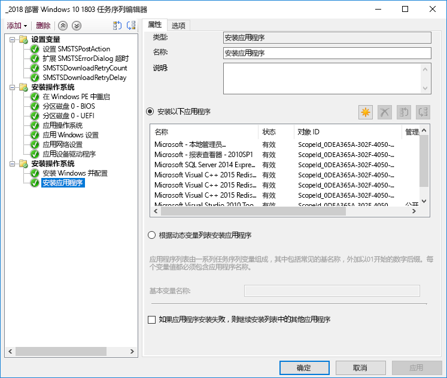
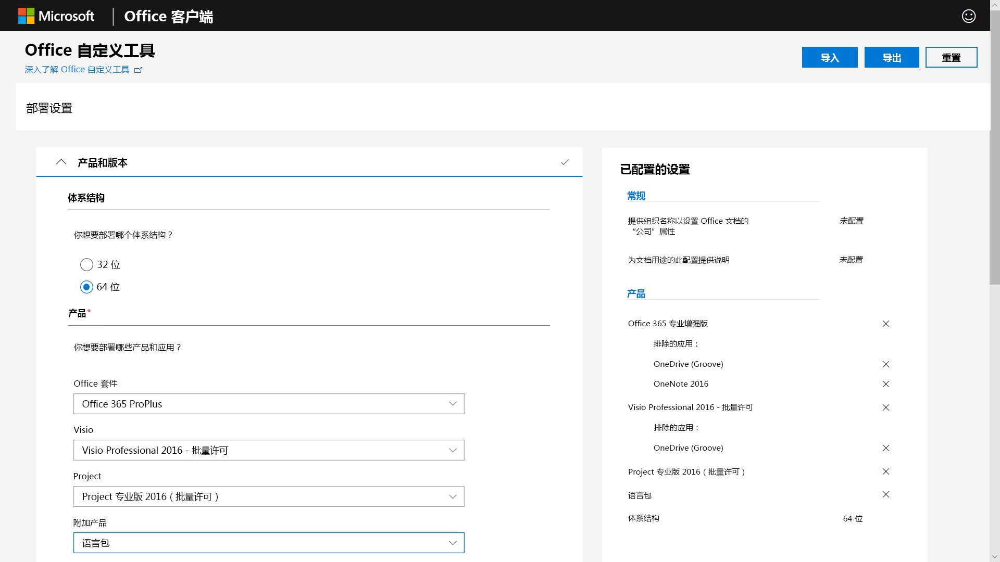
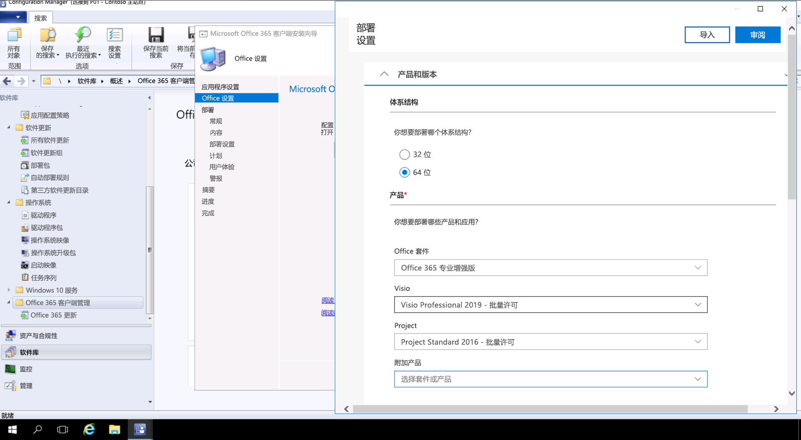

# 步骤 3：Office 和 LOB 应用交付

<table>
<thead>
<td></td>
<td>
<strong>步骤 3：Office 和 LOB 应用交付</strong>

确保应用已打包，且可进行自动安装。了解如何使用 Office 365 专业增强版的即点即用打包，通过新方法来配置、交付和持续更新 Office 应用。
</td>
<td></td>
</thead>
</table>

>[!NOTE]
>Office 和 LOB 应用交付是我们推荐的部署过程轮中的第三步，其中包括安装和管理 Office 和 LOB 的选项。 为了成功部署，请不要跳过前两个步骤。  若要查看的完整桌面部署过程，请访问[桌面部署中心](https://aka.ms/HowToShift)。
>

现在可以准备好交付 Office 和业务线应用了，可以通过很多方法执行此操作，包括一些令人欣喜不已的新选项。 尽管某些应用程序仅提供 32 位或 64 位编译版本，但其他应用程序（如 Office 365 专业增强版）提供 32 位和 64 位本机编译代码，你要做出的最大决策就是选择要部署的版本。 若要在新设备上利用额外的计算能力和 RAM，Microsoft 建议在没有 32 位依赖项时使用 64 位版本。 若要确定任何与加载项或文件相关的兼容性挑战，建议在继续前重新访问步骤 1 设备和应用程序就绪情况。

如果没有任何障碍，我们建议部署 64 位版本的所有应用，包括 Microsoft Office。64 位本机编译应用提供最佳性能，并且是最经得起未来考验的选择。

在 Windows 上安装应用有很多方法和模型，让我们看看你的交付选项。

[Windows 10 应用程序管理](https://docs.microsoft.com/windows/application-management/)

## 基于 MSI 的部署

对于业务线应用，你可能会使用基于 MSI 的包或可执行文件，并将应用程序安装为 OS 部署任务序列的一部分。 Windows 10 会继续使用这些包。

像 Microsoft Endpoint Configuration Manager 和 Microsoft Intune 这样的软件部署工具也会被优化以交付 MSI 打包的应用。一旦在 Windows 10 上验证了应用，就可以使用 Microsoft Endpoint Configuration Manager（当前分支版本）来交付应用。如果使用 Microsoft Intune 的公司门户，可以扩展可供组织使用的 IT 认可的应用选择，以包括最新应用程序，并且用户可以自行选择他们需要的应用。

## 电脑成像

应用交付另一个热门方法是电脑成像。 在这种情况下，应用程序可以通过任务序列安装或在样本 PC 上手动安装，然后在预先安装必选应用程序的情况下捕获系统映像。 构建和捕获的成像方法可以在配置新 PC 时节省时间，但请记住图像中的操作系统和应用程序可能会很快变得陈旧。 Windows 10 和 Office 365 专业增强版中的累积更新模型可帮助解决此问题，但并未完全消除此问题。 这就是为什么我们建议使用精简映像方法，这样可以在部署时间从映像外部安装应用程序。

如果你想在映像中包含 Office 365 专业增强版，请记住，此操作使用基于用户的激活；系统管理员不能预先将其激活。使用 Office 部署工具在正在成像的设备上预安装 Office，并跳过用户登录。 部署映像后，最终用户可以使用其 Office 365 凭据登录并激活 Office 365 专业增强版。

[创建安装操作系统的任务序列](https://docs.microsoft.com/configmgr/osd/deploy-use/create-a-task-sequence-to-install-an-operating-system)

[将 Office 365 专业增强版部署为操作系统映像的一部分](https://docs.microsoft.com/deployoffice/deploy-office-365-proplus-as-part-of-an-operating-system-image)

## Office 即点即用 

使用即点即用安装 Office 365 专业增强版，在即将推出的 Office 2019 for Windows 发行版的每个版本中，即点即用会替换基于 MSI 的打包。 它带来了许多优点，包括更快的安装、更快且更有效的更新以及更清晰的卸载。 

通过即点即用提供的程序在计算机上的虚拟应用程序环境中执行，因此可以与其他应用程序共存而不会发生冲突；它们作为基于 MSI 的软件包也占用了大约一半的磁盘空间。 Office 应用程序通过 [Office 部署工具](https://www.microsoft.com/download/details.aspx?id=49117)进行交付和管理，该工具是下载、配置和自定义 Office 应用程序所需的 Office 安装引擎。 Office 部署工具读取配置 XML 文件，该文件提供有关如何配置和自定义 Office 安装的元数据说明。

Microsoft 建议使用 [Office 自定义工具](https://config.office.com/)自定义部署设置并创建配置 XML 文件。 通过 Office 自定义工具，你可以设置要安装的应用程序和语言、应用程序的更新方式、应用程序首选项以及安装体验设置。

如果使用 Configuration Manager，仍然可以使用它来广泛部署 Office 365 专业增强版。Configuration Manager（当前分支版本）为更新的 Office 自定义工具、安装时的即点即用包自定义，以及软件更新管理后安装提供本机支持。

[Office 365 专业增强版部署指南](https://docs.microsoft.com/deployoffice/deployment-guide-for-office-365-proplus)

[在升级到 Office 365 专业增强版时删除 Office 的现有 MSI 版本](https://docs.microsoft.com/deployoffice/upgrade-from-msi-version)

[使用 Configuration Manager 管理 Office 365 专业增强版](https://docs.microsoft.com/configmgr/sum/deploy-use/manage-office-365-proplus-updates)

[使用 Microsoft Intune 将 Office 365 应用分配到 Windows 10 设备](https://docs.microsoft.com/intune/apps-add-office365)

## 基于浏览器的应用程序

为了确保基于浏览器的应用程序能够像预期那样继续工作，需注意一些事项。如果你有特定的网站和应用，你知道它们与 Microsoft Edge 存在兼容性问题，则可以使用企业模式网站列表，这样网站就会使用 Internet Explorer 11 自动打开。

此外，如果你知道内部网站不能正常使用 Microsoft Edge，则可以设置所有内部网站自动使用 Internet Explorer 11 打开。该过程使用 XML 文件来管理 IE11 是否用于每个网站，使用组策略来强制实施设置。

[什么是企业模式](https://docs.microsoft.com/internet-explorer/ie11-deploy-guide/what-is-enterprise-mode#what-is-enterprise-mode)

到目前为止，我们已经介绍了众所周知的部署方法。 但是，你可能希望考虑两种新的应用程序部署方法。

## 适用于企业的 Microsoft Store 

Microsoft Store for Business 提供了一种灵活的方式，可以大规模地发现、获取、管理和分发 Windows 10 设备的免费和付费应用程序。 作为 IT 管理员，你可以根据需要分配和重新使用许可证的同时，将所选的 Microsoft Store 应用程序以及自定义的应用程序发布到自己的私人商店。 你的用户仅定向到此商店，因此只能查找和安装已批准的应用。

应用商店应用可以在本机构建为 UWP 应用，也可以使用桌面桥重新打包应用商店的现有应用，并为 Windows 10 添加新式体验。除了你用来增强 Windows 10 体验的代码之外，应用程序保持不变，并继续以完全信任的用户模式运行。

## MSIX 集装化

应用程序包装新选项是 MSIX。 MSIX 使用 Windows 中提供的集装化技术，汇集了即点即用、UWP 和 MSI 包装的最佳方面。 借助工具将现有安装程序（如 EXE、MSI、APPV 和 APPX）直接迁移到 MSIX，我们可以看到 MSIX 集装化为当今使用的众多安装技术提供了统一的路径。 MSIX 支持包含在当前版本的 Windows 中：运行 Windows 10 RS5 或更新版本的任何设备都包含安装和运行 MSIX 打包应用程序所需的一切。 Windows 10 动态集成了它接收的 MSIX 容器，同时使应用程序与操作系统分离。

集装化指的是完全卸载和删除包，不像今天的许多 MSI 和基于 EXE 的包，它们可能会在系统上有残留项。它还意味着只需要标准的用户凭证即可安装应用程序 - 不需要使用管理员凭证来安装 MSIX 容器。此外，MSIX 容器的更新效率更高。当更新发布时，使用块级别差异意味着只应用新的二进制文件，从而减少更新有效负载，以便实现更快部署而减少网络带宽的使用。

有关 MSIX 的详细信息，请访问 [MSIX 技术社区网站](https://techcommunity.microsoft.com/t5/MSIX/ct-p/MSIX)

## 后续步骤

## [步骤 4：用户文件和设置](https://aka.ms/mdd4)

## 上一步

## [步骤 2：目录和网络就绪情况](https://aka.ms/mdd2) 
