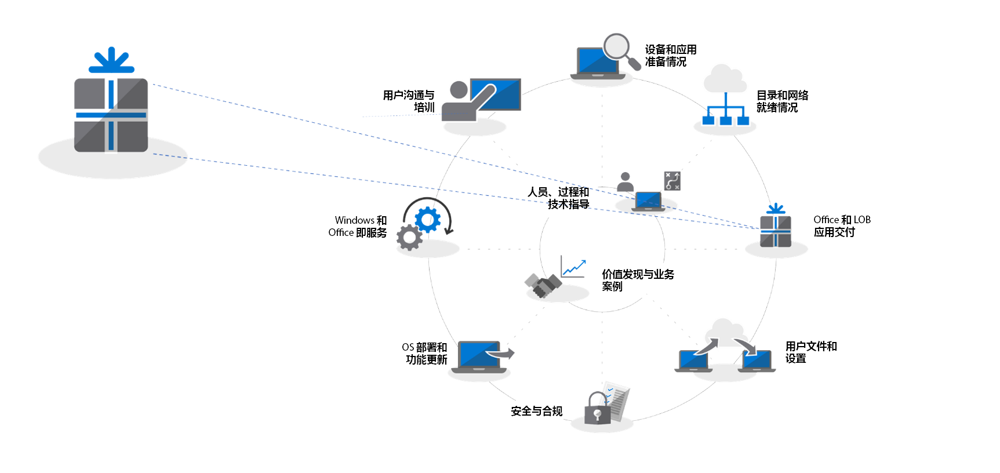
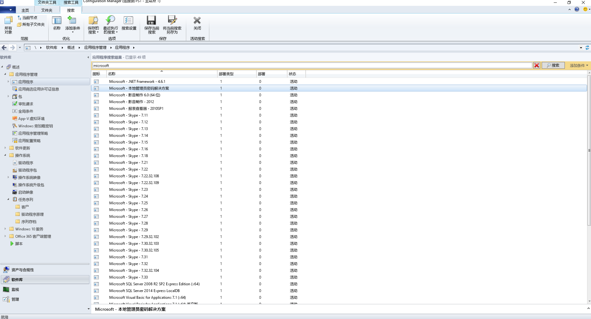
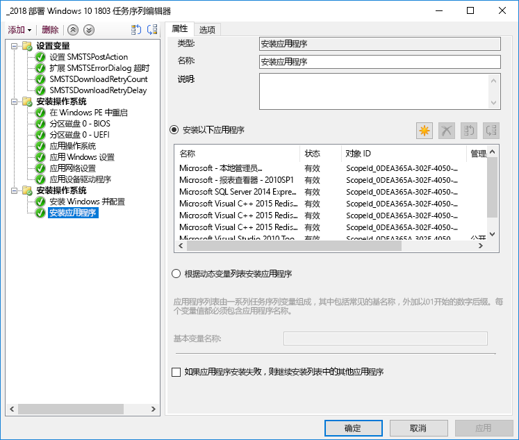

# 步骤 3：Office 和 LOB 应用交付Step 3: Office and LOB App Delivery

<table>
<thead>
<td></td>
<td>
<strong>步骤 3：Office 和 LOB 应用交付</strong><strong>Step 3: Office and LOB App Delivery</strong>

确保应用已打包，且可进行自动安装。了解如何使用 Office 365 专业增强版的即点即用打包，通过新方法来配置、交付和持续更新 Office 应用。Ensure your apps are packaged and ready for automated installation. Learn how Click-to-Run packaging with Office 365 ProPlus gives you new options to configure, deliver and keep your Office apps up-to-date.
</td>
<td></td>
</thead>
</table>

>[!NOTE]
>Office 和 LOB 应用交付是我们推荐的部署过程轮中的第三步，其中包括安装和管理 Office 和 LOB 的选项。Office and LOB App Delivery is the third step in our recommended deployment process wheel covering the options to install and manage Office and LOB. 为了成功部署，请不要跳过前两个步骤。For successful deployment do not skip the first two steps.  若要查看的完整桌面部署过程，请访问[桌面部署中心](https://aka.ms/HowToShift)。To see the full desktop deployment process, visit the [Desktop Deployment Center](https://aka.ms/HowToShift).
>

现在可以准备好交付 Office 和业务线应用了，可以通过很多方法执行此操作，包括一些令人欣喜不已的新选项。You are now ready to deliver Office and your Line of Business Apps and there are a number of ways to do this, including some exciting new options. 尽管某些应用程序仅提供 32 位或 64 位编译版本，但其他应用程序（如 Office 365 专业增强版）提供 32 位和 64 位本机编译代码，你要做出的最大决策就是选择要部署的版本。While some applications are only available as either a 32-bit or 64-bit compiled version, others such as Office 365 ProPlus, offer both as 32-bit and 64-bit native compiled code, and one of biggest decisions you will make is which version to deploy. 若要在新设备上利用额外的计算能力和 RAM，Microsoft 建议在没有 32 位依赖项时使用 64 位版本。To take advantage of additional compute power and RAM on new devices Microsoft recommends using the 64-bit version when there are no 32-bit dependencies. 若要确定任何与加载项或文件相关的兼容性挑战，建议在继续前重新访问步骤 1 设备和应用程序就绪情况。To determine any add-in or file-related compatibility challenges you may have it is recommended to revisit Step 1 Device and App Readiness before you continue.

如果没有任何障碍，我们建议部署 64 位版本的所有应用，包括 Microsoft Office。64 位本机编译应用提供最佳性能，并且是最经得起未来考验的选择。If nothing is blocking you, we recommend you deploy 64-bit versions of all apps, including Microsoft Office. 64-bit native compiled apps offer the best performance and is the most future-proof choice.

在 Windows 上安装应用有很多方法和模型，让我们看看你的交付选项。There are many methods and models for installing apps on Windows, so let’s look at your delivery options.

[Windows 10 应用程序管理Windows 10 application management](https://docs.microsoft.com/zh-CN/windows/application-management/)

## 基于 MSI 的部署MSI-based Deployments

对于业务线应用，你可能会使用基于 MSI 的包或可执行文件，并将应用程序安装为 OS 部署任务序列的一部分。For your line of business apps, you’ll probably use MSI-based packages or executable  and install apps as part of an OS deployment task sequence. Windows 10 会继续使用这些包。Windows 10 continues to work with these packages.

像 System Center Configuration Manager 和 Microsoft Intune 这样的软件部署工具也会被优化以交付 MSI 打包的应用。一旦在 Windows 10 上验证了应用，就可以使用 System Center Configuration Manager (Current Branch) 来交付应用。如果使用 Microsoft Intune 的公司门户，可以扩展可供组织使用的 IT 认可的应用选择，以包括最新应用程序，并且用户可以自行选择他们需要的应用。Software deployment tools like System Center Configuration Manager and Microsoft Intune are also optimized to deliver MSI-packaged apps. Once you have validated your apps on Windows 10, you can use System Center Configuration Manager (current branch) for app delivery. If you use the Company Portal in Microsoft Intune you can extend the choice of IT sanctioned apps available to your organization to include the latest applications, and users to self-select what they need.

## 电脑成像PC Imaging

应用交付另一个热门方法是电脑成像。Another popular method of app delivery is PC imaging. 在这种情况下，应用程序可以通过任务序列安装或在样本 PC 上手动安装，然后在预先安装必选应用程序的情况下捕获系统映像。In this case, applications are either installed via task sequence or manually on a sample PC, then a system image is captured with the required applications pre-installed. 构建和捕获的成像方法可以在配置新 PC 时节省时间，但请记住图像中的操作系统和应用程序可能会很快变得陈旧。The imaging approach to build and capture can save time when provisioning new PCs but remember operating systems and apps within the image can become stale quickly. Windows 10 和 Office 365 专业增强版中的累积更新模型可帮助解决此问题，但并未完全消除此问题。The Cumulative Update model in Windows 10 and Office 365 ProPlus help with this problem, but doesn’t eliminate it completely. 这就是为什么我们建议使用精简映像方法，这样可以在部署时间从映像外部安装应用程序。This is why we recommend a thin image approach, where your applications are installed from outside the image at deploy time.

如果你想在映像中包含 Office 365 专业增强版，请记住，此操作使用基于用户的激活；系统管理员不能预先将其激活。使用 Office 部署工具在正在成像的设备上预安装 Office，并跳过用户登录。If you do want to include Office 365 ProPlus in your image, remember that this uses a user-based activation; it cannot be pre-activated by the system admin. Use the Office Deployment Tool to pre-install Office on the device you are imaging and skip the user sign-in. 部署映像后，最终用户可以使用其 Office 365 凭据登录并激活 Office 365 专业增强版。Once the image is deployed end users can sign-in using their Office 365 credentials and activate Office 365 ProPlus.

[创建安装操作系统的任务序列Create a Task Sequence to Install an Operating System](https://docs.microsoft.com/zh-CN/sccm/osd/deploy-use/create-a-task-sequence-to-install-an-operating-system)

[将 Office 365 专业增强版部署为操作系统映像的一部分Deploy Office 365 ProPlus as part of an operating system image](https://docs.microsoft.com/zh-CN/deployoffice/deploy-office-365-proplus-as-part-of-an-operating-system-image)

## Office 即点即用Office Click-to-Run 

使用即点即用安装 Office 365 专业增强版，在即将推出的 Office 2019 for Windows 发行版的每个版本中，即点即用会替换基于 MSI 的打包。Office 365 ProPlus is installed using Click-to-Run, and Click-to-Run replaces MSI-based packaging in every version of the upcoming Office 2019 release for Windows. 它带来了许多优点，包括更快的安装、更快且更有效的更新以及更清晰的卸载。It brings with it a number of advantages, including faster installations, faster and more efficient updating, and cleaner uninstallation. 

通过即点即用提供的程序在计算机上的虚拟应用程序环境中执行，因此可以与其他应用程序共存而不会发生冲突；它们作为基于 MSI 的软件包也占用了大约一半的磁盘空间。Programs delivered via Click-to-Run execute in a virtual application environment on your computer and so co-exist with other applications without conflict; they also take about half the disk space they would as an MSI-based package. Office 应用程序通过 [Office 部署工具](https://www.microsoft.com/en-us/download/details.aspx?id=49117)进行交付和管理，该工具是下载、配置和自定义 Office 应用程序所需的 Office 安装引擎。Office applications are delivered and managed via the [Office Deployment Tool](https://www.microsoft.com/en-us/download/details.aspx?id=49117) which is the Office setup engine needed to download, configure, and customize your Office apps. Office 部署工具读取配置 XML 文件，该文件提供有关如何配置和自定义 Office 安装的元数据说明。The Office Deployment Tool reads a configuration XML file which provides the metadata instructions on how to configure and customization your Office installation.

Microsoft 建议使用 [Office 自定义工具](https://config.office.com/)自定义部署设置并创建配置 XML 文件。Microsoft recommends using the [Office Customization Tool](https://config.office.com/) to customize your deployment settings and create your configuration XML file. 通过 Office 自定义工具，你可以设置要安装的应用程序和语言、应用程序的更新方式、应用程序首选项以及安装体验设置。Through the Office Customization Tool you can set which applications and languages will be installed, how the applications will be updated, application preferences, and installation expereince settings.

如果使用 System Center Configuration Manager，仍然可以使用它来广泛部署 Office 365 专业增强版。System Center Configuration Manager (Current Branch) 为更新的 Office 自定义工具、安装时的即点即用包自定义，以及软件更新管理后安装提供本机支持。If you use System Center Configuration Manager, you can still use it for broad deployment of Office 365 ProPlus. System Center Configuration Manager (current branch) has native support for the updated Office Customization Tool, package customization for Click-to-Run at install time, and native support for software update management post installation.

[Office 365 专业增强版部署指南Deployment Guide for Office 365 ProPlus](https://docs.microsoft.com/zh-CN/deployoffice/deployment-guide-for-office-365-proplus)

[在升级到 Office 365 专业增强版时删除 Office 的现有 MSI 版本Remove existing MSI versions of Office when upgrading to Office 365 ProPlus](https://docs.microsoft.com/zh-CN/deployoffice/upgrade-from-msi-version)

[使用 Configuration Manager 管理 Office 365 专业增强版Manage Office 365 ProPlus with Configuration Manager](https://docs.microsoft.com/zh-CN/sccm/sum/deploy-use/manage-office-365-proplus-updates)

[使用 Microsoft Intune 将 Office 365 应用分配到 Windows 10 设备Assign Office 365 apps to Windows 10 devices with Microsoft Intune](https://docs.microsoft.com/zh-CN/intune/apps-add-office365)

## 基于浏览器的应用程序Browser-based Apps

为了确保基于浏览器的应用程序能够像预期那样继续工作，需注意一些事项。如果你有特定的网站和应用，你知道它们与 Microsoft Edge 存在兼容性问题，则可以使用企业模式网站列表，这样网站就会使用 Internet Explorer 11 自动打开。There are a few things to consider in order to make sure that your browser-based applications continue to work as expected. If you have specific web sites and apps that you know have compatibility problems with Microsoft Edge, you can use the Enterprise Mode site list so that the web sites will automatically open using Internet Explorer 11.

此外，如果你知道内部网站不能正常使用 Microsoft Edge，则可以设置所有内部网站自动使用 Internet Explorer 11 打开。该过程使用 XML 文件来管理 IE11 是否用于每个网站，使用组策略来强制实施设置。Additionally, if you know that your intranet sites aren't going to work properly with Microsoft Edge, you can set all intranet sites to open using Internet Explorer 11 automatically. This process uses an XML file to govern whether IE11 is used for each site, using Group Policy to enforce settings.

[什么是企业模式What is Enterprise Mode](https://docs.microsoft.com/zh-CN/internet-explorer/ie11-deploy-guide/what-is-enterprise-mode#what-is-enterprise-mode)

到目前为止，我们已经介绍了众所周知的部署方法。So far, we have covered well known deployment methods. 但是，你可能希望考虑两种新的应用程序部署方法。But there are two new approaches to app deployment you may wish to consider.

## 适用于企业的 Microsoft StoreMicrosoft Store for Business 

Microsoft Store for Business 提供了一种灵活的方式，可以大规模地发现、获取、管理和分发 Windows 10 设备的免费和付费应用程序。Microsoft Store for Business provides a flexible way discover, acquire, manage, and distribute free and paid apps to Windows 10 devices at scale. 作为 IT 管理员，你可以根据需要分配和重新使用许可证的同时，将所选的 Microsoft Store 应用程序以及自定义的应用程序发布到自己的私人商店。As an IT admin, you can publish selected Microsoft Store apps, along with your custom own apps, to your own private store while assigning and re-using licenses as needed. 你的用户仅定向到此商店，因此只能查找和安装已批准的应用。Your users are directed to this store only, and so can only find and install approved apps.

应用商店应用可以在本机构建为 UWP 应用，也可以使用桌面桥重新打包应用商店的现有应用，并为 Windows 10 添加新式体验。除了你用来增强 Windows 10 体验的代码之外，应用程序保持不变，并继续以完全信任的用户模式运行。Store apps can be natively built as UWP apps or you can use the Desktop Bridge to repackage your existing apps for the Store and add modern experiences for Windows 10. Aside from the code that you use to light up Windows 10 experiences, your app remains unchanged and continues to run in full-trust user mode.

## MSIX 集装化MSIX Containerization

应用程序包装新选项是 MSIX。A new option for application packaging is MSIX. MSIX 使用 Windows 中提供的集装化技术，汇集了即点即用、UWP 和 MSI 包装的最佳方面。MSIX uses the containerization technology available in Windows, bringing together the best aspects of Click-to-Run, UWP and MSI packaging. 借助工具将现有安装程序（如 EXE、MSI、APPV 和 APPX）直接迁移到 MSIX，我们可以看到 MSIX 集装化为当今使用的众多安装技术提供了统一的路径。With tools to migrate existing installers like EXE, MSI, APPV and APPX directly to MSIX we see MSIX Containerization provides a unifed path for the many installation technologies in use today. MSIX 支持包含在当前版本的 Windows 中：运行 Windows 10 RS5 或更新版本的任何设备都包含安装和运行 MSIX 打包应用程序所需的一切。MSIX support is included in current versions of Windows: any device running Windows 10 RS5 or newer includes everything you need to install and run MSIX packaged apps. Windows 10 动态集成了它接收的 MSIX 容器，同时使应用程序与操作系统分离。Windows 10 dynamically integrates MSIX containers it receives, while keeping the applications separate from the operating system.

集装化指的是完全卸载和删除包，不像今天的许多 MSI 和基于 EXE 的包，它们可能会在系统上有残留项。它还意味着只需要标准的用户凭证即可安装应用程序 - 不需要使用管理员凭证来安装 MSIX 容器。此外，MSIX 容器的更新效率更高。当更新发布时，使用块级别差异意味着只应用新的二进制文件，从而减少更新有效负载，以便实现更快部署而减少网络带宽的使用。Containerization means clean uninstall and removal of packages, unlike a lot of MSI and EXE-based packages today that may leave items on the system. It also means only needing Standard User credentials to install applications – you do not have to have Administrator credentials to install MSIX containers. MSIX containers are more efficient to update too. When an update is published, use of block level differentials means only net new binaries are applied, reducing the update payload, for faster deployments consuming less network bandwidth.

有关 MSIX 的详细信息，请访问 [MSIX 技术社区网站](https://techcommunity.microsoft.com/t5/MSIX/ct-p/MSIX)You can find more information on MSIX via the [MSIX Tech Community site](https://techcommunity.microsoft.com/t5/MSIX/ct-p/MSIX)

## 后续步骤Next Step

## [步骤 4：用户文件和设置Step 4: User Files and Settings](https://aka.ms/mdd4)

## 上一步Previous Step

## [步骤 2：目录和网络就绪情况Step 2: Directory and Network Readiness](https://aka.ms/mdd2) 