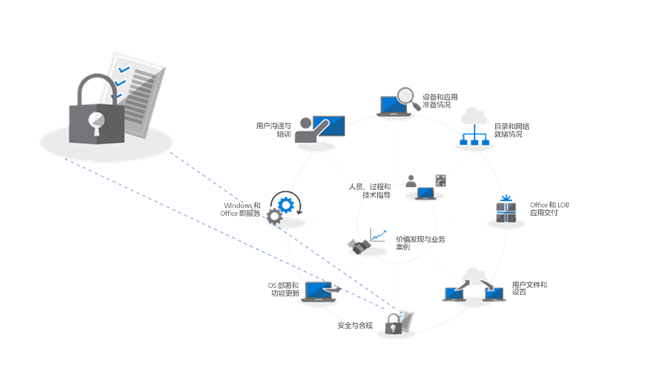

# 步骤 5：安全性和合规性注意事项

<table>
<thead>
<td></td>
<td>
<strong>步骤 5：安全性和合规性注意事项</strong>

使用 Windows 10 和 Office 365 专业增强版，可通过新方法来保护数据、设备和用户，并快速检测和响应威胁。此外，还请了解在迁移到 Windows 10 时，如何处理与磁盘加密、防恶意软件应用和策略相关的常见问题。
</td>
<td></td>
</thead>
</table>

>[!NOTE]
>安全性和合规性是我们涉及 Windows 10 和 Office 365 专业增强版安全性和合规性注意事项的建议部署过程的第五个步骤。 若要查看的完整桌面部署过程，请访问[桌面部署中心](https://aka.ms/HowToShift)。
>

在从以前版本的 Windows 和 Office 迁移时，是时候查看作为 Windows 10 和 Office 365 专业增强版部署的一部分的面向新的安全性和合规性功能的选项，并查看注意事项和常见障碍。 仅 Windows 10 中的许多安全相关功能就在推动向更新平台迁移。 另外，与 Office 365 云服务和 Azure Active Directory 标识选项集成，可以为数据、设备和用户提供持续更新的新保护。

## 克服潜在的安全性相关的部署障碍

在介绍迁移到 Windows 10 和 Office 365 专业增强版并将这些体验连接到云时可以添加的新功能之前，先来看看可能会经常中断部署过程的一些趋势。

### 磁盘加密

可能遇到的第一个初始挑战是硬盘加密。许多硬盘加密解决方案无法轻松地从以前版本的 Windows 升级到较新版本的 Windows。

使用某些磁盘加密解决方案，可以在某些版本的平台上使用 Windows 安装程序的“/reflectdrivers”选项时执行升级，但其他版本可能要求在部署之前解密驱动器，然后在安装 Windows 10 后重新加密。另外，部分解决方案不允许使用传统 BIOS 从主启动记录 (MBR) 迁移到 UEFI 所需的 GUID 分区表 (GPT)。这一点很重要，因为 Windows 10 中基于虚拟化的新安全功能需要 64 位版本且带 UEFI 的 Windows 10，下面将对此进行说明。

解决这些问题的一种方法是在 Windows 10 中使用 BitLocker，它包含在 Windows 10 专业版和更高版本中。使用 BitLocker 可以在此过程中暂停对 OS 升级和功能更新的保护。

  [Bitlocker 基本部署](https://docs.microsoft.com/zh-CN/windows/security/information-protection/bitlocker/bitlocker-basic-deployment)

### 防病毒和反恶意软件应用程序兼容性

其次，虽然我们已经看到 Windows 7 和 Windows 10 之间超过 [99% 的 Windows 应用程序具有兼容性](https://www.microsoft.com/en-us/microsoft-365/blog/2018/09/06/helping-customers-shift-to-a-modern-desktop/)，但防病毒 (AV) 应用或虚拟专用网络 (VPN) 客户端通常属例外情况。这些应用程序通常使用未记录的方式实现非标准开发实践和 API，从而保护你的系统或将你连接到网络资源。

因此，当转换到新版本的 Windows 时，这些应用本质上不怎么发生变化。如果你的 AV 或 VPN 软件在 Windows 10 中或升级后无法运行，修复方法通常是使用 Windows 10 上经测试受支持的内容替换你正在使用的应用。

### 安全策略

用于旧版 Windows 和 Office 的 Active Directory 组策略设置可能无法直接转换为 Windows 10 和 Office 365 专业增强版，并且对更新的安全性和合规性功能有不同的注意事项。最好使用 Microsoft Security Compliance Toolkit 获取当前版本的 Windows 和 Office 的安全策略基准。另外，作为 Microsoft Intune 的一部分，值得研究移动设备管理策略。

## 

## Microsoft 365 新安全性和合规性

下面介绍在推进当前保护时的注意事项以及在迁移之前要注意的事项。现在我们来看看在从 EMS 及更高版本迁移到 Windows 10、Office 365 专业增强版和基于云的选项时可以利用的新功能。

### 身份和访问管理

首先是身份和访问管理。Azure Active Directory 是适用于应用、设备和云服务的身份控制平台，也是连接 Office 365 和其他云服务的新式方式。使用条件访问可以根据登录的位置、正在使用的设备以及异常行为等内容定义不同的身份验证要求。

生物识别技术可以在设备级别提供唯一标识符，帮助你在朝着消除密码的目标迈进时实现更简单、更安全地访问设备和应用。Windows Hello 提供基于设备的多重身份验证。它依赖于设备本身、你的 PIN 或唯一生物识别标识符（例如，你的面部或指纹），可以通过策略强制执行。

  [Azure 身份管理基础知识](https://docs.microsoft.com/zh-CN/azure/active-directory/fundamentals/identity-fundamentals)

  [了解 Azure 标识解决方案](https://docs.microsoft.com/zh-CN/azure/active-directory/fundamentals/understand-azure-identity-solutions)

  [Azure Active Directory 条件访问](https://docs.microsoft.com/zh-CN/azure/active-directory/conditional-access/overview)

  [Windows Hello 企业版](https://docs.microsoft.com/zh-CN/windows/security/identity-protection/hello-for-business/hello-identity-verification)

### 基于虚拟化的安全性

现在，除了身份之外，还可以针对已知威胁和未知威胁启用持续保护，为此，Windows 10 使用起核心作用的基于虚拟化的安全性，通过安全启动确保启动完整性和代码完整性。我们还可以通过保持独立于 Windows 的用户机密来帮助借助 Credential Guard 阻止凭据窃取。此外，应用程序防护可以通过在隔离容器中运行浏览器来隔离和缓解基于浏览器的威胁。所有这些技术都使用 Windows 10 基于虚拟化的安全性，并且是无法在 Windows 7 系统上复制的基础更改。请注意，这些功能也需要带 UEFI 的 64 位 Windows 和 SLAT 的虚拟化扩展支持（硬件级别）。

  [有关基于虚拟化的安全性的详细信息](https://docs.microsoft.com/zh-CN/windows-hardware/design/device-experiences/oem-vbs)

### 云服务的安全增强功能

云服务提供另一层可选保护以提高 Windows 和 Office 安全性。这些可以为你提供新级别的始终实时控制，可以即时检测、抵制和响应新的攻击和攻击类型，在与响应和更新部署时间本身就更慢的传统软件更新和 AV 签名文件相比之下，这些作用尤为显著。

借助 Microsoft Intelligent Security Graph，可以更快速地访问来自新出现的威胁的信息和保护。可以借助下面的一些示例开始使用 Office。

  **
  [数据丢失防护](https://docs.microsoft.com/zh-CN/office365/securitycompliance/data-loss-prevention-policies)** 内置于 Office 365 专业增强版中，可帮助在检测到信用卡或标识号等高风险内容时通知用户相关的安全策略。通知用户后，策略可以通知或阻止发送和共享。

  **
  [Azure 信息保护](https://docs.microsoft.com/zh-CN/azure/information-protection/rms-client/client-admin-guide)** 是一项可与 Office 一起使用的补充服务，使用户能够轻松地对 Office 文件进行分类和标记。它可以触发对标记文件的自动操作，例如加密或锁定共享。

我们还在 Office 应用中引入了**[安全链接](https://docs.microsoft.com/zh-CN/office365/securitycompliance/atp-safe-links)** 保护，保护你免受已知恶意网站的动态列表的侵害。

此外，Outlook 中的**[安全附件](https://docs.microsoft.com/zh-CN/office365/securitycompliance/atp-safe-attachments)** 作为 Exchange Online 的一部分，不仅仅是通过电子邮件筛选来检查附件。如果识别出高风险附件，安全附件将通知用户已知的恶意附件并将其从电子邮件中删除。

  **
  [Office 365 邮件加密](https://docs.microsoft.com/zh-CN/office365/securitycompliance/encryption)** (OME) 也可用于保护发送的电子邮件和附件，确保只有目标收件人才能查看电子邮件内容。OME 与 Google、Yahoo 和 Microsoft 使用者帐户身份验证无缝协作，一次性密码使其他电子邮件服务的用户也可以安全地接收电子邮件。

#### 其他 Windows 10 保护

Windows 10 中的 **[Windows Defender 应用程序控制](https://docs.microsoft.com/zh-CN/windows/security/threat-protection/windows-defender-application-control/windows-defender-application-control)** 执行 Microsoft 已检查过安全性的已批准允许和拒绝应用程序列表，所有这些都使用 Microsoft Intune 通过终结点保护策略进行管理。

  **
  [Windows Defender 高级威胁防护](https://docs.microsoft.com/zh-CN/windows/security/threat-protection/windows-defender-atp/overview)** 是一个用于预防性保护、破坏后检测、自动调查和响应的统一平台。它可以保护终结点免受网络威胁；检测高级攻击和数据泄露，自动执行安全事件并改善安全状况。

  **
  [攻击防护](https://docs.microsoft.com/zh-CN/windows/security/threat-protection/windows-defender-exploit-guard/windows-defender-exploit-guard)** 通过阻止恶意软件进入 Windows 并阻止不受信任的进程访问受保护的文件夹，帮助减小运行应用程序的攻击面。

#### Microsoft Intune

  [Microsoft Intune](https://docs.microsoft.com/zh-CN/intune/introduction-intune) 作为基于云的管理服务，用于包括 IOS、Android 和 Windows 设备在内的移动应用场景，现在可以配置为共同管理，以补充和扩展由 System Center Configuration Manager 管理的特定工作负载的控件。这里涉及到一个优势：访问受保护资源的设备可能必须注册到设备管理（甚至是非托管、非加入域或非加入 Azure AD 的设备）。用户还可以在操作系统和应用程序级别利用粒度配置和符合性策略实施。可以使用 Microsoft Intune 集中配置应用程序策略和设置，并对 Windows 10 中的 Office 365 专业增强版和应用商店应用强制执行应用程序策略和设置。

## 后续步骤

## [步骤 6：OS 部署和功能更新](https://aka.ms/mdd6)

## 上一步 

## [步骤 4：用户文件和设置](https://aka.ms/mdd4)
