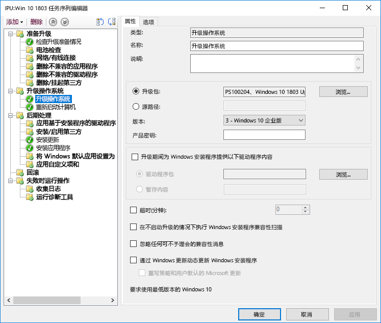

# 步骤 6：OS 部署和功能更新

<table>
<thead>
<td></td>
<td>
<strong>步骤 6：OS 部署和功能更新</strong>

基于任务序列的部署用于在裸机安装、电脑刷新和电脑更换情况下自动完成大规模的阶段性部署。升级任务序列还可帮助你及时了解主要的半年更新。Windows Autopilot 是新增的功能，可推进新电脑获取过程的现代化。
</td>
<td></td>
</thead>
</table>

>[!NOTE]
>“OS 部署和功能更新”是推荐的部署流程轮的第六步，涉及 Windows 10 OS 部署、升级和功能更新。 若要查看的完整桌面部署过程，请访问[桌面部署中心](https://aka.ms/HowToShift)。
>

如果一直按照部署流程轮执行至此，那么至少已部分完成了设备和应用准备步骤、准备了基础结构、配置和收集了应用包、制定了迁移用户文件和配置默认设置的计划，以及制定了保留现有安全控件和部署可能的新控件的计划。

现在，已经到了这样一个阶段：要将所有这些散碎内容整合到一起，以尽可能自动安装 Windows 10 和 Microsoft 365 企业应用版，以及必要的驱动程序、应用和所需的其他任何部件。

最后，衡量 OS 部署是否成功的最佳标准是满足用户期望并避免中断其工作。在此步骤中，你将开始测试并部署到试点用户，作为分阶段部署的一部分。此处需注意，在扩大部署范围前，需要跳至我们的部署过程上的步骤 8 – [用户通信和培训](https://aka.ms/mdd8)，以确保用户已了解即将发生的更改并为此做好准备，且可以使用分阶段部署，通过连续验证来衡量你的推出节奏。

## Windows 映像化过程

大多数组织使用电脑映像化过程来配置和捕获 Windows 克隆，其中包括一组基础的已安装的几个标准应用，或仅含有应用程序运行时和更新的更细化的映像。执行此操作的最佳方法是为此过程使用虚拟机，以避免任何意外的驱动程序相关的兼容性问题和用于自动化。

如果使用映像捕获路由，最好尽可能自动化，以确保最佳映像质量和可重复的过程。对于大多数部署，也建议在捕获前在 Windows 映像中最大程度减少自定义和预安装的应用。这是所谓的“细化图像”方法，该方法可通过消除映像内的应用数量来节省网络上的整体带宽。通过从细化基础映像开始，可以根据用户需求来灵活定制所需应用、语言和配置的分层。

在生成和捕获过程中，Microsoft Endpoint Configuration Manager（当前分支版本）和 Microsoft Deployment Toolkit 等工具使用系统准备工具（或 Sysprep）和“Generalize”命令在将 Windows 10 安装作为映像捕获前封装你的映像。

捕获的映像将具有 Windows 映像（或 WIM），格式类似于标准 Windows 安装介质。具有自定义 WIM 文件后，可以使用其他任务序列作为 Configuration Manager 或 Microsoft Deployment Toolkit 中的 OS 部署的一部分，以便在应用 Windows 映像前后执行部署相关的任务、应用映像和运行任务。

[创建 Windows 10 引用映像](https://docs.microsoft.com/windows/deployment/deploy-windows-mdt/create-a-windows-10-reference-image)

[创建安装操作系统的任务序列](https://docs.microsoft.com/configmgr/osd/deploy-use/create-a-task-sequence-to-install-an-operating-system)

### 部署类型

自定义映像准备就绪后，安装或迁移类型将分为以下类别：

  - 首先，**裸机部署**。这是用于将映像部署到清理磁盘，或对不想保留磁盘上的任何数据的电脑重新映像的方案。

  - 其次，与裸机类似，是**计算机刷新**，关键区别是，用户状态仍保留在磁盘上\*或将在安装完成后被还原

  - 最后是**计算机替换**。顾名思义，你将电脑替换为其他电脑。在这种情况下，通常会执行从第一台电脑到中央位置的用户文件的备份，然后将这些文件还原到第二台电脑。

以上这三种方案都有一个共同点，即它们都使用任务序列来运行，且可在每次运行时应用自定义映像。

[有关 Windows 10 部署方案的详细信息](https://docs.microsoft.com/windows/deployment/windows-10-deployment-scenarios)

### 使用任务序列自动化的就地升级

除了这些部署类型以外，在 Windows 10 中还提供了一个新的选项 Microsoft Endpoint Configuration Manager（当前分支版本）任务序列，以及使用升级任务序列的就地升级。

以前版本的 Windows 中的就地升级不需要使用任务序列，但在进行企业级部署时，建议使用此方法。就地升级不允许你使用应用程序应用自定义映像，但可以使用脱机服务更新默认的 install.wim。例如，在执行升级前，可确保已向其应用了最新的 Windows 更新。

就地升级使用 Windows 安装程序。安装程序引擎运行几个小型预安装检查，以查找已知的兼容性问题。它还会保留用户状态和应用程序，并仅删除与安装的 Windows 10 版本不兼容的部分。使用此选项，将保留以前安装的应用程序和用户状态。就地升级还允许你在需要时回滚到以前安装的 OS，以用于故障排除。

[使用 setup.exe 进行 Windows 10 预升级验证](https://blogs.technet.microsoft.com/mniehaus/2015/08/23/windows-10-pre-upgrade-validation-using-setup-exe/)

就地升级方案可用于从旧版 Windows 迁移到 Windows 10 和从旧版 Windows 10 升级。在 Windows 安装程序完成升级后，你的任务序列可以继续运行和升级 Office 等应用程序、替换驱动程序，以及应用个性化设置。同样，在执行升级前，可以使用升级任务序列来执行预安装任务或检查。

[使用 Configuration Manager 执行 Windows 10 的就地升级](https://docs.microsoft.com/windows/deployment/upgrade/upgrade-to-windows-10-with-system-center-configuraton-manager)

[在 Configuration Manager 中创建升级 OS 的任务序列](https://docs.microsoft.com/configmgr/osd/deploy-use/create-a-task-sequence-to-upgrade-an-operating-system)

### 分阶段部署

在计划部署时，你将面向计算机的裸机、刷新、替换和升级路径。在此方案中，建议的方法是对类似计算机集合使用分阶段部署。这样一来，可以在增加部署规模前验证兼容性、交付和自动化、用户验收、网络带宽使用量和其他因素。

### 建议使用的工具：Microsoft Endpoint Configuration Manager（当前分支版本）和 Microsoft Deployment Toolkit

无论选择哪种部署类型，你都想要确保对可预见部分和可重复部分执行自动化操作。Microsoft 提供使用自动化任务序列自动化 OS 部署的两种解决方案：

  - **[Microsoft Endpoint Configuration Manager](https://docs.microsoft.com/configmgr/core/understand/introduction)** (ConfigMgr) 提供内置操作系统部署功能，以实施软件分发和软件更新管理的功能。ConfigMgr 被所有规模的组织广泛使用，并支持所有四种 Windows 部署类型。（可选）可将 ConfigMgr 与 Microsoft Intune 集成，以便为部署和设备管理添加其他功能。

  - 另一个受欢迎的部署选项是免费的 **[Microsoft Deployment Toolkit](https://docs.microsoft.com/windows/deployment/deploy-windows-mdt/get-started-with-the-microsoft-deployment-toolkit)** (MDT)，它通常供小型和中型组织使用，以进行 OS 部署。这几乎对基础结构没有要求。MDT 与 Windows 部署服务 (WDS) 集成，以用于网络启动。它支持所有四种部署类型，并支持安装应用程序、驱动程序和设置。当然，MDT 甚至可以与 Configuration Manager 集成。

### Windows Autopilot

Windows 10 中提供的一个新选项是使用 Windows Autopilot 将新电脑配置为你的硬件刷新循环的一部分。 此处，可以与提供支持的硬件供应商协作，以自定义默认 Windows 安装体验 – 例如，消除呈现给用户的许可协议或诊断数据设置等选项。

然后，当用户使用其 Azure AD 凭据在安装期间登录到电脑时，设备将注册到 Microsoft Intune，这将接管部署过程并应用应用程序、软件更新配置和合规性策略。Windows Autopilot 也可选择阻止用户访问第一个会话，直到设置完成。

[Windows Autopilot 概述](https://docs.microsoft.com/windows/deployment/windows-autopilot/windows-10-autopilot)

[Windows Autopilot 先决条件](https://docs.microsoft.com/windows/deployment/windows-autopilot/windows-10-autopilot#prerequisites)

## 适用于企业的 Windows 更新的功能更新

适用于企业的 Windows 更新是一项免费服务，支持 IT 专业人员通过将设备直接连接到 Windows 更新服务，使 Windows 10 设备始终保持最新状态。 适用于企业的 Windows 更新可以通过组策略或通过 MDM 解决方案（如 Microsoft Intune）进行配置，并允许 IT 专业人员创建[部署环](https://docs.microsoft.com/windows/deployment/update/waas-deployment-rings-windows-10-updates)以验证新的内部版本。 它集成到现有管理工具中，如 Windows Server Update Services (WSUS)、Microsoft Endpoint Configuration Manager（当前分支版本）和 Microsoft Intune。 此外，适用于企业的 Windows 更新支持对等传送，以帮助优化带宽效率并减少网络拥塞。

有关适用于企业的 Windows 更新的详细信息，请查看以下文档：

- [使用适用于企业的 Windows 更新部署更新](https://docs.microsoft.com/windows/deployment/update/waas-manage-updates-wufb)
- [配置适用于企业的 Windows 更新](https://docs.microsoft.com/windows/deployment/update/waas-configure-wufb)
- [将适用于企业的 Windows 更新与现有管理工具集成](https://docs.microsoft.com/windows/deployment/update/waas-integrate-wufb)
- [使用组策略配置适用于企业的 Windows 更新](https://docs.microsoft.com/windows/deployment/update/waas-wufb-group-policy)
- [使用 Microsoft Intune 配置适用于企业的 Windows 更新](https://docs.microsoft.com/intune/windows-update-for-business-configure)

## 后续步骤 

## [步骤 7：Windows 和 Office 服务](https://aka.ms/mdd7)

## 上一步

## [步骤 5：安全性和合规性注意事项](https://aka.ms/mdd5)
