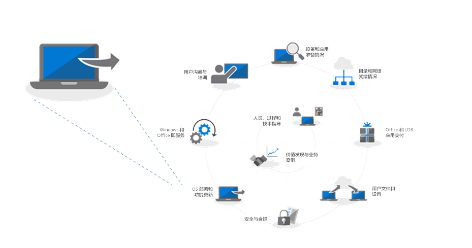
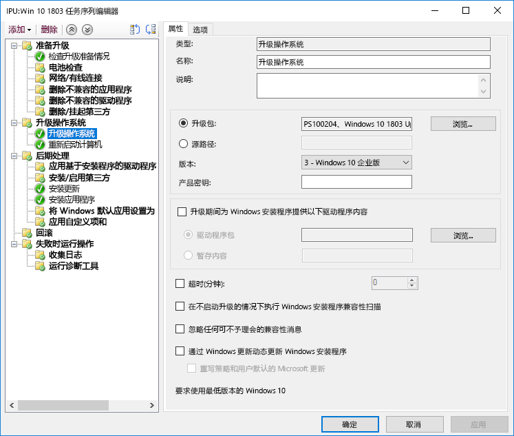
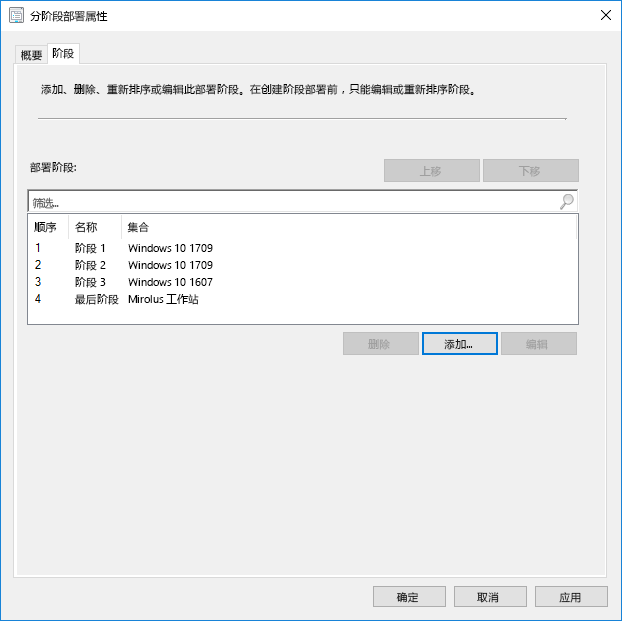
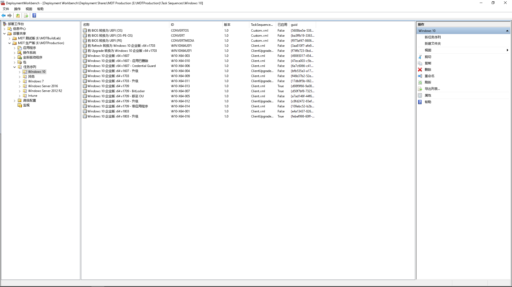

# 步骤 6：OS 部署和功能更新Step 6: OS Deployment and Feature Updates

<table>
<thead>
<td></td>
<td>
<strong>步骤 6：OS 部署和功能更新</strong><strong>Step 6: OS Deployment and Feature Updates</strong>

基于任务序列的部署用于在裸机安装、电脑刷新和电脑更换情况下自动完成大规模的阶段性部署。升级任务序列还可帮助你及时了解主要的半年更新。Windows Autopilot 是新增的功能，可推进新电脑获取过程的现代化。Task sequence-based deployment is used to automate large scale, phased deployment for bare metal installs, PC refresh and PC replacement. Upgrade task sequences will also help you stay current with major semi-annual updates. And Windows Autopilot is a recent addition that modernizes the new PC acquisition process.
</td>
<td></td>
</thead>
</table>

>[!NOTE]
>“OS 部署和功能更新”是推荐的部署流程轮的第六步，涉及 Windows 10 OS 部署、升级和功能更新。OS Deployment and Feature Updates is the sixth step in our recommended deployment process wheel covering Windows 10 OS deployment, upgrades and Feature Updates. 若要查看的完整桌面部署过程，请访问[桌面部署中心](https://aka.ms/HowToShift)。To see the full desktop deployment process, visit the [Desktop Deployment Center](https://aka.ms/HowToShift).
>

如果一直按照部署流程轮执行至此，那么至少已部分完成了设备和应用准备步骤、准备了基础结构、配置和收集了应用包、制定了迁移用户文件和配置默认设置的计划，以及制定了保留现有安全控件和部署可能的新控件的计划。If you’ve been following the deployment process wheel till now, you’ve at least partially completed the steps for device and app readiness, prepared your infrastructure, configured and collected app packages, have a plan in place for migrating user files and configuring default settings as well as have plans for retaining your existing security controls and perhaps deploying new ones.

现在我们到了要将所有这些部分集合到一起以尽可能自动化安装 Windows 10 和 Office 365 专业增强版（以及必要的驱动程序、应用和所需的其他任何部件）的阶段。Now we’ve arrived at the stage where you’re putting all these pieces together to automate as much as you can to install Windows 10 and Office 365 ProPlus, along with the necessary drivers, apps and whatever else is needed.

最后，衡量 OS 部署是否成功的最佳标准是满足用户期望并避免中断其工作。在此步骤中，你将开始测试并部署到试点用户，作为分阶段部署的一部分。此处需注意，在扩大部署范围前，需要跳至我们的部署过程上的步骤 8 – [用户通信和培训](https://aka.ms/mdd8)，以确保用户已了解即将发生的更改并为此做好准备，且可以使用分阶段部署，通过连续验证来衡量你的推出节奏。Ultimately, the best measure of success with an OS deployment is meeting user expectations and avoiding disruptions in their work. And in this step, you’ll start testing and deploying to pilot users as part of a phased deployment. And one tip here, before you broaden deployment, you’ll need to skip ahead to step 8 on our deployment process wheel – [User Communications and Training](https://aka.ms/mdd8) to make sure users are informed and prepared for changes coming their way and that you can measure your roll-out pace with continuous validation using Phased Deployment.

## Windows 映像化过程Windows Imaging Process

大多数组织使用电脑映像化过程来配置和捕获 Windows 克隆，其中包括一组基础的已安装的几个标准应用，或仅含有应用程序运行时和更新的更细化的映像。执行此操作的最佳方法是为此过程使用虚拟机，以避免任何意外的驱动程序相关的兼容性问题和用于自动化。Most organizations use the process of PC imaging to configure and capture a clone of Windows, including a base set of a few standard apps installed, or an even a thinner image with only application runtimes and updates. The best way to do this is using a virtual machine for this process to avoid any unexpected driver-related compatibility issues and for automation purposes.

如果使用映像捕获路由，最好尽可能自动化，以确保最佳映像质量和可重复的过程。对于大多数部署，也建议在捕获前在 Windows 映像中最大程度减少自定义和预安装的应用。这是所谓的“细化图像”方法，该方法可通过消除映像内的应用数量来节省网络上的整体带宽。通过从细化基础映像开始，可以根据用户需求来灵活定制所需应用、语言和配置的分层。If going the image capture route, it’s best to automate as much as possible to ensure the best quality image and a repeatable process. For most deployments, it is also recommended to put as little customization and pre-installed apps as possible in the Windows image prior to capturing. This is what is called a ‘thin image’ approach, which can save overall bandwidth on the network by eliminating the number of apps within the image. By starting with a thin base image, you can layer on required apps, languages and configurations dynamically tailored to users.

在生成和捕获过程中，System Center Configuration Manager (Current Branch) 和 Microsoft Deployment Toolkit 等工具使用系统准备工具（或 Sysprep）和“Generalize”命令在将 Windows 10 安装作为映像捕获前封装你的映像。During the build and capture process, tools like System Center Configuration Manager and the Microsoft Deployment Toolkit use the System Preparation Tool – or Sysprep – along with the “Generalize” command to reseal your image before they capture the Windows 10 installation as an image.

捕获的映像将具有 Windows 映像（或 WIM），格式类似于标准 Windows 安装介质。具有自定义 WIM 文件后，可以使用其他任务序列作为 System Center Configuration Manager 或 Microsoft Deployment Toolkit 中的 OS 部署的一部分，以便在应用 Windows 映像前后执行部署相关的任务、应用映像和运行任务。The captured image will have the Windows image – or WIM – format like standard Windows installation media. Once you have your custom WIM file, you can use another task sequence as part of your OS deployment in System Center Configuration Manager or Microsoft Deployment Toolkit to perform deployment-related tasks, to apply the image and run tasks before and after your Windows image is applied.

[创建 Windows 10 引用映像Create a Windows 10 Reference Image](https://docs.microsoft.com/zh-CN/windows/deployment/deploy-windows-mdt/create-a-windows-10-reference-image)

[创建安装操作系统的任务序列Create a Task Sequence to Install an Operating System](https://docs.microsoft.com/zh-CN/sccm/osd/deploy-use/create-a-task-sequence-to-install-an-operating-system)

### 部署类型Deployment Types

自定义映像准备就绪后，安装或迁移类型将分为以下类别：With your custom image ready, the installation or migration type will fall into the following categories:

  - 首先，**裸机部署**。这是用于将映像部署到清理磁盘，或对不想保留磁盘上的任何数据的电脑重新映像的方案。First, **bare metal deployment**. This is the scenario used to deploy an image to a clean disk, or to reimage a computer where you don’t intend to keep any of the data on the disk

  - 其次，与裸机类似，是**计算机刷新**，关键区别是，用户状态仍保留在磁盘上\*或将在安装完成后被还原And second, similar to bare metal, is **Computer Refresh,** with the key difference that user state remains on the disk\* or will be restored after the install is complete

  - 最后是**计算机替换**。顾名思义，你将电脑替换为其他电脑。在这种情况下，通常会执行从第一台电脑到中央位置的用户文件的备份，然后将这些文件还原到第二台电脑。And last is **Computer Replacement**. Here as the name implies, you are replacing a PC with another PC. In this case, there is often a backup of user files from the first PC to a central location, then a restore of those files to the second PC.

以上这三种方案都有一个共同点，即它们都使用任务序列来运行，且可在每次运行时应用自定义映像。All three of these scenarios have something in common, they use a task sequence to run, and a custom image can be applied each time.

[有关 Windows 10 部署方案的详细信息More About Windows 10 Deployment Scenarios](https://docs.microsoft.com/zh-CN/windows/deployment/windows-10-deployment-scenarios)

### 使用任务序列自动化的就地升级In-place Upgrade using Task Sequence Automation

除了这些部署类型以外，在 Windows 10 中还提供了一个新的选项 System Center Configuration Manager (Current Branch) 任务序列，以及使用升级任务序列的就地升级。In addition to these deployment types, there is a new option available now as a System Center Configuration Manager Task Sequence with Windows 10 – and in-place upgrade using the Upgrade Task Sequence.

以前版本的 Windows 中的就地升级不需要使用任务序列，但在进行企业级部署时，建议使用此方法。就地升级不允许你使用应用程序应用自定义映像，但可以使用脱机服务更新默认的 install.wim。例如，在执行升级前，可确保已向其应用了最新的 Windows 更新。In-place upgrades from a previous version of Windows do not require a task sequence, but it is a recommended approach when deploying at enterprise scale. An in-place upgrade does not allow you to apply a custom image with applications, but you can update the default install.wim using offline servicing. For example, you can to make sure it has the latest Windows updates applied prior to performing upgrades.

就地升级使用 Windows 安装程序。安装程序引擎运行几个小型预安装检查，以查找已知的兼容性问题。它还会保留用户状态和应用程序，并仅删除与安装的 Windows 10 版本不兼容的部分。使用此选项，将保留以前安装的应用程序和用户状态。就地升级还允许你在需要时回滚到以前安装的 OS，以用于故障排除。In-place upgrade uses windows setup. The setup engine runs several small pre-installation checks looking for known compatibility issues. It also preserves the user state and applications and only removes what isn’t compatible with the version of Windows 10 being installed. With this option, previously installed applications and user state are preserved. In-place upgrade also allows you to roll-back to the previous OS installed if needed for troubleshooting purposes.

[使用 setup.exe 进行 Windows 10 预升级验证Windows 10 Pre-Upgrade Validation Using setup.exe](https://blogs.technet.microsoft.com/mniehaus/2015/08/23/windows-10-pre-upgrade-validation-using-setup-exe/)

就地升级方案可用于从旧版 Windows 迁移到 Windows 10 和从旧版 Windows 10 升级。在 Windows 安装程序完成升级后，你的任务序列可以继续运行和升级 Office 等应用程序、替换驱动程序，以及应用个性化设置。同样，在执行升级前，可以使用升级任务序列来执行预安装任务或检查。The in-place upgrade scenario can be used to migrate to Windows 10 from legacy versions of Windows, as well as upgrade from previous versions of Windows 10. After Windows Setup completes the upgrade, your task sequence can continue to run and upgrade applications like Office, replace drivers, and apply personalization settings. Likewise, you can use the Upgrade Task Sequence to perform pre-installation tasks or checks prior to carrying out the upgrade.

[使用 Configuration Manager 执行 Windows 10 的就地升级Perform an in-place upgrade to Windows 10 using Configuration Manager](https://docs.microsoft.com/zh-CN/windows/deployment/upgrade/upgrade-to-windows-10-with-system-center-configuraton-manager)

[在 Configuration Manager 中创建升级 OS 的任务序列Create a task sequence to upgrade an OS in Configuration Manager](https://docs.microsoft.com/zh-CN/sccm/osd/deploy-use/create-a-task-sequence-to-upgrade-an-operating-system)

### 分阶段部署Phased Deployment

在计划部署时，你将面向计算机的裸机、刷新、替换和升级路径。在此方案中，建议的方法是对类似计算机集合使用分阶段部署。这样一来，可以在增加部署规模前验证兼容性、交付和自动化、用户验收、网络带宽使用量和其他因素。As you're planning your deployment, you'll be targeting computers for bare metal, refresh, replace and upgrade paths. The recommended approach in this case is to use phased deployment to collections of similar machines. This way, you can validate compatibility, delivery and automation, user acceptance, network bandwidth consumption, and other factors before increasing the scale of your deployment.

### 建议使用的工具：System Center Configuration Manager (Current Branch) 和 Microsoft Deployment ToolkitRecommended Tools: System Center Configuration Manager and the Microsoft Deployment Toolkit

无论选择哪种部署类型，你都想要确保对可预见部分和可重复部分执行自动化操作。Microsoft 提供使用自动化任务序列自动化 OS 部署的两种解决方案：Regardless of the deployment type you choose, you’ll want to make sure it’s as automated as possible for predictability and repeatability. Microsoft offers two solutions to automate OS deployment using automated task sequences:

  - **[System Center Configuration Manager](https://docs.microsoft.com/zh-CN/sccm/core/understand/introduction)** (ConfigMgr) 提供内置操作系统部署功能，以实施软件分发和软件更新管理的功能。ConfigMgr 被所有规模的组织广泛使用，并支持所有四种 Windows 部署类型。（可选）可将 ConfigMgr 与 Microsoft Intune 集成，以便为部署和设备管理添加其他功能。**[System Center Configuration Manager](https://docs.microsoft.com/zh-CN/sccm/core/understand/introduction)** (ConfigMgr) provides built-in operating system deployment capabilities to complement its capabilities for software distribution and software update management. ConfigMgr is widely used by organizations of all sizes and supports all four Windows deployment types. Optionally, you can integrate ConfigMgr with Microsoft Intune to add additional capabilities for deployment and device management.

  - 另一个受欢迎的部署选项是免费的 **[Microsoft Deployment Toolkit](https://docs.microsoft.com/zh-CN/windows/deployment/deploy-windows-mdt/get-started-with-the-microsoft-deployment-toolkit)** (MDT)，它通常供小型和中型组织使用，以进行 OS 部署。这几乎对基础结构没有要求。MDT 与 Windows 部署服务 (WDS) 集成，以用于网络启动。它支持所有四种部署类型，并支持安装应用程序、驱动程序和设置。当然，MDT 甚至可以与 Configuration Manager 集成。And one other popular deployment option is the free **[Microsoft Deployment Toolkit](https://docs.microsoft.com/zh-CN/windows/deployment/deploy-windows-mdt/get-started-with-the-microsoft-deployment-toolkit)** (MDT) which is typically used by small and medium sized organizations for OS deployment. This requires very little infrastructure. MDT integrates with Windows Deployment Services (WDS) for network boot. It supports all four deployment types as well as installation of applications, drivers, and settings. And of course, MDT can even be integrated with Configuration Manager.

### Windows AutopilotWindows Autopilot

Windows 10 中提供的一个新选项是使用 Windows Autopilot 将新电脑配置为你的硬件刷新循环的一部分。A new option with Windows 10 is to configure new PCs as part of your hardware refresh cycle using Windows Autopilot. 此处，可以与提供支持的硬件供应商协作，以自定义默认 Windows 安装体验 – 例如，消除呈现给用户的许可协议或诊断数据设置等选项。Here you can work with supporting hardware vendors to customize the default Windows setup experience – for example by eliminating options presented to users, like Licensing Agreements or diagnostic data settings.

然后，当用户使用其 Azure AD 凭据在安装期间登录到电脑时，设备将注册到 Microsoft Intune，这将接管部署过程并应用应用程序、软件更新配置和合规性策略。Windows Autopilot 也可选择阻止用户访问第一个会话，直到设置完成。Then, when a user signs in to the PC during setup using their Azure AD credentials, the device enrolls into Microsoft Intune, which can then take over the deployment process and apply applications, software updates configurations and compliance policies. Windows Autopilot can also optionally prevent the user from accessing the first session until provisioning is complete.

[Windows Autopilot 概述Overview of Windows Autopilot](https://docs.microsoft.com/zh-CN/windows/deployment/windows-autopilot/windows-10-autopilot)

[Windows Autopilot 先决条件Windows Autopilot Prerequisites](https://docs.microsoft.com/zh-CN/windows/deployment/windows-autopilot/windows-10-autopilot#prerequisites)

## 适用于企业的 Windows 更新的功能更新Windows Update for Business for Feature Updates

适用于企业的 Windows 更新是一项免费服务，支持 IT 专业人员通过将设备直接连接到 Windows 更新服务，使 Windows 10 设备始终保持最新状态。Windows Update for Business is a free service that enables IT Pros to keep Windows 10 devices always up to date by directly connecting the devices to the Windows Update service. 适用于企业的 Windows 更新可以通过组策略或通过 MDM 解决方案（如 Microsoft Intune）进行配置，并允许 IT 专业人员创建[部署环](https://docs.microsoft.com/zh-CN/windows/deployment/update/waas-deployment-rings-windows-10-updates)以验证新的内部版本。Windows Update for Business can be configured via Group Policy or through MDM solutions such as Microsoft Intune and allows IT Pros to create [deployment rings](https://docs.microsoft.com/zh-CN/windows/deployment/update/waas-deployment-rings-windows-10-updates) to validate new builds. 它集成到现有管理工具中，如 Windows Server Update Services (WSUS)、System Center Configuration Manager (Current Branch) 和 Microsoft Intune。It is integrated into existing management tools such as Windows Server Update Services (WSUS), System Center Configuration Manager (current branch), and Microsoft Intune. 此外，适用于企业的 Windows 更新支持对等传送，以帮助优化带宽效率并减少网络拥塞。Additionally, Windows Update for Business supports peer-to-peer delivery to help optimize bandwidth efficiency and reduce network congestion.

有关适用于企业的 Windows 更新的详细信息，请查看以下文档：For more detailed information on Windows Update for Business please review the following documentation:

- [使用适用于企业的 Windows 更新部署更新Deploy Updates Using Windows Update for Business](https://docs.microsoft.com/zh-CN/windows/deployment/update/waas-manage-updates-wufb)
- [配置适用于企业的 Windows 更新Configure Windows Update for Business](https://docs.microsoft.com/zh-CN/windows/deployment/update/waas-configure-wufb)
- [将适用于企业的 Windows 更新与现有管理工具集成Integrate Windows Update for Business with Existing Management Tools](https://docs.microsoft.com/zh-CN/windows/deployment/update/waas-integrate-wufb)
- [使用组策略配置适用于企业的 Windows 更新Use Group Policy to configure Windows Update for Business](https://docs.microsoft.com/zh-CN/windows/deployment/update/waas-wufb-group-policy)
- [使用 Microsoft Intune 配置适用于企业的 Windows 更新Use Microsoft Intune to configure Windows Update for Business](https://docs.microsoft.com/zh-CN/intune/windows-update-for-business-configure)

## 后续步骤Next Step 

## [步骤 7：Windows 和 Office 服务Step 7: Windows and Office Servicing](https://aka.ms/mdd7)

## 上一步Previous Step

## [步骤 5：安全性和合规性注意事项Step 5: Security and Compliance Considerations](https://aka.ms/mdd5)