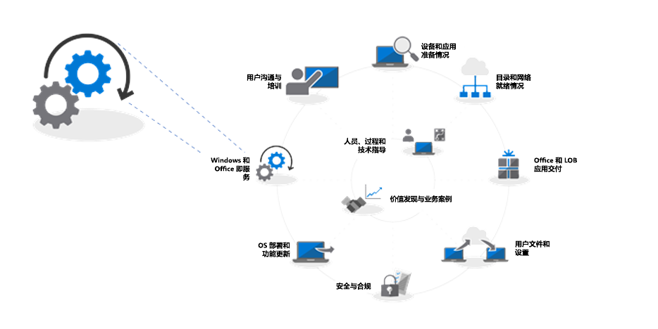
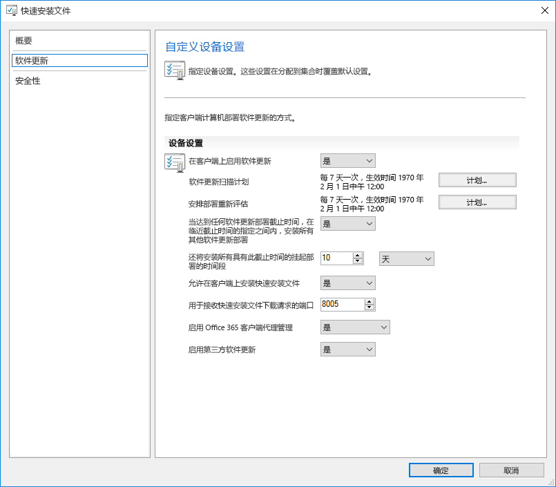
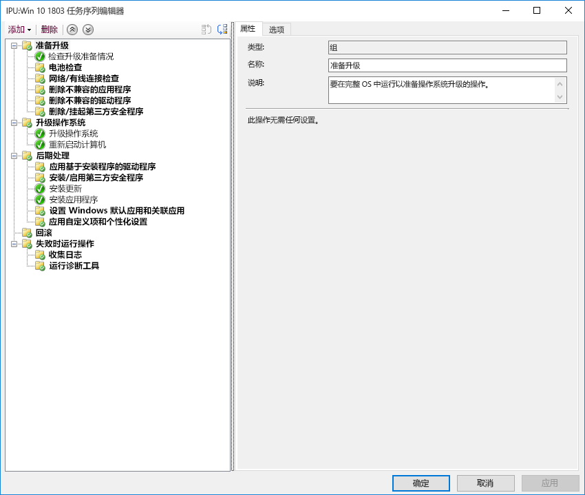

# 步骤 7：Windows 和 Office 服务Step 7: Windows and Office Servicing

<table>
<thead>
<td></td>
<td>
<strong>步骤 7：Windows 和 Office 服务</strong><strong>Step 7: Windows and Office Servicing</strong>

Windows 10 和 Office 365 专业增强版都会不断添加新功能，以利用最新的创新来不断提升用户体验和安全性。请了解如何及时获得最新的半年和每月更新、新服务模式的工作原理以及你所拥有的工具和选项。Both Windows 10 and Office 365 ProPlus continually add new capabilities to keep bringing user experiences and security forward with the latest innovations. Learn how to stay current with semi-annual and monthly updates, how the new servicing model works and the tools and options you have.
</td>
<td></td>
</thead>
</table>

>[!NOTE]
>Windows 和 Office 服务是我们建议部署过程轮的第七步，其中涉及正在计划的准备半年功能更新的各个方面。。Windows and Office Servicing is the seventh step in our recommended deployment process wheel covering the planning aspects of preparing for semi-annual updates to features. 若要查看完整的桌面部署过程，请访问[桌面部署中心](https://aka.ms/HowToShift)。To see the full desktop deployment process, visit the [Desktop Deployment Center](https://aka.ms/HowToShift).
>

Windows 10 和 Office 365 专业增强版都引入了新的服务选项、支持模型和更新时间线。Both Windows 10 and Office 365 ProPlus introduce new servicing options, support models, and update timelines. 这些更改简化了保持最新功能的过程。These changes simplify the process for staying current on the latest features. 除了这些更新之外，还提供了新的配置选项，以支持满足你需求的服务计划。Along with these updates are new configuration options to enable servicing plans that meet your needs. 了解如何准备半年频道更新，在 Windows 10 和 Office 365 专业增强版中提供新特性和功能，并利用 System Center Configuration Manager (当前分支版本) 中的新功能。Let's learn how to prepare for semi-annual channel updates offering new features and capabilities in Windows 10 and Office 365 ProPlus while leveraging new features within System Center Configuration Manager (Current Branch).

[帮助客户转向 Windows 10 和 Office 365 专业增强版Helping customers shift to Windows 10 and Office 365 ProPlus](https://www.microsoft.com/microsoft-365/blog/2018/09/06/helping-customers-shift-to-a-modern-desktop/)

## 更新类型Update Types

更新分为两个主要类别：功能更新，然后是质量和安全更新，其中包含累积安全性、可靠性和 bug 修复。Updates fall into two main categories, feature updates and then quality and security updates which contain cumulative security, reliability and bug fixes. 在频率方面，Windows 和 Office 都提供了一个半年频道，在每年的 3 月和 9 月发布两次新功能，而质量和安全更新则是每月发布一次。In terms of cadence both Windows and Office deliver a semi-annual channel which delivers new features twice per year around March and September while quality and security Updates occur Monthly. 此外，Office 365 应用的独特之处在于，我们提供完全支持的每月频道更新，同时包含新功能和质量更新。Additionally, unique to Office 365 applications, we offer a fully-supported Monthly Channel option where updates contain both new features and quality updates.

如果你习惯了桌面 OS 和应用更新之间的更长的周期，你可能会思考；If you’re used to a longer cycle between desktop OS and app updates, you might be wondering;

  - 更新是否兼容？Will the updates be compatible?

  - 我需要继续对用户进行重新培训吗？Will I need to keep retraining my users?

  - 有哪些风险？And what are the risks?

为了回答这些问题以及更频繁地交付新功能的基本原理，我们将阐明此方法的一些优点To answer those questions and the rationale for delivering new capabilities more frequently, we’ll some of the advantages of this approach

### 功能更新优势Feature Update Benefits

首先，我们已经弃用了过去的模式，该模式每三年会引发一波巨大的变革浪潮，而现在每年进行两次功能更新，每次更新的增量变化较小。为什么？除了快速演进的安全威胁之外，技术趋势也在快速发展，此做法将保持最新的体验和防护状态。例如，一些与安全相关的更新无法仅通过每月安全更新或反病毒签名文件来提供；它们可能是低级别的变更平台，比如基于虚拟化的安全性。First, we’ve moved away from the model of the past that would introduce huge waves of change around every three years to now incremental smaller changes with feature updates twice per year. Why? With technology trends moving so fast in addition to rapidly evolving security threats, this keeps experiences and protections current. Some of the security related updates for example can’t just be delivered by monthly security updates or antivirus signature files; they may be low-level changes platform, like virtualization-based security.

[Windows 即服务的快速指南Quick guide to Windows as a service](https://docs.microsoft.com/windows/deployment/update/waas-quick-start)

[通过使用 Windows 10 安全功能来缓解威胁Mitigate threats by using Windows 10 security features](https://docs.microsoft.com/windows/security/threat-protection/overview-of-threat-mitigations-in-windows-10%20%20)

### 累积更新模型优势Cumulative Update Model Benefits

第二次交付质量和安全更新作为一个累积的更新包修正了过去的许多问题。过去，每月你可能有时会从十几个或更多更新中针对 Windows 和 Office 进行选择。正如你所能想象的，这将创建一个几乎不可能的支持测试矩阵集。另外，如果安装的 Windows 或 Office 版本是一年前或更旧的版本，可能需要几个小时甚至几天的时间来应用自该版本发布以来交付的所有更新。Second delivering quality and security updates as a cumulative update package corrects many of the issues of the past. It used to be that you might pick and choose sometimes from a dozen updates or more each month for both Windows and Office. As you can imagine, this creates a nearly impossible set of test matrices for support. Also, if you install a version of Windows or Office that is a year or more old, it might take hours or sometimes days to apply all updates delivered since that version was released.

有了累积模型，你所获得的更新始终次于最新更新，为此你需要部署的每月更新的数量就会减少。每个更新都建立在前几个月的更新之上，并且包含全部所需的最新修复程序。当电脑关闭几个月后，累积更新会特别有用，因为它们在存储中等待被重新分配给其他用户。With the cumulative model, you’re always one update away from being current and in doing so the number of monthly updates that you need to deploy is reduced. Each update builds upon updates from previous months and contains all of the fixes that you need to get current. Cumulative updates are especially helpful when PCs has been turned off for several months because they are in storage waiting to be reassigned to a different user.

### 扩展更新验证Expanded Validation of Updates

另一个优点是，在我们推出更新以实现广泛部署之前，我们会首先通过 [Office](https://products.office.com/office-insider?tab=Windows-Desktop) 和 [Windows](https://insider.windows.com/) 的预览体验计划发布内部版本，这让我们可以在广泛发布更新之前收集诊断数据和反馈。Another advantage is that, before we roll out updates for broad deployment, we first release builds via the Insider programs for [Office](https://products.office.com/office-insider?tab=Windows-Desktop) and [Windows](https://insider.windows.com/), and this allows us to gather diagnostic data and feedback ahead of us releasing updates broadly. 目前，预览体验计划对所有人开放，这样可以预先了解更新。Now the Insider programs are open to everyone so that you can get ahead of understanding the updates. 当发布更新时，我们将从上百万个配置中接收诊断数据，因此当我们推出更新时，质量更易于预测By the time we release updates we will have received diagnostic data from millions of configurations, so when we do roll out updates, quality is now inherently more predictable

还有一点，由于 Office 365 专业增强版预览体验版本反映了每月频道更新，因此如果针对 Office 使用半年频道来提供每年两次的功能更新（Windows 同样如此），则可以提前验证这些版本，并使用半年频道定向发布。AND one more thing, because Office 365 ProPlus Insider builds reflect monthly channel updates, if you are using semi-annual channel for Office to deliver feature updates twice per year aligned to Windows, you can validate those builds early as well using the semi-annual channel targeted releases.

### 支持管理工具Supporting Management Tools

我们还考虑了如何无缝部署更新。System Center Configuration Manager (当前分支版本) 会经常更新，以支持推出这些 Windows 和 Office 更新，以及任何新功能。We've also thought through how to make the deployment of updates seamless to you. System Center Configuration Manager (Current Branch) is updated frequently to support the roll-out of these updates to Windows and Office and any new capabilities.

[使用 System Center Configuration Manager 部署 Windows 10 更新Deploy Windows 10 updates using System Center Configuration Manager](https://docs.microsoft.com/windows/deployment/update/waas-manage-updates-configuration-manager)

[使用 Configuration Manager 管理 Office 365 专业增强版Manage Office 365 ProPlus with Configuration Manager](https://docs.microsoft.com/sccm/sum/deploy-use/manage-office-365-proplus-updates)

## Windows 和 Office 频道概述Overview of Windows and Office Channels

Windows 10 提供三个服务频道：Windows 10 offers three servicing channels:

- [**Windows 预览体验计划**](https://docs.microsoft.com/windows/deployment/update/waas-overview#windows-insider)适合于组织用于对下一次功能更新中所含的功能进行测试和提供反馈[**Windows Insider Program**](https://docs.microsoft.com/windows/deployment/update/waas-overview#windows-insider) for organizations to test and provide feedback on features shipped in the next feature update
- **半年度频道**每年提供两次的功能更新发布提供新功能**Semi-Annual Channel** provides new functionality with Feature Update releases twice per year
- **长期服务频道**专用于需要更长服务选项的特殊设备**Long Term Servicing Channel** is designed only for specialized devices needing a longer servicing option

Office 365 提供四个服务频道：Office 365 offers four servicing channels:

- [**Office 预览体验计划**](https://support.office.com/article/What-is-Office-Insider-f4208185-b63a-4b68-9c7a-9a32d2411c16)适合于组织用于对仍在开发中的最新 Office 特性和功能进行测试并提供反馈[**Office Insider Program**](https://support.office.com/article/What-is-Office-Insider-f4208185-b63a-4b68-9c7a-9a32d2411c16) for organizations to test and provide feedback on the newest Office features and functionalities still in development
- **每月频道**用于为在最新 Office 功能推出后将其立即提供给用户**Monthly Channel** to provide users with the newest Office features as soon as they're available
- **半年频道**只每年提供两次新功能和新特性**Semi-Annual Channel** provides new functionality with new features only twice per year
- **半年频道（定向）** 是 Office 的完全支持内部版本，支持试点用户和应用程序兼容性测试人员测试和验证下一个半年频道**Semi-Annual Channel (Targeted)** is a fully supported build of Office that enables pilot users and application compatibility testers to test and validate the next Semi-Annual Channel

有关 Windows 和 Office 服务频道的详细信息，请查阅以下文档：For detailed information about Windows and Office servicing channels please review the below documentation:

- [Windows 即服务概述Overview of Windows as a Service](https://docs.microsoft.com/windows/deployment/update/waas-overview#servicing-channels)
- [Office 365 专业增强版的更新频道概述Overview of Update Channels for Office 365 ProPlus](https://docs.microsoft.com/DeployOffice/overview-of-update-channels-for-office-365-proplus#BKMK_SAC)

## 分阶段部署更新Phased Deployment of Updates

现在我们换个话题，讨论如何推出这些更新。对于任何版本，我们的建议是至少三个 IT 部署阶段 – 验证、试验和广泛生产部署。一旦在 Windows 10 和 Office 365 专业增强版上启动并运行，你便会使用每月服务来保持最新的关键安全和质量更新，然后切换到半年服务以提供新功能。Now let’s shift gears to how you will roll out these updates. For any release, we recommend at least three deployment phases for IT – validation, piloting and broad production deployment. Once you’re up and running on Windows 10 and Office 365 ProPlus, you'll use monthly servicing to stay current with critical security and quality updates, then you’ll move to semi-annual servicing for new features.

### 每月更新Monthly Updating

服务模型旨在让你选择将新功能的发布限制在每年两次，如果需要的话，甚至可以跳过半年更新，继续接收质量和安全更新。如上所述，每月更新的累积特性意味着每个月各更新大小的增加。The service model is designed so you can choose to limit the roll-out of new features to twice per year, and if needed you can even skip a semi-annual update and continue receiving quality and security updates. As mentioned, the cumulative nature of monthly updates means each will increase in size per month.

#### 快速更新Express Updates

使用 Windows 中名为“快速更新”的技术和 Office 中的二进制增量压缩可以显著减少下载大小。在这两种方法中，更新引擎比较电脑上的内容，并且只查找其中需要更新的内容的差别。Using a technology called "Express Updates" in Windows and Binary Delta Compression in Office, we can reduce the download size significantly. In both approaches, the update engines compare what’s on the PC and finds only the differentials needed to update what’s there.

[Windows 10 质量更新说明和增量更新结语Windows 10 quality updates explained & the end of delta updates](https://techcommunity.microsoft.com/t5/Windows-IT-Pro-Blog/Windows-10-quality-updates-explained-amp-the-end-of-delta/ba-p/214426)

适用于企业的 Windows 更新和 Windows Server Update Services 长期以来支持快速更新，但我们现在已将该支持扩展到 System Center Configuration Manager (当前分支版本)，这样它也可以使用快速更新。Windows Update for Business and Windows Server Update Services have supported express updates for a long time, but we've now extended that support to System Center Configuration Manager (Current Branch) so that it can also use Express Updates.

#### 二进制增量压缩Binary Delta Compression

只有在从 Office 365 专业增强版的最新版本进行更新时，才能在 Office 中使用二进制增量压缩，因此，要使用这种方法，需要从之前的版本进行更新，而且不能跳过更新。Binary Delta Compression in Office is only used if you're updating from the most recent version of Office 365 ProPlus-- so to use this approach you need to be updating from the previous build and can’t skip updates.

Windows 和 Office 更新通道可以通过 Configuration Manager 使用标准审批和目标流程来管理。此外，还可以在 Office 和 Windows 中使用策略设置来强制使用更新通道，以及相关设置。Windows and Office update channels can be managed via Configuration Manager using the standard approval and targeting process. Additionally, you can use policy settings in Office and Windows to enforce update channels used, as well as related settings.

### 半年更新Semi-Annual Updates

以上便是每月更新的注意事项，现在让我们继续讨论更大规模的半年更新。So those are your considerations for monthly updates, now let’s move to the larger, semi-annual updates.

正如我们在“设备和应用就绪情况”中所介绍的，你将希望使用我们在“部署过程轮”步骤 1 中设置的相同准备工具开始准备这些更大的更新。As we covered in Device and App Readiness, you’ll want to begin your preparation for these larger updates using the same readiness tools we set up in Step 1 of the deployment process wheel.

至于工具，你可以使用适用于企业的 Windows 更新中的策略设置、通过 System Center Configuration Manager (当前分支版本) 、Windows Server Update Services (WSUS) 进行软件更新管理或者通过 Microsoft Intune 更新策略设置。如果你担心网络带宽，请参见“步骤 2：目录和网络就绪情况”，了解通过交付优化和其他对等缓存技术来减少网络流量的选项。As for tooling, you can use policy settings with Windows Update for Business, software update management via System Center Configuration Manager (Current Branch), Windows Server Update Services (WSUS), or update policies set by Microsoft Intune. If you are concerned about network bandwidth, see Step 2: Directory and Network Readiness, to learn about your options to reduce network traffic via Delivery Optimization and other peer to peer caching technologies.

[Windows 半年频道Windows Semi-Annual Channel](https://docs.microsoft.com/windows/deployment/update/waas-overview#semi-annual-channel)

[Office 365 专业增强版的半年频道Semi-Annual Channel for Office 365 ProPlus](https://docs.microsoft.com/DeployOffice/overview-of-update-channels-for-office-365-proplus#BKMK_SAC)

#### 升级任务序列Upgrade Task Sequences

通过标准软件更新管理例程来安装更大的功能更新是受支持的选项，但是许多组织将会选择使用 System Center Configuration Manager (当前分支版本) 中的升级任务序列或 Microsoft Deployment Toolkit。Installing the larger feature updates via standard software update management routines is a supported option, but many organizations will opt to use an Upgrade Task Sequence with System Center Configuration Manager (Current Branch) or the Microsoft Deployment Toolkit.

可通过任务序列在安装功能更新之前创建自定义检查或任务，并且可以在更新安装本身完成之后执行自定义任务 – 更新后任务可能包括更新期间暂停服务（如果需要）、驱动程序安装和更换、应用程序升级或任务栏和 Windows 10“开始”菜单的个性化设置。A Task Sequence allows you to create custom checks or tasks BEFORE to the installing the Feature Update and allows you to perform custom tasks AFTER the update installation itself has completed – post-update tasks might include temporarily suspending services if needed during the update, driver installation and replacement, application upgrades or taskbar and Windows 10 Start personalization settings.

如果已经在使用任务序列将 Windows 7 计算机迁移到 Windows 10，并且非常精通这些工具，那么这是启动和提供最终控制的理想位置。虽然可以为整个升级使用单个任务序列，但是组织使用两个任务序列是很常见的。一个任务序列用于确保计算机已经准备好进行升级，它在目标计算机上以静默方式预先暂存所有所需的安装文件，另一个任务序列则用于实际升级。这种方法可确保用户生产力受到较小影响。If you’re already using task sequences to migrate your Windows 7 machines to Windows 10 and are well-versed with those tools, this is a great place to start and provides ultimate control. While you can use a single task sequence for the entire upgrade, it is quite common that organizations use two task sequences. One task sequence for making sure the machines are ready for the upgrade, that silently pre-stages all the required setup files on target computers, and one to do the actual upgrade. This approach ensures that your user productivity is less impacted.

[在 Configuration Manager 中创建升级 OS 的任务序列Create a task sequence to upgrade an OS in Configuration Manager](https://docs.microsoft.com/sccm/osd/deploy-use/create-a-task-sequence-to-upgrade-an-operating-system)

#### 对功能更新的半年频道支持Semi-annual channel support for feature updates

[如 2018 年 9 月所宣布](https://www.microsoft.com/microsoft-365/blog/2018/09/06/helping-customers-shift-to-a-modern-desktop/)，半年频道更新的支持时间线将使用以下模型。[As announced in September 2018](https://www.microsoft.com/microsoft-365/blog/2018/09/06/helping-customers-shift-to-a-modern-desktop/), support timeline for semi-annual channel updates will use the following model.

  - 从版本 1607 开始，所有目前支持的 Windows 10 企业版和教育版功能更新将自初始发布之日起提供 30 个月的支持。All currently supported feature updates of Windows 10 Enterprise and Education, starting with version 1607, will be supported for 30 months from their original release date.

  - 从 1809 开始，所有目标定在 9 月的未来功能更新将自发布之日起提供 30 个月的支持。All future feature updates, starting with 1809, with a targeting September will be supported for 30 months from their release date.

  - 从 1903 开始，所有目标定在 3 月的未来功能更新将自发布之日起继续提供 18 个月的支持。Future feature updates targeting March and starting with 1903 will continue to be supported for 18 months from their release date.

  - Office 365 专业增强版的半年更新将继续支持 18 个月Office 365 ProPlus semi-annual updates continue to be supported for 18 months

#### 任务序列之外的其他安装自动化选项Additional setup automation options outside of task sequences

如果不使用升级任务序列，现在可以在预安装阶段（在安装程序运行其兼容性检查之前）或者在预提交阶段（在应用升级之前），在功能更新期间运行自定义操作或应用驱动程序文件。If you don’t use Upgrade Task Sequences, you can now run custom actions or apply driver files during feature updates in the Pre-install phase – before setup runs its compatibility checks – or in the pre-commit phase – before the upgrade is applied.

[Windows 10 安装版本 1803 中的新增功能What's new in Windows 10 setup, version 1803](https://docs.microsoft.com/windows/whats-new/whats-new-windows-10-version-1803%23windows-setup)

## 后续步骤Next Step 

## [步骤 8：用户通信和培训Step 8: User Communications and Training](https://aka.ms/mdd8)

## 上一步Previous Step 

## [步骤 6：OS 部署和功能更新Step 6 OS Deployment and Feature Updates](https://aka.ms/mdd6)